# TỔNG QUAN HỆ THỐNG — SAKUJI JLPT LEARNING PLATFORM

| Thuộc tính | Giá trị |
| :--- | :--- |
| Trạng thái | As-built — phản ánh code hiện tại |
| Phiên bản tài liệu | 3.0 |
| Ngày cập nhật | 26/07/2026 |
| Phạm vi | Tổng quan nghiệp vụ, kiến trúc, dữ liệu và điều hướng |
| Nguồn nghiệp vụ | [`Bao_cao_dac_ta_Use_Case.md`](01-SRS-Requirements/use-cases/Bao_cao_dac_ta_Use_Case.md) |
| Nguồn dữ liệu | [`JLPT_database.md`](02-SDD-Architecture/database-design/JLPT_database.md) |
| Nguồn triển khai | `apps/frontend/src`, `apps/backend/src/main`, `docker-compose.yml` |

> Đây là tài liệu nhập môn một-file. Khi có khác biệt, migration Flyway là nguồn chuẩn cho database; route/controller/service hiện tại là nguồn chuẩn cho chức năng.

---

## Mục lục

1. [Tổng quan](#1-tổng-quan)
2. [Tác nhân và phạm vi](#2-tác-nhân-và-phạm-vi)
3. [System Context](#3-system-context)
4. [Các luồng nghiệp vụ chính](#4-các-luồng-nghiệp-vụ-chính)
5. [Tổng hợp 40 Use Case](#5-tổng-hợp-40-use-case)
6. [Thiết kế hệ thống](#6-thiết-kế-hệ-thống)
7. [Thiết kế dữ liệu](#7-thiết-kế-dữ-liệu)
8. [Screen Flow](#8-screen-flow)
9. [Giới hạn triển khai hiện tại](#9-giới-hạn-triển-khai-hiện-tại)

---

## 1. Tổng quan

**SakuJi** là nền tảng web hỗ trợ học và luyện tập tiếng Nhật theo cấp độ JLPT từ **N5 đến N1**. Hệ thống kết hợp nội dung học, quiz/đề thi, flashcard SRS, luyện viết Kanji, luyện nói, theo dõi tiến độ và các công cụ vận hành nội dung.

| Thuộc tính | Hiện trạng |
| :--- | :--- |
| Miền nghiệp vụ | E-learning tiếng Nhật và luyện thi JLPT |
| Kiến trúc ứng dụng | Modular monolith, tổ chức theo feature |
| Backend | Java 21, Spring Boot 3.3.3, REST API |
| Frontend | React 18.3, Vite 5.4, React Router 6.26 |
| Database | MySQL 8.4, Flyway, 28 bảng và 1 view |
| ORM | Spring Data JPA/Hibernate, `ddl-auto=validate` |
| Xác thực | JWT access/refresh token, bcrypt, Google OAuth cho Student |
| Phân quyền | Student, Staff, StaffManager, Admin |
| Triển khai | Docker Compose cho database, backend, frontend và Redis container |
| Media | Lưu file ngoài database; DB chỉ giữ URL/path |

### 1.1. Khả năng chính

- Đăng ký, xác minh email, đăng nhập, refresh/logout và khôi phục mật khẩu.
- Onboarding mục tiêu JLPT và dashboard học tập.
- Học lesson, Kana, Kanji, từ vựng theo chủ đề và ngữ pháp.
- Quiz, thi thử JLPT, xem lịch sử và chi tiết đáp án.
- Flashcard SRS, deck và notebook từ vựng.
- Tra từ điển, theo dõi tiến độ và nhận thông báo.
- Luyện viết Kanji bằng so khớp đường nét DTW.
- Nộp bài speaking, poll trạng thái và nhận điểm/nhận xét Staff.
- Ticket hỗ trợ hai chiều giữa Student và Staff.
- Staff soạn nội dung; StaffManager duyệt, xuất bản, ẩn, lưu trữ và khôi phục.
- Admin quản lý người dùng, dashboard, cấu hình và audit log.

### 1.2. Quy tắc cốt lõi

- Business logic, tính điểm và kiểm tra quyền nằm ở backend.
- API không trả trực tiếp JPA entity; sử dụng request/response DTO.
- Nội dung chỉ hiển thị cho Student khi có trạng thái phù hợp.
- User và nội dung nghiệp vụ dùng xóa mềm; hard delete chỉ áp dụng cho dữ liệu phụ thuộc khi thực sự cần.
- Mỗi lần nộp quiz/exam tạo một attempt mới; kết quả đã nộp không bị ghi đè.
- Điểm AI nếu có chỉ là gợi ý; điểm Staff có thể là kết quả cuối.
- Mọi thao tác quản trị, duyệt nội dung và thay đổi quan trọng phải có audit.
- File audio/ảnh không lưu BLOB trong MySQL.

---

## 2. Tác nhân và phạm vi

| Tác nhân | Phạm vi |
| :--- | :--- |
| Khách | Xem trang công khai, đăng ký, xác minh email, đăng nhập và khôi phục mật khẩu |
| Student | Học tập, làm bài, quản lý hồ sơ, tiến độ, notebook, ticket và thông báo |
| Staff | Soạn học liệu, câu hỏi, quiz/exam; quản lý Student; xử lý ticket; chấm speaking |
| StaffManager | Có tài khoản Staff với `staff_role=staff_manager`; duyệt/xuất bản nội dung và điều phối hỗ trợ |
| Admin | Quản lý tài khoản, phân vai trò, cấu hình hệ thống và xem audit log |
| Google OAuth | Xác thực liên kết tài khoản Student |
| SMTP server | Gửi OTP, reset password và email notification |
| File system/S3-compatible storage | Lưu avatar, audio speaking và media bài học |

### 2.1. Mô hình vai trò

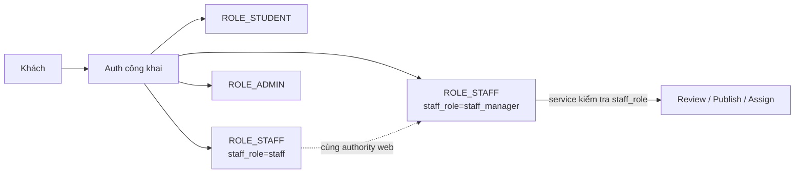

Spring Security bảo vệ `/api/admin/**`, `/api/staff/**`, `/api/manager/**` theo authority. Với chức năng Manager, service tiếp tục kiểm tra `staff_role` để phân biệt Staff thường và StaffManager.

---

## 3. System Context

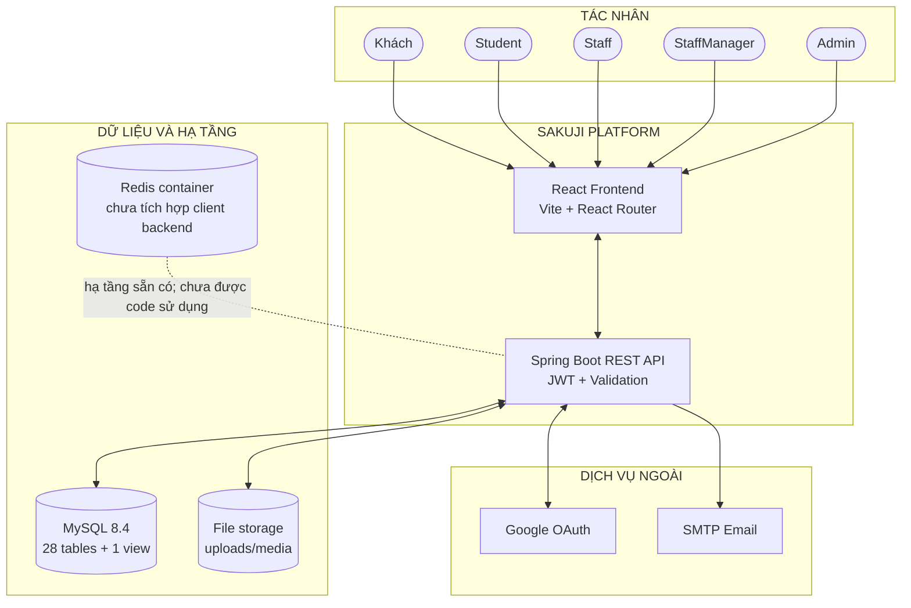

### 3.1. Giao tiếp

- Frontend gọi REST API bằng Axios và gửi JWT Bearer.
- Backend truy cập MySQL qua Spring Data JPA.
- Flyway chạy migration trước khi Hibernate validate mapping.
- Email lỗi sau retry được ghi vào `email_outbox` để xử lý lại.
- Media được lưu ngoài DB; bảng chỉ giữ URL hoặc path.
- Redis có trong Docker Compose nhưng backend hiện chưa có `spring-boot-starter-data-redis`/`RedisTemplate`.

---

## 4. Các luồng nghiệp vụ chính

### 4.1. Xác thực

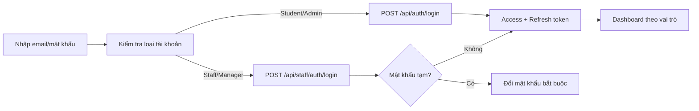

Student đăng ký bằng email phải xác minh OTP. Staff được Admin tạo và có luồng thiết lập/đổi mật khẩu tạm riêng.

### 4.2. Duyệt và xuất bản nội dung

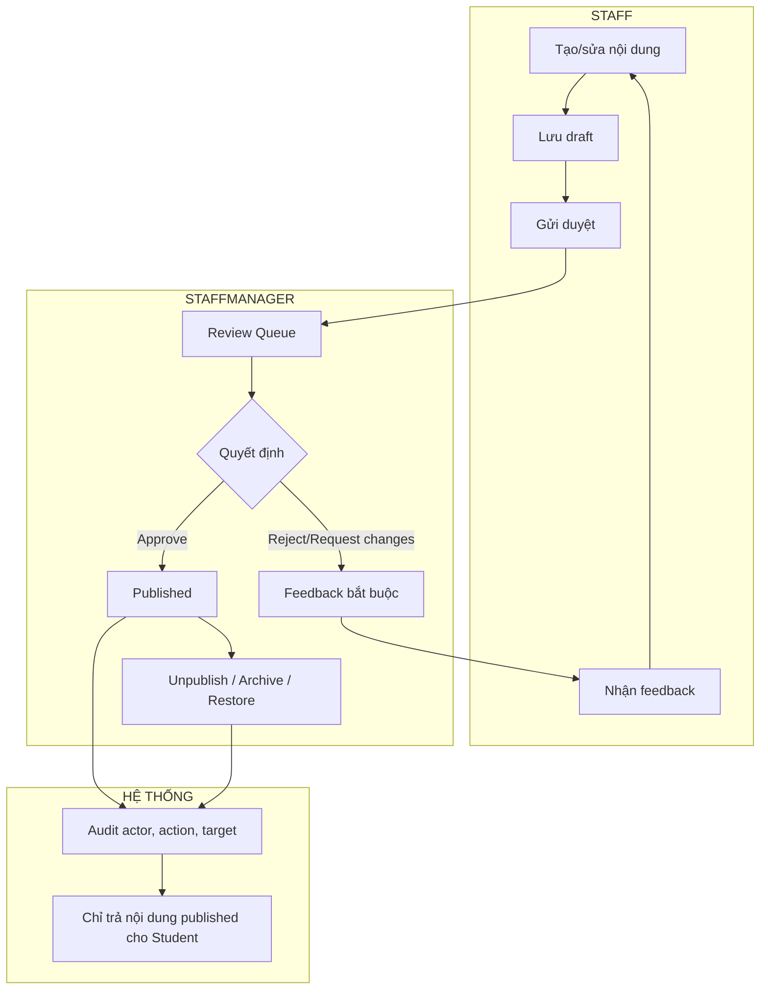

Các loại nội dung tham gia review hiện gồm lesson, grammar, vocabulary, Kanji, question và assessment. Backend ngăn Manager tự duyệt nội dung mình tạo và phát hiện xung đột cập nhật đồng thời.

### 4.3. Quiz và đề thi thử

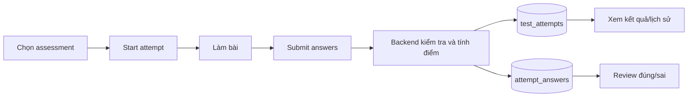

Điểm số được backend tính từ question/assignment. Client không gửi điểm cuối.

### 4.4. Speaking

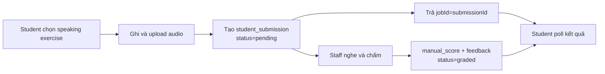

API giữ mô hình submit/poll bất đồng bộ, nhưng code hiện tại chưa gọi speech-recognition engine; submission chờ Staff chấm thủ công.

### 4.5. Luyện viết Kanji

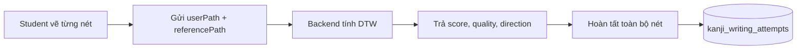

Đây là so khớp hình học đường nét DTW, không phải OCR nhận dạng ảnh và không phân tích stroke order bằng mô hình AI.

### 4.6. Ticket hỗ trợ

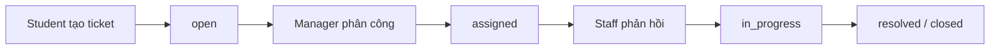

Mọi reply xác định đúng một sender là Student hoặc Staff.

---

## 5. Tổng hợp 40 Use Case

Hệ thống có **40 use case as-built**, chia thành: xác thực chung 5, Student 17, Staff 10, StaffManager 4 và Admin 4.

### 5.1. Xác thực chung — UC-01 đến UC-05

| Mã | Use case |
| :--- | :--- |
| UC-01 | Đăng ký và xác minh email |
| UC-02 | Đăng nhập theo loại tài khoản |
| UC-03 | Làm mới phiên và đăng xuất |
| UC-04 | Quên và đặt lại mật khẩu |
| UC-05 | Thiết lập và khôi phục mật khẩu Staff |

### 5.2. Student — UC-06 đến UC-22

| Mã | Use case | Mã | Use case |
| :--- | :--- | :--- | :--- |
| UC-06 | Onboarding mục tiêu học | UC-15 | Thi thử và xem kết quả |
| UC-07 | Dashboard/thống kê cá nhân | UC-16 | Flashcard SRS |
| UC-08 | Hồ sơ và bảo mật | UC-17 | Notebook từ vựng |
| UC-09 | Khóa học/bài học | UC-18 | Tra từ điển |
| UC-10 | Học Kana | UC-19 | Luyện nói và nhận kết quả |
| UC-11 | Học từ vựng | UC-20 | Tiến độ học tập |
| UC-12 | Học ngữ pháp | UC-21 | Ticket hỗ trợ |
| UC-13 | Kanji và luyện viết DTW | UC-22 | Thông báo cá nhân |
| UC-14 | Làm Quiz |  |  |

### 5.3. Staff — UC-23 đến UC-32

| Mã | Use case |
| :--- | :--- |
| UC-23 | Dashboard Staff |
| UC-24 | Theo dõi/khóa/kích hoạt Student |
| UC-25 | Ngân hàng câu hỏi |
| UC-26 | Nội dung ngữ pháp |
| UC-27 | Lesson, vocabulary, Kanji, topic và speaking content |
| UC-28 | Quản lý Quiz |
| UC-29 | Quản lý đề thi thử |
| UC-30 | Gửi duyệt và xem feedback |
| UC-31 | Xử lý ticket và gửi broadcast |
| UC-32 | Chấm bài Speaking |

### 5.4. StaffManager — UC-33 đến UC-36

| Mã | Use case |
| :--- | :--- |
| UC-33 | Duyệt nội dung trong Review Queue |
| UC-34 | Quản lý trạng thái xuất bản |
| UC-35 | Khôi phục nội dung xóa mềm |
| UC-36 | Điều phối ticket và truyền thông |

### 5.5. Admin — UC-37 đến UC-40

| Mã | Use case |
| :--- | :--- |
| UC-37 | Dashboard và audit log |
| UC-38 | Quản lý người dùng |
| UC-39 | Cài đặt hệ thống |
| UC-40 | Quy tắc thông báo |

Chi tiết tiền điều kiện, luồng chính và luồng thay thế xem tại [`Bao_cao_dac_ta_Use_Case.md`](01-SRS-Requirements/use-cases/Bao_cao_dac_ta_Use_Case.md).

---

## 6. Thiết kế hệ thống

### 6.1. Kiến trúc tổng thể

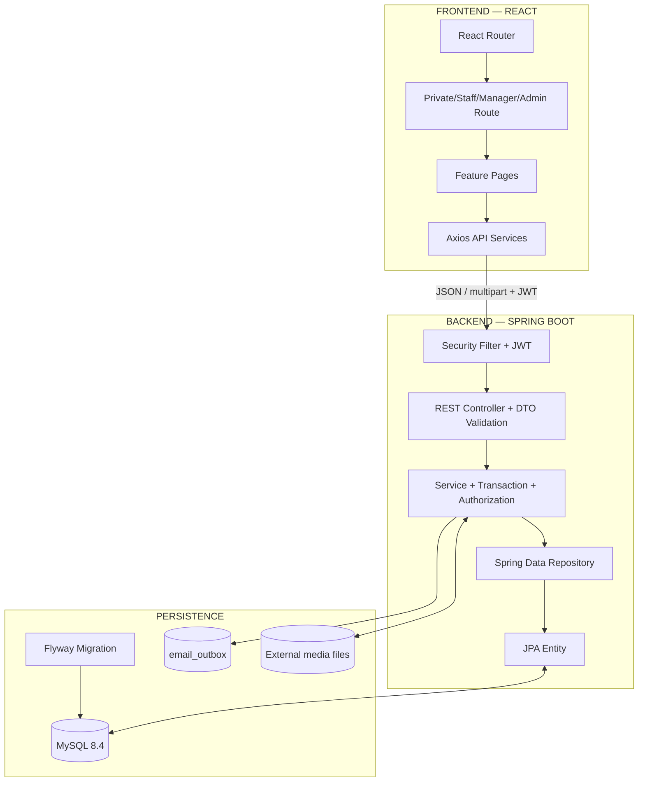

### 6.2. Backend theo feature

| Module | Trách nhiệm |
| :--- | :--- |
| `auth` | Login/register/token/reset/profile authentication |
| `student` | Dashboard, hồ sơ, Kana, Kanji, lesson và progress |
| `learning` | Vocabulary, topic và grammar entity/service dùng chung |
| `assessment` | Question, assessment, attempt, answer và submission |
| `flashcard` | Deck, card, SRS và notebook |
| `speaking` | Speaking lesson/question, upload và submission result |
| `dictionary` | Tìm kiếm nội dung học |
| `support` | Ticket, reply và Staff grading |
| `notification` | Inbox và broadcast |
| `staffcontent` | Staff authoring và quản lý Student |
| `contentreview` | Review Queue và quyết định duyệt |
| `publishedcontent` | Publish/archive/delete/restore |
| `admin` | User management, dashboard, settings và audit |
| `shared` | Security, config, exception, email và API response |

### 6.3. Tech stack

| Lớp | Công nghệ hiện tại |
| :--- | :--- |
| Backend | Spring Boot 3.3.3, Java 21 |
| Security | Spring Security, JJWT, bcrypt |
| Persistence | Spring Data JPA, Hibernate, Flyway |
| Database | MySQL 8.4, InnoDB, utf8mb4 |
| API docs | springdoc-openapi 2.6 |
| Mapping | MapStruct 1.6.3 và mapping thủ công tùy module |
| Frontend | React 18.3.1, Vite 5.4, React Router 6.26 |
| Client state/forms | Redux Toolkit, React Hook Form, Zod |
| HTTP | Axios |
| UI learning | Hanzi Writer cho dữ liệu/vẽ Kanji phía client |
| Test frontend | Vitest, Testing Library |
| Container | Docker Compose |

### 6.4. Quy tắc frontend/backend

- Frontend chỉ render dữ liệu, quản lý UI state và validation UX.
- Backend xác thực, phân quyền, validation nghiệp vụ, tính điểm và ghi audit.
- Route guard cải thiện UX nhưng không thay thế Spring Security.
- API response chuẩn gồm `status`, `message`, `data`.
- Lỗi tập trung qua exception handler.

---

## 7. Thiết kế dữ liệu

Database hiện có **28 bảng và 1 view**, được quản lý bởi migration mới nhất `V32__replace_email_body_with_text.sql`.

### 7.1. Nhóm bảng

| Nhóm | Bảng |
| :--- | :--- |
| User/Auth | `admin_users`, `staff_users`, `staff_password_reset_requests`, `student_users`, `auth_tokens` |
| Learning content | `lessons`, `kana_characters`, `kanji`, `kanji_writing_attempts`, `vocabulary_topics`, `vocabulary`, `grammar_points`, `speaking_questions` |
| Assessment | `questions`, `assessments`, `question_assignments`, `test_attempts`, `attempt_answers`, `student_submissions` |
| Progress/Flashcard | `student_content_progress`, `flashcard_decks`, `flashcards` |
| Support/Notification | `tickets`, `ticket_replies`, `notifications` |
| System | `system_settings`, `admin_audit_logs`, `email_outbox` |
| View | `vw_student_learning_stats` |

### 7.2. Domain model rút gọn

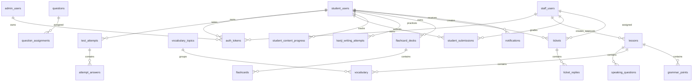

### 7.3. Quan hệ đa hình

Một số quan hệ dùng type + ID và được service bảo đảm toàn vẹn:

- `question_assignments(parent_type, parent_id)`
- `test_attempts(parent_type, parent_id)`
- `student_content_progress(content_type, content_id)`
- `flashcards(content_type, content_id)`
- `admin_audit_logs(target_table, target_id)`

### 7.4. Lưu ý quan trọng

- Không có bảng `courses`.
- Flashcard deck là bảng riêng, không gộp vào card.
- `student_submissions` không có cột persisted `final_score`; service chọn manual score nếu có.
- `kanji_writing_attempts.kanji_id` hiện có index nhưng chưa có FK.
- Điểm từng phần thi nằm ở ba cột riêng, không lưu JSON.

Chi tiết cột, constraint, index và migration xem [`JLPT_database.md`](02-SDD-Architecture/database-design/JLPT_database.md).

---

## 8. Screen Flow

Các route được tổng hợp từ `apps/frontend/src/App.jsx`.

```mermaid
flowchart TB
    Start(["Truy cập"]) --> Home["/"]
    Home --> Login["/login"]
    Home --> Register["/register"]
    Register --> Verify["/verify-email"]
    Login --> Forgot["/forgot-password<br/>/reset-password"]

    Login -->|Student| StudentHome
    Login -->|Staff| StaffHome
    Login -->|StaffManager| ManagerHome
    Login -->|Admin| AdminHome

    subgraph StudentRoutes["STUDENT — PrivateRoute"]
        StudentHome["/dashboard"]
        StudentHome --> Onboarding["/onboarding"]
        StudentHome --> Profile["/profile<br/>/settings/change-password<br/>/settings/change-email"]
        StudentHome --> Courses["/courses<br/>/lessons/:id"]
        StudentHome --> Kana["/kana"]
        StudentHome --> Kanji["/kanji<br/>/kanji/:id"]
        StudentHome --> Vocab["/vocabulary<br/>/vocabulary/flashcard"]
        StudentHome --> Grammar["/grammar"]
        StudentHome --> Quiz["/quiz"]
        StudentHome --> Mock["/mock-test<br/>attempt/results"]
        StudentHome --> Speaking["/speaking"]
        StudentHome --> Dictionary["/dictionary"]
        StudentHome --> Notebook["/notebook"]
        StudentHome --> Progress["/progress"]
        StudentHome --> Support["/support<br/>/support/tickets/:ticketId"]
        StudentHome --> Notifications["/notifications"]
    end

    subgraph StaffRoutes["STAFF — StaffRoute"]
        StaffHome["/staff"]
        StaffHome --> StaffContent["/staff/content"]
        StaffHome --> StaffQuestions["/staff/questions"]
        StaffHome --> StaffAssessments["/staff/assessments"]
        StaffHome --> StaffTickets["/staff/tickets"]
        StaffHome --> StaffGrading["/staff/grading"]
        StaffHome --> StaffStudents["/staff/students"]
    end

    subgraph ManagerRoutes["STAFFMANAGER — ManagerRoute"]
        ManagerHome["/manager"]
        ManagerHome --> Review["/manager/review-queue"]
        ManagerHome --> Pipeline["/manager/content-pipeline"]
        ManagerHome --> Trash["/manager/deleted-topics"]
        ManagerHome --> MNotification["/manager/notifications"]
        ManagerHome --> MTickets["/manager/tickets"]
    end

    subgraph AdminRoutes["ADMIN — AdminRoute"]
        AdminHome["/admin"]
        AdminHome --> Users["/admin/users"]
        AdminHome --> Settings["/admin/settings"]
        AdminHome --> Reports["/admin/reports"]
    end
```

### 8.1. Route công khai bổ sung

- `/tinh-nang`
- `/blog`
- `/staff/forgot-password`
- `/staff/setup-password`
- `/staff/change-temp-password`
- `/403`
- Route không tồn tại → trang 404

Route quản trị được lazy-load để không tăng bundle ban đầu của Student.

---

## 9. Giới hạn triển khai hiện tại

Các nội dung sau không được xem là chức năng hoàn chỉnh để nghiệm thu:

- Không có module Reading Practice hoặc Listening Practice độc lập trên frontend/API.
- Không có bookmark tổng quát cho mọi nội dung; notebook hiện tập trung vào từ/flashcard.
- Trang `/admin/reports` hiện hiển thị audit log, chưa tạo báo cáo học tập tùy biến hoặc xuất PDF/CSV/Excel.
- Backend có API notification rule nhưng chưa có route Admin riêng cho màn hình quản lý rule.
- Speaking dùng submit/poll nhưng chưa tích hợp speech-recognition engine; kết quả hiện dựa trên Staff grading.
- Luyện viết Kanji dùng DTW, không phải OCR ảnh.
- Redis mới tồn tại trong Docker Compose, chưa được backend sử dụng làm cache/session/rate limit.
- Không có entity/bảng `courses`.

Tài liệu này phải được cập nhật cùng lúc khi thay đổi lớn về route, controller, workflow hoặc Flyway migration.
