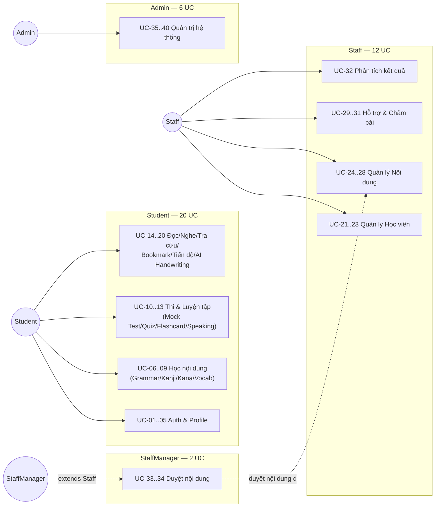

# Overall Functionalities & Appendix (bổ sung theo Template2/RDS)

> Bổ sung các mục **❌/⚠️** còn thiếu được liệt kê tại [`SPEC-rds-template-generation-guide.md § 3 & § 7`](SPEC-rds-template-generation-guide.md) — tương ứng Template2 mục **I.1.2.a, I.2, IV**. Không lặp lại nội dung đã có sẵn ở `use-cases/`, `constraints/`, `SDS-Japanese-Skill-Practice-Platform.md` (trỏ link khi cần).
> Dữ liệu lấy từ code thật: routes tại `apps/frontend/src/App.jsx`, route-guard tại `apps/frontend/src/components/common/*Route.jsx`, `@PreAuthorize` tại backend controllers, `constraints/business.md`, `CLAUDE.md`.

---

## I.1.2.a — Use Case Diagram

Sơ đồ actor-UC tổng quan, nhóm theo 4 role (chi tiết từng UC xem [`use-cases/Bao_cao_dac_ta_Use_Case.md`](use-cases/Bao_cao_dac_ta_Use_Case.md)):

> `StaffManager` là `Staff` với `staff_role = staff_manager` (không phải actor tách biệt ở tầng account) — xem `ManagerRoute.jsx` và Mục "Screen Authorization" bên dưới.

---

## I.2.1 — Screens Flow

Sơ đồ tổng quan (route thật trong `App.jsx`), nhóm theo cụm chức năng — không vẽ hết mọi cạnh điều hướng chi tiết (40+ route), chỉ thể hiện luồng chính từ điểm vào của mỗi role:

```mermaid
graph TD
    Home["/  (Home)"] --> Login["/login"]
    Home --> Register["/register"]
    Login --> Dashboard["/dashboard"]
    Register --> VerifyEmail["/verify-email"] --> Login
    Login -->|"Forgot?"| Forgot["/forgot-password"] --> Reset["/reset-password"]

    subgraph STU["Student area (PrivateRoute)"]
        Dashboard --> Lessons["/lessons/:id"]
        Dashboard --> MockTest["/mock-test"] --> MTAttempt["/mock-test/:id/attempt"] --> MTResult["/mock-test/:id?/results"]
        Dashboard --> Kanji["/kanji"] --> KanjiPractice["/kanji/:id"]
        Dashboard --> Vocab["/vocabulary"] --> Flashcard["/vocabulary/flashcard"]
        Dashboard --> Quiz["/quiz"]
        Dashboard --> Speaking["/speaking"]
        Dashboard --> Grammar["/grammar"]
        Dashboard --> Kana["/kana"]
        Dashboard --> Dictionary["/dictionary"]
        Dashboard --> Notebook["/notebook"]
        Dashboard --> Progress["/progress"]
        Dashboard --> Support["/support"] --> TicketDetail["/support/tickets/:id"]
        Dashboard --> Profile["/profile"]
    end

    Login -->|"tài khoản Staff"| StaffDash["/staff"]
    subgraph STF["Staff area (StaffRoute)"]
        StaffDash --> StaffContent["/staff/content"]
        StaffDash --> StaffQuestions["/staff/questions"]
        StaffDash --> StaffAssessments["/staff/assessments"]
        StaffDash --> StaffGrading["/staff/grading"]
        StaffDash --> StaffTickets["/staff/tickets"]
        StaffDash --> StaffStudents["/staff/students"]
    end

    Login -->|"tài khoản staff_manager"| MgrDash["/manager"]
    subgraph MGR["Manager area (ManagerRoute)"]
        MgrDash --> ReviewQueue["/manager/review-queue"]
        MgrDash --> ContentPipeline["/manager/content-pipeline"]
        MgrDash --> DeletedTopics["/manager/deleted-topics"]
        MgrDash --> MgrTickets["/manager/tickets"]
    end

    Login -->|"tài khoản Admin"| AdminDash["/admin"]
    subgraph ADM["Admin area (AdminRoute)"]
        AdminDash --> AdminUsers["/admin/users"]
        AdminDash --> AdminSettings["/admin/settings"]
        AdminDash --> AdminReports["/admin/reports"]
    end
```

---

## I.2.2 — Screen Descriptions

| # | Feature | Screen (Route) | Description |
|---|---|---|---|
| 1 | Auth | `/login`, `/register`, `/forgot-password`, `/reset-password`, `/verify-email` | Đăng nhập/đăng ký/khôi phục mật khẩu — dùng chung cho Student; Staff có bộ riêng (`/staff/forgot-password`, `/staff/setup-password`, `/staff/change-temp-password`) |
| 2 | Student — Dashboard | `/dashboard`, `/onboarding`, `/profile`, `/settings/*` | Trang chủ sau đăng nhập, thiết lập ban đầu, hồ sơ, đổi mật khẩu/email |
| 3 | Student — Học nội dung | `/lessons/:id`, `/kanji`, `/kanji/:id`, `/grammar`, `/kana`, `/vocabulary`, `/dictionary` | Xem bài học, luyện viết Kanji (canvas), học ngữ pháp/kana/từ vựng, tra từ điển |
| 4 | Student — Ôn tập & Thi | `/notebook`, `/vocabulary/flashcard`, `/quiz`, `/mock-test`, `/mock-test/:id/attempt`, `/mock-test/:id?/results` | Sổ tay flashcard (SRS), quiz theo chủ đề, danh sách/làm/xem kết quả mock test |
| 5 | Student — Kỹ năng khác | `/reading`, `/speaking`, `/progress` | Luyện đọc, luyện nói (Shadowing + AI chấm), xem tiến độ học tập |
| 6 | Student — Hỗ trợ | `/support`, `/support/tickets/:id`, `/notifications` | Gửi/theo dõi ticket hỗ trợ, xem thông báo |
| 7 | Staff — Dashboard | `/staff` | Tổng quan công việc Staff |
| 8 | Staff — Soạn nội dung | `/staff/content`, `/staff/questions`, `/staff/assessments` | CRUD bài học/ngữ pháp/từ vựng, ngân hàng câu hỏi, quiz/đề thi (trạng thái nháp → gửi duyệt) |
| 9 | Staff — Vận hành | `/staff/grading`, `/staff/tickets`, `/staff/students` | Chấm bài nói (UC-31), trả lời ticket, theo dõi/quản lý học viên |
| 10 | Manager — Dashboard | `/manager` | Tổng quan hàng đợi duyệt |
| 11 | Manager — Duyệt nội dung | `/manager/review-queue`, `/manager/content-pipeline`, `/manager/deleted-topics` | Duyệt/từ chối/yêu cầu sửa nội dung Staff gửi, xem pipeline, khôi phục nội dung đã xoá mềm |
| 12 | Manager — Khác | `/manager/notifications`, `/manager/tickets` | Thông báo, ticket (chia sẻ 1 phần route với Staff) |
| 13 | Admin — Dashboard | `/admin` | Thống kê hệ thống |
| 14 | Admin — Quản trị | `/admin/users`, `/admin/settings`, `/admin/reports` | Quản lý người dùng, cấu hình hệ thống, báo cáo |

---

## I.2.3 — Screen Authorization

Repo có **2 lớp** kiểm tra quyền, phải khớp nhau (đối chiếu thật, không suy đoán):

- **Frontend (UX-only, KHÔNG phải bảo mật thật)**: route-guard trong `apps/frontend/src/components/common/{PrivateRoute,StaffRoute,ManagerRoute,AdminRoute}.jsx`.
- **Backend (bảo mật thật)**: `@PreAuthorize("hasRole('...')")` trên từng Controller — theo đúng ghi chú trong `ManagerRoute.jsx`: *"nếu `user.role` trong localStorage bị chỉnh sửa thủ công, request thật vẫn bị backend chặn 401/403"*.

| Khu vực màn hình | Guard Frontend | `@PreAuthorize` Backend | Ghi chú |
|---|---|---|---|
| Public (`/`, `/tinh-nang`, `/blog`, `/login`, `/register`...) | Không guard | Endpoint public (`/api/auth/*`) | — |
| Student area (`/dashboard`, `/kanji`, `/quiz`...) | `PrivateRoute` (yêu cầu đã đăng nhập) | `hasRole('STUDENT')` (từng controller: `StudentAssessmentController`, `StudentFlashcardController`, `StudentKanjiController`, `SpeakingController`, `SupportController`...) | Subscription/JLPT-level check (`BIZ-AUTH-03`) nằm ở **Service layer**, không phải route-guard |
| Staff area (`/staff/*`) | `StaffRoute` (`user.role === 'STAFF'`) | `hasRole('STAFF')` (`StaffMemberController`, `StaffQuestionController`, `StaffQuizController`, `StaffGradingController`...) | Áp dụng cho mọi `staff_role` (kể cả `staff_manager`) |
| Manager area (`/manager/*`) | `ManagerRoute` (`role==='STAFF' && staffRole==='staff_manager'`, hoặc `role==='ADMIN'`) | `hasRole('STAFF')` ở `ManagerReviewController`/`ManagerDeletedContentController`, **thu hẹp thêm** xuống đúng `staff_manager` ở tầng Service (`ContentReviewService.requireManager()` → 403 nếu không phải `STAFF_MANAGER` active) | **Không phải mismatch** — có chủ đích: web layer chặn thô theo Role, Service layer chặn tinh theo `staff_role` (đã ghi rõ trong comment `ManagerReviewController.java`) |
| Admin area (`/admin/*`) | `AdminRoute` | `hasRole('ADMIN')` (`AdminController`, `AdminAuditLogController`, `AdminDashboardController`, `AdminSettingsController`, `AdminNotificationRuleController`) | — |

> Không phát hiện lệch giữa 2 lớp tại thời điểm khảo sát (2026-07). Nếu lần sau phát hiện lệch (route-guard cho phép nhưng `@PreAuthorize` chặn hoặc ngược lại), ghi nhận là **bug**, không tự chọn 1 bên làm chuẩn.

---

## I.2.4 — Non-UI Functions

| # | Feature | System Function | Description |
|---|---|---|---|
| 1 | Speaking (UC-13) | `SpeakingAsyncProcessor.process()` | `@Async` — xử lý chấm điểm phát âm sau khi Student nộp bản ghi âm, không block request nộp bài (tuân `BIZ-AI-04`) |
| 2 | Auth (UC-02, UC-03) | `AuthEventListener.onSendVerificationEmailEvent()` | Gửi email xác minh tài khoản (bất đồng bộ qua Spring Event) sau khi đăng ký |
| 3 | Auth (UC-03) | `AuthEventListener.onSendPasswordResetEmailEvent()` | Gửi email reset mật khẩu (bất đồng bộ) |
| 4 | Notification (UC-30, UC-40) | `NotificationDispatcher` (`@Async` fan-out) | Gửi thông báo tới nhiều Student cùng lúc mà không block request tạo notification của Staff/Admin |
| 5 | Notification / Email Outbox | `NotificationDispatcher.deliverPendingEmails()` | `@Scheduled(fixedDelay = 60_000)` — job chạy mỗi 60s, retry gửi lại email trong hàng đợi (`email_outbox`) mà lần gửi trước thất bại |

---

## IV.1 — Assumptions & Dependencies

> Bản nháp đầu tiên, suy ra từ ADR trong `CLAUDE.md` và code thật — **cần team xác nhận lại**, không coi là chốt cuối cùng.

- **AS-1**: Người dùng truy cập qua trình duyệt hiện đại hỗ trợ Web Audio API (bắt buộc cho luyện nói/ghi âm) và Canvas (bắt buộc cho luyện viết Kanji).
- **AS-2**: Email thật (SMTP) khả dụng để gửi xác minh/reset mật khẩu — hệ thống có cơ chế `email_outbox` + retry (`NotificationDispatcher`), không giả định gửi thành công ngay lần đầu.
- **DE-1 (Google OAuth)**: Đăng nhập Google phụ thuộc `GOOGLE_CLIENT_ID` cấu hình đúng (`AuthenticationService.loginWithGoogle`) — nếu Google đổi API, cần cập nhật `GoogleIdTokenVerifier`.
- **DE-2 (Kiến trúc Monolith — ADR-002)**: Toàn bộ feature chạy trong 1 Spring Boot app; tách AI module ra service riêng là hướng tương lai, chưa thực hiện.
- **DE-3 (File Storage — ADR-006)**: File ảnh Kanji viết tay/audio luyện nói lưu tại `/uploads` hoặc S3, không lưu BLOB trong DB.

## IV.2 — Limitations & Exclusions

> Giới hạn thật của bản hiện tại, xác nhận trực tiếp từ code — không phải giả định.

- **Engine chấm phát âm (Speaking/UC-13) hiện là bản mô phỏng (`StubSpeechRecognitionEngine`), chưa tích hợp dịch vụ ASR/AI thật.** Điểm số sinh tất định từ độ dài file audio + nội dung câu mẫu (xem docstring của class), **không phải** kết quả nhận diện giọng nói thực sự. Khi có engine ASR thật, cần thêm 1 implementation khác đánh dấu `@Primary`.
- **OCR Kanji không phân tích thứ tự nét** (chỉ so khớp hình dạng nét vẽ bằng DTW) — đúng chủ đích theo `ADR-007`, không phải thiếu sót.
- Chưa có ví dụ giám sát mismatch giữa Frontend route-guard và Backend `@PreAuthorize` (xem Mục I.2.3) — cần quy trình review định kỳ nếu team mở rộng thêm route mới.

---

## IV.3 — Business Rules (định dạng Template2: `ID / Category / Rule Definition`)

Bộ đầy đủ **~30 rule** (8 nhóm) đã có sẵn tại [`constraints/business.md`](constraints/business.md) theo format `ID / Rule / Rationale`. Không copy lại toàn bộ ở đây (tránh 2 nguồn lệch nhau khi 1 bên cập nhật) — bảng dưới chỉ ánh xạ **Category** (cột Template2 yêu cầu mà file gốc không có) sang đúng heading trong file đó:

| Category (Template2) | Mục trong `constraints/business.md` | Số rule |
|---|---|---|
| Authentication & Authorization | § 1 | 6 (`BIZ-AUTH-01`→`06`) |
| Subscription & Monetization | § 2 | 4 (`BIZ-SUB-01`→`04`) |
| Điểm số & Bài thi | § 3 | 7 (`BIZ-EXAM-01`→`07`) |
| Lộ trình học | § 4 | 3 (`BIZ-PATH-01`→`03`) |
| Quy trình Nội dung | § 5 | 3 (`BIZ-CONTENT-01`→`03`) |
| AI Features | § 6 | 5 (`BIZ-AI-01`→`05`) |
| Dữ liệu & Audit | § 7 | 4 (`BIZ-DATA-01`→`04`) |
| Hỗ trợ & Thông báo | § 8 | 2 (`BIZ-SUPPORT-01`→`02`) |

> Khi trích 1 Business Rule cho 1 UC cụ thể (Template2 mục II.*.b), lấy đúng `ID` ở đây và copy nguyên văn `Rule` từ `constraints/business.md`, không diễn giải lại.
