# SOFTWARE REQUIREMENT SPECIFICATION

**Project Name:** Japanese Skill Practice Platform  
**Version:** 1.0  
**Location/Date:** Hanoi, July 2026  
**Template:** `Guides  Templates-20260721/Template1_SRS Document.docx`

**Table of Contents**

- [I. Record of Changes](#i-record-of-changes)
- [II. Software Requirement Specification](#ii-software-requirement-specification)
- [1. Overall Requirements](#1-overall-requirements)
- [2. Use Case Specifications](#2-use-case-specifications)
- [3. Functional Requirements](#3-functional-requirements)
- [4. Non-Functional Requirements](#4-non-functional-requirements)
- [5. Requirement Appendix](#5-requirement-appendix)

# I. Record of Changes

| Date | A/M/D | In charge | Change Description |
| --- | --- | --- | --- |
| 2026-07-23 | A | AI Agent | Generated bilingual SRS according to Template1 DOCX structure. |
| 2026-07-23 | M | AI Agent | Revised to include missing Template1 sections: screen descriptions, fuller UC specifications, functional field descriptions, NFRs, appendix. |
| 2026-07-24 | M | AI Agent | Real Word Table of Contents field; split 1.2 into 6 sub-processes with swim-lane diagrams; added screen images to section 3 (real screenshots for Auth screens, wireframe mockups for screens requiring a logged-in session not reachable in the build environment). |
| 2026-07-24 | M | AI Agent | Expanded Use Case Specifications (section 2): longer step-by-step Normal Flow and named Alternative Flows for all 15 UC groups, written in simple, easy-to-understand English. |
| 2026-07-24 | M | AI Agent | Split 1.3.3 Use Case Diagrams into one diagram per actor (Guest, Student, Staff, StaffManager, Admin), matching Template1's per-actor layout; added Guest to the Actors table. |

*A - Added, M - Modified, D - Deleted*

# II. Software Requirement Specification

## 1. Overall Requirements

### 1.1 Context Diagram

Japanese Skill Practice Platform is a web-based JLPT learning and exam practice system from N5 to N1, built with React 18, Spring Boot 3/Java 21, and MySQL 8. It supports Kanji, Kana, vocabulary, grammar, SRS flashcards, quizzes, mock exams, OCR/Speech AI, student support, content review, and administration.

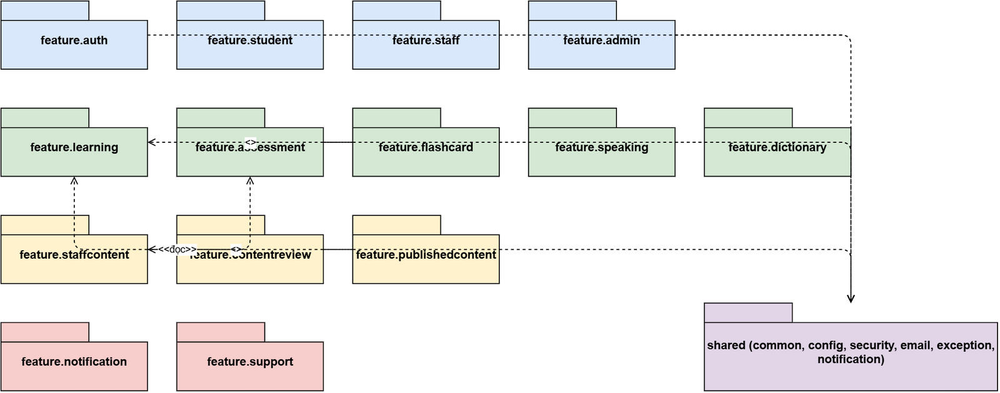

### 1.2 Main Business Processes

#### 1.2.1 Authentication and Account Lifecycle

Register, verify email, login, reset/change password, logout, token/session management.

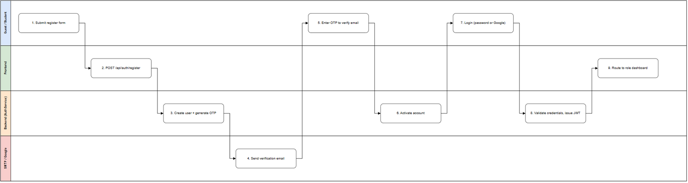

#### 1.2.2 Student Learning Path

Browse level content, unlock lessons by order, complete lessons, bookmark and track progress.

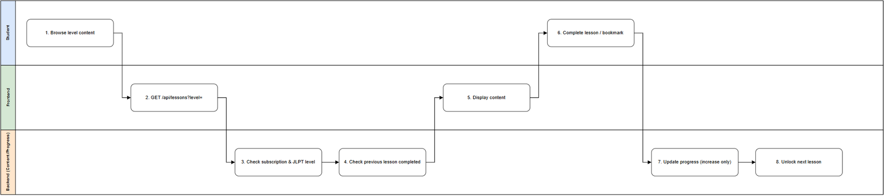

#### 1.2.3 Assessment and SRS Review

Take quizzes/mock exams, backend grading, immutable attempts, flashcard spaced repetition.

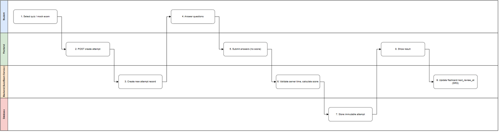

#### 1.2.4 AI Practice Processing

Upload image/audio, create asynchronous AI jobs, timeout/retry/fallback, poll result.

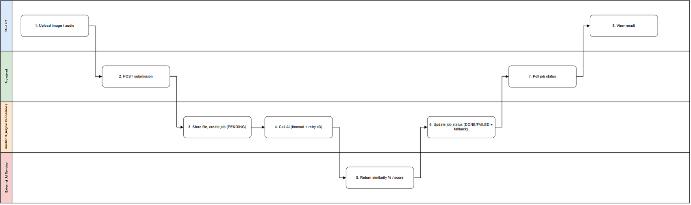

#### 1.2.5 Content Governance

Staff drafts content, StaffManager reviews and publishes, audit and notification.

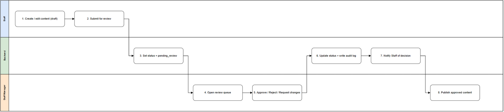

#### 1.2.6 System Administration

Manage users, settings, subscriptions, reports, and notification rules.

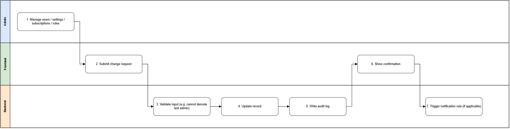

### 1.3 User Requirements

#### 1.3.1 Actors

| # | Actor | Description |
| --- | --- | --- |
| 1 | Guest | A not-yet-logged-in user who can register a new account, log in, or reset a password. |
| 2 | Student | End user who studies JLPT content, practices, takes exams, uses OCR/Speech AI, and tracks progress. |
| 3 | Staff | Content operator who manages learning content, question banks, quizzes/exams, support tickets, and speaking grading. |
| 4 | StaffManager | Content manager who reviews, rejects, requests changes, publishes, hides, or archives Staff submissions. |
| 5 | Admin | System administrator who manages users, configuration, reports, notification rules, and audit logs. |
| 6 | External AI Service | Asynchronous OCR and Speech Recognition services returning suggested AI results. |
| 7 | SMTP Server | Email delivery service for verification, password reset, and notifications. |

#### 1.3.2 Use Cases (UC)

| ID | Use Case | Feature | Use Case Description |
| --- | --- | --- | --- |
| UC-01 | User Login | Authentication | Authenticate by email/password or Google OAuth, issue JWT, and route to the role dashboard. |
| UC-02 | User Register | Authentication | Create a Student account, send email OTP, and activate the account. |
| UC-03 | Reset Password | Authentication | Send a reset email, validate the reset token, and update the password. |
| UC-04 | User Profile | Student Account | View and update personal profile, avatar, phone number, and target JLPT level. |
| UC-05 | Change Password | Student Account | Change password after validating the current password. |
| UC-06 | Learn Grammar | Core Learning | Study JLPT grammar with patterns, explanation, examples, and progress tracking. |
| UC-07 | Learn Kanji | Core Learning | Study Kanji by level, meaning, onyomi/kunyomi, stroke count, and examples. |
| UC-08 | Learn Kana | Core Learning | Study Hiragana/Katakana with pronunciation and recognition practice. |
| UC-09 | Vocabulary | Core Learning | Study vocabulary by lesson/topic/level and add items to flashcards/notebook. |
| UC-10 | Take JLPT Mock Test | Assessment | Take timed mock exams; backend grades and stores a new attempt. |
| UC-11 | Practice & Quiz | Assessment | Take lesson/topic quizzes; backend calculates score and returns results. |
| UC-12 | Flashcard Learning | SRS Review | Review flashcards using spaced repetition and update the next review schedule. |
| UC-13 | Speaking Practice & AI Grading | AI Skills | Submit speaking audio, receive a job_id, get AI suggestions, and allow Staff override. |
| UC-14 | Reading Practice | Skills Practice | Practice reading comprehension by level and store results. |
| UC-15 | Listening Practice | Skills Practice | Practice listening comprehension with audio and linked questions. |
| UC-16 | Dictionary & Search | Learning Tools | Search vocabulary, grammar, and Kanji with level filters. |
| UC-17 | Bookmark Learning | Learning Tools | Bookmark favorite or review-needed learning content. |
| UC-18 | Logout | Authentication | Log out and revoke/invalidate the current session token. |
| UC-19 | Learning Progress & Stats | Analytics | View progress, streaks, completion rate, and practice results. |
| UC-20 | AI Handwriting Practice | AI Skills | Submit handwritten Kanji image/canvas and receive asynchronous similarity %. |
| UC-21 | View Student Progress | Staff Student Management | View student progress for support and advising. |
| UC-22 | Manage Student Accounts | Staff Student Management | Manage student information within delegated permissions. |
| UC-23 | Suspend or Activate Account | Staff Student Management | Suspend or reactivate student accounts with audit trail. |
| UC-24 | Manage Question Bank | Content Management | Create/edit draft questions, answers, levels, and skills. |
| UC-25 | Manage Grammar Content | Content Management | Manage grammar content and submit it for review before publishing. |
| UC-26 | Manage Quiz | Content Management | Manage quizzes; lock attempted questions or create a new version. |
| UC-27 | Manage Learning Content | Content Management | Manage courses, lessons, Kanji, Kana, vocabulary, reading, listening, and speaking content. |
| UC-28 | Manage JLPT Mock Exams | Content Management | Create and manage JLPT mock exams by level and skill. |
| UC-29 | Respond to Student Support | Support | Receive and respond to student support tickets. |
| UC-30 | Send Notifications | Notification | Send in-app/email notifications to students or student groups. |
| UC-31 | Grade Speaking Submission | Manual Grading | Review audio, AI suggestions, final_score, and feedback. |
| UC-32 | View Quiz Results | Analytics | View quiz/mock exam results and question analytics. |
| UC-33 | Review Submitted Content | Content Review | Approve, reject, or request changes for pending_review content. |
| UC-34 | Manage Published Content Status | Content Review | Publish, unpublish, archive, or restore approved content. |
| UC-35 | Login System | Admin | Admin signs in to the administration area with a provisioned account. |
| UC-36 | View Dashboard | Admin | View system overview, users, content, activity, and assessments. |
| UC-37 | User Management | Admin | Manage Student, Staff, StaffManager, and Admin accounts and permissions. |
| UC-38 | Report Screen | Admin | View and export learning, system usage, and content reports. |
| UC-39 | Settings | Admin | Configure system settings, SMTP, sessions, maintenance, and operations parameters. |
| UC-40 | Notification Rules | Admin | Manage automated notification rules/templates by event. |

#### 1.3.3 Use Case Diagrams

##### 1.3.3.1 UCs for Guest

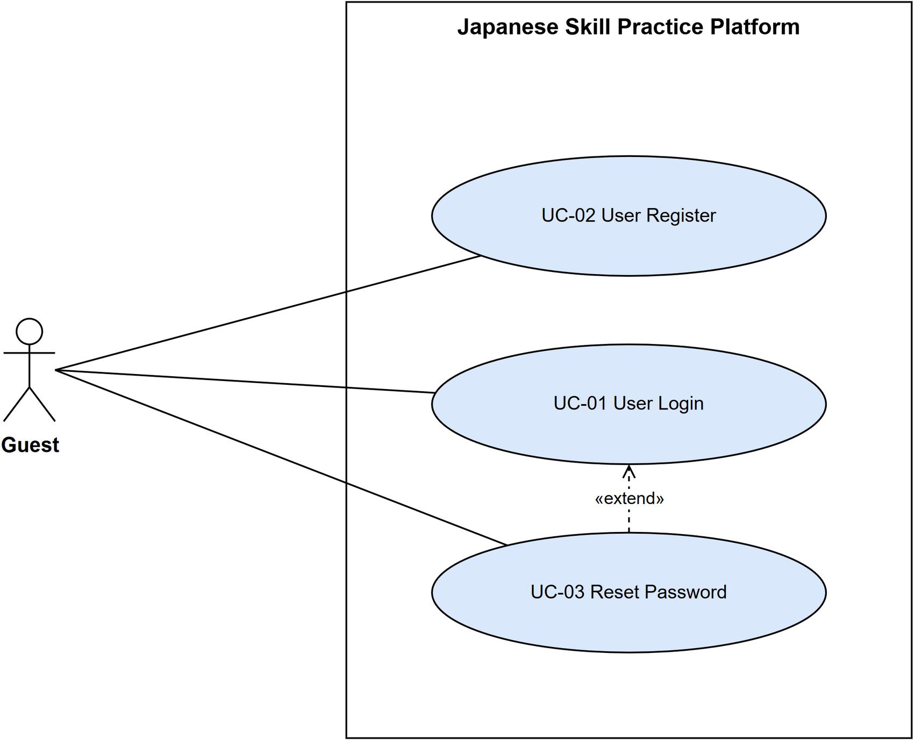

##### 1.3.3.2 UCs for Student

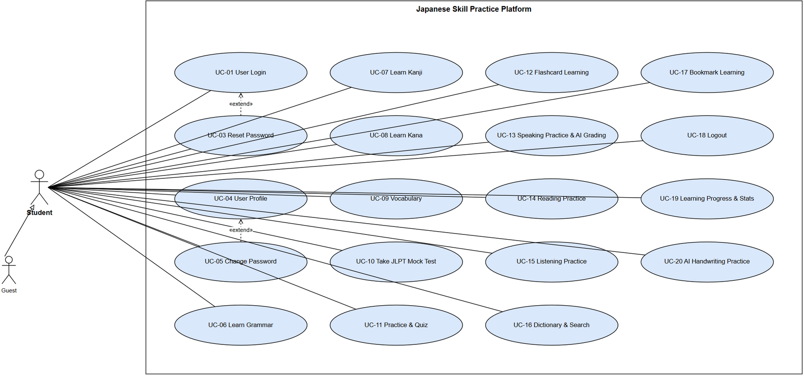

##### 1.3.3.3 UCs for Staff

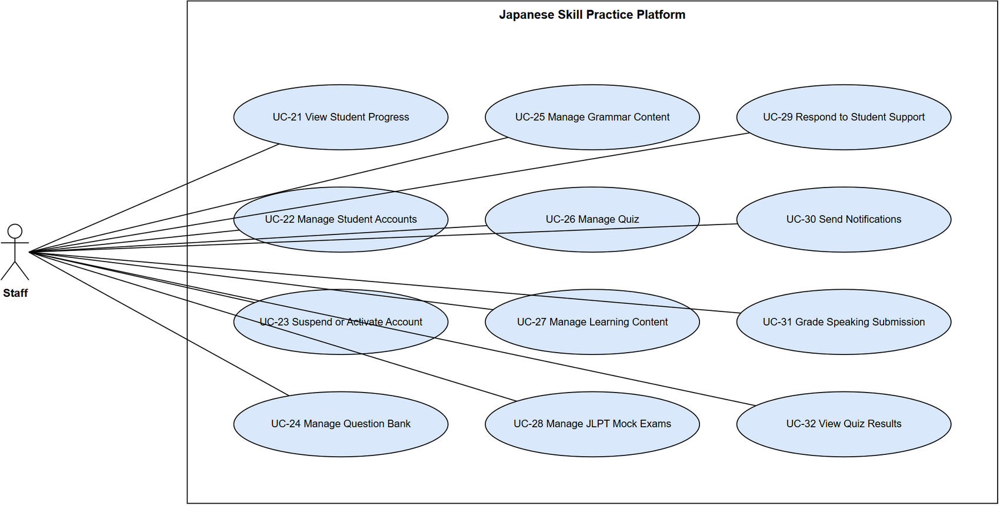

##### 1.3.3.4 UCs for StaffManager

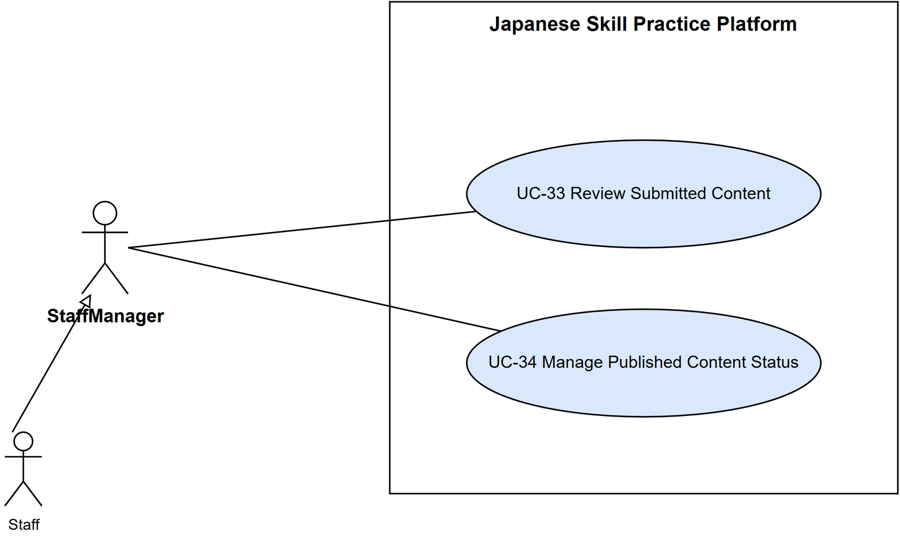

##### 1.3.3.5 UCs for Admin

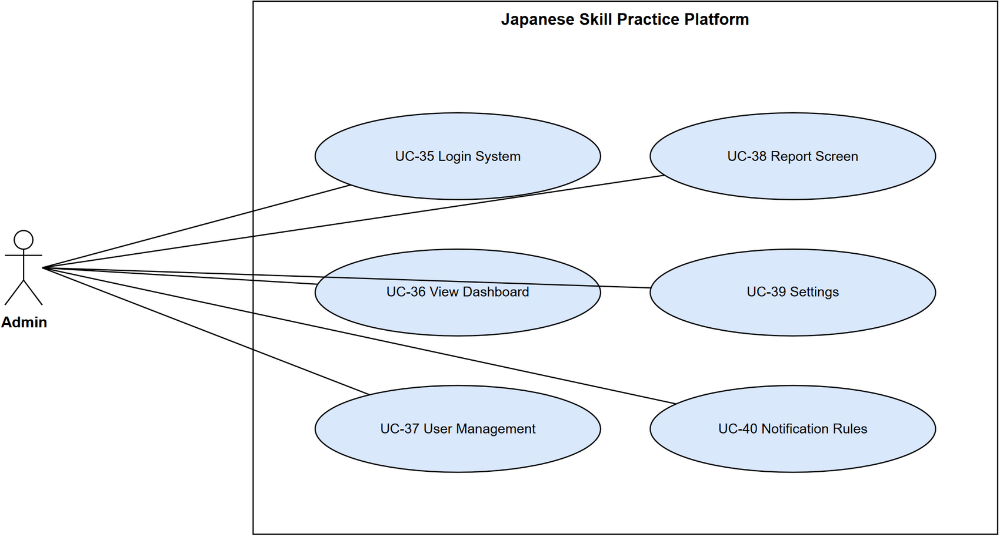

### 1.4 System Functionalities

#### 1.4.1 Screens Flow

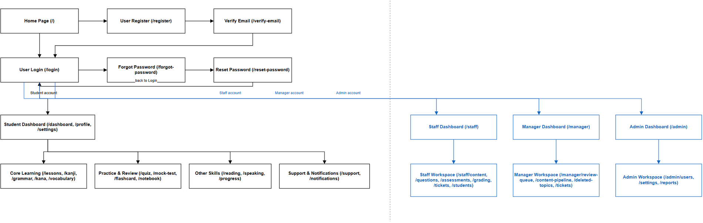

**Screen Descriptions**

| # | Feature | Screen (Route) | Description |
| --- | --- | --- | --- |
| 1 | Public & Auth | /, /login, /register, /forgot-password, /reset-password, /verify-email | System entry, authentication, registration, email verification, and password recovery. |
| 2 | Student Dashboard | /dashboard, /onboarding, /profile, /settings/* | Learning overview, profile, target setup, and account settings. |
| 3 | Core Learning | /lessons/:id, /kanji, /kanji/:id, /grammar, /kana, /vocabulary | Kanji, Kana, vocabulary, grammar, and JLPT-level lessons. |
| 4 | Assessment & Review | /quiz, /mock-test, /mock-test/:id/attempt, /mock-test/:id/results, /vocabulary/flashcard, /notebook | Quizzes/mock tests, results, SRS flashcards, and notebook. |
| 5 | AI Skills | /speaking, /kanji/:id/practice | Speaking audio practice and handwritten Kanji OCR/similarity practice. |
| 6 | Support & Notification | /support, /support/tickets/:id, /notifications | Support ticket submission, reply tracking, and notifications. |
| 7 | Staff Area | /staff/* | Content, questions, assessments, speaking grading, tickets, and student management. |
| 8 | Manager Area | /manager/* | Content review, content pipeline, soft-deleted content, and tickets. |
| 9 | Admin Area | /admin/* | Users, system settings, reports, and notification rules. |

#### 1.4.2 Screen Authorization

| Screen | Student | Staff | StaffManager | Admin | Notes |
| --- | --- | --- | --- | --- | --- |
| Public | X | X | X | X | Login/register/forgot/reset/home; public API only for /api/auth/* |
| Student dashboard & learning | X |  |  |  | Requires STUDENT role plus subscription/level checks. |
| Quiz, mock test, flashcard, AI practice | X |  |  |  | Score/time/AI validation handled server-side. |
| Staff dashboard/content/questions/assessments/grading |  | X |  |  | Requires STAFF role. |
| Manager review queue/content pipeline |  |  | X | X | Requires StaffManager or Admin; service layer validates staff_role. |
| Admin users/settings/reports/notification rules |  |  |  | X | Requires ADMIN role. |

#### 1.4.3 Non-UI Functions

| # | Feature | System Function | Description |
| --- | --- | --- | --- |
| 1 | Authentication | AuthEventListener | Sends verification and password reset emails asynchronously. |
| 2 | Speaking | SpeakingAsyncProcessor | Processes speaking submissions after request acceptance; exposes job/status polling. |
| 3 | Notification | NotificationDispatcher | Fans out in-app/email notifications and retries email outbox delivery. |
| 4 | Assessment | Quiz/Exam scoring service | Calculates score, validates time, creates new attempts, and writes audit. |
| 5 | Subscription | Subscription validation service | Validates VIP access in real time with at most 5-minute cache. |

### 1.5 Entity Relationship Diagram

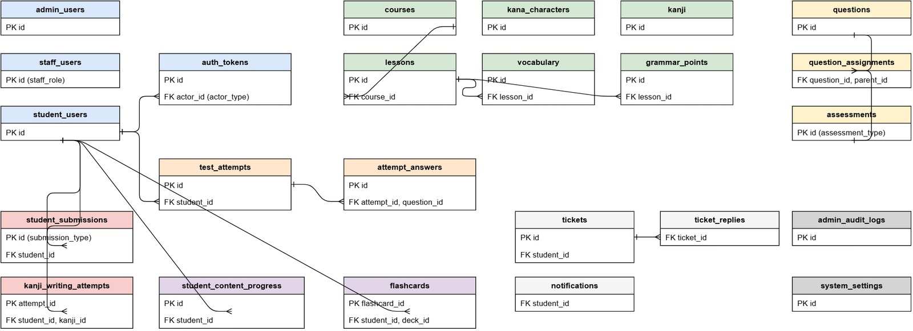

**Entities Description**

| # | Entity | Description |
| --- | --- | --- |
| 1 | student_users | Student accounts, OAuth, JLPT level, subscription, and learning statistics. |
| 2 | staff_users | Staff and StaffManager accounts, internal role, and status. |
| 3 | admin_users | System administrator accounts. |
| 4 | auth_tokens | Session, refresh token, email verification, and password reset. |
| 5 | courses | JLPT courses by level, status, and VIP flag. |
| 6 | lessons | Course lessons including lesson/reading/listening/speaking. |
| 7 | kanji / kana_characters / vocabulary / grammar_points | Core learning content. |
| 8 | questions / assessments / question_assignments | Question bank, quizzes, and mock exams. |
| 9 | test_attempts / attempt_answers | Assessment attempt history and answers. |
| 10 | student_submissions | Speaking/handwriting submissions, AI score suggestion, and final score. |
| 11 | student_content_progress / flashcards | Learning progress, bookmarks, and SRS flashcards. |
| 12 | tickets / ticket_replies / notifications / system_settings / admin_audit_logs | Support, notifications, settings, and audit. |

## 2. Use Case Specifications

### 2.1 Authentication

#### 2.1.1 UC-01 User Login

| Primary Actors | Student, Staff, StaffManager, Admin | Secondary Actors | Google OAuth Provider |
| --- | --- | --- | --- |
| Description | A user opens the login page and enters their email and password (or clicks Login with Google) to sign in. After a successful login, the system sends the user to the correct area for their role. |  |  |
| Preconditions | The user already has an account. The account is active and is not soft-deleted. |  |  |
| Postconditions | The user is logged in, the system saves a login record, and the user sees the correct home page for their role. |  |  |
| Normal Sequence/Flow | 1. The user opens the Login page. 2. The user types their email and password. 3. The user clicks the Login button. 4. The system checks the email and password. 5. The system checks that the account is active and not locked. 6. The system creates a JWT token and a refresh token. 7. The system saves a login record (audit log). 8. The system sends the user to the correct home page based on their role (Student, Staff, StaffManager, or Admin). |  |  |
| Alternative Sequences/Flows | Alt 1 - Login with Google: The user clicks 'Login with Google' instead of typing a password. The system asks Google to check the user. If Google confirms the user, the system goes back to step 6 of the Normal Flow. Alt 2 - Wrong email or password: The system shows the message 'Email or password is incorrect' and lets the user try again. Alt 3 - Email not verified: The system tells the user to verify their email before they can log in. Alt 4 - Account locked: If the user enters the wrong password 5 times in a row, the system locks the account for 15 minutes and shows a warning. Alt 5 - No permission for a page: If a logged-in user opens a page that does not belong to their role, the system shows 'You do not have permission to access this page'. |  |  |

#### 2.1.2 UC-02 User Register

| Primary Actors | Student | Secondary Actors | SMTP Server |
| --- | --- | --- | --- |
| Description | A new user (Guest) creates a Student account by filling in their name, email, and password. The system checks the information and sends a one-time code (OTP) to the user's email to prove the email is real. |  |  |
| Preconditions | The email address is not used by another account yet. |  |  |
| Postconditions | A new Student account is created. The account stays inactive until the user enters the correct OTP; after that, the account becomes active. |  |  |
| Normal Sequence/Flow | 1. The user opens the Register page. 2. The user types their full name, email, password, and confirms the password. 3. The user clicks the Register button. 4. The system checks that all fields are valid (for example: email format, password strength, passwords match). 5. The system checks that the email is not already used. 6. The system creates the new account with status 'not verified'. 7. The system creates a 6-digit OTP code with an expiry time. 8. The system sends the OTP code to the user's email. 9. The user enters the OTP code on the Verify Email page. 10. The system checks the OTP code and activates the account. |  |  |
| Alternative Sequences/Flows | Alt 1 - Email already used: The system shows 'This email is already registered' and does not create a new account. Alt 2 - Wrong or expired OTP: The system shows an error and lets the user try again or ask for a new code. Alt 3 - Too many resend requests: If the user asks for a new OTP too many times in a short time, the system blocks new requests for a while (rate limit). |  |  |

#### 2.1.3 UC-03 Reset Password

| Primary Actors | Student, Guest | Secondary Actors | SMTP Server |
| --- | --- | --- | --- |
| Description | A user who forgot their password asks the system to send a password reset link by email, then chooses a new password. |  |  |
| Preconditions | The email belongs to an existing, active account. |  |  |
| Postconditions | The password is changed and saved as a new hash. The old reset link/token can no longer be used. |  |  |
| Normal Sequence/Flow | 1. The user opens the Forgot Password page. 2. The user types their email and clicks Send. 3. The system checks that the email exists. 4. The system creates a reset token with an expiry time. 5. The system sends a reset email with a link that contains the token. 6. The user clicks the link and opens the Reset Password page. 7. The user types a new password and confirms it. 8. The system checks that the token is valid and not expired. 9. The system saves the new password (hashed) and marks the token as used. |  |  |
| Alternative Sequences/Flows | Alt 1 - Expired or already-used token: The system shows an error and asks the user to request a new reset email. Alt 2 - Weak new password: The system shows the password rules and asks the user to choose a stronger password. Alt 3 - Account is locked: The system still lets the user reset the password, but tells them the account stays locked until the lock time ends. |  |  |

### 2.2 Student Learning

#### 2.2.1 UC-06/07/08/09 Learn Content

| Primary Actors | Student | Secondary Actors | None |
| --- | --- | --- | --- |
| Description | A Student browses learning content (Grammar, Kanji, Kana, or Vocabulary) for their JLPT level. The Student can read a lesson, listen to audio, look at examples, and mark it as complete or bookmark it for later. |  |  |
| Preconditions | The Student is signed in and has access to the chosen JLPT level (matches their subscription/level). |  |  |
| Postconditions | If the Student completes the lesson, their progress is updated (it only goes up, never down). If the Student bookmarks the content, it is saved to their list. |  |  |
| Normal Sequence/Flow | 1. The Student opens the learning menu (Grammar, Kanji, Kana, or Vocabulary). 2. The Student picks a JLPT level and a topic. 3. The system checks the Student's subscription and level. 4. The system checks that the previous lesson in order is already completed. 5. The system shows the lesson content (text, audio, image, examples). 6. The Student reads or listens to the content. 7. The Student clicks 'Mark as Complete' or 'Bookmark'. 8. The system saves the Student's progress or bookmark. |  |  |
| Alternative Sequences/Flows | Alt 1 - VIP content, Free account: The system shows a message that this content needs a VIP subscription and offers an upgrade link. Alt 2 - Previous lesson not finished: The system shows the lesson as locked and explains which lesson must be finished first. Alt 3 - Content not published yet: The system does not show the lesson, because Staff/Manager has not published it. |  |  |

#### 2.2.2 UC-12 Flashcard Learning

| Primary Actors | Student | Secondary Actors | None |
| --- | --- | --- | --- |
| Description | A Student reviews flashcards using Spaced Repetition (SRS). The system picks the cards that are due for review, the Student answers or rates how well they remembered each card, and the system plans the next review date. |  |  |
| Preconditions | The Student has at least one flashcard deck with cards that are not deleted. |  |  |
| Postconditions | The next review date and the ease factor of each reviewed card are updated based on the Student's answers. |  |  |
| Normal Sequence/Flow | 1. The Student opens the Flashcard/Notebook page. 2. The system finds the cards that are due for review today. 3. The system shows one card at a time (question side first). 4. The Student tries to recall the answer, then flips the card to check. 5. The Student rates the answer (for example: Again, Hard, Good, Easy). 6. The system calculates the next review date using the SRS rule. 7. The system saves the updated schedule and moves to the next card. |  |  |
| Alternative Sequences/Flows | Alt 1 - No cards are due: The system shows a friendly message like 'No cards to review today' and suggests learning new content instead. Alt 2 - Deck was deleted: The system tells the Student this deck is no longer available. |  |  |

### 2.3 Assessment

#### 2.3.1 UC-10 Take JLPT Mock Test

| Primary Actors | Student | Secondary Actors | None |
| --- | --- | --- | --- |
| Description | A Student takes a full-length, timed JLPT mock exam. The system tracks the time on the server, collects the Student's answers, and calculates the score after the Student submits or when time runs out. |  |  |
| Preconditions | The mock exam is published and matches the Student's JLPT level/subscription. |  |  |
| Postconditions | A new attempt record is saved with the score, and this record can never be changed afterward (immutable). |  |  |
| Normal Sequence/Flow | 1. The Student opens the Mock Test list and picks an exam. 2. The system checks that the Student has access (level/subscription). 3. The system creates a new attempt and starts the server-side timer. 4. The Student answers the questions, one section at a time. 5. The Student clicks Submit (or the timer reaches zero). 6. The system checks the real time used on the server, not the Student's device clock. 7. The system calculates the score for each part and the total score. 8. The system saves the attempt as immutable (it cannot be edited later). 9. The system shows the result screen to the Student. |  |  |
| Alternative Sequences/Flows | Alt 1 - Time runs out: The system automatically submits the answers the Student has chosen so far. Alt 2 - The Student tries to submit twice: The system blocks the second submit and shows the existing result. Alt 3 - The exam is unpublished during the attempt: The system still lets the Student finish the attempt already in progress, but the exam will not appear for new attempts. Alt 4 - Missing VIP access: The system blocks the Student from starting and shows an upgrade message. |  |  |

#### 2.3.2 UC-11 Practice & Quiz

| Primary Actors | Student | Secondary Actors | None |
| --- | --- | --- | --- |
| Description | A Student takes a short quiz about one lesson or topic, for daily practice, not a full mock exam. The system grades the quiz right after submission and shows the result. |  |  |
| Preconditions | The quiz is published. The questions in the quiz match the Student's JLPT level. |  |  |
| Postconditions | A new attempt and result are saved and shown to the Student. |  |  |
| Normal Sequence/Flow | 1. The Student opens a lesson/topic and clicks 'Start Quiz'. 2. The system sends the list of questions, without the correct answers. 3. The Student answers each question. 4. The Student clicks Submit. 5. The system checks the answers and calculates the score on the server. 6. The system saves the new attempt. 7. The system shows the score and which answers were right or wrong. |  |  |
| Alternative Sequences/Flows | Alt 1 - Quiz is archived: The system does not allow a new attempt and shows a message. Alt 2 - Questions are locked after the first attempt: If Staff tries to edit a quiz that already has attempts, the system blocks the edit and asks Staff to create a new version instead. Alt 3 - Invalid input: If an answer is missing or in the wrong format, the system shows an error and does not submit. |  |  |

### 2.4 AI Skills

#### 2.4.1 UC-13 Speaking Practice & AI Grading

| Primary Actors | Student | Secondary Actors | AI Speech Service, Staff |
| --- | --- | --- | --- |
| Description | A Student records or uploads an audio answer for a speaking exercise. The system sends the audio to an AI service in the background and later shows an AI suggested score. A Staff member can review and confirm the final score. |  |  |
| Preconditions | The audio file is valid (right format and size). The speaking lesson is published. |  |  |
| Postconditions | A submission record is saved. Its AI status is always clear (PENDING, PROCESSING, DONE, or FAILED), so the Student always knows what is happening. |  |  |
| Normal Sequence/Flow | 1. The Student records or uploads an audio file for the speaking task. 2. The Student clicks Submit. 3. The system saves the audio file and creates a job with status PENDING. 4. The system replies to the Student right away with the job_id, without making the Student wait. 5. In the background, the system sends the audio to the AI speech service. 6. The AI service returns a suggested score. 7. The system updates the job status to DONE and saves the AI suggested score. 8. The Student checks the result by refreshing the page (polling). 9. A Staff member can open the submission, listen to the audio, and confirm or change the final score. |  |  |
| Alternative Sequences/Flows | Alt 1 - The AI service is slow or fails: The system waits up to a timeout, then tries again (up to 3 times). If it still fails, the job status becomes FAILED and the Student sees a clear message, not a blank screen. Alt 2 - Wrong file type: The system rejects the file before upload and explains which formats are allowed. Alt 3 - Staff changes the AI score: The Staff member can override the AI suggested score with their own final score and a comment. |  |  |

#### 2.4.2 UC-20 AI Handwriting Practice

| Primary Actors | Student | Secondary Actors | OCR AI Service |
| --- | --- | --- | --- |
| Description | A Student draws a Kanji character by hand (on a canvas or by uploading an image) and asks the system to check how close it is to the correct Kanji. The AI compares only the shape of the strokes, not the stroke order. |  |  |
| Preconditions | The drawing/image is valid. The target Kanji exists in the system. |  |  |
| Postconditions | A similarity percentage is saved and shown to the Student. |  |  |
| Normal Sequence/Flow | 1. The Student opens a Kanji and clicks 'Practice Writing'. 2. The Student draws the Kanji on the canvas (or uploads an image). 3. The Student clicks Submit. 4. The system saves the image and creates an OCR job. 5. The system sends the image to the OCR AI service. 6. The AI service compares the shape to the correct Kanji and returns a similarity percentage. 7. The system shows the result with a simple comment, for example 'Good try' or 'Needs more practice'. |  |  |
| Alternative Sequences/Flows | Alt 1 - The AI service fails: The system shows a clear error and lets the Student try again. Alt 2 - Image too large: The system rejects the file and tells the Student the size limit. Alt 3 - Stroke order is not checked: This is expected behavior, not an error — the system only checks the final shape. |  |  |

### 2.5 Staff Content Management

#### 2.5.1 UC-24/25/26/27/28 Manage Content

| Primary Actors | Staff | Secondary Actors | StaffManager |
| --- | --- | --- | --- |
| Description | A Staff member creates or edits learning content: lessons, grammar points, vocabulary, Kanji, questions, quizzes, or mock exams. When the content is ready, Staff sends it to a StaffManager for review before it can be shown to Students. |  |  |
| Preconditions | The Staff account is active and has permission to manage this type of content. |  |  |
| Postconditions | The content is saved as draft (still editing) or pending_review (sent for approval). If it is an important action, it is written to the audit log. |  |  |
| Normal Sequence/Flow | 1. Staff opens the content management screen (Lessons, Questions, or Assessments). 2. Staff creates a new item or opens an existing one to edit. 3. Staff fills in the content fields, for example title, JLPT level, text, and examples. 4. The system checks the fields against validation rules and business rules. 5. Staff clicks 'Save as Draft' or 'Submit for Review'. 6. The system saves the content with status draft or pending_review. |  |  |
| Alternative Sequences/Flows | Alt 1 - The content already has student attempts: The system locks editing of that version and tells Staff to create a new version instead. Alt 2 - Missing required data: The system highlights the missing fields and does not save until they are fixed. Alt 3 - Wrong JLPT level: The system does not allow mixing content from different levels in the same lesson. |  |  |

### 2.6 Content Review

#### 2.6.1 UC-33/34 Review and Publish Content

| Primary Actors | StaffManager | Secondary Actors | Staff |
| --- | --- | --- | --- |
| Description | A StaffManager checks content that Staff submitted for review. The StaffManager can approve, reject, or ask for changes. After content is approved, the StaffManager can publish it so Students can see it, or later unpublish, archive, or restore it. |  |  |
| Preconditions | The content is in pending_review status (for approve/reject/request changes), or already published (for unpublish/archive/restore). |  |  |
| Postconditions | The content status is updated. The system writes an audit record and sends a notification to the Staff member who submitted the content. |  |  |
| Normal Sequence/Flow | 1. StaffManager opens the Review Queue. 2. StaffManager opens one content item to see its full details. 3. StaffManager chooses an action: Approve, Reject, or Request Changes. 4. If the action is Reject or Request Changes, StaffManager types a reason. 5. The system updates the content status and saves the audit log. 6. The system sends a notification to the Staff member about the decision. 7. For approved content, StaffManager can click Publish to make it visible to Students. |  |  |
| Alternative Sequences/Flows | Alt 1 - Content already handled: If another reviewer already approved or rejected this content, the system shows a message and refreshes the list. Alt 2 - Not enough permission: If the user is Staff but not StaffManager, the system blocks the action with a 403 error. Alt 3 - Missing reason: The system requires a reason for Reject, Request Changes, Unpublish, and Archive actions. |  |  |

### 2.7 Administration

#### 2.7.1 UC-37/39/40 Admin Management

| Primary Actors | Admin | Secondary Actors | SMTP Server |
| --- | --- | --- | --- |
| Description | An Admin manages user accounts, system settings, and notification rules. This covers day-to-day system administration tasks like changing a user's role, updating SMTP settings, or creating a new automatic notification rule. |  |  |
| Preconditions | The Admin is signed in with a valid Admin account. |  |  |
| Postconditions | The changed data (user, setting, or rule) is saved, and the change is written to the audit log. |  |  |
| Normal Sequence/Flow | 1. Admin opens the Admin area (Users, Settings, or Notification Rules). 2. Admin searches or filters to find the record to change. 3. Admin opens the record and updates the information. 4. The system checks the new data against validation rules. 5. Admin clicks Save. 6. The system saves the change and writes an audit log entry. |  |  |
| Alternative Sequences/Flows | Alt 1 - Demoting the last Admin: The system blocks this action, so the system always keeps at least one Admin account. Alt 2 - Invalid setting value: The system shows an error and does not save the setting. Alt 3 - Notification rule could cause spam: The system warns the Admin if a rule would send too many notifications in a short time. |  |  |

## 3. Functional Requirements

### 3.1 User Authentication

#### 3.1.1 User Register

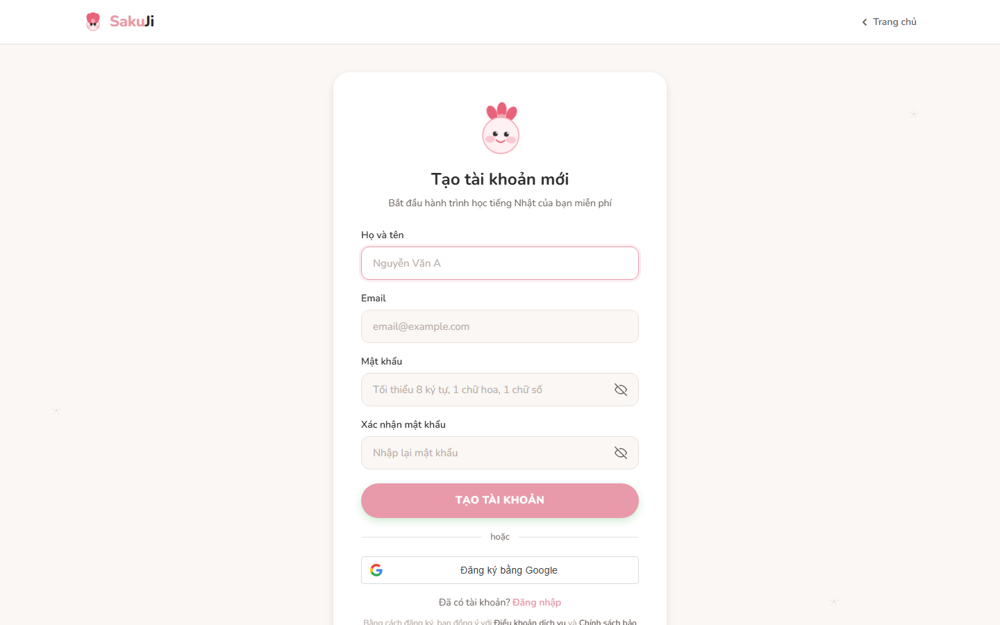

*Real screenshot of the running app: /register*

| Field Name | Description |
| --- | --- |
| Full name | Required, maximum 100 characters. |
| Email | Required, valid email format, unique in student_users. |
| Password | Required, follows security policy; stored as bcrypt hash. |
| Confirm password | Required, must match Password. |
| OTP | 6 digits, expires by configuration, used for email verification. |

#### 3.1.2 User Login

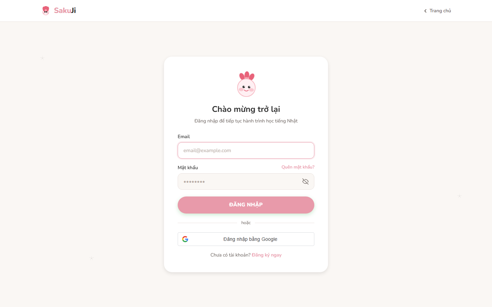

*Real screenshot of the running app: /login*

| Field Name | Description |
| --- | --- |
| Email | Required, valid email format. |
| Password | Required, plaintext is never logged. |
| Remember session | UX option; backend still controls token/session. |
| Google login | Optional OAuth when GOOGLE_CLIENT_ID is configured. |

#### 3.1.3 Password Reset

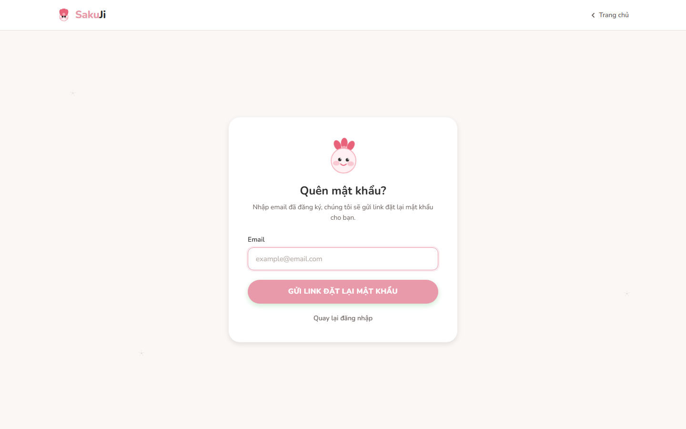

*Real screenshot of the running app: /forgot-password*

| Field Name | Description |
| --- | --- |
| Email | Required, receives reset link/token. |
| Reset token | Single-use token with expiry, invalidated after use. |
| New password | Follows security policy. |
| Confirm new password | Must match New password. |

### 3.2 Student Learning and Assessment

#### 3.2.1 Lesson Detail

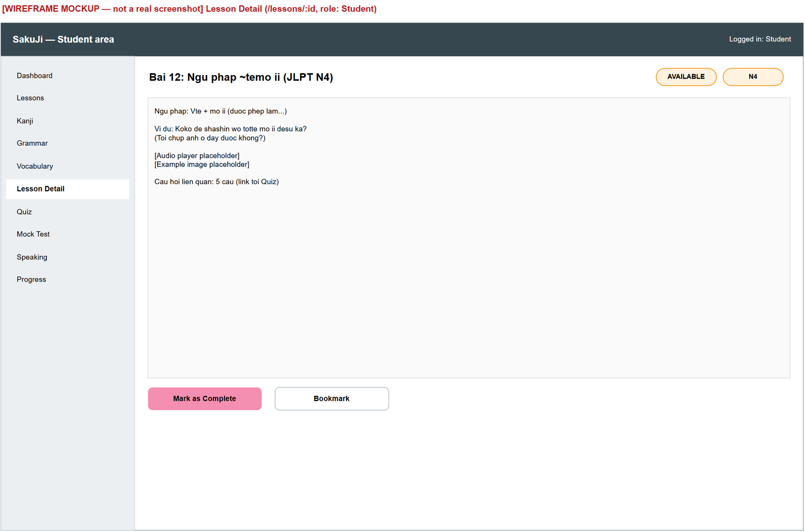

*Wireframe mockup (backend/DB unavailable in the build environment for a live screenshot).*

| Field Name | Description |
| --- | --- |
| JLPT level | N5, N4, N3, N2, N1; backend checks subscription/level. |
| Lesson status | LOCKED, AVAILABLE, COMPLETED. |
| Content | Text, examples, audio_url/image_url, linked questions. |
| Complete action | Sends completion event; backend updates progress. |

#### 3.2.2 Quiz / Mock Test Attempt

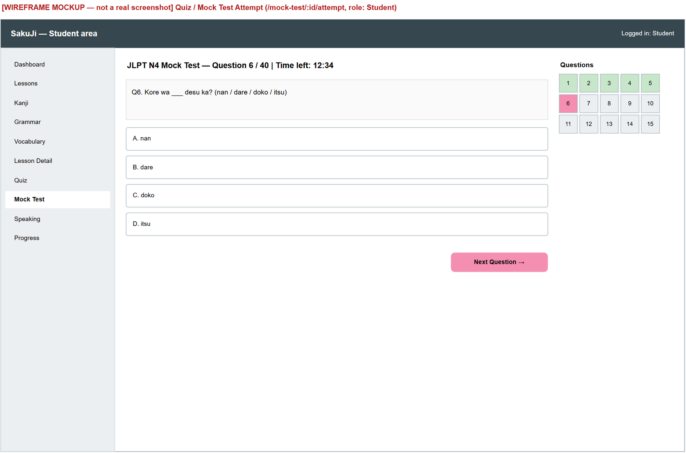

*Wireframe mockup (backend/DB unavailable in the build environment for a live screenshot).*

| Field Name | Description |
| --- | --- |
| Assessment | Published quiz or exam. |
| Question list | Questions from published question_assignments. |
| Timer | UX display; backend validates server-side time. |
| Answer payload | List of answers; does not include score. |
| Result | Score, max_score, correctness, submitted_at returned by backend. |

#### 3.2.3 AI Practice

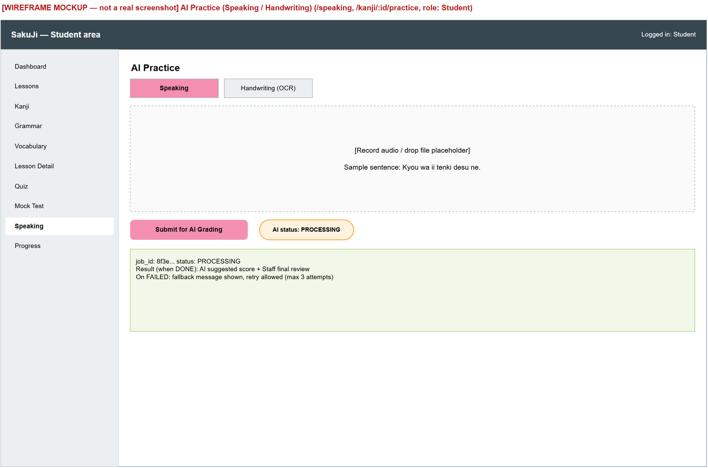

*Wireframe mockup (backend/DB unavailable in the build environment for a live screenshot).*

| Field Name | Description |
| --- | --- |
| File/canvas input | Valid image or audio within configured size limits. |
| job_id | Asynchronous AI job identifier for result polling. |
| AI status | PENDING, PROCESSING, DONE, FAILED. |
| AI result | OCR similarity % or speech score suggestion. |
| Final score | Final score confirmed by authorized Staff/logic. |

### 3.3 Staff, Manager and Admin Operations

#### 3.3.1 Staff Content Management

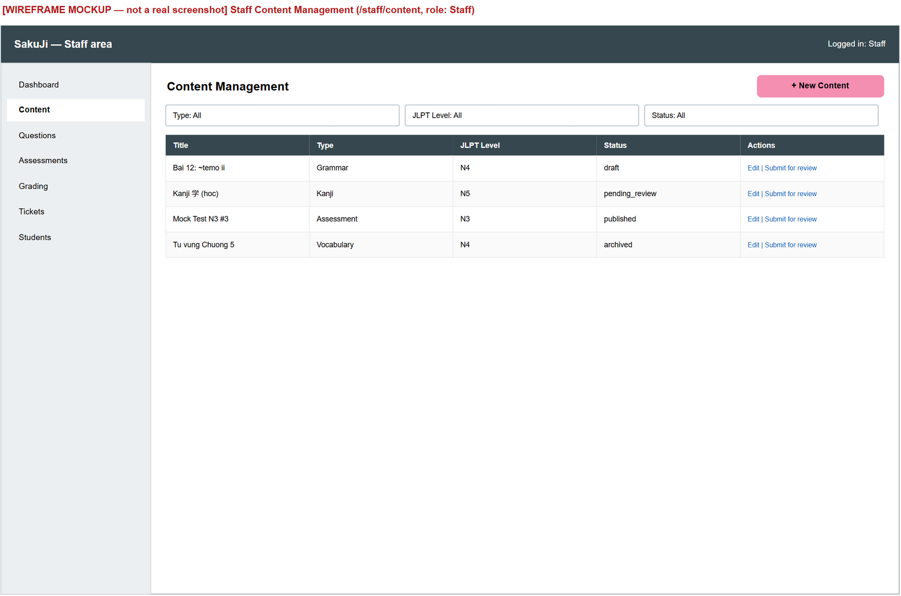

*Wireframe mockup (backend/DB unavailable in the build environment for a live screenshot).*

| Field Name | Description |
| --- | --- |
| Content type | Course, Lesson, Grammar, Vocabulary, Kanji, Question, Assessment. |
| Status | draft, pending_review, published, archived. |
| JLPT level | N5..N1; level mixing is forbidden. |
| Submit for review | Staff/Admin only; audit when required. |

#### 3.3.2 Manager Review Queue

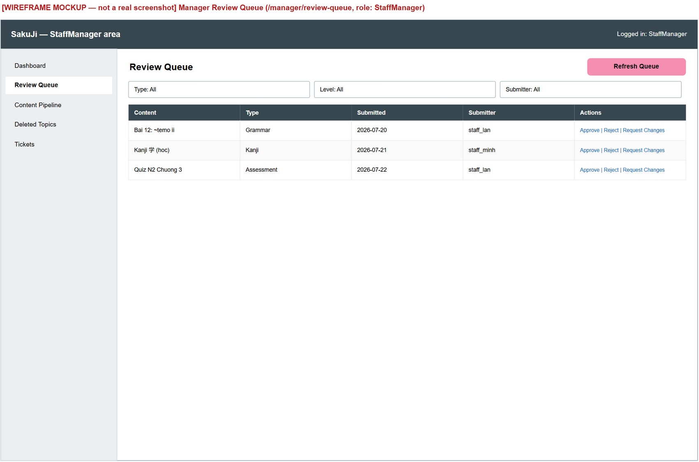

*Wireframe mockup (backend/DB unavailable in the build environment for a live screenshot).*

| Field Name | Description |
| --- | --- |
| Filter | Content type, JLPT level, submitter, status, submitted date. |
| Review action | Approve, Reject, Request Changes. |
| Reason/feedback | Required for reject/request changes or unpublish/archive. |
| Audit data | actor, action, target, reason, timestamp. |

#### 3.3.3 Admin User Management

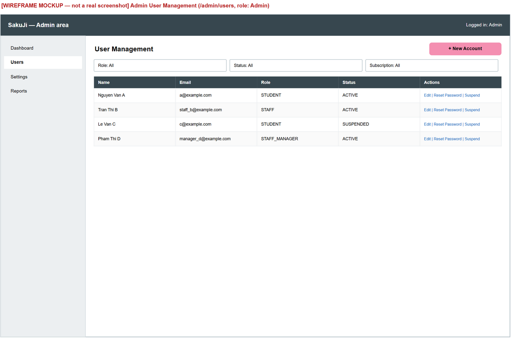

*Wireframe mockup (backend/DB unavailable in the build environment for a live screenshot).*

| Field Name | Description |
| --- | --- |
| Role | STUDENT, STAFF, STAFF_MANAGER, ADMIN. |
| Status | ACTIVE, SUSPENDED/INACTIVE, SOFT_DELETED. |
| Subscription | FREE/VIP and validity period. |
| Reset password | Creates token/temporary password by policy; audit is logged. |

## 4. Non-Functional Requirements

### 4.1 External Interfaces

- REST API prefix `/api/[resource]`; standard response `{ "status": number, "message": string, "data": object }`.
- MySQL 8 with utf8mb4 and UTC timestamps.
- File storage in `/uploads` or S3-compatible storage; no BLOB for media.
- SMTP for verification/reset/notification email with retry.
- OCR/Speech AI service invoked asynchronously with timeout, retry and fallback.

### 4.2 Quality Attributes

#### 4.2.1 Usability

Responsive web UI, Vietnamese-first learning experience, clear loading/error/empty states, and role-specific navigation.

#### 4.2.2 Performance

Common API responses should average under 2 seconds in normal conditions. AI requests return `job_id` immediately and process in the background.

#### 4.2.3 Security

JWT is mandatory for private APIs; bcrypt cost >= 10; backend checks Role + Subscription/Level; DTOs are mandatory for API responses; secrets are not stored in source control.

#### 4.2.4 Reliability, Auditability and Maintainability

Soft delete is used for important data, submitted attempts are immutable, important Staff/Admin operations are audited, global exception handling returns standard JSON, and business logic stays in backend Services.

## 5. Requirement Appendix

### 5.1 Business Rules

| ID | Rule Definition |
| --- | --- |
| BR-01 | Authorization must check both Role and Subscription/Level; UI hiding is only UX and backend still returns 401/403. |
| BR-02 | Quiz/mock exam scores are calculated only in the backend Service layer; clients never submit score. |
| BR-03 | Score must be within 0..max_score and every submission creates a new attempt. |
| BR-04 | SUBMITTED attempts are immutable; score and answers cannot be modified after submission. |
| BR-05 | Once a quiz/exam has attempts, its questions are locked; changes require a new version. |
| BR-06 | The next lesson unlocks only after the previous lesson is completed; user_progress only increases. |
| BR-07 | Staff-created content must be reviewed by StaffManager before publishing. |
| BR-08 | VIP content is visible only when the VIP subscription is active; subscription cache is at most 5 minutes. |
| BR-09 | AI tasks run asynchronously, return job_id, and use timeout + up to 3 retries + clear fallback. |
| BR-10 | Image/audio files are stored in /uploads or S3; BLOB storage in DB is not allowed. |
| BR-11 | Soft delete is mandatory for important data; hard delete is forbidden. |
| BR-12 | Important Admin/Staff/StaffManager actions must be recorded in audit logs. |

### 5.2 System Messages

| # | Message code | Message Type | Context | Content |
| --- | --- | --- | --- | --- |
| 1 | MSG01 | Inline | No search result | No matching results. |
| 2 | MSG02 | Field error | Required field is empty | This field is required. |
| 3 | MSG03 | Toast | Save success | Data saved successfully. |
| 4 | MSG04 | Toast | Delete/soft delete success | Status updated successfully. |
| 5 | MSG05 | Inline | Invalid login | Email or password is incorrect. |
| 6 | MSG06 | Inline | Forbidden | You do not have permission to access this feature. |
| 7 | MSG07 | Toast | AI job accepted | Your submission has been accepted and is being processed. |
| 8 | MSG08 | Toast | AI failed | AI processing is unavailable now. Please try again later. |

### 5.3 Other Requirements

- No hard delete for important business data.
- No frontend scoring, authorization or subscription business logic.
- No schema change without migration.
- No hardcoded secrets/password/API keys.
- Source references: `AGENTS.md`, `CLAUDE.md`, `docs/01-SRS-Requirements/shared_context.md`, `docs/01-SRS-Requirements/use-cases/Bao_cao_dac_ta_Use_Case.md`.
