# Japanese Skill Practice Platform

## Software Design Specification

> Dựa trên `Temp_Document/Template3_SDS Document.docx` (FPT University template).
> Đọc kèm: [`JLPT_database.md`](database-design/JLPT_database.md) (chi tiết 23 bảng), [`SoDoDuAn.md`](system-design/SoDoDuAn.md) (cây thư mục dự án).

---

## RECORD OF CHANGES

| Date | A*/M/D | In charge | Change Description |
|---|---|---|---|
| 2026-07-21 | A | AI Agent (theo yêu cầu user) | Khởi tạo SDS từ Template3, điền nội dung thật của dự án (packages, DB, 2 luồng: Auth, Quiz Submission) |
| 2026-07-21 | A | AI Agent (theo yêu cầu user) | Bổ sung 4 luồng theo `SPEC-sds-template-generation-guide.md`: Flashcard SRS, Kanji Writing Evaluation (OCR/DTW), Speaking Submission Grading (Shadowing), Content Review |

*A - Added, M - Modified, D - Deleted*

---

## Table of Contents

- [I. Overview](#i-overview)
  - [1. Code Packages](#1-code-packages)
  - [2. Database Design](#2-database-design)
    - [a. Database Schema](#a-database-schema)
    - [b. Table Description](#b-table-description)
- [II. Code Designs](#ii-code-designs)
  - [1. Authentication & Login](#1-authentication--login)
  - [2. Quiz Submission (Assessment)](#2-quiz-submission-assessment)
  - [3. Flashcard SRS (Spaced Repetition)](#3-flashcard-srs-spaced-repetition)
  - [4. Kanji Writing Evaluation (OCR/DTW Similarity)](#4-kanji-writing-evaluation-ocrdtw-similarity)
  - [5. Speaking Submission Grading (Shadowing)](#5-speaking-submission-grading-shadowing)
  - [6. Content Review (Manager Approve/Reject)](#6-content-review-manager-approvereject)

---

## I. Overview

### 1. Code Packages

Backend tổ chức theo **package-by-feature** (không theo layer `controller/service/repository`), nằm dưới `apps/backend/src/main/java/com/jlpt/feature/`. Mỗi feature package tự chứa Controller, Service, Entity, Repository, DTO liên quan.

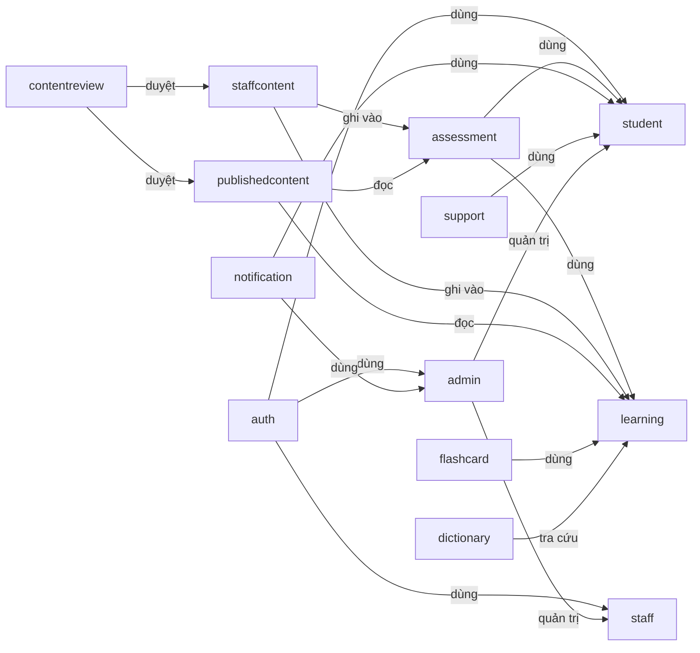

**Package descriptions**

| No | Package | Description |
|---|---|---|
| 01 | `auth` | Đăng nhập/đăng ký Student, JWT access + refresh token, xác minh email, quên mật khẩu, đăng nhập Google OAuth. |
| 02 | `staff` | Tài khoản Staff/StaffManager: đăng nhập riêng, quản lý thành viên staff, reset mật khẩu staff. |
| 03 | `admin` | Tài khoản Admin, audit log, dashboard thống kê, cấu hình hệ thống (`system_settings`), chế độ bảo trì. |
| 04 | `student` | Hồ sơ Student, dashboard, tiến độ học (`student_content_progress`), avatar, khóa học đã đăng ký. |
| 05 | `learning` | Nội dung học: Kana, Kanji, Vocabulary, Grammar, Lesson theo cấp JLPT (N5–N1). |
| 06 | `assessment` | Ngân hàng câu hỏi, Quiz/Exam (`Assessment`), lượt làm bài (`TestAttempt`), chấm điểm server-side, bài nộp nói/viết (`StudentSubmission`). |
| 07 | `staffcontent` | Nơi Staff soạn nội dung nháp trước khi publish: câu hỏi, quiz, đề thi, ngữ pháp, từ vựng, dashboard riêng cho Staff. |
| 08 | `contentreview` | Luồng duyệt nội dung do Staff soạn (approve/reject) trước khi công khai, ghi audit review. |
| 09 | `publishedcontent` | Snapshot nội dung đã publish, phục vụ Student đọc (tách khỏi bản nháp của Staff). |
| 10 | `flashcard` | Flashcard + Spaced Repetition (SRS), deck hệ thống hoặc do user tạo. |
| 11 | `dictionary` | Tra cứu từ điển Kanji/Vocabulary theo từ khóa hoặc loại. |
| 12 | `notification` | Thông báo tới từng Student (loại thông báo, kênh gửi). |
| 13 | `support` | Ticket hỗ trợ Student gửi lên và phản hồi (`TicketReply`). |

### 2. Database Design

#### a. Database Schema

- **DBMS**: Microsoft SQL Server 2019+, database `JLPT_LearningDB`.
- Chi tiết đầy đủ 23 bảng, quan hệ và các quyết định thiết kế nằm ở [`database-design/JLPT_database.md`](database-design/JLPT_database.md) — tài liệu này chỉ tóm tắt nhóm bảng liên quan tới 2 luồng được đặc tả ở Mục II bên dưới.

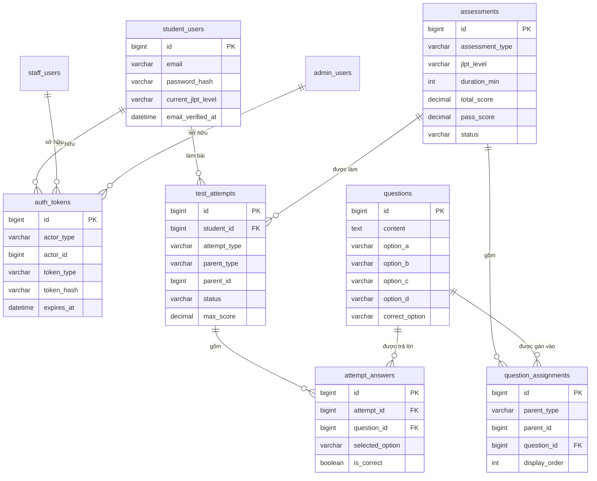

#### b. Table Description

| No | Table | Description |
|---|---|---|
| 01 | `student_users` | Tài khoản học viên, gồm OAuth (Google), cấp độ JLPT hiện tại/mục tiêu, streak học tập. |
| 02 | `staff_users` | Tài khoản Staff/StaffManager. |
| 03 | `admin_users` | Tài khoản Admin. |
| 04 | `auth_tokens` | Token dùng chung (session, refresh, reset password, verify email) cho cả 3 loại actor qua `actor_type` + `actor_id`. |
| 05 | `assessments` | Quiz và Exam JLPT (gộp chung 1 bảng qua `assessment_type`). |
| 06 | `questions` | Ngân hàng câu hỏi, đáp án A/B/C/D inline. |
| 07 | `question_assignments` | Gán câu hỏi vào 1 assessment hoặc 1 lesson theo `parent_type`/`parent_id`. |
| 08 | `test_attempts` | 1 lần làm quiz/exam/practice của Student; giữ `status` (`IN_PROGRESS`/đã nộp) để chống nộp 2 lần. |
| 09 | `attempt_answers` | Câu trả lời của Student cho từng câu hỏi trong 1 attempt, dùng để chấm điểm và review lại. |
| 10 | `flashcards` | 1 thẻ flashcard của Student (vocab/kanji/grammar/custom) + trạng thái SRS (`ease_factor`, `interval_days`, `next_review_date`, `last_rating`). |
| 11 | `kanji_writing_attempts` | 1 lượt Student viết tay 1 chữ Kanji trên canvas; điểm DTW trung bình + `final_quality` + chi tiết từng nét (`stroke_details` JSON). Bổ sung ở migration `V8__add_kanji_writing_attempts.sql`, chưa có trong danh sách 23 bảng gốc. |
| 12 | `student_submissions` | Bài Student nộp cần AI chấm trước rồi Staff duyệt lại: `submission_type` = `SPEAKING` (điểm AI phát âm/lưu loát) hoặc `HANDWRITING` (`similarity_percent` theo ADR-007); giữ cả điểm AI (`ai_*`) và điểm Staff ghi đè (`manual_score`, `manual_feedback`, `graded_by`). |
| 13 | `admin_audit_logs` | Ghi lại mọi hành động duyệt nội dung (approve/reject/request-changes) của Staff Manager — dùng bởi `contentreview`. |

> Danh sách đầy đủ 23 bảng (Content, Attempt, Submission, Progress, Flashcard, Support, Notification, System, Audit) xem tại [`JLPT_database.md`](database-design/JLPT_database.md).
> ⚠️ Bảng `kanji_writing_attempts` chưa nằm trong `JLPT_database.md` (thêm sau ở migration V8) — cần đồng bộ lại tài liệu đó khi có dịp.

---

## II. Code Designs

### 1. Authentication & Login

Luồng đăng nhập/đăng ký cho cả 3 role (Student/Staff/Admin), theo `ADR-003` (JWT stateless + bcrypt cost ≥ 10) trong `CLAUDE.md`.

#### a. Class Diagram

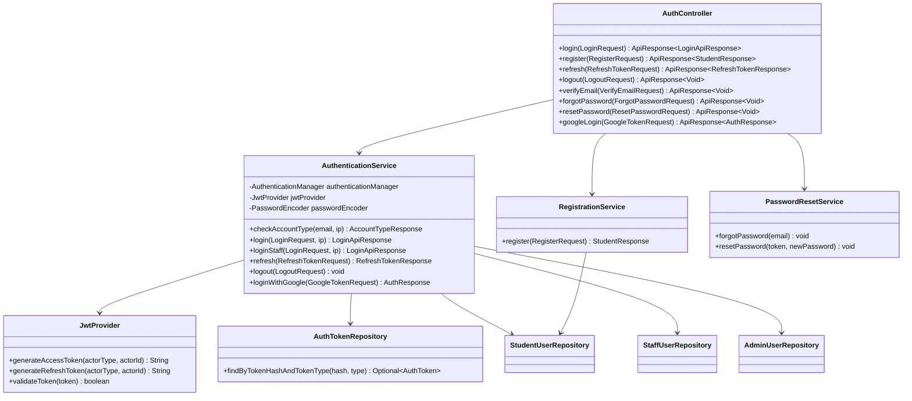

#### b. Class Specifications

**AuthenticationService** (`apps/backend/src/main/java/com/jlpt/feature/auth/AuthenticationService.java`)

| No | Method | Description |
|---|---|---|
| 01 | `checkAccountType(email, ip)` | Input: email, IP người gọi. Rate-limit 10 lần/phút/IP (`checkAccountTypeAttempts`). Trả về Student/Staff/Admin không tồn tại để FE hiển thị đúng form login. |
| 02 | `login(LoginRequest, ip)` | Xác thực Student qua `AuthenticationManager` + `passwordEncoder`; nếu đúng, sinh access token + refresh token (`JwtProvider`), lưu refresh token vào `auth_tokens` với `actor_type = STUDENT`. |
| 03 | `loginStaff(LoginRequest, ip)` | Tương tự `login` nhưng cho `StaffUser`/`AdminUser`, gọi `handleStaffLogin`, kiểm tra thêm trạng thái tài khoản (khóa/không active). |
| 04 | `refresh(RefreshTokenRequest)` | Input: refresh token. Tra `auth_tokens` theo hash, kiểm tra `expires_at` và chưa bị thu hồi, sinh access token mới (rotate refresh token). |
| 05 | `logout(LogoutRequest)` | Thu hồi (xóa mềm/đánh dấu) refresh token hiện tại trong `auth_tokens`, không hard-delete. |
| 06 | `loginWithGoogle(GoogleTokenRequest)` | Verify Google ID token qua `GoogleIdTokenVerifier`, tìm hoặc tạo `student_users` theo `oauth_provider_id`, sinh JWT như luồng login thường. |

**RegistrationService** (`apps/backend/src/main/java/com/jlpt/feature/auth/RegistrationService.java`)

| No | Method | Description |
|---|---|---|
| 01 | `register(RegisterRequest)` | Input: email, password, tên. Hash password bằng bcrypt (cost ≥ 10 theo ADR-003), tạo `student_users` với `email_verified_at = null`, phát sự kiện `SendVerificationEmailEvent` (bất đồng bộ) thay vì gửi email đồng bộ. |

#### c. Sequence Diagram(s)

**Student Login**

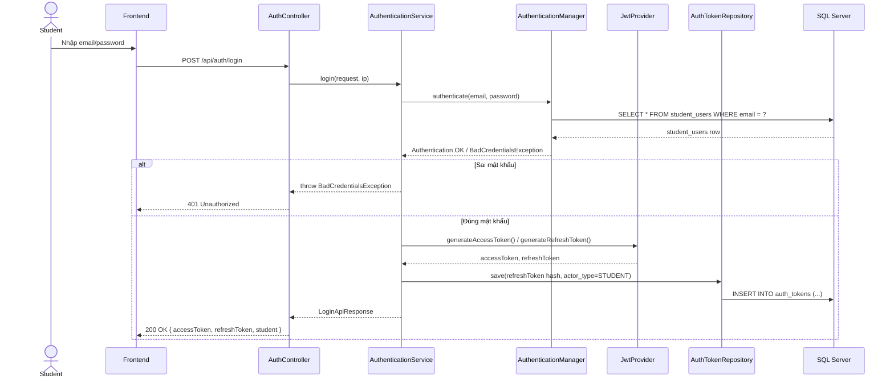

#### d. Database queries

```sql
-- checkAccountType / login: tìm tài khoản theo email
SELECT * FROM student_users WHERE email = ? AND is_deleted = 0;

-- lưu refresh token khi login thành công
INSERT INTO auth_tokens (actor_type, actor_id, token_type, token_hash, expires_at, created_at)
VALUES ('STUDENT', ?, 'REFRESH', ?, ?, GETDATE());

-- refresh(): tra refresh token còn hiệu lực
SELECT * FROM auth_tokens
WHERE token_hash = ? AND token_type = 'REFRESH' AND expires_at > GETDATE();

-- logout(): thu hồi token (soft, không DELETE)
UPDATE auth_tokens SET revoked_at = GETDATE() WHERE token_hash = ?;
```

---

### 2. Quiz Submission (Assessment)

Luồng nộp bài quiz, đúng theo `LESSON-005` (câu hỏi bị lock khi có attempt) và quy tắc chấm điểm server-side trong `CLAUDE.md`.

#### a. Class Diagram

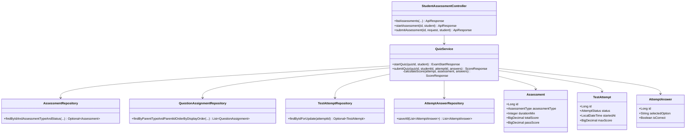

#### b. Class Specifications

**QuizService** (`apps/backend/src/main/java/com/jlpt/feature/assessment/QuizService.java`)

| No | Method | Description |
|---|---|---|
| 01 | `startQuiz(quizId, student)` | Input: id quiz, Student hiện tại. Kiểm tra quiz `PUBLISHED`, lấy danh sách câu hỏi đã gán (`question_assignments`), tạo mới 1 `TestAttempt` với `status = IN_PROGRESS`. Output: `attemptId`, `startedAt`, `expiresAt` (tính từ `durationMin`), danh sách câu hỏi theo section — **không** trả đáp án đúng về client. |
| 02 | `submitQuiz(quizId, studentId, attemptId, answers)` | Input: id quiz, id student, id attempt, danh sách câu trả lời. Khóa dòng `test_attempts` bằng `findByIdForUpdate` (pessimistic lock) để tránh race condition khi nộp trùng; kiểm tra `attempt.student.id == studentId` (chống nộp hộ) và `status == IN_PROGRESS` (chống nộp 2 lần — ném `AttemptAlreadySubmittedException` nếu đã nộp). Gọi `calculateScore`. |
| 03 | `calculateScore(attempt, assessment, answers)` | **Toàn bộ điểm số tính ở server**, không nhận điểm từ client: so khớp `answers` với `correct_option` của từng `Question`, cộng dồn `totalScore`/`maxScore`, lưu từng `AttemptAnswer`, cập nhật `attempt.status = SUBMITTED` và `submittedAt`. |

#### c. Sequence Diagram(s)

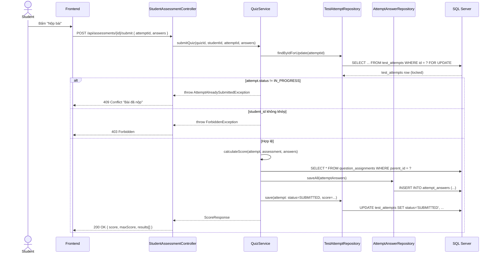

#### d. Database queries

```sql
-- startQuiz(): kiểm tra quiz đã publish
SELECT * FROM assessments
WHERE id = ? AND assessment_type = 'QUIZ' AND status = 'PUBLISHED';

-- lấy câu hỏi đã gán, theo thứ tự hiển thị
SELECT qa.* FROM question_assignments qa
WHERE qa.parent_type = 'ASSESSMENT' AND qa.parent_id = ?
ORDER BY qa.display_order;

-- tạo attempt mới khi bắt đầu làm bài
INSERT INTO test_attempts (student_id, attempt_type, parent_type, parent_id, started_at, max_score, status)
VALUES (?, 'QUIZ', 'ASSESSMENT', ?, GETDATE(), ?, 'IN_PROGRESS');

-- submitQuiz(): khóa dòng attempt để chống nộp trùng
SELECT * FROM test_attempts WITH (UPDLOCK, ROWLOCK) WHERE id = ?;

-- lưu từng câu trả lời sau khi chấm điểm
INSERT INTO attempt_answers (attempt_id, question_id, selected_option, is_correct)
VALUES (?, ?, ?, ?);

-- cập nhật attempt sau khi nộp
UPDATE test_attempts
SET status = 'SUBMITTED', submitted_at = GETDATE(), score = ?
WHERE id = ?;
```

---

### 3. Flashcard SRS (Spaced Repetition)

Luồng ôn tập Flashcard theo thuật toán **SM-2**, dựng phiên trộn thẻ NEW + REVIEW. Toàn bộ logic nằm ở `FlashcardSrsService` (`apps/backend/src/main/java/com/jlpt/feature/flashcard/service/FlashcardSrsService.java`); CRUD sổ/thẻ nằm ở `NotebookService` (ngoài phạm vi mục này).

#### a. Class Diagram

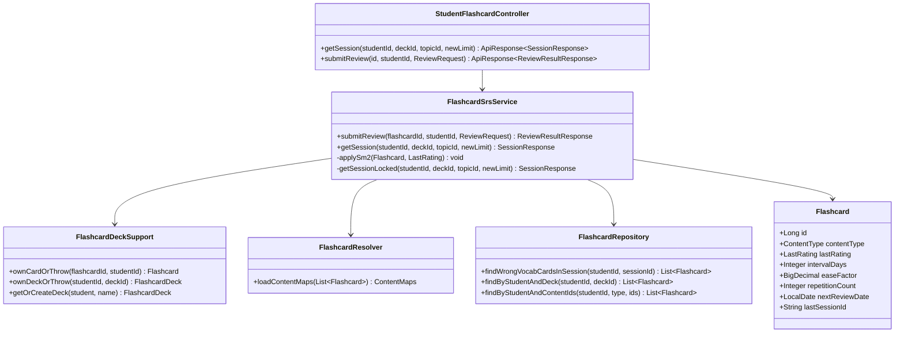

#### b. Class Specifications

**FlashcardSrsService** (`apps/backend/src/main/java/com/jlpt/feature/flashcard/service/FlashcardSrsService.java`)

| No | Method | Description |
|---|---|---|
| 01 | `submitReview(flashcardId, studentId, ReviewRequest)` | Input: id thẻ, id student, `rating` (easy/hard/wrong) hoặc `selectedOptionId` (nếu là quiz trắc nghiệm từ vựng). Xác thực quyền sở hữu thẻ qua `deckSupport.ownCardOrThrow`. Nếu là quiz trắc nghiệm, **server tự so khớp** `selectedOptionId` với `contentId` đúng (không tin đáp án đúng/sai từ client). Gọi `applySm2` để cập nhật lịch ôn, lưu `Flashcard`. Nếu là thẻ cuối phiên (`isLastCardInSession`), gom các từ trả lời sai trong phiên (theo `session_id`) để gợi ý ôn lại. |
| 02 | `getSession(studentId, deckId, topicId, newLimit)` | Input: 1 trong 2 `deckId` (sổ tay cá nhân) hoặc `topicId` (chủ đề giáo trình), giới hạn số thẻ mới (mặc định 10, trần 20). Khóa theo `(studentId, deck/topic)` bằng `SESSION_LOCKS` (in-JVM lock) để tránh 2 tab tạo phiên trùng lúc. Ưu tiên chọn từ theo thứ tự: **chưa học → đến hạn ôn → còn lại**; trộn học/kiểm tra theo lô 2–3 thẻ (`LEARN_BATCH_MIN/MAX`). |
| 03 | `applySm2(Flashcard, LastRating)` *(internal)* | Cài đặt thuật toán SM-2: `WRONG` → ease giảm (sàn 1.30), reset `repetitionCount`, `intervalDays = 1`; `HARD` → giữ nguyên ease, `intervalDays = max(1, cũ)`; `EASY` → ease + 0.1 (trần 2.50), `intervalDays` = 1 → 6 → `round(interval × ease)` theo số lần lặp. Luôn cập nhật `nextReviewDate = today + intervalDays`. |

#### c. Sequence Diagram(s)

**Submit Review (chấm 1 thẻ, cập nhật lịch SM-2)**

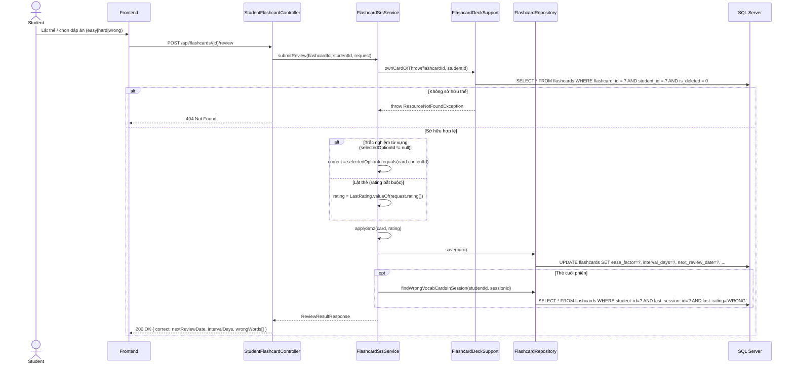

#### d. Database queries

```sql
-- ownCardOrThrow(): xác thực sở hữu thẻ trước khi chấm
SELECT * FROM flashcards
WHERE flashcard_id = ? AND student_id = ? AND is_deleted = 0;

-- applySm2() -> save(): cập nhật lịch ôn sau khi chấm
UPDATE flashcards
SET ease_factor = ?, interval_days = ?, repetition_count = ?,
    next_review_date = ?, last_reviewed_at = GETDATE(), last_rating = ?
WHERE flashcard_id = ?;

-- getSession(): lấy thẻ đã có của student trong 1 deck
SELECT * FROM flashcards
WHERE student_id = ? AND deck_id = ? AND is_deleted = 0;

-- cuối phiên: gom từ trả lời sai trong CHÍNH phiên vừa ôn (theo session_id, không theo cửa sổ thời gian)
SELECT * FROM flashcards
WHERE student_id = ? AND last_session_id = ? AND content_type = 'VOCABULARY' AND last_rating = 'WRONG';

-- tạo thẻ mới (gộp 1 lần, tránh N+1 insert) khi từ chưa từng có thẻ
INSERT INTO flashcards (student_id, deck_id, content_type, content_id, is_system, added_reason, next_review_date)
VALUES (?, ?, 'VOCABULARY', ?, 0, 'learn', ?);
```

---

### 4. Kanji Writing Evaluation (OCR/DTW Similarity)

Luồng Student luyện viết Kanji trên canvas, so khớp nét vẽ với nét chuẩn — hiện thực hoá `ADR-007` (chỉ so sánh % giống nhau, không phân tích thứ tự nét theo kiểu OCR ảnh). Thuật toán so khớp dùng **Dynamic Time Warping (DTW)** trên tọa độ nét vẽ (không phải nhận diện ảnh chữ viết tay truyền thống). Toàn bộ đồng bộ (request/response), không có job bất đồng bộ.

#### a. Class Diagram

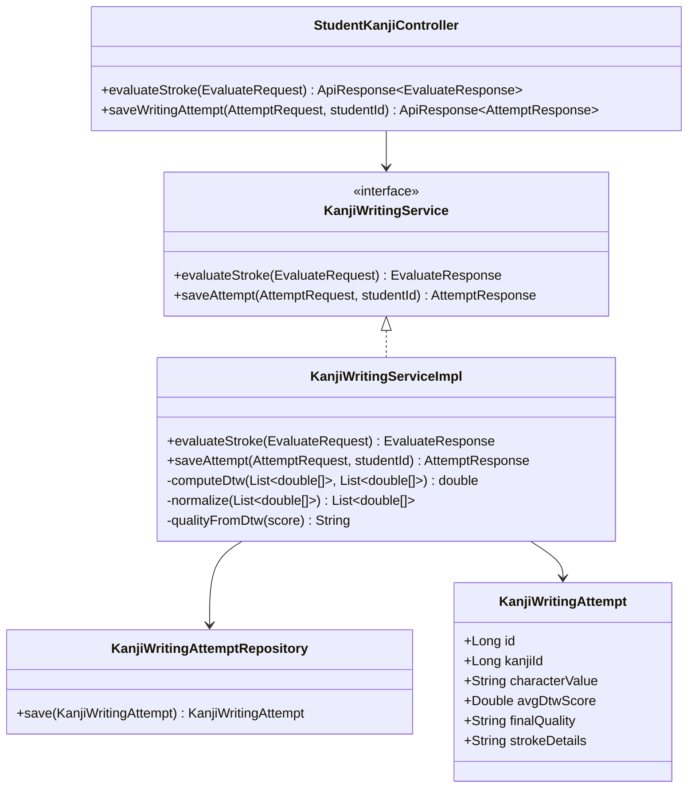

#### b. Class Specifications

**KanjiWritingServiceImpl** (`apps/backend/src/main/java/com/jlpt/feature/student/kanji/KanjiWritingServiceImpl.java`)

| No | Method | Description |
|---|---|---|
| 01 | `evaluateStroke(KanjiWritingEvaluateRequest)` | Input: tọa độ nét Student vừa vẽ (`userPath`) + nét chuẩn (`referencePath`) cho 1 nét cụ thể (`strokeIndex`). Chuẩn hoá 2 đường về cùng scale/gốc (`normalize` + `downsample` tối đa 20 điểm), tính khoảng cách bằng DTW (`computeDtw`), quy đổi ra `quality` (`perfect`/`good`/`ok`/`bad`) theo 3 ngưỡng cố định (300/650/1200). Trả về ngay (đồng bộ), không lưu DB — dùng để feedback tức thời khi Student đang vẽ từng nét. |
| 02 | `saveAttempt(KanjiWritingAttemptRequest, studentId)` | Input: toàn bộ nét đã vẽ của 1 chữ Kanji + điểm DTW từng nét (client đã gọi `evaluateStroke` cho từng nét trước đó). Tính `avgDtwScore` = trung bình điểm các nét, suy ra `finalQuality`, lưu 1 dòng `KanjiWritingAttempt` (kèm `strokeDetails` dạng JSON string) để Student xem lại lịch sử luyện tập. |
| 03 | `computeDtw(s1, s2)` *(internal)* | Dynamic Time Warping cổ điển: ma trận quy hoạch động `dp[i][j] = cost + min(trên, trái, chéo)`, cost = khoảng cách Euclid 2D. Bất biến với sai khác tốc độ vẽ (số điểm lấy mẫu khác nhau giữa 2 đường). |

#### c. Sequence Diagram(s)

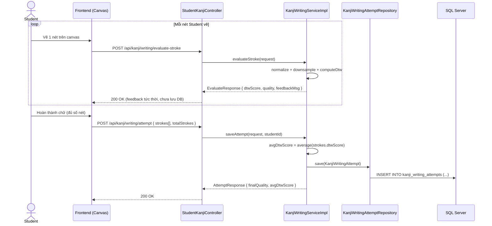

#### d. Database queries

```sql
-- saveAttempt(): lưu 1 lượt luyện viết đã hoàn thành
INSERT INTO kanji_writing_attempts
    (student_id, kanji_id, character_value, total_strokes, avg_dtw_score, final_quality, stroke_details, created_by)
VALUES (?, ?, ?, ?, ?, ?, ?, ?);
```

> `evaluateStroke()` không truy vấn DB — toàn bộ tính toán DTW diễn ra trong bộ nhớ theo từng request.

---

### 5. Speaking Submission Grading (Shadowing)

Hàng đợi Staff chấm lại bài nói (shadowing) đã được AI chấm trước — đúng `UC-31` và `LESSON-006` (AI không silent fail: điểm AI luôn hiển thị kèm khả năng Staff override thủ công). Bảng `student_submissions` dùng chung cho `SPEAKING` (điểm AI phát âm/lưu loát) và `HANDWRITING`; mục này chỉ đặc tả nhánh **chấm bài nói**.

> **Giới hạn phạm vi**: repo hiện tại có phần Staff duyệt/chấm lại (`SupportTicketService.getAllSubmissions/getSubmissionDetail/manualGrade` + `StaffGradingController`) và entity `StudentSubmission` đầy đủ cột điểm AI. Bước Student nộp bài nói + AI chấm điểm (ghi `ai_overall_score`, `ai_graded_at`...) **chưa tìm thấy trong backend hiện tại** — có thể do dịch vụ AI chấm nói là service ngoài/chưa merge vào nhánh đang checkout. Phần dưới đây mô tả đúng những gì có trong code, không suy diễn bước AI chấm.

#### a. Class Diagram

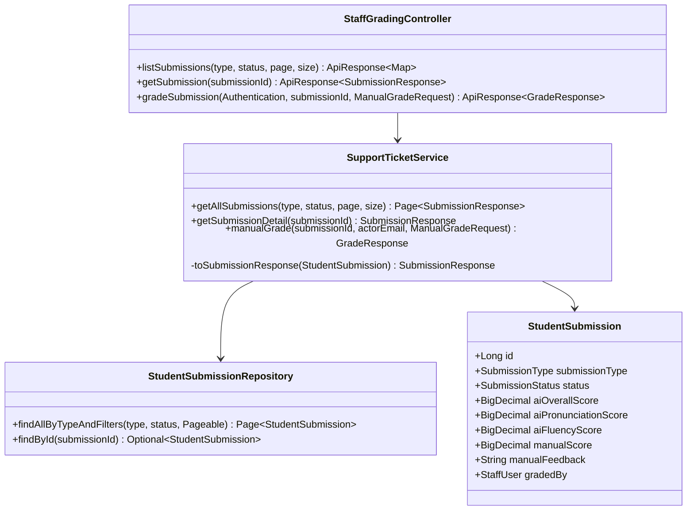

#### b. Class Specifications

**SupportTicketService** (`apps/backend/src/main/java/com/jlpt/feature/support/service/SupportTicketService.java`)

| No | Method | Description |
|---|---|---|
| 01 | `getAllSubmissions(submissionType, status, page, size)` | Input: filter `submissionType` (mặc định `speaking`), `status` (vd `ai_graded`), phân trang. Trả `Page<SubmissionResponse>` cho hàng đợi chấm bài của Staff — mỗi item có sẵn điểm AI để Staff tham khảo trước khi chấm. |
| 02 | `getSubmissionDetail(submissionId)` | Trả chi tiết 1 bài nộp: `recordingUrl`, điểm AI (`aiPronunciationScore`, `aiFluencyScore`, `aiHighlightedErrors`, `aiSuggestions`), và nếu đã chấm thì kèm `manualScore`/`manualFeedback`/`gradedBy`. `finalScore` = `manualScore` nếu có, ngược lại fallback về `aiOverallScore` (không bao giờ null nếu đã qua AI — theo LESSON-006). |
| 03 | `manualGrade(submissionId, actorEmail, ManualGradeRequest)` | **Business rule bắt buộc**: chỉ chấm được submission có `submissionType = SPEAKING` (422 nếu không phải) và `status = AI_GRADED` (422 nếu chưa qua AI hoặc đã chấm rồi). Ghi `manualScore`, `manualFeedback`, `gradedBy`, `gradedAt`, chuyển `status = GRADED`, rồi gửi `Notification` (`ACHIEVEMENT`) báo Student đã có điểm. |

#### c. Sequence Diagram(s)

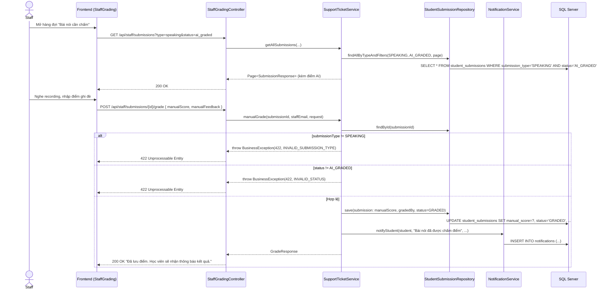

#### d. Database queries

```sql
-- getAllSubmissions(): hàng đợi chấm bài nói đã qua AI
SELECT * FROM student_submissions
WHERE submission_type = 'SPEAKING' AND status = 'AI_GRADED'
ORDER BY submitted_at ASC;

-- getSubmissionDetail(): chi tiết 1 bài nộp
SELECT * FROM student_submissions WHERE submission_id = ?;

-- manualGrade(): ghi điểm Staff, chuyển trạng thái
UPDATE student_submissions
SET manual_score = ?, manual_feedback = ?, graded_by = ?, graded_at = GETDATE(), status = 'GRADED'
WHERE submission_id = ?;

-- thông báo cho Student sau khi chấm xong
INSERT INTO notifications (student_id, title, message, notification_type, reference_key, created_by)
VALUES (?, 'Bài nói của bạn đã được chấm điểm', ?, 'ACHIEVEMENT', ?, ?);
```

---

### 6. Content Review (Manager Approve/Reject)

Luồng Staff Manager duyệt nội dung do Staff thường soạn (`UC-33`) trước khi công khai cho Student — hiện thực hoá `LESSON-001` (tách UI Staff/Admin theo quyền) ở mức nghiệp vụ: chỉ `STAFF_MANAGER` mới duyệt được, và không cho tự duyệt nội dung do chính mình tạo.

#### a. Class Diagram

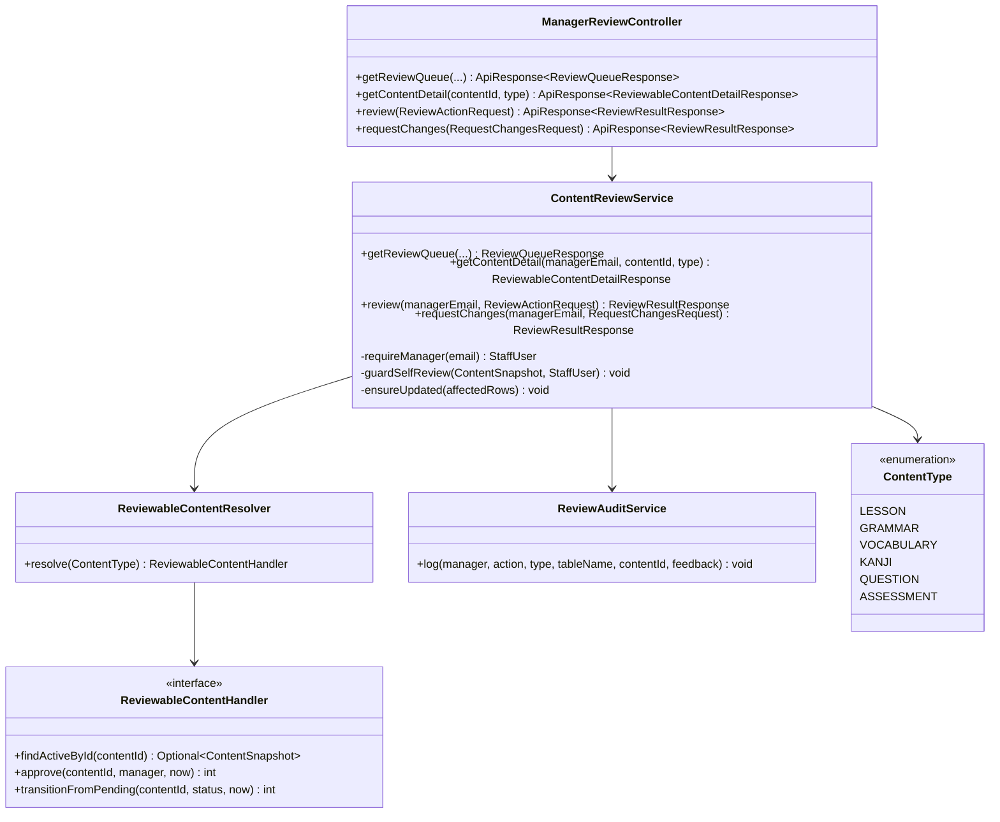

#### b. Class Specifications

**ContentReviewService** (`apps/backend/src/main/java/com/jlpt/feature/contentreview/ContentReviewService.java`)

| No | Method | Description |
|---|---|---|
| 01 | `getContentDetail(managerEmail, contentId, typeStr)` | Input: email manager (từ JWT), id nội dung, loại nội dung (`course/lesson/grammar/vocabulary/kanji/question/assessment`). Xác thực `managerEmail` là `STAFF_MANAGER` đang active (`requireManager`), resolve handler đúng loại qua `ReviewableContentResolver`, trả snapshot (tiêu đề, cấp JLPT, người tạo, ngày nộp, nội dung chi tiết). |
| 02 | `review(managerEmail, ReviewActionRequest)` | Input: `contentType`, `contentId`, `action` (`APPROVE`/`REJECT`), `feedback` (bắt buộc nếu reject). Chặn tự duyệt nội dung của chính mình (`guardSelfReview` → `SelfReviewNotAllowedException`). `APPROVE` → `handler.approve()` (chuyển `status = published`); `REJECT` → bắt buộc có `feedback` (ném `FeedbackRequiredException` nếu thiếu) rồi `handler.transitionFromPending(REJECTED)`. Mọi thao tác đều ghi `ReviewAuditService.log(...)`. |
| 03 | `requestChanges(managerEmail, RequestChangesRequest)` | Yêu cầu Staff sửa lại nội dung: bắt buộc `feedback`, chuyển trạng thái về `draft` (mặc định) hoặc `rejected` tuỳ `targetStatus`. Cùng cơ chế `guardSelfReview` + audit log như `review()`. |
| 04 | `ensureUpdated(affectedRows)` *(internal)* | Nếu UPDATE trả về 0 dòng nghĩa là nội dung không còn ở trạng thái `pending_review` (đã bị xử lý song song bởi Manager khác) → ném `ConcurrentReviewException`, tránh duyệt đè lên nhau. |

#### c. Sequence Diagram(s)

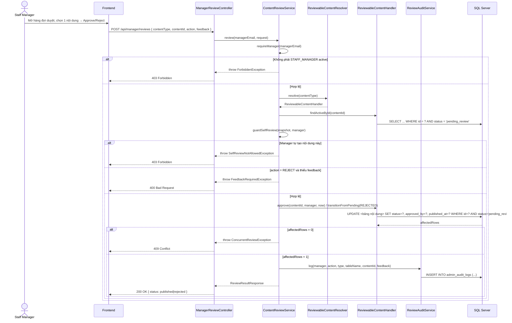

#### d. Database queries

```sql
-- findActiveById(): lấy nội dung đang chờ duyệt (ví dụ handler cho GRAMMAR)
SELECT * FROM grammar_points WHERE grammar_id = ? AND status = 'pending_review';

-- approve(): duyệt — chỉ update nếu vẫn đang pending_review (chống duyệt trùng)
UPDATE grammar_points
SET status = 'published', approved_by = ?, published_at = GETDATE()
WHERE grammar_id = ? AND status = 'pending_review';

-- reject() / requestChanges(): trả về draft hoặc rejected
UPDATE grammar_points
SET status = ?, updated_at = GETDATE()
WHERE grammar_id = ? AND status = 'pending_review';

-- ghi audit cho mọi hành động duyệt
INSERT INTO admin_audit_logs (staff_id, action, target_table, target_id, note, created_at)
VALUES (?, ?, ?, ?, ?, GETDATE());
```

> Câu lệnh trên minh hoạ cho `ContentType.GRAMMAR`; các loại khác (`lesson`, `vocabulary`, `kanji`, `question`, `assessment`) dùng cùng pattern nhưng đổi tên bảng theo `ReviewableContentHandler.tableName()` tương ứng.
