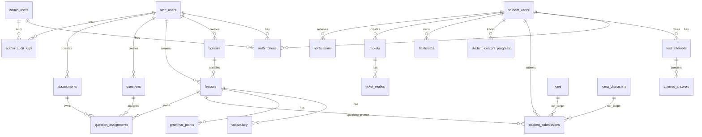

# JLPT Learning Platform Database

> **DBMS:** Microsoft SQL Server 2019+  
> **Database:** `JLPT_LearningDB`  
> **Phiên bản:** v2.6 — xóa `bio`, `date_of_birth` khỏi `student_users`  
> **File nguồn:** `jlpt_database_v2.sql`  
> **Số bảng hiện tại:** 23

## 1. Nguyên Tắc Tối Ưu

| Nguyên tắc | Quyết định |
|---|---|
| Giữ phân quyền | `admin_users`, `staff_users`, `student_users` vẫn tách riêng; StaffManager là `staff_users.staff_role = 'staff_manager'`. |
| Giảm bảng nhưng không dùng JSON để thay quan hệ | Các quan hệ nhiều bản ghi quan trọng như đáp án, ticket replies vẫn là bảng riêng. |
| Token tập trung | Tất cả session, reset password, verify email, refresh token dùng chung `auth_tokens` với `actor_type` và đúng một FK actor. |
| Duyệt nội dung gọn hơn | Không dùng bảng approval riêng; mỗi bảng nội dung có `status`, `created_by`, `approved_by`, `published_at`; lịch sử quyết định ghi ở `admin_audit_logs`. |
| Quiz + Exam gộp chung | Không tách `quizzes` và `exams` thành 2 bảng; dùng 1 bảng `assessments` với `assessment_type = 'quiz'/'exam'`. |
| question_options gộp vào questions | Đáp án A/B/C/D là cột inline `option_a`, `option_b`, `option_c`, `option_d`, `correct_option` trong `questions`. |
| Flashcard gọn hơn | Gộp `flashcard_decks` vào `flashcards` qua cột `deck_name` và `is_system`; bỏ bảng phụ. |
| Bookmark gọn hơn | Không dùng `student_bookmarks`; bookmark là cờ trong `student_content_progress`. |
| Báo cáo on-the-fly | Không dùng `learning_activity_logs`; dashboard/report tính từ `auth_tokens`, `test_attempts`, `student_content_progress`, `student_submissions`. |

## 2. Danh Sách 24 Bảng Thực Tế (SQL)

| # | Bảng | Nhóm | Mục đích |
|---|---|---|---|
| 1 | `admin_users` | Auth | Tài khoản Admin. |
| 2 | `staff_users` | Auth | Tài khoản Staff và StaffManager. |
| 3 | `student_users` | Auth | Tài khoản học viên + OAuth. |
| 4 | `auth_tokens` | Auth | Token dùng chung cho Admin/Staff/Student. |
| 5 | `courses` | Content | Khóa học JLPT (course container). |
| 6 | `lessons` | Content | Bài học thuộc khóa (lesson/reading/listening/speaking). |
| 7 | `kana_characters` | Content | Hiragana/Katakana. |
| 8 | `kanji` | Content | Kanji theo JLPT. |
| 9 | `vocabulary` | Content | Từ vựng, gắn với lesson. |
| 10 | `grammar_points` | Content | Ngữ pháp, gắn với lesson. |
| 11 | `questions` | Assessment | Ngân hàng câu hỏi (có inline option A/B/C/D). |
| 12 | `assessments` | Assessment | Quiz và Exam JLPT (gộp chung). |
| 13 | `question_assignments` | Assessment | Gán câu hỏi vào assessment hoặc lesson. |
| 14 | `test_attempts` | Attempt | Lần làm quiz/exam/practice/reading/listening. |
| 15 | `attempt_answers` | Attempt | Câu trả lời từng câu của học viên. |
| 16 | `student_submissions` | Submission | Bài nói/viết tay, AI/OCR/manual grading. |
| 17 | `student_content_progress` | Progress | Tiến độ học và bookmark. |
| 18 | `flashcards` | Flashcard | Thẻ flashcard + SRS + deck (gộp chung). |
| 19 | `tickets` | Support | Ticket hỗ trợ. |
| 20 | `ticket_replies` | Support | Phản hồi ticket. |
| 21 | `notifications` | Notification | Thông báo tới từng học viên. |
| 22 | `system_settings` | System | Cấu hình hệ thống (key-value). |
| 23 | `admin_audit_logs` | Audit | Audit log thao tác Admin/Staff/StaffManager. |

> **Lưu ý:** So với tài liệu cũ (28 bảng), đã gộp: `quizzes`+`exams` → `assessments`; `question_options` → inline trong `questions`; `flashcard_decks` → inline trong `flashcards`; `notification_recipients` → `student_id` trực tiếp trong `notifications`.

## 3. Mô Tả Các Bảng Chính

### `student_users`

Ngoài thông tin học viên, bảng này giữ OAuth và thống kê streak:

| Cột | Mô tả |
|---|---|
| `oauth_provider` | `google`, `facebook`, `apple`, `github`; NULL nếu đăng ký bằng email/password. |
| `oauth_provider_id` | ID người dùng bên provider. |
| `oauth_provider_email` | Email trả về từ OAuth provider. |
| `oauth_linked_at` | Thời điểm liên kết OAuth. |
| `email_verified_at` | Thời điểm xác minh email — **chỉ có ở `student_users`**; Admin/Staff không qua self-registration nên không cần trường này. |
| `current_jlpt_level` | Cấp độ JLPT hiện tại: N5–N1. |
| `target_jlpt_level` | Cấp độ JLPT mục tiêu: N5–N1. |
| `current_streak` | Số ngày học liên tiếp hiện tại. |
| `longest_streak` | Streak dài nhất từng đạt được. |
| `last_activity_date` | Ngày hoạt động gần nhất. |

Không tạo bảng `student_oauth_accounts` vì use case chỉ yêu cầu một OAuth identity chính cho Student.

---

### `courses`

Khóa học JLPT — container tổ chức nhiều `lessons` theo cùng một chủ đề/cấp độ:

| Cột | Mô tả |
|---|---|
| `course_id` | PK, tự tăng. |
| `title` | Tên khóa học. |
| `description` | Mô tả khóa học. |
| `jlpt_level` | Cấp độ: N5–N1. |
| `thumbnail_url` | Ảnh bìa khóa học. |
| `is_vip_only` | `1` = chỉ học viên VIP mới truy cập được. |
| `display_order` | Thứ tự hiển thị. |
| `status` | `draft` → `pending_review` → `published` / `archived`. |
| `created_by` / `approved_by` | FK → `staff_users`. |

Quan hệ: `courses (1) ──── (N) lessons` qua `lessons.course_id`. `course_id = NULL` cho phép lesson độc lập.

---

### `auth_tokens`

Một bảng token dùng chung cho cả 3 nhóm người dùng. Ràng buộc `CK_auth_token_actor` đảm bảo mỗi token chỉ thuộc đúng một actor:

- `actor_type = 'admin'` → chỉ có `admin_id`.
- `actor_type = 'staff'` → chỉ có `staff_id`.
- `actor_type = 'student'` → chỉ có `student_id`.

`token_type` gồm: `session`, `email_verification`, `password_reset`, `refresh`.

> **Lưu ý `token_value`:** Với `password_reset`, `refresh`, `session`, `token_value` là chuỗi ngẫu nhiên dạng UUID. Riêng với `email_verification`, `token_value` là **mã OTP 6 chữ số** (sinh bằng `SecureRandom`, hết hạn sau 10 phút) — vẫn lưu trong cùng cột `NVARCHAR(500)`, không đổi schema.

---

### `lessons`

Bảng bài học đa dạng, thay cho nhiều bảng content riêng lẻ:

| `lesson_type` | Cách dùng |
|---|---|
| `lesson` | Bài giảng lý thuyết thông thường. |
| `reading` | Bài đọc hiểu. |
| `listening` | Bài nghe, `audio_url` là file nghe. |
| `speaking` | Bài luyện nói/shadowing, `audio_url` là audio mẫu. |

---

### `questions`

Ngân hàng câu hỏi với đáp án inline (không dùng bảng `question_options` riêng):

| Cột | Mô tả |
|---|---|
| `question_type` | `multiple_choice`, `fill_blank`, `true_false`. |
| `skill` | `vocabulary`, `grammar`, `kanji`, `reading`, `listening`, `mixed`. |
| `option_a` → `option_d` | Đáp án A/B/C/D (cho multiple_choice). |
| `correct_option` | Đáp án đúng: `A`, `B`, `C`, `D`. |
| `correct_answer_text` | Đáp án text (cho fill_blank). |

---

### `assessments`

Gộp Quiz và Exam vào một bảng bằng `assessment_type`:

| `assessment_type` | Mô tả |
|---|---|
| `quiz` | Quiz luyện tập theo bài/chủ đề. |
| `exam` | Đề thi thử JLPT đầy đủ. |

---

### `student_submissions`

Bảng này chứa cả speaking, handwriting, AI grading, OCR và manual grading:

| Nhóm cột | Cột | Mô tả |
|---|---|---|
| **Chung** | `submission_type` | `speaking` hoặc `handwriting`. |
| | `status` | `pending` → `ai_graded` → `graded` / `rejected`. |
| **Speaking** | `exercise_id` | FK → `lessons(lesson_id)` loại `speaking`. |
| | `recording_url` | File ghi âm học viên. |
| | `duration_seconds` | Thời lượng ghi âm (giây). |
| **AI chấm** | `ai_overall_score` | Điểm tổng AI (gợi ý, không phải điểm cuối). |
| | `ai_pronunciation_score` | Điểm phát âm. |
| | `ai_fluency_score` | Điểm lưu loát. |
| | `ai_highlighted_errors` | Lỗi nổi bật AI phát hiện. |
| | `ai_suggestions` | Gợi ý cải thiện từ AI. |
| | `ai_graded_at` | Thời điểm AI hoàn thành chấm. |
| **OCR** | `target_type` | `kanji` hoặc `kana` — loại ký tự cần viết. |
| | `kanji_id` / `kana_id` | FK tới bảng tương ứng. |
| | `handwriting_image_url` | Ảnh bài viết tay học viên. |
| | `expected_character` | Ký tự cần viết đúng. |
| | `recognized_character` | Ký tự OCR nhận dạng được. |
| | `similarity_percent` | % độ giống (ADR-007: chỉ so sánh similarity). |
| | `is_correct` | Đúng/sai theo ngưỡng similarity. |
| | `ocr_processed_at` | Thời điểm OCR xử lý xong. |
| **Điểm cuối** | `final_score` | Điểm cuối cùng: `manual_score` nếu Staff chấm, ngược lại `ai_overall_score`. |
| **Staff** | `manual_score` | Điểm Staff chấm thủ công (override). |
| | `manual_feedback` | Nhận xét của Staff. |
| | `graded_by` | FK → `staff_users`. |
| | `graded_at` | Thời điểm Staff chấm. |

**Luồng trạng thái:**

```
pending ──► ai_graded ──► graded
                     └──► rejected
```

**Quy tắc `final_score` (AGENTS.md §7.5):**
> AI score chỉ là `ai_overall_score` (gợi ý). Staff có thể override bằng `manual_score`. Service layer tính `final_score = manual_score ?? ai_overall_score`.

---

### `student_content_progress`

Bảng vừa lưu tiến độ vừa lưu bookmark:

| Cột | Mô tả |
|---|---|
| `content_type` | `lesson`, `vocabulary`, `kanji`, `kana`, `grammar`. |
| `content_id` | ID của nội dung tương ứng. |
| `status` | `learning`, `completed`, `reviewing`. |
| `progress_percent` | % hoàn thành (0–100). |
| `is_bookmarked` | Cờ bookmark cá nhân. |
| `bookmark_note` | Ghi chú bookmark. |

Bỏ `student_bookmarks` vì bookmark luôn gắn với cùng cặp `(student_id, content_type, content_id)` của progress.

---

### `flashcards`

Gộp deck + card + SRS vào một bảng. Không dùng bảng `flashcard_reviews` riêng:

| Cột | Mô tả |
|---|---|
| `deck_name` | Tên bộ thẻ (mặc định: "Mặc định"). |
| `is_system` | `1` = bộ thẻ hệ thống, `0` = cá nhân. |
| `content_type` | `kanji`, `vocabulary`, `grammar`, `custom`. |
| `last_rating` | Đánh giá lần ôn gần nhất: `easy`, `hard`, `wrong`. |
| `interval_days` | Khoảng cách ôn tiếp theo (ngày). |
| `ease_factor` | Hệ số SM-2, mặc định **2.50**. Tăng khi `easy`, giảm khi `wrong`. |
| `repetition_count` | Số lần đã ôn tổng cộng. |
| `next_review_date` | Ngày cần ôn tiếp theo. |
| `last_reviewed_at` | Thời điểm ôn gần nhất. |

Thiết kế này ưu tiên use case học flashcard hiện tại, không lưu full lịch sử từng lần review.

## 4. Workflow Duyệt Nội Dung

Không còn bảng `content_approval_requests`. Mỗi nội dung Staff tạo có các cột:

- `status`: `draft` → `pending_review` → `published` / `rejected` / `archived` / `deleted`.
- `created_by`: Staff tạo nội dung.
- `approved_by`: StaffManager duyệt.
- `published_at`: thời điểm publish.

StaffManager duyệt trực tiếp trên các bảng: `lessons`, `kanji`, `vocabulary`, `grammar_points`, `questions`, `assessments`.

Các quyết định approve/reject/archive/publish/unpublish ghi vào `admin_audit_logs`.

## 5. Use Case Coverage

| Nhóm use case | UC | Bảng đáp ứng |
|---|---|---|
| Login/Register/Reset/Profile/Password | UC-01 – UC-05 | `student_users`, `admin_users`, `staff_users`, `auth_tokens` |
| Logout | UC-18 | `auth_tokens` (revoke session) |
| Học Kana/Kanji/Từ vựng/Ngữ pháp | UC-06 – UC-09 | `kana_characters`, `kanji`, `vocabulary`, `grammar_points`, `student_content_progress` |
| Flashcard SRS | UC-12 | `flashcards` (deck + SRS gộp chung) |
| Đọc/Nghe/Nói | UC-13, UC-14, UC-15 | `lessons`, `questions`, `question_assignments`, `test_attempts`, `attempt_answers`, `student_submissions` |
| Quiz/Exam | UC-10, UC-11 | `assessments`, `question_assignments`, `test_attempts`, `attempt_answers` |
| Tìm kiếm/Từ điển | UC-16 | `vocabulary`, `kanji`, `grammar_points`, `lessons` |
| Bookmark | UC-17 | `student_content_progress` với `is_bookmarked = 1` |
| Tiến độ học tập | UC-19 | `vw_student_learning_stats`, `test_attempts`, `student_content_progress` |
| AI chấm Speaking | UC-13 | `student_submissions` (nhóm cột AI + final_score) |
| OCR viết tay | UC-20 | `student_submissions` (nhóm cột OCR + target_type) |
| Support | UC-29 | `tickets`, `ticket_replies` |
| Notification | UC-30 | `notifications` (student_id trực tiếp) |
| Quản lý học viên (Staff) | UC-21, UC-22, UC-23 | `student_users`, `auth_tokens` |
| Quản lý nội dung (Staff) | UC-24 – UC-28 | Các bảng content + `admin_audit_logs` |
| Chấm bài nói (Staff) | UC-31 | `student_submissions` (manual_score, graded_by) |
| Xem kết quả (Staff) | UC-32 | `test_attempts`, `attempt_answers` |
| Duyệt/Xuất bản nội dung (StaffManager) | UC-33, UC-34 | Cột status/approver trên content + `admin_audit_logs` |
| Admin login/dashboard/report/settings | UC-35 – UC-40 | `auth_tokens`, `student_users`, `staff_users`, `test_attempts`, `courses`, `system_settings` |

## 6. Quan Hệ Chính



## 7. Thay Đổi Theo Phiên Bản

| Phiên bản | Thay đổi |
|---|---|
| v2.0 | Schema khởi tạo, 28 bảng theo thiết kế gốc. |
| v2.2 | Tối ưu gộp bảng: `quizzes`+`exams` → `assessments`; `question_options` inline; `flashcard_decks` inline; bỏ `learning_activity_logs`. |
| v2.3 | **Thêm cột**: `student_users.oauth_provider_email`, `oauth_linked_at`; `student_submissions.target_type`, `final_score`; `flashcards.ease_factor`. **Đổi tên**: `ai_error_summary` → `ai_highlighted_errors`. |
| v2.4 | **Thêm bảng**: `courses` (UC-27 Staff, UC-33 StaffManager). **Thêm cột**: `lessons.course_id` FK. **Đánh lại số UC**: Student UC-01–20, Staff UC-21–32, StaffManager UC-33–34, Admin UC-35–40. |
| v2.5 | **Xóa cột dư thừa** khỏi cả 3 bảng user: `last_login_ip` (trùng với `auth_tokens.ip_address`), `password_changed_at` (không có UC nào dùng). **Xóa thêm** `email_verified_at` khỏi `admin_users` và `staff_users`. Migration: `V5__remove_unused_columns.sql`. |
| **v2.6** | **Xóa cột** `student_users.bio` và `student_users.date_of_birth` — không ảnh hưởng logic nghiệp vụ cốt lõi; profile giữ lại `full_name`, `email`, `phone`, `avatar_url`, `jlpt_level`. Migration: `V6__remove_bio_dob_from_student.sql`. |

## 8. Ghi Chú JSON

Schema có một số cột JSON text cho dữ liệu nội dung linh hoạt:

- `test_attempts.section_scores` — điểm từng phần thi (language/reading/listening).
- `admin_audit_logs.description` — mô tả chi tiết thao tác.

Các JSON này **không** dùng để thay thế các quan hệ chính.
