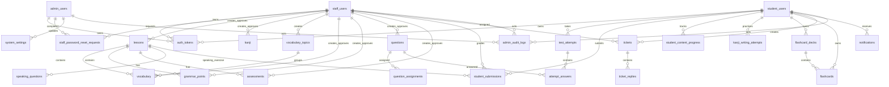

# THIẾT KẾ CƠ SỞ DỮ LIỆU JLPT LEARNING PLATFORM

| Thuộc tính | Giá trị |
| :--- | :--- |
| Trạng thái tài liệu | As-built — phản ánh code và Flyway migration hiện tại |
| Phiên bản tài liệu | 3.0 |
| Ngày cập nhật | 26/07/2026 |
| DBMS | MySQL 8.4 (tối thiểu 8.0.16 để thực thi `CHECK`) |
| Database mặc định | `JLPT_LearningDB` |
| Charset / Collation | `utf8mb4` / `utf8mb4_unicode_ci` |
| Quản lý schema | Flyway |
| JPA schema policy | `spring.jpa.hibernate.ddl-auto=validate` |
| Nguồn chuẩn | `apps/backend/src/main/resources/db/migration` |
| Quy mô hiện tại | 28 bảng, 1 view |

> Migration SQL là nguồn sự thật của schema. Entity JPA phải khớp với schema và không được tự tạo/cập nhật bảng khi ứng dụng khởi động.

---

## 1. Nguyên tắc thiết kế đang áp dụng

| Nguyên tắc | Hiện trạng triển khai |
| :--- | :--- |
| Tách loại tài khoản | `admin_users`, `staff_users`, `student_users` tách riêng. StaffManager là `staff_users.staff_role='staff_manager'`. |
| Token dùng chung | `auth_tokens` dùng `actor_type` và ba FK tùy chọn; `CK_auth_token_actor` bảo đảm mỗi token thuộc đúng một actor. |
| Quiz và Exam dùng chung | `assessments.assessment_type` phân biệt `quiz` và `exam`. |
| Câu hỏi đa hình | `question_assignments` dùng `(parent_type, parent_id)` để gắn câu hỏi với assessment hoặc lesson; đây là quan hệ logic, không có FK đến `parent_id`. |
| Tiến độ đa hình | `student_content_progress` dùng `(content_type, content_id)`; unique theo Student và nội dung. |
| Xóa mềm | Các bảng nghiệp vụ phù hợp dùng `status='deleted'` hoặc `is_deleted=1`; tránh hard delete trừ quan hệ phụ có `ON DELETE CASCADE`. |
| Workflow nội dung | `draft → pending_review → published/rejected → archived/deleted`; người tạo/người duyệt được lưu trực tiếp trên bảng nội dung. |
| Audit tập trung | `admin_audit_logs` ghi actor Admin/Staff/Student, hành động và đối tượng tác động. |
| Thời gian thống nhất | `DATETIME(6)`, mặc định `CURRENT_TIMESTAMP(6)`; môi trường container chạy UTC. |
| Tiếng Nhật và emoji | Mọi bảng sử dụng `utf8mb4`; không phụ thuộc charset mặc định của server. |
| Dữ liệu linh hoạt | Chỉ dùng `LONGTEXT` chứa JSON/text có cấu trúc cho dữ liệu không cần FK/truy vấn quan hệ, ví dụ chi tiết từng nét viết. |

### 1.1. Không còn đúng so với tài liệu cũ

- DBMS không phải Microsoft SQL Server; code hiện dùng MySQL.
- Không có bảng `courses` trong migration/entity hiện tại. Danh sách “khóa học” phía Student được tổng hợp theo lộ trình/cấp JLPT, không phải entity `Course`.
- Flashcard deck không gộp vào `flashcards`; `flashcard_decks` là bảng riêng.
- Schema có `vocabulary_topics`, `kanji_writing_attempts`, `staff_password_reset_requests`, `email_outbox` và `speaking_questions`.
- `student_content_progress` vẫn có cột bookmark, nhưng giao diện hiện tại chủ yếu dùng notebook/flashcard cho việc lưu từ.

---

## 2. Lịch sử Flyway migration

Flyway sắp xếp migration theo version số, không theo thứ tự tên khi hiển thị thư mục.

| Migration | Loại | Nội dung |
| :--- | :--- | :--- |
| `V1__init_schema.sql` | DDL | Tạo 26 bảng lõi, index, constraint và view `vw_student_learning_stats`. Đây là bản squash của các migration schema cũ. |
| `V2__mock_data.sql` | Seed | Dữ liệu mẫu cho môi trường phát triển. |
| `V3__seed_email_type_settings.sql` | Seed | Thêm các cấu hình loại email vào `system_settings`. |
| `V25__ticket_status_assigned.sql` | DDL | Bổ sung trạng thái `assigned` cho `tickets`. |
| `V26__update_default_from_email.sql` | Seed/config | Cập nhật cấu hình địa chỉ gửi email mặc định. |
| `V27__create_email_outbox.sql` | DDL | Tạo `email_outbox` để lưu email gửi thất bại và retry bền vững. |
| `V28__seed_speaking_lessons.sql` | Seed | Thêm lesson loại `speaking`. |
| `V29__create_speaking_questions.sql` | DDL | Tạo `speaking_questions` và index phục vụ speaking workflow. |
| `V31__seed_email_body_content.sql` | Seed | Thêm nội dung template email. |
| `V32__replace_email_body_with_text.sql` | Seed/config | Chuyển template email sang nội dung text phù hợp service hiện tại. |

> Không có các file migration V4–V24/V30 trong repo hiện tại vì V1 đã squash phần DDL lịch sử. Không được suy diễn schema từ số version bị khuyết.

---

## 3. Danh mục 28 bảng hiện tại

### 3.1. Người dùng và xác thực

| # | Bảng | PK | Quan hệ/chức năng chính |
| :--- | :--- | :--- | :--- |
| 1 | `admin_users` | `admin_id` | Tài khoản Admin, trạng thái, khóa đăng nhập |
| 2 | `staff_users` | `staff_id` | Staff/StaffManager, mật khẩu tạm, trạng thái |
| 3 | `staff_password_reset_requests` | `request_id` | FK `staff_id → staff_users`; `completed_by → admin_users` |
| 4 | `student_users` | `student_id` | Student, xác minh email, OAuth, JLPT goal và streak |
| 5 | `auth_tokens` | `token_id` | FK tùy actor đến Admin/Staff/Student; session, refresh, reset, verify |

### 3.2. Nội dung học tập

| # | Bảng | PK | Quan hệ/chức năng chính |
| :--- | :--- | :--- | :--- |
| 6 | `lessons` | `lesson_id` | Bài lesson/reading/listening/speaking; creator/approver là Staff |
| 7 | `kana_characters` | `kana_id` | Hiragana/Katakana, romaji, audio và stroke URL |
| 8 | `kanji` | `kanji_id` | Kanji theo JLPT; creator/approver là Staff |
| 9 | `kanji_writing_attempts` | `attempt_id` | FK `student_id`; lưu điểm DTW và chi tiết nét |
| 10 | `vocabulary_topics` | `topic_id` | Chủ đề từ vựng theo cấp JLPT; FK creator Staff |
| 11 | `vocabulary` | `vocabulary_id` | FK topic, lesson, creator và approver |
| 12 | `grammar_points` | `grammar_id` | FK lesson, creator và approver |
| 13 | `speaking_questions` | `speaking_question_id` | FK `lesson_id → lessons`; prompt và sample audio |

### 3.3. Assessment và bài làm

| # | Bảng | PK | Quan hệ/chức năng chính |
| :--- | :--- | :--- | :--- |
| 14 | `questions` | `question_id` | Ngân hàng câu hỏi, đáp án A–D inline, creator/approver |
| 15 | `assessments` | `assessment_id` | Quiz/Exam; có thể thuộc lesson; creator/approver |
| 16 | `question_assignments` | `assignment_id` | FK question; gắn logic tới assessment/lesson bằng parent type/id |
| 17 | `test_attempts` | `attempt_id` | FK Student; attempt quiz/exam/practice và điểm tổng |
| 18 | `attempt_answers` | `answer_id` | FK attempt và question; lưu đáp án, đúng/sai, điểm |
| 19 | `student_submissions` | `submission_id` | Speaking/handwriting, AI grading, OCR và Staff grading |

### 3.4. Tiến độ và flashcard

| # | Bảng | PK | Quan hệ/chức năng chính |
| :--- | :--- | :--- | :--- |
| 20 | `student_content_progress` | `progress_id` | FK Student; tiến độ/bookmark đa hình |
| 21 | `flashcard_decks` | `deck_id` | FK Student; system deck, review deck, soft delete |
| 22 | `flashcards` | `flashcard_id` | FK Student và deck; dữ liệu SRS, session và soft delete |

### 3.5. Hỗ trợ, thông báo và hệ thống

| # | Bảng | PK | Quan hệ/chức năng chính |
| :--- | :--- | :--- | :--- |
| 23 | `tickets` | `ticket_id` | FK Student và Staff assignee; support workflow |
| 24 | `ticket_replies` | `reply_id` | FK ticket; sender là đúng một Student hoặc Staff |
| 25 | `notifications` | `notification_id` | FK Student; creator có thể là Admin/Staff/hệ thống |
| 26 | `system_settings` | `setting_id` | Cấu hình key-value theo group; FK Admin cập nhật |
| 27 | `admin_audit_logs` | `audit_id` | Actor là đúng một Admin/Staff/Student |
| 28 | `email_outbox` | `outbox_id` | Hàng đợi email lỗi, trạng thái và số lần retry |

### 3.6. View

| View | Mục đích |
| :--- | :--- |
| `vw_student_learning_stats` | Tổng hợp số nội dung đã hoàn thành, số quiz/exam, điểm exam cao nhất/trung bình và streak theo Student |

---

## 4. Đặc tả các bảng quan trọng

### 4.1. `admin_users`, `staff_users`, `student_users`

Ba bảng tài khoản có chung các nhóm cột:

- Định danh: ID, `email` unique, `password_hash`, `full_name`.
- Trạng thái: `active`, `suspended`, `pending`, `deleted`.
- An toàn đăng nhập: `login_attempts`, `locked_until`, `last_login_at`.
- Audit thời gian: `created_at`, `updated_at`.

Khác biệt:

| Bảng | Cột chuyên biệt |
| :--- | :--- |
| `admin_users` | Không có role con; mọi bản ghi là Admin |
| `staff_users` | `staff_role ∈ {staff, staff_manager}`, `must_change_password` |
| `student_users` | `email_verified_at`, avatar/phone, OAuth, current/target JLPT, streak |

`student_users` có unique index `(oauth_provider, oauth_provider_id)`. MySQL cho phép nhiều dòng có giá trị `NULL`, nên tài khoản email/password không xung đột index OAuth.

### 4.2. `auth_tokens`

| Nhóm cột | Cột |
| :--- | :--- |
| Chủ sở hữu | `actor_type`, `admin_id`, `staff_id`, `student_id` |
| Token | `token_type`, `token_value`, `expires_at`, `revoked_at` |
| Theo dõi | `ip_address`, `created_at` |

`token_type` hiện hỗ trợ:

- `session`
- `refresh`
- `limited_session`
- `email_verification`
- `password_reset`

`CK_auth_token_actor` yêu cầu đúng một FK actor có giá trị và phải khớp `actor_type`. Khi actor bị hard delete, token bị xóa theo `ON DELETE CASCADE`.

### 4.3. Nhóm nội dung có duyệt

Các bảng `lessons`, `kanji`, `vocabulary`, `grammar_points`, `questions`, `assessments` dùng chung:

- `status`: `draft`, `pending_review`, `rejected`, `published`, `archived`, `deleted`.
- `created_by → staff_users`.
- `approved_by → staff_users`.
- `published_at`, `created_at`, `updated_at`.

`vocabulary_topics` có cùng state set nhưng hiện chỉ lưu `created_by`, chưa có `approved_by/published_at`.

Workflow:

```text
draft ──submit──> pending_review
pending_review ──approve──> published
pending_review ──reject/request changes──> rejected hoặc draft
published ──unpublish/archive──> archived
active state ──soft delete──> deleted
archived/deleted ──restore──> trạng thái hợp lệ do service quyết định
```

Backend ngăn StaffManager tự duyệt nội dung do chính mình tạo và dùng cập nhật có điều kiện để phát hiện duyệt đồng thời.

### 4.4. `lessons` và `speaking_questions`

`lessons.lesson_type` gồm `lesson`, `reading`, `listening`, `speaking`. Bảng chứa text, video, audio, attachment và thứ tự hiển thị.

`speaking_questions` là bảng con của lesson:

| Cột | Ý nghĩa |
| :--- | :--- |
| `lesson_id` | FK đến lesson loại speaking |
| `prompt_text` | Câu/nội dung Student cần nói |
| `instruction` | Hướng dẫn |
| `sample_audio_url` | Audio mẫu |
| `display_order` | Thứ tự trong lesson |

Schema chỉ bảo đảm FK đến `lessons`; điều kiện lesson phải có type `speaking` được service xử lý.

### 4.5. `kanji_writing_attempts`

Lưu kết quả một phiên luyện viết:

- `student_id`, `kanji_id`, `character_value`, `total_strokes`.
- `avg_dtw_score`, `final_quality`.
- `stroke_details` là JSON text chứa kết quả từng nét.
- `is_deleted`, timestamp và `created_by`.

Lưu ý: schema khai báo FK cho `student_id`, nhưng chỉ tạo index cho `kanji_id`; `kanji_id` hiện **không có foreign key constraint** trong migration.

### 4.6. `vocabulary_topics`, `vocabulary`, `grammar_points`

- Topic unique theo `(jlpt_level, slug)` và `(jlpt_level, title_vi)`.
- Mỗi vocabulary bắt buộc thuộc một topic; có thể liên kết lesson.
- Grammar có thể liên kết lesson.
- Vocabulary/grammar chỉ được hiển thị cho Student khi có trạng thái phù hợp.

### 4.7. `questions`, `assessments`, `question_assignments`

`questions`:

- `question_type`: `multiple_choice`, `fill_blank`, `true_false`.
- `skill`: `vocabulary`, `grammar`, `kanji`, `reading`, `listening`, `mixed`.
- Multiple choice lưu `option_a` đến `option_d`, `correct_option`.
- Fill blank dùng `correct_answer_text`.

`assessments`:

- `assessment_type`: `quiz` hoặc `exam`.
- Chứa metadata JLPT/topic, thời lượng, tổng điểm, điểm đạt và trạng thái.
- `is_deleted` hỗ trợ xóa mềm độc lập với content status.

`question_assignments`:

- `question_id` có FK thật.
- `(parent_type, parent_id)` là liên kết đa hình đến assessment hoặc lesson.
- Unique `(parent_type, parent_id, question_id)` ngăn gán trùng câu hỏi.
- `display_order`, `section_name`, `score` quy định cấu trúc và điểm.

### 4.8. `test_attempts` và `attempt_answers`

Mỗi lần nộp tạo một `test_attempts` mới:

- `attempt_type`: `exam`, `quiz`, `practice`, `reading`, `listening`.
- `parent_type`, `parent_id`: nguồn đề logic.
- `status`: `in_progress`, `submitted`, `auto_submitted`, `abandoned`.
- Điểm tổng, điểm tối đa, pass/fail, thời lượng và thời gian bắt đầu/nộp.
- Điểm từng phần được lưu bằng ba cột `language_knowledge_score`, `reading_score`, `listening_score`.

`attempt_answers` lưu snapshot câu trả lời theo question, đáp án được chọn/text, đúng/sai, điểm nhận được và thời gian trả lời.

Xóa attempt sẽ cascade xuống `attempt_answers`.

### 4.9. `student_submissions`

Bảng dùng chung cho speaking và handwriting:

| Nhóm | Cột tiêu biểu |
| :--- | :--- |
| Chung | `student_id`, `submission_type`, `exercise_id`, `status`, `submitted_at` |
| Speaking | `recording_url`, `duration_seconds` |
| AI | Điểm overall/pronunciation/fluency, `ai_error_summary`, gợi ý, `ai_graded_at` |
| OCR | `kanji_id`, `kana_id`, ảnh, ký tự mong đợi/nhận dạng, similarity, đúng/sai, `ocr_processed_at` |
| Staff grading | `manual_score`, `manual_feedback`, `graded_by`, `graded_at` |

Điểm AI chỉ là gợi ý. Điểm thủ công của Staff có quyền override trong service. Bảng không có cột persisted `final_score`; response/service tính điểm cuối từ manual score nếu có, ngược lại dùng AI score.

### 4.10. `student_content_progress`

| Cột | Quy tắc |
| :--- | :--- |
| `content_type` | `lesson`, `vocabulary`, `kanji`, `kana`, `grammar` |
| `content_id` | ID logic của nội dung; không có FK đa bảng |
| `status` | `learning`, `completed`, `reviewing` |
| `progress_percent` | 0–100, service validate |
| Bookmark | `is_bookmarked`, `bookmark_note`, `bookmarked_at` |

Unique `(student_id, content_type, content_id)` bảo đảm mỗi Student có một dòng tiến độ cho một nội dung.

### 4.11. `flashcard_decks` và `flashcards`

Deck là entity riêng:

- Có thể là deck cá nhân hoặc system deck.
- Mỗi Student chỉ có một review deck còn hoạt động.
- Generated column `active_name_key` và `review_deck_key` tái tạo filtered unique index của thiết kế SQL Server cũ.
- Cả deck và card đều hỗ trợ soft delete.

Card lưu:

- Liên kết Student và deck.
- Nguồn `kanji`, `vocabulary`, `grammar` hoặc `custom`.
- SRS: `last_rating`, `interval_days`, `repetition_count`, `ease_factor`, `next_review_date`, `last_reviewed_at`.
- `last_session_id` hỗ trợ idempotency/phiên luyện.

### 4.12. `tickets` và `ticket_replies`

Trạng thái ticket sau V25:

```text
open ──assign──> assigned ──reply──> in_progress ──resolve──> resolved/closed
```

`tickets.assigned_to` trỏ tới Staff. `ticket_replies` có hai sender FK tùy chọn; `CK_replies_sender` yêu cầu đúng một trong `student_sender_id` hoặc `staff_sender_id`.

### 4.13. `notifications`

Mỗi dòng thuộc một Student:

- Loại: `news`, `warning`, `promotion`, `system`, `achievement`, `reminder`.
- Kênh: `in_app`, `email`, `both`.
- Hỗ trợ tự động/rule, hẹn giờ, sent/delivered/read timestamps.
- Creator có thể là Admin, Staff hoặc hệ thống; constraint cấm đồng thời cả Admin và Staff.

Broadcast được materialize thành nhiều notification theo người nhận; job nền và rule được điều phối bởi service/cấu hình, không có bảng notification rule riêng.

### 4.14. `system_settings`

Thiết kế key-value:

- Unique `(setting_group, setting_key)`.
- `value_type`: `string`, `integer`, `boolean`, `time`.
- `is_editable` giới hạn thay đổi.
- `updated_by → admin_users`.

Các nhóm hiện phục vụ SMTP/email template, cài đặt hệ thống và notification rules.

### 4.15. `admin_audit_logs`

Mỗi log có:

- Đúng một actor: `admin_actor_id`, `staff_actor_id` hoặc `student_actor_id`.
- `action`, `target_table`, `target_id`, `description`.
- IP và thời gian tạo.

`CK_audit_actor` bảo đảm không có log vô chủ hoặc nhiều actor.

### 4.16. `email_outbox`

Email gửi thất bại sau retry được lưu bền vững:

- `status`: `pending`, `sent`, `failed`.
- `attempt_count`, `last_error`, `last_attempt_at`.
- Nội dung email: `to_email`, `subject`, `body_html`.
- `sent_at` được cập nhật khi gửi thành công.

Index `(status, last_attempt_at)` phục vụ worker lấy batch retry.

---

## 5. Quan hệ chính


```mermaid
erDiagram
    admin_users ||--o{ auth_tokens : owns
    staff_users ||--o{ auth_tokens : owns
    student_users ||--o{ auth_tokens : owns
    staff_users ||--o{ staff_password_reset_requests : requests
    admin_users ||--o{ staff_password_reset_requests : completes

    staff_users ||--o{ lessons : creates_approves
    staff_users ||--o{ kanji : creates_approves
    staff_users ||--o{ vocabulary_topics : creates
    staff_users ||--o{ vocabulary : creates_approves
    staff_users ||--o{ grammar_points : creates_approves
    staff_users ||--o{ questions : creates_approves
    staff_users ||--o{ assessments : creates_approves

    lessons ||--o{ vocabulary : contains
    lessons ||--o{ grammar_points : contains
    lessons ||--o{ assessments : has
    lessons ||--o{ speaking_questions : has
    vocabulary_topics ||--o{ vocabulary : groups

    questions ||--o{ question_assignments : assigned
    student_users ||--o{ test_attempts : takes
    test_attempts ||--o{ attempt_answers : contains
    questions ||--o{ attempt_answers : answered

    student_users ||--o{ student_submissions : submits
    lessons ||--o{ student_submissions : speaking_exercise
    staff_users ||--o{ student_submissions : grades

    student_users ||--o{ student_content_progress : tracks
    student_users ||--o{ kanji_writing_attempts : practices
    student_users ||--o{ flashcard_decks : owns
    flashcard_decks ||--o{ flashcards : contains
    student_users ||--o{ flashcards : owns

    student_users ||--o{ tickets : creates
    staff_users ||--o{ tickets : assigned
    tickets ||--o{ ticket_replies : contains
    student_users ||--o{ notifications : receives

    admin_users ||--o{ system_settings : updates
    admin_users ||--o{ admin_audit_logs : acts
    staff_users ||--o{ admin_audit_logs : acts
    student_users ||--o{ admin_audit_logs : acts
```

### 5.1. Quan hệ đa hình không thể hiện bằng FK

| Bảng | Cặp cột | Đối tượng logic |
| :--- | :--- | :--- |
| `question_assignments` | `parent_type`, `parent_id` | Assessment hoặc Lesson |
| `test_attempts` | `parent_type`, `parent_id` | Assessment/nguồn bài làm |
| `student_content_progress` | `content_type`, `content_id` | Lesson, Vocabulary, Kanji, Kana, Grammar |
| `flashcards` | `content_type`, `content_id` | Kanji, Vocabulary, Grammar hoặc custom |
| `admin_audit_logs` | `target_table`, `target_id` | Bất kỳ đối tượng nghiệp vụ được audit |

Tính toàn vẹn của các quan hệ này do service/repository kiểm tra.

---

## 6. Quy tắc xóa và toàn vẹn

### 6.1. Cascade vật lý

`ON DELETE CASCADE` hiện được dùng cho dữ liệu phụ thuộc chặt:

- User → `auth_tokens`.
- Student → attempts/submissions/progress/decks/flashcards/tickets/notifications.
- Test attempt → answers.
- Ticket → replies.
- Question → assignments.

Trong nghiệp vụ thông thường, user và nội dung được xóa mềm nên cascade vật lý chủ yếu là hàng rào toàn vẹn khi dọn dữ liệu thực sự.

### 6.2. Xóa mềm

| Nhóm | Cơ chế |
| :--- | :--- |
| User | `status='deleted'` |
| Nội dung duyệt | `status='deleted'` |
| Assessment | `status` và `is_deleted` |
| Flashcard/deck | `is_deleted=1` |
| Kanji writing attempt | `is_deleted=1` |

### 6.3. Các điểm cần lưu ý

- `kanji_writing_attempts.kanji_id` có index nhưng chưa có FK.
- Các cặp polymorphic ID không có FK database.
- `updated_at` có default nhưng migration không khai báo `ON UPDATE CURRENT_TIMESTAMP`; entity/service phải cập nhật.
- `admin_audit_logs.description` và `stroke_details` là text; code chịu trách nhiệm serialize/parse nếu nội dung là JSON.

---

## 7. Index và chiến lược truy vấn

Các nhóm index chính:

- Auth: token value, actor + token type + expiry/revocation.
- Student: status, current JLPT và OAuth unique.
- Nội dung: status + JLPT + type/topic; creator + status.
- Assessment: type/status/level, lesson/status, soft-delete filter.
- Attempt: Student/type, parent, Student/status/submitted date.
- Progress: Student/content type; bookmark lookup.
- Flashcard: owner/deck/due date/content/session.
- Ticket: status, assignee/status, Student/status.
- Notification: schedule/sent và Student/read/created date.
- Audit: actor + created date.
- Email outbox: status + last attempt.

Không thêm index chỉ dựa trên tài liệu; mọi thay đổi phải qua Flyway migration và được kiểm tra bằng query plan trên MySQL.

---

## 8. Truy vết theo chức năng hiện tại

| Chức năng | Bảng chính |
| :--- | :--- |
| Đăng ký/đăng nhập/refresh/reset | Các bảng user, `auth_tokens`, `staff_password_reset_requests` |
| Onboarding/dashboard Student | `student_users`, `vw_student_learning_stats` |
| Học Kana/Kanji/Từ vựng/Ngữ pháp | `kana_characters`, `kanji`, `vocabulary_topics`, `vocabulary`, `grammar_points`, `lessons` |
| Luyện viết Kanji | `kanji_writing_attempts` |
| Quiz/Exam | `questions`, `assessments`, `question_assignments`, `test_attempts`, `attempt_answers` |
| Speaking/AI/Staff grading | `lessons`, `speaking_questions`, `student_submissions` |
| Tiến độ | `student_content_progress`, `vw_student_learning_stats` |
| Flashcard/Notebook | `flashcard_decks`, `flashcards` |
| Ticket | `tickets`, `ticket_replies` |
| Notification/Broadcast | `notifications`, `system_settings` |
| Email retry | `email_outbox` |
| Duyệt/xuất bản | Status và Staff FK trên các bảng nội dung, `admin_audit_logs` |
| Admin settings/report | `system_settings`, `admin_audit_logs` |

---

## 9. Quy tắc cập nhật tài liệu

Khi schema thay đổi:

1. Tạo migration Flyway mới; không sửa migration đã chạy ở môi trường dùng chung.
2. Cập nhật entity, converter, repository và test liên quan.
3. Chạy ứng dụng với `ddl-auto=validate` để phát hiện lệch schema.
4. Cập nhật số bảng, quan hệ, state/constraint và sơ đồ trong tài liệu này.
5. Không ghi một cột/bảng là “đã triển khai” nếu chỉ tồn tại trong DTO hoặc tài liệu mà chưa có migration tương ứng.

Tài liệu này mô tả schema tại thời điểm migration mới nhất là `V32__replace_email_body_with_text.sql`.
