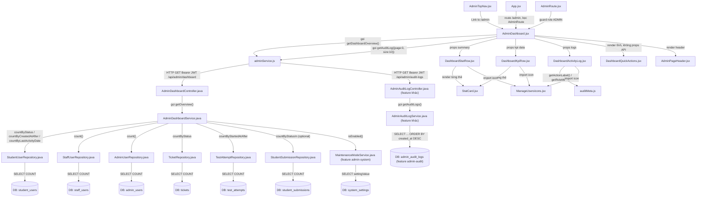
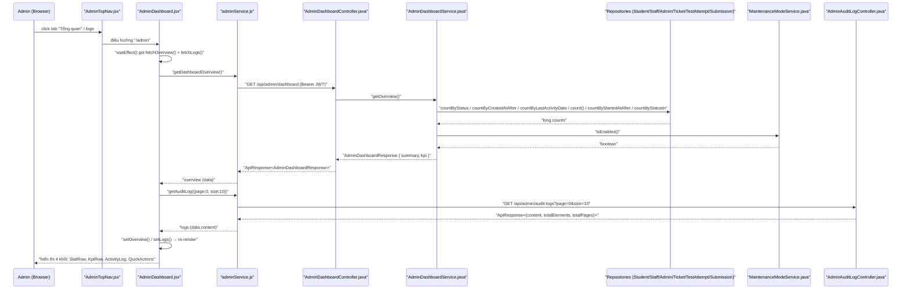

# Phân Tích Feature: admin-dashboard (Trang Tổng Quan Quản Trị - Admin Dashboard)

> **Tác giả phân tích:** AI Senior Software Architect
> **Ngày phân tích:** 2026-07-27
> **Phạm vi:** UC-37 — Trang "Bảng Điều Khiển" (`Admin Dashboard Page`), màn hình landing của Admin sau khi đăng nhập: KPI vận hành, số liệu tổng quan hệ thống, nhật ký hoạt động gần đây, và các lối tắt (quick actions).
> **Nguồn:** Đọc trực tiếp source code trong workspace.

---

## 1. Tóm Tắt Tổng Quan

Feature **admin-dashboard** (mã use case: **UC-37**) là trang landing của Admin sau khi đăng nhập, hiển thị 4 khối thông tin: (1) số liệu tổng quan hệ thống (tổng người dùng, hoạt động hôm nay, lượt thi/quiz hôm nay, trạng thái hệ thống), (2) chỉ số vận hành KPI (học viên mới, ticket đang xử lý, bài chờ chấm, học viên bị đình chỉ), (3) nhật ký hoạt động gần đây (audit log rút gọn), và (4) các lối tắt điều hướng nhanh tới các trang quản trị khác.

Feature trải dài trên 3 tầng:

| Tầng | Mô tả |
|------|-------|
| **Frontend (React)** | Trang [AdminDashboard.jsx](../../../apps/frontend/src/pages/admin/AdminDashboard.jsx) — gọi 2 API độc lập (overview + audit log) rồi truyền dữ liệu xuống 4 component con hiển thị theo khối |
| **Backend (Spring Boot)** | [AdminDashboardController.java](../../../apps/backend/src/main/java/com/jlpt/feature/admin/AdminDashboardController.java) nhận request → [AdminDashboardService.java](../../../apps/backend/src/main/java/com/jlpt/feature/admin/AdminDashboardService.java) tổng hợp số liệu từ 5 repository khác nhau (student, staff, admin, ticket, test-attempt, submission) + 1 service liên feature (`MaintenanceModeService`) |
| **Database (MySQL)** | Không có bảng riêng cho dashboard — đây là tầng **tổng hợp (aggregation) đọc-only**, dùng lại các bảng `student_users`, `staff_users`, `admin_users`, `tickets`, `test_attempts`, `student_submissions`, `system_settings` (qua `MaintenanceModeService`) và `admin_audit_logs` (qua endpoint audit log riêng) |

**Entry point** của feature là route `/admin` (frontend, bọc trong `AdminRoute` — guard role ADMIN phía client) → gọi tới 2 endpoint backend: `GET /api/admin/dashboard` (summary + kpi) và `GET /api/admin/audit-logs` (hoạt động gần đây, dùng chung với trang Audit Log/Reports).

Đặc điểm quan trọng: trang này **không có logic ghi dữ liệu** — toàn bộ là đọc và tổng hợp (`@Transactional(readOnly = true)`), và nó **tiêu thụ dữ liệu từ 2 feature khác** thay vì sở hữu dữ liệu riêng:
- Trường `systemStatus` được đọc qua `MaintenanceModeService` — cơ chế này đã được phân tích chi tiết ở [admin-system_feature_analysis.md](../../../docs/02-SDD-Architecture/feat_flow/admin-system_feature_analysis.md); tài liệu này chỉ nhắc lại điểm nối, không phân tích lại `MaintenanceModeService`.
- Khối "Hoạt Động Gần Đây" hiển thị dữ liệu từ `admin_audit_logs` (qua `AdminAuditLogController`/`AdminAuditLogService`) — cùng nguồn dữ liệu với trang Admin Reports/Audit Log (UC-38), đang được phân tích riêng song song; tài liệu này chỉ nêu điểm kết nối (endpoint, DTO, field dùng), không phân tích sâu cơ chế audit log.

Use case được cover:
- **UC-37**: Xem Bảng Điều Khiển Admin (Admin Dashboard).

---

## 2. Bản Đồ Cấu Trúc (Các "Mảnh" Và Vai Trò)

### 2.1 Frontend

| File | Vai trò (1 câu) | Loại |
|------|-----------------|------|
| [AdminDashboard.jsx](../../../apps/frontend/src/pages/admin/AdminDashboard.jsx) | Trang chính: gọi 2 API (`getDashboardOverview`, `getAuditLog`), quản lý state loading/error, bố cục 4 khối con | Page Component |
| [AdminPageHeader.jsx](../../../apps/frontend/src/components/admin/AdminPageHeader.jsx) | Header dùng chung cho mọi trang admin (chip, tiêu đề, mascot trạng thái) | Component (dùng chung, không riêng cho dashboard) |
| [DashboardStatRow.jsx](../../../apps/frontend/src/components/admin/DashboardStatRow.jsx) | Hàng 4 thẻ số liệu tổng quan hệ thống (`totalUsers`, `activeToday`, `quizAttemptsToday`, `systemStatus`) | Component |
| [DashboardKpiRow.jsx](../../../apps/frontend/src/components/admin/DashboardKpiRow.jsx) | Hàng 4 thẻ chỉ số vận hành KPI (học viên mới, ticket, bài chờ chấm, học viên bị đình chỉ) | Component |
| [DashboardActivityLog.jsx](../../../apps/frontend/src/components/admin/DashboardActivityLog.jsx) | Danh sách 10 hoạt động gần đây nhất, map `actionType` → icon/màu/nhãn, link "Xem tất cả" sang `/admin/reports` | Component |
| [DashboardQuickActions.jsx](../../../apps/frontend/src/components/admin/DashboardQuickActions.jsx) | Danh sách tĩnh 5 lối tắt điều hướng (Báo cáo, Quản lý người dùng, SMTP, Bảo mật, Bảo trì) | Component (static, không gọi API) |
| [StatCard.jsx](../../../apps/frontend/src/components/admin/StatCard.jsx) | Component trình bày dùng chung cho 1 thẻ số liệu (icon + value + label), dùng bởi cả `DashboardStatRow` và `DashboardKpiRow` | Component (presentational, tái sử dụng) |
| [adminService.js](../../../apps/frontend/src/api/adminService.js) | Tầng gọi HTTP: `getDashboardOverview()`, `getAuditLog()` | API Service |
| [auditMeta.js](../../../apps/frontend/src/utils/auditMeta.js) | Hằng số + hàm helper: nhãn tiếng Việt (`getActionLabel`) và meta vai trò (`getRoleMeta`) cho `actionType`/`actorRole` — dùng chung giữa Dashboard và trang Reports | Utility |
| [ManageUsersIcons.jsx](../../../apps/frontend/src/components/admin/ManageUsersIcons.jsx) | Thư viện icon SVG dùng chung (STAT_ICONS, IcBell, IcChart, IcSystemHealth, IcAdminChip, TAB_ICONS, v.v.) | Component (icon library, dùng chung nhiều trang admin) |
| [App.jsx](../../../apps/frontend/src/App.jsx) | Khai báo route `/admin` → `AdminDashboard.jsx` (lazy-loaded), bọc trong `AdminRoute` | Router Config |
| [AdminRoute.jsx](../../../apps/frontend/src/components/common/AdminRoute.jsx) | Guard phía client: chưa đăng nhập → `/login`; không phải ADMIN → `/dashboard`; hợp lệ → render children | Route Guard |
| [AdminTopNav.jsx](../../../apps/frontend/src/components/layout/AdminTopNav.jsx) | Thanh điều hướng admin — tab "Tổng quan" (`admin-overview`) trỏ route `/admin`, logo cũng trỏ `/admin` | Component (Nav) |

**Ghi chú xác minh**: [SkeletonRow.jsx](../../../apps/frontend/src/components/admin/SkeletonRow.jsx) nằm trong danh sách file được cung cấp ban đầu, nhưng qua kiểm tra `import` trong `AdminDashboard.jsx` và toàn bộ 4 component con của nó, **file này không được sử dụng bởi feature admin-dashboard**. `SkeletonRow.jsx` chỉ được import bởi [ManageUsers.jsx](../../../apps/frontend/src/pages/admin/ManageUsers.jsx) (trang quản lý người dùng, dùng skeleton dạng `<tr>` cho bảng). Dashboard tự vẽ skeleton riêng bằng các hàm nội bộ `KpiSkeleton()`, `StatSkeleton()`, `LogSkeletonList()` khai báo ngay trong từng component con. Vì vậy `SkeletonRow.jsx` bị loại khỏi phạm vi phân tích ở mục 3–7.

### 2.2 Backend

| File | Vai trò (1 câu) | Loại |
|------|-----------------|------|
| [AdminDashboardController.java](../../../apps/backend/src/main/java/com/jlpt/feature/admin/AdminDashboardController.java) | Expose `GET /api/admin/dashboard`, giới hạn `@PreAuthorize("hasRole('ADMIN')")`, ủy quyền toàn bộ logic cho Service | Controller |
| [AdminDashboardService.java](../../../apps/backend/src/main/java/com/jlpt/feature/admin/AdminDashboardService.java) | Tổng hợp số liệu từ 6 repository/service khác nhau thành 1 response duy nhất, đọc-only | Service |
| [AdminDashboardResponse.java](../../../apps/backend/src/main/java/com/jlpt/feature/admin/dto/AdminDashboardResponse.java) | DTO gộp: `{ summary, kpi }` — response thật sự trả về từ controller | DTO Response |
| [AdminDashboardSummaryResponse.java](../../../apps/backend/src/main/java/com/jlpt/feature/admin/dto/AdminDashboardSummaryResponse.java) | DTO field `summary`: `{ totalUsers, activeToday, quizAttemptsToday, systemStatus }` | DTO Response |
| [DashboardResponse.java](../../../apps/backend/src/main/java/com/jlpt/feature/admin/dto/DashboardResponse.java) | DTO field `kpi`: `{ suspendedStudents, newStudentsThisMonth, openTickets, inProgressTickets, pendingSubmissions }` | DTO Response |
| [AdminAuditLogController.java](../../../apps/backend/src/main/java/com/jlpt/feature/admin/AdminAuditLogController.java) | Expose `GET /api/admin/audit-logs` — dùng chung bởi Dashboard (10 dòng đầu) và trang Reports/Audit Log (UC-38, phân tích riêng) | Controller (feature khác, chỉ điểm kết nối) |
| [AuditLogItemResponse.java](../../../apps/backend/src/main/java/com/jlpt/feature/admin/dto/AuditLogItemResponse.java) | DTO 1 dòng audit log: `{ logId, actionType, targetEmail, adminEmail, actorName, actorRole, description, createdAt }` — field này khớp với dữ liệu `DashboardActivityLog.jsx` tiêu thụ | DTO Response (feature khác, chỉ điểm kết nối) |
| [MaintenanceModeService.java](../../../apps/backend/src/main/java/com/jlpt/feature/admin/MaintenanceModeService.java) | `isEnabled()` — cờ bảo trì hệ thống, được `AdminDashboardService` gọi để suy ra `systemStatus`; đã phân tích chi tiết ở [admin-system_feature_analysis.md](../../../docs/02-SDD-Architecture/feat_flow/admin-system_feature_analysis.md) | Service (feature khác, chỉ điểm kết nối) |
| [StudentUserRepository.java](../../../apps/backend/src/main/java/com/jlpt/feature/student/StudentUserRepository.java) | Cung cấp `countByStatus`, `countByCreatedAtAfter`, `countByLastActivityDate` — 3 query đếm riêng cho dashboard | Repository |
| [StaffUserRepository.java](../../../apps/backend/src/main/java/com/jlpt/feature/staff/StaffUserRepository.java) | Cung cấp `count()` (kế thừa `JpaRepository`) cho `totalUsers` | Repository |
| [AdminUserRepository.java](../../../apps/backend/src/main/java/com/jlpt/feature/admin/AdminUserRepository.java) | Cung cấp `count()` (kế thừa `JpaRepository`) cho `totalUsers` | Repository |
| [TicketRepository.java](../../../apps/backend/src/main/java/com/jlpt/feature/support/repository/TicketRepository.java) | Cung cấp `countByStatus` — đếm ticket `OPEN`/`IN_PROGRESS` | Repository |
| [TestAttemptRepository.java](../../../apps/backend/src/main/java/com/jlpt/feature/assessment/TestAttemptRepository.java) | Cung cấp `countByStartedAtAfter` — đếm lượt thi bắt đầu từ đầu ngày | Repository |
| [StudentSubmissionRepository.java](../../../apps/backend/src/main/java/com/jlpt/feature/assessment/StudentSubmissionRepository.java) | Cung cấp `countByStatusIn` — đếm bài nộp `PENDING`/`AI_GRADED`; injected `@Autowired(required = false)` (optional) | Repository |
| [ApiResponse.java](../../../apps/backend/src/main/java/com/jlpt/shared/common/ApiResponse.java) | Wrapper chuẩn `{ status, message, data }` cho mọi response API (ADR-008) | Shared DTO |

---

## 3. Bản Đồ Kết Nối (Ai Gọi Ai, Dữ Liệu Truyền Qua Đâu)

### 3.1 Diagram Mermaid — Architecture Overview



### 3.2 Bảng Kết Nối Chi Tiết

| Từ (File A) | Đến (File B) | Cách kết nối | Dữ liệu truyền |
|-------------|--------------|--------------|-----------------|
| `AdminTopNav.jsx` | `AdminDashboard.jsx` | `<Link to="/admin">` (react-router) | điều hướng, không truyền data |
| `App.jsx` | `AdminDashboard.jsx` | `lazy(() => import(...))` + `<Route path="/admin">` bọc `<AdminRoute>` | không truyền props |
| `AdminDashboard.jsx` | `adminService.js` | `import { getDashboardOverview, getAuditLog }` | gọi trực tiếp hàm JS (không props) |
| `AdminDashboard.jsx` | `DashboardStatRow.jsx` | props | `summary`, `isLoading`, `onRetry` |
| `AdminDashboard.jsx` | `DashboardKpiRow.jsx` | props | `data` (= `overview.kpi`), `isLoading`, `onRetry` |
| `AdminDashboard.jsx` | `DashboardActivityLog.jsx` | props | `logs` (mảng `AuditLogItemResponse`), `isLoading`, `onRetry` |
| `DashboardStatRow.jsx` / `DashboardKpiRow.jsx` | `StatCard.jsx` | props | `icon`, `value`, `label`, `variant` |
| `DashboardActivityLog.jsx` | `auditMeta.js` | `import { getActionLabel, getRoleMeta }` | `log.actionType`, `log.actorRole` → nhãn/màu tiếng Việt |
| `adminService.js` | `AdminDashboardController.java` | HTTP `GET /api/admin/dashboard` + Bearer JWT | không body; response `ApiResponse<AdminDashboardResponse>` |
| `adminService.js` | `AdminAuditLogController.java` | HTTP `GET /api/admin/audit-logs?page=0&size=10` + Bearer JWT | response `ApiResponse<Map>` chứa `content`, `totalElements`, `totalPages` |
| `AdminDashboardController.java` | `AdminDashboardService.java` | Spring DI (`@RequiredArgsConstructor`), gọi `getOverview()` | không tham số |
| `AdminDashboardService.java` | `StudentUserRepository.java` | Spring DI | `StudentUser.StudentStatus.SUSPENDED`, `monthStart` (LocalDateTime), `LocalDate.now()` |
| `AdminDashboardService.java` | `TicketRepository.java` | Spring DI | `Ticket.TicketStatus.OPEN` / `IN_PROGRESS` |
| `AdminDashboardService.java` | `TestAttemptRepository.java` | Spring DI | `dayStart` (LocalDateTime, đầu ngày hôm nay) |
| `AdminDashboardService.java` | `StudentSubmissionRepository.java` | Spring DI, `@Autowired(required = false)` | `List.of(PENDING, AI_GRADED)` |
| `AdminDashboardService.java` | `MaintenanceModeService.java` | Spring DI, gọi `isEnabled()` | trả `boolean` → map thành chuỗi `"MAINTENANCE"`/`"OK"` |

---

## 4. Luồng Xử Lý Theo Trình Tự

### 4.1 Luồng: Admin Mở Trang Dashboard

**Bước 1:** Admin đăng nhập thành công, hoặc click logo/tab "Tổng quan" trên `AdminTopNav.jsx` → điều hướng `/admin`.

**Bước 2:** `AdminRoute.jsx` (dòng 10–23) kiểm tra `isAuthenticated` và `user.role === 'ADMIN'` từ Redux store; nếu hợp lệ → render `<AdminDashboard />`.

**Bước 3:** `AdminDashboard.jsx` mount → `useEffect` (dòng 43) fire đồng thời 2 hàm `fetchOverview()` và `fetchLogs()` (dòng 20–41).

**Bước 4:** `fetchOverview()` gọi `getDashboardOverview()` trong `adminService.js` (dòng 68–71) → `api.get('/admin/dashboard')`.

**Bước 5:** `fetchLogs()` gọi `getAuditLog({ page: 0, size: 10 })` trong `adminService.js` (dòng 74–80) → `api.get('/admin/audit-logs', { params })`.

**Bước 6:** Request tới `AdminDashboardController.getDashboard()` (dòng 22–25) — đã qua `@PreAuthorize("hasRole('ADMIN')")` ở cấp class — gọi `adminDashboardService.getOverview()`.

**Bước 7:** `AdminDashboardService.getOverview()` (dòng 41–46) gọi song song 2 hàm private: `buildSummary()` (dòng 66–75) và `buildKpi()` (dòng 48–64), mỗi hàm truy vấn nhiều repository để đếm số liệu, cuối cùng build `AdminDashboardResponse { summary, kpi }`.

**Bước 8:** Trong `buildSummary()`, `resolveSystemStatus()` (dòng 78–80) gọi `maintenanceModeService.isEnabled()` — nếu bảo trì đang bật, trả `"MAINTENANCE"`, ngược lại `"OK"` (chi tiết cơ chế: xem [admin-system_feature_analysis.md](../../../docs/02-SDD-Architecture/feat_flow/admin-system_feature_analysis.md)).

**Bước 9:** Song song, request audit-log tới `AdminAuditLogController.list()` — service riêng của feature audit log (UC-38, phân tích ở tài liệu khác) — trả về `Page<AuditLogItemResponse>` giới hạn 10 dòng mới nhất.

**Bước 10:** Response về frontend, `setOverview(data)` và `setLogs(data.content)` cập nhật state → React re-render `DashboardStatRow`, `DashboardKpiRow`, `DashboardActivityLog` với dữ liệu thật; `isLoadingOv`/`isLoadingLog` chuyển `false` để tắt skeleton.

**Bước 11:** Nếu Admin click "Thử lại" trên banner lỗi (khi API fail) → gọi lại `onRetry` = `fetchOverview`/`fetchLogs` tương ứng (cơ chế retry thủ công, không tự động).

**Bước 12:** Nếu Admin click 1 trong 5 mục ở `DashboardQuickActions.jsx` hoặc "Xem tất cả" ở `DashboardActivityLog.jsx` → điều hướng client-side (react-router `<Link>`) sang `/admin/reports`, `/admin/users`, `/admin/settings?tab=...` — không gọi thêm API nào từ chính component dashboard.

### 4.2 Sequence Diagram



---

## 5. Vai Trò Từng Đoạn Code Quan Trọng

### 5.1 `AdminDashboard.jsx` — fetch song song 2 nguồn dữ liệu độc lập

File: [apps/frontend/src/pages/admin/AdminDashboard.jsx](../../../apps/frontend/src/pages/admin/AdminDashboard.jsx), dòng 20–43:

```jsx
const fetchOverview = useCallback(async () => {
  setLoadOv(true);                       // Bật skeleton cho khối summary + kpi
  try {
    setOverview(await getDashboardOverview()); // Gọi API, lưu cả summary + kpi vào 1 state
  } catch {
    setOverview(null);                   // Lỗi → set null để hiện banner "Thử lại"
  } finally {
    setLoadOv(false);                    // Luôn tắt skeleton dù thành công hay lỗi
  }
}, []);

const fetchLogs = useCallback(async () => {
  setLoadLog(true);                      // Bật skeleton riêng cho khối activity log
  try {
    const data = await getAuditLog({ page: 0, size: 10 }); // Chỉ lấy 10 dòng mới nhất
    setLogs(data?.content ?? []);        // API trả Page object → lấy field "content"
  } catch {
    setLogs(null);                       // Lỗi riêng cho khối log, không ảnh hưởng khối kpi
  } finally {
    setLoadLog(false);
  }
}, []);

useEffect(() => { fetchOverview(); fetchLogs(); }, [fetchOverview, fetchLogs]);
// Hai lời gọi API độc lập, chạy song song ngay khi mount — lỗi ở 1 khối
// không kéo sập khối còn lại (error state tách riêng: overview vs logs).
```

**Vì sao quan trọng**: đây là điểm quyết định UX chính của trang — 2 khối dữ liệu (KPI/summary và activity log) đến từ 2 endpoint khác nhau, có state loading/error độc lập, nên 1 API lỗi không làm sập toàn trang. Dữ liệu nhận từ `adminService.js`, đưa xuống các component con qua props.

### 5.2 `adminService.js` — 2 hàm gọi API cho dashboard

File: [apps/frontend/src/api/adminService.js](../../../apps/frontend/src/api/adminService.js), dòng 67–80:

```js
// ── UC-36: Admin dashboard — summary + kpi gộp trong 1 call → { summary, kpi }
export async function getDashboardOverview() {
  const res = await api.get('/admin/dashboard');   // GET, không tham số
  return res.data.data;                            // Bóc lớp ApiResponse { status, message, data }
}

// ── UC-36: Audit log (server-side filtering by action / targetTable) ────────
export async function getAuditLog({ page = 0, size = 10, action, targetTable } = {}) {
  const params = { page, size };
  if (action)      params.action      = action;    // Filter tùy chọn — dashboard không dùng,
  if (targetTable) params.targetTable = targetTable;// chỉ trang Reports mới truyền 2 field này
  const res = await api.get('/admin/audit-logs', { params });
  return res.data.data;                            // { content, totalElements, totalPages }
}
```

**Vì sao quan trọng**: là tầng trung gian duy nhất giữa React component và HTTP — chuẩn hóa việc bóc `res.data.data` (theo ADR-008, mọi response bọc trong `ApiResponse`). Ghi chú comment trong code ghi "UC-36" nhưng controller thực tế đánh dấu Javadoc là UC-37 (dashboard) — có khả năng đây là mã use case cũ chưa cập nhật comment, xem mục 8.

### 5.3 `AdminDashboardController.java` — entry point backend, chỉ ủy quyền

File: [apps/backend/src/main/java/com/jlpt/feature/admin/AdminDashboardController.java](../../../apps/backend/src/main/java/com/jlpt/feature/admin/AdminDashboardController.java), dòng 13–26:

```java
/** Admin — bảng điều khiển tổng quan (UC-37). */
@RestController
@RequestMapping("/api/admin/dashboard")
@RequiredArgsConstructor
@PreAuthorize("hasRole('ADMIN')")     // Chặn ở tầng Spring Security — chỉ ADMIN mới gọi được
public class AdminDashboardController {

    private final AdminDashboardService adminDashboardService;

    @GetMapping
    public ResponseEntity<ApiResponse<AdminDashboardResponse>> getDashboard() {
        return ResponseEntity.ok(ApiResponse.success(adminDashboardService.getOverview()));
        // Controller không có logic gì khác ngoài việc gọi Service và bọc response
        // theo chuẩn ApiResponse (ADR-008) — tuân thủ nguyên tắc "Controller mỏng".
    }
}
```

**Vì sao quan trọng**: minh chứng rõ ADR-005 (DTO Pattern) và anti-pattern "God Controller" được tránh — controller không chứa business logic, chỉ nhận request đã qua `@PreAuthorize` và trả DTO.

### 5.4 `AdminDashboardService.java` — tổng hợp số liệu từ nhiều nguồn

File: [apps/backend/src/main/java/com/jlpt/feature/admin/AdminDashboardService.java](../../../apps/backend/src/main/java/com/jlpt/feature/admin/AdminDashboardService.java), dòng 40–80:

```java
/** GET /api/admin/dashboard — gộp summary + kpi trong 1 request. */
@Transactional(readOnly = true)          // Chỉ đọc — không có write nào trong toàn service
public AdminDashboardResponse getOverview() {
    return AdminDashboardResponse.builder()
            .summary(buildSummary())     // Số liệu tổng quan (4 field)
            .kpi(buildKpi())             // Chỉ số vận hành (5 field)
            .build();
}

private DashboardResponse buildKpi() {
    LocalDateTime monthStart = LocalDate.now().withDayOfMonth(1).atStartOfDay(); // Mốc đầu tháng

    long pending = 0;
    if (submissionRepository != null) {   // Repo optional — feature "chấm bài" do người khác code
        pending = submissionRepository.countByStatusIn(
                List.of(StudentSubmission.SubmissionStatus.PENDING, StudentSubmission.SubmissionStatus.AI_GRADED));
    }                                      // Không throw nếu repo chưa sẵn sàng → tránh vỡ dashboard

    return DashboardResponse.builder()
            .suspendedStudents(studentUserRepository.countByStatus(StudentUser.StudentStatus.SUSPENDED))
            .newStudentsThisMonth(studentUserRepository.countByCreatedAtAfter(monthStart))
            .openTickets(ticketRepository.countByStatus(Ticket.TicketStatus.OPEN))
            .inProgressTickets(ticketRepository.countByStatus(Ticket.TicketStatus.IN_PROGRESS))
            .pendingSubmissions(pending)
            .build();
}

private AdminDashboardSummaryResponse buildSummary() {
    LocalDateTime dayStart = LocalDate.now().atStartOfDay();      // Mốc đầu ngày hôm nay (UTC — ADR-009 điều 3)
    long totalUsers = studentUserRepository.count() + staffUserRepository.count() + adminUserRepository.count();
    // totalUsers = tổng của CẢ 3 bảng riêng biệt (student/staff/admin) — không có bảng "users" chung
    return AdminDashboardSummaryResponse.builder()
            .totalUsers(totalUsers)
            .activeToday(studentUserRepository.countByLastActivityDate(LocalDate.now()))
            .quizAttemptsToday(testAttemptRepository.countByStartedAtAfter(dayStart))
            .systemStatus(resolveSystemStatus())
            .build();
}

/** Trạng thái hệ thống thật: phản ánh cờ bảo trì trong settings (group=system). */
private String resolveSystemStatus() {
    return maintenanceModeService.isEnabled() ? "MAINTENANCE" : "OK";
    // Điểm nối duy nhất sang feature admin-system — xem admin-system_feature_analysis.md
}
```

**Vì sao quan trọng**: đây là "bộ não" thật sự của feature — mọi con số hiển thị trên UI đều tính ở đây bằng các câu `COUNT` server-side (đúng nguyên tắc "không tin dữ liệu client", dù ở đây không có input từ client mà là tổng hợp real-time). Điểm đáng chú ý: `submissionRepository` là phụ thuộc **optional** (`@Autowired(required = false)`) — service không sập nếu module chấm bài (do một lập trình viên khác phụ trách, comment "Sở hữu bởi Người 3") chưa triển khai xong; đây là một ứng dụng thực tế của nguyên tắc "AI/module ngoài không được Silent Fail" mở rộng sang cả dependency nội bộ chưa sẵn sàng.

### 5.5 `DashboardKpiRow.jsx` — gộp 2 field ticket thành 1 con số hiển thị

File: [apps/frontend/src/components/admin/DashboardKpiRow.jsx](../../../apps/frontend/src/components/admin/DashboardKpiRow.jsx), dòng 36:

```jsx
const openTickets = (data.openTickets ?? 0) + (data.inProgressTickets ?? 0);
// Backend trả 2 field riêng (openTickets, inProgressTickets) nhưng UI chỉ hiện
// 1 thẻ "Ticket đang xử lý" = tổng của cả 2 trạng thái — logic gộp này nằm ở
// tầng trình bày (frontend), không phải nghiệp vụ tính điểm/tiền nên chấp nhận được.
```

**Vì sao quan trọng**: là điểm rẽ nhánh dữ liệu duy nhất ở tầng frontend của feature này — biến đổi 2 field DTO thành 1 giá trị hiển thị. Nhận dữ liệu từ props `data` (= `overview.kpi` từ `AdminDashboard.jsx`), đưa ra `StatCard`.

### 5.6 `DashboardStatRow.jsx` — map trạng thái hệ thống thành style hiển thị

File: [apps/frontend/src/components/admin/DashboardStatRow.jsx](../../../apps/frontend/src/components/admin/DashboardStatRow.jsx), dòng 8–21:

```jsx
function SystemStatusBadge({ status }) {
  const cfg = {
    OK:          { label: 'Bình thường', cls: 'adb-status--ok'   },
    MAINTENANCE: { label: 'Bảo trì',     cls: 'adb-status--warn'  },
    ERROR:       { label: 'Sự cố',       cls: 'adb-status--err'   },
  }[status] ?? { label: status, cls: '' };   // Fallback: hiện nguyên giá trị nếu status lạ
  return <span className={`adb-status-badge ${cfg.cls}`}>{cfg.label}</span>;
}

function statVariant(systemStatus) {
  if (systemStatus === 'MAINTENANCE') return 'new';   // Map sang biến thể màu của StatCard
  if (systemStatus === 'ERROR')       return 'banned';
  return 'active';
}
```

**Vì sao quan trọng**: đây là nơi giá trị chuỗi `systemStatus` ("OK"/"MAINTENANCE") từ backend được dịch sang nhãn tiếng Việt + màu sắc. Lưu ý: backend (`resolveSystemStatus()` ở mục 5.4) **chỉ bao giờ trả `"OK"` hoặc `"MAINTENANCE"`** — nhánh `"ERROR"` tồn tại ở frontend nhưng không có đường nào từ backend trả về giá trị này (xem mục 8).

### 5.7 `DashboardActivityLog.jsx` — map dữ liệu audit log sang UI

File: [apps/frontend/src/components/admin/DashboardActivityLog.jsx](../../../apps/frontend/src/components/admin/DashboardActivityLog.jsx), dòng 31–34:

```jsx
function getLabel(log) {
  const base = getActionLabel(log.actionType);      // Tra nhãn tiếng Việt từ auditMeta.js
  return log.targetEmail ? `${base}: ${log.targetEmail}` : base; // Nối thêm email đối tượng bị tác động (nếu có)
}
```

**Vì sao quan trọng**: nhận dữ liệu thô `AuditLogItemResponse` (field `actionType`, `targetEmail`) từ props `logs` (đến từ `getAuditLog()` ở `AdminDashboard.jsx`), biến đổi thành chuỗi hiển thị thân thiện. Đây là điểm kết nối với feature audit log (UC-38) — không phân tích sâu cơ chế ghi log ở tài liệu này.

---

## 6. Dữ Liệu Di Chuyển Như Thế Nào

Theo dõi loại dữ liệu **"số liệu tổng quan hệ thống" (`totalUsers`)** xuyên suốt hệ thống làm ví dụ đại diện (không có input từ form người dùng trong feature này — toàn bộ là dữ liệu tổng hợp từ DB):

1. **Nguồn dữ liệu gốc**: 3 bảng riêng biệt trong MySQL — `student_users`, `staff_users`, `admin_users` (mỗi role có bảng entity riêng, không có bảng `users` chung — khớp Domain Model trong `CLAUDE.md`).
2. **Tầng Repository**: `studentUserRepository.count()`, `staffUserRepository.count()`, `adminUserRepository.count()` — mỗi lời gọi là 1 câu `SELECT COUNT(*)` riêng (kế thừa `JpaRepository`, không phải custom `@Query`).
3. **Tầng Service**: `AdminDashboardService.buildSummary()` (dòng 68) **cộng dồn** 3 kết quả thành 1 biến `long totalUsers` duy nhất — đây là bước biến đổi duy nhất, từ "3 con số" thành "1 con số".
4. **Đóng gói DTO**: `totalUsers` gán vào field `totalUsers` (kiểu `Long`) của `AdminDashboardSummaryResponse` — tên field giữ nguyên, không đổi tên qua các tầng.
5. **Đóng gói response ngoài**: `AdminDashboardSummaryResponse` được gán vào field `summary` của `AdminDashboardResponse`, bọc tiếp trong `ApiResponse.success(...)` → JSON cuối cùng có dạng `{ status, message, data: { summary: { totalUsers, ... }, kpi: {...} } }`.
6. **Tầng Frontend nhận**: `adminService.js.getDashboardOverview()` bóc `res.data.data` → trả về object `{ summary, kpi }` — tên field JSON giữ nguyên `camelCase` khớp Java DTO (không có mapping/rename ở tầng này).
7. **State React**: `AdminDashboard.jsx` lưu nguyên object vào state `overview` (dòng 23), truyền `overview.summary` xuống `DashboardStatRow` qua prop tên `summary`.
8. **Hiển thị**: `DashboardStatRow.jsx` đọc `summary.totalUsers ?? 0` (dòng 53), truyền vào `StatCard` qua prop `value`, hiển thị trực tiếp dạng số nguyên trong `<div className="stat-card__value">` (không format lại, không đơn vị).

Tóm lại: tên field `totalUsers` **không đổi tên** từ Service → DTO → JSON → Frontend state → props → UI. Biến đổi dữ liệu thật sự duy nhất là phép cộng 3 bảng thành 1 số ở bước 3.

---

## 7. Bảng Tra Cứu Tổng Hợp

| Bước | File | Function | Kết nối tới | Dữ liệu | Ghi chú |
|------|------|----------|--------------|---------|---------|
| 1 | [AdminTopNav.jsx](../../../apps/frontend/src/components/layout/AdminTopNav.jsx) | (JSX `<Link>`) | `AdminDashboard.jsx` | điều hướng `/admin` | Tab `id: 'admin-overview'` |
| 2 | [AdminRoute.jsx](../../../apps/frontend/src/components/common/AdminRoute.jsx) | `AdminRoute()` | `AdminDashboard.jsx` | `isAuthenticated`, `user.role` (Redux) | Guard phía client, không thay thế `@PreAuthorize` backend |
| 3 | [AdminDashboard.jsx](../../../apps/frontend/src/pages/admin/AdminDashboard.jsx) | `fetchOverview()` | `adminService.js` | không tham số | dòng 20–29 |
| 4 | [AdminDashboard.jsx](../../../apps/frontend/src/pages/admin/AdminDashboard.jsx) | `fetchLogs()` | `adminService.js` | `{page:0, size:10}` | dòng 31–41 |
| 5 | [adminService.js](../../../apps/frontend/src/api/adminService.js) | `getDashboardOverview()` | `AdminDashboardController` | HTTP GET `/admin/dashboard` | dòng 68–71 |
| 6 | [adminService.js](../../../apps/frontend/src/api/adminService.js) | `getAuditLog()` | `AdminAuditLogController` | HTTP GET `/admin/audit-logs?page&size` | dòng 74–80 |
| 7 | [AdminDashboardController.java](../../../apps/backend/src/main/java/com/jlpt/feature/admin/AdminDashboardController.java) | `getDashboard()` | `AdminDashboardService` | không tham số | `@PreAuthorize("hasRole('ADMIN')")` |
| 8 | [AdminDashboardService.java](../../../apps/backend/src/main/java/com/jlpt/feature/admin/AdminDashboardService.java) | `getOverview()` | `buildSummary()`, `buildKpi()` | — | `@Transactional(readOnly = true)` |
| 9 | [AdminDashboardService.java](../../../apps/backend/src/main/java/com/jlpt/feature/admin/AdminDashboardService.java) | `buildSummary()` | `StudentUserRepository`, `StaffUserRepository`, `AdminUserRepository`, `TestAttemptRepository`, `MaintenanceModeService` | `LocalDate.now()` | trả `AdminDashboardSummaryResponse` |
| 10 | [AdminDashboardService.java](../../../apps/backend/src/main/java/com/jlpt/feature/admin/AdminDashboardService.java) | `buildKpi()` | `StudentUserRepository`, `TicketRepository`, `StudentSubmissionRepository` (optional) | `monthStart` | trả `DashboardResponse` |
| 11 | [AdminDashboardService.java](../../../apps/backend/src/main/java/com/jlpt/feature/admin/AdminDashboardService.java) | `resolveSystemStatus()` | `MaintenanceModeService.isEnabled()` | — | trả `"OK"`/`"MAINTENANCE"` |
| 12 | [DashboardStatRow.jsx](../../../apps/frontend/src/components/admin/DashboardStatRow.jsx) | `DashboardStatRow()` | `StatCard.jsx` | `summary` | render 4 thẻ |
| 13 | [DashboardKpiRow.jsx](../../../apps/frontend/src/components/admin/DashboardKpiRow.jsx) | `DashboardKpiRow()` | `StatCard.jsx` | `data` (= `overview.kpi`) | gộp `openTickets + inProgressTickets` |
| 14 | [DashboardActivityLog.jsx](../../../apps/frontend/src/components/admin/DashboardActivityLog.jsx) | `DashboardActivityLog()` | `auditMeta.js` | `logs` (mảng `AuditLogItemResponse`) | link "Xem tất cả" → `/admin/reports` |
| 15 | [DashboardQuickActions.jsx](../../../apps/frontend/src/components/admin/DashboardQuickActions.jsx) | `DashboardQuickActions()` | react-router `<Link>` | `QUICK_ITEMS` (hằng số tĩnh) | không gọi API |

---

## 8. Các Mục Cần Bổ Sung Context

1. **`AdminDashboardService.java` dòng 79** (`resolveSystemStatus()`): chỉ có 2 nhánh trả về (`"MAINTENANCE"` / `"OK"`). Nhánh `"ERROR"` được xử lý ở frontend (`SystemStatusBadge`, `statVariant` trong `DashboardStatRow.jsx`) nhưng **không tìm thấy trong source code** đường nào ở backend có thể sinh ra giá trị `"ERROR"`. Không rõ đây là code UI dự phòng cho tương lai hay có luồng khác (health-check service) chưa được kết nối — cần xác nhận thêm từ đội phát triển.
2. **Comment "UC-36" trong `adminService.js`** (dòng 67, 73) mâu thuẫn với Javadoc "UC-37" trong `AdminDashboardController.java` và "UC-38" trong `AdminAuditLogController.java`. Không xác định được mã use case chính xác nào đúng theo tài liệu SRS gốc — không tìm thấy file SRS được đối chiếu trong phạm vi khảo sát này, cần bổ sung nếu có tài liệu UC chính thức.
3. **`AdminDashboard.css`** (import ở dòng 11 của `AdminDashboard.jsx`) không được đọc chi tiết trong phân tích này — phạm vi tài liệu tập trung vào luồng dữ liệu/logic, không đi sâu style/CSS.
4. **`SkeletonRow.jsx`**: như đã nêu ở mục 2.1, file này được cung cấp trong danh sách "file liên quan" ban đầu nhưng xác minh qua import thực tế cho thấy nó **không thuộc** feature admin-dashboard (thuộc `ManageUsers.jsx`). Đã loại khỏi bản đồ kết nối/luồng xử lý để tránh thông tin sai.
5. **Cơ chế `MaintenanceModeService`** và **cơ chế ghi/đọc `admin_audit_logs`** (`AdminAuditLogService`, `AdminAuditLogRepository`, entity `AdminAuditLog`) chỉ được nêu ở mức điểm-kết-nối theo đúng yêu cầu phạm vi — chi tiết đầy đủ nằm ở [admin-system_feature_analysis.md](../../../docs/02-SDD-Architecture/feat_flow/admin-system_feature_analysis.md) (đã có) và tài liệu phân tích Admin Reports/Audit Log (UC-38, đang được viết song song, chưa tồn tại tại thời điểm phân tích này).
6. **Test tự động**: không tìm thấy file test (unit/integration) riêng cho `AdminDashboardService`/`AdminDashboardController` trong phạm vi khảo sát — không thể xác nhận coverage hiện tại của feature này.

<!-- BACKEND-METHOD-INVENTORY:START -->

## Phụ lục — Danh mục đầy đủ hàm backend

> Phần này được đối chiếu trực tiếp từ source backend hiện tại. Chỉ liệt kê các hàm khai báo tường minh trong những file Java mà tài liệu này tham chiếu; các hàm do Lombok/JPA sinh tự động không xuất hiện trong source nên không liệt kê.

### `AdminDashboardController`

Nguồn: [AdminDashboardController.java](../../../apps/backend/src/main/java/com/jlpt/feature/admin/AdminDashboardController.java)

| # | Hàm backend (đầy đủ chữ ký) | Endpoint | Tác dụng/chức năng phục vụ |
|---:|---|---|---|
| 1 | [`ResponseEntity<ApiResponse<AdminDashboardResponse>> getDashboard()`](../../../apps/backend/src/main/java/com/jlpt/feature/admin/AdminDashboardController.java#L22) | `GET` | Xử lý endpoint `GET`; thực hiện nghiệp vụ `get dashboard`. |

### `AdminDashboardService`

Nguồn: [AdminDashboardService.java](../../../apps/backend/src/main/java/com/jlpt/feature/admin/AdminDashboardService.java)

| # | Hàm backend (đầy đủ chữ ký) | Endpoint | Tác dụng/chức năng phục vụ |
|---:|---|---|---|
| 1 | [`AdminDashboardResponse getOverview()`](../../../apps/backend/src/main/java/com/jlpt/feature/admin/AdminDashboardService.java#L40) | `—` | Đọc hoặc tra cứu dữ liệu phục vụ `get overview`. |
| 2 | [`DashboardResponse buildKpi()`](../../../apps/backend/src/main/java/com/jlpt/feature/admin/AdminDashboardService.java#L48) | `—` | Biến đổi/tổng hợp dữ liệu nội bộ cho `build kpi`. |
| 3 | [`AdminDashboardSummaryResponse buildSummary()`](../../../apps/backend/src/main/java/com/jlpt/feature/admin/AdminDashboardService.java#L66) | `—` | Biến đổi/tổng hợp dữ liệu nội bộ cho `build summary`. |
| 4 | [`String resolveSystemStatus()`](../../../apps/backend/src/main/java/com/jlpt/feature/admin/AdminDashboardService.java#L78) | `—` | Biến đổi/tổng hợp dữ liệu nội bộ cho `resolve system status`. |

### `AdminUserRepository`

Nguồn: [AdminUserRepository.java](../../../apps/backend/src/main/java/com/jlpt/feature/admin/AdminUserRepository.java)

| # | Hàm backend (đầy đủ chữ ký) | Endpoint | Tác dụng/chức năng phục vụ |
|---:|---|---|---|
| 1 | [`Optional<AdminUser> findByEmail(String email)`](../../../apps/backend/src/main/java/com/jlpt/feature/admin/AdminUserRepository.java#L15) | `—` | Đọc hoặc tra cứu dữ liệu phục vụ `find by email`. |
| 2 | [`boolean existsByEmail(String email)`](../../../apps/backend/src/main/java/com/jlpt/feature/admin/AdminUserRepository.java#L17) | `—` | Kiểm tra điều kiện/trạng thái phục vụ `exists by email`. |

### `MaintenanceModeService`

Nguồn: [MaintenanceModeService.java](../../../apps/backend/src/main/java/com/jlpt/feature/admin/MaintenanceModeService.java)

| # | Hàm backend (đầy đủ chữ ký) | Endpoint | Tác dụng/chức năng phục vụ |
|---:|---|---|---|
| 1 | [`boolean isEnabled()`](../../../apps/backend/src/main/java/com/jlpt/feature/admin/MaintenanceModeService.java#L19) | `—` | Kiểm tra điều kiện/trạng thái phục vụ `is enabled`. |

### `StudentSubmissionRepository`

Nguồn: [StudentSubmissionRepository.java](../../../apps/backend/src/main/java/com/jlpt/feature/assessment/StudentSubmissionRepository.java)

| # | Hàm backend (đầy đủ chữ ký) | Endpoint | Tác dụng/chức năng phục vụ |
|---:|---|---|---|
| 1 | [`Optional<StudentSubmission> findByIdAndStudent_Id(Long id, Long studentId)`](../../../apps/backend/src/main/java/com/jlpt/feature/assessment/StudentSubmissionRepository.java#L18) | `—` | Đọc hoặc tra cứu dữ liệu phục vụ `find by id and student_ id`. |

### `TestAttemptRepository`

Nguồn: [TestAttemptRepository.java](../../../apps/backend/src/main/java/com/jlpt/feature/assessment/TestAttemptRepository.java)

| # | Hàm backend (đầy đủ chữ ký) | Endpoint | Tác dụng/chức năng phục vụ |
|---:|---|---|---|
| 1 | [`Page<TestAttempt> findByStudent_IdAndStatusOrderBySubmittedAtDesc(Long studentId, TestAttempt.AttemptStatus status, Pageable pageable)`](../../../apps/backend/src/main/java/com/jlpt/feature/assessment/TestAttemptRepository.java#L18) | `—` | Đọc hoặc tra cứu dữ liệu phục vụ `find by student_ id and status order by submitted at desc`. |
| 2 | [`Page<TestAttempt> findByStudent_IdAndParentIdAndStatusOrderBySubmittedAtDesc(Long studentId, Long parentId, TestAttempt.AttemptStatus status, Pageable pageable)`](../../../apps/backend/src/main/java/com/jlpt/feature/assessment/TestAttemptRepository.java#L21) | `—` | Đọc hoặc tra cứu dữ liệu phục vụ `find by student_ id and parent id and status order by submitted at desc`. |
| 3 | [`List<TestAttempt> findByStudent_IdAndParentIdAndStatus(Long studentId, Long parentId, TestAttempt.AttemptStatus status)`](../../../apps/backend/src/main/java/com/jlpt/feature/assessment/TestAttemptRepository.java#L24) | `—` | Đọc hoặc tra cứu dữ liệu phục vụ `find by student_ id and parent id and status`. |
| 4 | [`Page<TestAttempt> findByStudent_IdAndAttemptTypeAndStatusInOrderBySubmittedAtDesc(Long studentId, TestAttempt.AttemptType attemptType, List<TestAttempt.AttemptStatus> statuses, Pageable pageable)`](../../../apps/backend/src/main/java/com/jlpt/feature/assessment/TestAttemptRepository.java#L27) | `—` | Đọc hoặc tra cứu dữ liệu phục vụ `find by student_ id and attempt type and status in order by submitted at desc`. |
| 5 | [`List<TestAttempt> findByStudent_IdAndStatusIn(Long studentId, List<TestAttempt.AttemptStatus> statuses)`](../../../apps/backend/src/main/java/com/jlpt/feature/assessment/TestAttemptRepository.java#L38) | `—` | Đọc hoặc tra cứu dữ liệu phục vụ `find by student_ id and status in`. |

### `StaffUserRepository`

Nguồn: [StaffUserRepository.java](../../../apps/backend/src/main/java/com/jlpt/feature/staff/StaffUserRepository.java)

| # | Hàm backend (đầy đủ chữ ký) | Endpoint | Tác dụng/chức năng phục vụ |
|---:|---|---|---|
| 1 | [`Optional<StaffUser> findByEmail(String email)`](../../../apps/backend/src/main/java/com/jlpt/feature/staff/StaffUserRepository.java#L15) | `—` | Đọc hoặc tra cứu dữ liệu phục vụ `find by email`. |
| 2 | [`boolean existsByEmail(String email)`](../../../apps/backend/src/main/java/com/jlpt/feature/staff/StaffUserRepository.java#L17) | `—` | Kiểm tra điều kiện/trạng thái phục vụ `exists by email`. |

### `StudentUserRepository`

Nguồn: [StudentUserRepository.java](../../../apps/backend/src/main/java/com/jlpt/feature/student/StudentUserRepository.java)

| # | Hàm backend (đầy đủ chữ ký) | Endpoint | Tác dụng/chức năng phục vụ |
|---:|---|---|---|
| 1 | [`Optional<StudentUser> findByEmail(String email)`](../../../apps/backend/src/main/java/com/jlpt/feature/student/StudentUserRepository.java#L15) | `—` | Đọc hoặc tra cứu dữ liệu phục vụ `find by email`. |
| 2 | [`boolean existsByEmail(String email)`](../../../apps/backend/src/main/java/com/jlpt/feature/student/StudentUserRepository.java#L17) | `—` | Kiểm tra điều kiện/trạng thái phục vụ `exists by email`. |

### `ApiResponse`

Nguồn: [ApiResponse.java](../../../apps/backend/src/main/java/com/jlpt/shared/common/ApiResponse.java)

| # | Hàm backend (đầy đủ chữ ký) | Endpoint | Tác dụng/chức năng phục vụ |
|---:|---|---|---|
| 1 | [`static <T> ApiResponse<T> success(T data)`](../../../apps/backend/src/main/java/com/jlpt/shared/common/ApiResponse.java#L22) | `—` | Thực hiện xử lý backend `success` trong `ApiResponse`. |
| 2 | [`static <T> ApiResponse<T> success(String message, T data)`](../../../apps/backend/src/main/java/com/jlpt/shared/common/ApiResponse.java#L30) | `—` | Thực hiện xử lý backend `success` trong `ApiResponse`. |
| 3 | [`static <T> ApiResponse<T> created(T data)`](../../../apps/backend/src/main/java/com/jlpt/shared/common/ApiResponse.java#L34) | `—` | Tạo hoặc ghi dữ liệu cho nghiệp vụ `created`. |
| 4 | [`static <T> ApiResponse<T> created(String message, T data)`](../../../apps/backend/src/main/java/com/jlpt/shared/common/ApiResponse.java#L42) | `—` | Tạo hoặc ghi dữ liệu cho nghiệp vụ `created`. |
| 5 | [`static <T> ApiResponse<T> error(int status, String message)`](../../../apps/backend/src/main/java/com/jlpt/shared/common/ApiResponse.java#L46) | `—` | Thực hiện xử lý backend `error` trong `ApiResponse`. |
| 6 | [`static <T> ApiResponse<T> error(int status, String message, T data)`](../../../apps/backend/src/main/java/com/jlpt/shared/common/ApiResponse.java#L50) | `—` | Thực hiện xử lý backend `error` trong `ApiResponse`. |
| 7 | [`static <T> ApiResponse<T> errorWithCode(int status, String message, String code)`](../../../apps/backend/src/main/java/com/jlpt/shared/common/ApiResponse.java#L63) | `—` | Thực hiện xử lý backend `error with code` trong `ApiResponse`. |

**Tổng cộng:** `25` hàm backend trong `15` file Java được tham chiếu.

<!-- BACKEND-METHOD-INVENTORY:END -->
