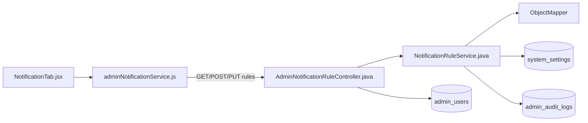
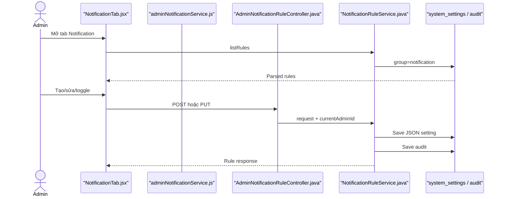

# Notification Rules Feature Analysis

## 1. Tóm tắt tổng quan

Notification Rules cho Admin liệt kê, tạo, sửa và bật/tắt quy tắc thông báo tự động trong tab Notification. Rule được serialize thành JSON và lưu trong `system_settings` với group `notification`; mọi create/update ghi Admin audit log.

## 2. Bản đồ cấu trúc

| File | Vai trò | Loại |
|---|---|---|
| [NotificationTab.jsx](apps/frontend/src/features/management/components/admin/settings/NotificationTab.jsx) | Danh sách, form và toggle rule | React Component |
| [adminNotificationService.js](apps/frontend/src/shared/api/adminNotificationService.js) | Rule REST client | API Service |
| [AdminNotificationRuleController.java](apps/backend/src/main/java/com/jlpt/feature/admin/AdminNotificationRuleController.java) | List/create/update endpoints | Controller |
| [NotificationRuleService.java](apps/backend/src/main/java/com/jlpt/shared/notification/service/NotificationRuleService.java) | Validate, JSON serialize và audit | Service |
| [NotificationRuleRequest.java](apps/backend/src/main/java/com/jlpt/shared/notification/dto/NotificationRuleRequest.java) | Rule input | DTO |
| [NotificationRuleResponse.java](apps/backend/src/main/java/com/jlpt/shared/notification/dto/NotificationRuleResponse.java) | Rule output | DTO |
| [SystemSetting.java](apps/backend/src/main/java/com/jlpt/feature/admin/SystemSetting.java) | Lưu JSON theo key | Entity |
| [SystemSettingRepository.java](apps/backend/src/main/java/com/jlpt/feature/admin/SystemSettingRepository.java) | Query notification group | Repository |
| [AdminAuditLogRepository.java](apps/backend/src/main/java/com/jlpt/feature/admin/AdminAuditLogRepository.java) | Lưu audit | Repository |

## 3. Bản đồ kết nối



| Từ | Đến | Cách kết nối | Dữ liệu |
|---|---|---|---|
| NotificationTab | API service | async call | rule form |
| API service | Controller | REST | ruleKey/payload |
| Controller | Service | method | request + adminId |
| Service | ObjectMapper | JSON | rule fields |
| Service | repositories | JPA | setting/audit |

## 4. Luồng xử lý theo trình tự

1. Tab mount gọi `listNotificationRules`.
2. Controller trả các setting thuộc group `notification`; JSON lỗi bị log và bỏ qua.
3. Create gửi ruleKey, enabled, condition, channel và template.
4. Service chặn trùng ruleKey, serialize fields và lưu `SystemSetting`.
5. Update dùng `ruleKey` từ path thay vì tin key trong body.
6. Toggle là update lại cùng rule với `isEnabled` đảo giá trị.
7. Create/update ghi audit kèm Admin actor.



## 5. Vai trò đoạn code quan trọng

[NotificationTab.jsx#L215](apps/frontend/src/features/management/components/admin/settings/NotificationTab.jsx#L215)

```jsx
async function handleSubmit(form) {
  // Validate L1 đã chạy trong RuleForm; tại đây chỉ chuẩn hóa description và gọi API.
  const payload = { ...form, description: form.description.trim() };
  if (editing.mode === 'create') {
    // Create dùng ruleKey mới; backend sẽ chặn duplicate.
    await createNotificationRule(payload);
  } else {
    // Update lấy ruleKey từ URL path.
    await updateNotificationRule(form.ruleKey, payload);
  }
}
```

[NotificationRuleService.java#L49](apps/backend/src/main/java/com/jlpt/shared/notification/service/NotificationRuleService.java#L49)

```java
public NotificationRuleResponse createRule(NotificationRuleRequest req, Long adminId) {
    if (settingRepository.existsBySettingGroupAndSettingKey(NOTIFICATION_GROUP, req.getRuleKey())) {
        throw new BusinessException(400, "DUPLICATE_RULE_KEY",
                "Rule key đã tồn tại: " + req.getRuleKey());
    }
    // Toàn bộ cấu hình rule được đóng thành JSON trong một setting.
    String jsonValue = buildJson(req);
    SystemSetting setting = SystemSetting.builder()
            .settingGroup(NOTIFICATION_GROUP)
            .settingKey(req.getRuleKey())
            .settingValue(jsonValue)
            .valueType(SystemSetting.ValueType.STRING)
            .isEditable(true)
            .updatedBy(admin)
            .build();
    settingRepository.save(setting);
}
```

## 6. Dữ liệu di chuyển

Form fields → `NotificationRuleRequest` → JSON map → `system_settings.setting_value` → parse JSON → `NotificationRuleResponse` → table/toggle UI.

## 7. Bảng tra cứu tổng hợp

| Bước | File | Function | Kết nối tới | Dữ liệu | Ghi chú |
|---:|---|---|---|---|---|
| 1 | NotificationTab | `fetchRules` | API | none | List |
| 2 | Controller | `list` | Service | none | Admin only |
| 3 | Tab | `handleSubmit` | POST/PUT | form | Create/update |
| 4 | Service | `createRule` | settings repo | JSON | Duplicate guard |
| 5 | Service | `updateRule` | settings/audit | path key | Audit |

## 8. Các mục cần bổ sung context

- Source quản lý cấu hình rule nhưng không cho thấy một scheduler tổng quát tự động đọc và thực thi tất cả rule này.
- Không có endpoint delete rule trong controller hiện tại.

<!-- BACKEND-METHOD-INVENTORY:START -->

## Phụ lục — Danh mục đầy đủ hàm backend

> Phần này được đối chiếu trực tiếp từ source backend hiện tại. Chỉ liệt kê các hàm khai báo tường minh trong những file Java mà tài liệu này tham chiếu; các hàm do Lombok/JPA sinh tự động không xuất hiện trong source nên không liệt kê.

### `AdminAuditLogRepository`

Nguồn: [AdminAuditLogRepository.java](../../../apps/backend/src/main/java/com/jlpt/feature/admin/AdminAuditLogRepository.java)

| # | Hàm backend (đầy đủ chữ ký) | Endpoint | Tác dụng/chức năng phục vụ |
|---:|---|---|---|
| 1 | [`Optional<AdminAuditLog> findFirstByTargetIdAndTargetTableAndActionInOrderByCreatedAtDesc(Long targetId, String targetTable, List<String> actions)`](../../../apps/backend/src/main/java/com/jlpt/feature/admin/AdminAuditLogRepository.java#L28) | `—` | Đọc hoặc tra cứu dữ liệu phục vụ `find first by target id and target table and action in order by created at desc`. |

### `AdminNotificationRuleController`

Nguồn: [AdminNotificationRuleController.java](../../../apps/backend/src/main/java/com/jlpt/feature/admin/AdminNotificationRuleController.java)

| # | Hàm backend (đầy đủ chữ ký) | Endpoint | Tác dụng/chức năng phục vụ |
|---:|---|---|---|
| 1 | [`ResponseEntity<ApiResponse<List<NotificationRuleResponse>>> list()`](../../../apps/backend/src/main/java/com/jlpt/feature/admin/AdminNotificationRuleController.java#L34) | `GET` | Xử lý endpoint `GET`; thực hiện nghiệp vụ `list`. |
| 2 | [`ResponseEntity<ApiResponse<NotificationRuleResponse>> create(Authentication authentication, @Valid @RequestBody NotificationRuleRequest req)`](../../../apps/backend/src/main/java/com/jlpt/feature/admin/AdminNotificationRuleController.java#L39) | `POST` | Xử lý endpoint `POST`; thực hiện nghiệp vụ `create`. |
| 3 | [`ResponseEntity<ApiResponse<NotificationRuleResponse>> update(Authentication authentication, @PathVariable String ruleKey, @Valid @RequestBody NotificationRuleRequest req)`](../../../apps/backend/src/main/java/com/jlpt/feature/admin/AdminNotificationRuleController.java#L46) | `PUT /{ruleKey}` | Xử lý endpoint `PUT /{ruleKey}`; thực hiện nghiệp vụ `update`. |
| 4 | [`Long currentAdminId(Authentication authentication)`](../../../apps/backend/src/main/java/com/jlpt/feature/admin/AdminNotificationRuleController.java#L56) | `—` | Thực hiện xử lý backend `current admin id` trong `AdminNotificationRuleController`. |

### `SystemSetting`

Nguồn: [SystemSetting.java](../../../apps/backend/src/main/java/com/jlpt/feature/admin/SystemSetting.java)

| # | Hàm backend (đầy đủ chữ ký) | Endpoint | Tác dụng/chức năng phục vụ |
|---:|---|---|---|
| 1 | [`void onUpdate()`](../../../apps/backend/src/main/java/com/jlpt/feature/admin/SystemSetting.java#L48) | `—` | Thực hiện xử lý backend `on update` trong `SystemSetting`. |
| 2 | [`String getValue()`](../../../apps/backend/src/main/java/com/jlpt/feature/admin/SystemSetting.java#L64) | `—` | Đọc hoặc tra cứu dữ liệu phục vụ `get value`. |

### `SystemSettingRepository`

Nguồn: [SystemSettingRepository.java](../../../apps/backend/src/main/java/com/jlpt/feature/admin/SystemSettingRepository.java)

| # | Hàm backend (đầy đủ chữ ký) | Endpoint | Tác dụng/chức năng phục vụ |
|---:|---|---|---|
| 1 | [`List<SystemSetting> findBySettingGroup(String settingGroup)`](../../../apps/backend/src/main/java/com/jlpt/feature/admin/SystemSettingRepository.java#L10) | `—` | Đọc hoặc tra cứu dữ liệu phục vụ `find by setting group`. |
| 2 | [`Optional<SystemSetting> findBySettingGroupAndSettingKey(String settingGroup, String settingKey)`](../../../apps/backend/src/main/java/com/jlpt/feature/admin/SystemSettingRepository.java#L12) | `—` | Đọc hoặc tra cứu dữ liệu phục vụ `find by setting group and setting key`. |
| 3 | [`boolean existsBySettingGroupAndSettingKey(String settingGroup, String settingKey)`](../../../apps/backend/src/main/java/com/jlpt/feature/admin/SystemSettingRepository.java#L14) | `—` | Kiểm tra điều kiện/trạng thái phục vụ `exists by setting group and setting key`. |

### `NotificationRuleService`

Nguồn: [NotificationRuleService.java](../../../apps/backend/src/main/java/com/jlpt/shared/notification/service/NotificationRuleService.java)

| # | Hàm backend (đầy đủ chữ ký) | Endpoint | Tác dụng/chức năng phục vụ |
|---:|---|---|---|
| 1 | [`List<NotificationRuleResponse> listRules()`](../../../apps/backend/src/main/java/com/jlpt/shared/notification/service/NotificationRuleService.java#L39) | `—` | Đọc hoặc tra cứu dữ liệu phục vụ `list rules`. |
| 2 | [`NotificationRuleResponse createRule(NotificationRuleRequest req, Long adminId)`](../../../apps/backend/src/main/java/com/jlpt/shared/notification/service/NotificationRuleService.java#L49) | `—` | Tạo hoặc ghi dữ liệu cho nghiệp vụ `create rule`. |
| 3 | [`NotificationRuleResponse updateRule(String ruleKey, NotificationRuleRequest req, Long adminId)`](../../../apps/backend/src/main/java/com/jlpt/shared/notification/service/NotificationRuleService.java#L80) | `—` | Cập nhật trạng thái/dữ liệu cho nghiệp vụ `update rule`. |
| 4 | [`SystemSetting findRuleOrThrow(String ruleKey)`](../../../apps/backend/src/main/java/com/jlpt/shared/notification/service/NotificationRuleService.java#L112) | `—` | Đọc hoặc tra cứu dữ liệu phục vụ `find rule or throw`. |
| 5 | [`AdminUser findAdminOrThrow(Long adminId)`](../../../apps/backend/src/main/java/com/jlpt/shared/notification/service/NotificationRuleService.java#L118) | `—` | Đọc hoặc tra cứu dữ liệu phục vụ `find admin or throw`. |
| 6 | [`String buildJson(NotificationRuleRequest req)`](../../../apps/backend/src/main/java/com/jlpt/shared/notification/service/NotificationRuleService.java#L124) | `—` | Biến đổi/tổng hợp dữ liệu nội bộ cho `build json`. |
| 7 | [`NotificationRuleResponse parseRule(SystemSetting setting)`](../../../apps/backend/src/main/java/com/jlpt/shared/notification/service/NotificationRuleService.java#L139) | `—` | Thực hiện xử lý backend `parse rule` trong `NotificationRuleService`. |

**Tổng cộng:** `17` hàm backend trong `7` file Java được tham chiếu.

<!-- BACKEND-METHOD-INVENTORY:END -->
