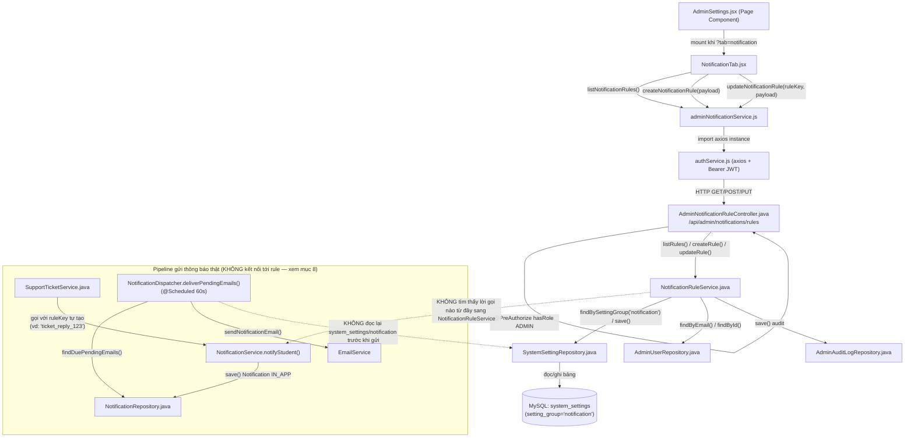
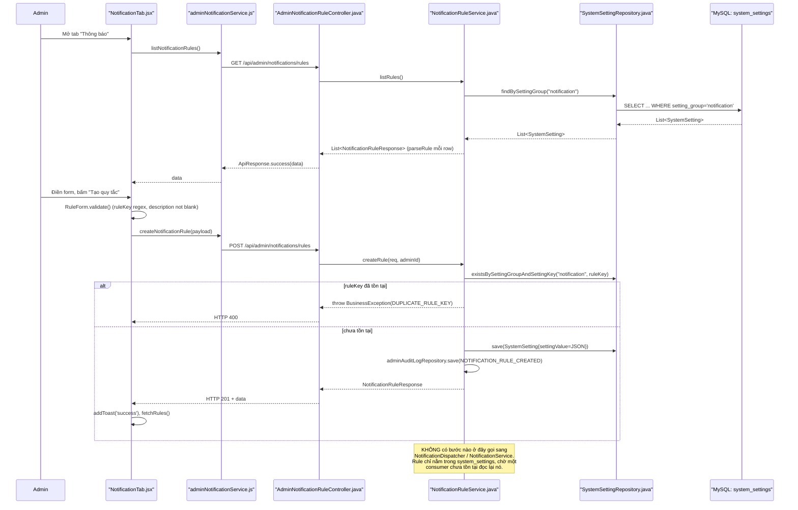

# Phân Tích Feature: admin-notification-rules (Quy Tắc Thông Báo Tự Động — Admin Settings, tab "Thông báo")

> **Tác giả phân tích:** AI Senior Software Architect
> **Ngày phân tích:** 2026-07-27
> **Phạm vi:** Backlog task "Notification — Notification Rules" (UC-40 trong code), màn hình **Admin Settings Page → tab "Notification"** (`NotificationTab.jsx`). Đây là công cụ CRUD cho Admin cấu hình **quy tắc thông báo tự động** (rule key, điều kiện kích hoạt, kênh, template, bật/tắt) — **KHÔNG** phải tính năng "Gửi thông báo" thủ công/broadcast của Staff (`sendBroadcast` / luồng qua `NotificationService.broadcast()`), tính năng đó chỉ được nêu tên khi gặp, không phân tích sâu.
> **Nguồn:** Đọc trực tiếp source code trong workspace. Trang khung `AdminSettings.jsx` (cơ chế tab qua query string `?tab=`) đã được phân tích chi tiết ở [admin-system_feature_analysis.md](../../../docs/02-SDD-Architecture/feat_flow/admin-system_feature_analysis.md) — mục 1 dưới đây chỉ nhắc lại phần liên quan, không lặp lại toàn bộ.

---

## 1. Tóm Tắt Tổng Quan

Feature **admin-notification-rules** (tên use case trong code: **UC-40**) cho phép Admin tạo/sửa/liệt kê các **"quy tắc thông báo tự động"** — mỗi rule gồm: `ruleKey` (định danh duy nhất), mô tả, cờ bật/tắt (`isEnabled`), điều kiện kích hoạt dạng text tự do (`triggerCondition`, ví dụ `"streak_days >= 7"`), kênh gửi (`in_app`/`email`/`both`), và một cặp template (`templateTitle`/`templateContent`). Đây là tab con **"Thông báo"** trong trang `AdminSettings.jsx` (khung tab dùng chung, xem tài liệu đã dẫn ở trên), được chọn khi URL là `/admin/settings?tab=notification`.

Feature trải dài trên 3 tầng:

| Tầng | Mô tả |
|------|-------|
| **Frontend (React)** | [NotificationTab.jsx](../../../apps/frontend/src/components/admin/settings/NotificationTab.jsx) — render danh sách rule, form tạo/sửa inline, toggle bật/tắt — gọi [adminNotificationService.js](../../../apps/frontend/src/api/adminNotificationService.js) |
| **Backend (Spring Boot)** | [AdminNotificationRuleController.java](../../../apps/backend/src/main/java/com/jlpt/feature/admin/AdminNotificationRuleController.java) nhận request → [NotificationRuleService.java](../../../apps/backend/src/main/java/com/jlpt/shared/notification/service/NotificationRuleService.java) xử lý (serialize rule thành JSON, lưu như một `SystemSetting` với `settingGroup = "notification"`) |
| **Database (MySQL)** | Bảng dùng chung `system_settings` (`setting_group='notification'`, `setting_key=<ruleKey>`, `setting_value=<JSON blob>`) — **không có bảng riêng cho notification rule** |

**Entry point**: route `/admin/settings?tab=notification` (frontend) → `GET/POST/PUT /api/admin/notifications/rules` (backend, yêu cầu role `ADMIN`).

**Phát hiện quan trọng nhất (xem chi tiết mục 3, 4, 6, 8)**: sau khi đọc toàn bộ pipeline gửi thông báo thật sự ([NotificationDispatcher.java](../../../apps/backend/src/main/java/com/jlpt/feature/notification/service/NotificationDispatcher.java), [NotificationService.java](../../../apps/backend/src/main/java/com/jlpt/feature/notification/service/NotificationService.java)), **không tìm thấy bất kỳ điểm nào trong code đọc lại rule đã cấu hình để quyết định gửi/không gửi, chọn kênh, hay dùng template**. `NotificationRuleService` chỉ được 2 nơi sử dụng trong toàn bộ backend: chính nó và `AdminNotificationRuleController` (đã xác nhận bằng grep toàn repo). Nói cách khác, tính năng này ở trạng thái **CRUD độc lập, chưa được nối dây (wired) vào pipeline gửi thông báo thật**. Xem mục 8 để biết phạm vi đã tìm kiếm.

---

## 2. Bản Đồ Cấu Trúc (Các "Mảnh" Và Vai Trò)

### 2.1 Frontend

| File | Vai trò | Loại |
|------|---------|------|
| [NotificationTab.jsx](../../../apps/frontend/src/components/admin/settings/NotificationTab.jsx) | Tab "Thông báo": load danh sách rule, form tạo/sửa inline (`RuleForm`), validate client-side, toggle bật/tắt rule | Component |
| [adminNotificationService.js](../../../apps/frontend/src/api/adminNotificationService.js) | Tầng giao tiếp HTTP riêng cho feature này: `listNotificationRules()`, `createNotificationRule()`, `updateNotificationRule()` | API Service |
| [authService.js](../../../apps/frontend/src/api/authService.js) | Axios instance dùng chung (đính Bearer token) — được `adminNotificationService.js` import (`import api from './authService'`) | Axios Config / Auth |
| [validation.js](../../../apps/frontend/src/utils/validation.js) | Cung cấp hàm `isBlank()` dùng để validate field "Mô tả" trong `RuleForm` | Utility |
| [ManageUsersIcons.jsx](../../../apps/frontend/src/components/admin/ManageUsersIcons.jsx) | Cung cấp icon `IcPlus`, `IcEdit` dùng trong UI của tab | Component (icon) |
| [AdminSettings.jsx](../../../apps/frontend/src/pages/admin/AdminSettings.jsx) | Trang khung: quản lý tab active qua query string `?tab=`, mount `NotificationTab` khi `activeTab === 'notification'` (đã phân tích chi tiết ở tài liệu `admin-system`, chỉ liên kết ở đây) | Page Component |

### 2.2 Backend — Tầng cấu hình rule (đọc/ghi)

| File | Vai trò | Loại |
|------|---------|------|
| [AdminNotificationRuleController.java](../../../apps/backend/src/main/java/com/jlpt/feature/admin/AdminNotificationRuleController.java) | Nhận HTTP request `GET/POST/PUT /api/admin/notifications/rules[/{ruleKey}]`, yêu cầu role `ADMIN` (`@PreAuthorize("hasRole('ADMIN')")`), lấy `adminId` từ `Authentication`, ủy quyền cho Service | Controller |
| [NotificationRuleService.java](../../../apps/backend/src/main/java/com/jlpt/shared/notification/service/NotificationRuleService.java) | Business logic: liệt kê rule (đọc theo `settingGroup="notification"`), tạo rule mới (check trùng `ruleKey`, serialize field thành JSON), cập nhật rule, parse JSON ngược lại thành DTO, ghi audit log | Service |
| [NotificationRuleRequest.java](../../../apps/backend/src/main/java/com/jlpt/shared/notification/dto/NotificationRuleRequest.java) | DTO request — validate `ruleKey` (regex chữ thường/số/underscore), `description` bắt buộc, `channel` (regex `in_app|email|both`), giới hạn độ dài các field | DTO Request |
| [NotificationRuleResponse.java](../../../apps/backend/src/main/java/com/jlpt/shared/notification/dto/NotificationRuleResponse.java) | DTO response — toàn bộ field rule + `updatedAt`, `updatedByAdminName` | DTO Response |
| [SystemSetting.java](../../../apps/backend/src/main/java/com/jlpt/feature/admin/SystemSetting.java) | Entity JPA bảng `system_settings` dùng chung — mỗi rule là 1 row `(settingGroup='notification', settingKey=ruleKey, settingValue=<JSON>)` | Entity (dùng chung với feature `admin-system`) |
| [SystemSettingRepository.java](../../../apps/backend/src/main/java/com/jlpt/feature/admin/SystemSettingRepository.java) | Truy vấn DB: `findBySettingGroup`, `findBySettingGroupAndSettingKey`, `existsBySettingGroupAndSettingKey` | Repository (dùng chung) |
| [AdminAuditLog.java](../../../apps/backend/src/main/java/com/jlpt/feature/admin/AdminAuditLog.java) / [AdminAuditLogRepository.java](../../../apps/backend/src/main/java/com/jlpt/feature/admin/AdminAuditLogRepository.java) | Ghi log hành động `NOTIFICATION_RULE_CREATED` / `NOTIFICATION_RULE_UPDATED` mỗi khi Admin thao tác | Entity + Repository |
| [AdminUser.java](../../../apps/backend/src/main/java/com/jlpt/feature/admin/AdminUser.java) / [AdminUserRepository.java](../../../apps/backend/src/main/java/com/jlpt/feature/admin/AdminUserRepository.java) | Xác định Admin đang thao tác (`findByEmail`, `findById`) để gắn `updatedBy` và audit log | Entity + Repository |
| [ResourceNotFoundException.java](../../../apps/backend/src/main/java/com/jlpt/shared/exception/ResourceNotFoundException.java) / [BusinessException.java](../../../apps/backend/src/main/java/com/jlpt/shared/exception/BusinessException.java) | Exception nghiệp vụ (rule không tồn tại, trùng `ruleKey`, lỗi serialize JSON) — được `@ControllerAdvice` toàn cục bắt (ADR-008) | Exception |
| [SecurityConfig.java](../../../apps/backend/src/main/java/com/jlpt/shared/config/SecurityConfig.java) | Cấu hình toàn cục: mọi request khớp `/api/admin/**` bắt buộc role `ADMIN` (lớp bảo vệ thứ 2 ngoài `@PreAuthorize` trên controller) | Security Config |

### 2.3 Backend — Tầng gửi thông báo thật (được kỳ vọng tiêu thụ rule, nhưng **không** đọc rule — xem mục 3, 4, 8)

| File | Vai trò | Loại |
|------|---------|------|
| [NotificationDispatcher.java](../../../apps/backend/src/main/java/com/jlpt/feature/notification/service/NotificationDispatcher.java) | Bean `@Async`/`@Scheduled` riêng: `broadcastAsync()` ghi record thông báo cho broadcast thủ công (Staff, UC-30, **không thuộc phạm vi phân tích này**); `deliverPendingEmails()` chạy định kỳ mỗi 60s để gửi email cho thông báo kênh `email`/`both` chưa gửi | Service |
| [NotificationService.java](../../../apps/backend/src/main/java/com/jlpt/feature/notification/service/NotificationService.java) | `notifyStudent()` — hàm dùng chung để các feature khác (ticket reply, chấm điểm speaking...) tạo 1 thông báo `IN_APP` tự động (`isAuto=true`) cho 1 student; cũng chứa `broadcast()` cho luồng Staff (ngoài phạm vi) | Service |
| [Notification.java](../../../apps/backend/src/main/java/com/jlpt/feature/notification/Notification.java) | Entity JPA bảng `notifications` — có cột `rule_key` (String tự do) và `is_auto` | Entity |
| [NotificationRepository.java](../../../apps/backend/src/main/java/com/jlpt/feature/notification/NotificationRepository.java) | Truy vấn DB cho `notifications` (danh sách hiển thị, đếm chưa đọc, thông báo email đến hạn) | Repository |
| [NotificationTypeConverter.java](../../../apps/backend/src/main/java/com/jlpt/feature/notification/NotificationTypeConverter.java) / [ChannelConverter.java](../../../apps/backend/src/main/java/com/jlpt/feature/notification/ChannelConverter.java) | JPA `AttributeConverter` cho 2 enum `NotificationType`/`Channel` của entity `Notification` | Converter |
| [SupportTicketService.java](../../../apps/backend/src/main/java/com/jlpt/feature/support/service/SupportTicketService.java) | Ví dụ nơi gọi `notifyStudent(...)` với `ruleKey` là chuỗi tự tạo runtime (`"ticket_reply_" + reply.getId()`...) — **không liên quan đến `ruleKey` do Admin tạo trong tab Notification** | Service (feature khác, chỉ dùng để minh chứng cho phát hiện ở mục 3/8) |

---

## 3. Bản Đồ Kết Nối (Ai Gọi Ai, Dữ Liệu Truyền Qua Đâu)

### 3.1 Diagram Mermaid — Kiến trúc tổng thể (bao gồm nhánh "kỳ vọng nhưng không tồn tại")



### 3.2 Bảng phụ: Từ đâu đến đâu, kết nối bằng gì, dữ liệu gì

| Từ (File A) | Đến (File B) | Cách kết nối | Dữ liệu truyền |
|---|---|---|---|
| [NotificationTab.jsx](../../../apps/frontend/src/components/admin/settings/NotificationTab.jsx) | [adminNotificationService.js](../../../apps/frontend/src/api/adminNotificationService.js) | Gọi hàm JS trực tiếp (import) | `payload` (object rule), `ruleKey` (string) |
| [adminNotificationService.js](../../../apps/frontend/src/api/adminNotificationService.js) | [authService.js](../../../apps/frontend/src/api/authService.js) | `import api from './authService'` — dùng axios instance chung | HTTP request/response qua axios |
| [adminNotificationService.js](../../../apps/frontend/src/api/adminNotificationService.js) | [AdminNotificationRuleController.java](../../../apps/backend/src/main/java/com/jlpt/feature/admin/AdminNotificationRuleController.java) | HTTP `GET/POST/PUT /api/admin/notifications/rules[/{ruleKey}]` với Bearer JWT | JSON body (`NotificationRuleRequest`) / response `ApiResponse<...>` |
| [AdminNotificationRuleController.java](../../../apps/backend/src/main/java/com/jlpt/feature/admin/AdminNotificationRuleController.java) | [NotificationRuleService.java](../../../apps/backend/src/main/java/com/jlpt/shared/notification/service/NotificationRuleService.java) | Gọi method Java (DI qua constructor, Lombok `@RequiredArgsConstructor`) | `NotificationRuleRequest req`, `Long adminId` |
| [NotificationRuleService.java](../../../apps/backend/src/main/java/com/jlpt/shared/notification/service/NotificationRuleService.java) | [SystemSettingRepository.java](../../../apps/backend/src/main/java/com/jlpt/feature/admin/SystemSettingRepository.java) | JPA repository method call | Entity `SystemSetting` (settingGroup="notification", settingKey=ruleKey, settingValue=JSON) |
| [NotificationRuleService.java](../../../apps/backend/src/main/java/com/jlpt/shared/notification/service/NotificationRuleService.java) | [AdminAuditLogRepository.java](../../../apps/backend/src/main/java/com/jlpt/feature/admin/AdminAuditLogRepository.java) | JPA `save()` | Entity `AdminAuditLog` (action=`NOTIFICATION_RULE_CREATED`/`NOTIFICATION_RULE_UPDATED`) |
| [SupportTicketService.java](../../../apps/backend/src/main/java/com/jlpt/feature/support/service/SupportTicketService.java) | [NotificationService.java](../../../apps/backend/src/main/java/com/jlpt/feature/notification/service/NotificationService.java) | Gọi `notificationService.notifyStudent(...)` | `title`, `content` (hardcode literal trong `SupportTicketService`, không đọc từ rule template), `ruleKey` tự sinh runtime (không phải ruleKey do Admin tạo) |
| [NotificationDispatcher.java](../../../apps/backend/src/main/java/com/jlpt/feature/notification/service/NotificationDispatcher.java) | [NotificationRepository.java](../../../apps/backend/src/main/java/com/jlpt/feature/notification/NotificationRepository.java) | JPA query (`findDuePendingEmails`) | `List<Notification>` |
| **(không có)** | [NotificationRuleService.java](../../../apps/backend/src/main/java/com/jlpt/shared/notification/service/NotificationRuleService.java) | **Không tìm thấy** lời gọi nào từ `NotificationDispatcher`/`NotificationService`/`SupportTicketService` sang `NotificationRuleService` | — |

---

## 4. Luồng Xử Lý Theo Trình Tự

### 4.1 Luồng đã xác nhận: Admin tạo một rule mới

1. Admin mở `/admin/settings?tab=notification` → `AdminSettings.jsx` mount `NotificationTab` ([NotificationTab.jsx](../../../apps/frontend/src/components/admin/settings/NotificationTab.jsx), dòng 178).
2. Component gọi `fetchRules()` → `listNotificationRules()` trong [adminNotificationService.js](../../../apps/frontend/src/api/adminNotificationService.js) dòng 5-8 → `GET /admin/notifications/rules` (qua axios instance của `authService.js`, tự đính Bearer JWT).
3. Backend: `AdminNotificationRuleController.list()` (dòng 34-37) → `notificationRuleService.listRules()` (dòng 40-45 của `NotificationRuleService.java`) → `settingRepository.findBySettingGroup("notification")` → map từng row qua `parseRule()` (parse JSON → DTO).
4. Admin bấm "Tạo quy tắc" → `openCreate()` mở `RuleForm` với `EMPTY_FORM` (dòng 197-199, 18-22).
5. Admin nhập dữ liệu, submit → `RuleForm.validate()` (dòng 51-61) kiểm tra `ruleKey` theo regex `RULE_KEY_RE` và `description` không rỗng (dùng `isBlank()`).
6. `handleSubmit(form)` trong `NotificationTab` (dòng 215-234): trim `description`, gọi `createNotificationRule(payload)` → `POST /admin/notifications/rules`.
7. Backend: `AdminNotificationRuleController.create()` (dòng 39-44) — Bean Validation (`@Valid`) chạy lại toàn bộ rule của `NotificationRuleRequest` (regex `ruleKey`, `channel`, giới hạn độ dài) — lấy `adminId` từ `Authentication` qua `currentAdminId()` (dòng 56-61).
8. `NotificationRuleService.createRule()` (dòng 50-76): kiểm tra trùng `ruleKey` (`existsBySettingGroupAndSettingKey`) → nếu trùng, ném `BusinessException(400, "DUPLICATE_RULE_KEY", ...)`; nếu không, serialize toàn bộ field thành 1 chuỗi JSON (`buildJson()`, dòng 124-137) → lưu 1 row `SystemSetting` mới (`settingGroup="notification"`) → ghi `AdminAuditLog` (action=`NOTIFICATION_RULE_CREATED`).
9. Response trả `NotificationRuleResponse` (qua `parseRule()`) → FE hiện toast thành công, gọi lại `fetchRules()` để refresh danh sách.

### 4.2 Luồng đã xác nhận: Admin bật/tắt (`toggle`) một rule

1. `handleToggle(rule)` (dòng 236-250) gọi `updateNotificationRule(rule.ruleKey, buildPayload(rule, { isEnabled: !rule.isEnabled }))`.
2. `PUT /admin/notifications/rules/{ruleKey}` → `AdminNotificationRuleController.update()` (dòng 46-54) → `NotificationRuleService.updateRule()` (dòng 80-108): tìm rule theo `ruleKey` (`findRuleOrThrow`, ném `ResourceNotFoundException` nếu không có) → build lại `NotificationRuleRequest` (giữ `ruleKey` từ path, không tin `ruleKey` trong body) → serialize JSON mới, ghi đè `settingValue`, ghi audit log `NOTIFICATION_RULE_UPDATED`.
3. FE cập nhật state cục bộ (optimistic) và hiện toast.

### 4.3 Luồng **kỳ vọng nhưng KHÔNG tìm thấy trong code**: rule ảnh hưởng đến việc gửi thông báo thật

Đây là phần quan trọng nhất cần lưu ý cho người đọc: dựa trên tên "Notification Rules", kỳ vọng hợp lý là khi có một sự kiện hệ thống (vd học viên đạt streak 7 ngày), hệ thống sẽ:
   a. Tra `NotificationRuleService`/bảng `system_settings (group=notification)` theo `ruleKey` tương ứng,
   b. Kiểm tra `isEnabled` — nếu tắt thì bỏ qua,
   c. Dùng `channel` để quyết định gửi `IN_APP`/`email`/cả hai,
   d. Dùng `templateTitle`/`templateContent` để dựng nội dung thông báo.

**Sau khi đọc trực tiếp** [NotificationDispatcher.java](../../../apps/backend/src/main/java/com/jlpt/feature/notification/service/NotificationDispatcher.java) và [NotificationService.java](../../../apps/backend/src/main/java/com/jlpt/feature/notification/service/NotificationService.java), không bước nào trong 4 bước trên xuất hiện:

- `NotificationService.notifyStudent()` (dòng 45-62) nhận `title`, `content` là tham số **do caller truyền vào trực tiếp** (ví dụ [SupportTicketService.java](../../../apps/backend/src/main/java/com/jlpt/feature/support/service/SupportTicketService.java) dòng 172-178 truyền chuỗi hardcode `"Ticket cua ban co phan hoi moi"`), không có bước nào tra cứu template từ rule.
- `channel` bị **hardcode cứng** thành `Notification.Channel.IN_APP` (dòng 57 của `NotificationService.java`) — không đọc field `channel` của bất kỳ rule nào.
- Không có điều kiện `if (rule.isEnabled())` hay tương tự ở bất kỳ đâu trong `NotificationDispatcher`/`NotificationService`.
- `ruleKey` truyền vào `notifyStudent()` chỉ là một **chuỗi tag tự do được sinh runtime** (vd `"ticket_reply_" + reply.getId()`, `"speaking_graded_" + submissionId` — xem `SupportTicketService.java` dòng 177, 206, 366) — hoàn toàn khác với các `ruleKey` do Admin đặt trong tab Notification (vd `streak_reminder`). Nó chỉ được lưu vào cột `rule_key` của bảng `notifications` như một nhãn tham chiếu, không bao giờ được dùng để `SELECT` lại từ `system_settings`.
- `NotificationRuleService` (grep toàn repo) chỉ được reference bởi chính nó và `AdminNotificationRuleController` — không một service nào khác trong `feature/notification`, `feature/support`, hay bất kỳ `@Scheduled` job nào import nó.

→ **Kết luận**: tính năng "Notification Rules" hiện tại là một **bảng cấu hình đứng độc lập (CRUD only)**, được lưu trữ đúng cách và có audit log, nhưng **chưa có consumer nào đọc lại nó trong runtime gửi thông báo**. Xem thêm mục 8.

### 4.4 Sequence Diagram



---

## 5. Vai Trò Từng Đoạn Code Quan Trọng

### 5.1 Serialize rule thành JSON để lưu như 1 `SystemSetting` — [NotificationRuleService.java](../../../apps/backend/src/main/java/com/jlpt/shared/notification/service/NotificationRuleService.java) dòng 124-137

```java
private String buildJson(NotificationRuleRequest req) {
    Map<String, Object> map = new HashMap<>();
    // Toàn bộ field của rule được gộp thành 1 JSON blob duy nhất,
    // vì bảng system_settings chỉ có 1 cột settingValue (kiểu String/LONGTEXT).
    map.put("enabled", req.getIsEnabled());
    map.put("condition", req.getTriggerCondition());
    map.put("channel", req.getChannel());
    map.put("templateTitle", req.getTemplateTitle());
    map.put("templateContent", req.getTemplateContent());
    map.put("description", req.getDescription());
    try {
        return objectMapper.writeValueAsString(map);
    } catch (JsonProcessingException e) {
        // Lỗi serialize là lỗi hệ thống (không phải lỗi input) -> 500, không phải 400
        throw new BusinessException(500, "INTERNAL_ERROR", "Lỗi serialize JSON rule");
    }
}
```
Nhận dữ liệu từ: `NotificationRuleRequest` (đã qua `@Valid` ở Controller). Đưa dữ liệu đi đâu tiếp: chuỗi JSON trả về được gán vào `SystemSetting.settingValue` rồi `save()` xuống DB (dòng 55-65 / dòng 95-97).

### 5.2 Chống trùng `ruleKey` khi tạo mới — [NotificationRuleService.java](../../../apps/backend/src/main/java/com/jlpt/shared/notification/service/NotificationRuleService.java) dòng 50-53

```java
public NotificationRuleResponse createRule(NotificationRuleRequest req, Long adminId) {
    if (settingRepository.existsBySettingGroupAndSettingKey(NOTIFICATION_GROUP, req.getRuleKey())) {
        // ruleKey đóng vai trò "khóa nghiệp vụ" (business key) duy nhất trong nhóm 'notification'
        // vì system_settings dùng UNIQUE (setting_group, setting_key) ở tầng DB (xem V1__init_schema.sql)
        throw new BusinessException(400, "DUPLICATE_RULE_KEY", "Rule key đã tồn tại: " + req.getRuleKey());
    }
```
Đây là rẽ nhánh chính quyết định tạo mới thành công hay trả lỗi 400. Dữ liệu vào: `req.getRuleKey()` (đã qua regex `^[a-z][a-z0-9_]{2,49}$` ở DTO). Dữ liệu ra: exception được `@ControllerAdvice` toàn cục (ADR-008) bắt và format thành `ApiResponse` lỗi.

### 5.3 Update không tin `ruleKey` trong body, chỉ tin path — [NotificationRuleService.java](../../../apps/backend/src/main/java/com/jlpt/shared/notification/service/NotificationRuleService.java) dòng 85-93

```java
// Use ruleKey from path, not body
NotificationRuleRequest merged = new NotificationRuleRequest();
merged.setRuleKey(ruleKey);   // <-- lấy từ @PathVariable, KHÔNG lấy từ req.getRuleKey()
merged.setDescription(req.getDescription());
merged.setIsEnabled(req.getIsEnabled());
merged.setTriggerCondition(req.getTriggerCondition());
merged.setChannel(req.getChannel());
merged.setTemplateTitle(req.getTemplateTitle());
merged.setTemplateContent(req.getTemplateContent());
```
Đây là điểm phòng thủ quan trọng (đúng tinh thần "Client-trusted Data" trong `CLAUDE.md`): dù FE có gửi `ruleKey` khác trong payload (vd do bug hoặc tay chỉnh request), backend luôn dùng `ruleKey` từ URL path (`@PathVariable String ruleKey` ở Controller dòng 49) làm khóa update thật sự.

### 5.4 Nơi lẽ ra phải đọc rule nhưng không đọc — [NotificationService.java](../../../apps/backend/src/main/java/com/jlpt/feature/notification/service/NotificationService.java) dòng 44-62

```java
/** Tao 1 thong bao IN_APP cho 1 student tu su kien he thong. */
@Transactional
public void notifyStudent(
        StudentUser student,
        String title,          // <-- title do caller truyền cứng, KHÔNG lấy từ rule.templateTitle
        String content,        // <-- content do caller truyền cứng, KHÔNG lấy từ rule.templateContent
        Notification.NotificationType type,
        String ruleKey,        // <-- chỉ lưu làm nhãn tham chiếu, KHÔNG dùng để tra cứu NotificationRuleService
        StaffUser staffCreator) {
    notificationRepository.save(Notification.builder()
            .student(student)
            .title(title)
            .content(content)
            .notificationType(type)
            .channel(Notification.Channel.IN_APP)   // <-- HARDCODE luôn là IN_APP, không đọc rule.channel
            .isAuto(true)
            .ruleKey(ruleKey)
            .staffCreator(staffCreator)
            .build());
}
```
Giải thích: đây là bằng chứng code trực tiếp cho phát hiện ở mục 3/4 — hàm này là "cửa ngõ" duy nhất trong code hiện tại để tạo thông báo tự động (`isAuto=true`), nhưng nó **không có bất kỳ dependency nào tới `NotificationRuleService`** (không có field `notificationRuleService` trong class, xem toàn bộ import dòng 1-23 của file). Do đó dù Admin tắt (`isEnabled=false`) một rule hay đổi `channel` sang `email`, hành vi gửi thông báo tự động qua đường `notifyStudent()` **không thay đổi**.

### 5.5 Vòng lặp gửi email định kỳ — [NotificationDispatcher.java](../../../apps/backend/src/main/java/com/jlpt/feature/notification/service/NotificationDispatcher.java) dòng 64-83

```java
@Scheduled(fixedDelay = 60_000)
@Transactional
public void deliverPendingEmails() {
    // Chỉ lọc theo channel đã lưu SẴN trên record Notification (n.channel),
    // KHÔNG tra lại NotificationRuleService/system_settings để biết rule nào đang bật/tắt.
    List<Notification> due = notificationRepository.findDuePendingEmails(
            List.of(Notification.Channel.EMAIL, Notification.Channel.BOTH),
            LocalDateTime.now(),
            org.springframework.data.domain.PageRequest.of(0, EMAIL_BATCH));
    if (due.isEmpty()) return;
    ...
}
```
Xác nhận thêm: scheduler chạy mỗi 60 giây chỉ dựa vào cột `channel` **đã được ghi cứng lúc tạo Notification** (luôn là `IN_APP` với thông báo tự động qua `notifyStudent()`, xem 5.4), không có bước `SELECT` nào chạm tới bảng `system_settings`/`NotificationRuleService`.

---

## 6. Dữ Liệu Di Chuyển Như Thế Nào

Theo dõi cụ thể trường **`isEnabled`** (cờ bật/tắt rule) — do đây là dữ liệu thể hiện rõ nhất khoảng trống đã phát hiện:

1. **Nhập liệu (FE)**: checkbox "Kích hoạt quy tắc" trong `RuleForm` ([NotificationTab.jsx](../../../apps/frontend/src/components/admin/settings/NotificationTab.jsx) dòng 154-161) → state field `form.isEnabled` (boolean, JS).
2. **Đóng gói request (FE)**: `handleSubmit()`/`buildPayload()` gộp vào object `payload`/`form` gửi nguyên trạng lên API (dòng 219, 24-37) — tên field giữ nguyên `isEnabled`.
3. **HTTP JSON**: gửi trong body `POST`/`PUT` dưới key `"isEnabled": true/false`.
4. **Bean Validation (BE)**: `NotificationRuleRequest.isEnabled` — kiểu `Boolean`, `@NotNull` (dòng 23 của DTO) — tên field giữ nguyên `isEnabled`.
5. **Service (BE)**: `buildJson()` đổi tên field thành `"enabled"` (không phải `isEnabled`) khi đưa vào `Map` để serialize JSON (dòng 126 của `NotificationRuleService.java`) — **đây là điểm đổi tên duy nhất trong toàn luồng**.
6. **Lưu trữ (DB)**: chuỗi JSON (chứa `"enabled":true/false` cùng các field khác) được lưu nguyên văn vào cột `system_settings.setting_value` (kiểu `LONGTEXT`), 1 row cho mỗi `ruleKey`, `setting_group='notification'`.
7. **Đọc lại (BE)**: `parseRule()` (dòng 139-161) đọc lại JSON, lấy `json.getOrDefault("enabled", false)` → set vào `NotificationRuleResponse.isEnabled` — tên field trở lại `isEnabled` khi trả ra ngoài.
8. **Response (FE)**: `rules` state nhận lại `rule.isEnabled` — hiển thị badge "Đang bật"/"Đã tắt" (dòng 306-312 của `NotificationTab.jsx`).
9. **Điểm dừng của dữ liệu**: `isEnabled` **không đi xa hơn bước 8**. Nó không được bất kỳ service nào trong `feature/notification` (`NotificationService`, `NotificationDispatcher`) đọc lại để quyết định có tạo/gửi `Notification` hay không — xem mục 3.1/4.3/5.4. Vòng đời của trường này khép kín hoàn toàn trong CRUD Admin ↔ `system_settings`.

---

## 7. Bảng Tra Cứu Tổng Hợp

| Bước | File | Function | Kết nối tới | Dữ liệu | Ghi chú |
|---|---|---|---|---|---|
| 1 | [NotificationTab.jsx](../../../apps/frontend/src/components/admin/settings/NotificationTab.jsx) | `fetchRules()` | `adminNotificationService.js` | — | Load danh sách khi mount |
| 2 | [adminNotificationService.js](../../../apps/frontend/src/api/adminNotificationService.js) | `listNotificationRules()` | `GET /api/admin/notifications/rules` | — | Dùng axios instance từ `authService.js` |
| 3 | [AdminNotificationRuleController.java](../../../apps/backend/src/main/java/com/jlpt/feature/admin/AdminNotificationRuleController.java) | `list()` | `NotificationRuleService.listRules()` | — | `@PreAuthorize hasRole('ADMIN')` |
| 4 | [NotificationRuleService.java](../../../apps/backend/src/main/java/com/jlpt/shared/notification/service/NotificationRuleService.java) | `listRules()` | `SystemSettingRepository.findBySettingGroup("notification")` | `List<SystemSetting>` | Filter `parseRule()==null` khi JSON hỏng |
| 5 | [NotificationTab.jsx](../../../apps/frontend/src/components/admin/settings/NotificationTab.jsx) | `handleSubmit()` | `createNotificationRule`/`updateNotificationRule` | `form` (object) | Validate client trước (`RuleForm.validate`) |
| 6 | [AdminNotificationRuleController.java](../../../apps/backend/src/main/java/com/jlpt/feature/admin/AdminNotificationRuleController.java) | `create()`/`update()` | `NotificationRuleService` | `NotificationRuleRequest` | `@Valid` chạy Bean Validation |
| 7 | [NotificationRuleService.java](../../../apps/backend/src/main/java/com/jlpt/shared/notification/service/NotificationRuleService.java) | `createRule()`/`updateRule()` | `SystemSettingRepository.save()`, `AdminAuditLogRepository.save()` | `SystemSetting`, `AdminAuditLog` | Check trùng key (create); giữ `ruleKey` từ path (update) |
| 8 | [NotificationService.java](../../../apps/backend/src/main/java/com/jlpt/feature/notification/service/NotificationService.java) | `notifyStudent()` | `NotificationRepository.save()` | `title`,`content`,`type`,`ruleKey`(tag tự do) | **Không** gọi `NotificationRuleService` — xem mục 3/4/5.4 |
| 9 | [NotificationDispatcher.java](../../../apps/backend/src/main/java/com/jlpt/feature/notification/service/NotificationDispatcher.java) | `deliverPendingEmails()` | `NotificationRepository.findDuePendingEmails()`, `EmailService` | `List<Notification>` | Scheduled 60s; lọc theo `channel` đã lưu sẵn trên record, không tra rule |
| 10 | [SupportTicketService.java](../../../apps/backend/src/main/java/com/jlpt/feature/support/service/SupportTicketService.java) | `replyToTicket()`/`closeTicket()`/chấm điểm speaking | `NotificationService.notifyStudent()` | `title`/`content` hardcode, `ruleKey` tự sinh runtime | Minh chứng `ruleKey` ở đây khác hoàn toàn `ruleKey` do Admin đặt |

---

## 8. Các Mục Cần Bổ Sung Context

1. **Không tìm thấy consumer nào đọc lại `NotificationRuleService`/bảng `system_settings (group='notification')` trong pipeline gửi thông báo thật.** Đã grep toàn bộ `apps/backend/src/main/java` cho từ khóa `NotificationRuleService` — chỉ có 2 file match: chính `NotificationRuleService.java` và `AdminNotificationRuleController.java`. Đã đọc trực tiếp `NotificationDispatcher.java` và `NotificationService.java` (toàn bộ nội dung) — không có field, import hay lời gọi nào tới `NotificationRuleService`. Nếu có một cơ chế nối kết khác (vd một job/scheduler ở service khác chưa được liệt kê, hoặc dự định làm ở PR chưa merge), **source code hiện tại trong workspace không thể hiện điều đó** — cần Product Owner/BA xác nhận đây là thiết kế "cấu hình cho tương lai" (chưa nối dây) hay là một bug/thiếu sót cần bổ sung.
2. **`triggerCondition` là chuỗi tự do (free text), không có parser/evaluator nào trong code.** Không tìm thấy bất kỳ class nào parse hoặc evaluate biểu thức kiểu `"streak_days >= 7"`. Không rõ liệu có ý định xây dựng rule engine sau này hay đây chỉ là trường mô tả (documentation-only).
3. **Có một nhóm `system_settings` khác tên `auto_notification`** (thấy trong dữ liệu mẫu [V2__mock_data.sql](../../../apps/backend/src/main/resources/db/migration/V2__mock_data.sql) dòng 50-59, với các key phẳng như `streak_10_days_enabled`, `daily_flashcard_time`...) được liệt kê trong `VALID_GROUPS` của `AdminSettingsService.java` (dòng 23) — tức có thể đọc/ghi qua API chung `/api/admin/settings/auto_notification`. Đã grep các key này (`streak_10_days`, `daily_flashcard`, `exam_result_ready`) trong toàn bộ `apps/backend/src/main/java` — **không có kết quả nào**, tức nhóm dữ liệu mẫu này cũng không có consumer đọc lại. Đây là một cơ chế cấu hình notification **thứ 3, song song và không liên quan** tới `NotificationTab.jsx`/`AdminNotificationRuleController` — không thuộc phạm vi phân tích chính của tài liệu này, nhưng người đọc nên biết để tránh nhầm lẫn hai group `notification` vs `auto_notification`. Cần xác nhận với team liệu group này đã bị deprecate hay đang chờ 1 feature khác dùng.
4. **Không tìm thấy endpoint DELETE (xóa/vô hiệu hóa cứng) rule** — `AdminNotificationRuleController` chỉ có `list`/`create`/`update`. Việc "xóa" một rule chỉ có thể thực hiện gián tiếp qua `update` với `isEnabled=false` (tắt), phù hợp tinh thần Soft Delete của `CLAUDE.md`/ADR-004, nhưng không có cách xóa hẳn 1 rule key khỏi hệ thống nếu tạo nhầm — cần xác nhận đây có phải là chủ ý thiết kế.
5. **Không tìm thấy unit test/integration test** cho `NotificationRuleService`, `AdminNotificationRuleController`, hay `NotificationTab.jsx` (đã tìm theo tên file `*Test*` liên quan — không có kết quả).
6. **`NotificationTypeConverter.java`/`ChannelConverter.java`** thuộc entity `Notification` (bảng `notifications`), không trực tiếp thuộc luồng CRUD rule — được liệt kê ở mục 2.3 vì nằm trong pipeline gửi thông báo mà đáng lẽ phải tiêu thụ rule; không có gì đặc biệt cần bổ sung thêm về 2 file này.
