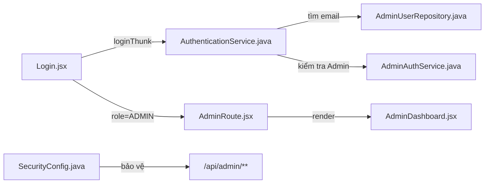
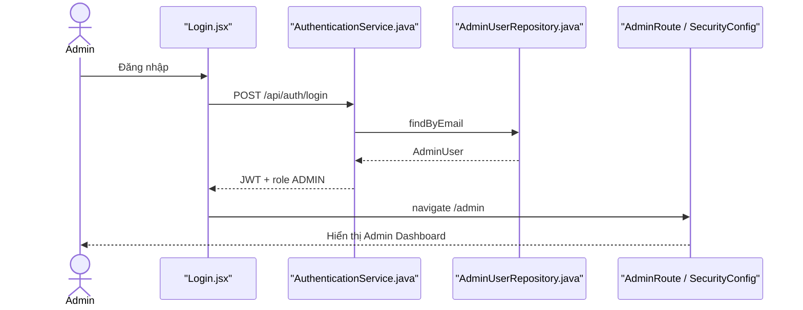

# Admin Login Feature Analysis

## 1. Tóm tắt tổng quan

Admin dùng chung form và endpoint login với các role khác, nhưng backend ưu tiên nhận diện Admin và frontend chỉ cho vào `/admin` khi response có `role=ADMIN`. Route admin được bảo vệ ở cả `AdminRoute.jsx` và Spring Security `/api/admin/**`.

## 2. Bản đồ cấu trúc

| File | Vai trò | Loại |
|---|---|---|
| [Login.jsx](apps/frontend/src/features/auth/login/Login.jsx) | Form và điều hướng Admin | React Page |
| [authSlice.js](apps/frontend/src/features/auth/authSlice.js) | Lưu token/role Admin | Redux Slice |
| [AdminRoute.jsx](apps/frontend/src/shared/components/common/AdminRoute.jsx) | Chặn UI không có role Admin | Route Guard |
| [AuthController.java](apps/backend/src/main/java/com/jlpt/feature/auth/AuthController.java) | Endpoint login chung | Controller |
| [AuthenticationService.java](apps/backend/src/main/java/com/jlpt/feature/auth/AuthenticationService.java) | Nhận diện và xác thực Admin | Service |
| [AdminAuthService.java](apps/backend/src/main/java/com/jlpt/feature/admin/AdminAuthService.java) | Logic trạng thái/đăng nhập Admin | Service |
| [AdminUserRepository.java](apps/backend/src/main/java/com/jlpt/feature/admin/AdminUserRepository.java) | Tìm Admin theo email | Repository |
| [SecurityConfig.java](apps/backend/src/main/java/com/jlpt/shared/config/SecurityConfig.java) | Bắt buộc ROLE_ADMIN cho API Admin | Security Config |

## 3. Bản đồ kết nối



| Từ | Đến | Cách kết nối | Dữ liệu |
|---|---|---|---|
| Login | Authentication | HTTP `/api/auth/login` | credentials |
| Authentication | Admin repository | JPA | email |
| Login | AdminRoute | navigation | role/token |
| AdminRoute | Admin pages | React Router | authenticated user |
| SecurityConfig | Admin API | authorization | JWT authorities |

## 4. Luồng xử lý theo trình tự

1. Admin nhập credentials tại `Login.handleSubmit`.
2. Backend tìm Admin trước các loại tài khoản còn lại tại `AuthenticationService.login`.
3. `AdminAuthService` kiểm tra mật khẩu/trạng thái và tạo response có role Admin.
4. Frontend lưu token, nhận `res.role === 'ADMIN'` và chuyển `/admin`.
5. `AdminRoute` kiểm tra session phía client.
6. Mọi request `/api/admin/**` vẫn phải vượt qua Spring Security với `ROLE_ADMIN`.



## 5. Vai trò đoạn code quan trọng

[Login.jsx#L52](apps/frontend/src/features/auth/login/Login.jsx#L52)

```jsx
} else if (res.role === 'ADMIN') {
  // Chỉ response được backend xác định là ADMIN mới đi vào khu vực quản trị.
  navigate('/admin');
}
```

[SecurityConfig.java#L54](apps/backend/src/main/java/com/jlpt/shared/config/SecurityConfig.java#L54)

```java
.authorizeHttpRequests(auth -> auth.requestMatchers(PUBLIC_URLS)
        .permitAll()
        // UI guard chỉ hỗ trợ trải nghiệm; backend mới là lớp phân quyền bắt buộc.
        .requestMatchers("/api/admin/**")
        .hasRole("ADMIN")
        .anyRequest()
        .authenticated())
```

## 6. Dữ liệu di chuyển

Credentials → Admin lookup → JWT chứa authority → local session → Authorization header → Spring Security xác minh trước mỗi Admin API.

## 7. Bảng tra cứu tổng hợp

| Bước | File | Function | Kết nối tới | Dữ liệu | Ghi chú |
|---:|---|---|---|---|---|
| 1 | `Login.jsx` | `handleSubmit` | auth thunk | credentials | Form chung |
| 2 | `AuthenticationService` | `login` | Admin repo | email | Nhận diện Admin |
| 3 | `Login.jsx` | role branch | `/admin` | role | Điều hướng |
| 4 | `AdminRoute.jsx` | guard | Admin page | session | Guard UI |
| 5 | `SecurityConfig` | filter chain | Admin API | JWT | Guard thật |

## 8. Các mục cần bổ sung context

- Không có form login riêng cho Admin; Admin dùng `/login` chung.
- Chi tiết chữ ký/claim JWT nằm trong security component, ngoài phạm vi file lõi của luồng này.

<!-- BACKEND-METHOD-INVENTORY:START -->

## Phụ lục — Danh mục đầy đủ hàm backend

> Phần này được đối chiếu trực tiếp từ source backend hiện tại. Chỉ liệt kê các hàm khai báo tường minh trong những file Java mà tài liệu này tham chiếu; các hàm do Lombok/JPA sinh tự động không xuất hiện trong source nên không liệt kê.

### `AdminAuthService`

Nguồn: [AdminAuthService.java](../../../apps/backend/src/main/java/com/jlpt/feature/admin/AdminAuthService.java)

| # | Hàm backend (đầy đủ chữ ký) | Endpoint | Tác dụng/chức năng phục vụ |
|---:|---|---|---|
| 1 | [`LoginApiResponse processAdminLogin(AdminUser admin, String rawPassword, String ip)`](../../../apps/backend/src/main/java/com/jlpt/feature/admin/AdminAuthService.java#L34) | `—` | Thực hiện xử lý backend `process admin login` trong `AdminAuthService`. |
| 2 | [`String generateToken()`](../../../apps/backend/src/main/java/com/jlpt/feature/admin/AdminAuthService.java#L114) | `—` | Thực hiện xử lý backend `generate token` trong `AdminAuthService`. |
| 3 | [`void audit(AdminUser admin, String action, String targetTable, Long targetId, String ip, String desc)`](../../../apps/backend/src/main/java/com/jlpt/feature/admin/AdminAuthService.java#L120) | `—` | Thực hiện xử lý backend `audit` trong `AdminAuthService`. |

### `AdminUserRepository`

Nguồn: [AdminUserRepository.java](../../../apps/backend/src/main/java/com/jlpt/feature/admin/AdminUserRepository.java)

| # | Hàm backend (đầy đủ chữ ký) | Endpoint | Tác dụng/chức năng phục vụ |
|---:|---|---|---|
| 1 | [`Optional<AdminUser> findByEmail(String email)`](../../../apps/backend/src/main/java/com/jlpt/feature/admin/AdminUserRepository.java#L15) | `—` | Đọc hoặc tra cứu dữ liệu phục vụ `find by email`. |
| 2 | [`boolean existsByEmail(String email)`](../../../apps/backend/src/main/java/com/jlpt/feature/admin/AdminUserRepository.java#L17) | `—` | Kiểm tra điều kiện/trạng thái phục vụ `exists by email`. |

### `AuthController`

Nguồn: [AuthController.java](../../../apps/backend/src/main/java/com/jlpt/feature/auth/AuthController.java)

| # | Hàm backend (đầy đủ chữ ký) | Endpoint | Tác dụng/chức năng phục vụ |
|---:|---|---|---|
| 1 | [`ResponseEntity<ApiResponse<AccountTypeResponse>> checkAccountType(@Valid @RequestBody CheckAccountTypeRequest request, HttpServletRequest httpRequest)`](../../../apps/backend/src/main/java/com/jlpt/feature/auth/AuthController.java#L35) | `POST /check-account-type` | Xử lý endpoint `POST /check-account-type`; thực hiện nghiệp vụ `check account type`. |
| 2 | [`ResponseEntity<ApiResponse<LoginApiResponse>> login(@Valid @RequestBody LoginRequest request, HttpServletRequest httpRequest)`](../../../apps/backend/src/main/java/com/jlpt/feature/auth/AuthController.java#L43) | `POST /login` | Xử lý endpoint `POST /login`; thực hiện nghiệp vụ `login`. |
| 3 | [`ResponseEntity<ApiResponse<StudentResponse>> register(@Valid @RequestBody RegisterRequest request)`](../../../apps/backend/src/main/java/com/jlpt/feature/auth/AuthController.java#L51) | `POST /register` | Xử lý endpoint `POST /register`; thực hiện nghiệp vụ `register`. |
| 4 | [`ResponseEntity<ApiResponse<RefreshTokenResponse>> refresh(@Valid @RequestBody RefreshTokenRequest request)`](../../../apps/backend/src/main/java/com/jlpt/feature/auth/AuthController.java#L59) | `POST /refresh` | Xử lý endpoint `POST /refresh`; thực hiện nghiệp vụ `refresh`. |
| 5 | [`ResponseEntity<ApiResponse<Void>> logout(@Valid @RequestBody LogoutRequest request)`](../../../apps/backend/src/main/java/com/jlpt/feature/auth/AuthController.java#L65) | `POST /logout` | Xử lý endpoint `POST /logout`; thực hiện nghiệp vụ `logout`. |
| 6 | [`ResponseEntity<ApiResponse<Void>> verifyEmail(@Valid @RequestBody VerifyEmailRequest request)`](../../../apps/backend/src/main/java/com/jlpt/feature/auth/AuthController.java#L71) | `POST /verify-email` | Xử lý endpoint `POST /verify-email`; thực hiện nghiệp vụ `verify email`. |
| 7 | [`ResponseEntity<ApiResponse<Void>> resendVerification(@Valid @RequestBody ResendVerificationRequest request)`](../../../apps/backend/src/main/java/com/jlpt/feature/auth/AuthController.java#L77) | `POST /resend-verification` | Xử lý endpoint `POST /resend-verification`; thực hiện nghiệp vụ `resend verification`. |
| 8 | [`ResponseEntity<ApiResponse<Void>> forgotPassword(@Valid @RequestBody ForgotPasswordRequest request)`](../../../apps/backend/src/main/java/com/jlpt/feature/auth/AuthController.java#L83) | `POST /forgot-password` | Xử lý endpoint `POST /forgot-password`; thực hiện nghiệp vụ `forgot password`. |
| 9 | [`ResponseEntity<ApiResponse<Void>> resetPassword(@Valid @RequestBody ResetPasswordRequest request)`](../../../apps/backend/src/main/java/com/jlpt/feature/auth/AuthController.java#L90) | `POST /reset-password` | Xử lý endpoint `POST /reset-password`; thực hiện nghiệp vụ `reset password`. |
| 10 | [`ResponseEntity<ApiResponse<AuthResponse>> googleLogin(@Valid @RequestBody GoogleTokenRequest request)`](../../../apps/backend/src/main/java/com/jlpt/feature/auth/AuthController.java#L96) | `POST /google` | Xử lý endpoint `POST /google`; thực hiện nghiệp vụ `google login`. |

### `AuthenticationService`

Nguồn: [AuthenticationService.java](../../../apps/backend/src/main/java/com/jlpt/feature/auth/AuthenticationService.java)

| # | Hàm backend (đầy đủ chữ ký) | Endpoint | Tác dụng/chức năng phục vụ |
|---:|---|---|---|
| 1 | [`AccountTypeResponse checkAccountType(String email)`](../../../apps/backend/src/main/java/com/jlpt/feature/auth/AuthenticationService.java#L83) | `—` | Kiểm tra điều kiện/trạng thái phục vụ `check account type`. |
| 2 | [`AccountTypeResponse checkAccountType(String email, String ip)`](../../../apps/backend/src/main/java/com/jlpt/feature/auth/AuthenticationService.java#L88) | `—` | Kiểm tra điều kiện/trạng thái phục vụ `check account type`. |
| 3 | [`AccountTypeResponse resolveAccountType(String email)`](../../../apps/backend/src/main/java/com/jlpt/feature/auth/AuthenticationService.java#L94) | `—` | Biến đổi/tổng hợp dữ liệu nội bộ cho `resolve account type`. |
| 4 | [`void enforceCheckAccountTypeRateLimit(String ip)`](../../../apps/backend/src/main/java/com/jlpt/feature/auth/AuthenticationService.java#L105) | `—` | Thực hiện xử lý backend `enforce check account type rate limit` trong `AuthenticationService`. |
| 5 | [`LoginApiResponse login(LoginRequest request, String ip)`](../../../apps/backend/src/main/java/com/jlpt/feature/auth/AuthenticationService.java#L125) | `—` | Thực hiện xử lý backend `login` trong `AuthenticationService`. |
| 6 | [`LoginApiResponse loginStaff(LoginRequest request, String ip)`](../../../apps/backend/src/main/java/com/jlpt/feature/auth/AuthenticationService.java#L146) | `—` | Thực hiện xử lý backend `login staff` trong `AuthenticationService`. |
| 7 | [`LoginApiResponse handleStaffLogin(StaffUser staff, String rawPassword, String ip)`](../../../apps/backend/src/main/java/com/jlpt/feature/auth/AuthenticationService.java#L154) | `—` | Thực hiện xử lý backend `handle staff login` trong `AuthenticationService`. |
| 8 | [`LoginApiResponse handleStudentLogin(StudentUser user, String rawPassword, String ip)`](../../../apps/backend/src/main/java/com/jlpt/feature/auth/AuthenticationService.java#L215) | `—` | Thực hiện xử lý backend `handle student login` trong `AuthenticationService`. |
| 9 | [`RefreshTokenResponse refresh(RefreshTokenRequest request)`](../../../apps/backend/src/main/java/com/jlpt/feature/auth/AuthenticationService.java#L264) | `—` | Thực hiện xử lý backend `refresh` trong `AuthenticationService`. |
| 10 | [`void logout(LogoutRequest request)`](../../../apps/backend/src/main/java/com/jlpt/feature/auth/AuthenticationService.java#L301) | `—` | Thực hiện xử lý backend `logout` trong `AuthenticationService`. |
| 11 | [`AuthResponse loginWithGoogle(GoogleTokenRequest request)`](../../../apps/backend/src/main/java/com/jlpt/feature/auth/AuthenticationService.java#L307) | `—` | Thực hiện xử lý backend `login with google` trong `AuthenticationService`. |
| 12 | [`GoogleIdToken.Payload verifyGoogleToken(String idToken)`](../../../apps/backend/src/main/java/com/jlpt/feature/auth/AuthenticationService.java#L379) | `—` | Kiểm tra điều kiện/trạng thái phục vụ `verify google token`. |
| 13 | [`String resolveEmailFromToken(AuthToken token)`](../../../apps/backend/src/main/java/com/jlpt/feature/auth/AuthenticationService.java#L399) | `—` | Biến đổi/tổng hợp dữ liệu nội bộ cho `resolve email from token`. |

### `SecurityConfig`

Nguồn: [SecurityConfig.java](../../../apps/backend/src/main/java/com/jlpt/shared/config/SecurityConfig.java)

| # | Hàm backend (đầy đủ chữ ký) | Endpoint | Tác dụng/chức năng phục vụ |
|---:|---|---|---|
| 1 | [`SecurityFilterChain securityFilterChain(HttpSecurity http)`](../../../apps/backend/src/main/java/com/jlpt/shared/config/SecurityConfig.java#L48) | `—` | Thực hiện xử lý backend `security filter chain` trong `SecurityConfig`. |
| 2 | [`PasswordEncoder passwordEncoder()`](../../../apps/backend/src/main/java/com/jlpt/shared/config/SecurityConfig.java#L86) | `—` | Thực hiện xử lý backend `password encoder` trong `SecurityConfig`. |
| 3 | [`CorsConfigurationSource corsConfigurationSource()`](../../../apps/backend/src/main/java/com/jlpt/shared/config/SecurityConfig.java#L91) | `—` | Thực hiện xử lý backend `cors configuration source` trong `SecurityConfig`. |

**Tổng cộng:** `31` hàm backend trong `5` file Java được tham chiếu.

<!-- BACKEND-METHOD-INVENTORY:END -->
