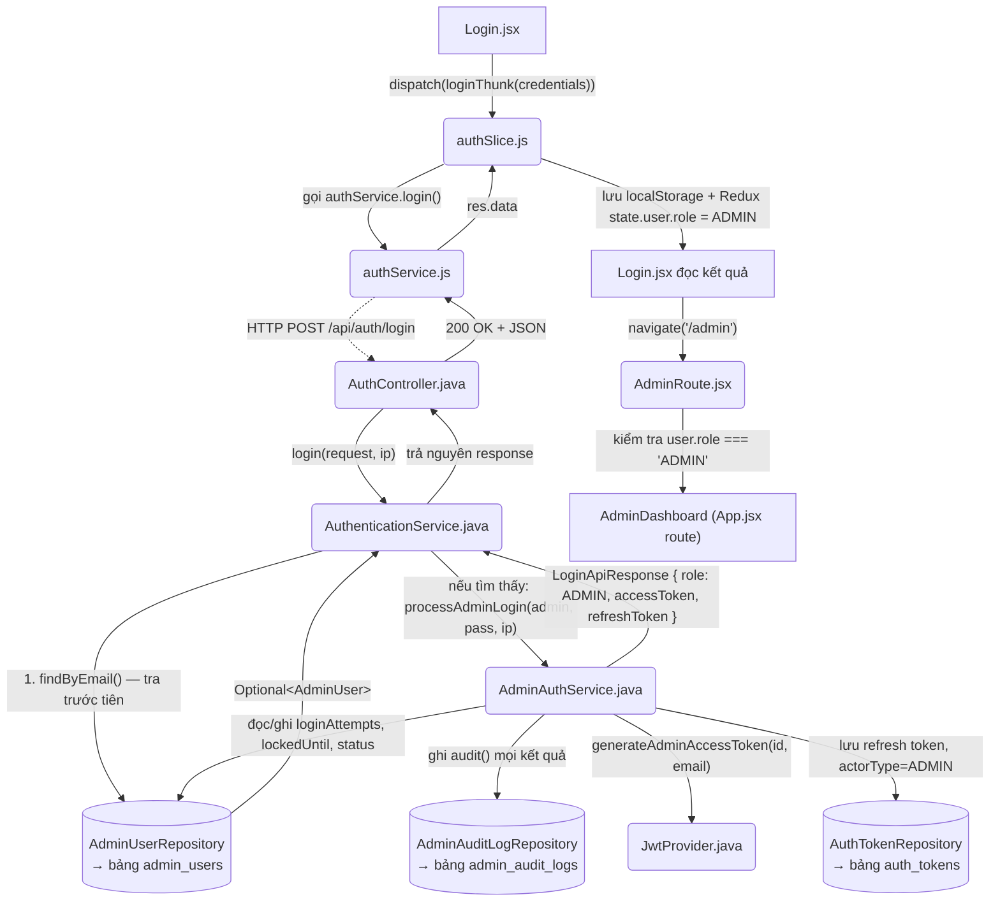
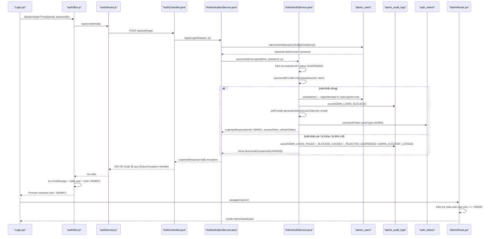

# Phân Tích Cấu Trúc – Luồng – Kết Nối Của Feature: Authentication — Login System (Admin Panel)

## 1. Tóm tắt tổng quan

Tài liệu này **bổ sung** (không thay thế) tài liệu đã có [authen_feature_analysis.md](authen_feature_analysis.md), vốn phân tích chung toàn bộ feature Authentication (Student/Staff/Admin) nhưng chỉ khảo sát các file trong package `com.jlpt.feature.auth`. Phần còn thiếu — cũng là trọng tâm của tài liệu này — là nhánh xử lý nghiệp vụ **dành riêng cho Admin**, nằm trong package khác: `com.jlpt.feature.admin`, cụ thể là [AdminAuthService.java](../../../apps/backend/src/main/java/com/jlpt/feature/admin/AdminAuthService.java).

Về mặt UI/API, Admin **dùng chung** một trang đăng nhập (`Login.jsx`), một hàm gọi API (`authService.login()`) và một endpoint (`POST /api/auth/login`) với Student/Staff — không có form hay route đăng nhập riêng cho Admin. Sự khác biệt chỉ bắt đầu **bên trong** [AuthenticationService.java](../../../apps/backend/src/main/java/com/jlpt/feature/auth/AuthenticationService.java), tại hàm `login()`: đây là nơi hệ thống quyết định "email này có phải Admin không", và nếu có, ủy quyền toàn bộ phần còn lại (kiểm tra khóa tài khoản, khóa sau 5 lần sai, audit log, sinh JWT có `role=ADMIN`) cho `AdminAuthService.processAdminLogin(...)`.

- **Tầng Frontend**: [Login.jsx](../../../apps/frontend/src/pages/login/Login.jsx) (UI dùng chung, không có nhánh code riêng cho admin ngoài việc đọc `role` trả về để điều hướng) → [authSlice.js](../../../apps/frontend/src/store/slices/authSlice.js) (Redux Thunk dùng chung) → [authService.js](../../../apps/frontend/src/api/authService.js) (Axios, dùng chung).
- **Tầng Backend**: [AuthController.java](../../../apps/backend/src/main/java/com/jlpt/feature/auth/AuthController.java) (endpoint dùng chung `/api/auth/login`) → [AuthenticationService.java](../../../apps/backend/src/main/java/com/jlpt/feature/auth/AuthenticationService.java) (nơi rẽ nhánh) → [AdminAuthService.java](../../../apps/backend/src/main/java/com/jlpt/feature/admin/AdminAuthService.java) (**riêng cho Admin** — lockout, audit, JWT admin).
- **Tầng DB**: `admin_users` (qua [AdminUser.java](../../../apps/backend/src/main/java/com/jlpt/feature/admin/AdminUser.java) / [AdminUserRepository.java](../../../apps/backend/src/main/java/com/jlpt/feature/admin/AdminUserRepository.java)), `admin_audit_logs` (qua [AdminAuditLog.java](../../../apps/backend/src/main/java/com/jlpt/feature/admin/AdminAuditLog.java) / [AdminAuditLogRepository.java](../../../apps/backend/src/main/java/com/jlpt/feature/admin/AdminAuditLogRepository.java)), `auth_tokens` với `actor_type = ADMIN` (qua [AuthToken.java](../../../apps/backend/src/main/java/com/jlpt/feature/auth/AuthToken.java) / [AuthTokenRepository.java](../../../apps/backend/src/main/java/com/jlpt/feature/auth/AuthTokenRepository.java)).
- **Entry point thực sự của nhánh Admin**: không phải một endpoint riêng, mà là điều kiện `if (adminOpt.isPresent())` tại dòng 128 của `AuthenticationService.login()` — xem chi tiết Mục 5.
- **Điểm đến cuối cùng ở Frontend**: sau khi nhận `role: "ADMIN"`, `Login.jsx` gọi `navigate('/admin')`, và route `/admin` được bọc bởi `AdminRoute` ([AdminRoute.jsx](../../../apps/frontend/src/components/common/AdminRoute.jsx)) — component này kiểm tra lại `user.role === 'ADMIN'` phía client trước khi render `AdminDashboard`.

---

## 2. Bản đồ cấu trúc (các "mảnh" và vai trò)

| File | Vai trò | Loại |
|------|----------|------|
| [Login.jsx](../../../apps/frontend/src/pages/login/Login.jsx) | Form đăng nhập dùng chung cho Student/Staff/Admin; sau khi nhận response, đọc `role` để điều hướng (`role === 'ADMIN'` → `navigate('/admin')`). Không có logic hay UI riêng cho Admin. | Page Component |
| [authSlice.js](../../../apps/frontend/src/store/slices/authSlice.js) | `loginThunk` xử lý response `LoginApiResponse` dùng chung; với Admin, field `user` từ backend là `null` nên slice tự dựng object tối thiểu `{ role: 'ADMIN' }` để lưu vào Redux state và `localStorage`. | Redux Slice |
| [authService.js](../../../apps/frontend/src/api/authService.js) | Gọi `POST /auth/login` dùng chung; interceptor tự refresh token khi 401 áp dụng như nhau cho mọi role (kể cả Admin). | API Service |
| [AuthController.java](../../../apps/backend/src/main/java/com/jlpt/feature/auth/AuthController.java) | Nhận HTTP request `/api/auth/login`, không có endpoint riêng cho Admin — chuyển thẳng toàn bộ logic cho `AuthenticationService`. | Controller |
| [AuthenticationService.java](../../../apps/backend/src/main/java/com/jlpt/feature/auth/AuthenticationService.java) | Chứa **điểm rẽ nhánh** quyết định gọi `AdminAuthService` hay xử lý Staff/Student; tra `admin_users` trước tiên theo thứ tự ưu tiên. | Service |
| [AdminAuthService.java](../../../apps/backend/src/main/java/com/jlpt/feature/admin/AdminAuthService.java) | **Trọng tâm tài liệu này.** Xử lý toàn bộ nghiệp vụ đăng nhập Admin: kiểm tra khóa tài khoản (`lockedUntil`), kiểm tra trạng thái `SUSPENDED`, so khớp mật khẩu, đếm/khóa sau 5 lần sai, ghi audit log cho mọi kết quả, sinh access token + refresh token riêng cho Admin. | Service |
| [AdminUser.java](../../../apps/backend/src/main/java/com/jlpt/feature/admin/AdminUser.java) | Entity ánh xạ bảng `admin_users`; chứa state machine khóa tài khoản (`loginAttempts`, `lockedUntil`, `status`). | Entity |
| [AdminUserRepository.java](../../../apps/backend/src/main/java/com/jlpt/feature/admin/AdminUserRepository.java) | Truy vấn `admin_users`, đặc biệt `findByEmail()` — dùng để xác định "email này có phải Admin không" ngay bước đầu tiên của `login()`. | Repository |
| [AdminAuditLog.java](../../../apps/backend/src/main/java/com/jlpt/feature/admin/AdminAuditLog.java) | Entity ánh xạ bảng `admin_audit_logs`; ghi lại mọi hành động đăng nhập Admin (thành công, thất bại, bị khóa, bị đình chỉ). | Entity |
| [AdminAuditLogRepository.java](../../../apps/backend/src/main/java/com/jlpt/feature/admin/AdminAuditLogRepository.java) | Lưu/truy vấn `admin_audit_logs`; được `AdminAuthService.audit()` gọi ở mọi nhánh kết quả đăng nhập. | Repository |
| [AuthToken.java](../../../apps/backend/src/main/java/com/jlpt/feature/auth/AuthToken.java) | Entity dùng chung cho Student/Staff/Admin (`actorType` phân biệt); với Admin, cột `admin_id` được set, `actorType = ADMIN`. | Entity |
| [AuthTokenRepository.java](../../../apps/backend/src/main/java/com/jlpt/feature/auth/AuthTokenRepository.java) | Lưu refresh token của Admin; có sẵn `revokeAllActiveByAdminId()` dùng khi cần thu hồi token (VD: reset mật khẩu). | Repository |
| [JwtProvider.java](../../../apps/backend/src/main/java/com/jlpt/shared/security/JwtProvider.java) | Có hàm riêng `generateAdminAccessToken(adminId, email)` gắn claim `role=ADMIN` và `adminId` vào JWT, không dùng chung với hàm sinh token của Student/Staff. | Security Component |
| [AdminRoute.jsx](../../../apps/frontend/src/components/common/AdminRoute.jsx) | Route Guard phía Frontend: chặn truy cập `/admin/*` nếu chưa đăng nhập hoặc `user.role !== 'ADMIN'`. | Route Guard Component |

---

## 3. Bản đồ kết nối (ai gọi ai, dữ liệu truyền qua đâu)



**Bảng phụ — kết nối cụ thể của nhánh Admin:**

| Từ (File A) | Đến (File B) | Cách kết nối | Dữ liệu truyền |
|---|---|---|---|
| `Login.jsx` | `authSlice.js` | `dispatch(loginThunk({ email, password }))` | `{ email, password }` |
| `authSlice.js` | `authService.js` | gọi hàm async `login(credentials)` | `credentials` object |
| `authService.js` | `AuthController.java` | HTTP POST `/api/auth/login` | body JSON `LoginRequest` |
| `AuthController.java` | `AuthenticationService.java` | gọi `authenticationService.login(request, ip)` (Dependency Injection) | `LoginRequest`, `ip` (String) |
| `AuthenticationService.java` | `AdminUserRepository` | `adminUserRepository.findByEmail(email)` | `email` → `Optional<AdminUser>` |
| `AuthenticationService.java` | `AdminAuthService.java` | gọi `adminAuthService.processAdminLogin(admin, password, ip)` (chỉ khi `adminOpt.isPresent()`) | `AdminUser` entity, mật khẩu thô, IP |
| `AdminAuthService.java` | `AdminUserRepository` | `adminUserRepository.save(admin)` | cập nhật `loginAttempts`, `lockedUntil`, `lastLoginAt` |
| `AdminAuthService.java` | `AdminAuditLogRepository` | `adminAuditLogRepository.save(log)` | `AdminAuditLog` (action, targetTable, targetId, ip, description) |
| `AdminAuthService.java` | `JwtProvider.java` | `jwtProvider.generateAdminAccessToken(adminId, email)` | `adminId` (Long), `email` (String) → JWT string |
| `AdminAuthService.java` | `AuthTokenRepository` | `authTokenRepository.save(AuthToken...)` | `AuthToken` với `actorType=ADMIN`, `adminId`, `tokenValue` (random 32-byte base64) |
| `authSlice.js` (loginThunk) | `localStorage` / Redux store | ghi trực tiếp | `accessToken`, `refreshToken`, `jlpt-user` (JSON), `state.auth.user` |
| `Login.jsx` | `AdminRoute.jsx` (gián tiếp qua React Router) | `navigate('/admin')` rồi route guard đọc `state.auth.user.role` | không truyền dữ liệu trực tiếp — guard đọc lại Redux state |

---

## 4. Luồng xử lý theo trình tự

**Kịch bản: Admin đăng nhập tại trang Login dùng chung**

1. Admin nhập email/password vào form của [Login.jsx](../../../apps/frontend/src/pages/login/Login.jsx) và submit. Component gọi `dispatch(loginThunk({ email, password }))` — **không có bước nào phân biệt đây là Admin** ở phía UI.
2. `loginThunk` (trong [authSlice.js](../../../apps/frontend/src/store/slices/authSlice.js)) gọi `authService.login(credentials)`.
3. `authService.js` gửi `POST /api/auth/login` — cùng một endpoint dùng cho mọi role.
4. `AuthController.login()` ([AuthController.java](../../../apps/backend/src/main/java/com/jlpt/feature/auth/AuthController.java) dòng 43-49) nhận `LoginRequest` đã validate, lấy `ip` từ `HttpServletRequest`, gọi `authenticationService.login(request, ip)`.
5. `AuthenticationService.login()` ([AuthenticationService.java](../../../apps/backend/src/main/java/com/jlpt/feature/auth/AuthenticationService.java) dòng 125-144) **tra bảng `admin_users` trước tiên** bằng `adminUserRepository.findByEmail(request.getEmail())`.
6. **Nếu email thuộc về Admin** (`adminOpt.isPresent()` = true) → gọi ngay `adminAuthService.processAdminLogin(adminOpt.get(), request.getPassword(), ip)` và **trả kết quả luôn**, không kiểm tra bảng Staff/Student nữa. Đây chính là điểm rẽ nhánh mà đề bài yêu cầu xác định.
7. Trong `AdminAuthService.processAdminLogin()` ([AdminAuthService.java](../../../apps/backend/src/main/java/com/jlpt/feature/admin/AdminAuthService.java) dòng 34-112), thứ tự kiểm tra là:
   a. Nếu `admin.getLockedUntil()` còn hiệu lực (chưa qua) → ghi audit `ADMIN_LOGIN_BLOCKED_LOCKED` → ném `BusinessException(429, TOO_MANY_REQUESTS, ...)`.
   b. Nếu `admin.getStatus() == SUSPENDED` → ghi audit `ADMIN_LOGIN_REJECTED_SUSPENDED` → ném `BusinessException(403, ACCOUNT_SUSPENDED, ...)`.
   c. Nếu mật khẩu sai (`passwordEncoder.matches` trả false) → tăng `loginAttempts`; nếu đạt 5 → set `lockedUntil = now + 15 phút`, ghi audit `ADMIN_ACCOUNT_LOCKED`, ném lỗi 429; nếu chưa đạt 5 → ghi audit `ADMIN_LOGIN_FAILED`, ném `BusinessException(401, INVALID_CREDENTIALS, ...)`.
   d. Nếu mật khẩu đúng → reset `loginAttempts = 0`, cập nhật `lastLoginAt`, ghi audit `ADMIN_LOGIN_SUCCESS`, sinh `accessToken` qua `jwtProvider.generateAdminAccessToken()`, sinh `refreshToken` ngẫu nhiên, lưu vào `auth_tokens` với `actorType=ADMIN`, trả về `LoginApiResponse{ role: "ADMIN", accessToken, refreshToken }` (field `user` để `null`).
8. `AuthenticationService` trả nguyên `LoginApiResponse` này ngược lên `AuthController` → HTTP 200 với body `ApiResponse.success(...)`.
9. `loginThunk.fulfilled` (trong `authSlice.js`) nhận `res.data`; vì `user` là `null`, slice tự dựng `userData = { role: "ADMIN" }` (dòng 86-87 của `authSlice.js`), lưu `accessToken`/`refreshToken` vào `localStorage`, lưu `userData` vào `localStorage['jlpt-user']` và `state.auth.user`.
10. `Login.jsx` (dòng 53) kiểm tra `res.role === 'ADMIN' || res.user?.role === 'ADMIN'` → gọi `navigate('/admin')`.
11. React Router render route `/admin`, được bọc bởi `AdminRoute` ([AdminRoute.jsx](../../../apps/frontend/src/components/common/AdminRoute.jsx)): guard đọc lại `state.auth.user.role` — nếu đúng `'ADMIN'` → render `AdminDashboard`; nếu không → redirect `/dashboard`; nếu chưa đăng nhập → redirect `/login`.



---

## 5. Vai trò từng đoạn code quan trọng

### 5.1. Điểm rẽ nhánh Admin (Backend) — quyết định gọi `AdminAuthService` hay không

**File**: [AuthenticationService.java](../../../apps/backend/src/main/java/com/jlpt/feature/auth/AuthenticationService.java) (dòng 121-144)

```java
/**
 * Unified login endpoint for all roles.
 * Lookup order: admin_users → staff_users → student_users.
 */
@Transactional
public LoginApiResponse login(LoginRequest request, String ip) {
    // Bước 1: Tra bảng admin_users TRƯỚC TIÊN theo email — đây chính là "cổng rẽ nhánh"
    // của toàn bộ nhánh Admin. Không có endpoint /admin/login riêng — mọi phân biệt
    // Admin/Staff/Student đều dựa vào việc email đó tồn tại ở bảng nào.
    Optional<AdminUser> adminOpt = adminUserRepository.findByEmail(request.getEmail());
    if (adminOpt.isPresent()) {
        // Nếu tìm thấy: ỦY QUYỀN HOÀN TOÀN cho AdminAuthService xử lý phần còn lại
        // (lockout, audit, sinh JWT riêng cho Admin) — AuthenticationService không
        // tự kiểm tra mật khẩu hay trạng thái tài khoản Admin.
        return adminAuthService.processAdminLogin(adminOpt.get(), request.getPassword(), ip);
    }

    // Bước 2: Chỉ khi KHÔNG phải Admin mới tra tiếp Staff
    Optional<StaffUser> staffOpt = staffUserRepository.findByEmail(request.getEmail());
    if (staffOpt.isPresent()) {
        return handleStaffLogin(staffOpt.get(), request.getPassword(), ip);
    }

    // Bước 3: Cuối cùng mới tra Student
    Optional<StudentUser> studentOpt = studentUserRepository.findByEmail(request.getEmail());
    if (studentOpt.isPresent()) {
        return handleStudentLogin(studentOpt.get(), request.getPassword(), ip);
    }

    // BR-35-09: lỗi chung, không tiết lộ bảng nào đã được kiểm tra (chống dò tài khoản)
    throw new BusinessException(401, "INVALID_CREDENTIALS", "Email hoặc mật khẩu không đúng");
}
```

**Giải thích**: Đây là **toàn bộ logic branching** mà đề bài yêu cầu xác định. Không có DTO riêng, không có endpoint riêng cho Admin ở tầng Controller — sự phân biệt hoàn toàn nằm ở **thứ tự tra cứu theo bảng** (`admin_users` → `staff_users` → `student_users`) ngay trong `AuthenticationService.login()`. Vì `AdminUserRepository.findByEmail()` được gọi trước tiên và có `return` ngay khi tìm thấy, nếu một email tồn tại đồng thời ở `admin_users` và bảng khác (về lý thuyết, do không có ràng buộc unique giữa 3 bảng ở tầng code này), tài khoản Admin sẽ luôn "thắng". Dữ liệu nhận vào: `LoginRequest` (email, password) + `ip`. Dữ liệu đưa tiếp: `AdminUser` entity + mật khẩu thô + ip, chuyển cho `AdminAuthService`.

### 5.2. State machine khóa tài khoản + audit trail (Backend) — phần lõi chưa từng được tài liệu hóa

**File**: [AdminAuthService.java](../../../apps/backend/src/main/java/com/jlpt/feature/admin/AdminAuthService.java) (dòng 34-112)

```java
@Transactional
public LoginApiResponse processAdminLogin(AdminUser admin, String rawPassword, String ip) {
    // (1) State: ĐANG BỊ KHÓA — lockedUntil còn ở tương lai nghĩa là chưa hết hạn khóa.
    // Không reset loginAttempts ở đây; tài khoản vẫn giữ nguyên số lần sai cho tới khi
    // đăng nhập thành công (xem nhánh thành công bên dưới).
    if (admin.getLockedUntil() != null && admin.getLockedUntil().isAfter(LocalDateTime.now())) {
        long minutesLeft = ChronoUnit.MINUTES.between(LocalDateTime.now(), admin.getLockedUntil()) + 1;
        audit(admin, "ADMIN_LOGIN_BLOCKED_LOCKED", "admin_users", admin.getId(), ip,
                "Account locked, email=" + admin.getEmail());
        throw new BusinessException(429, "TOO_MANY_REQUESTS",
                "Tài khoản tạm thời bị khóa. Vui lòng thử lại sau " + minutesLeft + " phút");
    }

    // (2) State: SUSPENDED — do Admin khác (hoặc quy trình quản trị) đình chỉ thủ công,
    // độc lập hoàn toàn với cơ chế lockout tự động ở (1)/(3).
    if (admin.getStatus() == AdminUser.AdminStatus.SUSPENDED) {
        log.warn("[AdminAuthService] Login rejected — suspended email={}", admin.getEmail());
        audit(admin, "ADMIN_LOGIN_REJECTED_SUSPENDED", "admin_users", admin.getId(), ip, null);
        throw new BusinessException(403, "ACCOUNT_SUSPENDED",
                "Tài khoản bị đình chỉ. Lý do: " + admin.getSuspendReason());
    }

    // (3) Sai mật khẩu: tăng dần loginAttempts; đạt ngưỡng MAX_LOGIN_ATTEMPTS (5) thì
    // chuyển sang state LOCKED bằng cách set lockedUntil = now + 15 phút.
    if (!passwordEncoder.matches(rawPassword, admin.getPasswordHash())) {
        int attempts = admin.getLoginAttempts() + 1;
        admin.setLoginAttempts(attempts);
        if (attempts >= MAX_LOGIN_ATTEMPTS) {
            admin.setLockedUntil(LocalDateTime.now().plusMinutes(LOCK_DURATION_MINUTES));
            adminUserRepository.save(admin);
            audit(admin, "ADMIN_ACCOUNT_LOCKED", "admin_users", admin.getId(), ip,
                    "Locked after " + attempts + " failed attempts");
            throw new BusinessException(429, "TOO_MANY_REQUESTS", "...");
        }
        adminUserRepository.save(admin);
        audit(admin, "ADMIN_LOGIN_FAILED", "admin_users", admin.getId(), ip,
                "Bad credentials, attempt=" + attempts);
        throw new BusinessException(401, "INVALID_CREDENTIALS", "Email hoặc mật khẩu không đúng");
    }

    // (4) Thành công: reset counter về 0 — đây là điểm DUY NHẤT trong code
    // đưa state machine trở lại "sạch" (không có API/nghiệp vụ unlock thủ công
    // nào khác được tìm thấy trong package feature.admin — xem Mục 8).
    admin.setLoginAttempts(0);
    admin.setLastLoginAt(LocalDateTime.now());
    adminUserRepository.save(admin);
    audit(admin, "ADMIN_LOGIN_SUCCESS", "admin_users", admin.getId(), ip, "Login success");

    // Sinh token: JWT ngắn hạn (claim role=ADMIN + adminId) và refresh token ngẫu nhiên
    // (KHÔNG phải JWT — 32 byte random, base64 url-safe), lưu refresh token vào DB riêng
    // biệt với actorType=ADMIN để phân biệt với refresh token của Staff/Student.
    String accessToken = jwtProvider.generateAdminAccessToken(admin.getId(), admin.getEmail());
    String refreshToken = generateToken();
    authTokenRepository.save(AuthToken.builder()
            .actorType(AuthToken.ActorType.ADMIN)
            .adminId(admin.getId())
            .tokenType(AuthToken.TokenType.REFRESH)
            .tokenValue(refreshToken)
            .ipAddress(ip)
            .expiresAt(LocalDateTime.now().plusDays(7))
            .build());

    return LoginApiResponse.builder()
            .accessToken(accessToken)
            .refreshToken(refreshToken)
            .role("ADMIN")
            .build();
}
```

**Giải thích**: Đây là phần nghiệp vụ **hoàn toàn không trùng lặp** với tài liệu Authentication tổng quát đã có. So với nhánh Staff (`handleStaffLogin`, cũng khóa sau 5 lần sai/15 phút) và Student (`handleStudentLogin`), nhánh Admin khác biệt ở 2 điểm quan trọng: (a) **ghi audit log cho MỌI kết quả** (kể cả các lần thất bại/bị chặn) vào bảng riêng `admin_audit_logs` — Staff/Student không có audit log tương đương; (b) refresh token của Admin là **chuỗi ngẫu nhiên tự sinh** (`generateToken()`, 32 byte `SecureRandom` + Base64 URL-safe), không dùng `jwtProvider.generateRefreshToken()`/`generateTokenFromUsername()` như Student. Access token thì vẫn là JWT nhưng qua hàm riêng `generateAdminAccessToken()` gắn claim `adminId`.

### 5.3. Sinh JWT chuyên biệt cho Admin (Backend)

**File**: [JwtProvider.java](../../../apps/backend/src/main/java/com/jlpt/shared/security/JwtProvider.java) (dòng 50-59)

```java
/** Issues a 15-min JWT with role=ADMIN claim for Admin Panel access (BR-35-07). */
public String generateAdminAccessToken(Long adminId, String email) {
    return Jwts.builder()
            .subject(email)
            .claim("role", "ADMIN")     // Claim này được Spring Security filter đọc để
                                        // gán quyền truy cập API /api/admin/**
            .claim("adminId", adminId)  // Nhúng adminId thẳng vào token — tránh phải
                                        // query lại DB để biết "ai đang gọi" ở các API sau
            .issuedAt(new Date())
            .expiration(new Date(System.currentTimeMillis() + jwtAccessExpirationMs))
            .signWith(getSigningKey())
            .compact();
}
```

**Giải thích**: Hàm này tách biệt hoàn toàn khỏi hàm sinh token cho Student (`generateAccessToken(authentication)`) và Staff (`generateStaffAccessToken(staffId, email)`), dù cả ba đều dùng chung `getSigningKey()`. Nhận vào `adminId` + `email` từ `AdminAuthService`, trả ra chuỗi JWT được `authSlice.js` lưu vào `localStorage.accessToken` và mọi request sau đó tự động đính `Authorization: Bearer <token>` (xem interceptor tại `authService.js`, đã mô tả ở tài liệu gốc).

### 5.4. Điều hướng theo `role` sau đăng nhập (Frontend)

**File**: [Login.jsx](../../../apps/frontend/src/pages/login/Login.jsx) (dòng 49-64)

```javascript
try {
  const res = await dispatch(loginThunk({ email, password })).unwrap();
  if (res.requirePasswordChange) {
    navigate('/staff/change-temp-password');
  } else if (res.role === 'ADMIN' || res.user?.role === 'ADMIN') {
    // Không có form/route login riêng cho Admin — chỉ dựa vào giá trị `role`
    // trả về từ backend (LoginApiResponse.role = "ADMIN") để điều hướng.
    navigate('/admin');
  } else if (res.role === 'STAFF' || res.user?.role === 'STAFF') {
    // ... nhánh Staff (đã có ở tài liệu gốc) ...
  } else {
    // ... nhánh Student ...
  }
} catch {
  /* lỗi API đã được set vào Redux state (bao gồm cả lỗi từ AdminAuthService) */
}
```

**Giải thích**: Xác nhận rằng UI **không có code riêng biệt** xử lý Admin ngoài điều kiện rẽ nhánh điều hướng này. Toàn bộ khác biệt nghiệp vụ (lockout, audit, JWT riêng) đều xảy ra ở backend và chỉ "lộ" ra frontend qua field `role` trong response.

### 5.5. Xử lý field `user: null` riêng cho Admin (Frontend Redux)

**File**: [authSlice.js](../../../apps/frontend/src/store/slices/authSlice.js) (dòng 60-93, trích đoạn liên quan)

```javascript
// Backend LoginApiResponse: field is `user` (not `student`), plus `role` at top level
const { requirePasswordChange, role, accessToken, refreshToken, user, staffRole } = res.data;
// ...
// For ADMIN direct login, `user` is null — build a minimal object from role
const userData = user ? { ...user, role } : { role };
if (staffRole) userData.staffRole = staffRole;
localStorage.setItem('accessToken', accessToken);
if (refreshToken) localStorage.setItem('refreshToken', refreshToken);
localStorage.setItem('jlpt-user', JSON.stringify(userData));
return { user: userData, role };
```

**Giải thích**: Vì `AdminAuthService.processAdminLogin()` (Mục 5.2) build `LoginApiResponse` **không set field `user`** (không có `StudentResponse` cho Admin), comment trong code xác nhận rõ ràng đây là hành vi cố ý (`// For ADMIN direct login, user is null`). Slice phải tự dựng object `{ role: "ADMIN" }` để Redux state và `AdminRoute` có thể đọc `user.role`.

### 5.6. Route Guard phía Frontend cho khu vực Admin

**File**: [AdminRoute.jsx](../../../apps/frontend/src/components/common/AdminRoute.jsx) (toàn bộ, dòng 10-23)

```javascript
function AdminRoute({ children }) {
  const { isAuthenticated, user } = useAppSelector((state) => state.auth);
  const location = useLocation();

  if (!isAuthenticated) {
    return <Navigate to="/login" state={{ from: location }} replace />;
  }

  // Kiểm tra lại role phía CLIENT — đây chỉ là UX (ẩn UI), KHÔNG thay thế cho việc
  // backend phải tự trả 403/401 khi gọi các API /api/admin/** mà không có JWT
  // role=ADMIN hợp lệ (xem CLAUDE.md — Anti-pattern "Authorization by UI hide").
  if (user?.role !== 'ADMIN') {
    return <Navigate to="/dashboard" replace />;
  }

  return children;
}
```

**Giải thích**: Đây là bước cuối trong luồng — nhận `user.role` đã được lưu ở Mục 5.5, quyết định có cho render `AdminDashboard` (component lazy-load qua `App.jsx`, dòng 50 và 139) hay không. Việc bảo vệ thực sự (không thể bypass bằng sửa localStorage) nằm ở tầng Spring Security filter đọc claim `role=ADMIN` trong JWT (Mục 5.3) khi gọi các API `/api/admin/**` — không đọc được trong phạm vi khảo sát (xem Mục 8).

---

## 6. Dữ liệu di chuyển như thế nào

Theo dõi cụ thể trạng thái **lockout** (`loginAttempts` / `lockedUntil`) của một `AdminUser` xuyên suốt hệ thống:

1. **Khởi tạo**: Khi tạo `AdminUser` mới (không thuộc phạm vi tài liệu này), `loginAttempts` mặc định = `0` (`@Builder.Default`, [AdminUser.java](../../../apps/backend/src/main/java/com/jlpt/feature/admin/AdminUser.java) dòng 41-43), `lockedUntil` mặc định = `null`.
2. **Mỗi lần sai mật khẩu**: `AdminAuthService.processAdminLogin()` đọc `admin.getLoginAttempts()` (kiểu `Integer`, từ entity đã được JPA load từ cột `login_attempts` trong bảng `admin_users`), cộng 1, gọi `admin.setLoginAttempts(attempts)`, rồi `adminUserRepository.save(admin)` — Hibernate `UPDATE admin_users SET login_attempts = ? WHERE admin_id = ?` (dirty checking, cùng transaction `@Transactional`).
3. **Khi đạt ngưỡng 5**: thêm `admin.setLockedUntil(LocalDateTime.now().plusMinutes(15))` — giá trị `LocalDateTime` này được lưu vào cột `locked_until` (kiểu DATETIME, MySQL). Theo `CLAUDE.md ADR-009`, container MySQL chạy UTC, nên giá trị `LocalDateTime.now()` ở đây là thời điểm server (JVM chạy trong container, cùng UTC) — nhất quán, không lệch múi giờ trong phạm vi backend.
4. **Ở request đăng nhập tiếp theo (khi đang khóa)**: `admin.getLockedUntil().isAfter(LocalDateTime.now())` được so sánh ngay tại Java, số phút còn lại (`minutesLeft`) được tính bằng `ChronoUnit.MINUTES.between(...)` rồi **nhúng trực tiếp vào message lỗi** trả cho client dưới dạng chuỗi tiếng Việt (VD: "Tài khoản tạm thời bị khóa. Vui lòng thử lại sau 12 phút") — không trả về dưới dạng số/timestamp riêng cho frontend tính toán.
5. **Ra đến Frontend**: chuỗi lỗi này đi qua `BusinessException` → Global Exception Handler (ADR-008, không đọc chi tiết trong phạm vi khảo sát này) → JSON response → `authService.js` (bị bắt bởi `catch` trong `axios`, không phải interceptor 401 vì đây là lỗi 429/403) → `authSlice.js` (`loginThunk.rejected`, dùng `extractError()`) → hiển thị trong `Login.jsx` qua biến `error`/`errorCode` (`isLocked = errorCode === 'TOO_MANY_REQUESTS' || errorCode === 'ACCOUNT_SUSPENDED'`, dòng 81) → render trong `<AuthBanner type="warning">`.
6. **Khi đăng nhập thành công sau đó**: `admin.setLoginAttempts(0)` — state machine quay về trạng thái sạch; `lockedUntil` **không được set lại về `null` một cách tường minh** trong đoạn code đã đọc (chỉ để nguyên giá trị cũ trong quá khứ, không còn hiệu lực vì đã qua hạn) — xem ghi chú ở Mục 8.
7. **Song song**, mọi lần đổi trạng thái (`ADMIN_LOGIN_FAILED`, `ADMIN_ACCOUNT_LOCKED`, `ADMIN_LOGIN_BLOCKED_LOCKED`, `ADMIN_LOGIN_SUCCESS`, `ADMIN_LOGIN_REJECTED_SUSPENDED`) được ghi thành 1 row mới trong `admin_audit_logs` qua `AdminAuditLog.builder()...adminAuditLogRepository.save(log)` — dữ liệu này **không quay lại Frontend của Login.jsx**, chỉ dùng để tra cứu sau này (có thể qua [AdminAuditLogController.java](../../../apps/backend/src/main/java/com/jlpt/feature/admin/AdminAuditLogController.java), không thuộc phạm vi khảo sát của tài liệu này).

---

## 7. Bảng tra cứu tổng hợp

| Bước | File | Function | Kết nối tới | Dữ liệu | Ghi chú |
|---|---|---|---|---|---|
| Đăng nhập (UI) | [Login.jsx](../../../apps/frontend/src/pages/login/Login.jsx) | `handleSubmit()` | `authSlice.js` | `{ email, password }` | UI dùng chung, không phân biệt Admin |
| Đăng nhập (Redux) | [authSlice.js](../../../apps/frontend/src/store/slices/authSlice.js) | `loginThunk` | `authService.js` | `credentials` | Thunk dùng chung |
| Đăng nhập (API) | [authService.js](../../../apps/frontend/src/api/authService.js) | `login()` | `AuthController` | `LoginRequest` | POST `/api/auth/login` |
| Nhận request (BE) | [AuthController.java](../../../apps/backend/src/main/java/com/jlpt/feature/auth/AuthController.java) | `login()` | `AuthenticationService` | `LoginRequest`, `ip` | Không có endpoint riêng cho Admin |
| **Rẽ nhánh Admin** | [AuthenticationService.java](../../../apps/backend/src/main/java/com/jlpt/feature/auth/AuthenticationService.java) | `login()` (dòng 127-129) | `AdminUserRepository`, `AdminAuthService` | `Optional<AdminUser>` | **Điểm quyết định chính** — tra `admin_users` trước Staff/Student |
| Kiểm tra lockout | [AdminAuthService.java](../../../apps/backend/src/main/java/com/jlpt/feature/admin/AdminAuthService.java) | `processAdminLogin()` (dòng 36-49) | `AdminUser.getLockedUntil()` | `LocalDateTime` | Chặn nếu còn trong thời gian khóa |
| Kiểm tra suspend | [AdminAuthService.java](../../../apps/backend/src/main/java/com/jlpt/feature/admin/AdminAuthService.java) | `processAdminLogin()` (dòng 51-56) | `AdminUser.getStatus()` | `AdminStatus.SUSPENDED` | Chặn tài khoản bị đình chỉ |
| Đếm sai mật khẩu | [AdminAuthService.java](../../../apps/backend/src/main/java/com/jlpt/feature/admin/AdminAuthService.java) | `processAdminLogin()` (dòng 58-87) | `AdminUserRepository.save()` | `loginAttempts`, `lockedUntil` | Khóa sau 5 lần sai, 15 phút |
| Ghi audit | [AdminAuthService.java](../../../apps/backend/src/main/java/com/jlpt/feature/admin/AdminAuthService.java) | `audit()` (dòng 120-130) | `AdminAuditLogRepository` | `AdminAuditLog` entity | Ghi ở MỌI nhánh kết quả |
| Sinh JWT Admin | [JwtProvider.java](../../../apps/backend/src/main/java/com/jlpt/shared/security/JwtProvider.java) | `generateAdminAccessToken()` (dòng 51-59) | trả về `AdminAuthService` | `adminId`, `email` → JWT | Claim `role=ADMIN`, `adminId` |
| Lưu refresh token | [AdminAuthService.java](../../../apps/backend/src/main/java/com/jlpt/feature/admin/AdminAuthService.java) | `processAdminLogin()` (dòng 97-105) | `AuthTokenRepository` | `AuthToken{actorType=ADMIN}` | Refresh token random, KHÔNG phải JWT |
| Nhận response (FE) | [authSlice.js](../../../apps/frontend/src/store/slices/authSlice.js) | `loginThunk.fulfilled` (dòng 60-93) | `localStorage`, Redux state | `{ role: "ADMIN" }` | `user` là `null` từ backend, tự dựng object |
| Điều hướng | [Login.jsx](../../../apps/frontend/src/pages/login/Login.jsx) | `handleSubmit()` (dòng 53-54) | React Router | `res.role === 'ADMIN'` | `navigate('/admin')` |
| Route Guard | [AdminRoute.jsx](../../../apps/frontend/src/components/common/AdminRoute.jsx) | `AdminRoute()` | `AdminDashboard` (qua `App.jsx`) | `state.auth.user.role` | Redirect `/dashboard` nếu không phải ADMIN |

---

## 8. Các mục cần bổ sung context (nếu có)

- **Không tìm thấy trong source code**: cơ chế **mở khóa thủ công** (unlock) tài khoản Admin bị `lockedUntil`. Đã grep toàn bộ package `com.jlpt.feature.admin` cho `loginAttempts`/`lockedUntil` và chỉ thấy xuất hiện trong [AdminUser.java](../../../apps/backend/src/main/java/com/jlpt/feature/admin/AdminUser.java) và [AdminAuthService.java](../../../apps/backend/src/main/java/com/jlpt/feature/admin/AdminAuthService.java) — không có endpoint/service nào khác set lại `lockedUntil = null` hoặc `loginAttempts = 0` ngoài luồng đăng nhập thành công. Nếu có tính năng "Admin khác mở khóa cho tài khoản bị khóa", nó nằm ngoài phạm vi các file đã khảo sát hoặc chưa được implement — cần người dùng xác nhận.
- **Không xác nhận được**: `lockedUntil` có được set về `null` một cách tường minh khi đăng nhập thành công hay không. Đoạn code đọc được (dòng 89-91 của `AdminAuthService.java`) chỉ có `admin.setLoginAttempts(0)` và `admin.setLastLoginAt(...)`, không có dòng `admin.setLockedUntil(null)`. Về mặt logic, giá trị `lockedUntil` cũ (đã ở quá khứ) sẽ không còn chặn được lần đăng nhập sau vì điều kiện là `isAfter(LocalDateTime.now())`, nhưng đây là suy luận từ logic điều kiện, không phải xác nhận trực tiếp ý đồ thiết kế — không tìm thấy comment hay test nào làm rõ ý đồ.
- **Không đọc trong phạm vi khảo sát này**: [GlobalExceptionHandler](../../../apps/backend/src/main/java) (`@ControllerAdvice`, ADR-008) — cách chính xác `BusinessException(429, "TOO_MANY_REQUESTS", ...)` được chuyển thành JSON response cho client. Đã suy luận từ format `{ status, message, data }` mô tả trong `CLAUDE.md`, nhưng không trích dẫn được số dòng thật.
- **Không đọc trong phạm vi khảo sát này**: tầng Spring Security filter (`JwtAuthenticationFilter` hoặc tương đương) — nơi thực sự đọc claim `role=ADMIN` từ JWT để cấp quyền truy cập `/api/admin/**`. `AdminRoute.jsx` (Mục 5.6) chỉ là bảo vệ UI phía client; phần backend-side authorization tương ứng chưa được xác minh trực tiếp trong tài liệu này — theo `CLAUDE.md` (anti-pattern "Authorization by UI hide"), phần này bắt buộc phải tồn tại ở backend, nhưng file cụ thể nằm ngoài danh sách đã đọc.
- **Không tìm thấy trong source code**: endpoint/route riêng dạng `/admin/login` hay DTO `AdminLoginRequest` — đã xác nhận (Mục 5.1, 5.4) rằng không tồn tại; Admin dùng chung 100% endpoint `/api/auth/login` và component `Login.jsx` với Student/Staff. Đây là kết luận tích cực (đã xác minh), không phải thiếu context, nhưng ghi lại ở đây để tránh hiểu nhầm khi đọc tài liệu.
- **Chưa xác minh**: nội dung chi tiết của [AdminUserService.java](../../../apps/backend/src/main/java/com/jlpt/feature/admin/AdminUserService.java) và [AdminAuditLogService.java](../../../apps/backend/src/main/java/com/jlpt/feature/admin/AdminAuditLogService.java) (có tồn tại trong thư mục nhưng không được đọc vì nằm ngoài phạm vi "login flow" được giao) — có thể chứa nghiệp vụ liên quan (VD: admin tạo/suspend admin khác) nhưng không thuộc luồng đăng nhập nên không đưa vào tài liệu này.

<!-- BACKEND-METHOD-INVENTORY:START -->

## Phụ lục — Danh mục đầy đủ hàm backend

> Phần này được đối chiếu trực tiếp từ source backend hiện tại. Chỉ liệt kê các hàm khai báo tường minh trong những file Java mà tài liệu này tham chiếu; các hàm do Lombok/JPA sinh tự động không xuất hiện trong source nên không liệt kê.

### `AdminAuditLogRepository`

Nguồn: [AdminAuditLogRepository.java](../../../apps/backend/src/main/java/com/jlpt/feature/admin/AdminAuditLogRepository.java)

| # | Hàm backend (đầy đủ chữ ký) | Endpoint | Tác dụng/chức năng phục vụ |
|---:|---|---|---|
| 1 | [`Optional<AdminAuditLog> findFirstByTargetIdAndTargetTableAndActionInOrderByCreatedAtDesc(Long targetId, String targetTable, List<String> actions)`](../../../apps/backend/src/main/java/com/jlpt/feature/admin/AdminAuditLogRepository.java#L28) | `—` | Đọc hoặc tra cứu dữ liệu phục vụ `find first by target id and target table and action in order by created at desc`. |

### `AdminAuditLogService`

Nguồn: [AdminAuditLogService.java](../../../apps/backend/src/main/java/com/jlpt/feature/admin/AdminAuditLogService.java)

| # | Hàm backend (đầy đủ chữ ký) | Endpoint | Tác dụng/chức năng phục vụ |
|---:|---|---|---|
| 1 | [`Page<AuditLogItemResponse> getAuditLogs(String action, String targetTable, int page, int size)`](../../../apps/backend/src/main/java/com/jlpt/feature/admin/AdminAuditLogService.java#L19) | `—` | Đọc hoặc tra cứu dữ liệu phục vụ `get audit logs`. |
| 2 | [`AuditLogItemResponse toResponse(AdminAuditLog l)`](../../../apps/backend/src/main/java/com/jlpt/feature/admin/AdminAuditLogService.java#L28) | `—` | Biến đổi/tổng hợp dữ liệu nội bộ cho `to response`. |
| 3 | [`String actorEmail(AdminAuditLog l)`](../../../apps/backend/src/main/java/com/jlpt/feature/admin/AdminAuditLogService.java#L40) | `—` | Thực hiện xử lý backend `actor email` trong `AdminAuditLogService`. |
| 4 | [`String actorName(AdminAuditLog l)`](../../../apps/backend/src/main/java/com/jlpt/feature/admin/AdminAuditLogService.java#L47) | `—` | Thực hiện xử lý backend `actor name` trong `AdminAuditLogService`. |
| 5 | [`String actorRole(AdminAuditLog l)`](../../../apps/backend/src/main/java/com/jlpt/feature/admin/AdminAuditLogService.java#L55) | `—` | Thực hiện xử lý backend `actor role` trong `AdminAuditLogService`. |

### `AdminAuthService`

Nguồn: [AdminAuthService.java](../../../apps/backend/src/main/java/com/jlpt/feature/admin/AdminAuthService.java)

| # | Hàm backend (đầy đủ chữ ký) | Endpoint | Tác dụng/chức năng phục vụ |
|---:|---|---|---|
| 1 | [`LoginApiResponse processAdminLogin(AdminUser admin, String rawPassword, String ip)`](../../../apps/backend/src/main/java/com/jlpt/feature/admin/AdminAuthService.java#L34) | `—` | Thực hiện xử lý backend `process admin login` trong `AdminAuthService`. |
| 2 | [`String generateToken()`](../../../apps/backend/src/main/java/com/jlpt/feature/admin/AdminAuthService.java#L114) | `—` | Thực hiện xử lý backend `generate token` trong `AdminAuthService`. |
| 3 | [`void audit(AdminUser admin, String action, String targetTable, Long targetId, String ip, String desc)`](../../../apps/backend/src/main/java/com/jlpt/feature/admin/AdminAuthService.java#L120) | `—` | Thực hiện xử lý backend `audit` trong `AdminAuthService`. |

### `AdminUser`

Nguồn: [AdminUser.java](../../../apps/backend/src/main/java/com/jlpt/feature/admin/AdminUser.java)

| # | Hàm backend (đầy đủ chữ ký) | Endpoint | Tác dụng/chức năng phục vụ |
|---:|---|---|---|
| 1 | [`void onUpdate()`](../../../apps/backend/src/main/java/com/jlpt/feature/admin/AdminUser.java#L59) | `—` | Thực hiện xử lý backend `on update` trong `AdminUser`. |
| 2 | [`String getValue()`](../../../apps/backend/src/main/java/com/jlpt/feature/admin/AdminUser.java#L75) | `—` | Đọc hoặc tra cứu dữ liệu phục vụ `get value`. |

### `AdminUserRepository`

Nguồn: [AdminUserRepository.java](../../../apps/backend/src/main/java/com/jlpt/feature/admin/AdminUserRepository.java)

| # | Hàm backend (đầy đủ chữ ký) | Endpoint | Tác dụng/chức năng phục vụ |
|---:|---|---|---|
| 1 | [`Optional<AdminUser> findByEmail(String email)`](../../../apps/backend/src/main/java/com/jlpt/feature/admin/AdminUserRepository.java#L15) | `—` | Đọc hoặc tra cứu dữ liệu phục vụ `find by email`. |
| 2 | [`boolean existsByEmail(String email)`](../../../apps/backend/src/main/java/com/jlpt/feature/admin/AdminUserRepository.java#L17) | `—` | Kiểm tra điều kiện/trạng thái phục vụ `exists by email`. |

### `AdminUserService`

Nguồn: [AdminUserService.java](../../../apps/backend/src/main/java/com/jlpt/feature/admin/AdminUserService.java)

| # | Hàm backend (đầy đủ chữ ký) | Endpoint | Tác dụng/chức năng phục vụ |
|---:|---|---|---|
| 1 | [`Page<UserSummaryResponse> listUsers(String type, String q, String status, String jlptLevel, String staffRole, int page, int size)`](../../../apps/backend/src/main/java/com/jlpt/feature/admin/AdminUserService.java#L62) | `—` | Đọc hoặc tra cứu dữ liệu phục vụ `list users`. |
| 2 | [`Object getUserDetail(String type, Long userId)`](../../../apps/backend/src/main/java/com/jlpt/feature/admin/AdminUserService.java#L93) | `—` | Đọc hoặc tra cứu dữ liệu phục vụ `get user detail`. |
| 3 | [`yield toStudentDetail(s)`](../../../apps/backend/src/main/java/com/jlpt/feature/admin/AdminUserService.java#L100) | `—` | Biến đổi/tổng hợp dữ liệu nội bộ cho `to student detail`. |
| 4 | [`yield toStaffDetail(st)`](../../../apps/backend/src/main/java/com/jlpt/feature/admin/AdminUserService.java#L106) | `—` | Biến đổi/tổng hợp dữ liệu nội bộ cho `to staff detail`. |
| 5 | [`yield toAdminDetail(a)`](../../../apps/backend/src/main/java/com/jlpt/feature/admin/AdminUserService.java#L112) | `—` | Biến đổi/tổng hợp dữ liệu nội bộ cho `to admin detail`. |
| 6 | [`CreateStaffResponse createStaff(String adminEmail, CreateStaffRequest request)`](../../../apps/backend/src/main/java/com/jlpt/feature/admin/AdminUserService.java#L120) | `—` | Tạo hoặc ghi dữ liệu cho nghiệp vụ `create staff`. |
| 7 | [`void setupStaffPassword(com.jlpt.feature.staff.dto.request.StaffSetupPasswordRequest request)`](../../../apps/backend/src/main/java/com/jlpt/feature/admin/AdminUserService.java#L166) | `—` | Thực hiện xử lý backend `setup staff password` trong `AdminUserService`. |
| 8 | [`Object updateUser(String adminEmail, String type, Long userId, Object request)`](../../../apps/backend/src/main/java/com/jlpt/feature/admin/AdminUserService.java#L208) | `—` | Cập nhật trạng thái/dữ liệu cho nghiệp vụ `update user`. |
| 9 | [`yield toStudentDetail(s)`](../../../apps/backend/src/main/java/com/jlpt/feature/admin/AdminUserService.java#L237) | `—` | Biến đổi/tổng hợp dữ liệu nội bộ cho `to student detail`. |
| 10 | [`yield toStaffDetail(st)`](../../../apps/backend/src/main/java/com/jlpt/feature/admin/AdminUserService.java#L249) | `—` | Biến đổi/tổng hợp dữ liệu nội bộ cho `to staff detail`. |
| 11 | [`SuspendUserResponse suspendUser(String adminEmail, String type, Long userId, SuspendUserRequest request)`](../../../apps/backend/src/main/java/com/jlpt/feature/admin/AdminUserService.java#L259) | `—` | Cập nhật trạng thái/dữ liệu cho nghiệp vụ `suspend user`. |
| 12 | [`ActivateUserResponse activateUser(String adminEmail, String type, Long userId)`](../../../apps/backend/src/main/java/com/jlpt/feature/admin/AdminUserService.java#L336) | `—` | Cập nhật trạng thái/dữ liệu cho nghiệp vụ `activate user`. |
| 13 | [`void resetPassword(String adminEmail, String type, Long userId)`](../../../apps/backend/src/main/java/com/jlpt/feature/admin/AdminUserService.java#L403) | `—` | Thực hiện xử lý backend `reset password` trong `AdminUserService`. |
| 14 | [`SoftDeleteUserResponse softDeleteUser(String adminEmail, String type, Long userId)`](../../../apps/backend/src/main/java/com/jlpt/feature/admin/AdminUserService.java#L476) | `—` | Thực hiện xử lý backend `soft delete user` trong `AdminUserService`. |
| 15 | [`RestoreUserResponse restoreUser(String adminEmail, String type, Long userId)`](../../../apps/backend/src/main/java/com/jlpt/feature/admin/AdminUserService.java#L527) | `—` | Thực hiện xử lý backend `restore user` trong `AdminUserService`. |
| 16 | [`ChangeStaffRoleResponse changeStaffRole(String adminEmail, Long staffId, ChangeStaffRoleRequest request)`](../../../apps/backend/src/main/java/com/jlpt/feature/admin/AdminUserService.java#L575) | `—` | Cập nhật trạng thái/dữ liệu cho nghiệp vụ `change staff role`. |
| 17 | [`String normalizeType(String type)`](../../../apps/backend/src/main/java/com/jlpt/feature/admin/AdminUserService.java#L611) | `—` | Thực hiện xử lý backend `normalize type` trong `AdminUserService`. |
| 18 | [`AdminUser resolveAdmin(String email)`](../../../apps/backend/src/main/java/com/jlpt/feature/admin/AdminUserService.java#L616) | `—` | Biến đổi/tổng hợp dữ liệu nội bộ cho `resolve admin`. |
| 19 | [`void checkSelfModification(Long actorAdminId, String type, Long targetId)`](../../../apps/backend/src/main/java/com/jlpt/feature/admin/AdminUserService.java#L623) | `—` | Kiểm tra điều kiện/trạng thái phục vụ `check self modification`. |
| 20 | [`void auditLog(AdminUser actor, String action, String targetTable, Long targetId, String description)`](../../../apps/backend/src/main/java/com/jlpt/feature/admin/AdminUserService.java#L629) | `—` | Thực hiện xử lý backend `audit log` trong `AdminUserService`. |
| 21 | [`String generateUrlSafeToken(int bytes)`](../../../apps/backend/src/main/java/com/jlpt/feature/admin/AdminUserService.java#L639) | `—` | Thực hiện xử lý backend `generate url safe token` trong `AdminUserService`. |
| 22 | [`UserSummaryResponse toStudentSummary(StudentUser s)`](../../../apps/backend/src/main/java/com/jlpt/feature/admin/AdminUserService.java#L647) | `—` | Biến đổi/tổng hợp dữ liệu nội bộ cho `to student summary`. |
| 23 | [`UserSummaryResponse toStaffSummary(StaffUser st)`](../../../apps/backend/src/main/java/com/jlpt/feature/admin/AdminUserService.java#L663) | `—` | Biến đổi/tổng hợp dữ liệu nội bộ cho `to staff summary`. |
| 24 | [`UserSummaryResponse toAdminSummary(AdminUser a)`](../../../apps/backend/src/main/java/com/jlpt/feature/admin/AdminUserService.java#L675) | `—` | Biến đổi/tổng hợp dữ liệu nội bộ cho `to admin summary`. |
| 25 | [`StudentDetailResponse toStudentDetail(StudentUser s)`](../../../apps/backend/src/main/java/com/jlpt/feature/admin/AdminUserService.java#L686) | `—` | Biến đổi/tổng hợp dữ liệu nội bộ cho `to student detail`. |
| 26 | [`StaffDetailResponse toStaffDetail(StaffUser st)`](../../../apps/backend/src/main/java/com/jlpt/feature/admin/AdminUserService.java#L708) | `—` | Biến đổi/tổng hợp dữ liệu nội bộ cho `to staff detail`. |
| 27 | [`AdminDetailResponse toAdminDetail(AdminUser a)`](../../../apps/backend/src/main/java/com/jlpt/feature/admin/AdminUserService.java#L721) | `—` | Biến đổi/tổng hợp dữ liệu nội bộ cho `to admin detail`. |

### `AuthController`

Nguồn: [AuthController.java](../../../apps/backend/src/main/java/com/jlpt/feature/auth/AuthController.java)

| # | Hàm backend (đầy đủ chữ ký) | Endpoint | Tác dụng/chức năng phục vụ |
|---:|---|---|---|
| 1 | [`ResponseEntity<ApiResponse<AccountTypeResponse>> checkAccountType(@Valid @RequestBody CheckAccountTypeRequest request, HttpServletRequest httpRequest)`](../../../apps/backend/src/main/java/com/jlpt/feature/auth/AuthController.java#L35) | `POST /check-account-type` | Xử lý endpoint `POST /check-account-type`; thực hiện nghiệp vụ `check account type`. |
| 2 | [`ResponseEntity<ApiResponse<LoginApiResponse>> login(@Valid @RequestBody LoginRequest request, HttpServletRequest httpRequest)`](../../../apps/backend/src/main/java/com/jlpt/feature/auth/AuthController.java#L43) | `POST /login` | Xử lý endpoint `POST /login`; thực hiện nghiệp vụ `login`. |
| 3 | [`ResponseEntity<ApiResponse<StudentResponse>> register(@Valid @RequestBody RegisterRequest request)`](../../../apps/backend/src/main/java/com/jlpt/feature/auth/AuthController.java#L51) | `POST /register` | Xử lý endpoint `POST /register`; thực hiện nghiệp vụ `register`. |
| 4 | [`ResponseEntity<ApiResponse<RefreshTokenResponse>> refresh(@Valid @RequestBody RefreshTokenRequest request)`](../../../apps/backend/src/main/java/com/jlpt/feature/auth/AuthController.java#L59) | `POST /refresh` | Xử lý endpoint `POST /refresh`; thực hiện nghiệp vụ `refresh`. |
| 5 | [`ResponseEntity<ApiResponse<Void>> logout(@Valid @RequestBody LogoutRequest request)`](../../../apps/backend/src/main/java/com/jlpt/feature/auth/AuthController.java#L65) | `POST /logout` | Xử lý endpoint `POST /logout`; thực hiện nghiệp vụ `logout`. |
| 6 | [`ResponseEntity<ApiResponse<Void>> verifyEmail(@Valid @RequestBody VerifyEmailRequest request)`](../../../apps/backend/src/main/java/com/jlpt/feature/auth/AuthController.java#L71) | `POST /verify-email` | Xử lý endpoint `POST /verify-email`; thực hiện nghiệp vụ `verify email`. |
| 7 | [`ResponseEntity<ApiResponse<Void>> resendVerification(@Valid @RequestBody ResendVerificationRequest request)`](../../../apps/backend/src/main/java/com/jlpt/feature/auth/AuthController.java#L77) | `POST /resend-verification` | Xử lý endpoint `POST /resend-verification`; thực hiện nghiệp vụ `resend verification`. |
| 8 | [`ResponseEntity<ApiResponse<Void>> forgotPassword(@Valid @RequestBody ForgotPasswordRequest request)`](../../../apps/backend/src/main/java/com/jlpt/feature/auth/AuthController.java#L83) | `POST /forgot-password` | Xử lý endpoint `POST /forgot-password`; thực hiện nghiệp vụ `forgot password`. |
| 9 | [`ResponseEntity<ApiResponse<Void>> resetPassword(@Valid @RequestBody ResetPasswordRequest request)`](../../../apps/backend/src/main/java/com/jlpt/feature/auth/AuthController.java#L90) | `POST /reset-password` | Xử lý endpoint `POST /reset-password`; thực hiện nghiệp vụ `reset password`. |
| 10 | [`ResponseEntity<ApiResponse<AuthResponse>> googleLogin(@Valid @RequestBody GoogleTokenRequest request)`](../../../apps/backend/src/main/java/com/jlpt/feature/auth/AuthController.java#L96) | `POST /google` | Xử lý endpoint `POST /google`; thực hiện nghiệp vụ `google login`. |

### `AuthenticationService`

Nguồn: [AuthenticationService.java](../../../apps/backend/src/main/java/com/jlpt/feature/auth/AuthenticationService.java)

| # | Hàm backend (đầy đủ chữ ký) | Endpoint | Tác dụng/chức năng phục vụ |
|---:|---|---|---|
| 1 | [`AccountTypeResponse checkAccountType(String email)`](../../../apps/backend/src/main/java/com/jlpt/feature/auth/AuthenticationService.java#L83) | `—` | Kiểm tra điều kiện/trạng thái phục vụ `check account type`. |
| 2 | [`AccountTypeResponse checkAccountType(String email, String ip)`](../../../apps/backend/src/main/java/com/jlpt/feature/auth/AuthenticationService.java#L88) | `—` | Kiểm tra điều kiện/trạng thái phục vụ `check account type`. |
| 3 | [`AccountTypeResponse resolveAccountType(String email)`](../../../apps/backend/src/main/java/com/jlpt/feature/auth/AuthenticationService.java#L94) | `—` | Biến đổi/tổng hợp dữ liệu nội bộ cho `resolve account type`. |
| 4 | [`void enforceCheckAccountTypeRateLimit(String ip)`](../../../apps/backend/src/main/java/com/jlpt/feature/auth/AuthenticationService.java#L105) | `—` | Thực hiện xử lý backend `enforce check account type rate limit` trong `AuthenticationService`. |
| 5 | [`LoginApiResponse login(LoginRequest request, String ip)`](../../../apps/backend/src/main/java/com/jlpt/feature/auth/AuthenticationService.java#L125) | `—` | Thực hiện xử lý backend `login` trong `AuthenticationService`. |
| 6 | [`LoginApiResponse loginStaff(LoginRequest request, String ip)`](../../../apps/backend/src/main/java/com/jlpt/feature/auth/AuthenticationService.java#L146) | `—` | Thực hiện xử lý backend `login staff` trong `AuthenticationService`. |
| 7 | [`LoginApiResponse handleStaffLogin(StaffUser staff, String rawPassword, String ip)`](../../../apps/backend/src/main/java/com/jlpt/feature/auth/AuthenticationService.java#L154) | `—` | Thực hiện xử lý backend `handle staff login` trong `AuthenticationService`. |
| 8 | [`LoginApiResponse handleStudentLogin(StudentUser user, String rawPassword, String ip)`](../../../apps/backend/src/main/java/com/jlpt/feature/auth/AuthenticationService.java#L215) | `—` | Thực hiện xử lý backend `handle student login` trong `AuthenticationService`. |
| 9 | [`RefreshTokenResponse refresh(RefreshTokenRequest request)`](../../../apps/backend/src/main/java/com/jlpt/feature/auth/AuthenticationService.java#L264) | `—` | Thực hiện xử lý backend `refresh` trong `AuthenticationService`. |
| 10 | [`void logout(LogoutRequest request)`](../../../apps/backend/src/main/java/com/jlpt/feature/auth/AuthenticationService.java#L301) | `—` | Thực hiện xử lý backend `logout` trong `AuthenticationService`. |
| 11 | [`AuthResponse loginWithGoogle(GoogleTokenRequest request)`](../../../apps/backend/src/main/java/com/jlpt/feature/auth/AuthenticationService.java#L307) | `—` | Thực hiện xử lý backend `login with google` trong `AuthenticationService`. |
| 12 | [`GoogleIdToken.Payload verifyGoogleToken(String idToken)`](../../../apps/backend/src/main/java/com/jlpt/feature/auth/AuthenticationService.java#L379) | `—` | Kiểm tra điều kiện/trạng thái phục vụ `verify google token`. |
| 13 | [`String resolveEmailFromToken(AuthToken token)`](../../../apps/backend/src/main/java/com/jlpt/feature/auth/AuthenticationService.java#L399) | `—` | Biến đổi/tổng hợp dữ liệu nội bộ cho `resolve email from token`. |

### `AuthToken`

Nguồn: [AuthToken.java](../../../apps/backend/src/main/java/com/jlpt/feature/auth/AuthToken.java)

| # | Hàm backend (đầy đủ chữ ký) | Endpoint | Tác dụng/chức năng phục vụ |
|---:|---|---|---|
| 1 | [`String getValue()`](../../../apps/backend/src/main/java/com/jlpt/feature/auth/AuthToken.java#L65) | `—` | Đọc hoặc tra cứu dữ liệu phục vụ `get value`. |
| 2 | [`String getValue()`](../../../apps/backend/src/main/java/com/jlpt/feature/auth/AuthToken.java#L82) | `—` | Đọc hoặc tra cứu dữ liệu phục vụ `get value`. |

### `AuthTokenRepository`

Nguồn: [AuthTokenRepository.java](../../../apps/backend/src/main/java/com/jlpt/feature/auth/AuthTokenRepository.java)

| # | Hàm backend (đầy đủ chữ ký) | Endpoint | Tác dụng/chức năng phục vụ |
|---:|---|---|---|
| 1 | [`Optional<AuthToken> findByTokenValue(String tokenValue)`](../../../apps/backend/src/main/java/com/jlpt/feature/auth/AuthTokenRepository.java#L16) | `—` | Đọc hoặc tra cứu dữ liệu phục vụ `find by token value`. |
| 2 | [`Optional<AuthToken> findByTokenValueAndTokenType(String tokenValue, AuthToken.TokenType tokenType)`](../../../apps/backend/src/main/java/com/jlpt/feature/auth/AuthTokenRepository.java#L18) | `—` | Đọc hoặc tra cứu dữ liệu phục vụ `find by token value and token type`. |
| 3 | [`void deleteByStudentIdAndTokenType(Long studentId, AuthToken.TokenType tokenType)`](../../../apps/backend/src/main/java/com/jlpt/feature/auth/AuthTokenRepository.java#L20) | `—` | Xóa mềm, thu hồi hoặc loại bỏ dữ liệu trong `delete by student id and token type`. |
| 4 | [`Optional<AuthToken> findFirstByStudentIdAndTokenTypeOrderByCreatedAtDesc(Long studentId, AuthToken.TokenType tokenType)`](../../../apps/backend/src/main/java/com/jlpt/feature/auth/AuthTokenRepository.java#L22) | `—` | Đọc hoặc tra cứu dữ liệu phục vụ `find first by student id and token type order by created at desc`. |

### `JwtProvider`

Nguồn: [JwtProvider.java](../../../apps/backend/src/main/java/com/jlpt/shared/security/JwtProvider.java)

| # | Hàm backend (đầy đủ chữ ký) | Endpoint | Tác dụng/chức năng phục vụ |
|---:|---|---|---|
| 1 | [`SecretKey getSigningKey()`](../../../apps/backend/src/main/java/com/jlpt/shared/security/JwtProvider.java#L26) | `—` | Đọc hoặc tra cứu dữ liệu phục vụ `get signing key`. |
| 2 | [`String generateAccessToken(Authentication authentication)`](../../../apps/backend/src/main/java/com/jlpt/shared/security/JwtProvider.java#L31) | `—` | Thực hiện xử lý backend `generate access token` trong `JwtProvider`. |
| 3 | [`String generateRefreshToken(Authentication authentication)`](../../../apps/backend/src/main/java/com/jlpt/shared/security/JwtProvider.java#L36) | `—` | Thực hiện xử lý backend `generate refresh token` trong `JwtProvider`. |
| 4 | [`String generateTokenFromUsername(String username, long expirationMs)`](../../../apps/backend/src/main/java/com/jlpt/shared/security/JwtProvider.java#L41) | `—` | Thực hiện xử lý backend `generate token from username` trong `JwtProvider`. |
| 5 | [`String generateAdminAccessToken(Long adminId, String email)`](../../../apps/backend/src/main/java/com/jlpt/shared/security/JwtProvider.java#L51) | `—` | Thực hiện xử lý backend `generate admin access token` trong `JwtProvider`. |
| 6 | [`String generateStaffAccessToken(Long staffId, String email)`](../../../apps/backend/src/main/java/com/jlpt/shared/security/JwtProvider.java#L63) | `—` | Thực hiện xử lý backend `generate staff access token` trong `JwtProvider`. |
| 7 | [`String generateLimitedSessionToken(Long staffId, String email)`](../../../apps/backend/src/main/java/com/jlpt/shared/security/JwtProvider.java#L74) | `—` | Thực hiện xử lý backend `generate limited session token` trong `JwtProvider`. |
| 8 | [`String generateStaffLimitedSessionToken(Long staffId, String email)`](../../../apps/backend/src/main/java/com/jlpt/shared/security/JwtProvider.java#L86) | `—` | Thực hiện xử lý backend `generate staff limited session token` trong `JwtProvider`. |
| 9 | [`String getRoleFromToken(String token)`](../../../apps/backend/src/main/java/com/jlpt/shared/security/JwtProvider.java#L91) | `—` | Đọc hoặc tra cứu dữ liệu phục vụ `get role from token`. |
| 10 | [`String getTokenTypeFromToken(String token)`](../../../apps/backend/src/main/java/com/jlpt/shared/security/JwtProvider.java#L101) | `—` | Đọc hoặc tra cứu dữ liệu phục vụ `get token type from token`. |
| 11 | [`Long getStaffIdFromToken(String token)`](../../../apps/backend/src/main/java/com/jlpt/shared/security/JwtProvider.java#L111) | `—` | Đọc hoặc tra cứu dữ liệu phục vụ `get staff id from token`. |
| 12 | [`String getUserNameFromJwtToken(String token)`](../../../apps/backend/src/main/java/com/jlpt/shared/security/JwtProvider.java#L127) | `—` | Đọc hoặc tra cứu dữ liệu phục vụ `get user name from jwt token`. |
| 13 | [`boolean validateJwtToken(String authToken)`](../../../apps/backend/src/main/java/com/jlpt/shared/security/JwtProvider.java#L136) | `—` | Kiểm tra điều kiện/trạng thái phục vụ `validate jwt token`. |

**Tổng cộng:** `82` hàm backend trong `13` file Java được tham chiếu.

<!-- BACKEND-METHOD-INVENTORY:END -->
