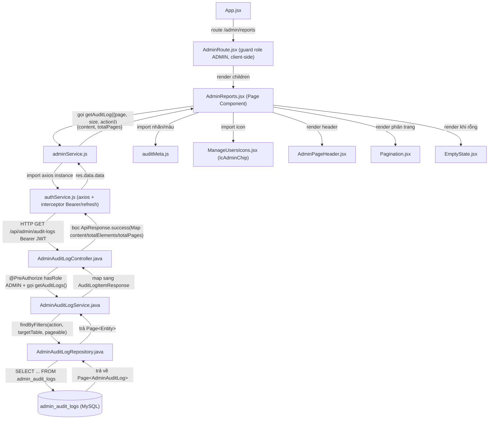
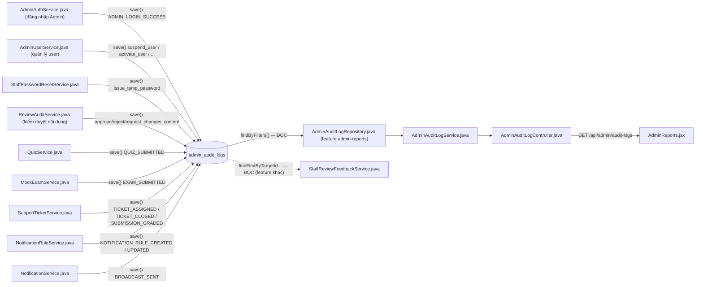
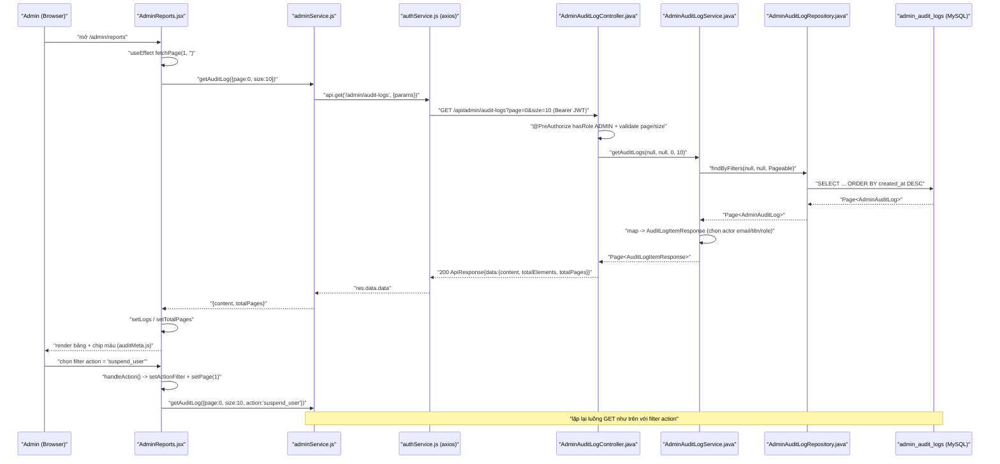

# Phân Tích Feature: admin-reports (Analytics & Reporting — Report Screen / "Admin Reports Page")

> **Tác giả phân tích:** AI Senior Software Architect
> **Ngày phân tích:** 2026-07-27
> **Nguồn:** Đọc trực tiếp source code trong workspace

---

## 1. Tóm tắt tổng quan

Backlog task đặt tên feature này là "Analytics & Reporting — Report Screen", gợi ý một dashboard biểu đồ/thống kê. Sau khi đọc trực tiếp source code, thực tế **`AdminReports.jsx` không phải là dashboard phân tích (BI/charts)** — nó là một **trình xem nhật ký kiểm toán (audit log viewer)**: một bảng phân trang, liệt kê từng hành động (action) mà Admin/Manager/Staff/Học viên đã thực hiện trên hệ thống, có thể lọc theo loại hành động (`action`) qua dropdown. Không có biểu đồ, không có số liệu tổng hợp (KPI/aggregate) nào trên trang này — phần đó thuộc về `AdminDashboard.jsx` (feature khác, dùng `getDashboardOverview()`), không phải trang này.

Feature trải dài trên 3 tầng:

| Tầng | Mô tả |
|------|-------|
| **Frontend (React)** | Trang [AdminReports.jsx](../../../apps/frontend/src/pages/admin/AdminReports.jsx) — gọi `getAuditLog()` trong [adminService.js](../../../apps/frontend/src/api/adminService.js), hiển thị bảng phân trang + dropdown lọc theo `action`, dùng helper [auditMeta.js](../../../apps/frontend/src/utils/auditMeta.js) để dịch mã hành động (`create_staff`, `suspend_user`, ...) sang nhãn tiếng Việt và màu chip |
| **Backend (Spring Boot)** | [AdminAuditLogController.java](../../../apps/backend/src/main/java/com/jlpt/feature/admin/AdminAuditLogController.java) nhận `GET /api/admin/audit-logs` → [AdminAuditLogService.java](../../../apps/backend/src/main/java/com/jlpt/feature/admin/AdminAuditLogService.java) truy vấn + map sang DTO → [AdminAuditLogRepository.java](../../../apps/backend/src/main/java/com/jlpt/feature/admin/AdminAuditLogRepository.java) đọc bảng `admin_audit_logs` |
| **Database (MySQL)** | Bảng `admin_audit_logs`, entity [AdminAuditLog.java](../../../apps/backend/src/main/java/com/jlpt/feature/admin/AdminAuditLog.java) — mỗi dòng là 1 hành động, có FK tùy chọn tới `admin_users`/`staff_users`/`student_users` (chỉ 1 trong 3 được set, tùy ai thực hiện hành động) |

**Entry point** của feature (phần đọc/hiển thị): route `/admin/reports` (khai báo tại [App.jsx](../../../apps/frontend/src/App.jsx) dòng 142) → `GET /api/admin/audit-logs` (backend).

**Điểm quan trọng cần hiểu đúng phạm vi feature này**: bảng `admin_audit_logs` là **bảng dùng chung (shared table)**, được **ghi vào (produce)** bởi rất nhiều feature khác trên toàn hệ thống (đăng nhập Admin, quản lý user, kiểm duyệt nội dung, ticket hỗ trợ, chấm bài, thông báo broadcast, quy tắc thông báo tự động...). **Code riêng của feature "admin-reports" (task này) chỉ là phía ĐỌC/HIỂN THỊ**: Controller + Service + Repository + Entity nói trên, cộng trang `AdminReports.jsx`. Các Service ở các feature khác **ghi** vào cùng bảng này ("producer") **không thuộc phạm vi feature admin-reports** — chúng được liệt kê đầy đủ ở mục 3 và 6 để người đọc hiểu luồng dữ liệu tổng thể, nhưng thuộc quyền sở hữu của feature tương ứng (xem link chéo ở mục 3.3).

Use case liên quan (theo comment trong code): **UC-38** (`AdminAuditLogController`/`AdminAuditLogService` ghi rõ "UC-38"), UC-36 (comment tại `adminService.js` gộp chung dashboard + audit log dưới UC-36).

---

## 2. Bản đồ cấu trúc (các "mảnh" và vai trò)

### 2.1 Frontend — phần đọc/hiển thị (thuộc feature này)

| File | Vai trò | Loại |
|------|---------|------|
| [AdminReports.jsx](../../../apps/frontend/src/pages/admin/AdminReports.jsx) | Trang chính: gọi `getAuditLog`, quản lý state phân trang/lọc/loading/error, render bảng | Page Component |
| [adminService.js](../../../apps/frontend/src/api/adminService.js) | Hàm `getAuditLog({ page, size, action, targetTable })` gọi `GET /admin/audit-logs` | API Service |
| [authService.js](../../../apps/frontend/src/api/authService.js) | Axios instance dùng chung (đính Bearer token, auto-refresh 401) mà `adminService.js` import (`import api from './authService'`) | Axios Config |
| [auditMeta.js](../../../apps/frontend/src/utils/auditMeta.js) | Bảng tra cứu tĩnh: `ACTION_LABELS`, `ACTION_COLORS`, `ROLE_META`, `ACTION_GROUPS` + hàm `getActionLabel`, `getActionColors`, `getRoleMeta` — dịch mã hành động/role từ BE sang nhãn + màu hiển thị | Utility |
| [ManageUsersIcons.jsx](../../../apps/frontend/src/components/admin/ManageUsersIcons.jsx) | Cung cấp icon `IcAdminChip` (hoa anh đào 5 cánh) dùng làm icon chip tiêu đề trang | Component (icon) |
| [AdminPageHeader.jsx](../../../apps/frontend/src/components/admin/AdminPageHeader.jsx) | Component tiêu đề trang dùng chung toàn khu Admin (chip icon, title, subtitle, mascot) | Component |
| [Pagination.jsx](../../../apps/frontend/src/components/common/Pagination.jsx) | Component phân trang dùng chung (props `currentPage`, `totalPages`, `onChange`) | Component |
| [EmptyState.jsx](../../../apps/frontend/src/components/common/EmptyState.jsx) | Hiển thị khi `logs.length === 0` (không tìm thấy trong file — chỉ xác nhận usage, chưa đọc nội dung file này) | Component |
| [AdminTopNav.jsx](../../../apps/frontend/src/components/layout/AdminTopNav.jsx) | Thanh điều hướng khu Admin, tab "reports" active khi ở trang này | Component (Nav) |
| [App.jsx](../../../apps/frontend/src/App.jsx) | Khai báo route `/admin/reports` → `AdminReports.jsx`, bọc trong `AdminRoute` | Router Config |
| [AdminRoute.jsx](../../../apps/frontend/src/components/common/AdminRoute.jsx) | Guard phía client: redirect `/login` nếu chưa đăng nhập, redirect `/dashboard` nếu `user.role !== 'ADMIN'` | Route Guard |

### 2.2 Backend — phần đọc/hiển thị (thuộc feature này)

| File | Vai trò | Loại |
|------|---------|------|
| [AdminAuditLogController.java](../../../apps/backend/src/main/java/com/jlpt/feature/admin/AdminAuditLogController.java) | `GET /api/admin/audit-logs` — nhận `action`, `targetTable`, `page`, `size` (validate `@Min`/`@Max`), `@PreAuthorize("hasRole('ADMIN')")` | Controller |
| [AdminAuditLogService.java](../../../apps/backend/src/main/java/com/jlpt/feature/admin/AdminAuditLogService.java) | Chuẩn hoá filter rỗng → `null`, gọi repository, map `AdminAuditLog` → `AuditLogItemResponse` (chọn actor email/tên/role từ 1 trong 3 FK) | Service |
| [AdminAuditLogRepository.java](../../../apps/backend/src/main/java/com/jlpt/feature/admin/AdminAuditLogRepository.java) | JPQL `findByFilters` (lọc action/targetTable, sort `createdAt DESC`) + `findFirstByTargetIdAndTargetTableAndActionInOrderByCreatedAtDesc` (dùng bởi feature khác, xem mục 3.3) | Repository |
| [AdminAuditLog.java](../../../apps/backend/src/main/java/com/jlpt/feature/admin/AdminAuditLog.java) | Entity JPA bảng `admin_audit_logs`: 3 FK tùy chọn (`adminActor`/`staffActor`/`studentActor`), `action`, `targetTable`, `targetId`, `description`, `ipAddress`, `createdAt` | Entity |
| [AuditLogItemResponse.java](../../../apps/backend/src/main/java/com/jlpt/feature/admin/dto/AuditLogItemResponse.java) | DTO trả về FE: `logId`, `actionType`, `targetEmail`, `adminEmail`, `actorName`, `actorRole`, `description`, `createdAt` | DTO Response |
| [ApiResponse.java](../../../apps/backend/src/main/java/com/jlpt/shared/common/ApiResponse.java) | Envelope response chung `{status, message, code, data}` — `ApiResponse.success(data)` bọc kết quả trước khi trả về FE | Wrapper (shared) |
| [SecurityConfig.java](../../../apps/backend/src/main/java/com/jlpt/shared/config/SecurityConfig.java) | Cấu hình toàn cục: mọi request khớp `/api/admin/**` phải có `hasRole("ADMIN")` (dòng 56-57) — lớp bảo vệ thứ 2 độc lập với `@PreAuthorize` trên controller | Security Config |

### 2.3 Backend — "producer" ghi vào bảng `admin_audit_logs` (KHÔNG thuộc feature này — liệt kê để tham chiếu, xem mục 3.3/6)

| File | Vai trò (trong feature gốc của nó) | Loại |
|------|---------|------|
| [AdminAuthService.java](../../../apps/backend/src/main/java/com/jlpt/feature/admin/AdminAuthService.java) | Ghi `ADMIN_LOGIN_SUCCESS` / `ADMIN_LOGIN_REJECTED_SUSPENDED` khi Admin đăng nhập | Service (feature admin-panel-login) |
| [AdminUserService.java](../../../apps/backend/src/main/java/com/jlpt/feature/admin/AdminUserService.java) | Ghi `create_staff`, `update_user`, `suspend_user`, `activate_user`, `reset_password_initiated`, `soft_delete_user`, `restore_user`, `change_staff_role` khi Admin thao tác trên user | Service (feature admin-user-management) |
| [StaffPasswordResetService.java](../../../apps/backend/src/main/java/com/jlpt/feature/staff/StaffPasswordResetService.java) | Ghi `issue_temp_password` khi Admin cấp mật khẩu tạm cho Staff | Service (feature staff-password-reset) |
| [ReviewAuditService.java](../../../apps/backend/src/main/java/com/jlpt/feature/contentreview/ReviewAuditService.java) | Ghi `approve_content` / `reject_content` / `request_changes_content` khi Manager kiểm duyệt nội dung (UC-33) | Service (feature content-review) |
| [StaffReviewFeedbackService.java](../../../apps/backend/src/main/java/com/jlpt/feature/staffcontent/feedback/StaffReviewFeedbackService.java) | Không ghi — chỉ **đọc lại** bản ghi `reject_content`/`request_changes_content` mới nhất qua `findFirstByTargetIdAndTargetTableAndActionInOrderByCreatedAtDesc` | Service (feature khác, đọc từ bảng chung) |
| [QuizService.java](../../../apps/backend/src/main/java/com/jlpt/feature/assessment/QuizService.java) | Ghi `ASSESSMENT_SOFT_DELETED`, `QUIZ_SUBMITTED` | Service (feature assessment) |
| [MockExamService.java](../../../apps/backend/src/main/java/com/jlpt/feature/assessment/MockExamService.java) | Ghi `EXAM_SUBMITTED` | Service (feature assessment) |
| [SupportTicketService.java](../../../apps/backend/src/main/java/com/jlpt/feature/support/service/SupportTicketService.java) | Ghi `TICKET_ASSIGNED`, `TICKET_CLOSED`, `SUBMISSION_GRADED` | Service (feature student-ticket-support) |
| [NotificationRuleService.java](../../../apps/backend/src/main/java/com/jlpt/shared/notification/service/NotificationRuleService.java) | Ghi `NOTIFICATION_RULE_CREATED`, `NOTIFICATION_RULE_UPDATED` (không tìm thấy log cho DELETE dù `auditMeta.js` có nhãn `notification_rule_deleted` — xem mục 8) | Service (feature notification-rule) |
| [NotificationService.java](../../../apps/backend/src/main/java/com/jlpt/feature/notification/service/NotificationService.java) | Ghi `BROADCAST_SENT` | Service (feature notification) |

**Ghi chú quan trọng**: `AdminSettingsService.java` (nhóm cài đặt hệ thống — `/api/admin/settings/**`) **KHÔNG ghi** vào `admin_audit_logs` trong source code hiện tại — đã grep toàn bộ backend cho `AdminAuditLog`/`update_setting`/`setting_updated` và không tìm thấy nơi nào tạo bản ghi audit khi cập nhật setting, dù `auditMeta.js` có định nghĩa sẵn nhãn `update_setting`/`setting_updated`. Đây khác với giả định ban đầu của task — được ghi rõ ở mục 8 thay vì suy diễn cho đủ.

---

## 3. Bản đồ kết nối (ai gọi ai, dữ liệu truyền qua đâu)

### 3.1 Diagram Mermaid — Kiến trúc phần đọc/hiển thị (thuộc feature admin-reports)



### 3.2 Diagram Mermaid — Bảng `admin_audit_logs` là điểm hội tụ của nhiều feature (producers → bảng dùng chung → admin-reports đọc lại)



### 3.3 Bảng phụ: kết nối chi tiết

| Từ (File A) | Đến (File B) | Cách kết nối | Dữ liệu truyền |
|---|---|---|---|
| [AdminReports.jsx](../../../apps/frontend/src/pages/admin/AdminReports.jsx) | [adminService.js](../../../apps/frontend/src/api/adminService.js) | import hàm `getAuditLog` | `{ page, size, action }` → Promise trả `{ content, totalPages }` |
| [adminService.js](../../../apps/frontend/src/api/adminService.js) | [authService.js](../../../apps/frontend/src/api/authService.js) | import instance axios `api` | request có sẵn header `Authorization: Bearer <token>` |
| [adminService.js](../../../apps/frontend/src/api/adminService.js) | [AdminAuditLogController.java](../../../apps/backend/src/main/java/com/jlpt/feature/admin/AdminAuditLogController.java) | gọi API `GET /admin/audit-logs` | query params `action`, `targetTable`, `page`, `size` |
| [AdminAuditLogController.java](../../../apps/backend/src/main/java/com/jlpt/feature/admin/AdminAuditLogController.java) | [AdminAuditLogService.java](../../../apps/backend/src/main/java/com/jlpt/feature/admin/AdminAuditLogService.java) | gọi phương thức `getAuditLogs(action, targetTable, page, size)` | tham số nguyên thủy đã validate |
| [AdminAuditLogService.java](../../../apps/backend/src/main/java/com/jlpt/feature/admin/AdminAuditLogService.java) | [AdminAuditLogRepository.java](../../../apps/backend/src/main/java/com/jlpt/feature/admin/AdminAuditLogRepository.java) | gọi `findByFilters(a, t, PageRequest.of(page, size))` | trả `Page<AdminAuditLog>` |
| [AdminAuditLogRepository.java](../../../apps/backend/src/main/java/com/jlpt/feature/admin/AdminAuditLogRepository.java) | Bảng `admin_audit_logs` (MySQL) | JPQL query (Hibernate) | đọc toàn bộ cột entity, kèm join LAZY tới `admin_users`/`staff_users`/`student_users` khi cần |
| **AdminAuthService / AdminUserService / ReviewAuditService / QuizService / MockExamService / SupportTicketService / NotificationRuleService / NotificationService.java** (10 file, feature khác) | Bảng `admin_audit_logs` (MySQL) | `adminAuditLogRepository.save(AdminAuditLog.builder()...)` | ghi hành động của feature đó — **không thuộc code của feature admin-reports**, xem link chéo bên dưới |
| [StaffReviewFeedbackService.java](../../../apps/backend/src/main/java/com/jlpt/feature/staffcontent/feedback/StaffReviewFeedbackService.java) | [AdminAuditLogRepository.java](../../../apps/backend/src/main/java/com/jlpt/feature/admin/AdminAuditLogRepository.java) | gọi `findFirstByTargetIdAndTargetTableAndActionInOrderByCreatedAtDesc` | đọc lại 1 bản ghi reject/request_changes cụ thể (feature khác dùng bảng chung, không phải trang Reports) |

**Link chéo tới tài liệu phân tích của các feature "producer"** (một số đã tồn tại, một số đang được viết song song nên có thể chưa tồn tại tại thời điểm đọc file này):

- `docs/02-SDD-Architecture/feat_flow/admin-panel-login_feature_analysis.md` — phân tích [AdminAuthService.java](../../../apps/backend/src/main/java/com/jlpt/feature/admin/AdminAuthService.java) (producer `ADMIN_LOGIN_SUCCESS`)
- `docs/02-SDD-Architecture/feat_flow/admin-user-management_feature_analysis.md` — phân tích [AdminUserService.java](../../../apps/backend/src/main/java/com/jlpt/feature/admin/AdminUserService.java) (producer `suspend_user`, `activate_user`, `soft_delete_user`, `create_staff`, `change_staff_role`, `restore_user`, `update_user`, `reset_password_initiated`)
- [student-ticket-support_feature_analysis.md](../../../docs/02-SDD-Architecture/feat_flow/student-ticket-support_feature_analysis.md) — đã tồn tại, liên quan tới `SupportTicketService.java` (producer `TICKET_ASSIGNED`/`TICKET_CLOSED`/`SUBMISSION_GRADED`) — chưa xác nhận nội dung file này có đề cập audit log hay không (nằm ngoài phạm vi đọc của phân tích này)

---

## 4. Luồng xử lý theo trình tự

Kịch bản: Admin đã đăng nhập mở trang `/admin/reports`, chọn bộ lọc "Hành động" trong dropdown, xem trang 1 danh sách log.

1. **Điều hướng route** — `App.jsx` dòng 142 khớp path `/admin/reports`, bọc `AdminReports` trong `AdminRoute`. `AdminRoute.jsx` kiểm tra `isAuthenticated` và `user.role === 'ADMIN'` (redux state); nếu không thoả thì `Navigate` sang `/login` hoặc `/dashboard`, ngược lại render `AdminReports`.
2. **Mount trang, gọi API lần đầu** — `AdminReports.jsx` dòng 52: `useEffect(() => { fetchPage(page, actionFilter); }, ...)` chạy khi mount với `page=1`, `actionFilter=''`.
3. **Gọi service** — hàm `fetchPage` (dòng 40-50) gọi `getAuditLog({ page: p - 1, size: PAGE_SIZE, action: action || undefined })` — chuyển từ trang 1-based (UI) sang 0-based (BE), `PAGE_SIZE = 10`.
4. **HTTP request** — `getAuditLog` trong `adminService.js` (dòng 74-80) gọi `api.get('/admin/audit-logs', { params })`; `authService.js` đính kèm `Authorization: Bearer <accessToken>` từ `localStorage` qua request interceptor.
5. **Backend nhận request** — `AdminAuditLogController.list()` (dòng 29-43): Spring Security xác thực JWT trước (theo `SecurityConfig` — mọi `/api/admin/**` cần `hasRole("ADMIN")`), rồi `@PreAuthorize("hasRole('ADMIN')")` kiểm tra lần 2 ở tầng controller; `@Validated` + `@Min`/`@Max` kiểm tra `page >= 0`, `1 <= size <= 100`.
6. **Business logic** — `AdminAuditLogService.getAuditLogs()` (dòng 20-26): chuẩn hoá chuỗi rỗng thành `null` cho `action`/`targetTable`, gọi repository.
7. **Truy vấn DB** — `AdminAuditLogRepository.findByFilters()` (dòng 17-25): JPQL `WHERE (:action IS NULL OR LOWER(action)=LOWER(:action)) AND (...) ORDER BY createdAt DESC`, phân trang bằng `Pageable`.
8. **Map Entity → DTO** — `AdminAuditLogService.toResponse()` (dòng 28-38) gọi 3 hàm private `actorEmail`/`actorName`/`actorRole` để chọn đúng 1 trong 3 FK actor (`adminActor`/`staffActor`/`studentActor`) — đây là rẽ nhánh chính của luồng dữ liệu, xem chi tiết mục 5.
9. **Trả response** — Controller bọc `Map.of("content", ..., "totalElements", ..., "totalPages", ...)` trong `ApiResponse.success(...)`, trả HTTP 200.
10. **Nhận ở FE** — `getAuditLog` trả `res.data.data` (bóc envelope `ApiResponse`) → `AdminReports.jsx` set `logs` và `totalPages`.
11. **Render bảng** — mỗi dòng log hiển thị qua `RoleChip`/`ActionChip` (tra `auditMeta.js`), cột "Chi tiết" ưu tiên `log.targetEmail` rồi tới `log.description` (xem lưu ý mục 5 — `targetEmail` hiện luôn `null` từ BE).
12. **Người dùng đổi filter** — `handleAction(val)` (dòng 54-57) set `actionFilter` + reset `page = 1`, `useEffect` trigger lại bước 2-11 với `action` mới.
13. **Người dùng đổi trang** — `Pagination` gọi `onChange(page)` → `setPage` → `useEffect` trigger lại bước 2-11 với `page` mới.

### Sequence Diagram



---

## 5. Vai trò từng đoạn code quan trọng

### 5.1 Frontend — gọi API + chuyển đổi phân trang 1-based ↔ 0-based

[AdminReports.jsx](../../../apps/frontend/src/pages/admin/AdminReports.jsx), dòng 40-50:

```jsx
const fetchPage = useCallback((p, action) => {
    setLoading(true);
    setHasError(false);
    // p là số trang 1-based (UI hiển thị "trang 1"), nhưng BE dùng page 0-based
    // => phải trừ 1 khi gửi lên; action rỗng thì gửi undefined để axios bỏ qua param
    getAuditLog({ page: p - 1, size: PAGE_SIZE, action: action || undefined })
      .then((data) => {
        setLogs(data?.content ?? []);       // optional chaining: nếu data null thì fallback mảng rỗng
        setTotalPages(data?.totalPages ?? 1); // tránh Pagination render lỗi khi totalPages undefined
      })
      .catch(() => setHasError(true))        // KHÔNG log chi tiết lỗi ra UI, chỉ set cờ hasError
      .finally(() => setLoading(false));
  }, []);
```

Đây là điểm quyết định luồng dữ liệu chính ở FE: nhận input từ user (số trang, filter), gọi tầng service, và là nơi duy nhất xử lý 3 trạng thái loading/error/success cho toàn bộ bảng.

### 5.2 Backend — endpoint + 2 lớp bảo vệ quyền

[AdminAuditLogController.java](../../../apps/backend/src/main/java/com/jlpt/feature/admin/AdminAuditLogController.java), dòng 20-43:

```java
@RestController
@RequestMapping("/api/admin/audit-logs")
@RequiredArgsConstructor
@PreAuthorize("hasRole('ADMIN')")   // Lớp bảo vệ #1: chỉ role ADMIN được gọi bất kỳ method nào trong class này
@Validated                          // Bật validate cho @RequestParam bên dưới (page/size)
public class AdminAuditLogController {

    private final AdminAuditLogService adminAuditLogService;

    @GetMapping
    public ResponseEntity<ApiResponse<Map<String, Object>>> list(
            @RequestParam(required = false) String action,       // optional: lọc theo loại hành động
            @RequestParam(required = false) String targetTable,   // optional: lọc theo bảng bị tác động
            @RequestParam(defaultValue = "0") @Min(value = 0, message = "page phải >= 0") int page,
            @RequestParam(defaultValue = "20")
                    @Min(value = 1, message = "size phải >= 1")
                    @Max(value = 100, message = "size tối đa 100") // chặn client yêu cầu size quá lớn (DoS nhẹ)
                    int size) {
        Page<AuditLogItemResponse> result = adminAuditLogService.getAuditLogs(action, targetTable, page, size);
        // Trả cấu trúc phẳng {content, totalElements, totalPages} thay vì trả nguyên Page<> của Spring
        // (Page<> serialize ra JSON có nhiều field thừa như "pageable", "sort" — FE không cần)
        return ResponseEntity.ok(ApiResponse.success(Map.of(
                "content", result.getContent(),
                "totalElements", result.getTotalElements(),
                "totalPages", result.getTotalPages())));
    }
}
```

Lớp bảo vệ #2 nằm ở [SecurityConfig.java](../../../apps/backend/src/main/java/com/jlpt/shared/config/SecurityConfig.java) dòng 56-57 (`requestMatchers("/api/admin/**").hasRole("ADMIN")`) — độc lập với `@PreAuthorize`, áp dụng ở tầng filter chain trước khi request chạm tới Controller.

### 5.3 Backend — rẽ nhánh chọn actor (Admin/Staff/Student) từ 3 FK tùy chọn

[AdminAuditLogService.java](../../../apps/backend/src/main/java/com/jlpt/feature/admin/AdminAuditLogService.java), dòng 40-62:

```java
private String actorEmail(AdminAuditLog l) {
    // Entity có 3 FK riêng biệt (adminActor/staffActor/studentActor), chỉ đúng 1 cái != null
    // tùy ai là người thực hiện hành động khi producer ghi log (xem mục 6).
    if (l.getAdminActor() != null) return l.getAdminActor().getEmail();
    if (l.getStaffActor() != null) return l.getStaffActor().getEmail();
    if (l.getStudentActor() != null) return l.getStudentActor().getEmail();
    return null; // hành động do hệ thống tự sinh (không gắn actor cụ thể)
}

/** Phân biệt MANAGER vs STAFF qua staffRole (JWT chỉ có ROLE_STAFF). */
private String actorRole(AdminAuditLog l) {
    if (l.getAdminActor() != null) return "ADMIN";
    if (l.getStaffActor() != null) {
        // StaffUser dùng chung 1 role JWT (ROLE_STAFF) cho cả Staff thường và Staff Manager;
        // phải phân biệt lại bằng field nghiệp vụ staffRole để hiển thị đúng chip "Manager" hay "Staff"
        return l.getStaffActor().getStaffRole() == StaffUser.StaffRole.STAFF_MANAGER ? "MANAGER" : "STAFF";
    }
    if (l.getStudentActor() != null) return "STUDENT";
    return "SYSTEM"; // không xác định được actor -> gán role giả "SYSTEM" cho FE hiển thị nhãn "Hệ thống"
}
```

Đoạn này quan trọng vì đây là nơi duy nhất "giải mã" dữ liệu thô (3 FK rời rạc trong DB) thành 1 field `actorRole` duy nhất mà FE hiển thị — nếu producer nào đó quên set đúng actor, log sẽ hiện "Hệ thống" một cách âm thầm (không có cảnh báo/log lỗi ở đây).

### 5.4 Lưu ý phát hiện được (không phải bug được yêu cầu sửa, chỉ ghi nhận để người đọc hiểu đúng hành vi thật)

[AuditLogItemResponse.java](../../../apps/backend/src/main/java/com/jlpt/feature/admin/dto/AuditLogItemResponse.java) dòng 13 khai báo field `targetEmail`, và FE tại [AdminReports.jsx](../../../apps/frontend/src/pages/admin/AdminReports.jsx) dòng 130 ưu tiên hiển thị `log.targetEmail || log.description`. Tuy nhiên trong `AdminAuditLogService.toResponse()` (dòng 29-37), **không có dòng nào set `.targetEmail(...)`** khi build `AuditLogItemResponse` — nghĩa là field này luôn `null` khi trả về, và cột "Chi tiết" trên UI trong thực tế luôn rơi vào nhánh `log.description` (hoặc dấu `—` nếu cả hai đều rỗng). Đây là quan sát trực tiếp từ code, không phải suy đoán.

### 5.5 Producer mẫu — ghi audit log khi Admin đăng nhập thành công

[AdminAuthService.java](../../../apps/backend/src/main/java/com/jlpt/feature/admin/AdminAuthService.java), dòng 120-130:

```java
private void audit(AdminUser admin, String action, String targetTable, Long targetId, String ip, String desc) {
    AdminAuditLog log = AdminAuditLog.builder()
            .adminActor(admin)      // set đúng 1 FK (adminActor) vì actor luôn là Admin trong service này
            .action(action)         // ví dụ "ADMIN_LOGIN_SUCCESS" (chữ HOA — khác style "suspend_user" của AdminUserService)
            .targetTable(targetTable)
            .targetId(targetId)
            .ipAddress(ip)          // ghi IP để phục vụ điều tra bảo mật (đăng nhập đáng ngờ)
            .description(desc)
            .build();
    adminAuditLogRepository.save(log); // ghi trực tiếp vào bảng dùng chung — feature admin-reports chỉ đọc lại sau này
}
```

Việc `action` không thống nhất chữ hoa/thường giữa các producer (`ADMIN_LOGIN_SUCCESS` vs `suspend_user`) được `auditMeta.js` xử lý bằng cách luôn `toLowerCase()` khi tra cứu nhãn (dòng 70/75 file đó) — đây là lý do thiết kế `ACTION_LABELS`/`ACTION_COLORS` dùng key viết thường.

---

## 6. Dữ liệu di chuyển như thế nào

Theo dõi 1 bản ghi audit log cụ thể — ví dụ hành động "Admin đình chỉ tài khoản học viên" — xuyên suốt hệ thống:

1. **Sinh ra (producer, ngoài phạm vi feature này)** — khi Admin gọi API suspend user, [AdminUserService.java](../../../apps/backend/src/main/java/com/jlpt/feature/admin/AdminUserService.java) dòng 279 gọi `auditLog(actor, "suspend_user", "student_users", userId, request.getReason())`. Hàm `auditLog` (dòng 629-637) build `AdminAuditLog` với `adminActor = actor`, `action = "suspend_user"`, `targetTable = "student_users"`, `targetId = userId`, `description = lý do đình chỉ (input do Admin nhập ở form)`.
2. **Lưu DB** — `auditLogRepository.save(...)` → Hibernate INSERT vào bảng `admin_audit_logs`, tự sinh `audit_id` (IDENTITY), `created_at = LocalDateTime.now()` (giá trị default của field, xem `AdminAuditLog.java` dòng 51-53).
3. **Đọc lại (thuộc feature admin-reports)** — khi Admin mở `/admin/reports`, `AdminAuditLogRepository.findByFilters()` SELECT toàn bộ cột entity, trong đó FK `student_actor_id` được join LAZY sang `StudentUser` khi `AdminAuditLogService` gọi `l.getStudentActor()`.
4. **Biến đổi tên field entity → DTO** — `AdminAuditLogService.toResponse()`: `l.getId()` → `logId`, `l.getAction()` → `actionType` (tên field đổi từ `action` sang `actionType`), `l.getDescription()` → `description` (giữ nguyên tên = "reason" gốc do Admin nhập, không đổi nội dung), actor's email/fullName → `adminEmail`/`actorName`, suy ra thêm `actorRole = "ADMIN"` (field hoàn toàn mới, không có trong entity, được tính toán chứ không lưu trong DB).
5. **Trả JSON qua HTTP** — Controller bọc trong `ApiResponse.success(Map.of("content", [...DTO], ...))`; tên field JSON giữ nguyên camelCase của DTO Java (`actionType`, `actorName`, `actorRole`, `createdAt`...).
6. **FE nhận và hiển thị** — `AdminReports.jsx`: `log.actionType` → tra `auditMeta.getActionLabel()` để đổi `"suspend_user"` thành nhãn tiếng Việt "Đình chỉ tài khoản" + màu cam (`getActionColors`); `log.actorRole` ("ADMIN") → tra `getRoleMeta()` ra nhãn "Admin" + màu tím; `log.createdAt` (chuỗi ISO LocalDateTime) → `new Date(...).toLocaleString('vi-VN', {...})` để hiển thị giờ Việt Nam; `log.description` (chính là "reason" Admin nhập ban đầu) hiển thị nguyên văn ở cột "Chi tiết".
7. **Không có bước ghi ngược** — trang `/admin/reports` là read-only hoàn toàn; không có action nào trên trang này ghi lại vào `admin_audit_logs` (xem trang không hề gọi API POST/PUT nào).

Tóm lại: field `reason` (input tự do do Admin gõ ở 1 form khác) đi xuyên suốt hệ thống mà **không đổi tên** (`reason` → `description` trong entity/DTO → hiển thị nguyên văn ở FE) — chỉ đổi *vị trí* (từ request body của 1 API khác, thành 1 cột trong bảng chung, thành 1 dòng hiển thị ở trang khác).

---

## 7. Bảng tra cứu tổng hợp

| Bước | File | Function | Kết nối tới | Dữ liệu | Ghi chú |
|---|---|---|---|---|---|
| 1 | [App.jsx](../../../apps/frontend/src/App.jsx) | route `/admin/reports` | `AdminRoute.jsx` | — | Guard client-side theo `user.role` |
| 2 | [AdminReports.jsx](../../../apps/frontend/src/pages/admin/AdminReports.jsx) | `fetchPage()` | `adminService.js` | `{page, size, action}` | `useEffect` trigger khi `page`/`actionFilter` đổi |
| 3 | [adminService.js](../../../apps/frontend/src/api/adminService.js) | `getAuditLog()` | `authService.js` (axios) | query params | Bóc `res.data.data` (envelope `ApiResponse`) |
| 4 | [AdminAuditLogController.java](../../../apps/backend/src/main/java/com/jlpt/feature/admin/AdminAuditLogController.java) | `list()` | `AdminAuditLogService` | `action, targetTable, page, size` | `@PreAuthorize hasRole('ADMIN')` + validate |
| 5 | [AdminAuditLogService.java](../../../apps/backend/src/main/java/com/jlpt/feature/admin/AdminAuditLogService.java) | `getAuditLogs()` | `AdminAuditLogRepository` | chuẩn hoá filter rỗng→null | `@Transactional(readOnly = true)` |
| 6 | [AdminAuditLogService.java](../../../apps/backend/src/main/java/com/jlpt/feature/admin/AdminAuditLogService.java) | `toResponse()` | — | `AdminAuditLog` → `AuditLogItemResponse` | Chọn actor từ 1 trong 3 FK |
| 7 | [AdminAuditLogRepository.java](../../../apps/backend/src/main/java/com/jlpt/feature/admin/AdminAuditLogRepository.java) | `findByFilters()` | Bảng `admin_audit_logs` | JPQL + Pageable | Sort `createdAt DESC` |
| 8 | (10 file producer, xem mục 2.3) | `save(AdminAuditLog.builder()...)` | Bảng `admin_audit_logs` | tuỳ feature | **Không thuộc code feature admin-reports** |
| 9 | [auditMeta.js](../../../apps/frontend/src/utils/auditMeta.js) | `getActionLabel/getActionColors/getRoleMeta` | — | mã → nhãn/màu | Key luôn `toLowerCase()` |
| 10 | [AdminReports.jsx](../../../apps/frontend/src/pages/admin/AdminReports.jsx) | render bảng | `Pagination.jsx`, `EmptyState.jsx` | `logs[]`, `totalPages` | Hiển thị cuối cùng cho Admin |

---

## 8. Các mục cần bổ sung context

- **Nội dung file `EmptyState.jsx`** ([apps/frontend/src/components/common/EmptyState.jsx](../../../apps/frontend/src/components/common/EmptyState.jsx)) chưa được đọc trực tiếp trong phân tích này — chỉ xác nhận được cách nó được gọi (props `title`, `subtitle`, `mascotVariant`, `mascotSize`) từ `AdminReports.jsx`. Không tìm thấy trong source code đã đọc.
- **`update_setting` / `setting_updated`** được định nghĩa sẵn trong [auditMeta.js](../../../apps/frontend/src/utils/auditMeta.js) (`ACTION_LABELS`, `ACTION_COLORS`, `ACTION_GROUPS`) nhưng đã grep toàn bộ `apps/backend/src/main/java` cho các chuỗi này và cho `AdminAuditLog` trong [AdminSettingsService.java](../../../apps/backend/src/main/java/com/jlpt/feature/admin/AdminSettingsService.java) — **không tìm thấy nơi nào thực sự ghi log này**. Không rõ đây là tính năng chưa hoàn thiện (backlog còn dở) hay đã bị gỡ bỏ producer nhưng quên xoá nhãn ở FE. Cần hỏi lại team để xác nhận.
- **`notification_rule_deleted`** cũng có nhãn sẵn trong `auditMeta.js` nhưng grep [NotificationRuleService.java](../../../apps/backend/src/main/java/com/jlpt/shared/notification/service/NotificationRuleService.java) chỉ tìm thấy `.action("NOTIFICATION_RULE_CREATED")` và `.action("NOTIFICATION_RULE_UPDATED")` (dòng 69, 101), không thấy action DELETE nào được ghi. Không tìm thấy trong source code.
- **`quiz_submitted` / `exam_submitted`** nằm trong `ACTION_GROUPS` dưới nhóm "Học viên" trong `auditMeta.js`, nhưng producer thật (`QuizService.java` dòng 344-346, `MockExamService.java` dòng 271-278) ghi action bằng chữ HOA (`"QUIZ_SUBMITTED"`, `"EXAM_SUBMITTED"`) — khớp đúng nhờ cơ chế `toLowerCase()` khi tra cứu nhãn, không phải bug, nhưng ghi nhận vì có khác biệt style so với các action khác (`quiz_submitted` chữ thường ở entry map `ACTION_LABELS` nhưng giá trị thật trong DB là chữ hoa).
- **`update_user` và `restore_user`** (ghi bởi `AdminUserService.java` dòng 236/248/543/560) **không có trong `ACTION_LABELS`/`ACTION_GROUPS`** của `auditMeta.js` — nghĩa là khi các hành động này xuất hiện trong bảng, `getActionLabel()` sẽ fallback trả nguyên chuỗi thô (`"update_user"`) thay vì nhãn tiếng Việt, và người dùng **không thể lọc riêng 2 loại action này** qua dropdown (vì không có trong `ACTION_GROUPS`). Đây là quan sát từ code, chưa xác nhận có phải là thiếu sót cần fix hay là chủ đích (có thể do các action này ít quan trọng hơn để hiển thị nhãn đẹp).
- **Nội dung 2 tài liệu phân tích chéo** `admin-panel-login_feature_analysis.md` và `admin-user-management_feature_analysis.md` (đường dẫn được nêu ở mục 3.3) **chưa tồn tại tại thời điểm viết tài liệu này** (đã kiểm tra bằng liệt kê thư mục `docs/02-SDD-Architecture/feat_flow/`) — chúng được cho biết là đang được viết song song bởi task khác; nội dung liên kết là dự đoán theo quy ước đặt tên, không phải xác nhận từ file thật.
- **`targetTable` filter** (`GET /api/admin/audit-logs?targetTable=...`) được BE hỗ trợ đầy đủ (`AdminAuditLogController`, `AdminAuditLogService`, `AdminAuditLogRepository` đều xử lý param này) nhưng **`AdminReports.jsx` không có UI nào để chọn `targetTable`** — chỉ `adminService.js` khai báo tham số này trong hàm `getAuditLog`, không được trang gọi tới. Không rõ đây là tính năng đã bỏ dở ở FE hay chủ đích chỉ dùng nội bộ (VD: từ trang khác gọi kèm `targetTable` để xem log 1 đối tượng cụ thể) — không tìm thấy nơi nào trong FE truyền `targetTable` khi gọi `getAuditLog`.
