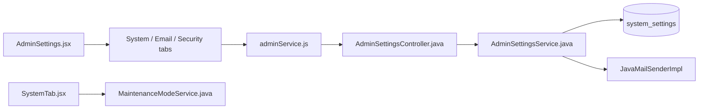
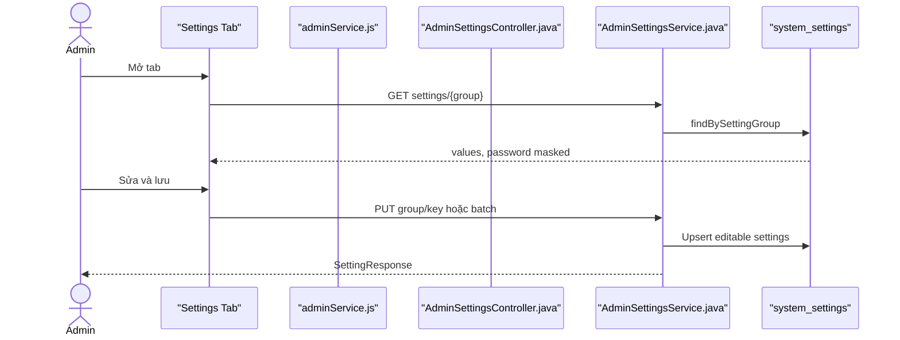

# Settings Feature Analysis

## 1. Tóm tắt tổng quan

Admin Settings quản lý các nhóm system, SMTP, security và email template. Frontend chọn tab bằng query string; từng tab tải/lưu group riêng. Backend whitelist group, che password, upsert setting và áp dụng lại SMTP runtime.

## 2. Bản đồ cấu trúc

| File | Vai trò | Loại |
|---|---|---|
| [AdminSettings.jsx](apps/frontend/src/features/management/admin/AdminSettings.jsx) | Điều phối tab settings | React Page |
| [SystemTab.jsx](apps/frontend/src/features/management/components/admin/settings/SystemTab.jsx) | Maintenance/system setting | Component |
| [EmailTab.jsx](apps/frontend/src/features/management/components/admin/settings/EmailTab.jsx) | SMTP và email template | Component |
| [SecurityTab.jsx](apps/frontend/src/features/management/components/admin/settings/SecurityTab.jsx) | Security settings | Component |
| [adminService.js](apps/frontend/src/shared/api/adminService.js) | GET/PUT/test SMTP API | API Service |
| [AdminSettingsController.java](apps/backend/src/main/java/com/jlpt/feature/admin/AdminSettingsController.java) | Settings endpoints | Controller |
| [AdminSettingsService.java](apps/backend/src/main/java/com/jlpt/feature/admin/AdminSettingsService.java) | Validate/upsert/mask/apply | Service |
| [SystemSetting.java](apps/backend/src/main/java/com/jlpt/feature/admin/SystemSetting.java) | Setting key/value | Entity |
| [SystemSettingRepository.java](apps/backend/src/main/java/com/jlpt/feature/admin/SystemSettingRepository.java) | Persistence theo group/key | Repository |

## 3. Bản đồ kết nối



| Từ | Đến | Cách kết nối | Dữ liệu |
|---|---|---|---|
| AdminSettings | tab | render | query `tab` |
| Tab | adminService | JS call | group/key/value |
| Controller | service | DTO | setting payload |
| Service | repository | upsert | group/key/value |
| Service | mail sender | runtime apply/test | SMTP values |

## 4. Luồng xử lý theo trình tự

1. `/admin/settings?tab=...` chọn component tab.
2. Tab gọi `getSettings(group)`.
3. Backend xác nhận group thuộc whitelist và mask password thành `********`.
4. Khi lưu, UI gọi update một key hoặc batch.
5. Service bỏ qua password rỗng/masked để không ghi đè secret hiện tại.
6. Group SMTP được áp dụng lại vào `JavaMailSenderImpl`; nút test gọi endpoint riêng.



## 5. Vai trò đoạn code quan trọng

[AdminSettingsService.java#L30](apps/backend/src/main/java/com/jlpt/feature/admin/AdminSettingsService.java#L30)

```java
public List<SettingResponse> getByGroup(String group) {
    validateGroup(group); // Chỉ các group whitelist mới được truy cập.
    return settingRepository.findBySettingGroup(group).stream()
            .map(s -> SettingResponse.builder()
                    // Password không bao giờ được trả nguyên văn về frontend.
                    .settingValue(isPassword(s.getSettingKey()) ? "********" : s.getSettingValue())
                    .build())
            .toList();
}
```

[AdminSettingsService.java#L58](apps/backend/src/main/java/com/jlpt/feature/admin/AdminSettingsService.java#L58)

```java
for (UpdateSettingsBatchRequest.Item item : items) {
    // Giá trị rỗng/masked mang nghĩa "giữ password cũ".
    if (isPassword(item.getSettingKey())
            && (item.getSettingValue() == null || item.getSettingValue().isBlank()
                    || "********".equals(item.getSettingValue()))) {
        continue;
    }
    result.add(upsert(group, item.getSettingKey(), item.getSettingValue()));
}
```

## 6. Dữ liệu di chuyển

Tab/group → list settings (secret masked) → form state → batch items → validated upsert → database/runtime mail sender → response/toast.

## 7. Bảng tra cứu tổng hợp

| Bước | File | Function | Kết nối tới | Dữ liệu | Ghi chú |
|---:|---|---|---|---|---|
| 1 | AdminSettings | `switchTab` | tab component | tab id | Query string |
| 2 | Tab | effect | API | group | Load |
| 3 | Service | `getByGroup` | repo | group | Mask password |
| 4 | Tab | save | update API | values | Single/batch |
| 5 | Service | `updateSettings` | repo/mail | items | Transaction |

## 8. Các mục cần bổ sung context

- Giá trị settings thực tế phụ thuộc dữ liệu DB/migration; tài liệu không đọc môi trường hoặc secret.
- Notification Rules dùng cùng bảng nhưng có JSON/domain service riêng, được tách thành tài liệu khác.

<!-- BACKEND-METHOD-INVENTORY:START -->

## Phụ lục — Danh mục đầy đủ hàm backend

> Phần này được đối chiếu trực tiếp từ source backend hiện tại. Chỉ liệt kê các hàm khai báo tường minh trong những file Java mà tài liệu này tham chiếu; các hàm do Lombok/JPA sinh tự động không xuất hiện trong source nên không liệt kê.

### `AdminSettingsController`

Nguồn: [AdminSettingsController.java](../../../apps/backend/src/main/java/com/jlpt/feature/admin/AdminSettingsController.java)

| # | Hàm backend (đầy đủ chữ ký) | Endpoint | Tác dụng/chức năng phục vụ |
|---:|---|---|---|
| 1 | [`ResponseEntity<ApiResponse<List<SettingResponse>>> getByGroup(@PathVariable String group)`](../../../apps/backend/src/main/java/com/jlpt/feature/admin/AdminSettingsController.java#L31) | `GET /{group}` | Xử lý endpoint `GET /{group}`; thực hiện nghiệp vụ `get by group`. |
| 2 | [`ResponseEntity<ApiResponse<SettingResponse>> updateSetting(@PathVariable String group, @PathVariable String key, @Valid @RequestBody UpdateSettingRequest request)`](../../../apps/backend/src/main/java/com/jlpt/feature/admin/AdminSettingsController.java#L38) | `PUT /{group}/{key}` | Xử lý endpoint `PUT /{group}/{key}`; thực hiện nghiệp vụ `update setting`. |
| 3 | [`ResponseEntity<ApiResponse<List<SettingResponse>>> updateSettings(@PathVariable String group, @Valid @RequestBody UpdateSettingsBatchRequest request)`](../../../apps/backend/src/main/java/com/jlpt/feature/admin/AdminSettingsController.java#L46) | `PUT /{group}` | Xử lý endpoint `PUT /{group}`; thực hiện nghiệp vụ `update settings`. |

### `AdminSettingsService`

Nguồn: [AdminSettingsService.java](../../../apps/backend/src/main/java/com/jlpt/feature/admin/AdminSettingsService.java)

| # | Hàm backend (đầy đủ chữ ký) | Endpoint | Tác dụng/chức năng phục vụ |
|---:|---|---|---|
| 1 | [`List<SettingResponse> getByGroup(String group)`](../../../apps/backend/src/main/java/com/jlpt/feature/admin/AdminSettingsService.java#L31) | `—` | Đọc hoặc tra cứu dữ liệu phục vụ `get by group`. |
| 2 | [`SettingResponse updateSetting(String group, String key, String value)`](../../../apps/backend/src/main/java/com/jlpt/feature/admin/AdminSettingsService.java#L50) | `—` | Cập nhật trạng thái/dữ liệu cho nghiệp vụ `update setting`. |
| 3 | [`List<SettingResponse> updateSettings(String group, List<UpdateSettingsBatchRequest.Item> items)`](../../../apps/backend/src/main/java/com/jlpt/feature/admin/AdminSettingsService.java#L57) | `—` | Cập nhật trạng thái/dữ liệu cho nghiệp vụ `update settings`. |
| 4 | [`SettingResponse upsert(String group, String key, String value)`](../../../apps/backend/src/main/java/com/jlpt/feature/admin/AdminSettingsService.java#L77) | `—` | Thực hiện xử lý backend `upsert` trong `AdminSettingsService`. |
| 5 | [`void testSmtpConnection(SmtpTestRequest request)`](../../../apps/backend/src/main/java/com/jlpt/feature/admin/AdminSettingsService.java#L111) | `—` | Thực hiện xử lý backend `test smtp connection` trong `AdminSettingsService`. |
| 6 | [`void applySmtpSettingsToMailSender()`](../../../apps/backend/src/main/java/com/jlpt/feature/admin/AdminSettingsService.java#L202) | `—` | Thực hiện xử lý backend `apply smtp settings to mail sender` trong `AdminSettingsService`. |
| 7 | [`void validateGroup(String group)`](../../../apps/backend/src/main/java/com/jlpt/feature/admin/AdminSettingsService.java#L273) | `—` | Kiểm tra điều kiện/trạng thái phục vụ `validate group`. |
| 8 | [`boolean isPassword(String key)`](../../../apps/backend/src/main/java/com/jlpt/feature/admin/AdminSettingsService.java#L279) | `—` | Kiểm tra điều kiện/trạng thái phục vụ `is password`. |

### `SystemSetting`

Nguồn: [SystemSetting.java](../../../apps/backend/src/main/java/com/jlpt/feature/admin/SystemSetting.java)

| # | Hàm backend (đầy đủ chữ ký) | Endpoint | Tác dụng/chức năng phục vụ |
|---:|---|---|---|
| 1 | [`void onUpdate()`](../../../apps/backend/src/main/java/com/jlpt/feature/admin/SystemSetting.java#L48) | `—` | Thực hiện xử lý backend `on update` trong `SystemSetting`. |
| 2 | [`String getValue()`](../../../apps/backend/src/main/java/com/jlpt/feature/admin/SystemSetting.java#L64) | `—` | Đọc hoặc tra cứu dữ liệu phục vụ `get value`. |

### `SystemSettingRepository`

Nguồn: [SystemSettingRepository.java](../../../apps/backend/src/main/java/com/jlpt/feature/admin/SystemSettingRepository.java)

| # | Hàm backend (đầy đủ chữ ký) | Endpoint | Tác dụng/chức năng phục vụ |
|---:|---|---|---|
| 1 | [`List<SystemSetting> findBySettingGroup(String settingGroup)`](../../../apps/backend/src/main/java/com/jlpt/feature/admin/SystemSettingRepository.java#L10) | `—` | Đọc hoặc tra cứu dữ liệu phục vụ `find by setting group`. |
| 2 | [`Optional<SystemSetting> findBySettingGroupAndSettingKey(String settingGroup, String settingKey)`](../../../apps/backend/src/main/java/com/jlpt/feature/admin/SystemSettingRepository.java#L12) | `—` | Đọc hoặc tra cứu dữ liệu phục vụ `find by setting group and setting key`. |
| 3 | [`boolean existsBySettingGroupAndSettingKey(String settingGroup, String settingKey)`](../../../apps/backend/src/main/java/com/jlpt/feature/admin/SystemSettingRepository.java#L14) | `—` | Kiểm tra điều kiện/trạng thái phục vụ `exists by setting group and setting key`. |

**Tổng cộng:** `16` hàm backend trong `4` file Java được tham chiếu.

<!-- BACKEND-METHOD-INVENTORY:END -->
