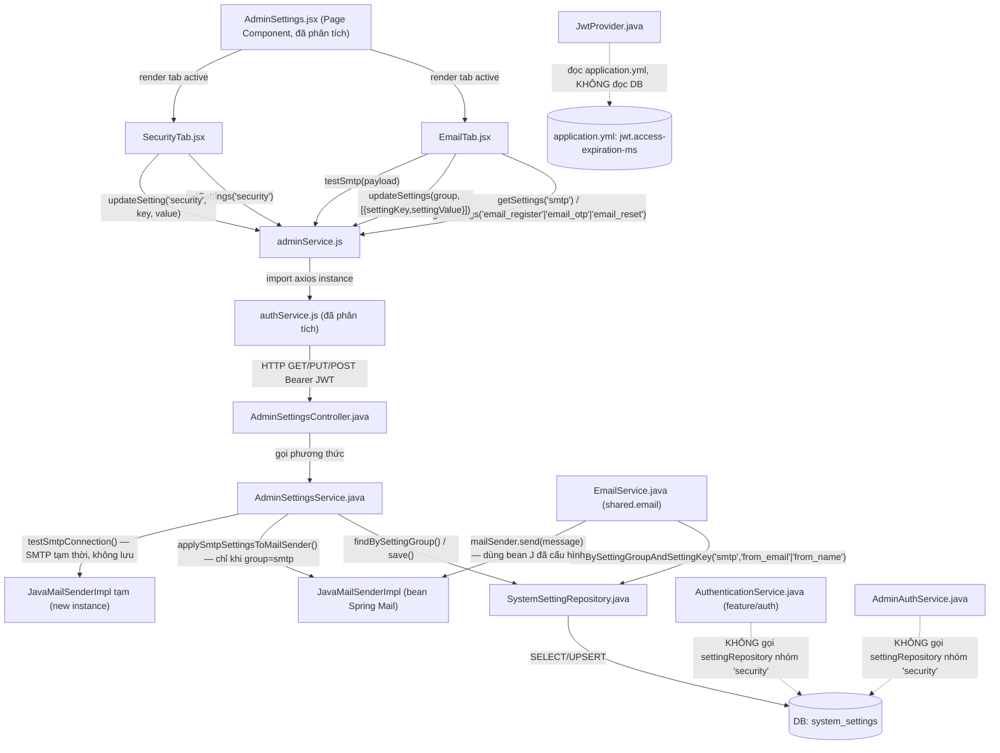
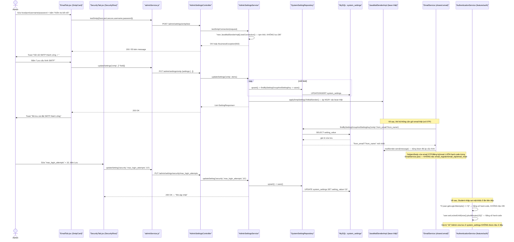

# Phân Tích Feature: admin-settings-email-security (Cài Đặt Hệ Thống — Tab Email & Tab Bảo Mật)

> **Tác giả phân tích:** AI Senior Software Architect
> **Ngày phân tích:** 2026-07-27
> **Phạm vi:** UC-39 (Settings/Cài đặt hệ thống) — **chỉ 2 tab**: **Email** (nhóm setting `smtp`, `email_register`, `email_otp`, `email_reset`) và **Bảo mật** (nhóm setting `security`).
> **Không thuộc phạm vi (đã phân tích ở tài liệu khác — xem link):**
> - Khung trang, tab System, entity/repository/controller/service dùng chung, `MaintenanceModeService` → [admin-system-feature-analysis.md](admin-system-feature-analysis.md)
> - Tab Notification (`NotificationTab.jsx`) → tài liệu riêng `admin-notification-rules-feature-analysis.md` (không đọc trong phân tích này)
> **Nguồn:** Đọc trực tiếp source code trong workspace

---

## 1. Tóm Tắt Tổng Quan

Tab **Email** và tab **Bảo mật** là 2 trong 4 tab con của trang `AdminSettings.jsx` (đã phân tích khung trang ở tài liệu `admin-system-feature-analysis.md`). Cả hai cùng dùng chung cơ chế key-value tổng quát `AdminSettingsController` → `AdminSettingsService` → `SystemSettingRepository` → bảng `system_settings`, nhưng khác nhau ở **những gì thực sự xảy ra với dữ liệu sau khi lưu**:

- **Tab Email** ([EmailTab.jsx](../../../apps/frontend/src/components/admin/settings/EmailTab.jsx)) gồm 1 card cấu hình **SMTP Server** (nhóm `smtp`) và 3 card cấu hình theo **loại email** (`email_register`, `email_otp`, `email_reset`). Nhóm `smtp` có tác động thật: `AdminSettingsService` áp giá trị vào `JavaMailSenderImpl` (bean gửi mail thật) ngay sau khi lưu, và `EmailService` đọc lại 2 khóa `smtp.from_email`/`smtp.from_name` mỗi lần gửi mail. Ngược lại, 3 nhóm `email_register`/`email_otp`/`email_reset` được lưu vào DB thành công nhưng **không có nơi nào trong backend đọc lại** các khóa `from_email`/`from_name`/`subject` của chúng — xem mục 8 để biết chi tiết và bằng chứng.
- **Tab Bảo mật** ([SecurityTab.jsx](../../../apps/frontend/src/components/admin/settings/SecurityTab.jsx)) cho phép Admin sửa 3 con số: `max_login_attempts`, `lockout_duration_minutes`, `jwt_expiry_minutes` (nhóm `security`). Qua khảo sát toàn bộ backend, **không có service nghiệp vụ nào (`AuthenticationService`, `AdminAuthService`, `JwtProvider`) đọc lại 3 khóa này** — giới hạn số lần đăng nhập sai và thời gian khóa tài khoản đều là hằng số Java hard-code (`MAX_LOGIN_ATTEMPTS = 5`, `plusMinutes(15)`), thời hạn JWT đọc từ `application.yml` (`jwt.access-expiration-ms`), hoàn toàn độc lập với DB. Đây là phát hiện quan trọng nhất của tài liệu này — xem mục 8.

Feature trải dài trên **3 tầng**, giống cấu trúc chung đã mô tả ở `admin-system-feature-analysis.md`:

| Tầng | Mô tả riêng cho Email/Security |
|------|------|
| **Frontend** | `AdminSettings.jsx` (đã phân tích) → `EmailTab.jsx` / `SecurityTab.jsx` → `adminService.js` |
| **Backend** | `AdminSettingsController`/`AdminSettingsService` (dùng chung) — điểm riêng: nhánh `if ("smtp".equals(group))` gọi `applySmtpSettingsToMailSender()`; `testSmtpConnection()` cho nút "Kiểm tra kết nối"; `EmailService` đọc lại `smtp.from_email`/`from_name` khi gửi mail thật |
| **Database** | Cùng bảng `system_settings`, các dòng `setting_group IN ('smtp','email_register','email_otp','email_reset','security')` |

**Entry point** của phần được phân tích: route `/admin/settings?tab=email` và `/admin/settings?tab=security` (frontend) → endpoint `GET/PUT /api/admin/settings/{group}` và `POST /api/admin/settings/smtp/test` (backend, dùng chung với các tab khác).

Use case được cover: **UC-39** (Cài đặt hệ thống) — phạm vi phân tích chỉ đi sâu vào phần **cấu hình Email (SMTP + 3 loại email)** và **cấu hình Bảo mật**.

---

## 2. Bản Đồ Cấu Trúc (Các "Mảnh" Và Vai Trò)

### 2.1 Frontend

| File | Vai trò | Loại |
|------|---------|------|
| [EmailTab.jsx](../../../apps/frontend/src/components/admin/settings/EmailTab.jsx) | Tab "Email": 1 card `SmtpCard` (cấu hình + test SMTP) + 3 card `EmailTypeCard` lặp lại (đăng ký / OTP / cấp lại mật khẩu Staff) | Component |
| [SecurityTab.jsx](../../../apps/frontend/src/components/admin/settings/SecurityTab.jsx) | Tab "Bảo mật": danh sách 3 dòng `SecurityRow` (số lần đăng nhập tối đa, thời gian khóa, thời hạn JWT), mỗi dòng sửa/lưu độc lập | Component |
| [adminService.js](../../../apps/frontend/src/api/adminService.js) | Tầng giao tiếp HTTP dùng chung: `getSettings(group)`, `updateSetting(group, key, value)`, `updateSettings(group, settings)`, `testSmtp(payload)` (đã liệt kê ở `admin-system-feature-analysis.md`, ở đây trace lại cách 2 tab gọi cụ thể) | API Service |
| [validation.js](../../../apps/frontend/src/utils/validation.js) | Validator dùng chung cho form: `emailError`, `requiredError`, `portError` — `EmailTab.jsx` import để validate client-side trước khi gửi | Utility |
| [ManageUsersIcons](../../../apps/frontend/src/components/admin/ManageUsersIcons.jsx) | Icon `IcEdit`, `IcBloomCheck` — `SecurityTab.jsx` dùng cho nút sửa/lưu từng dòng | Component (Icon) |

### 2.2 Backend

| File | Vai trò | Loại |
|------|---------|------|
| [AdminSettingsController.java](../../../apps/backend/src/main/java/com/jlpt/feature/admin/AdminSettingsController.java) | Nhận HTTP request (dùng chung với tab System) — điểm riêng cho Email/Security: endpoint `PUT /{group}` (batch, dùng bởi cả 2 tab) và `POST /smtp/test` (chỉ tab Email) | Controller |
| [AdminSettingsService.java](../../../apps/backend/src/main/java/com/jlpt/feature/admin/AdminSettingsService.java) | Business logic dùng chung — điểm riêng: `updateSettings()` (batch upsert), `testSmtpConnection()`, `applySmtpSettingsToMailSender()` (`@PostConstruct` + gọi lại sau mỗi lần lưu nhóm `smtp`) | Service |
| [EmailService.java](../../../apps/backend/src/main/java/com/jlpt/shared/email/EmailService.java) | **Bên tiêu thụ thật** của setting `smtp.from_email`/`smtp.from_name` khi gửi email thật (OTP, xác nhận đăng ký, reset mật khẩu…) — **không đọc** nhóm `email_register`/`email_otp`/`email_reset` | Service (feature khác — `shared.email`) |
| [SmtpTestRequest.java](../../../apps/backend/src/main/java/com/jlpt/feature/admin/dto/request/SmtpTestRequest.java) | DTO nhận cấu hình SMTP tạm thời để test (`host`, `port`, `username`, `password`, `secure`) — không lưu DB | DTO Request |
| [UpdateSettingsBatchRequest.java](../../../apps/backend/src/main/java/com/jlpt/feature/admin/dto/request/UpdateSettingsBatchRequest.java) | DTO nhận danh sách `{settingKey, settingValue}` để lưu nhiều setting cùng nhóm trong 1 transaction — dùng bởi `SmtpCard`/`EmailTypeCard` (không dùng bởi `SecurityTab`, tab này gọi `updateSetting` từng dòng một) | DTO Request |
| [AuthenticationService.java](../../../apps/backend/src/main/java/com/jlpt/feature/auth/AuthenticationService.java) | **Đối chứng** cho tab Security: chứa logic khóa tài khoản Student/Staff thật (`handleStudentLogin`), nhưng dùng hằng số hard-code, không đọc nhóm `security` | Service (feature khác) |
| [AdminAuthService.java](../../../apps/backend/src/main/java/com/jlpt/feature/admin/AdminAuthService.java) | **Đối chứng** cho tab Security: logic khóa tài khoản Admin (`processAdminLogin`), dùng hằng số `MAX_LOGIN_ATTEMPTS`/`LOCK_DURATION_MINUTES` hard-code | Service |
| [JwtProvider.java](../../../apps/backend/src/main/java/com/jlpt/shared/security/JwtProvider.java) | **Đối chứng** cho tab Security: thời hạn JWT đọc từ `@Value("${jwt.access-expiration-ms}")` (application.yml/env var), không đọc DB | Component (Security) |
| [V2__mock_data.sql](../../../apps/backend/src/main/resources/db/migration/V2__mock_data.sql) | Migration seed dữ liệu ban đầu cho nhóm `security`/`smtp` | Migration |
| [V3__seed_email_type_settings.sql](../../../apps/backend/src/main/resources/db/migration/V3__seed_email_type_settings.sql) | Migration seed dữ liệu ban đầu cho nhóm `email_register`/`email_otp`/`email_reset`/bổ sung `smtp.secure`, `smtp.from_name` | Migration |

> Các file dùng chung đã phân tích chi tiết ở `admin-system-feature-analysis.md` (không lặp lại ở đây): [AdminSettings.jsx](../../../apps/frontend/src/pages/admin/AdminSettings.jsx), [authService.js](../../../apps/frontend/src/api/authService.js), [SystemSetting.java](../../../apps/backend/src/main/java/com/jlpt/feature/admin/SystemSetting.java), [SystemSettingRepository.java](../../../apps/backend/src/main/java/com/jlpt/feature/admin/SystemSettingRepository.java), [ValueTypeConverter.java](../../../apps/backend/src/main/java/com/jlpt/feature/admin/ValueTypeConverter.java), [UpdateSettingRequest.java](../../../apps/backend/src/main/java/com/jlpt/feature/admin/dto/request/UpdateSettingRequest.java), [SettingResponse.java](../../../apps/backend/src/main/java/com/jlpt/feature/admin/dto/response/SettingResponse.java).

---

## 3. Bản Đồ Kết Nối (Ai Gọi Ai, Dữ Liệu Truyền Qua Đâu)

### 3.1 Diagram Mermaid — Architecture Overview



> Ghi chú ký hiệu: mũi tên nét đứt (`-.->`) đánh dấu **kết nối không tồn tại trong code thật** — vẽ ra có chủ đích để làm rõ rằng 3 service tiêu thụ tiềm năng của nhóm `security` **không** đọc lại giá trị Admin đã lưu (xem mục 8).

### 3.2 Bảng Kết Nối Chi Tiết

| Từ (File A) | Đến (File B) | Cách kết nối | Dữ liệu truyền |
|-------------|--------------|--------------|----------------|
| `EmailTab.jsx` (`SmtpCard`) | `adminService.js` | `getSettings('smtp')`, `updateSettings('smtp', items)`, `testSmtp(payload)` | `{host, port, secure, username, password, from_email, from_name}` |
| `EmailTab.jsx` (`EmailTypeCard`) | `adminService.js` | `getSettings(group)`, `updateSettings(group, items)` với `group ∈ {email_register, email_otp, email_reset}` | `{from_email, from_name, subject}` |
| `SecurityTab.jsx` (`SecurityRow`) | `adminService.js` | `getSettings('security')`, `updateSetting('security', key, value)` | `key ∈ {max_login_attempts, lockout_duration_minutes, jwt_expiry_minutes}`, `value: string số` |
| `adminService.js` | `AdminSettingsController` | HTTP qua `authService.js` | Path `{group}` hoặc `{group}/{key}`, body `{settingValue}` hoặc `{settings:[...]}` |
| `AdminSettingsController` | `AdminSettingsService` | Spring DI | `group`, `key`/`items` |
| `AdminSettingsService` (nhánh `group=="smtp"`) | `JavaMailSenderImpl` (bean thật) | Spring DI, gọi trực tiếp setter | host/port/username/password/secure — áp dụng ngay lập tức, không cần restart |
| `AdminSettingsService.testSmtpConnection()` | `JavaMailSenderImpl` (instance tạm, `new JavaMailSenderImpl()`) | Tạo object mới trong hàm, không inject | Cấu hình lấy từ `SmtpTestRequest` hoặc fallback đọc DB nếu field null |
| `EmailService.java` | `SystemSettingRepository` | Spring DI, gọi `findBySettingGroupAndSettingKey("smtp", "from_email"/"from_name")` | Đọc lại 2 khóa này mỗi lần gửi mail (`resolveFromEmail()`, `resolveFromName()`) |
| `EmailService.java` | *(không có)* | — | **Không** đọc `email_register`/`email_otp`/`email_reset` — subject/body luôn hard-code trong Java |
| `AuthenticationService.java` / `AdminAuthService.java` | *(không có)* | — | **Không** đọc nhóm `security` — dùng hằng số Java `MAX_LOGIN_ATTEMPTS=5`, `plusMinutes(15)` |
| `JwtProvider.java` | *(không có)* | — | **Không** đọc nhóm `security` — dùng `@Value("${jwt.access-expiration-ms:900000}")` từ `application.yml`/biến môi trường |

---

## 4. Luồng Xử Lý Theo Trình Tự

### 4.1 Luồng: Admin Cấu Hình & Test SMTP (tab Email — card "Cấu Hình SMTP Server")

**Bước 1:** Admin vào `/admin/settings?tab=email` → `EmailTab.jsx` mount → `SmtpCard` (dòng 119) chạy `useEffect` (dòng 127–137) gọi `getSettings('smtp')`.

**Bước 2:** `adminService.getSettings()` gọi `GET /admin/settings/smtp` → `AdminSettingsController.getByGroup()` → `AdminSettingsService.getByGroup("smtp")` → trả về danh sách setting, khóa `password` bị ẩn thành `"********"` (logic dùng chung, đã phân tích ở `admin-system-feature-analysis.md` mục 5.2).

**Bước 3:** `SmtpCard` render form 7 field (`SMTP_FIELDS`, dòng 35–44): host, port, secure, username, password, from_email, from_name. Admin sửa giá trị.

**Bước 4 (Test):** Admin bấm "Kiểm tra kết nối" → `handleTest()` (dòng 177–197) validate client-side rồi gọi `testSmtp(payload)` — **payload không gồm `from_email`/`from_name`** (dòng 183–189), chỉ gồm `{host, port, secure, username, password}`.

**Bước 5:** `adminService.testSmtp()` gọi `POST /admin/settings/smtp/test` với body trên → `AdminSettingsController.testSmtp()` (dòng 54–58) → `AdminSettingsService.testSmtpConnection()` (dòng 110–200): dựng một `JavaMailSenderImpl` **tạm thời** (không phải bean chính), field nào null trong request thì fallback đọc từ DB, gọi `testSender.testConnection()` — **không gửi email thật, không lưu DB.**

**Bước 6:** Nếu `testConnection()` ném exception → bắt lại, ném `BusinessException(502, "SMTP_TEST_FAILED", ...)` → FE hiện toast lỗi kèm message chi tiết (dòng 192–193 `EmailTab.jsx`). Nếu thành công → FE hiện toast "Kết nối SMTP thành công ✓".

**Bước 7 (Lưu):** Admin bấm "Lưu cấu hình SMTP" → `handleSave()` (dòng 159–175) gọi `updateSettings('smtp', SMTP_FIELDS.map(...))` — gửi **cả 7 field** kể cả field không đổi.

**Bước 8:** `adminService.updateSettings()` gọi `PUT /admin/settings/smtp` → `AdminSettingsController.updateSettings()` (dòng 45–51) → `AdminSettingsService.updateSettings()` (dòng 56–75): lặp từng item, bỏ qua field password nếu rỗng/`********` (dòng 62–68), gọi `upsert()` cho từng field còn lại — **toàn bộ trong 1 transaction** (`@Transactional` ở class-method, dòng 57).

**Bước 9:** Vì `group.equals("smtp")`, sau khi lưu xong toàn bộ danh sách, `updateSettings()` gọi `applySmtpSettingsToMailSender()` (dòng 71–73) — **áp ngay** cấu hình mới vào bean `JavaMailSenderImpl` chính của ứng dụng (không cần restart server).

**Bước 10 (bất kỳ lúc nào sau đó):** Khi hệ thống cần gửi 1 email thật (vd Student đăng ký → OTP xác minh), `EmailService.sendVerificationEmail()` (dòng 42–48) → `sendHtmlEmail()` (dòng 156) → `resolveFromEmail()`/`resolveFromName()` (dòng 216–233) đọc lại đúng 2 khóa `smtp.from_email`/`smtp.from_name` vừa lưu → `sendOnce()` (dòng 198–211) dùng bean `mailSender` (đã được `applySmtpSettingsToMailSender()` cấu hình ở Bước 9) để gửi thật qua `mailSender.send(message)`.

---

### 4.2 Luồng: Admin Sửa Setting Bảo Mật (tab Security)

**Bước 1:** Admin vào `/admin/settings?tab=security` → `SecurityTab.jsx` render 3 `SecurityRow` (dòng 150–152), mỗi row ứng với 1 phần tử `SECURITY_SETTINGS` (dòng 5–27): `max_login_attempts`, `lockout_duration_minutes`, `jwt_expiry_minutes`.

**Bước 2:** Mỗi `SecurityRow` tự `useEffect` (dòng 46–56) gọi `getSettings('security')` — **gọi lặp lại 3 lần cùng API cho 3 row** (không có cache/gộp request ở tầng UI), mỗi row tự tìm phần tử `settingKey` khớp với chính nó (dòng 49–52).

**Bước 3:** Admin bấm icon bút chì (`IcEdit`) → `startEdit()` (dòng 58–62): copy giá trị hiện tại vào ô input, focus input.

**Bước 4:** Admin sửa số, bấm icon check (`IcBloomCheck`) hoặc Enter → `saveEdit()` (dòng 66–83): validate client-side `num < setting.min || num > setting.max` (dòng 68) — **chặn ngay tại FE nếu ngoài khoảng**, ví dụ `max_login_attempts` phải trong [3, 20].

**Bước 5:** Nếu hợp lệ, gọi `updateSetting('security', key, editVal)` → `PUT /admin/settings/security/{key}` → `AdminSettingsController.updateSetting()` → `AdminSettingsService.updateSetting()` → `upsert()` — **cùng cơ chế upsert chung, không có validate range ở tầng Service/BE** (chỉ FE chặn min/max, BE nhận String bất kỳ ≤ 20000 ký tự qua `UpdateSettingRequest`).

**Bước 6:** DB lưu giá trị mới, FE cập nhật `value` state, hiện toast thành công. **Đến đây luồng UI kết thúc — không có bước 7 "hệ thống dùng giá trị mới" vì không có consumer nào đọc lại (xem 4.3 dưới đây để đối chiếu).**

### 4.3 Đối chiếu: Điều Gì Thực Sự Xảy Ra Khi Login Sai (không liên quan đến setting `security` vừa lưu)

Để xác nhận setting `security` có tác dụng hay không, cần theo dõi luồng login thật — độc lập hoàn toàn với Bước 1–6 ở trên:

**Bước A:** Student nhập sai mật khẩu 5 lần → `AuthenticationService.handleStudentLogin()` bắt `BadCredentialsException` (dòng 253) → `user.setLoginAttempts(user.getLoginAttempts() + 1)` (dòng 254) → so sánh với **hằng số hard-code `5`** (dòng 255, không phải biến đọc từ đâu cả) → nếu đạt, `user.setLockedUntil(LocalDateTime.now().plusMinutes(15))` (dòng 256) — **số `15` cũng hard-code**, không phải giá trị `lockout_duration_minutes` Admin vừa sửa ở Bước 5.

**Bước B:** Tương tự với Admin: `AdminAuthService.processAdminLogin()` dùng hằng số class `MAX_LOGIN_ATTEMPTS = 5` và `LOCK_DURATION_MINUTES = 15` (dòng 25–26) — định nghĩa **ngay trong code Java**, biên dịch cứng, đổi setting DB không ảnh hưởng gì đến giá trị này (phải sửa code + build lại mới đổi được).

**Bước C:** JWT hết hạn sau bao lâu — `JwtProvider` đọc `@Value("${jwt.access-expiration-ms:900000}")` (dòng 20) từ `application.yml`/biến môi trường `JWT_ACCESS_EXPIRATION_MS`, **không** đọc setting `security.jwt_expiry_minutes` mà Admin sửa ở SecurityTab.

### 4.4 Sequence Diagram Tổng Hợp



---

## 5. Vai Trò Từng Đoạn Code Quan Trọng

### 5.1 `SmtpCard` trong `EmailTab.jsx` — Test SMTP Không Chạm DB

**File:** [EmailTab.jsx](../../../apps/frontend/src/components/admin/settings/EmailTab.jsx) | Dòng 177–197

```jsx
async function handleTest(e) {
  if (e) e.preventDefault();
  if (!validate()) { addToast('error', 'Vui lòng sửa các trường được đánh dấu.'); return; }
  setTesting(true);
  try {
    // Gửi cấu hình hiện tại để test, KHÔNG lưu vào DB
    const payload = {
      host: form.host,
      port: form.port,
      secure: form.secure,
      username: form.username,
      password: form.password
    };
    await testSmtp(payload); // <-- endpoint riêng /smtp/test, tách biệt hoàn toàn với updateSettings()
    addToast('success', 'Kết nối SMTP thành công ✓ (Hãy bấm Lưu cấu hình nếu muốn áp dụng)');
  } catch (err) {
    addToast('error', `Lỗi kết nối SMTP: ${err?.response?.data?.message ?? 'Vui lòng kiểm tra lại cấu hình (hoặc Mật khẩu ứng dụng)'}`);
  } finally {
    setTesting(false);
  }
}
```

> **Giải thích:** Đây là điểm thiết kế quan trọng của tab Email — "Kiểm tra kết nối" và "Lưu cấu hình" là **2 hành động độc lập, không phụ thuộc nhau**. Test dùng form hiện tại (kể cả chưa lưu) để dựng 1 `JavaMailSenderImpl` tạm ở BE (`testSmtpConnection()`), gọi thẳng tới SMTP server thật để xác thực kết nối, nhưng **không ghi gì vào `system_settings`**. Nhận dữ liệu từ state `form` (do người dùng gõ), đưa đi qua `adminService.testSmtp()` → `POST /admin/settings/smtp/test`. Toast thành công cố ý nhắc "Hãy bấm Lưu cấu hình nếu muốn áp dụng" — xác nhận rằng Admin có thể test thành công nhưng quên lưu, dữ liệu cũ trong DB vẫn được dùng để gửi mail thật cho tới khi bấm Lưu.

---

### 5.2 `AdminSettingsService.updateSettings()` — Batch Upsert + Side-effect SMTP

**File:** [AdminSettingsService.java](../../../apps/backend/src/main/java/com/jlpt/feature/admin/AdminSettingsService.java) | Dòng 56–75

```java
/** PUT /api/admin/settings/{group} — upsert nhiều setting cùng nhóm trong 1 transaction. */
@Transactional
public List<SettingResponse> updateSettings(String group, List<UpdateSettingsBatchRequest.Item> items) {
    validateGroup(group); // Whitelist chung — "security" và "smtp" đều nằm trong ALLOWED_GROUPS
    List<SettingResponse> result = new ArrayList<>(items.size());
    for (UpdateSettingsBatchRequest.Item item : items) {
        // Để trống ô mật khẩu = giữ nguyên giá trị hiện tại (không ghi đè bằng rỗng).
        if (isPassword(item.getSettingKey())
                && (item.getSettingValue() == null
                        || item.getSettingValue().isBlank()
                        || "********".equals(item.getSettingValue()))) {
            continue; // Bỏ qua field password nếu FE gửi lại giá trị mask/rỗng
        }
        result.add(upsert(group, item.getSettingKey(), item.getSettingValue()));
    }
    if ("smtp".equals(group)) {
        // Side-effect quan trọng nhất của tab Email: áp cấu hình mới vào bean mail
        // thật NGAY LẬP TỨC, không cần restart server.
        applySmtpSettingsToMailSender();
    }
    return result;
}
```

> **Giải thích:** Hàm này được dùng bởi cả `SmtpCard` và `EmailTypeCard` (nhóm `smtp`/`email_register`/`email_otp`/`email_reset`), nhưng **chỉ nhóm `smtp` có nhánh `if` đặc biệt** ở cuối. Đây chính là bằng chứng code cho thấy 3 nhóm email-type được lưu vào DB **giống hệt quy trình của `smtp`** (cùng hàm `upsert()`, cùng transaction) nhưng **không có side-effect nào tương ứng** — không có `applyEmailTypeSettingsToXxx()` nào được gọi cho `email_register`/`email_otp`/`email_reset`, khác hẳn với cách `smtp` được "kích hoạt" ngay sau khi lưu.

---

### 5.3 `EmailService` — Nơi Duy Nhất Đọc Lại Setting Nhóm `smtp` Khi Gửi Mail Thật

**File:** [EmailService.java](../../../apps/backend/src/main/java/com/jlpt/shared/email/EmailService.java) | Dòng 216–233

```java
// Gmail (và nhiều SMTP relay khác) chỉ chấp nhận gửi khi header "From" trùng với
// tài khoản đã xác thực (smtp.username) — dùng nó làm fallback thay vì property tĩnh
// spring.mail.username, vốn không được cấu hình trong hệ thống này (SMTP set qua DB).
private String resolveFromEmail() {
    return blankToEmpty(settingRepository
                    .findBySettingGroupAndSettingKey("smtp", "from_email") // đọc lại DB mỗi lần gửi mail
                    .map(s -> s.getSettingValue())
                    .orElse(null))
            .or(() -> blankToEmpty(settingRepository
                    .findBySettingGroupAndSettingKey("smtp", "username")
                    .map(s -> s.getSettingValue())
                    .orElse(null)))
            .orElse(fromEmail); // fromEmail = @Value("${spring.mail.username}") — fallback cuối cùng
}

private String resolveFromName() {
    return settingRepository
            .findBySettingGroupAndSettingKey("smtp", "from_name") // đọc lại DB mỗi lần gửi mail
            .map(s -> s.getSettingValue())
            .orElse("JLPT Platform");
}
```

> **Giải thích:** Đây là 2 hàm **duy nhất** trong toàn bộ backend đọc lại giá trị Admin đã lưu ở tab Email (nhóm `smtp`) để dùng cho một hành động thật (gửi email). Được gọi bởi `sendHtmlEmail()` (dòng 156) mỗi lần gửi bất kỳ loại email nào (OTP, xác nhận đăng ký, mời Staff, reset mật khẩu…). Nhận dữ liệu từ `SystemSettingRepository` (đọc trực tiếp DB, không qua `AdminSettingsService`), đưa vào `MimeMessageHelper.setFrom(fromEmail, fromName)` (dòng 203) của `sendOnce()`. **Điểm quan trọng cần đối chiếu với mục 5.2/5.4:** hàm này **không hề gọi** `findBySettingGroupAndSettingKey("email_register"/"email_otp"/"email_reset", ...)` ở bất kỳ đâu trong file — nghĩa là 3 card "Email Xác Nhận Đăng Ký"/"Email OTP"/"Email Cấp Lại Mật Khẩu" trên UI chỉnh sửa dữ liệu **không được tiêu thụ**.

---

### 5.4 `sendOtpEmail()` — Bằng Chứng Subject/Body Hard-code, Bỏ Qua Setting Đã Lưu

**File:** [EmailService.java](../../../apps/backend/src/main/java/com/jlpt/shared/email/EmailService.java) | Dòng 68–74

```java
@Async
public void sendOtpEmail(String toEmail, String otpCode) {
    // Subject hard-code trong Java — KHÔNG đọc setting "email_otp.subject" mà Admin
    // cấu hình ở EmailTab.jsx (EmailTypeCard group="email_otp")
    String subject = "[JLPT Platform] Mã xác thực của bạn";
    String body = buildOtpEmailBody(otpCode); // Body cũng là template HTML hard-code, không đọc DB
    sendHtmlEmail(toEmail, subject, body);
    log.info("[EmailService] OTP email sent to: {}", toEmail);
}
```

> **Giải thích:** So sánh với seed data `V2__mock_data.sql` dòng 21–23 — `('email_otp', 'subject', 'Mã xác thực của bạn', 'string')` — chuỗi seed **trùng tình cờ** với chuỗi hard-code ở đây (`"Mã xác thực của bạn"`), dễ khiến người đọc lầm tưởng có liên kết. Nhưng đọc kỹ code thì đây là 2 hằng số độc lập: nếu Admin vào `EmailTab.jsx` sửa subject của `email_otp` thành "ABC", giá trị `"ABC"` được lưu đúng vào `system_settings`, nhưng lần gửi OTP tiếp theo **vẫn** dùng chuỗi `"[JLPT Platform] Mã xác thực của bạn"` hard-code ở dòng này — không có đường dữ liệu nào nối 2 nơi. Cùng logic áp dụng cho `sendVerificationEmail()` (dòng 42–48, ứng với `email_register`) và `sendPasswordResetEmail()`/`sendStaffTempPassword()` (dòng 59–66, 94–106, ứng với `email_reset`).

---

### 5.5 `SecurityRow.saveEdit()` — Validate Client-side, BE Không Validate Range

**File:** [SecurityTab.jsx](../../../apps/frontend/src/components/admin/settings/SecurityTab.jsx) | Dòng 66–83

```jsx
async function saveEdit() {
  const num = Number(editVal);
  if (!editVal || isNaN(num) || num < setting.min || num > setting.max) {
    // Validate DUY NHẤT tồn tại cho khoảng giá trị hợp lệ — chỉ ở FE.
    // setting.min/max lấy từ SECURITY_SETTINGS (hard-code trong component, dòng 5-27)
    addToast('error', `Giá trị phải từ ${setting.min} đến ${setting.max}`);
    return;
  }
  setSaving(true);
  try {
    await updateSetting(setting.group, setting.key, editVal); // gửi string số, không ép kiểu ở FE
    setValue(editVal);
    setEditing(false);
    addToast('success', `Đã cập nhật "${setting.label}"`);
  } catch {
    addToast('error', 'Cập nhật thất bại');
  } finally {
    setSaving(false);
  }
}
```

> **Giải thích:** Khác với `AdminSettingsService.upsert()` vốn chỉ kiểm tra `@NotNull`/`@Size(max=20000)` ở tầng DTO (`UpdateSettingRequest`, đã phân tích ở `admin-system-feature-analysis.md`), việc chặn khoảng giá trị hợp lý (vd `max_login_attempts` phải từ 3–20) **chỉ tồn tại ở client**. Một request `PUT /admin/settings/security/max_login_attempts` với `settingValue: "99999"` gửi thẳng qua Postman/curl (bỏ qua UI) sẽ được backend chấp nhận và lưu thành công — không có validate range ở Service. Đây là anti-pattern **"Client-trusted Data"** được liệt kê trong `CLAUDE.md` (mục Anti-Patterns → React), tuy hậu quả thực tế bị giảm nhẹ vì (như mục 8 chỉ ra) giá trị này dù sao cũng không được đọc lại ở đâu.

---

## 6. Dữ Liệu Di Chuyển Như Thế Nào

Theo dõi 2 loại dữ liệu cụ thể: (a) cấu hình SMTP xuyên suốt tới lúc gửi mail thật, (b) setting bảo mật từ lúc Admin lưu tới lúc "đáng lẽ" được dùng.

### 6.1 Cấu hình SMTP — luồng có tác dụng đầy đủ

```
[EmailTab.jsx SmtpCard] form = {host, port, secure, username, password, from_email, from_name}
        ↓ handleSave() → updateSettings('smtp', [...])
[adminService.js] → PUT /api/admin/settings/smtp  { settings: [{settingKey,settingValue}, ...] }
        ↓
[AdminSettingsController.updateSettings()] → settingsService.updateSettings("smtp", items)
        ↓
[AdminSettingsService.updateSettings()]
  for each item → upsert() → SystemSetting.settingValue = value → settingRepository.save()
  group=="smtp" → applySmtpSettingsToMailSender()
        ↓                                              ↓
[DB: system_settings]                    [JavaMailSenderImpl bean thật]
  setting_group='smtp'                      .setHost(...) .setPort(...) .setUsername(...)
  setting_key IN (host,port,...)            .setPassword(...) .getJavaMailProperties()...
                                             session mới được tạo lại NGAY (dòng 262-263)
        ↓ (về sau, khi có sự kiện cần gửi email)
[EmailService.resolveFromEmail()/resolveFromName()]
  đọc lại DB (smtp.from_email / smtp.from_name) — TÁCH BIỆT với bean mailSender ở trên
        ↓
[EmailService.sendOnce()] → helper.setFrom(fromEmail, fromName) → mailSender.send(message)
        ↓
[SMTP Server thật] → Email tới hộp thư người nhận, header "From" đúng giá trị Admin vừa cấu hình
```

### 6.2 Setting nhóm `email_register`/`email_otp`/`email_reset` — luồng bị "cụt" tại DB

```
[EmailTab.jsx EmailTypeCard group="email_otp"] form = {from_email, from_name, subject}
        ↓ handleSave() → updateSettings('email_otp', [...])
[adminService.js] → PUT /api/admin/settings/email_otp
        ↓
[AdminSettingsService.updateSettings()] → upsert() từng field → save()
   group != "smtp" → KHÔNG có side-effect nào được gọi
        ↓
[DB: system_settings] setting_group='email_otp' — giá trị được lưu và có thể GET lại đúng
        ↓
[EmailService.sendOtpEmail()] → String subject = "[JLPT Platform] Mã xác thực của bạn" (HARD-CODE)
        ↓
KHÔNG CÓ BƯỚC NÀO đọc lại system_settings WHERE setting_group='email_otp'
        ↓
Email gửi ra vẫn dùng subject/from_name hard-code — dữ liệu Admin vừa sửa "chết" trong DB
```

### 6.3 Setting nhóm `security` — luồng bị "cụt" tương tự, không có consumer

```
[SecurityTab.jsx SecurityRow key="max_login_attempts"] editVal = "10" (string, đã validate 3-20 ở FE)
        ↓ saveEdit() → updateSetting('security','max_login_attempts','10')
[adminService.js] → PUT /api/admin/settings/security/max_login_attempts { settingValue: "10" }
        ↓
[AdminSettingsController.updateSetting()] → settingsService.updateSetting("security", key, "10")
        ↓
[AdminSettingsService.upsert()] → SystemSetting.settingValue = "10" → save()
        ↓
[DB: system_settings] setting_group='security', setting_key='max_login_attempts', setting_value='10'
        ↓
KHÔNG CÓ BƯỚC NÀO đọc lại dòng này — AuthenticationService/AdminAuthService dùng:
  private static final int MAX_LOGIN_ATTEMPTS = 5;       // AdminAuthService.java dòng 25
  if (user.getLoginAttempts() >= 5) { ... }              // AuthenticationService.java dòng 255 (hard-code, không phải biến)
JwtProvider dùng:
  @Value("${jwt.access-expiration-ms:900000}")            // application.yml, không phải DB
```

### 6.4 Biến đổi kiểu dữ liệu qua từng tầng (setting `security.max_login_attempts`)

| Tầng | Tên field | Kiểu dữ liệu | Giá trị ví dụ |
|------|-----------|-------------|---------------|
| Frontend state | `editVal` (SecurityRow) | `string` (input number nhưng lưu string) | `"10"` |
| Validate FE | `Number(editVal)` so với `setting.min/max` | `number` | `10` (kiểm tra 3 ≤ 10 ≤ 20) |
| HTTP request body | `settingValue` | `string` (JSON) | `"10"` |
| Controller | `UpdateSettingRequest.settingValue` | `String`, `@Size(max=20000)` — **không giới hạn khoảng số** | `"10"` |
| Entity | `SystemSetting.settingValue` | `String` | `"10"` |
| DB column | `system_settings.setting_value` | `NVARCHAR(MAX)` (kiểu khai báo, xem `SystemSetting.java`) | `'10'` |
| **Đọc lại (thực tế)** | *(không tồn tại)* | — | **Không nơi nào đọc `security.max_login_attempts` để so sánh với `loginAttempts` thật** |
| DTO response | `SettingResponse.settingValue` | `String` | `"10"` |
| Frontend render | `value` | `string` hiển thị trực tiếp | `"10"` |

**Lưu ý kỹ thuật quan trọng:** Không giống `system.maintenance_mode` (đã phân tích ở tài liệu kia, có `MaintenanceModeService` đọc lại), setting nhóm `security` **không có service tương đương** — nó là một "đảo dữ liệu" (data island): ghi được, đọc lại được qua chính API `getSettings()`/`getByGroup()`, nhưng không bao giờ được bất kỳ business logic nào tiêu thụ để ảnh hưởng hành vi hệ thống.

---

## 7. Bảng Tra Cứu Tổng Hợp

| Bước | File | Function/Method | Kết nối tới | Dữ liệu | Ghi chú |
|------|------|------------------|-------------|---------|---------|
| Đọc | [EmailTab.jsx:127](../../../apps/frontend/src/components/admin/settings/EmailTab.jsx) | `SmtpCard` `useEffect` → `getSettings('smtp')` | `adminService.js` | `group="smtp"` | Fire khi mount |
| Đọc | [EmailTab.jsx:312](../../../apps/frontend/src/components/admin/settings/EmailTab.jsx) | `EmailTypeCard` `useEffect` → `getSettings(group)` | `adminService.js` | `group ∈ {email_register,email_otp,email_reset}` | Mỗi card 1 request riêng |
| Test | [EmailTab.jsx:177](../../../apps/frontend/src/components/admin/settings/EmailTab.jsx) | `handleTest()` | `adminService.testSmtp()` | `{host,port,secure,username,password}` | Không lưu DB |
| Ghi | [EmailTab.jsx:159](../../../apps/frontend/src/components/admin/settings/EmailTab.jsx) | `SmtpCard.handleSave()` | `adminService.updateSettings()` | 7 field SMTP | Batch, 1 transaction |
| Ghi | [EmailTab.jsx:342](../../../apps/frontend/src/components/admin/settings/EmailTab.jsx) | `EmailTypeCard.handleSave()` | `adminService.updateSettings()` | `{from_email,from_name,subject}` | Batch theo group |
| BE test | [AdminSettingsService.java:110](../../../apps/backend/src/main/java/com/jlpt/feature/admin/AdminSettingsService.java) | `testSmtpConnection()` | `JavaMailSenderImpl` tạm | `SmtpTestRequest` hoặc fallback DB | Ném `502 SMTP_TEST_FAILED` nếu lỗi |
| BE ghi + side-effect | [AdminSettingsService.java:56](../../../apps/backend/src/main/java/com/jlpt/feature/admin/AdminSettingsService.java) | `updateSettings()` | `SystemSettingRepository`, `JavaMailSenderImpl` | Batch items | Chỉ `smtp` gọi `applySmtpSettingsToMailSender()` |
| Tiêu thụ thật | [EmailService.java:216](../../../apps/backend/src/main/java/com/jlpt/shared/email/EmailService.java) | `resolveFromEmail()` | `SystemSettingRepository` | `smtp.from_email`/`smtp.username` | Đọc mỗi lần gửi mail |
| Tiêu thụ thật | [EmailService.java:228](../../../apps/backend/src/main/java/com/jlpt/shared/email/EmailService.java) | `resolveFromName()` | `SystemSettingRepository` | `smtp.from_name` | Đọc mỗi lần gửi mail |
| **Không tiêu thụ** | [EmailService.java:69](../../../apps/backend/src/main/java/com/jlpt/shared/email/EmailService.java) | `sendOtpEmail()` | *(không có)* | Subject/body hard-code | Bỏ qua `email_otp.subject` đã lưu |
| **Không tiêu thụ** | [EmailService.java:43](../../../apps/backend/src/main/java/com/jlpt/shared/email/EmailService.java) | `sendVerificationEmail()` | *(không có)* | Subject/body hard-code | Bỏ qua `email_register.subject` đã lưu |
| **Không tiêu thụ** | [EmailService.java:60](../../../apps/backend/src/main/java/com/jlpt/shared/email/EmailService.java) | `sendPasswordResetEmail()` | *(không có)* | Subject/body hard-code | Bỏ qua `email_reset.subject` đã lưu |
| Đọc | [SecurityTab.jsx:46](../../../apps/frontend/src/components/admin/settings/SecurityTab.jsx) | `SecurityRow` `useEffect` → `getSettings('security')` | `adminService.js` | `group="security"` | Gọi 3 lần (1 lần/row) |
| Validate FE | [SecurityTab.jsx:66](../../../apps/frontend/src/components/admin/settings/SecurityTab.jsx) | `saveEdit()` | — | so `num` với `setting.min/max` | Chỉ tồn tại ở FE |
| Ghi | [SecurityTab.jsx:74](../../../apps/frontend/src/components/admin/settings/SecurityTab.jsx) | `saveEdit()` → `updateSetting()` | `AdminSettingsService` | `{group:"security", key, value}` | Không validate range ở BE |
| **Không tiêu thụ** | [AuthenticationService.java:255](../../../apps/backend/src/main/java/com/jlpt/feature/auth/AuthenticationService.java) | `handleStudentLogin()` catch block | *(không có)* | Hằng số `5`, `plusMinutes(15)` | Bỏ qua `security.max_login_attempts`/`lockout_duration_minutes` |
| **Không tiêu thụ** | [AdminAuthService.java:25](../../../apps/backend/src/main/java/com/jlpt/feature/admin/AdminAuthService.java) | Hằng số `MAX_LOGIN_ATTEMPTS`/`LOCK_DURATION_MINUTES` | *(không có)* | `5`, `15` hard-code | Cùng phát hiện, ở luồng Admin login |
| **Không tiêu thụ** | [JwtProvider.java:20](../../../apps/backend/src/main/java/com/jlpt/shared/security/JwtProvider.java) | `@Value("jwt.access-expiration-ms")` | `application.yml` | `900000` (ms) mặc định | Bỏ qua `security.jwt_expiry_minutes` |

---

## 8. Các Mục Cần Bổ Sung Context

1. **PHÁT HIỆN QUAN TRỌNG NHẤT — 3 setting của tab Bảo mật hoàn toàn mang tính trang trí (cosmetic), không có bất kỳ enforcement nào.** Đã tìm kiếm toàn bộ `apps/backend` cho các tên khóa `max_login_attempts`, `lockout_duration_minutes`, `jwt_expiry_minutes` (và các biến thể camelCase) — chỉ tìm thấy chúng trong:
   - `SecurityTab.jsx` (khai báo UI, dòng 5–27)
   - `AdminSettingsService.ALLOWED_GROUPS` (whitelist chấp nhận group `"security"`, không đọc từng khóa)
   - Migration seed `V2__mock_data.sql` (dòng 41–43) — **nhưng lưu ý seed dùng tên khóa `session_timeout_min`/`password_reset_min`, KHÁC với `lockout_duration_minutes`/`jwt_expiry_minutes` mà UI dùng** — nghĩa là 2 trong 3 setting hiển thị trên UI **chưa từng được seed**, sẽ hiện `"—"` (không tìm thấy) cho tới lần đầu Admin sửa và lưu.

   Ngược lại, `AuthenticationService.java` (dòng 219–221, 253–259) và `AdminAuthService.java` (dòng 24–26, 58–75) — nơi **thực sự** enforce khóa tài khoản sau đăng nhập sai — dùng **hằng số Java hard-code** (`5` lần, khóa `15` phút), hoàn toàn độc lập với bảng `system_settings`. `JwtProvider.java` (dòng 20, 23) đọc thời hạn JWT từ `application.yml`/biến môi trường, cũng không liên quan gì tới DB.

   **Kết luận:** Nếu Admin vào tab Bảo mật sửa "Số lần đăng nhập tối đa" từ 5 → 10, giá trị `10` được lưu thành công vào DB và hiển thị lại đúng khi tải trang, **nhưng hành vi khóa tài khoản thật của hệ thống hoàn toàn không đổi** (Student vẫn bị khóa sau đúng 5 lần sai, khóa đúng 15 phút, JWT vẫn hết hạn theo cấu hình server). Đây là khoảng cách rất dễ gây hiểu lầm cho Admin và nên được coi là bug nghiệp vụ / nợ kỹ thuật cần xử lý, không chỉ là thiếu tài liệu.

2. **PHÁT HIỆN THỨ HAI — 3 nhóm cài đặt Email theo loại (`email_register`, `email_otp`, `email_reset`) cũng không được tiêu thụ.** Đã đọc toàn bộ [EmailService.java](../../../apps/backend/src/main/java/com/jlpt/shared/email/EmailService.java) (nơi duy nhất trong backend thực sự gửi email qua `mailSender.send()`) — mọi hàm gửi mail (`sendVerificationEmail`, `sendOtpEmail`, `sendPasswordResetEmail`, `sendStaffTempPassword`, `sendStaffInvitationEmail`, `notifyAdminPasswordReset`) đều dùng `subject` và body HTML **hard-code trực tiếp trong Java** (ví dụ dòng 44, 53, 62, 70, 96). Chỉ 2 khóa `smtp.from_email`/`smtp.from_name` (nhóm `smtp`, không phải `email_register`/`email_otp`/`email_reset`) được đọc lại qua `resolveFromEmail()`/`resolveFromName()`. Nghĩa là 3 card "Email Xác Nhận Đăng Ký"/"Email OTP"/"Email Cấp Lại Mật Khẩu" trên `EmailTab.jsx` cho phép Admin sửa `from_email`/`from_name`/`subject` riêng cho từng loại — lưu thành công vào DB — nhưng **không ảnh hưởng gì tới nội dung email thực tế gửi ra**. Cần xác nhận với đội phát triển: đây là tính năng **chưa hoàn thiện** (UI đã làm trước, backend consumer chưa nối) hay là **UI thừa** cần gỡ bỏ.

3. **`SettingResponse.valueType` cho nhóm `security`** — Migration seed khai `value_type = 'integer'` cho các khóa `security` (dòng 41–43 `V2__mock_data.sql`), nhưng như đã phân tích ở `admin-system-feature-analysis.md` mục 6.4, trường này chỉ mang tính mô tả cho FE, **không được dùng để validate/ép kiểu ở Service**. Không tìm thấy nơi nào trong `AdminSettingsService` áp dụng `valueType` để chặn giá trị non-numeric bị lưu vào 1 setting `integer`.

4. **Vì sao chỉ `smtp` có "side-effect" mà `email_register`/`email_otp`/`email_reset`/`security` không có — có phải là chủ đích thiết kế?** Source code không có comment hay tài liệu nào giải thích quyết định thiết kế này. Không tìm thấy trong source code các file đã đọc — có thể do 3 nhóm email-type và `security` được thêm sau (UI-first) trong khi phần "wiring" ở backend cho các use case tương ứng (custom subject theo loại email, security policy configurable) chưa được lên kế hoạch/triển khai. Cần hỏi đội phát triển hoặc xem lại SRS/backlog gốc (`docs/01-SRS-Requirements/`) để xác nhận đây là scope đã cắt hay là thiếu sót.

5. **`session_timeout_min` và `password_reset_min`** (2 khóa thực sự được seed trong DB nhóm `security`, xem mục 8.1) — không xuất hiện trong `SecurityTab.jsx` (`SECURITY_SETTINGS` chỉ khai 3 khóa khác) và cũng không tìm thấy nơi nào trong backend đọc lại 2 khóa này. Chúng là dữ liệu "mồ côi" hoàn toàn — tồn tại trong DB từ migration nhưng không có UI hiển thị lẫn code tiêu thụ. Cần xác nhận nếu đây là tàn dư từ một thiết kế cũ (trước khi `SecurityTab.jsx` được viết lại với 3 khóa khác) hay dự kiến dùng trong tương lai.

6. **Audit log cho thao tác sửa setting Email/Security** — Tương tự phát hiện đã ghi ở `admin-system-feature-analysis.md` mục 8.5 cho `maintenance_mode`: không thấy `upsert()`/`updateSettings()` trong `AdminSettingsService.java` gọi bất kỳ audit log repository nào. Việc Admin đổi cấu hình SMTP (có thể làm gián đoạn toàn bộ khả năng gửi email hệ thống) hoặc đổi setting bảo mật (dù không có tác dụng thật — xem mục 1) đều **không để lại vết audit log** theo source code đã đọc.

7. **`AdminSettingsController` không có `@PreAuthorize` riêng cho `POST /smtp/test`** — endpoint này nằm trong class có `@PreAuthorize("hasRole('ADMIN')")` ở class-level (dòng 25 `AdminSettingsController.java`) nên vẫn được bảo vệ, không phải lỗ hổng — chỉ ghi chú lại để rõ ràng vì đã kiểm tra kỹ theo yêu cầu "verify, đừng suy đoán".

8. **Rate-limit / chống spam cho nút "Kiểm tra kết nối" SMTP** — Không tìm thấy cơ chế giới hạn số lần Admin có thể bấm test trong khoảng thời gian ngắn (không có debounce ở FE ngoài việc disable nút khi `isTesting`, không có rate-limit ở BE). Không phải lỗi nghiêm trọng do endpoint yêu cầu role ADMIN, nhưng đáng lưu ý nếu SMTP provider có giới hạn số kết nối thử/phút.

<!-- BACKEND-METHOD-INVENTORY:START -->

## Phụ lục — Danh mục đầy đủ hàm backend

> Phần này được đối chiếu trực tiếp từ source backend hiện tại. Chỉ liệt kê các hàm khai báo tường minh trong những file Java mà tài liệu này tham chiếu; các hàm do Lombok/JPA sinh tự động không xuất hiện trong source nên không liệt kê.

### `AdminAuthService`

Nguồn: [AdminAuthService.java](../../../apps/backend/src/main/java/com/jlpt/feature/admin/AdminAuthService.java)

| # | Hàm backend (đầy đủ chữ ký) | Endpoint | Tác dụng/chức năng phục vụ |
|---:|---|---|---|
| 1 | [`LoginApiResponse processAdminLogin(AdminUser admin, String rawPassword, String ip)`](../../../apps/backend/src/main/java/com/jlpt/feature/admin/AdminAuthService.java#L34) | `—` | Thực hiện xử lý backend `process admin login` trong `AdminAuthService`. |
| 2 | [`String generateToken()`](../../../apps/backend/src/main/java/com/jlpt/feature/admin/AdminAuthService.java#L114) | `—` | Thực hiện xử lý backend `generate token` trong `AdminAuthService`. |
| 3 | [`void audit(AdminUser admin, String action, String targetTable, Long targetId, String ip, String desc)`](../../../apps/backend/src/main/java/com/jlpt/feature/admin/AdminAuthService.java#L120) | `—` | Thực hiện xử lý backend `audit` trong `AdminAuthService`. |

### `AdminSettingsController`

Nguồn: [AdminSettingsController.java](../../../apps/backend/src/main/java/com/jlpt/feature/admin/AdminSettingsController.java)

| # | Hàm backend (đầy đủ chữ ký) | Endpoint | Tác dụng/chức năng phục vụ |
|---:|---|---|---|
| 1 | [`ResponseEntity<ApiResponse<List<SettingResponse>>> getByGroup(@PathVariable String group)`](../../../apps/backend/src/main/java/com/jlpt/feature/admin/AdminSettingsController.java#L31) | `GET /{group}` | Xử lý endpoint `GET /{group}`; thực hiện nghiệp vụ `get by group`. |
| 2 | [`ResponseEntity<ApiResponse<SettingResponse>> updateSetting(@PathVariable String group, @PathVariable String key, @Valid @RequestBody UpdateSettingRequest request)`](../../../apps/backend/src/main/java/com/jlpt/feature/admin/AdminSettingsController.java#L38) | `PUT /{group}/{key}` | Xử lý endpoint `PUT /{group}/{key}`; thực hiện nghiệp vụ `update setting`. |
| 3 | [`ResponseEntity<ApiResponse<List<SettingResponse>>> updateSettings(@PathVariable String group, @Valid @RequestBody UpdateSettingsBatchRequest request)`](../../../apps/backend/src/main/java/com/jlpt/feature/admin/AdminSettingsController.java#L46) | `PUT /{group}` | Xử lý endpoint `PUT /{group}`; thực hiện nghiệp vụ `update settings`. |

### `AdminSettingsService`

Nguồn: [AdminSettingsService.java](../../../apps/backend/src/main/java/com/jlpt/feature/admin/AdminSettingsService.java)

| # | Hàm backend (đầy đủ chữ ký) | Endpoint | Tác dụng/chức năng phục vụ |
|---:|---|---|---|
| 1 | [`List<SettingResponse> getByGroup(String group)`](../../../apps/backend/src/main/java/com/jlpt/feature/admin/AdminSettingsService.java#L31) | `—` | Đọc hoặc tra cứu dữ liệu phục vụ `get by group`. |
| 2 | [`SettingResponse updateSetting(String group, String key, String value)`](../../../apps/backend/src/main/java/com/jlpt/feature/admin/AdminSettingsService.java#L50) | `—` | Cập nhật trạng thái/dữ liệu cho nghiệp vụ `update setting`. |
| 3 | [`List<SettingResponse> updateSettings(String group, List<UpdateSettingsBatchRequest.Item> items)`](../../../apps/backend/src/main/java/com/jlpt/feature/admin/AdminSettingsService.java#L57) | `—` | Cập nhật trạng thái/dữ liệu cho nghiệp vụ `update settings`. |
| 4 | [`SettingResponse upsert(String group, String key, String value)`](../../../apps/backend/src/main/java/com/jlpt/feature/admin/AdminSettingsService.java#L77) | `—` | Thực hiện xử lý backend `upsert` trong `AdminSettingsService`. |
| 5 | [`void testSmtpConnection(SmtpTestRequest request)`](../../../apps/backend/src/main/java/com/jlpt/feature/admin/AdminSettingsService.java#L111) | `—` | Thực hiện xử lý backend `test smtp connection` trong `AdminSettingsService`. |
| 6 | [`void applySmtpSettingsToMailSender()`](../../../apps/backend/src/main/java/com/jlpt/feature/admin/AdminSettingsService.java#L202) | `—` | Thực hiện xử lý backend `apply smtp settings to mail sender` trong `AdminSettingsService`. |
| 7 | [`void validateGroup(String group)`](../../../apps/backend/src/main/java/com/jlpt/feature/admin/AdminSettingsService.java#L273) | `—` | Kiểm tra điều kiện/trạng thái phục vụ `validate group`. |
| 8 | [`boolean isPassword(String key)`](../../../apps/backend/src/main/java/com/jlpt/feature/admin/AdminSettingsService.java#L279) | `—` | Kiểm tra điều kiện/trạng thái phục vụ `is password`. |

### `SystemSetting`

Nguồn: [SystemSetting.java](../../../apps/backend/src/main/java/com/jlpt/feature/admin/SystemSetting.java)

| # | Hàm backend (đầy đủ chữ ký) | Endpoint | Tác dụng/chức năng phục vụ |
|---:|---|---|---|
| 1 | [`void onUpdate()`](../../../apps/backend/src/main/java/com/jlpt/feature/admin/SystemSetting.java#L48) | `—` | Thực hiện xử lý backend `on update` trong `SystemSetting`. |
| 2 | [`String getValue()`](../../../apps/backend/src/main/java/com/jlpt/feature/admin/SystemSetting.java#L64) | `—` | Đọc hoặc tra cứu dữ liệu phục vụ `get value`. |

### `SystemSettingRepository`

Nguồn: [SystemSettingRepository.java](../../../apps/backend/src/main/java/com/jlpt/feature/admin/SystemSettingRepository.java)

| # | Hàm backend (đầy đủ chữ ký) | Endpoint | Tác dụng/chức năng phục vụ |
|---:|---|---|---|
| 1 | [`List<SystemSetting> findBySettingGroup(String settingGroup)`](../../../apps/backend/src/main/java/com/jlpt/feature/admin/SystemSettingRepository.java#L10) | `—` | Đọc hoặc tra cứu dữ liệu phục vụ `find by setting group`. |
| 2 | [`Optional<SystemSetting> findBySettingGroupAndSettingKey(String settingGroup, String settingKey)`](../../../apps/backend/src/main/java/com/jlpt/feature/admin/SystemSettingRepository.java#L12) | `—` | Đọc hoặc tra cứu dữ liệu phục vụ `find by setting group and setting key`. |
| 3 | [`boolean existsBySettingGroupAndSettingKey(String settingGroup, String settingKey)`](../../../apps/backend/src/main/java/com/jlpt/feature/admin/SystemSettingRepository.java#L14) | `—` | Kiểm tra điều kiện/trạng thái phục vụ `exists by setting group and setting key`. |

### `ValueTypeConverter`

Nguồn: [ValueTypeConverter.java](../../../apps/backend/src/main/java/com/jlpt/feature/admin/ValueTypeConverter.java)

| # | Hàm backend (đầy đủ chữ ký) | Endpoint | Tác dụng/chức năng phục vụ |
|---:|---|---|---|
| 1 | [`String convertToDatabaseColumn(SystemSetting.ValueType type)`](../../../apps/backend/src/main/java/com/jlpt/feature/admin/ValueTypeConverter.java#L10) | `—` | Biến đổi/tổng hợp dữ liệu nội bộ cho `convert to database column`. |
| 2 | [`SystemSetting.ValueType convertToEntityAttribute(String dbValue)`](../../../apps/backend/src/main/java/com/jlpt/feature/admin/ValueTypeConverter.java#L15) | `—` | Biến đổi/tổng hợp dữ liệu nội bộ cho `convert to entity attribute`. |

### `AuthenticationService`

Nguồn: [AuthenticationService.java](../../../apps/backend/src/main/java/com/jlpt/feature/auth/AuthenticationService.java)

| # | Hàm backend (đầy đủ chữ ký) | Endpoint | Tác dụng/chức năng phục vụ |
|---:|---|---|---|
| 1 | [`AccountTypeResponse checkAccountType(String email)`](../../../apps/backend/src/main/java/com/jlpt/feature/auth/AuthenticationService.java#L83) | `—` | Kiểm tra điều kiện/trạng thái phục vụ `check account type`. |
| 2 | [`AccountTypeResponse checkAccountType(String email, String ip)`](../../../apps/backend/src/main/java/com/jlpt/feature/auth/AuthenticationService.java#L88) | `—` | Kiểm tra điều kiện/trạng thái phục vụ `check account type`. |
| 3 | [`AccountTypeResponse resolveAccountType(String email)`](../../../apps/backend/src/main/java/com/jlpt/feature/auth/AuthenticationService.java#L94) | `—` | Biến đổi/tổng hợp dữ liệu nội bộ cho `resolve account type`. |
| 4 | [`void enforceCheckAccountTypeRateLimit(String ip)`](../../../apps/backend/src/main/java/com/jlpt/feature/auth/AuthenticationService.java#L105) | `—` | Thực hiện xử lý backend `enforce check account type rate limit` trong `AuthenticationService`. |
| 5 | [`LoginApiResponse login(LoginRequest request, String ip)`](../../../apps/backend/src/main/java/com/jlpt/feature/auth/AuthenticationService.java#L125) | `—` | Thực hiện xử lý backend `login` trong `AuthenticationService`. |
| 6 | [`LoginApiResponse loginStaff(LoginRequest request, String ip)`](../../../apps/backend/src/main/java/com/jlpt/feature/auth/AuthenticationService.java#L146) | `—` | Thực hiện xử lý backend `login staff` trong `AuthenticationService`. |
| 7 | [`LoginApiResponse handleStaffLogin(StaffUser staff, String rawPassword, String ip)`](../../../apps/backend/src/main/java/com/jlpt/feature/auth/AuthenticationService.java#L154) | `—` | Thực hiện xử lý backend `handle staff login` trong `AuthenticationService`. |
| 8 | [`LoginApiResponse handleStudentLogin(StudentUser user, String rawPassword, String ip)`](../../../apps/backend/src/main/java/com/jlpt/feature/auth/AuthenticationService.java#L215) | `—` | Thực hiện xử lý backend `handle student login` trong `AuthenticationService`. |
| 9 | [`RefreshTokenResponse refresh(RefreshTokenRequest request)`](../../../apps/backend/src/main/java/com/jlpt/feature/auth/AuthenticationService.java#L264) | `—` | Thực hiện xử lý backend `refresh` trong `AuthenticationService`. |
| 10 | [`void logout(LogoutRequest request)`](../../../apps/backend/src/main/java/com/jlpt/feature/auth/AuthenticationService.java#L301) | `—` | Thực hiện xử lý backend `logout` trong `AuthenticationService`. |
| 11 | [`AuthResponse loginWithGoogle(GoogleTokenRequest request)`](../../../apps/backend/src/main/java/com/jlpt/feature/auth/AuthenticationService.java#L307) | `—` | Thực hiện xử lý backend `login with google` trong `AuthenticationService`. |
| 12 | [`GoogleIdToken.Payload verifyGoogleToken(String idToken)`](../../../apps/backend/src/main/java/com/jlpt/feature/auth/AuthenticationService.java#L379) | `—` | Kiểm tra điều kiện/trạng thái phục vụ `verify google token`. |
| 13 | [`String resolveEmailFromToken(AuthToken token)`](../../../apps/backend/src/main/java/com/jlpt/feature/auth/AuthenticationService.java#L399) | `—` | Biến đổi/tổng hợp dữ liệu nội bộ cho `resolve email from token`. |

### `EmailService`

Nguồn: [EmailService.java](../../../apps/backend/src/main/java/com/jlpt/shared/email/EmailService.java)

| # | Hàm backend (đầy đủ chữ ký) | Endpoint | Tác dụng/chức năng phục vụ |
|---:|---|---|---|
| 1 | [`void sendVerificationEmail(String toEmail, String otpCode)`](../../../apps/backend/src/main/java/com/jlpt/shared/email/EmailService.java#L46) | `—` | Gửi hoặc phân phối thông tin cho nghiệp vụ `send verification email`. |
| 2 | [`void sendStaffInvitationEmail(String toEmail, String token)`](../../../apps/backend/src/main/java/com/jlpt/shared/email/EmailService.java#L56) | `—` | Gửi hoặc phân phối thông tin cho nghiệp vụ `send staff invitation email`. |
| 3 | [`void sendPasswordResetEmail(String toEmail, String token)`](../../../apps/backend/src/main/java/com/jlpt/shared/email/EmailService.java#L65) | `—` | Gửi hoặc phân phối thông tin cho nghiệp vụ `send password reset email`. |
| 4 | [`void sendOtpEmail(String toEmail, String otpCode)`](../../../apps/backend/src/main/java/com/jlpt/shared/email/EmailService.java#L76) | `—` | Gửi hoặc phân phối thông tin cho nghiệp vụ `send otp email`. |
| 5 | [`void notifyAdminPasswordReset(String staffName, String staffEmail)`](../../../apps/backend/src/main/java/com/jlpt/shared/email/EmailService.java#L85) | `—` | Gửi hoặc phân phối thông tin cho nghiệp vụ `notify admin password reset`. |
| 6 | [`void notifyAdminsStaffPasswordResetRequested(String staffName, String staffEmail)`](../../../apps/backend/src/main/java/com/jlpt/shared/email/EmailService.java#L98) | `—` | Gửi hoặc phân phối thông tin cho nghiệp vụ `notify admins staff password reset requested`. |
| 7 | [`void sendStaffTempPassword(String toEmail, String tempPassword)`](../../../apps/backend/src/main/java/com/jlpt/shared/email/EmailService.java#L103) | `—` | Gửi hoặc phân phối thông tin cho nghiệp vụ `send staff temp password`. |
| 8 | [`void sendStaffTempPasswordEmail(String toEmail, String tempPassword)`](../../../apps/backend/src/main/java/com/jlpt/shared/email/EmailService.java#L117) | `—` | Gửi hoặc phân phối thông tin cho nghiệp vụ `send staff temp password email`. |
| 9 | [`void sendNotificationEmail(String toEmail, String title, String content)`](../../../apps/backend/src/main/java/com/jlpt/shared/email/EmailService.java#L123) | `—` | Gửi hoặc phân phối thông tin cho nghiệp vụ `send notification email`. |
| 10 | [`String buildNotificationEmailBody(String title, String content)`](../../../apps/backend/src/main/java/com/jlpt/shared/email/EmailService.java#L130) | `—` | Biến đổi/tổng hợp dữ liệu nội bộ cho `build notification email body`. |
| 11 | [`Map<String, String> baseVars()`](../../../apps/backend/src/main/java/com/jlpt/shared/email/EmailService.java#L175) | `—` | Thực hiện xử lý backend `base vars` trong `EmailService`. |
| 12 | [`String resolveSubject(String group, String defaultSubject, Map<String, String> vars)`](../../../apps/backend/src/main/java/com/jlpt/shared/email/EmailService.java#L184) | `—` | Biến đổi/tổng hợp dữ liệu nội bộ cho `resolve subject`. |
| 13 | [`String renderContent(String group, String defaultText, Map<String, String> vars)`](../../../apps/backend/src/main/java/com/jlpt/shared/email/EmailService.java#L198) | `—` | Thực hiện xử lý backend `render content` trong `EmailService`. |
| 14 | [`String substituteRaw(String template, Map<String, String> vars)`](../../../apps/backend/src/main/java/com/jlpt/shared/email/EmailService.java#L208) | `—` | Thực hiện xử lý backend `substitute raw` trong `EmailService`. |
| 15 | [`String textToHtml(String raw)`](../../../apps/backend/src/main/java/com/jlpt/shared/email/EmailService.java#L217) | `—` | Thực hiện xử lý backend `text to html` trong `EmailService`. |
| 16 | [`String htmlEscape(String s)`](../../../apps/backend/src/main/java/com/jlpt/shared/email/EmailService.java#L230) | `—` | Thực hiện xử lý backend `html escape` trong `EmailService`. |
| 17 | [`void sendHtmlEmail(String to, String subject, String htmlBody)`](../../../apps/backend/src/main/java/com/jlpt/shared/email/EmailService.java#L235) | `—` | Gửi hoặc phân phối thông tin cho nghiệp vụ `send html email`. |
| 18 | [`String resolveFromEmail()`](../../../apps/backend/src/main/java/com/jlpt/shared/email/EmailService.java#L295) | `—` | Biến đổi/tổng hợp dữ liệu nội bộ cho `resolve from email`. |
| 19 | [`String resolveFromName()`](../../../apps/backend/src/main/java/com/jlpt/shared/email/EmailService.java#L307) | `—` | Biến đổi/tổng hợp dữ liệu nội bộ cho `resolve from name`. |
| 20 | [`void saveToOutbox(String to, String subject, String htmlBody, int attempts, String error)`](../../../apps/backend/src/main/java/com/jlpt/shared/email/EmailService.java#L314) | `—` | Tạo hoặc ghi dữ liệu cho nghiệp vụ `save to outbox`. |
| 21 | [`void retryFailedOutbox()`](../../../apps/backend/src/main/java/com/jlpt/shared/email/EmailService.java#L332) | `—` | Thực hiện xử lý backend `retry failed outbox` trong `EmailService`. |
| 22 | [`String truncate(String s)`](../../../apps/backend/src/main/java/com/jlpt/shared/email/EmailService.java#L363) | `—` | Thực hiện xử lý backend `truncate` trong `EmailService`. |
| 23 | [`Optional<String> blankToEmpty(String value)`](../../../apps/backend/src/main/java/com/jlpt/shared/email/EmailService.java#L368) | `—` | Thực hiện xử lý backend `blank to empty` trong `EmailService`. |
| 24 | [`String buildStaffInvitationEmailBody(String setupLink)`](../../../apps/backend/src/main/java/com/jlpt/shared/email/EmailService.java#L372) | `—` | Biến đổi/tổng hợp dữ liệu nội bộ cho `build staff invitation email body`. |
| 25 | [`String buildVerificationOtpEmailBody(String contentHtml, String otpCode)`](../../../apps/backend/src/main/java/com/jlpt/shared/email/EmailService.java#L428) | `—` | Biến đổi/tổng hợp dữ liệu nội bộ cho `build verification otp email body`. |
| 26 | [`String buildOtpEmailBody(String contentHtml, String otpCode)`](../../../apps/backend/src/main/java/com/jlpt/shared/email/EmailService.java#L475) | `—` | Biến đổi/tổng hợp dữ liệu nội bộ cho `build otp email body`. |
| 27 | [`String buildPasswordResetEmailBody(String contentHtml, String resetLink)`](../../../apps/backend/src/main/java/com/jlpt/shared/email/EmailService.java#L522) | `—` | Biến đổi/tổng hợp dữ liệu nội bộ cho `build password reset email body`. |

### `JwtProvider`

Nguồn: [JwtProvider.java](../../../apps/backend/src/main/java/com/jlpt/shared/security/JwtProvider.java)

| # | Hàm backend (đầy đủ chữ ký) | Endpoint | Tác dụng/chức năng phục vụ |
|---:|---|---|---|
| 1 | [`SecretKey getSigningKey()`](../../../apps/backend/src/main/java/com/jlpt/shared/security/JwtProvider.java#L26) | `—` | Đọc hoặc tra cứu dữ liệu phục vụ `get signing key`. |
| 2 | [`String generateAccessToken(Authentication authentication)`](../../../apps/backend/src/main/java/com/jlpt/shared/security/JwtProvider.java#L31) | `—` | Thực hiện xử lý backend `generate access token` trong `JwtProvider`. |
| 3 | [`String generateRefreshToken(Authentication authentication)`](../../../apps/backend/src/main/java/com/jlpt/shared/security/JwtProvider.java#L36) | `—` | Thực hiện xử lý backend `generate refresh token` trong `JwtProvider`. |
| 4 | [`String generateTokenFromUsername(String username, long expirationMs)`](../../../apps/backend/src/main/java/com/jlpt/shared/security/JwtProvider.java#L41) | `—` | Thực hiện xử lý backend `generate token from username` trong `JwtProvider`. |
| 5 | [`String generateAdminAccessToken(Long adminId, String email)`](../../../apps/backend/src/main/java/com/jlpt/shared/security/JwtProvider.java#L51) | `—` | Thực hiện xử lý backend `generate admin access token` trong `JwtProvider`. |
| 6 | [`String generateStaffAccessToken(Long staffId, String email)`](../../../apps/backend/src/main/java/com/jlpt/shared/security/JwtProvider.java#L63) | `—` | Thực hiện xử lý backend `generate staff access token` trong `JwtProvider`. |
| 7 | [`String generateLimitedSessionToken(Long staffId, String email)`](../../../apps/backend/src/main/java/com/jlpt/shared/security/JwtProvider.java#L74) | `—` | Thực hiện xử lý backend `generate limited session token` trong `JwtProvider`. |
| 8 | [`String generateStaffLimitedSessionToken(Long staffId, String email)`](../../../apps/backend/src/main/java/com/jlpt/shared/security/JwtProvider.java#L86) | `—` | Thực hiện xử lý backend `generate staff limited session token` trong `JwtProvider`. |
| 9 | [`String getRoleFromToken(String token)`](../../../apps/backend/src/main/java/com/jlpt/shared/security/JwtProvider.java#L91) | `—` | Đọc hoặc tra cứu dữ liệu phục vụ `get role from token`. |
| 10 | [`String getTokenTypeFromToken(String token)`](../../../apps/backend/src/main/java/com/jlpt/shared/security/JwtProvider.java#L101) | `—` | Đọc hoặc tra cứu dữ liệu phục vụ `get token type from token`. |
| 11 | [`Long getStaffIdFromToken(String token)`](../../../apps/backend/src/main/java/com/jlpt/shared/security/JwtProvider.java#L111) | `—` | Đọc hoặc tra cứu dữ liệu phục vụ `get staff id from token`. |
| 12 | [`String getUserNameFromJwtToken(String token)`](../../../apps/backend/src/main/java/com/jlpt/shared/security/JwtProvider.java#L127) | `—` | Đọc hoặc tra cứu dữ liệu phục vụ `get user name from jwt token`. |
| 13 | [`boolean validateJwtToken(String authToken)`](../../../apps/backend/src/main/java/com/jlpt/shared/security/JwtProvider.java#L136) | `—` | Kiểm tra điều kiện/trạng thái phục vụ `validate jwt token`. |

**Tổng cộng:** `74` hàm backend trong `13` file Java được tham chiếu.

<!-- BACKEND-METHOD-INVENTORY:END -->
