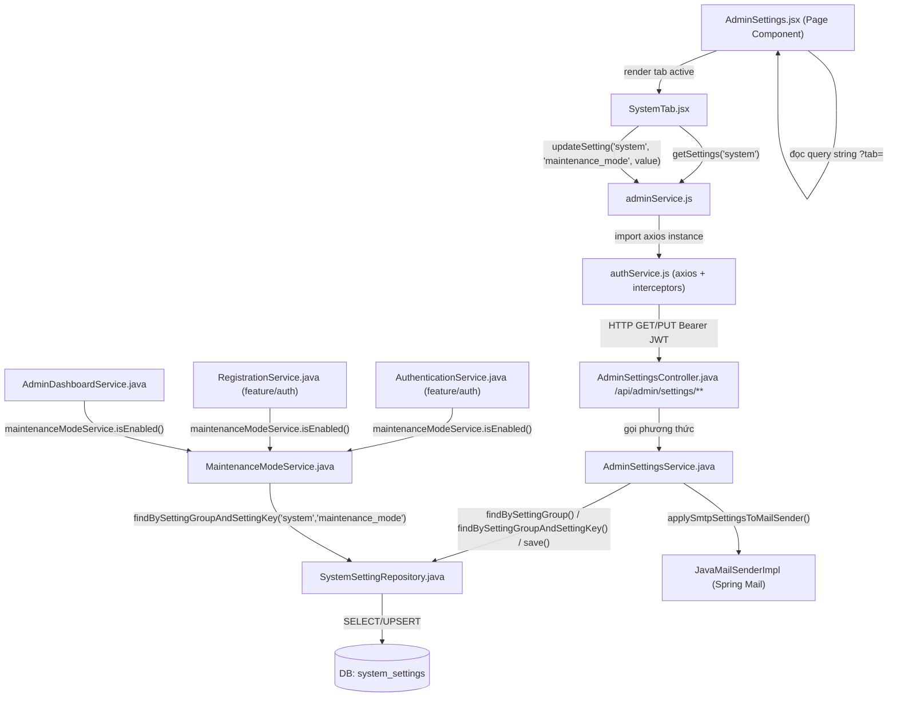
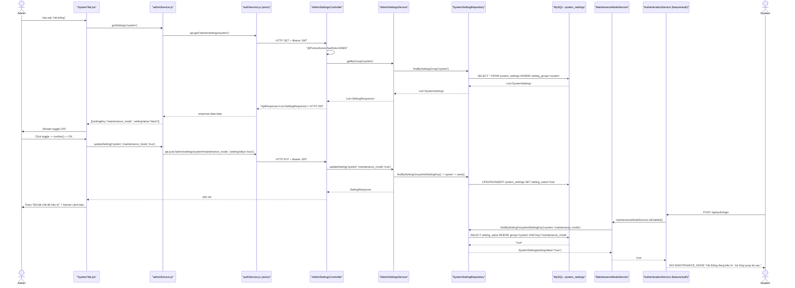

# Phân Tích Feature: admin-system (Cài Đặt Hệ Thống & Chế Độ Bảo Trì - Admin)

> **Tác giả phân tích:** AI Senior Software Architect
> **Ngày phân tích:** 2026-07-22
> **Phạm vi:** UC-39 (Settings/Cài đặt hệ thống) — cụ thể là nhóm cài đặt **`system`** (site info, chế độ bảo trì) và cơ chế `MaintenanceModeService` gắn với nó. Không bao gồm 3 nhóm cài đặt anh em `email`/`security`/`auto_notification` (dùng chung API `AdminSettingsController` nhưng là tab UI + business rule riêng — xem mục 8).
> **Nguồn:** Đọc trực tiếp source code trong workspace

---

## 1. Tóm Tắt Tổng Quan

Feature **admin-system** (tên use case trong SRS: **UC-39 — Settings**) cho phép Admin cấu hình các tham số vận hành cốt lõi của nền tảng, và đặc biệt là **bật/tắt Chế độ bảo trì (Maintenance Mode)** — một cờ toàn hệ thống chặn Student đăng nhập/đăng ký khi được bật. Feature trải dài trên **3 tầng**:

| Tầng | Mô tả |
|------|-------|
| **Frontend (React)** | Trang `AdminSettings.jsx` (khung tab) → tab `SystemTab.jsx` (toggle bảo trì) → gọi `adminService.js` |
| **Backend (Spring Boot)** | `AdminSettingsController` nhận request → `AdminSettingsService` xử lý (validate group, upsert key/value) → `SystemSettingRepository` đọc/ghi DB. Cờ bảo trì được các feature khác (Auth, Dashboard) đọc lại qua `MaintenanceModeService` |
| **Database (MySQL)** | Bảng `system_settings` — lưu mọi cặp `(setting_group, setting_key) → setting_value` dưới dạng key-value, dùng chung cho cả 4 nhóm cài đặt (`system`, `smtp`, `security`, `auto_notification`, ...) |

**Entry point** của feature là route `/admin/settings?tab=system` (frontend) → gọi tới endpoint `GET/PUT /api/admin/settings/system` (backend). Đây là **1 trong 4 tab con** của trang Cài Đặt Hệ Thống (`AdminSettings.jsx`); 3 tab còn lại (`email`, `security`, `notification`) dùng chung Controller/Service nhưng thuộc nhóm cài đặt khác, nằm ngoài phạm vi phân tích này.

Điểm đặc biệt của feature này so với các feature admin khác: nó không dừng ở CRUD dữ liệu nội bộ, mà **phát tín hiệu (cờ `maintenance_mode`) sang các feature khác** — cụ thể là chặn `AuthenticationService.handleStudentLogin()`, `AuthenticationService.loginWithGoogle()` và `RegistrationService.register()` (đều thuộc feature `auth`), đồng thời hiển thị `systemStatus` trên Admin Dashboard (`AdminDashboardService`).

Use case được cover:
- **UC-39**: Cài đặt hệ thống (site info, SMTP, security, trạng thái hệ thống) — phạm vi phân tích chỉ đi sâu vào phần **trạng thái hệ thống / chế độ bảo trì**.

---

## 2. Bản Đồ Cấu Trúc (Các "Mảnh" Và Vai Trò)

### 2.1 Frontend

| File | Vai trò | Loại |
|------|---------|------|
| [AdminSettings.jsx](/apps/frontend/src/pages/admin/AdminSettings.jsx) | Trang khung: quản lý tab đang active qua query string `?tab=`, render đúng 1 trong 4 tab con | Page Component |
| [SystemTab.jsx](/apps/frontend/src/components/admin/settings/SystemTab.jsx) | Tab "Hệ thống": load giá trị `maintenance_mode` hiện tại, hiển thị toggle switch, xác nhận trước khi bật/tắt | Component |
| [adminService.js](/apps/frontend/src/api/adminService.js) | Tầng giao tiếp HTTP: `getSettings(group)`, `updateSetting(group, key, value)`, `updateSettings(group, settings)`, `testSmtp(payload)` | API Service |
| [authService.js](/apps/frontend/src/api/authService.js) | Axios instance (đính Bearer token, auto-refresh 401) — được `adminService.js` import (đã phân tích chi tiết ở `feat-student-management_feature_analysis.md`) | Axios Config / Auth |
| [App.jsx](/apps/frontend/src/App.jsx) | Khai báo route `/admin/settings` → `AdminSettings.jsx`, bọc trong `AdminRoute` (guard role ADMIN phía client) | Router Config |
| [AdminTopNav.jsx](/apps/frontend/src/components/layout/AdminTopNav.jsx) | Thanh điều hướng admin, có mục "Cài đặt" trỏ route `/admin/settings` | Component (Nav) |
| [DashboardQuickActions.jsx](/apps/frontend/src/components/admin/DashboardQuickActions.jsx) | Các nút truy cập nhanh trên Dashboard, có nút trỏ thẳng `/admin/settings?tab=system` | Component |

### 2.2 Backend

| File | Vai trò | Loại |
|------|---------|------|
| [AdminSettingsController.java](/apps/backend/src/main/java/com/jlpt/feature/admin/AdminSettingsController.java) | Nhận HTTP request (`GET/PUT /api/admin/settings/**`, `POST /smtp/test`), ủy quyền cho Service | Controller |
| [AdminSettingsService.java](/apps/backend/src/main/java/com/jlpt/feature/admin/AdminSettingsService.java) | Business logic: validate `group` hợp lệ, upsert setting, ẩn giá trị password, test kết nối SMTP, tự áp SMTP settings vào `JavaMailSenderImpl` khi khởi động (`@PostConstruct`) | Service |
| [SystemSetting.java](/apps/backend/src/main/java/com/jlpt/feature/admin/SystemSetting.java) | Entity JPA bảng `system_settings` — cặp `(settingGroup, settingKey) → settingValue`, kèm `valueType`, `isEditable`, `updatedBy`, `updatedAt` | Entity |
| [SystemSettingRepository.java](/apps/backend/src/main/java/com/jlpt/feature/admin/SystemSettingRepository.java) | Truy vấn DB: `findBySettingGroup`, `findBySettingGroupAndSettingKey`, `existsBySettingGroupAndSettingKey` | Repository |
| [ValueTypeConverter.java](/apps/backend/src/main/java/com/jlpt/feature/admin/ValueTypeConverter.java) | JPA `AttributeConverter` chuyển đổi enum `ValueType` (STRING/INTEGER/BOOLEAN/TIME) ↔ chuỗi lưu DB | Converter |
| [MaintenanceModeService.java](/apps/backend/src/main/java/com/jlpt/feature/admin/MaintenanceModeService.java) | Đọc cờ `system.maintenance_mode` từ DB, expose `isEnabled()` cho các feature khác dùng | Service (đọc-only, dùng xuyên feature) |
| [UpdateSettingRequest.java](/apps/backend/src/main/java/com/jlpt/feature/admin/dto/request/UpdateSettingRequest.java) | DTO nhận giá trị 1 setting (`settingValue`, `@NotNull`, `@Size(max=20000)`) | DTO Request |
| [UpdateSettingsBatchRequest.java](/apps/backend/src/main/java/com/jlpt/feature/admin/dto/request/UpdateSettingsBatchRequest.java) | DTO nhận nhiều setting cùng nhóm trong 1 request (atomic) — dùng cho tab Email/Security | DTO Request |
| [SmtpTestRequest.java](/apps/backend/src/main/java/com/jlpt/feature/admin/dto/request/SmtpTestRequest.java) | DTO nhận cấu hình SMTP tạm thời để test (host/port/username/password/secure) | DTO Request |
| [SettingResponse.java](/apps/backend/src/main/java/com/jlpt/feature/admin/dto/response/SettingResponse.java) | DTO trả về `(settingKey, settingValue, valueType)` | DTO Response |
| [AuthenticationService.java](/apps/backend/src/main/java/com/jlpt/feature/auth/AuthenticationService.java) | **Bên tiêu thụ** cờ bảo trì: chặn `handleStudentLogin()` và `loginWithGoogle()` nếu đang bảo trì | Service (feature khác) |
| [RegistrationService.java](/apps/backend/src/main/java/com/jlpt/feature/auth/RegistrationService.java) | **Bên tiêu thụ** cờ bảo trì: chặn `register()` nếu đang bảo trì | Service (feature khác) |
| [AdminDashboardService.java](/apps/backend/src/main/java/com/jlpt/feature/admin/AdminDashboardService.java) | **Bên tiêu thụ** cờ bảo trì: hiển thị `systemStatus = "MAINTENANCE"/"OK"` trên dashboard | Service (feature khác) |

---

## 3. Bản Đồ Kết Nối (Ai Gọi Ai, Dữ Liệu Truyền Qua Đâu)

### 3.1 Diagram Mermaid — Architecture Overview



### 3.2 Bảng Kết Nối Chi Tiết

| Từ (File A) | Đến (File B) | Cách kết nối | Dữ liệu truyền |
|-------------|--------------|--------------|----------------|
| `AdminSettings.jsx` | `SystemTab.jsx` | React render con (điều kiện `activeTab === 'system'`) | props `{ addToast }` |
| `SystemTab.jsx` | `adminService.js` | import function `getSettings`, `updateSetting` | `group="system"`, `key="maintenance_mode"`, `value: "true"/"false"` |
| `adminService.js` | `authService.js` | `import api from './authService'` | axios instance với interceptor JWT |
| `authService.js` | `AdminSettingsController` | HTTP + `Bearer <JWT>` | Path params `{group}`, `{key}` / JSON body `{ settingValue }` |
| `AdminSettingsController` | `AdminSettingsService` | Spring DI `@RequiredArgsConstructor` | `group`, `key`, `value` (string) |
| `AdminSettingsService` | `SystemSettingRepository` | Spring DI | `settingGroup`, `settingKey`, `SystemSetting` entity |
| `AdminSettingsService` | `JavaMailSenderImpl` | Spring DI (chỉ khi `group == "smtp"`) | host/port/username/password/secure |
| `MaintenanceModeService` | `SystemSettingRepository` | Spring DI | `group="system"`, `key="maintenance_mode"` |
| `AuthenticationService` / `RegistrationService` / `AdminDashboardService` | `MaintenanceModeService` | Spring DI, gọi `isEnabled()` | `boolean` (true/false) |

---

## 4. Luồng Xử Lý Theo Trình Tự

### 4.1 Luồng UC-39 (nhánh System): Xem Trạng Thái Bảo Trì Khi Vào Trang

**Bước 1:** Admin click "Cài đặt" trên `AdminTopNav.jsx` hoặc nút quick-action trên Dashboard → điều hướng tới `/admin/settings?tab=system`.

**Bước 2:** `AdminSettings.jsx` đọc query string (dòng 25: `getTab()`), set `activeTab = 'system'` → render `<SystemTab addToast={addToast} />`.

**Bước 3:** `useEffect` trong `SystemTab.jsx` (dòng 10–20) fire ngay khi mount, gọi `getSettings('system')` từ `adminService.js`.

**Bước 4:** `adminService.js` hàm `getSettings` (dòng 83–86) gọi `api.get('/admin/settings/system')`.

**Bước 5:** `authService.js` request interceptor đính header `Authorization: Bearer <accessToken>` (đã phân tích chi tiết ở feature quản lý người dùng).

**Bước 6:** Request tới `AdminSettingsController.getByGroup()` (dòng 31–35), class-level `@PreAuthorize("hasRole('ADMIN')")` chặn mọi request không phải Admin.

**Bước 7:** `AdminSettingsService.getByGroup()` (dòng 30–47): validate `group` nằm trong `ALLOWED_GROUPS`, gọi `settingRepository.findBySettingGroup("system")`, map từng `SystemSetting` sang `SettingResponse` (ẩn giá trị nếu key chứa `"password"`).

**Bước 8:** Backend trả JSON `{ status: 200, data: [ {settingKey: "maintenance_mode", settingValue: "false", valueType: "boolean"}, ... ] }`.

**Bước 9:** `SystemTab.jsx` tìm phần tử có `settingKey === 'maintenance_mode'` (dòng 13–16), set state `maintenance = (val === 'true')` → render toggle switch đúng trạng thái hiện tại.

---

### 4.2 Luồng UC-39 (nhánh System): Bật/Tắt Chế Độ Bảo Trì

**Bước 1:** Admin click vào toggle switch → `handleToggle()` được gọi (`SystemTab.jsx` dòng 22–38).

**Bước 2:** `window.confirm(msg)` hiện hộp thoại xác nhận — nội dung khác nhau tùy đang bật hay tắt (dòng 24–27). Nếu Admin bấm Cancel → dừng lại, không gọi API.

**Bước 3:** Nếu xác nhận, `setSaving(true)`, gọi `updateSetting('system', 'maintenance_mode', String(next))` (`next` là boolean đảo ngược trạng thái hiện tại).

**Bước 4:** `adminService.js` hàm `updateSetting` (dòng 88–91) gọi `PUT /api/admin/settings/system/maintenance_mode` với body `{ settingValue: "true" }`.

**Bước 5:** `AdminSettingsController.updateSetting()` (dòng 38–43) nhận `@PathVariable group, key` + `@Valid @RequestBody UpdateSettingRequest`, gọi `settingsService.updateSetting(group, key, request.getSettingValue())`.

**Bước 6:** `AdminSettingsService.updateSetting()` (dòng 49–54) → gọi `validateGroup()` rồi `upsert()`.

**Bước 7:** `upsert()` (dòng 77–108): tìm `SystemSetting` theo `(group, key)` — nếu chưa có thì tạo mới với `valueType = STRING`; kiểm tra `isEditable` (ném 403 nếu bị khóa); set `settingValue = "true"`; lưu vào DB.

**Bước 8:** Backend trả `SettingResponse { settingKey: "maintenance_mode", settingValue: "true", valueType: "boolean" }`.

**Bước 9:** `SystemTab.jsx` cập nhật state `maintenance = true`, hiện banner cảnh báo, gọi `addToast('success', 'Đã bật chế độ bảo trì')`, `setSaving(false)`.

**Bước 10 (bất kỳ lúc nào sau đó):** Khi Student thử đăng nhập → `AuthenticationService.handleStudentLogin()` (dòng 216–218) gọi `maintenanceModeService.isEnabled()` → đọc lại đúng dòng `system_settings` vừa cập nhật → ném `BusinessException(503, "MAINTENANCE_MODE", ...)` nếu đang bật.

---

### 4.3 Sequence Diagram Tổng Hợp



---

## 5. Vai Trò Từng Đoạn Code Quan Trọng

### 5.1 `AdminSettingsController.java` — Entry Point + Security Guard

**File:** [AdminSettingsController.java](/apps/backend/src/main/java/com/jlpt/feature/admin/AdminSettingsController.java) | Dòng 22–43

```java
@RestController
@RequestMapping("/api/admin/settings")
@RequiredArgsConstructor
@PreAuthorize("hasRole('ADMIN')") // Chặn mọi role khác ngay từ tầng Controller, trước khi vào Service
public class AdminSettingsController {

    private final AdminSettingsService settingsService;

    /** GET /api/admin/settings/{group} — lấy tất cả setting của một nhóm. */
    @GetMapping("/{group}")
    public ResponseEntity<ApiResponse<List<SettingResponse>>> getByGroup(@PathVariable String group) {
        List<SettingResponse> data = settingsService.getByGroup(group);
        return ResponseEntity.ok(ApiResponse.success("Lấy cài đặt thành công", data));
    }

    /** PUT /api/admin/settings/{group}/{key} — cập nhật giá trị một setting. */
    @PutMapping("/{group}/{key}")
    public ResponseEntity<ApiResponse<SettingResponse>> updateSetting(
            @PathVariable String group, @PathVariable String key, @Valid @RequestBody UpdateSettingRequest request) {
        // Toàn bộ business rule (group hợp lệ? key có bị khóa?) nằm ở Service — Controller chỉ chuyển tiếp
        SettingResponse data = settingsService.updateSetting(group, key, request.getSettingValue());
        return ResponseEntity.ok(ApiResponse.success("Đã cập nhật cài đặt thành công", data));
    }
}
```

> **Giải thích:** `@PreAuthorize` ở class-level là lớp bảo vệ đầu tiên — cùng một pattern đã thấy ở `AdminController` (feature quản lý người dùng). Điểm khác biệt của controller này: nó dùng **1 endpoint tổng quát cho mọi "nhóm" cài đặt** (`{group}` là path variable, không phải route riêng cho từng nhóm) — nghĩa là logic phân biệt "đây có phải nhóm system không" hoàn toàn nằm ở tầng Service, Controller không biết gì về ý nghĩa nghiệp vụ của `group`.

---

### 5.2 `AdminSettingsService.java` — Validate Group + Upsert (Cơ Chế Cốt Lõi)

**File:** [AdminSettingsService.java](/apps/backend/src/main/java/com/jlpt/feature/admin/AdminSettingsService.java) | Dòng 22–23, 77–108

```java
// Whitelist cứng — chặn Admin gửi group tùy ý (path variable tự do, không enum ở tầng HTTP)
private static final Set<String> ALLOWED_GROUPS = Set.of(
        "general", "system", "smtp", "security", "auto_notification", "email_register", "email_otp", "email_reset");

private SettingResponse upsert(String group, String key, String value) {
    // Tìm setting đã tồn tại; nếu chưa có (lần đầu ghi key này) thì tạo record mới với type mặc định STRING
    SystemSetting setting = settingRepository
            .findBySettingGroupAndSettingKey(group, key)
            .orElseGet(() -> SystemSetting.builder()
                    .settingGroup(group)
                    .settingKey(key)
                    .valueType(SystemSetting.ValueType.STRING)
                    .build());

    // Cờ isEditable cho phép "khóa cứng" một setting qua DB (vd: seed data), không cho sửa qua UI dù đã qua validate group
    if (Boolean.FALSE.equals(setting.getIsEditable())) {
        throw new BusinessException(403, "SETTING_LOCKED", "Cài đặt này không được phép chỉnh sửa");
    }

    if (isPassword(key) && "********".equals(value)) {
        // FE gửi lại y nguyên chuỗi mask "********" khi user không đổi field password → bỏ qua, giữ giá trị cũ trong DB
    } else {
        setting.setSettingValue(value);
    }

    settingRepository.save(setting); // JPA tự quyết định INSERT hay UPDATE dựa trên @Id đã có hay chưa
    ...
}
```

> **Giải thích:** Đây là **điểm kỹ thuật quan trọng nhất** của feature — một hàm `upsert()` duy nhất phục vụ mọi nhóm cài đặt (system/smtp/security/...), tránh lặp code CRUD cho từng nhóm. Với nhóm `system.maintenance_mode`, luồng luôn đi qua nhánh `else` (không phải password) nên giá trị `"true"/"false"` được ghi thẳng. Cơ chế mask `"********"` chỉ có ý nghĩa với nhóm `smtp` (password mail server) — nhánh `admin-system` (system) không dùng tới nhưng dùng chung code path.

---

### 5.3 `MaintenanceModeService.java` — Điểm Tích Hợp Xuyên Feature

**File:** [MaintenanceModeService.java](/apps/backend/src/main/java/com/jlpt/feature/admin/MaintenanceModeService.java) | Dòng 8–26

```java
/** Đọc cờ bảo trì hệ thống (settings group=system, key=maintenance_mode). */
@Service
@RequiredArgsConstructor
public class MaintenanceModeService {

    private static final String GROUP = "system";
    private static final String KEY = "maintenance_mode";

    private final SystemSettingRepository systemSettingRepository;

    /** true nếu admin đang bật chế độ bảo trì. */
    @Transactional(readOnly = true)
    public boolean isEnabled() {
        return systemSettingRepository
                .findBySettingGroupAndSettingKey(GROUP, KEY)
                // So sánh string "true" (không phải cast Boolean) vì setting_value lưu dạng NVARCHAR trong DB
                .map(s -> "true".equalsIgnoreCase(s.getSettingValue()))
                .orElse(false); // Không tìm thấy record (chưa từng bật) → mặc định KHÔNG bảo trì
    }
}
```

> **Giải thích:** Class nhỏ nhất trong feature nhưng có **phạm vi ảnh hưởng lớn nhất** — nó được 3 service của 2 feature khác (`AuthenticationService`, `RegistrationService` ở `feature/auth`, và `AdminDashboardService`) inject và gọi trực tiếp. Không có cache: mỗi lần gọi là 1 query DB mới → đảm bảo cờ bảo trì có hiệu lực **ngay lập tức** sau khi Admin bật, không cần đợi restart hay TTL cache hết hạn — đánh đổi lấy 1 query nhỏ cho mỗi lần login/register.

---

### 5.4 `AuthenticationService.java` — Nơi Cờ Bảo Trì Chặn Đăng Nhập Student

**File:** [AuthenticationService.java](/apps/backend/src/main/java/com/jlpt/feature/auth/AuthenticationService.java) | Dòng 215–221

```java
private LoginApiResponse handleStudentLogin(StudentUser user, String rawPassword, String ip) {
    // Check đầu tiên, trước cả kiểm tra mật khẩu/khóa tài khoản — bảo trì thì chặn tất cả, không lộ thêm thông tin tài khoản
    if (maintenanceModeService.isEnabled()) {
        throw new BusinessException(503, "MAINTENANCE_MODE", "Hệ thống đang bảo trì. Vui lòng quay lại sau.");
    }
    if (user.getLockedUntil() != null && user.getLockedUntil().isAfter(LocalDateTime.now())) {
        throw new BusinessException(429, "TOO_MANY_REQUESTS", "Quá nhiều lần thử. Vui lòng thử lại sau.");
    }
    ...
```

> **Giải thích:** Check `maintenanceModeService.isEnabled()` được đặt **trước** mọi check khác (khóa tài khoản, sai mật khẩu) — thứ tự này quan trọng: nếu đặt sau, một Student bị khóa vẫn có thể phân biệt được "tài khoản tôi bị khóa" và "hệ thống đang bảo trì" qua thông báo lỗi khác nhau, trong khi ý đồ thiết kế là **chặn toàn bộ Student đồng loạt** khi bảo trì, bất kể trạng thái tài khoản. `loginStaff()` (Staff/Admin) **không** có check này — đúng như mô tả trên UI (`SystemTab.jsx` dòng 45–46: "Staff và Admin vẫn truy cập bình thường").

---

### 5.5 `SystemTab.jsx` — Toggle Với Xác Nhận Trước Khi Ghi

**File:** [SystemTab.jsx](/apps/frontend/src/components/admin/settings/SystemTab.jsx) | Dòng 22–38

```jsx
async function handleToggle() {
  const next = !maintenance; // Đảo ngược trạng thái hiện tại — component tự tính, không chờ round-trip mới biết next là gì
  const msg  = next
    ? 'Bạn có chắc muốn BẬT chế độ bảo trì? Học viên sẽ không thể đăng nhập.'
    : 'Bạn có chắc muốn TẮT chế độ bảo trì?';
  if (!window.confirm(msg)) return; // Hành động có tác động lớn (chặn toàn bộ Student) → bắt buộc xác nhận
  setSaving(true);
  try {
    await updateSetting('system', 'maintenance_mode', String(next)); // boolean -> string "true"/"false" trước khi gửi
    setMaintenance(next); // Optimistic-ish: chỉ update UI SAU KHI API thành công, không update trước
    addToast('success', next ? 'Đã bật chế độ bảo trì' : 'Đã tắt chế độ bảo trì');
  } catch {
    addToast('error', 'Cập nhật thất bại. Thử lại sau.'); // Giữ nguyên state cũ nếu API lỗi — không đổi UI nhầm
  } finally {
    setSaving(false);
  }
}
```

> **Giải thích:** Khác với các form cài đặt thông thường (nhập liệu rồi bấm Lưu), đây là **toggle tức thời** — mỗi click gọi API ngay, không có bước "Lưu" riêng. Vì tác động của việc bật bảo trì rất lớn (chặn toàn bộ Student), component bắt buộc `window.confirm()` chặn đứng thao tác nhầm. State `maintenance` chỉ đổi **sau** khi API trả về thành công (dòng `setMaintenance(next)` nằm trong `try`, sau `await`), tránh tình trạng UI hiển thị sai nếu request thất bại.

---

## 6. Dữ Liệu Di Chuyển Như Thế Nào

Theo dõi dữ liệu **cờ bảo trì** xuyên suốt 2 luồng: (a) Admin ghi cờ, (b) Student bị chặn bởi cờ.

### 6.1 Hướng đi xuống — Admin bật bảo trì (Frontend → Backend → DB)

```
[SystemTab.jsx]
  handleToggle(): maintenance=false → next=true
        ↓
[adminService.js] → updateSetting("system", "maintenance_mode", "true")
  HTTP PUT /api/admin/settings/system/maintenance_mode
  Header: Authorization: Bearer eyJ...
  Body:   { "settingValue": "true" }
        ↓
[AdminSettingsController.java] → @PathVariable group="system", key="maintenance_mode"
  @RequestBody UpdateSettingRequest { settingValue: "true" }
  @Valid → @NotNull, @Size(max=20000)
  settingsService.updateSetting("system", "maintenance_mode", "true")
        ↓
[AdminSettingsService.java]
  validateGroup("system") → OK (nằm trong ALLOWED_GROUPS)
  upsert(): tìm SystemSetting(group=system, key=maintenance_mode)
    → nếu có: setSettingValue("true")
    → nếu chưa có: tạo mới với valueType=STRING, settingValue="true"
        ↓
[DB: system_settings] → UPDATE (hoặc INSERT) SET setting_value='true', updated_at=NOW()
                         WHERE setting_group='system' AND setting_key='maintenance_mode'
```

### 6.2 Hướng đi lên — Phản hồi cho Admin (DB → Backend → Frontend)

```
[AdminSettingsService.java] → SettingResponse:
  { settingKey: "maintenance_mode", settingValue: "true", valueType: "boolean" }
        ↓
[AdminSettingsController.java] → ApiResponse.success("Đã cập nhật cài đặt thành công", response)
  HTTP 200: { "status":200, "message":"Đã cập nhật...", "data":{ settingKey:"maintenance_mode", settingValue:"true", ... } }
        ↓
[adminService.js] → return res.data.data
        ↓
[SystemTab.jsx] → setMaintenance(true) → toggle chuyển sang "BẬT", banner cảnh báo hiện ra
  addToast('success', 'Đã bật chế độ bảo trì')
```

### 6.3 Hướng đọc lại — Student bị chặn (DB → Backend → Response lỗi)

```
[Student] → POST /api/auth/login { email, password }
        ↓
[AuthenticationService.handleStudentLogin()]
  maintenanceModeService.isEnabled()
        ↓
[MaintenanceModeService.java]
  systemSettingRepository.findBySettingGroupAndSettingKey("system", "maintenance_mode")
        ↓
[DB: system_settings] → SELECT setting_value WHERE setting_group='system' AND setting_key='maintenance_mode'
                         → trả về "true"
        ↓
[MaintenanceModeService.java] → "true".equalsIgnoreCase("true") → return true
        ↓
[AuthenticationService.java] → throw BusinessException(503, "MAINTENANCE_MODE",
                                  "Hệ thống đang bảo trì. Vui lòng quay lại sau.")
        ↓
[Global Exception Handler] → HTTP 503 { status:503, message:"Hệ thống đang bảo trì...", data:null }
        ↓
[Frontend Login Page] → hiển thị lỗi "Hệ thống đang bảo trì. Vui lòng quay lại sau." cho Student
```

### 6.4 Biến đổi kiểu dữ liệu qua từng tầng

| Tầng | Tên field | Kiểu dữ liệu | Giá trị ví dụ |
|------|-----------|-------------|---------------|
| Frontend state | `maintenance` (SystemTab.jsx) | `boolean` | `true` |
| HTTP request body | `settingValue` | `string` (JSON) | `"true"` |
| Controller | `UpdateSettingRequest.settingValue` | `String` | `"true"` |
| Entity | `SystemSetting.settingValue` | `String` (map sang `NVARCHAR(MAX)`) | `"true"` |
| DB column | `system_settings.setting_value` | `NVARCHAR(MAX)` | `'true'` |
| Đọc lại (MaintenanceModeService) | so sánh string | `boolean` (kết quả `equalsIgnoreCase`) | `true` |
| DTO response | `SettingResponse.settingValue` | `String` | `"true"` |
| Frontend render | `maintenance` | `boolean` | `true` → toggle "BẬT" + banner đỏ |

**Lưu ý kỹ thuật quan trọng:** cờ bảo trì **không có kiểu Boolean thật** ở tầng DB/Entity — nó là `String` được so sánh bằng `equalsIgnoreCase("true")` ở mọi nơi đọc lại. `valueType = BOOLEAN` trong enum `SystemSetting.ValueType` chỉ mang tính mô tả (dùng để FE biết render input gì), **không** được dùng để ép kiểu hay validate giá trị thực tế khi ghi/đọc.

---

## 7. Bảng Tra Cứu Tổng Hợp

| Bước | File | Function/Method | Kết nối tới | Dữ liệu | Ghi chú |
|------|------|------------------|-------------|---------|---------|
| Đọc | `SystemTab.jsx:10` | `useEffect` → `getSettings('system')` | `adminService.js` | `group="system"` | Fire khi mount |
| Đọc | `adminService.js:83` | `getSettings()` | `GET /admin/settings/{group}` | — | |
| Đọc | `AdminSettingsController.java:31` | `getByGroup()` | `AdminSettingsService` | `group` | `@PreAuthorize ADMIN` |
| Đọc | `AdminSettingsService.java:32` | `getByGroup()` | `SystemSettingRepository` | `group` | Ẩn value nếu key chứa "password" |
| Đọc | `SystemTab.jsx:13` | `.find(s => s.settingKey === 'maintenance_mode')` | — | `settingValue` | Parse `"true"` → `boolean` |
| Ghi | `SystemTab.jsx:22` | `handleToggle()` | `adminService.updateSetting()` | `next: boolean` | `window.confirm()` trước |
| Ghi | `adminService.js:88` | `updateSetting()` | `PUT /admin/settings/{group}/{key}` | `{settingValue}` | |
| Ghi | `AdminSettingsController.java:38` | `updateSetting()` | `AdminSettingsService` | `UpdateSettingRequest` | `@Valid` |
| Ghi | `AdminSettingsService.java:50` | `updateSetting()` → `upsert()` | `SystemSettingRepository` | `SystemSetting` entity | Check `isEditable` → 403 nếu khóa |
| Tiêu thụ | `MaintenanceModeService.java:20` | `isEnabled()` | `SystemSettingRepository` | `boolean` | Không cache, query mỗi lần gọi |
| Tiêu thụ | `AuthenticationService.java:216` | `handleStudentLogin()` | `MaintenanceModeService` | — | Ném `503 MAINTENANCE_MODE` |
| Tiêu thụ | `AuthenticationService.java:309` | `loginWithGoogle()` | `MaintenanceModeService` | — | Cùng cơ chế check |
| Tiêu thụ | `RegistrationService.java:52` | `register()` | `MaintenanceModeService` | — | Chặn Student đăng ký mới khi bảo trì |
| Tiêu thụ | `AdminDashboardService.java:78` | `resolveSystemStatus()` | `MaintenanceModeService` | `"MAINTENANCE"`/`"OK"` | Hiển thị trên Dashboard, không chặn gì |
| Test SMTP | `AdminSettingsController.java:54` | `testSmtp()` | `AdminSettingsService.testSmtpConnection()` | `SmtpTestRequest` | Ngoài phạm vi "system" nhưng cùng Controller |

---

## 8. Các Mục Cần Bổ Sung Context

1. **Phạm vi hẹp có chủ đích** — Theo yêu cầu, phân tích này chỉ đi sâu vào nhóm cài đặt `system` (đặc biệt là `maintenance_mode`). 3 nhóm cài đặt anh em dùng chung `AdminSettingsController`/`AdminSettingsService` nhưng có business logic/UI riêng, **chưa được phân tích chi tiết** ở đây:
   - `smtp` + `email_register`/`email_otp`/`email_reset` — tab `EmailTab.jsx` (429 dòng, chưa đọc chi tiết ngoài các hàm `testSmtpConnection()`/`applySmtpSettingsToMailSender()` đã trích ở mục 5).
   - `security` — tab `SecurityTab.jsx` (155 dòng, chưa đọc).
   - `auto_notification` — tab `NotificationTab.jsx` (341 dòng) — **lưu ý:** qua khảo sát, tab này thực chất gọi `NotificationRuleService`/`AdminNotificationRuleController` (package `shared.notification`, UC-40) chứ **không** đi qua `AdminSettingsService`/`SystemSetting` như 3 nhóm còn lại — đây là 1 feature độc lập (Notification Rules), dễ nhầm là cùng nhóm vì cùng nằm trên trang `AdminSettings.jsx`.

2. **Danh sách đầy đủ các key thuộc group `system`** — Source code (`SystemTab.jsx`) chỉ cho thấy 1 key duy nhất được UI sử dụng: `maintenance_mode`. Theo mô tả UC-39 trong SRS (`docs/01-SRS-Requirements/use-cases/Bao_cao_dac_ta_Use_Case.md`, dòng 893–899), nhóm `system` còn dự kiến chứa: tên nền tảng, logo, ngôn ngữ hiển thị mặc định, giới hạn đăng nhập sai tối đa, session timeout, bật/tắt đăng ký tự do — **nhưng không tìm thấy code UI/BE nào xử lý các key này** ở nhóm `system` cụ thể. Có thể các cài đặt đó đã được cài cứng (hardcode) ở nơi khác trong hệ thống, hoặc chưa được implement — cần xác nhận thêm.

3. **Giá trị seed / dữ liệu khởi tạo của `system_settings`** — Chưa đọc migration Flyway (`db/migration/`) để xác nhận dòng `(system, maintenance_mode)` có được insert sẵn giá trị mặc định `"false"` hay không, hay hoàn toàn phụ thuộc vào nhánh `orElse(false)` trong `MaintenanceModeService` khi record chưa tồn tại.

4. **`isEditable` — ai set giá trị này?** — Cờ `SystemSetting.isEditable` (dùng để khóa 1 setting khỏi bị sửa qua UI, ném `403 SETTING_LOCKED`) không có đường ghi nào trong `AdminSettingsService`/`AdminSettingsController` đã đọc (Controller/Service hiện tại chỉ đọc và validate cờ này, không có endpoint để set nó thành `false`). Có thể được set trực tiếp qua migration SQL hoặc thao tác DB thủ công — chưa xác nhận được từ source code đã đọc.

5. **`AdminAuditLog` — thao tác bật/tắt bảo trì có được ghi audit log không?** — Khác với các thao tác ở feature quản lý người dùng (`suspendUser`, `softDeleteUser`, ...) đều gọi `auditLog(...)` sau khi ghi, hàm `upsert()` trong `AdminSettingsService` **không** thấy gọi `AdminAuditLogRepository` hay tương đương. Nghĩa là việc Admin bật/tắt chế độ bảo trì — một hành động có tác động toàn hệ thống — **hiện không để lại vết audit log** theo source code đã đọc. Đây có thể là một khoảng trống cần lưu ý (không phải bug về mặt chức năng, nhưng đáng cân nhắc bổ sung).

6. **Spring Security Config chi tiết** — Tương tự các phân tích feature admin khác, chưa đọc `apps/backend/src/main/java/com/jlpt/shared/security/` để xác nhận cách `hasRole('ADMIN')` được wire với JWT filter.
