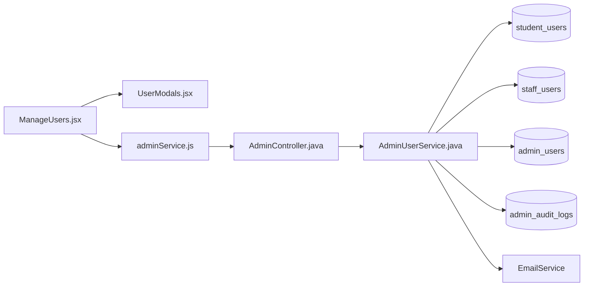
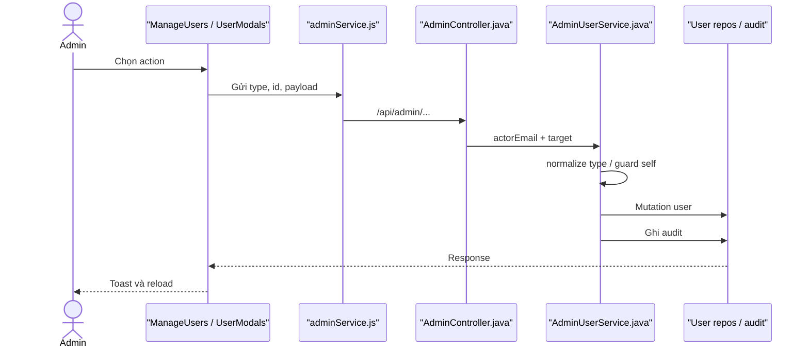

# User Management Feature Analysis

## 1. Tóm tắt tổng quan

User Management là luồng Admin dùng chung cho Student, Staff và Admin: list/detail/update, tạo Staff, reset password, soft delete/restore và đổi Staff role. Suspend/Activate được mô tả riêng. Mọi API nằm dưới `/api/admin/**`, yêu cầu ROLE_ADMIN và các mutation quan trọng ghi audit.

## 2. Bản đồ cấu trúc

| File | Vai trò | Loại |
|---|---|---|
| [ManageUsers.jsx](apps/frontend/src/features/management/admin/ManageUsers.jsx) | Điều phối tab, filter và action | React Page |
| [UserModals.jsx](apps/frontend/src/features/management/components/admin/UserModals.jsx) | Form/xác nhận mutation | Component |
| [adminService.js](apps/frontend/src/shared/api/adminService.js) | Toàn bộ Admin User API | API Service |
| [AdminController.java](apps/backend/src/main/java/com/jlpt/feature/admin/AdminController.java) | User management endpoints | Controller |
| [AdminUserService.java](apps/backend/src/main/java/com/jlpt/feature/admin/AdminUserService.java) | Business rules và mapping | Service |
| [StudentUserRepository.java](apps/backend/src/main/java/com/jlpt/feature/student/StudentUserRepository.java) | Student persistence | Repository |
| [StaffUserRepository.java](apps/backend/src/main/java/com/jlpt/feature/staff/StaffUserRepository.java) | Staff persistence | Repository |
| [AdminUserRepository.java](apps/backend/src/main/java/com/jlpt/feature/admin/AdminUserRepository.java) | Admin persistence | Repository |
| [AdminAuditLogRepository.java](apps/backend/src/main/java/com/jlpt/feature/admin/AdminAuditLogRepository.java) | Audit mutation | Repository |

## 3. Bản đồ kết nối



| Từ | Đến | Cách kết nối | Dữ liệu |
|---|---|---|---|
| UI | modal | props/callback | action/form |
| UI | adminService | async function | userType/id/payload |
| Controller | service | method | principal + target |
| Service | repositories | switch by type | entity |
| Service | audit/email | save/send | action/reset link |

## 4. Luồng xử lý theo trình tự

1. Admin chọn tab loại user và tải danh sách.
2. Các action mở modal tương ứng.
3. `adminService` gọi endpoint create/update/reset/delete/restore/role.
4. Controller lấy `authentication.getName()` cho mutation cần actor.
5. Service normalize type, chặn hành động tự sửa nguy hiểm và thao tác repository tương ứng.
6. Delete là soft delete, restore đổi trạng thái trở lại.
7. Mutation ghi `AdminAuditLog`; reset password còn tạo token và gửi email.



## 5. Vai trò đoạn code quan trọng

[adminService.js#L40](apps/frontend/src/shared/api/adminService.js#L40)

```js
export async function softDeleteUser(type, userId) {
  // Endpoint DELETE thực hiện soft delete trong service, không xóa vật lý bản ghi.
  const res = await api.delete(`/admin/users/${type}/${userId}`);
  return res.data.data;
}

export async function restoreUser(type, userId) {
  // Restore là mutation riêng để khôi phục trạng thái account.
  const res = await api.post(`/admin/users/${type}/${userId}/restore`);
  return res.data.data;
}
```

[AdminUserService.java#L611](apps/backend/src/main/java/com/jlpt/feature/admin/AdminUserService.java#L611)

```java
private String normalizeType(String type) {
    // Chuẩn hóa discriminator trước mọi switch repository.
    if (type == null) throw new BadRequestException("Loại người dùng không hợp lệ");
    return type.trim().toLowerCase();
}
```

## 6. Dữ liệu di chuyển

Modal payload + user type/id → Controller + Admin principal → service guard → entity mutation → audit/email side effect → response DTO → toast/reload.

## 7. Bảng tra cứu tổng hợp

| Bước | File | Function | Kết nối tới | Dữ liệu | Ghi chú |
|---:|---|---|---|---|---|
| 1 | ManageUsers | action handler | Modal | user/action | UI |
| 2 | adminService | API functions | Controller | type/id/body | HTTP |
| 3 | Controller | endpoints | Service | actor + target | Admin only |
| 4 | Service | `normalizeType` | correct repo | discriminator | Guard |
| 5 | Service | mutation | audit/email | outcome | Side effects |

## 8. Các mục cần bổ sung context

- Frontend hiện dùng cùng trang cho ba loại tài khoản; chi tiết Student-only nằm trong tài liệu riêng.
- Không mở rộng DTO của từng mutation để giữ phạm vi dưới 15 file.

<!-- BACKEND-METHOD-INVENTORY:START -->

## Phụ lục — Danh mục đầy đủ hàm backend

> Phần này được đối chiếu trực tiếp từ source backend hiện tại. Chỉ liệt kê các hàm khai báo tường minh trong những file Java mà tài liệu này tham chiếu; các hàm do Lombok/JPA sinh tự động không xuất hiện trong source nên không liệt kê.

### `AdminAuditLogRepository`

Nguồn: [AdminAuditLogRepository.java](../../../apps/backend/src/main/java/com/jlpt/feature/admin/AdminAuditLogRepository.java)

| # | Hàm backend (đầy đủ chữ ký) | Endpoint | Tác dụng/chức năng phục vụ |
|---:|---|---|---|
| 1 | [`Optional<AdminAuditLog> findFirstByTargetIdAndTargetTableAndActionInOrderByCreatedAtDesc(Long targetId, String targetTable, List<String> actions)`](../../../apps/backend/src/main/java/com/jlpt/feature/admin/AdminAuditLogRepository.java#L28) | `—` | Đọc hoặc tra cứu dữ liệu phục vụ `find first by target id and target table and action in order by created at desc`. |

### `AdminController`

Nguồn: [AdminController.java](../../../apps/backend/src/main/java/com/jlpt/feature/admin/AdminController.java)

| # | Hàm backend (đầy đủ chữ ký) | Endpoint | Tác dụng/chức năng phục vụ |
|---:|---|---|---|
| 1 | [`ResponseEntity<ApiResponse<Object>> getUserDetail(@PathVariable String type, @PathVariable Long userId)`](../../../apps/backend/src/main/java/com/jlpt/feature/admin/AdminController.java#L73) | `GET /users/{type}/{userId}` | Xử lý endpoint `GET /users/{type}/{userId}`; thực hiện nghiệp vụ `get user detail`. |
| 2 | [`ResponseEntity<ApiResponse<CreateStaffResponse>> createStaff(Authentication auth, @Valid @RequestBody CreateStaffRequest request)`](../../../apps/backend/src/main/java/com/jlpt/feature/admin/AdminController.java#L81) | `POST /staff` | Xử lý endpoint `POST /staff`; thực hiện nghiệp vụ `create staff`. |
| 3 | [`ResponseEntity<ApiResponse<Object>> updateStudent(Authentication auth, @PathVariable Long userId, @Valid @RequestBody UpdateStudentRequest request)`](../../../apps/backend/src/main/java/com/jlpt/feature/admin/AdminController.java#L91) | `PUT /users/student/{userId}` | Xử lý endpoint `PUT /users/student/{userId}`; thực hiện nghiệp vụ `update student`. |
| 4 | [`ResponseEntity<ApiResponse<Object>> updateStaff(Authentication auth, @PathVariable Long userId, @Valid @RequestBody UpdateStaffInfoRequest request)`](../../../apps/backend/src/main/java/com/jlpt/feature/admin/AdminController.java#L98) | `PUT /users/staff/{userId}` | Xử lý endpoint `PUT /users/staff/{userId}`; thực hiện nghiệp vụ `update staff`. |
| 5 | [`ResponseEntity<ApiResponse<SuspendUserResponse>> suspendUser(Authentication auth, @PathVariable String type, @PathVariable Long userId, @Valid @RequestBody SuspendUserRequest request)`](../../../apps/backend/src/main/java/com/jlpt/feature/admin/AdminController.java#L107) | `POST /users/{type}/{userId}/suspend` | Xử lý endpoint `POST /users/{type}/{userId}/suspend`; thực hiện nghiệp vụ `suspend user`. |
| 6 | [`ResponseEntity<ApiResponse<ActivateUserResponse>> activateUser(Authentication auth, @PathVariable String type, @PathVariable Long userId)`](../../../apps/backend/src/main/java/com/jlpt/feature/admin/AdminController.java#L119) | `POST /users/{type}/{userId}/activate` | Xử lý endpoint `POST /users/{type}/{userId}/activate`; thực hiện nghiệp vụ `activate user`. |
| 7 | [`ResponseEntity<ApiResponse<Void>> resetPassword(Authentication auth, @PathVariable String type, @PathVariable Long userId)`](../../../apps/backend/src/main/java/com/jlpt/feature/admin/AdminController.java#L128) | `POST /users/{type}/{userId}/reset-password` | Xử lý endpoint `POST /users/{type}/{userId}/reset-password`; thực hiện nghiệp vụ `reset password`. |
| 8 | [`ResponseEntity<ApiResponse<IssueTempPasswordResponse>> issueTempPassword(Authentication auth, @PathVariable Long staffId, @Valid @RequestBody IssueTempPasswordRequest request)`](../../../apps/backend/src/main/java/com/jlpt/feature/admin/AdminController.java#L144) | `POST /staff/{staffId}/issue-temp-password` | Xử lý endpoint `POST /staff/{staffId}/issue-temp-password`; thực hiện nghiệp vụ `issue temp password`. |
| 9 | [`ResponseEntity<ApiResponse<SoftDeleteUserResponse>> softDeleteUser(Authentication auth, @PathVariable String type, @PathVariable Long userId)`](../../../apps/backend/src/main/java/com/jlpt/feature/admin/AdminController.java#L153) | `DELETE /users/{type}/{userId}` | Xử lý endpoint `DELETE /users/{type}/{userId}`; thực hiện nghiệp vụ `soft delete user`. |
| 10 | [`ResponseEntity<ApiResponse<RestoreUserResponse>> restoreUser(Authentication auth, @PathVariable String type, @PathVariable Long userId)`](../../../apps/backend/src/main/java/com/jlpt/feature/admin/AdminController.java#L162) | `POST /users/{type}/{userId}/restore` | Xử lý endpoint `POST /users/{type}/{userId}/restore`; thực hiện nghiệp vụ `restore user`. |
| 11 | [`ResponseEntity<ApiResponse<ChangeStaffRoleResponse>> changeStaffRole(Authentication auth, @PathVariable Long staffId, @Valid @RequestBody ChangeStaffRoleRequest request)`](../../../apps/backend/src/main/java/com/jlpt/feature/admin/AdminController.java#L171) | `PUT /staff/{staffId}/role` | Xử lý endpoint `PUT /staff/{staffId}/role`; thực hiện nghiệp vụ `change staff role`. |

### `AdminUserRepository`

Nguồn: [AdminUserRepository.java](../../../apps/backend/src/main/java/com/jlpt/feature/admin/AdminUserRepository.java)

| # | Hàm backend (đầy đủ chữ ký) | Endpoint | Tác dụng/chức năng phục vụ |
|---:|---|---|---|
| 1 | [`Optional<AdminUser> findByEmail(String email)`](../../../apps/backend/src/main/java/com/jlpt/feature/admin/AdminUserRepository.java#L15) | `—` | Đọc hoặc tra cứu dữ liệu phục vụ `find by email`. |
| 2 | [`boolean existsByEmail(String email)`](../../../apps/backend/src/main/java/com/jlpt/feature/admin/AdminUserRepository.java#L17) | `—` | Kiểm tra điều kiện/trạng thái phục vụ `exists by email`. |

### `AdminUserService`

Nguồn: [AdminUserService.java](../../../apps/backend/src/main/java/com/jlpt/feature/admin/AdminUserService.java)

| # | Hàm backend (đầy đủ chữ ký) | Endpoint | Tác dụng/chức năng phục vụ |
|---:|---|---|---|
| 1 | [`Page<UserSummaryResponse> listUsers(String type, String q, String status, String jlptLevel, String staffRole, int page, int size)`](../../../apps/backend/src/main/java/com/jlpt/feature/admin/AdminUserService.java#L62) | `—` | Đọc hoặc tra cứu dữ liệu phục vụ `list users`. |
| 2 | [`Object getUserDetail(String type, Long userId)`](../../../apps/backend/src/main/java/com/jlpt/feature/admin/AdminUserService.java#L93) | `—` | Đọc hoặc tra cứu dữ liệu phục vụ `get user detail`. |
| 3 | [`yield toStudentDetail(s)`](../../../apps/backend/src/main/java/com/jlpt/feature/admin/AdminUserService.java#L100) | `—` | Biến đổi/tổng hợp dữ liệu nội bộ cho `to student detail`. |
| 4 | [`yield toStaffDetail(st)`](../../../apps/backend/src/main/java/com/jlpt/feature/admin/AdminUserService.java#L106) | `—` | Biến đổi/tổng hợp dữ liệu nội bộ cho `to staff detail`. |
| 5 | [`yield toAdminDetail(a)`](../../../apps/backend/src/main/java/com/jlpt/feature/admin/AdminUserService.java#L112) | `—` | Biến đổi/tổng hợp dữ liệu nội bộ cho `to admin detail`. |
| 6 | [`CreateStaffResponse createStaff(String adminEmail, CreateStaffRequest request)`](../../../apps/backend/src/main/java/com/jlpt/feature/admin/AdminUserService.java#L120) | `—` | Tạo hoặc ghi dữ liệu cho nghiệp vụ `create staff`. |
| 7 | [`void setupStaffPassword(com.jlpt.feature.staff.dto.request.StaffSetupPasswordRequest request)`](../../../apps/backend/src/main/java/com/jlpt/feature/admin/AdminUserService.java#L166) | `—` | Thực hiện xử lý backend `setup staff password` trong `AdminUserService`. |
| 8 | [`Object updateUser(String adminEmail, String type, Long userId, Object request)`](../../../apps/backend/src/main/java/com/jlpt/feature/admin/AdminUserService.java#L208) | `—` | Cập nhật trạng thái/dữ liệu cho nghiệp vụ `update user`. |
| 9 | [`yield toStudentDetail(s)`](../../../apps/backend/src/main/java/com/jlpt/feature/admin/AdminUserService.java#L237) | `—` | Biến đổi/tổng hợp dữ liệu nội bộ cho `to student detail`. |
| 10 | [`yield toStaffDetail(st)`](../../../apps/backend/src/main/java/com/jlpt/feature/admin/AdminUserService.java#L249) | `—` | Biến đổi/tổng hợp dữ liệu nội bộ cho `to staff detail`. |
| 11 | [`SuspendUserResponse suspendUser(String adminEmail, String type, Long userId, SuspendUserRequest request)`](../../../apps/backend/src/main/java/com/jlpt/feature/admin/AdminUserService.java#L259) | `—` | Cập nhật trạng thái/dữ liệu cho nghiệp vụ `suspend user`. |
| 12 | [`ActivateUserResponse activateUser(String adminEmail, String type, Long userId)`](../../../apps/backend/src/main/java/com/jlpt/feature/admin/AdminUserService.java#L336) | `—` | Cập nhật trạng thái/dữ liệu cho nghiệp vụ `activate user`. |
| 13 | [`void resetPassword(String adminEmail, String type, Long userId)`](../../../apps/backend/src/main/java/com/jlpt/feature/admin/AdminUserService.java#L403) | `—` | Thực hiện xử lý backend `reset password` trong `AdminUserService`. |
| 14 | [`SoftDeleteUserResponse softDeleteUser(String adminEmail, String type, Long userId)`](../../../apps/backend/src/main/java/com/jlpt/feature/admin/AdminUserService.java#L476) | `—` | Thực hiện xử lý backend `soft delete user` trong `AdminUserService`. |
| 15 | [`RestoreUserResponse restoreUser(String adminEmail, String type, Long userId)`](../../../apps/backend/src/main/java/com/jlpt/feature/admin/AdminUserService.java#L527) | `—` | Thực hiện xử lý backend `restore user` trong `AdminUserService`. |
| 16 | [`ChangeStaffRoleResponse changeStaffRole(String adminEmail, Long staffId, ChangeStaffRoleRequest request)`](../../../apps/backend/src/main/java/com/jlpt/feature/admin/AdminUserService.java#L575) | `—` | Cập nhật trạng thái/dữ liệu cho nghiệp vụ `change staff role`. |
| 17 | [`String normalizeType(String type)`](../../../apps/backend/src/main/java/com/jlpt/feature/admin/AdminUserService.java#L611) | `—` | Thực hiện xử lý backend `normalize type` trong `AdminUserService`. |
| 18 | [`AdminUser resolveAdmin(String email)`](../../../apps/backend/src/main/java/com/jlpt/feature/admin/AdminUserService.java#L616) | `—` | Biến đổi/tổng hợp dữ liệu nội bộ cho `resolve admin`. |
| 19 | [`void checkSelfModification(Long actorAdminId, String type, Long targetId)`](../../../apps/backend/src/main/java/com/jlpt/feature/admin/AdminUserService.java#L623) | `—` | Kiểm tra điều kiện/trạng thái phục vụ `check self modification`. |
| 20 | [`void auditLog(AdminUser actor, String action, String targetTable, Long targetId, String description)`](../../../apps/backend/src/main/java/com/jlpt/feature/admin/AdminUserService.java#L629) | `—` | Thực hiện xử lý backend `audit log` trong `AdminUserService`. |
| 21 | [`String generateUrlSafeToken(int bytes)`](../../../apps/backend/src/main/java/com/jlpt/feature/admin/AdminUserService.java#L639) | `—` | Thực hiện xử lý backend `generate url safe token` trong `AdminUserService`. |
| 22 | [`UserSummaryResponse toStudentSummary(StudentUser s)`](../../../apps/backend/src/main/java/com/jlpt/feature/admin/AdminUserService.java#L647) | `—` | Biến đổi/tổng hợp dữ liệu nội bộ cho `to student summary`. |
| 23 | [`UserSummaryResponse toStaffSummary(StaffUser st)`](../../../apps/backend/src/main/java/com/jlpt/feature/admin/AdminUserService.java#L663) | `—` | Biến đổi/tổng hợp dữ liệu nội bộ cho `to staff summary`. |
| 24 | [`UserSummaryResponse toAdminSummary(AdminUser a)`](../../../apps/backend/src/main/java/com/jlpt/feature/admin/AdminUserService.java#L675) | `—` | Biến đổi/tổng hợp dữ liệu nội bộ cho `to admin summary`. |
| 25 | [`StudentDetailResponse toStudentDetail(StudentUser s)`](../../../apps/backend/src/main/java/com/jlpt/feature/admin/AdminUserService.java#L686) | `—` | Biến đổi/tổng hợp dữ liệu nội bộ cho `to student detail`. |
| 26 | [`StaffDetailResponse toStaffDetail(StaffUser st)`](../../../apps/backend/src/main/java/com/jlpt/feature/admin/AdminUserService.java#L708) | `—` | Biến đổi/tổng hợp dữ liệu nội bộ cho `to staff detail`. |
| 27 | [`AdminDetailResponse toAdminDetail(AdminUser a)`](../../../apps/backend/src/main/java/com/jlpt/feature/admin/AdminUserService.java#L721) | `—` | Biến đổi/tổng hợp dữ liệu nội bộ cho `to admin detail`. |

### `StaffUserRepository`

Nguồn: [StaffUserRepository.java](../../../apps/backend/src/main/java/com/jlpt/feature/staff/StaffUserRepository.java)

| # | Hàm backend (đầy đủ chữ ký) | Endpoint | Tác dụng/chức năng phục vụ |
|---:|---|---|---|
| 1 | [`Optional<StaffUser> findByEmail(String email)`](../../../apps/backend/src/main/java/com/jlpt/feature/staff/StaffUserRepository.java#L15) | `—` | Đọc hoặc tra cứu dữ liệu phục vụ `find by email`. |
| 2 | [`boolean existsByEmail(String email)`](../../../apps/backend/src/main/java/com/jlpt/feature/staff/StaffUserRepository.java#L17) | `—` | Kiểm tra điều kiện/trạng thái phục vụ `exists by email`. |

### `StudentUserRepository`

Nguồn: [StudentUserRepository.java](../../../apps/backend/src/main/java/com/jlpt/feature/student/StudentUserRepository.java)

| # | Hàm backend (đầy đủ chữ ký) | Endpoint | Tác dụng/chức năng phục vụ |
|---:|---|---|---|
| 1 | [`Optional<StudentUser> findByEmail(String email)`](../../../apps/backend/src/main/java/com/jlpt/feature/student/StudentUserRepository.java#L15) | `—` | Đọc hoặc tra cứu dữ liệu phục vụ `find by email`. |
| 2 | [`boolean existsByEmail(String email)`](../../../apps/backend/src/main/java/com/jlpt/feature/student/StudentUserRepository.java#L17) | `—` | Kiểm tra điều kiện/trạng thái phục vụ `exists by email`. |

**Tổng cộng:** `45` hàm backend trong `6` file Java được tham chiếu.

<!-- BACKEND-METHOD-INVENTORY:END -->
