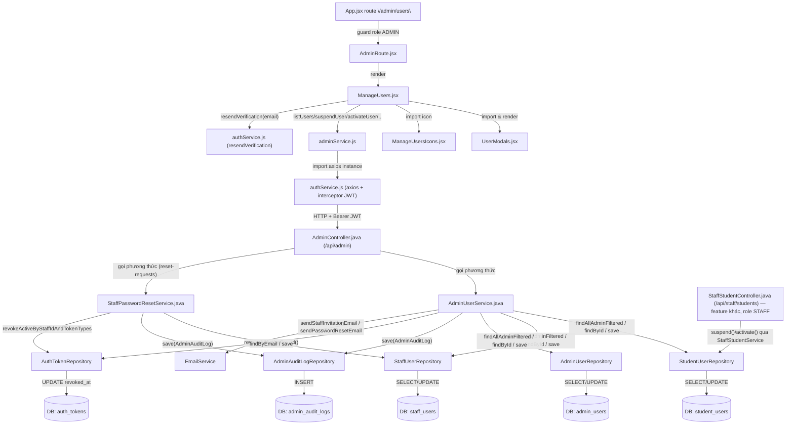
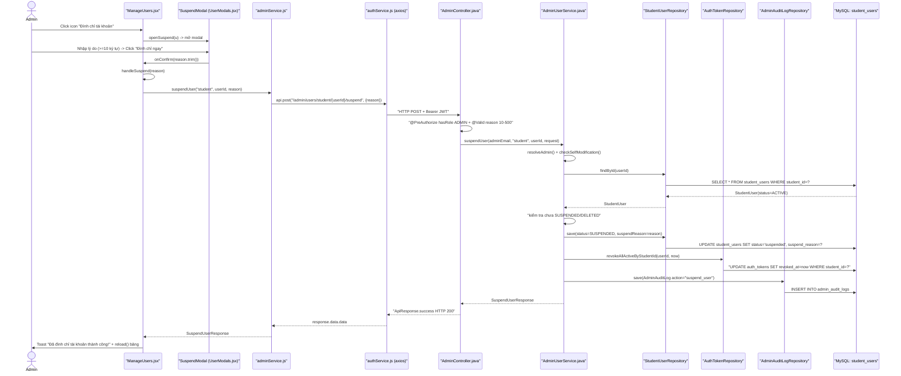

# Phân Tích Feature: admin-user-management (Quản Lý Người Dùng — Admin)

> **Tác giả phân tích:** AI Senior Software Architect
> **Ngày phân tích:** 2026-07-27
> **Phạm vi:** UC-37 — trang **"Admin Manage Users Page"** (`/admin/users`), màn hình quản lý người dùng cấp cao nhất, gộp chung cả 3 loại tài khoản (Student / Staff / Admin) trên cùng 1 giao diện. Panel "Yêu cầu đặt lại mật khẩu nhân viên" nhúng trên cùng trang (tab Staff) cũng được phân tích vì nó dùng chung endpoint `/api/admin/**` và chung `AdminController`, dù thuộc một use case con khác (staff tự yêu cầu quên mật khẩu).
> **Không bao gồm**: `AdminDashboardController`/`AdminDashboardService` (UC-36 Dashboard), `AdminSettingsController` (UC-39 Settings — đã có `admin-system-feature-analysis.md`), `AdminAuditLogController` (xem log), `AdminNotificationRuleController`, `MaintenanceModeService`, `DebugController` — tất cả đều nằm trong package `com.jlpt.feature.admin` nhưng không được `AdminController`/`AdminUserService` gọi tới, nên nằm ngoài phạm vi tài liệu này.
> **Nguồn:** Đọc trực tiếp source code trong workspace.

---

## 1. Tóm Tắt Tổng Quan

Feature **admin-user-management** (UC-37) là màn hình quản lý người dùng "toàn hệ thống" dành riêng cho vai trò **Admin** — cho phép xem danh sách, tìm kiếm/lọc, xem chi tiết, tạo mới (Staff), đình chỉ, kích hoạt lại, đặt lại mật khẩu, xóa mềm, khôi phục và đổi vai trò cho **cả 3 loại tài khoản**: Student, Staff, Admin, trên cùng một giao diện bảng có tab chuyển đổi loại (`student` / `staff` / `admin`). Feature trải dài trên 3 tầng:

| Tầng | Mô tả |
|------|-------|
| **Frontend (React)** | Trang [ManageUsers.jsx](../../../apps/frontend/src/pages/admin/ManageUsers.jsx) (bảng + tab + filter + phân trang) → các modal xác nhận trong [UserModals.jsx](../../../apps/frontend/src/components/admin/UserModals.jsx) → gọi hàm trong [adminService.js](../../../apps/frontend/src/api/adminService.js) |
| **Backend (Spring Boot)** | [AdminController.java](../../../apps/backend/src/main/java/com/jlpt/feature/admin/AdminController.java) (`@RequestMapping("/api/admin")`, `@PreAuthorize("hasRole('ADMIN')")`) → [AdminUserService.java](../../../apps/backend/src/main/java/com/jlpt/feature/admin/AdminUserService.java) xử lý business logic, phân nhánh theo `type` |
| **Database (MySQL)** | **3 bảng riêng biệt** tương ứng 3 entity riêng biệt: `student_users`, `staff_users`, `admin_users` — **không có bảng `users` chung**. Ngoài ra ghi vết vào `admin_audit_logs` cho mọi thao tác thay đổi trạng thái |

**Entry point**: route `/admin/users` (khai báo tại [App.jsx](../../../apps/frontend/src/App.jsx) dòng 140) bọc trong [AdminRoute.jsx](../../../apps/frontend/src/components/common/AdminRoute.jsx) (chặn phía client nếu `user.role !== 'ADMIN'`) → gọi tới `GET /api/admin/users?type=...` và các endpoint hành động khác dưới `/api/admin/users/{type}/{userId}/...`.

**Đã xác minh qua source code**: `AdminUserService` inject **3 repository riêng biệt** — [StudentUserRepository](../../../apps/backend/src/main/java/com/jlpt/feature/student/StudentUserRepository.java), [StaffUserRepository](../../../apps/backend/src/main/java/com/jlpt/feature/staff/StaffUserRepository.java), [AdminUserRepository](../../../apps/backend/src/main/java/com/jlpt/feature/admin/AdminUserRepository.java) — và một khối `switch (normalizedType) { case "student" -> ...; case "staff" -> ...; case "admin" -> ...; }` lặp lại ở mọi thao tác (`listUsers`, `getUserDetail`, `suspendUser`, `activateUser`, `resetPassword`, `softDeleteUser`, `restoreUser`). Không có bảng `users` hợp nhất và không có polymorphism/kế thừa entity — mỗi loại tài khoản là một entity JPA độc lập, hoàn toàn tách biệt.

### Phân biệt quan trọng: Admin Manage Users (UC-37) vs Staff Students Page (`StaffStudentController`)

Đây là **2 feature kiến trúc riêng biệt** nhưng có **giao nhau ở tầng dữ liệu** đối với tài khoản Student:

- **Cùng chạm vào cùng một dòng dữ liệu (student_users)**: Khi Admin bấm "Đình chỉ" cho một Student trên trang `/admin/users`, code chạy là `AdminUserService.suspendUser()` (case `"student"`) — set `status = SUSPENDED` trên entity [StudentUser](../../../apps/backend/src/main/java/com/jlpt/feature/student/StudentUser.java) qua [StudentUserRepository](../../../apps/backend/src/main/java/com/jlpt/feature/student/StudentUserRepository.java). Khi Staff Manager bấm "Tạm khoá" trên trang Staff Students (`/api/staff/students/{id}/suspend`), code chạy là `StaffStudentService.suspend()` ([StaffStudentService.java](../../../apps/backend/src/main/java/com/jlpt/feature/staffcontent/student/StaffStudentService.java) dòng 123–139) — **cũng set `status = SUSPENDED` trên chính entity `StudentUser` đó, qua chính `StudentUserRepository` đó**, và cũng revoke token qua `authTokenRepository.revokeAllActiveByStudentId(...)`. Đây là **cùng một bảng, cùng một cột, cùng một cơ chế revoke token** — không phải 2 bản sao dữ liệu độc lập. Bằng chứng rõ nhất nằm ngay trong code: dòng 136 của `StaffStudentService.java` có comment `// Đình chỉ phải chấm dứt phiên đang hoạt động (parity với AdminUserService.suspendUser).` — tác giả code tự xác nhận đây là logic cố tình làm song song (parity) với `AdminUserService`.
- **Nhưng là 2 code path hoàn toàn độc lập, không dùng chung class nào**: Không có service hay controller chung. `AdminController` (`/api/admin`, `hasRole('ADMIN')`, package `com.jlpt.feature.admin`) và `StaffStudentController` ([StaffStudentController.java](../../../apps/backend/src/main/java/com/jlpt/feature/staffcontent/student/StaffStudentController.java), `/api/staff/students`, `hasRole('STAFF')`, package `com.jlpt.feature.staffcontent.student`) là 2 class riêng, gọi 2 service riêng (`AdminUserService` vs `StaffStudentService`), với 2 bộ quy tắc phân quyền khác nhau: Admin chỉ bị chặn tự-sửa-chính-mình (`checkSelfModification`, chỉ áp dụng cho `type == "admin"`); còn Staff phải qua `StaffManagerGuard.requireManager()` — **chỉ Staff có vai trò `staff_manager` mới được suspend/activate**, Staff thường (`staff`) bị chặn ngay từ tầng Service.
- **Phạm vi khác nhau**: Trang Admin quản lý **cả 3 loại** tài khoản (Student + Staff + Admin) trên 1 màn hình; trang Staff Students **chỉ bao giờ thấy Student** (đọc `StaffStudentController.java` xác nhận chỉ có 1 repository: `StudentUserRepository`) và có **ít thao tác hơn** (chỉ list/progress/suspend/activate — không có soft-delete, restore, reset-password, hay tạo tài khoản).
- **Hệ quả kiến trúc đáng lưu ý**: logic "đình chỉ Student" hiện bị **lặp lại (duplicate)** ở 2 service khác nhau thay vì dùng chung 1 hàm — rủi ro là nếu một bên sửa rule (VD: thêm điều kiện chặn) mà quên sửa bên kia, 2 đường suspend sẽ lệch hành vi dù cùng thao tác trên cùng 1 bảng. Đây là điểm nên lưu ý khi refactor (xem thêm mục 8).

Use case được cover: **UC-37** (toàn bộ 9 sub-use-case: UC-37-01 List users → UC-37-09 Change Staff role, dựa theo comment đánh số trong code).

---

## 2. Bản Đồ Cấu Trúc (Các "Mảnh" Và Vai Trò)

### 2.1 Frontend

| File | Vai trò | Loại |
|------|---------|------|
| [ManageUsers.jsx](../../../apps/frontend/src/pages/admin/ManageUsers.jsx) | Trang chính: quản lý tab loại tài khoản (`student`/`staff`/`admin`), search debounce, filter (status/JLPT level/staff role), phân trang, mở modal hành động, gọi API và render bảng | Page Component |
| [UserModals.jsx](../../../apps/frontend/src/components/admin/UserModals.jsx) | 4 modal: `ConfirmModal` (activate/reset-pass/delete/restore/resend-activation dùng chung 1 modal cấu hình theo `action`), `SuspendModal` (bắt buộc nhập lý do 10–500 ký tự), `CreateStaffModal` (validate tên + email), `ChangeStaffRoleModal` (radio chọn staff/staff_manager) | Component (Modal) |
| [ManageUsersIcons.jsx](../../../apps/frontend/src/components/admin/ManageUsersIcons.jsx) | Toàn bộ icon SVG dùng trong trang (stat card, action icon, tab icon) — thuần trình bày, không có logic nghiệp vụ | Component (Icon) |
| [adminService.js](../../../apps/frontend/src/api/adminService.js) | Tầng gọi HTTP cho UC-37: `listUsers`, `createStaff`, `suspendUser`, `activateUser`, `resetPassword`, `softDeleteUser`, `restoreUser`, `changeStaffRole`, `listStaffResetRequests`, `issueTempPassword` | API Service |
| [authService.js](../../../apps/frontend/src/api/authService.js) | Axios instance dùng chung (`api`) — đính `Authorization: Bearer <token>` ở request interceptor, tự refresh khi 401; cũng export `resendVerification()` dùng cho action "Gửi lại email kích hoạt" | Axios Config / API Service |
| [App.jsx](../../../apps/frontend/src/App.jsx) | Khai báo route `/admin/users` (dòng 140) → `ManageUsers.jsx`, bọc trong `AdminRoute` | Router Config |
| [AdminRoute.jsx](../../../apps/frontend/src/components/common/AdminRoute.jsx) | Route guard phía client: chưa đăng nhập → `/login`; đăng nhập nhưng `role !== 'ADMIN'` → `/dashboard` | Route Guard Component |
| `AdminTopNav.jsx`, `AdminPageHeader.jsx`, `StatCard.jsx`, `Badges.jsx`, `UserAvatar.jsx`, `Pagination.jsx`, `EmptyState.jsx`, `SkeletonRow.jsx`, `Toast.jsx`, `SakuChan.jsx`, `AppIcons.jsx` | Các component UI dùng chung (không riêng cho feature này) — nhập từ `components/layout` và `components/common` | Component (dùng chung, ngoài phạm vi phân tích chi tiết) |

### 2.2 Backend

| File | Vai trò | Loại |
|------|---------|------|
| [AdminController.java](../../../apps/backend/src/main/java/com/jlpt/feature/admin/AdminController.java) | Entry point REST cho toàn bộ UC-37: `@RequestMapping("/api/admin")`, `@PreAuthorize("hasRole('ADMIN')")` ở class-level; expose `GET /users`, `GET /users/{type}/{userId}`, `POST /staff`, `PUT /users/student|staff/{userId}`, `POST /users/{type}/{userId}/suspend|activate|reset-password|restore`, `DELETE /users/{type}/{userId}`, `PUT /staff/{staffId}/role`, `GET /staff/reset-requests`, `POST /staff/{staffId}/issue-temp-password` | Controller |
| [AdminUserService.java](../../../apps/backend/src/main/java/com/jlpt/feature/admin/AdminUserService.java) | Toàn bộ business logic UC-37: switch theo `type` (`student`/`staff`/`admin`), validate trạng thái hợp lệ trước khi chuyển, chặn Admin tự sửa mình (`checkSelfModification`), revoke token khi suspend/delete, ghi audit log, gửi email (mời Staff, reset password) | Service |
| [StaffPasswordResetService.java](../../../apps/backend/src/main/java/com/jlpt/feature/staff/StaffPasswordResetService.java) | Xử lý luồng con "Staff quên mật khẩu → Admin duyệt → cấp mật khẩu tạm" hiển thị trên cùng trang (panel "Yêu cầu đặt lại mật khẩu nhân viên", chỉ hiện ở tab Staff) | Service |
| [StudentUser.java](../../../apps/backend/src/main/java/com/jlpt/feature/student/StudentUser.java) | Entity JPA bảng `student_users`; có `@SQLRestriction("status <> 'DELETED' and status <> 'deleted'")` — Hibernate tự ẩn user đã xóa mềm khỏi mọi query JPQL thông thường | Entity |
| [StudentUserRepository.java](../../../apps/backend/src/main/java/com/jlpt/feature/student/StudentUserRepository.java) | `findAllAdminFiltered()` (native SQL, bỏ qua `@SQLRestriction` để Admin thấy cả user đã xóa), `findByIdIncludingDeleted()` (native SQL, phục vụ restore) | Repository |
| [StaffUser.java](../../../apps/backend/src/main/java/com/jlpt/feature/staff/StaffUser.java) | Entity JPA bảng `staff_users`; cùng cơ chế `@SQLRestriction`; có thêm field `staffRole` (STAFF/STAFF_MANAGER) và `mustChangePassword` | Entity |
| [StaffUserRepository.java](../../../apps/backend/src/main/java/com/jlpt/feature/staff/StaffUserRepository.java) | Tương tự `StudentUserRepository` nhưng lọc thêm theo `staffRole` | Repository |
| [AdminUser.java](../../../apps/backend/src/main/java/com/jlpt/feature/admin/AdminUser.java) | Entity JPA bảng `admin_users`; cùng cơ chế `@SQLRestriction`; không có field JLPT/staffRole | Entity |
| [AdminUserRepository.java](../../../apps/backend/src/main/java/com/jlpt/feature/admin/AdminUserRepository.java) | `findAllAdminFiltered()` (native SQL); **không có** `findByIdIncludingDeleted` (vì Admin không cho soft-delete/restore tài khoản Admin qua UI này) | Repository |
| [AdminAuditLog.java](../../../apps/backend/src/main/java/com/jlpt/feature/admin/AdminAuditLog.java) | Entity JPA bảng `admin_audit_logs` — ghi `action`, `targetTable`, `targetId`, `description`, liên kết `ManyToOne` tới `AdminUser`/`StaffUser`/`StudentUser` actor | Entity |
| [AdminAuditLogRepository.java](../../../apps/backend/src/main/java/com/jlpt/feature/admin/AdminAuditLogRepository.java) | Ghi/đọc audit log (chỉ dùng `save()` trong phạm vi feature này; đọc log dùng ở `AdminAuditLogController` — ngoài phạm vi) | Repository |
| [AuthTokenRepository.java](../../../apps/backend/src/main/java/com/jlpt/feature/auth/AuthTokenRepository.java) | `revokeAllActiveByStudentId`/`revokeAllActiveByStaffId`/`revokeAllActiveByAdminId` — thu hồi mọi session đang hoạt động khi suspend/soft-delete | Repository |
| [SuspendUserRequest.java](../../../apps/backend/src/main/java/com/jlpt/feature/admin/dto/request/SuspendUserRequest.java) | DTO request: `reason` (`@NotBlank`, `@Size(min=10, max=500)`) | DTO Request |
| [CreateStaffRequest.java](../../../apps/backend/src/main/java/com/jlpt/feature/staff/dto/request/CreateStaffRequest.java) | DTO request tạo Staff: `fullName`, `email`, `staffRole` (`@Pattern` chỉ nhận `staff`/`staff_manager`) | DTO Request |
| [ChangeStaffRoleRequest.java](../../../apps/backend/src/main/java/com/jlpt/feature/staff/dto/request/ChangeStaffRoleRequest.java) | DTO request đổi role: `staffRole` (`@Pattern`) | DTO Request |
| [UserSummaryResponse.java](../../../apps/backend/src/main/java/com/jlpt/feature/admin/dto/response/UserSummaryResponse.java) | DTO dùng chung cho cả 3 loại user trong bảng danh sách (field nào không áp dụng thì `null`, ẩn nhờ `@JsonInclude(NON_NULL)`) | DTO Response |
| [SuspendUserResponse.java](../../../apps/backend/src/main/java/com/jlpt/feature/admin/dto/response/SuspendUserResponse.java), [ActivateUserResponse.java](../../../apps/backend/src/main/java/com/jlpt/feature/admin/dto/response/ActivateUserResponse.java), [SoftDeleteUserResponse.java](../../../apps/backend/src/main/java/com/jlpt/feature/admin/dto/response/SoftDeleteUserResponse.java), [RestoreUserResponse.java](../../../apps/backend/src/main/java/com/jlpt/feature/admin/dto/response/RestoreUserResponse.java) | DTO trả về cho từng hành động — cùng shape (`userId`, `userType`, `status`, timestamp riêng) | DTO Response |
| [AdminDetailResponse.java](../../../apps/backend/src/main/java/com/jlpt/feature/admin/dto/response/AdminDetailResponse.java) | DTO chi tiết 1 Admin (dùng ở `getUserDetail`) | DTO Response |
| [StaffStudentController.java](../../../apps/backend/src/main/java/com/jlpt/feature/staffcontent/student/StaffStudentController.java) + [StaffStudentService.java](../../../apps/backend/src/main/java/com/jlpt/feature/staffcontent/student/StaffStudentService.java) | **Feature khác** (Staff Students Page) — nêu ở đây chỉ để đối chiếu; chạm cùng entity `StudentUser`/bảng `student_users` khi suspend/activate (xem mục 1) | Controller + Service (feature khác) |

---

## 3. Bản Đồ Kết Nối (Ai Gọi Ai, Dữ Liệu Truyền Qua Đâu)

### 3.1 Diagram Mermaid — Component / Architecture Overview



### 3.2 Bảng Kết Nối Chi Tiết

| Từ (File A) | Đến (File B) | Cách kết nối | Dữ liệu truyền |
|-------------|--------------|--------------|-----------------|
| `App.jsx` | `AdminRoute.jsx` | JSX composition (`<AdminRoute><ManageUsers/></AdminRoute>`) | — |
| `ManageUsers.jsx` | `UserModals.jsx` | import component (`ConfirmModal`, `SuspendModal`, `CreateStaffModal`, `ChangeStaffRoleModal`) | props: `modal` state object, callback `onConfirm`/`onClose` |
| `ManageUsers.jsx` | `adminService.js` | import function, gọi trực tiếp trong `useEffect`/handler | params filter (`type`, `q`, `status`, `jlptLevel`, `staffRole`, `page`, `size`) hoặc `(type, userId, reason)` |
| `adminService.js` | `authService.js` | `import api from './authService'` | axios instance đã có interceptor JWT |
| `authService.js` (axios) | `AdminController.java` | HTTP `GET/POST/PUT/DELETE` + header `Authorization: Bearer <JWT>` | path `{type}`, `{userId}`; query params; JSON body (`{reason}`, `{fullName,email,staffRole}`, `{staffRole}`) |
| `AdminController.java` | `AdminUserService.java` | Spring DI (`@RequiredArgsConstructor`) | `type`, `userId`, DTO request đã qua `@Valid` |
| `AdminController.java` | `StaffPasswordResetService.java` | Spring DI | `status` (filter), `staffId`, `requestId` |
| `AdminUserService.java` | `StudentUserRepository` / `StaffUserRepository` / `AdminUserRepository` | Spring DI, chọn đúng repo theo `switch(type)` | `id`, filter string, entity cần `save()` |
| `AdminUserService.java` | `AdminAuditLogRepository` | Spring DI | `AdminAuditLog` entity (action, targetTable, targetId, description) |
| `AdminUserService.java` | `AuthTokenRepository` | Spring DI | `userId`, `LocalDateTime now` |
| `AdminUserService.java` | `EmailService` | Spring DI | email đích, token (invite/reset) |
| `StaffPasswordResetService.java` | `StaffUserRepository` | Spring DI | `staffId`, mật khẩu tạm (đã hash) |
| `StaffStudentController.java` (feature khác) | `StudentUserRepository` (qua `StaffStudentService`) | Spring DI — **cùng repository/entity** với `AdminUserService` khi thao tác trên Student | `studentId`, `reason` |

---

## 4. Luồng Xử Lý Theo Trình Tự

Chọn luồng tiêu biểu nhất và có đầy đủ các lớp kiến trúc: **UC-37-05 — Admin đình chỉ (suspend) một tài khoản Student**.

**Bước 1:** Admin đang ở tab "Học viên", bấm icon "Đình chỉ tài khoản" (`IcBan`) trên một dòng → `openSuspend(u)` (`ManageUsers.jsx` dòng 152) set state `suspendModal = { open: true, userId, userType: 'student', userName }`.

**Bước 2:** `SuspendModal` (`UserModals.jsx` dòng 44–73) hiện ra, bắt Admin nhập lý do vào `<textarea>`; validate phía client `len >= 10 && len <= 500` (dòng 48–50) mới cho bấm "Đình chỉ ngay".

**Bước 3:** Admin bấm xác nhận → gọi `onConfirm(reason.trim())` → trong `ManageUsers.jsx`, `handleSuspend(reason)` (dòng 157–167) được gọi, set `isSubmitting = true`.

**Bước 4:** `handleSuspend` gọi `suspendUser(suspendModal.userType, suspendModal.userId, reason)` từ `adminService.js` (dòng 22–25) → gửi `POST /api/admin/users/student/{userId}/suspend` với body `{ reason }`.

**Bước 5:** Axios request interceptor trong `authService.js` (dòng 24–31) tự động đính `Authorization: Bearer <accessToken>` lấy từ `localStorage`.

**Bước 6:** Request tới `AdminController.suspendUser()` (`AdminController.java` dòng 107–115). `@PreAuthorize("hasRole('ADMIN')")` ở class-level đã chặn từ trước; `@Valid @RequestBody SuspendUserRequest request` validate `reason` phải 10–500 ký tự (400 nếu sai) → gọi `adminUserService.suspendUser(auth.getName(), "student", userId, request)`.

**Bước 7:** `AdminUserService.suspendUser()` (dòng 259–332): gọi `resolveAdmin(adminEmail)` để lấy `AdminUser` đang thao tác → `checkSelfModification()` (không áp dụng vì `type != "admin"`) → nhánh `case "student"`: tìm `StudentUser` qua `studentUserRepository.findById(userId)` (404 nếu không có), kiểm tra chưa `SUSPENDED`/`DELETED` (409 nếu đã ở trạng thái đó), set `status = SUSPENDED`, `suspendReason = reason`, `save()`.

**Bước 8:** Ngay sau khi lưu, gọi `authTokenRepository.revokeAllActiveByStudentId(userId, now)` — thu hồi mọi refresh/session token đang hoạt động của Student này, đảm bảo họ bị đăng xuất ngay cả khi đang có phiên mở.

**Bước 9:** Ghi audit log: `auditLog(actor, "suspend_user", "student_users", userId, request.getReason())` → `AdminAuditLogRepository.save()` → `INSERT INTO admin_audit_logs`.

**Bước 10:** `AdminUserService` trả về `SuspendUserResponse{userId, userType:"student", status:"suspended", suspendReason, suspendedAt}` → `AdminController` bọc trong `ApiResponse.success("Đã đình chỉ tài khoản thành công", response)` → HTTP 200.

**Bước 11:** `adminService.suspendUser()` trả `res.data.data` về `handleSuspend` → `addToast('success', ...)`, đóng modal (`setSuspendModal(open:false)`), gọi `reload()` (dòng 134–141) → gọi lại `listUsers()` để refresh bảng với dữ liệu mới nhất (dòng `StatusBadge` sẽ hiển thị "Đình chỉ" cho dòng vừa sửa).

### Sequence Diagram



---

## 5. Vai Trò Từng Đoạn Code Quan Trọng

### 5.1 `ManageUsers.jsx` — Điểm bắt đầu hành động phía Frontend

**File:** [ManageUsers.jsx](../../../apps/frontend/src/pages/admin/ManageUsers.jsx) | Dòng 157–167

```jsx
async function handleSuspend(reason) {
  setSubmitting(true); // Khoá nút trong lúc gọi API, tránh double-submit
  try {
    // suspendModal đã lưu sẵn userType/userId khi Admin mở modal (openSuspend)
    await suspendUser(suspendModal.userType, suspendModal.userId, reason);
    addToast('success', 'Đã đình chỉ tài khoản thành công!');
    setSuspendModal((m) => ({ ...m, open: false })); // Đóng modal sau khi thành công
    reload(); // Gọi lại listUsers() để bảng phản ánh trạng thái mới ngay lập tức
  } catch (err) {
    // Ưu tiên message lỗi cụ thể từ backend (VD: "Tài khoản đã ở trạng thái này rồi")
    addToast('error', err?.response?.data?.message ?? 'Có lỗi xảy ra, vui lòng thử lại');
  } finally { setSubmitting(false); }
}
```

> **Giải thích:** Đây là nơi state UI (`reason` nhập từ modal) được chuyển thành 1 lệnh gọi API cụ thể. Không có xử lý nghiệp vụ nào ở đây ngoài quản lý trạng thái loading/toast — đúng nguyên tắc "Business Logic ở Backend" (tránh anti-pattern *Business Logic in Frontend*). Nhận dữ liệu từ `SuspendModal` (chuỗi `reason` đã `trim()`), đưa dữ liệu đi tới `adminService.suspendUser()`.

---

### 5.2 `adminService.js` — Tầng gọi HTTP

**File:** [adminService.js](../../../apps/frontend/src/api/adminService.js) | Dòng 21–25

```js
// ── UC-37-05: Suspend user ──────────────────────────────────────────────────
export async function suspendUser(type, userId, reason) {
  // type quyết định route path segment (student/staff/admin) -> BE dùng lại để switch entity
  const res = await api.post(`/admin/users/${type}/${userId}/suspend`, { reason });
  return res.data.data; // Bóc lớp ApiResponse{status,message,data} -> chỉ trả "data" thô cho FE
}
```

> **Giải thích:** `type` được truyền thẳng vào URL path — đây chính là "chìa khoá" giúp 1 API duy nhất phục vụ cả 3 loại tài khoản. Nhận `type`/`userId`/`reason` từ `ManageUsers.jsx`, đưa dữ liệu đi tới `AdminController` qua HTTP (đã được `authService.js` tự đính JWT).

---

### 5.3 `AdminController.java` — Entry Point + Validation Layer

**File:** [AdminController.java](../../../apps/backend/src/main/java/com/jlpt/feature/admin/AdminController.java) | Dòng 105–115

```java
// ── UC-37-05: Suspend user ──────────────────────────────────────────────────

@PostMapping("/users/{type}/{userId}/suspend")
public ResponseEntity<ApiResponse<SuspendUserResponse>> suspendUser(
        Authentication auth,
        @PathVariable String type,       // "student" | "staff" | "admin" - String tự do, chưa validate ở tầng này
        @PathVariable Long userId,
        @Valid @RequestBody SuspendUserRequest request) { // @Valid: reason phải 10-500 ký tự, chặn tại đây trước khi vào Service
    SuspendUserResponse response = adminUserService.suspendUser(auth.getName(), type, userId, request);
    return ResponseEntity.ok(ApiResponse.success("Đã đình chỉ tài khoản thành công", response));
}
```

> **Giải thích:** `type` là `@PathVariable String` tự do — Controller **không** validate giá trị hợp lệ của `type` (không phải enum ở tầng HTTP); việc từ chối `type` không hợp lệ (khác `student`/`staff`/`admin`) hoàn toàn nằm ở `AdminUserService.normalizeType()` (ném `BadRequestException`). `auth.getName()` (lấy từ JWT principal) chính là email của Admin đang thao tác — dùng để `resolveAdmin()` và ghi audit log "ai đã làm việc này". Nhận `type`/`userId`/`request` từ HTTP, đưa dữ liệu đi tới `AdminUserService`.

---

### 5.4 `AdminUserService.java` — Business Logic Cốt Lõi (Rẽ Nhánh Theo Loại Tài Khoản)

**File:** [AdminUserService.java](../../../apps/backend/src/main/java/com/jlpt/feature/admin/AdminUserService.java) | Dòng 259–287 (nhánh `student`; nhánh `staff`/`admin` — dòng 288–329 — có cấu trúc giống hệt, chỉ đổi entity/repository)

```java
@Transactional
public SuspendUserResponse suspendUser(String adminEmail, String type, Long userId, SuspendUserRequest request) {
    AdminUser actor = resolveAdmin(adminEmail);              // Ai đang thực hiện thao tác (dùng cho audit log)
    checkSelfModification(actor.getId(), type, userId);      // BR-37-01: Admin không được tự khoá chính mình

    LocalDateTime now = LocalDateTime.now();

    return switch (normalizeType(type)) {                    // Rẽ nhánh THEO LOẠI TÀI KHOẢN - đây là "trái tim" của cả feature
        case "student" -> {
            StudentUser s = studentUserRepository
                    .findById(userId)
                    .orElseThrow(() -> new ResourceNotFoundException("Không tìm thấy người dùng"));
            if (s.getStatus() == StudentUser.StudentStatus.SUSPENDED
                    || s.getStatus() == StudentUser.StudentStatus.DELETED) {
                throw new DuplicateResourceException("Tài khoản đã ở trạng thái này rồi"); // Chặn suspend 2 lần
            }
            s.setStatus(StudentUser.StudentStatus.SUSPENDED);
            s.setSuspendReason(request.getReason());
            studentUserRepository.save(s);
            authTokenRepository.revokeAllActiveByStudentId(userId, now); // Đăng xuất ngay mọi phiên đang mở
            auditLog(actor, "suspend_user", "student_users", userId, request.getReason());
            yield SuspendUserResponse.builder()
                    .userId(userId).userType("student").status("suspended")
                    .suspendReason(request.getReason()).suspendedAt(now).build();
        }
        // case "staff" -> ... (tương tự, dùng staffUserRepository, bảng staff_users)
        // case "admin" -> ... (tương tự, dùng adminUserRepository, bảng admin_users)
        default -> throw new BadRequestException("Loại người dùng không hợp lệ");
    };
}
```

> **Giải thích:** Đây là điểm quyết định luồng quan trọng nhất trong toàn feature — khối `switch` này (và các khối tương tự trong `listUsers`, `activateUser`, `softDeleteUser`, `restoreUser`) là cách duy nhất mà 1 API endpoint chung phục vụ được 3 entity JPA hoàn toàn tách biệt. Vì không có bảng `users` chung/không có kế thừa entity, mọi thao tác đều phải lặp lại logic tương tự cho 3 nhánh — đây là đánh đổi thiết kế (đơn giản hoá schema DB, đổi lấy code lặp ở Service). Nhận dữ liệu từ Controller (`type`, `userId`, `reason`), đưa dữ liệu đi tới `StudentUserRepository` (ghi DB) và `AuthTokenRepository`/`AdminAuditLogRepository` (side-effect).

---

### 5.5 `checkSelfModification()` — Guard Rule BR-37-01

**File:** [AdminUserService.java](../../../apps/backend/src/main/java/com/jlpt/feature/admin/AdminUserService.java) | Dòng 622–627

```java
/** BR-37-01: Admin cannot modify their own account. */
private void checkSelfModification(Long actorAdminId, String type, Long targetId) {
    // Chỉ áp dụng khi mục tiêu CŨNG LÀ một Admin và trùng đúng ID với người đang thao tác
    if ("admin".equalsIgnoreCase(type) && actorAdminId.equals(targetId)) {
        throw new ForbiddenException("Không thể thực hiện thao tác này lên tài khoản của chính mình");
    }
}
```

> **Giải thích:** Rule này chỉ chặn khi target là **Admin và chính là actor đang đăng nhập** — Admin vẫn có thể đình chỉ Admin khác. Được gọi ở đầu `updateUser`, `suspendUser`, `activateUser`, `softDeleteUser`, `restoreUser` (không gọi ở `resetPassword` — nghĩa là Admin có thể tự yêu cầu reset mật khẩu cho chính mình, xem mục 8). Nhận `actorAdminId` từ `resolveAdmin()`, `type`/`targetId` từ tham số HTTP; nếu vi phạm thì chặn luồng ngay (ném exception, không đi tiếp tới bước tìm/ghi entity).

---

### 5.6 `StudentUserRepository.java` — Bypass `@SQLRestriction` Cho Admin

**File:** [StudentUserRepository.java](../../../apps/backend/src/main/java/com/jlpt/feature/student/StudentUserRepository.java) | Dòng 19–46

```java
// Query native SQL thô (không qua Hibernate/@SQLRestriction) -> Admin cần THẤY ĐƯỢC cả user đã bị xoá mềm để "Khôi phục"
@Query(value = "SELECT * FROM student_users WHERE student_id = :id", nativeQuery = true)
Optional<StudentUser> findByIdIncludingDeleted(@Param("id") Long id);

/**
 * Admin-only: paginated filter that bypasses @SQLRestriction to include deleted users.
 * Wildcard pattern (%term%) must be passed from the caller for :q.
 */
@Query(
        value = """
        SELECT * FROM student_users
        WHERE (:q IS NULL OR full_name LIKE :q OR email LIKE :q)
          AND (:status IS NULL OR LOWER(status) = LOWER(:status))
          AND (:jlptLevel IS NULL OR LOWER(current_jlpt_level) = LOWER(:jlptLevel))
        """,
        countQuery = """
        SELECT COUNT(*) FROM student_users
        WHERE (:q IS NULL OR full_name LIKE :q OR email LIKE :q)
          AND (:status IS NULL OR LOWER(status) = LOWER(:status))
          AND (:jlptLevel IS NULL OR LOWER(current_jlpt_level) = LOWER(:jlptLevel))
        """,
        nativeQuery = true) // nativeQuery=true là bắt buộc: JPQL thường sẽ tự áp @SQLRestriction, ẩn mất user DELETED
Page<StudentUser> findAllAdminFiltered(
        @Param("q") String q, @Param("status") String status,
        @Param("jlptLevel") String jlptLevel, Pageable pageable);
```

> **Giải thích:** `StudentUser` entity có `@SQLRestriction("status <> 'DELETED' and status <> 'deleted'")` — mọi truy vấn JPQL/derived-query thông thường (`findById`, `findByEmail`) sẽ **tự động không bao giờ trả về** user đã xóa mềm. Nhưng màn hình Admin cần hiển thị filter "Đã xóa" và cho phép "Khôi phục" — nên 2 hàm này bắt buộc dùng `nativeQuery = true` để **cố ý lách qua** cơ chế lọc mặc định đó. Đây là điểm kỹ thuật tinh tế: nếu ai đó vô tình đổi `nativeQuery` sang JPQL, tính năng "Khôi phục tài khoản" sẽ âm thầm hỏng (luôn ném 404) mà không có lỗi biên dịch nào báo trước. Nhận filter string từ `AdminUserService.listUsers()`, trả `Page<StudentUser>` về để map sang `UserSummaryResponse`.

---

### 5.7 `StaffStudentService.suspend()` — Đối chiếu: Cùng Entity, Khác Guard

**File:** [StaffStudentService.java](../../../apps/backend/src/main/java/com/jlpt/feature/staffcontent/student/StaffStudentService.java) | Dòng 123–139

```java
@Transactional
public StaffStudentSummaryResponse suspend(String actorEmail, Long studentId, String reason) {
    staffManagerGuard.requireManager(actorEmail, FORBIDDEN_MSG); // Khác AdminUserService: chỉ staff_manager mới được, không phải mọi Staff
    StudentUser s = studentUserRepository // CÙNG entity, CÙNG repository với AdminUserService.suspendUser("student", ...)
            .findById(studentId)
            .orElseThrow(() -> new ResourceNotFoundException("StudentUser", studentId));
    if (s.getStatus() == StudentUser.StudentStatus.SUSPENDED
            || s.getStatus() == StudentUser.StudentStatus.DELETED) {
        throw new DuplicateResourceException("Tài khoản đã ở trạng thái này rồi");
    }
    s.setStatus(StudentUser.StudentStatus.SUSPENDED);
    s.setSuspendReason(reason);
    studentUserRepository.save(s); // Ghi xuống CÙNG bảng student_users mà Admin Manage Users cũng ghi
    // Đình chỉ phải chấm dứt phiên đang hoạt động (parity với AdminUserService.suspendUser).
    authTokenRepository.revokeAllActiveByStudentId(studentId, LocalDateTime.now());
    return toSummary(s);
}
```

> **Giải thích:** Đây chính là bằng chứng code cho kết luận ở mục 1 — `StaffStudentService` (feature khác, role STAFF) và `AdminUserService` (feature này, role ADMIN) **thao tác trên cùng một entity `StudentUser`/bảng `student_users`**, với logic gần như giống hệt (đổi status, set suspendReason, revoke token), nhưng là **2 hàm độc lập, không gọi lẫn nhau, không kế thừa chung** — comment trong code (dòng 136) tự nhận là cố tình làm "parity" (song song) chứ không phải tái sử dụng. Không có audit log ở đây (khác `AdminUserService`, vốn luôn gọi `auditLog(...)`) — nghĩa là hành động suspend do Staff Manager thực hiện **không** xuất hiện trong `admin_audit_logs` theo source code đã đọc.

---

## 6. Dữ Liệu Di Chuyển Như Thế Nào

Theo dõi cụ thể dữ liệu **"lý do đình chỉ" (suspend reason)** — dữ liệu người dùng (Admin) nhập tay — xuyên suốt hệ thống trong luồng UC-37-05.

```
[SuspendModal (UserModals.jsx)]
  <textarea value={reason} onChange={...} maxLength={500}>
  Validate client: len >= 10 && len <= 500 (dòng 48-50)
        ↓ onConfirm(reason.trim())
[ManageUsers.jsx] handleSuspend(reason)
        ↓ suspendUser(suspendModal.userType, suspendModal.userId, reason)
[adminService.js] suspendUser(type, userId, reason)
  HTTP POST /api/admin/users/student/{userId}/suspend
  Body: { "reason": "Vi phạm quy định sử dụng nền tảng nhiều lần" }
        ↓
[AdminController.java] suspendUser(auth, type, userId, @Valid SuspendUserRequest request)
  @Valid: request.reason phải @NotBlank + @Size(min=10, max=500) -> 400 nếu sai (không tới được Service)
        ↓ adminUserService.suspendUser(auth.getName(), "student", userId, request)
[AdminUserService.java] suspendUser(...)
  request.getReason() -> gán vào 2 nơi:
    (a) s.setSuspendReason(reason)              -> lưu vào entity StudentUser.suspendReason
    (b) auditLog(actor, ..., request.getReason()) -> lưu vào AdminAuditLog.description
        ↓ studentUserRepository.save(s)
[DB: student_users] UPDATE student_users
  SET status='suspended', suspend_reason='Vi phạm quy định...', updated_at=NOW()
  WHERE student_id = ?
        ↓ (song song) auditLogRepository.save(...)
[DB: admin_audit_logs] INSERT INTO admin_audit_logs
  (admin_actor_id, action, target_table, target_id, description, created_at)
  VALUES (?, 'suspend_user', 'student_users', ?, 'Vi phạm quy định...', NOW())
        ↓
[AdminUserService.java] trả về SuspendUserResponse.suspendReason = request.getReason() (echo lại, không đọc lại từ DB)
        ↓
[AdminController.java] ApiResponse.success("Đã đình chỉ tài khoản thành công", response) -> HTTP 200
        ↓
[adminService.js] return res.data.data  (chứa { userId, userType, status:"suspended", suspendReason, suspendedAt })
        ↓
[ManageUsers.jsx] KHÔNG dùng suspendReason từ response — chỉ dùng để hiện toast cố định
  addToast('success', 'Đã đình chỉ tài khoản thành công!')
  reload() -> gọi lại listUsers() -> UserSummaryResponse KHÔNG có field suspendReason
  (suspendReason chỉ xuất hiện lại nếu Admin mở "Xem chi tiết" -> getUserDetail() -> StudentDetailResponse.suspendReason)
```

**Biến đổi tên field qua từng tầng:**

| Tầng | Tên field | Kiểu | Ghi chú |
|------|-----------|------|---------|
| React state (`SuspendModal`) | `reason` | `string` | Trim ở client trước khi gửi |
| HTTP request body | `reason` | `string` (JSON) | Giữ nguyên tên |
| DTO Controller | `SuspendUserRequest.reason` | `String` | `@NotBlank @Size(10,500)` |
| Service (gọi entity) | `s.suspendReason` (setter `setSuspendReason`) | `String` | Tên field đổi từ `reason` → `suspendReason` khi vào entity |
| Entity → DB column | `StudentUser.suspendReason` → `student_users.suspend_reason` | `String` → `VARCHAR(500)` | Chuyển camelCase → snake_case theo `@Column(name="suspend_reason")` |
| Service (audit) | `AdminAuditLog.description` | `String` | Cùng giá trị `reason`, nhưng lưu trùng lặp ở bảng khác (`admin_audit_logs.description`), không tham chiếu FK về `student_users.suspend_reason` |
| DTO Response | `SuspendUserResponse.suspendReason` | `String` | Trả lại đúng giá trị vừa nhận, không đọc lại DB (echo) |
| Frontend hiển thị lại (khi xem chi tiết) | `StudentDetailResponse.suspendReason` | `String` | Đọc trực tiếp từ `student_users.suspend_reason` qua `getUserDetail()` |

---

## 7. Bảng Tra Cứu Tổng Hợp

| Bước | File | Function/Method | Kết nối tới | Dữ liệu | Ghi chú |
|------|------|------------------|-------------|---------|---------|
| List | [ManageUsers.jsx:93](../../../apps/frontend/src/pages/admin/ManageUsers.jsx) | `useEffect` → `listUsers(buildParams(page))` | `adminService.js` | `{type,q,status,jlptLevel,staffRole,page,size}` | Debounce search 400ms |
| List | [adminService.js:5](../../../apps/frontend/src/api/adminService.js) | `listUsers()` | `GET /admin/users` | query params | |
| List | [AdminController.java:47](../../../apps/backend/src/main/java/com/jlpt/feature/admin/AdminController.java) | `listUsers()` | `AdminUserService` | `type,q,status,jlptLevel,staffRole,page,size` | `@Min/@Max` trên `page`/`size` |
| List | [AdminUserService.java:63](../../../apps/backend/src/main/java/com/jlpt/feature/admin/AdminUserService.java) | `listUsers()` | `StudentUserRepository`/`StaffUserRepository`/`AdminUserRepository` | switch theo `type` | Sort mặc định `created_at DESC` |
| Detail | [AdminController.java:74](../../../apps/backend/src/main/java/com/jlpt/feature/admin/AdminController.java) | `getUserDetail()` | `AdminUserService.getUserDetail()` | `type, userId` | Không có endpoint FE gọi trực tiếp trong `adminService.js` đã đọc (xem mục 8) |
| Create Staff | [ManageUsers.jsx:187](../../../apps/frontend/src/pages/admin/ManageUsers.jsx) | `handleCreateStaff()` | `adminService.createStaff()` | `{fullName,email,staffRole}` | Chuyển sang tab "staff" sau khi tạo |
| Create Staff | [AdminUserService.java:121](../../../apps/backend/src/main/java/com/jlpt/feature/admin/AdminUserService.java) | `createStaff()` | `StaffUserRepository`, `AuthTokenRepository`, `EmailService` | email trùng lặp check qua cả 3 repo | Trạng thái khởi tạo `PENDING`, gửi email mời |
| Suspend | [ManageUsers.jsx:157](../../../apps/frontend/src/pages/admin/ManageUsers.jsx) | `handleSuspend()` | `adminService.suspendUser()` | `(type,userId,reason)` | Modal bắt buộc lý do 10–500 ký tự |
| Suspend | [AdminUserService.java:260](../../../apps/backend/src/main/java/com/jlpt/feature/admin/AdminUserService.java) | `suspendUser()` | 3 repo + `AuthTokenRepository` + `AdminAuditLogRepository` | switch theo `type` | Revoke token ngay sau khi save |
| Activate | [ManageUsers.jsx:169](../../../apps/frontend/src/pages/admin/ManageUsers.jsx) | `handleConfirm()` (action=`activate`) | `adminService.activateUser()` | `(type,userId)` | Chỉ hợp lệ nếu đang `SUSPENDED` |
| Activate | [AdminUserService.java:337](../../../apps/backend/src/main/java/com/jlpt/feature/admin/AdminUserService.java) | `activateUser()` | 3 repo + `AdminAuditLogRepository` | switch theo `type` | Không revoke token (không cần, vì user đang suspended không có token active) |
| Reset password | [ManageUsers.jsx:174](../../../apps/frontend/src/pages/admin/ManageUsers.jsx) | `handleConfirm()` (action=`reset-pass`) | `adminService.resetPassword()` | `(type,userId)` | |
| Reset password | [AdminUserService.java:404](../../../apps/backend/src/main/java/com/jlpt/feature/admin/AdminUserService.java) | `resetPassword()` | `AuthTokenRepository`, `EmailService` | Token hết hạn 15 phút | Không gọi `checkSelfModification()` — xem mục 8 |
| Soft delete | [ManageUsers.jsx:175](../../../apps/frontend/src/pages/admin/ManageUsers.jsx) | `handleConfirm()` (action=`delete`) | `adminService.softDeleteUser()` | `(type,userId)` | Không cho phép với `type="admin"` (`BusinessRuleException`) |
| Soft delete | [AdminUserService.java:477](../../../apps/backend/src/main/java/com/jlpt/feature/admin/AdminUserService.java) | `softDeleteUser()` | `findByIdIncludingDeleted()` (bypass `@SQLRestriction`) | switch theo `type` | Revoke token cho student/staff |
| Restore | [ManageUsers.jsx:176](../../../apps/frontend/src/pages/admin/ManageUsers.jsx) | `handleConfirm()` (action=`restore`) | `adminService.restoreUser()` | `(type,userId)` | Không áp dụng cho `type="admin"` |
| Restore | [AdminUserService.java:528](../../../apps/backend/src/main/java/com/jlpt/feature/admin/AdminUserService.java) | `restoreUser()` | `findByIdIncludingDeleted()` | switch theo `type` | Set lại `status = ACTIVE` |
| Resend activation | [ManageUsers.jsx:177](../../../apps/frontend/src/pages/admin/ManageUsers.jsx) | `handleConfirm()` (action=`resend-activation`) | `authService.resendVerification(email)` | `email` | **Không** đi qua `AdminUserService` — gọi thẳng API `/auth/resend-verification`, chỉ hiện với `userType==='student' && status==='pending'` |
| Change staff role | [ManageUsers.jsx:200](../../../apps/frontend/src/pages/admin/ManageUsers.jsx) | `handleChangeStaffRole()` | `adminService.changeStaffRole()` | `(staffId,newRole)` | Chặn nếu Staff đang `SUSPENDED` |
| Change staff role | [AdminUserService.java:576](../../../apps/backend/src/main/java/com/jlpt/feature/admin/AdminUserService.java) | `changeStaffRole()` | `StaffUserRepository`, `AdminAuditLogRepository` | `oldRole -> newRole` | Ghi log dạng chuỗi `"staff → staff_manager"` |
| Reset requests (Staff quên MK) | [ManageUsers.jsx:113](../../../apps/frontend/src/pages/admin/ManageUsers.jsx) | `listStaffResetRequests('pending')` | `adminService.js` → `StaffPasswordResetService.listRequests()` | `status` | Panel chỉ hiện ở tab "staff" |
| Issue temp password | [ManageUsers.jsx:212](../../../apps/frontend/src/pages/admin/ManageUsers.jsx) | `handleIssueTempPassword()` | `adminService.issueTempPassword()` → `StaffPasswordResetService.issueTempPassword()` | `(staffId,requestId)` | Sinh mật khẩu tạm 12 ký tự, set `mustChangePassword=true` |
| Cross-check (feature khác) | [StaffStudentService.java:123](../../../apps/backend/src/main/java/com/jlpt/feature/staffcontent/student/StaffStudentService.java) | `suspend()` | `StudentUserRepository` (chung với Admin) | `(studentId,reason)` | Guard khác: `StaffManagerGuard`, không ghi audit log |

---

## 8. Các Mục Cần Bổ Sung Context

1. **`getUserDetail()` (UC-37-02) không thấy được FE gọi** — `AdminController.getUserDetail()` (dòng 73–77, endpoint `GET /users/{type}/{userId}`) tồn tại và có logic đầy đủ ở `AdminUserService`, nhưng trong `adminService.js` (đã đọc toàn bộ file) **không có hàm nào gọi endpoint này**, và `ManageUsers.jsx` cũng không có nút/modal "Xem chi tiết". Không tìm thấy trong source code phần FE nào tiêu thụ API này — có thể là tính năng đã được lên kế hoạch nhưng chưa nối dây ở UI, hoặc được dùng ở một trang khác chưa thuộc phạm vi khảo sát. Cần xác nhận thêm.

2. **`updateUser()` (UC-37-04 — Edit user) không thấy trên trang `ManageUsers.jsx`** — `AdminController` có `PUT /users/student/{userId}` và `PUT /users/staff/{userId}` gọi `AdminUserService.updateUser()`, nhưng đây cũng không xuất hiện trong `adminService.js` lẫn UI của `ManageUsers.jsx`/`UserModals.jsx` đã đọc. Không rõ tính năng sửa thông tin user (đổi tên, SĐT, JLPT target) được truy cập từ đâu trong FE — cần bổ sung context hoặc xác nhận đây là API dự phòng chưa có UI.

3. **`resetPassword()` không gọi `checkSelfModification()`** — khác với `suspendUser`/`activateUser`/`softDeleteUser`/`restoreUser`/`updateUser` (đều gọi `checkSelfModification()` ngay dòng đầu), hàm `resetPassword()` (dòng 403–472) **không** có lời gọi này. Về mặt logic, Admin có thể tự kích hoạt gửi email reset-password cho chính tài khoản Admin của mình — chưa rõ đây là chủ ý thiết kế (Admin quên mật khẩu tự cấp lại) hay một khoảng trống sót của rule BR-37-01. Cần xác nhận thêm với đội nghiệp vụ.

4. **`StaffStudentService.suspend()`/`activate()` không ghi `AdminAuditLog`** — khác biệt so với mọi thao tác tương ứng trong `AdminUserService` (luôn gọi `auditLog(...)`). Nghĩa là nếu Staff Manager đình chỉ một Student qua trang Staff Students, hành động đó **không xuất hiện trong Audit Log của Admin** (`admin_audit_logs`) theo source code đã đọc — chỉ có audit log khi chính Admin thực hiện thao tác tương tự qua `/admin/users`. Đây là khoảng trống quan sát (observability gap) đáng lưu ý, không phải lỗi chức năng.

5. **Không đọc migration Flyway** (`apps/backend/src/main/resources/db/migration/`) để xác nhận cấu trúc chính xác của 3 bảng `student_users`/`staff_users`/`admin_users`/`admin_audit_logs` (kiểu cột, index, ràng buộc UNIQUE email) — phân tích ở mục 5/6 dựa hoàn toàn trên annotation JPA (`@Column`, `@Table`), giả định ánh xạ đúng 1-1 với schema thật.

6. **Không đọc `Spring Security Config`** (`apps/backend/src/main/java/com/jlpt/shared/security/`) để xác nhận cơ chế `@PreAuthorize("hasRole('ADMIN')")` được wire với JWT filter chi tiết ra sao (VD: claim nào trong JWT map sang `ROLE_ADMIN`).

7. **`EmailService`** (`sendStaffInvitationEmail`, `sendPasswordResetEmail`) chỉ được xác nhận là tồn tại qua lời gọi trong `AdminUserService`/`StaffPasswordResetService` — chưa đọc implementation thật của các hàm này (nội dung email, retry khi SMTP lỗi, có tuân thủ LESSON-006 "AI không được Silent Fail" hay tương tự cho email hay không — dù đây không phải AI module nên rule đó không bắt buộc áp dụng).

8. **`StaffManagerGuard.java`** (dùng trong `StaffStudentService`) chỉ được xác nhận tồn tại qua import, chưa đọc nội dung chi tiết cơ chế `requireManager()` — nêu ở đây vì liên quan trực tiếp tới so sánh phân quyền Admin vs Staff Manager ở mục 1, nhưng thuộc phạm vi feature khác nên không đọc sâu.

9. **`StaffPasswordResetRequestRepository`** (dùng trong `StaffPasswordResetService`) chưa được đọc trực tiếp — chỉ suy ra hành vi (`findByStatusOrderByRequestedAtDesc`, `countByStaffIdAndRequestedAtAfter`) qua cách gọi trong `StaffPasswordResetService.java`.

10. **Tài liệu "Staff Students Page" riêng** (`staff-student-management-feature-analysis.md`) được người giao nhiệm vụ xác nhận là đang soạn ở nơi khác — tài liệu này chỉ đối chiếu ở mức cần thiết để trả lời câu hỏi kiến trúc (mục 1, mục 5.7), không phân tích đầy đủ 8 mục cho feature đó.

<!-- BACKEND-METHOD-INVENTORY:START -->

## Phụ lục — Danh mục đầy đủ hàm backend

> Phần này được đối chiếu trực tiếp từ source backend hiện tại. Chỉ liệt kê các hàm khai báo tường minh trong những file Java mà tài liệu này tham chiếu; các hàm do Lombok/JPA sinh tự động không xuất hiện trong source nên không liệt kê.

### `AdminAuditLogRepository`

Nguồn: [AdminAuditLogRepository.java](../../../apps/backend/src/main/java/com/jlpt/feature/admin/AdminAuditLogRepository.java)

| # | Hàm backend (đầy đủ chữ ký) | Endpoint | Tác dụng/chức năng phục vụ |
|---:|---|---|---|
| 1 | [`Optional<AdminAuditLog> findFirstByTargetIdAndTargetTableAndActionInOrderByCreatedAtDesc(Long targetId, String targetTable, List<String> actions)`](../../../apps/backend/src/main/java/com/jlpt/feature/admin/AdminAuditLogRepository.java#L28) | `—` | Đọc hoặc tra cứu dữ liệu phục vụ `find first by target id and target table and action in order by created at desc`. |

### `AdminController`

Nguồn: [AdminController.java](../../../apps/backend/src/main/java/com/jlpt/feature/admin/AdminController.java)

| # | Hàm backend (đầy đủ chữ ký) | Endpoint | Tác dụng/chức năng phục vụ |
|---:|---|---|---|
| 1 | [`ResponseEntity<ApiResponse<Object>> getUserDetail(@PathVariable String type, @PathVariable Long userId)`](../../../apps/backend/src/main/java/com/jlpt/feature/admin/AdminController.java#L73) | `GET /users/{type}/{userId}` | Xử lý endpoint `GET /users/{type}/{userId}`; thực hiện nghiệp vụ `get user detail`. |
| 2 | [`ResponseEntity<ApiResponse<CreateStaffResponse>> createStaff(Authentication auth, @Valid @RequestBody CreateStaffRequest request)`](../../../apps/backend/src/main/java/com/jlpt/feature/admin/AdminController.java#L81) | `POST /staff` | Xử lý endpoint `POST /staff`; thực hiện nghiệp vụ `create staff`. |
| 3 | [`ResponseEntity<ApiResponse<Object>> updateStudent(Authentication auth, @PathVariable Long userId, @Valid @RequestBody UpdateStudentRequest request)`](../../../apps/backend/src/main/java/com/jlpt/feature/admin/AdminController.java#L91) | `PUT /users/student/{userId}` | Xử lý endpoint `PUT /users/student/{userId}`; thực hiện nghiệp vụ `update student`. |
| 4 | [`ResponseEntity<ApiResponse<Object>> updateStaff(Authentication auth, @PathVariable Long userId, @Valid @RequestBody UpdateStaffInfoRequest request)`](../../../apps/backend/src/main/java/com/jlpt/feature/admin/AdminController.java#L98) | `PUT /users/staff/{userId}` | Xử lý endpoint `PUT /users/staff/{userId}`; thực hiện nghiệp vụ `update staff`. |
| 5 | [`ResponseEntity<ApiResponse<SuspendUserResponse>> suspendUser(Authentication auth, @PathVariable String type, @PathVariable Long userId, @Valid @RequestBody SuspendUserRequest request)`](../../../apps/backend/src/main/java/com/jlpt/feature/admin/AdminController.java#L107) | `POST /users/{type}/{userId}/suspend` | Xử lý endpoint `POST /users/{type}/{userId}/suspend`; thực hiện nghiệp vụ `suspend user`. |
| 6 | [`ResponseEntity<ApiResponse<ActivateUserResponse>> activateUser(Authentication auth, @PathVariable String type, @PathVariable Long userId)`](../../../apps/backend/src/main/java/com/jlpt/feature/admin/AdminController.java#L119) | `POST /users/{type}/{userId}/activate` | Xử lý endpoint `POST /users/{type}/{userId}/activate`; thực hiện nghiệp vụ `activate user`. |
| 7 | [`ResponseEntity<ApiResponse<Void>> resetPassword(Authentication auth, @PathVariable String type, @PathVariable Long userId)`](../../../apps/backend/src/main/java/com/jlpt/feature/admin/AdminController.java#L128) | `POST /users/{type}/{userId}/reset-password` | Xử lý endpoint `POST /users/{type}/{userId}/reset-password`; thực hiện nghiệp vụ `reset password`. |
| 8 | [`ResponseEntity<ApiResponse<IssueTempPasswordResponse>> issueTempPassword(Authentication auth, @PathVariable Long staffId, @Valid @RequestBody IssueTempPasswordRequest request)`](../../../apps/backend/src/main/java/com/jlpt/feature/admin/AdminController.java#L144) | `POST /staff/{staffId}/issue-temp-password` | Xử lý endpoint `POST /staff/{staffId}/issue-temp-password`; thực hiện nghiệp vụ `issue temp password`. |
| 9 | [`ResponseEntity<ApiResponse<SoftDeleteUserResponse>> softDeleteUser(Authentication auth, @PathVariable String type, @PathVariable Long userId)`](../../../apps/backend/src/main/java/com/jlpt/feature/admin/AdminController.java#L153) | `DELETE /users/{type}/{userId}` | Xử lý endpoint `DELETE /users/{type}/{userId}`; thực hiện nghiệp vụ `soft delete user`. |
| 10 | [`ResponseEntity<ApiResponse<RestoreUserResponse>> restoreUser(Authentication auth, @PathVariable String type, @PathVariable Long userId)`](../../../apps/backend/src/main/java/com/jlpt/feature/admin/AdminController.java#L162) | `POST /users/{type}/{userId}/restore` | Xử lý endpoint `POST /users/{type}/{userId}/restore`; thực hiện nghiệp vụ `restore user`. |
| 11 | [`ResponseEntity<ApiResponse<ChangeStaffRoleResponse>> changeStaffRole(Authentication auth, @PathVariable Long staffId, @Valid @RequestBody ChangeStaffRoleRequest request)`](../../../apps/backend/src/main/java/com/jlpt/feature/admin/AdminController.java#L171) | `PUT /staff/{staffId}/role` | Xử lý endpoint `PUT /staff/{staffId}/role`; thực hiện nghiệp vụ `change staff role`. |

### `AdminUser`

Nguồn: [AdminUser.java](../../../apps/backend/src/main/java/com/jlpt/feature/admin/AdminUser.java)

| # | Hàm backend (đầy đủ chữ ký) | Endpoint | Tác dụng/chức năng phục vụ |
|---:|---|---|---|
| 1 | [`void onUpdate()`](../../../apps/backend/src/main/java/com/jlpt/feature/admin/AdminUser.java#L59) | `—` | Thực hiện xử lý backend `on update` trong `AdminUser`. |
| 2 | [`String getValue()`](../../../apps/backend/src/main/java/com/jlpt/feature/admin/AdminUser.java#L75) | `—` | Đọc hoặc tra cứu dữ liệu phục vụ `get value`. |

### `AdminUserRepository`

Nguồn: [AdminUserRepository.java](../../../apps/backend/src/main/java/com/jlpt/feature/admin/AdminUserRepository.java)

| # | Hàm backend (đầy đủ chữ ký) | Endpoint | Tác dụng/chức năng phục vụ |
|---:|---|---|---|
| 1 | [`Optional<AdminUser> findByEmail(String email)`](../../../apps/backend/src/main/java/com/jlpt/feature/admin/AdminUserRepository.java#L15) | `—` | Đọc hoặc tra cứu dữ liệu phục vụ `find by email`. |
| 2 | [`boolean existsByEmail(String email)`](../../../apps/backend/src/main/java/com/jlpt/feature/admin/AdminUserRepository.java#L17) | `—` | Kiểm tra điều kiện/trạng thái phục vụ `exists by email`. |

### `AdminUserService`

Nguồn: [AdminUserService.java](../../../apps/backend/src/main/java/com/jlpt/feature/admin/AdminUserService.java)

| # | Hàm backend (đầy đủ chữ ký) | Endpoint | Tác dụng/chức năng phục vụ |
|---:|---|---|---|
| 1 | [`Page<UserSummaryResponse> listUsers(String type, String q, String status, String jlptLevel, String staffRole, int page, int size)`](../../../apps/backend/src/main/java/com/jlpt/feature/admin/AdminUserService.java#L62) | `—` | Đọc hoặc tra cứu dữ liệu phục vụ `list users`. |
| 2 | [`Object getUserDetail(String type, Long userId)`](../../../apps/backend/src/main/java/com/jlpt/feature/admin/AdminUserService.java#L93) | `—` | Đọc hoặc tra cứu dữ liệu phục vụ `get user detail`. |
| 3 | [`yield toStudentDetail(s)`](../../../apps/backend/src/main/java/com/jlpt/feature/admin/AdminUserService.java#L100) | `—` | Biến đổi/tổng hợp dữ liệu nội bộ cho `to student detail`. |
| 4 | [`yield toStaffDetail(st)`](../../../apps/backend/src/main/java/com/jlpt/feature/admin/AdminUserService.java#L106) | `—` | Biến đổi/tổng hợp dữ liệu nội bộ cho `to staff detail`. |
| 5 | [`yield toAdminDetail(a)`](../../../apps/backend/src/main/java/com/jlpt/feature/admin/AdminUserService.java#L112) | `—` | Biến đổi/tổng hợp dữ liệu nội bộ cho `to admin detail`. |
| 6 | [`CreateStaffResponse createStaff(String adminEmail, CreateStaffRequest request)`](../../../apps/backend/src/main/java/com/jlpt/feature/admin/AdminUserService.java#L120) | `—` | Tạo hoặc ghi dữ liệu cho nghiệp vụ `create staff`. |
| 7 | [`void setupStaffPassword(com.jlpt.feature.staff.dto.request.StaffSetupPasswordRequest request)`](../../../apps/backend/src/main/java/com/jlpt/feature/admin/AdminUserService.java#L166) | `—` | Thực hiện xử lý backend `setup staff password` trong `AdminUserService`. |
| 8 | [`Object updateUser(String adminEmail, String type, Long userId, Object request)`](../../../apps/backend/src/main/java/com/jlpt/feature/admin/AdminUserService.java#L208) | `—` | Cập nhật trạng thái/dữ liệu cho nghiệp vụ `update user`. |
| 9 | [`yield toStudentDetail(s)`](../../../apps/backend/src/main/java/com/jlpt/feature/admin/AdminUserService.java#L237) | `—` | Biến đổi/tổng hợp dữ liệu nội bộ cho `to student detail`. |
| 10 | [`yield toStaffDetail(st)`](../../../apps/backend/src/main/java/com/jlpt/feature/admin/AdminUserService.java#L249) | `—` | Biến đổi/tổng hợp dữ liệu nội bộ cho `to staff detail`. |
| 11 | [`SuspendUserResponse suspendUser(String adminEmail, String type, Long userId, SuspendUserRequest request)`](../../../apps/backend/src/main/java/com/jlpt/feature/admin/AdminUserService.java#L259) | `—` | Cập nhật trạng thái/dữ liệu cho nghiệp vụ `suspend user`. |
| 12 | [`ActivateUserResponse activateUser(String adminEmail, String type, Long userId)`](../../../apps/backend/src/main/java/com/jlpt/feature/admin/AdminUserService.java#L336) | `—` | Cập nhật trạng thái/dữ liệu cho nghiệp vụ `activate user`. |
| 13 | [`void resetPassword(String adminEmail, String type, Long userId)`](../../../apps/backend/src/main/java/com/jlpt/feature/admin/AdminUserService.java#L403) | `—` | Thực hiện xử lý backend `reset password` trong `AdminUserService`. |
| 14 | [`SoftDeleteUserResponse softDeleteUser(String adminEmail, String type, Long userId)`](../../../apps/backend/src/main/java/com/jlpt/feature/admin/AdminUserService.java#L476) | `—` | Thực hiện xử lý backend `soft delete user` trong `AdminUserService`. |
| 15 | [`RestoreUserResponse restoreUser(String adminEmail, String type, Long userId)`](../../../apps/backend/src/main/java/com/jlpt/feature/admin/AdminUserService.java#L527) | `—` | Thực hiện xử lý backend `restore user` trong `AdminUserService`. |
| 16 | [`ChangeStaffRoleResponse changeStaffRole(String adminEmail, Long staffId, ChangeStaffRoleRequest request)`](../../../apps/backend/src/main/java/com/jlpt/feature/admin/AdminUserService.java#L575) | `—` | Cập nhật trạng thái/dữ liệu cho nghiệp vụ `change staff role`. |
| 17 | [`String normalizeType(String type)`](../../../apps/backend/src/main/java/com/jlpt/feature/admin/AdminUserService.java#L611) | `—` | Thực hiện xử lý backend `normalize type` trong `AdminUserService`. |
| 18 | [`AdminUser resolveAdmin(String email)`](../../../apps/backend/src/main/java/com/jlpt/feature/admin/AdminUserService.java#L616) | `—` | Biến đổi/tổng hợp dữ liệu nội bộ cho `resolve admin`. |
| 19 | [`void checkSelfModification(Long actorAdminId, String type, Long targetId)`](../../../apps/backend/src/main/java/com/jlpt/feature/admin/AdminUserService.java#L623) | `—` | Kiểm tra điều kiện/trạng thái phục vụ `check self modification`. |
| 20 | [`void auditLog(AdminUser actor, String action, String targetTable, Long targetId, String description)`](../../../apps/backend/src/main/java/com/jlpt/feature/admin/AdminUserService.java#L629) | `—` | Thực hiện xử lý backend `audit log` trong `AdminUserService`. |
| 21 | [`String generateUrlSafeToken(int bytes)`](../../../apps/backend/src/main/java/com/jlpt/feature/admin/AdminUserService.java#L639) | `—` | Thực hiện xử lý backend `generate url safe token` trong `AdminUserService`. |
| 22 | [`UserSummaryResponse toStudentSummary(StudentUser s)`](../../../apps/backend/src/main/java/com/jlpt/feature/admin/AdminUserService.java#L647) | `—` | Biến đổi/tổng hợp dữ liệu nội bộ cho `to student summary`. |
| 23 | [`UserSummaryResponse toStaffSummary(StaffUser st)`](../../../apps/backend/src/main/java/com/jlpt/feature/admin/AdminUserService.java#L663) | `—` | Biến đổi/tổng hợp dữ liệu nội bộ cho `to staff summary`. |
| 24 | [`UserSummaryResponse toAdminSummary(AdminUser a)`](../../../apps/backend/src/main/java/com/jlpt/feature/admin/AdminUserService.java#L675) | `—` | Biến đổi/tổng hợp dữ liệu nội bộ cho `to admin summary`. |
| 25 | [`StudentDetailResponse toStudentDetail(StudentUser s)`](../../../apps/backend/src/main/java/com/jlpt/feature/admin/AdminUserService.java#L686) | `—` | Biến đổi/tổng hợp dữ liệu nội bộ cho `to student detail`. |
| 26 | [`StaffDetailResponse toStaffDetail(StaffUser st)`](../../../apps/backend/src/main/java/com/jlpt/feature/admin/AdminUserService.java#L708) | `—` | Biến đổi/tổng hợp dữ liệu nội bộ cho `to staff detail`. |
| 27 | [`AdminDetailResponse toAdminDetail(AdminUser a)`](../../../apps/backend/src/main/java/com/jlpt/feature/admin/AdminUserService.java#L721) | `—` | Biến đổi/tổng hợp dữ liệu nội bộ cho `to admin detail`. |

### `AuthTokenRepository`

Nguồn: [AuthTokenRepository.java](../../../apps/backend/src/main/java/com/jlpt/feature/auth/AuthTokenRepository.java)

| # | Hàm backend (đầy đủ chữ ký) | Endpoint | Tác dụng/chức năng phục vụ |
|---:|---|---|---|
| 1 | [`Optional<AuthToken> findByTokenValue(String tokenValue)`](../../../apps/backend/src/main/java/com/jlpt/feature/auth/AuthTokenRepository.java#L16) | `—` | Đọc hoặc tra cứu dữ liệu phục vụ `find by token value`. |
| 2 | [`Optional<AuthToken> findByTokenValueAndTokenType(String tokenValue, AuthToken.TokenType tokenType)`](../../../apps/backend/src/main/java/com/jlpt/feature/auth/AuthTokenRepository.java#L18) | `—` | Đọc hoặc tra cứu dữ liệu phục vụ `find by token value and token type`. |
| 3 | [`void deleteByStudentIdAndTokenType(Long studentId, AuthToken.TokenType tokenType)`](../../../apps/backend/src/main/java/com/jlpt/feature/auth/AuthTokenRepository.java#L20) | `—` | Xóa mềm, thu hồi hoặc loại bỏ dữ liệu trong `delete by student id and token type`. |
| 4 | [`Optional<AuthToken> findFirstByStudentIdAndTokenTypeOrderByCreatedAtDesc(Long studentId, AuthToken.TokenType tokenType)`](../../../apps/backend/src/main/java/com/jlpt/feature/auth/AuthTokenRepository.java#L22) | `—` | Đọc hoặc tra cứu dữ liệu phục vụ `find first by student id and token type order by created at desc`. |

### `StaffPasswordResetService`

Nguồn: [StaffPasswordResetService.java](../../../apps/backend/src/main/java/com/jlpt/feature/staff/StaffPasswordResetService.java)

| # | Hàm backend (đầy đủ chữ ký) | Endpoint | Tác dụng/chức năng phục vụ |
|---:|---|---|---|
| 1 | [`void requestReset(StaffForgotPasswordRequest request, String ip)`](../../../apps/backend/src/main/java/com/jlpt/feature/staff/StaffPasswordResetService.java#L50) | `—` | Thực hiện xử lý backend `request reset` trong `StaffPasswordResetService`. |
| 2 | [`List<StaffResetRequestResponse> listRequests(String status)`](../../../apps/backend/src/main/java/com/jlpt/feature/staff/StaffPasswordResetService.java#L56) | `—` | Đọc hoặc tra cứu dữ liệu phục vụ `list requests`. |
| 3 | [`IssueTempPasswordResponse issueTempPassword(String adminEmail, Long staffId, IssueTempPasswordRequest request)`](../../../apps/backend/src/main/java/com/jlpt/feature/staff/StaffPasswordResetService.java#L64) | `—` | Kiểm tra điều kiện/trạng thái phục vụ `issue temp password`. |
| 4 | [`void changeTempPassword(String limitedToken, ChangeTempPasswordRequest request)`](../../../apps/backend/src/main/java/com/jlpt/feature/staff/StaffPasswordResetService.java#L107) | `—` | Cập nhật trạng thái/dữ liệu cho nghiệp vụ `change temp password`. |
| 5 | [`void createRequestForActiveStaff(StaffUser staff, String ip)`](../../../apps/backend/src/main/java/com/jlpt/feature/staff/StaffPasswordResetService.java#L139) | `—` | Tạo hoặc ghi dữ liệu cho nghiệp vụ `create request for active staff`. |
| 6 | [`void validateIssueRequest(StaffPasswordResetRequest resetRequest, Long staffId)`](../../../apps/backend/src/main/java/com/jlpt/feature/staff/StaffPasswordResetService.java#L161) | `—` | Kiểm tra điều kiện/trạng thái phục vụ `validate issue request`. |
| 7 | [`void validateLimitedToken(AuthToken token)`](../../../apps/backend/src/main/java/com/jlpt/feature/staff/StaffPasswordResetService.java#L176) | `—` | Kiểm tra điều kiện/trạng thái phục vụ `validate limited token`. |
| 8 | [`void validateStrongPassword(String password)`](../../../apps/backend/src/main/java/com/jlpt/feature/staff/StaffPasswordResetService.java#L182) | `—` | Kiểm tra điều kiện/trạng thái phục vụ `validate strong password`. |
| 9 | [`String generateTempPassword()`](../../../apps/backend/src/main/java/com/jlpt/feature/staff/StaffPasswordResetService.java#L190) | `—` | Thực hiện xử lý backend `generate temp password` trong `StaffPasswordResetService`. |
| 10 | [`char randomChar(String source)`](../../../apps/backend/src/main/java/com/jlpt/feature/staff/StaffPasswordResetService.java#L206) | `—` | Thực hiện xử lý backend `random char` trong `StaffPasswordResetService`. |
| 11 | [`StaffPasswordResetRequest.ResetStatus parseStatus(String status)`](../../../apps/backend/src/main/java/com/jlpt/feature/staff/StaffPasswordResetService.java#L210) | `—` | Thực hiện xử lý backend `parse status` trong `StaffPasswordResetService`. |
| 12 | [`StaffResetRequestResponse toResponse(StaffPasswordResetRequest resetRequest)`](../../../apps/backend/src/main/java/com/jlpt/feature/staff/StaffPasswordResetService.java#L221) | `—` | Biến đổi/tổng hợp dữ liệu nội bộ cho `to response`. |
| 13 | [`void audit(AdminUser admin, String action, String targetTable, Long targetId, String description)`](../../../apps/backend/src/main/java/com/jlpt/feature/staff/StaffPasswordResetService.java#L235) | `—` | Thực hiện xử lý backend `audit` trong `StaffPasswordResetService`. |

### `StaffUser`

Nguồn: [StaffUser.java](../../../apps/backend/src/main/java/com/jlpt/feature/staff/StaffUser.java)

| # | Hàm backend (đầy đủ chữ ký) | Endpoint | Tác dụng/chức năng phục vụ |
|---:|---|---|---|
| 1 | [`void onUpdate()`](../../../apps/backend/src/main/java/com/jlpt/feature/staff/StaffUser.java#L68) | `—` | Thực hiện xử lý backend `on update` trong `StaffUser`. |
| 2 | [`String getValue()`](../../../apps/backend/src/main/java/com/jlpt/feature/staff/StaffUser.java#L82) | `—` | Đọc hoặc tra cứu dữ liệu phục vụ `get value`. |
| 3 | [`String getValue()`](../../../apps/backend/src/main/java/com/jlpt/feature/staff/StaffUser.java#L98) | `—` | Đọc hoặc tra cứu dữ liệu phục vụ `get value`. |

### `StaffUserRepository`

Nguồn: [StaffUserRepository.java](../../../apps/backend/src/main/java/com/jlpt/feature/staff/StaffUserRepository.java)

| # | Hàm backend (đầy đủ chữ ký) | Endpoint | Tác dụng/chức năng phục vụ |
|---:|---|---|---|
| 1 | [`Optional<StaffUser> findByEmail(String email)`](../../../apps/backend/src/main/java/com/jlpt/feature/staff/StaffUserRepository.java#L15) | `—` | Đọc hoặc tra cứu dữ liệu phục vụ `find by email`. |
| 2 | [`boolean existsByEmail(String email)`](../../../apps/backend/src/main/java/com/jlpt/feature/staff/StaffUserRepository.java#L17) | `—` | Kiểm tra điều kiện/trạng thái phục vụ `exists by email`. |

### `StudentUser`

Nguồn: [StudentUser.java](../../../apps/backend/src/main/java/com/jlpt/feature/student/StudentUser.java)

| # | Hàm backend (đầy đủ chữ ký) | Endpoint | Tác dụng/chức năng phục vụ |
|---:|---|---|---|
| 1 | [`void onUpdate()`](../../../apps/backend/src/main/java/com/jlpt/feature/student/StudentUser.java#L103) | `—` | Thực hiện xử lý backend `on update` trong `StudentUser`. |
| 2 | [`String getValue()`](../../../apps/backend/src/main/java/com/jlpt/feature/student/StudentUser.java#L119) | `—` | Đọc hoặc tra cứu dữ liệu phục vụ `get value`. |
| 3 | [`String getValue()`](../../../apps/backend/src/main/java/com/jlpt/feature/student/StudentUser.java#L135) | `—` | Đọc hoặc tra cứu dữ liệu phục vụ `get value`. |

### `StudentUserRepository`

Nguồn: [StudentUserRepository.java](../../../apps/backend/src/main/java/com/jlpt/feature/student/StudentUserRepository.java)

| # | Hàm backend (đầy đủ chữ ký) | Endpoint | Tác dụng/chức năng phục vụ |
|---:|---|---|---|
| 1 | [`Optional<StudentUser> findByEmail(String email)`](../../../apps/backend/src/main/java/com/jlpt/feature/student/StudentUserRepository.java#L15) | `—` | Đọc hoặc tra cứu dữ liệu phục vụ `find by email`. |
| 2 | [`boolean existsByEmail(String email)`](../../../apps/backend/src/main/java/com/jlpt/feature/student/StudentUserRepository.java#L17) | `—` | Kiểm tra điều kiện/trạng thái phục vụ `exists by email`. |

**Tổng cộng:** `70` hàm backend trong `21` file Java được tham chiếu.

<!-- BACKEND-METHOD-INVENTORY:END -->
