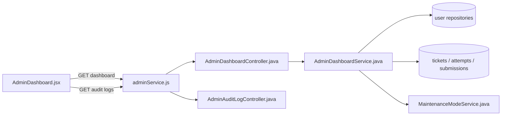
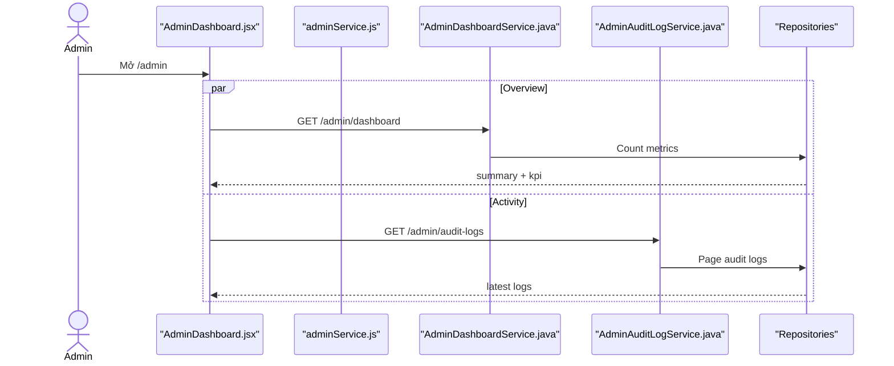

# View Dashboard Admin Feature Analysis

## 1. Tóm tắt tổng quan

Admin Dashboard tải song song overview và 10 audit log mới nhất. Overview gồm tổng user, active today, số attempt hôm nay, trạng thái hệ thống và KPI vận hành; backend tính trực tiếp từ repository và maintenance setting.

## 2. Bản đồ cấu trúc

| File | Vai trò | Loại |
|---|---|---|
| [AdminDashboard.jsx](apps/frontend/src/features/management/admin/AdminDashboard.jsx) | Điều phối tải và render dashboard | React Page |
| [DashboardStatRow.jsx](apps/frontend/src/features/management/components/admin/DashboardStatRow.jsx) | Hiển thị summary | Component |
| [DashboardKpiRow.jsx](apps/frontend/src/features/management/components/admin/DashboardKpiRow.jsx) | Hiển thị KPI | Component |
| [DashboardActivityLog.jsx](apps/frontend/src/features/management/components/admin/DashboardActivityLog.jsx) | Hiển thị audit gần nhất | Component |
| [adminService.js](apps/frontend/src/shared/api/adminService.js) | Gọi dashboard/audit API | API Service |
| [AdminDashboardController.java](apps/backend/src/main/java/com/jlpt/feature/admin/AdminDashboardController.java) | Endpoint overview | Controller |
| [AdminDashboardService.java](apps/backend/src/main/java/com/jlpt/feature/admin/AdminDashboardService.java) | Tổng hợp summary/KPI | Service |
| [AdminAuditLogController.java](apps/backend/src/main/java/com/jlpt/feature/admin/AdminAuditLogController.java) | Endpoint activity logs | Controller |
| [MaintenanceModeService.java](apps/backend/src/main/java/com/jlpt/feature/admin/MaintenanceModeService.java) | Cung cấp trạng thái hệ thống | Service |

## 3. Bản đồ kết nối



| Từ | Đến | Cách kết nối | Dữ liệu |
|---|---|---|---|
| Dashboard | adminService | two async calls | overview/log params |
| Controller | Dashboard service | method | none |
| Service | repositories | count queries | current metrics |
| Service | MaintenanceMode | call | system flag |

## 4. Luồng xử lý theo trình tự

1. Route `/admin` render `AdminDashboard`.
2. `useEffect` gọi `fetchOverview` và `fetchLogs`.
3. `GET /api/admin/dashboard` gọi `getOverview`.
4. Service tạo `summary` và `kpi` bằng count queries.
5. `GET /api/admin/audit-logs?page=0&size=10` trả hoạt động gần nhất.
6. UI render hai phần độc lập; lỗi một request không ngăn phần còn lại hiển thị.



## 5. Vai trò đoạn code quan trọng

[AdminDashboard.jsx#L20](apps/frontend/src/features/management/admin/AdminDashboard.jsx#L20)

```jsx
const fetchOverview = useCallback(async () => {
  setLoadOv(true);
  try {
    // Overview được xử lý độc lập với audit log để một API lỗi không làm trắng toàn trang.
    setOverview(await getDashboardOverview());
  } catch {
    setOverview(null);
  } finally {
    setLoadOv(false);
  }
}, []);
```

[AdminDashboardService.java#L41](apps/backend/src/main/java/com/jlpt/feature/admin/AdminDashboardService.java#L41)

```java
public AdminDashboardResponse getOverview() {
    // Một response gộp hai nhóm dữ liệu, giảm số request của frontend.
    return AdminDashboardResponse.builder()
            .summary(buildSummary())
            .kpi(buildKpi())
            .build();
}
```

## 6. Dữ liệu di chuyển

Count từ repositories → `AdminDashboardSummaryResponse` + `DashboardResponse` → `AdminDashboardResponse` → API envelope → state `overview` → component cards.

## 7. Bảng tra cứu tổng hợp

| Bước | File | Function | Kết nối tới | Dữ liệu | Ghi chú |
|---:|---|---|---|---|---|
| 1 | Dashboard | `useEffect` | two fetchers | none | Song song |
| 2 | Controller | `getDashboard` | Service | none | Admin only |
| 3 | Service | `buildSummary` | repos | counts | Summary |
| 4 | Service | `buildKpi` | repos | operational counts | KPI |
| 5 | Audit controller | `list` | audit service | page=0 | Activity |

## 8. Các mục cần bổ sung context

- `submissionRepository` được autowire tùy chọn; khi không có bean, pending submissions trả 0.
- Dashboard không dùng realtime push; dữ liệu được tải khi page/effect chạy.
