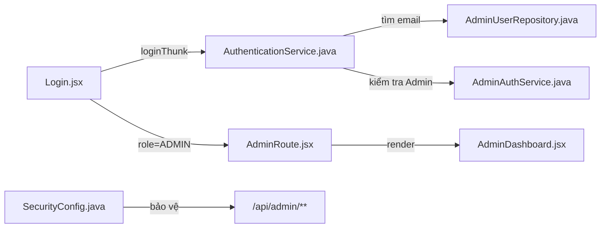
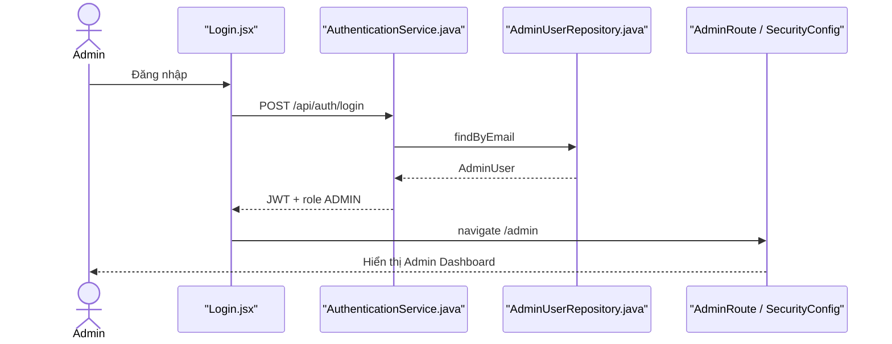

# Admin Login Feature Analysis

## 1. Tóm tắt tổng quan

Admin dùng chung form và endpoint login với các role khác, nhưng backend ưu tiên nhận diện Admin và frontend chỉ cho vào `/admin` khi response có `role=ADMIN`. Route admin được bảo vệ ở cả `AdminRoute.jsx` và Spring Security `/api/admin/**`.

## 2. Bản đồ cấu trúc

| File | Vai trò | Loại |
|---|---|---|
| [Login.jsx](apps/frontend/src/features/auth/login/Login.jsx) | Form và điều hướng Admin | React Page |
| [authSlice.js](apps/frontend/src/features/auth/authSlice.js) | Lưu token/role Admin | Redux Slice |
| [AdminRoute.jsx](apps/frontend/src/shared/components/common/AdminRoute.jsx) | Chặn UI không có role Admin | Route Guard |
| [AuthController.java](apps/backend/src/main/java/com/jlpt/feature/auth/AuthController.java) | Endpoint login chung | Controller |
| [AuthenticationService.java](apps/backend/src/main/java/com/jlpt/feature/auth/AuthenticationService.java) | Nhận diện và xác thực Admin | Service |
| [AdminAuthService.java](apps/backend/src/main/java/com/jlpt/feature/admin/AdminAuthService.java) | Logic trạng thái/đăng nhập Admin | Service |
| [AdminUserRepository.java](apps/backend/src/main/java/com/jlpt/feature/admin/AdminUserRepository.java) | Tìm Admin theo email | Repository |
| [SecurityConfig.java](apps/backend/src/main/java/com/jlpt/shared/config/SecurityConfig.java) | Bắt buộc ROLE_ADMIN cho API Admin | Security Config |

## 3. Bản đồ kết nối



| Từ | Đến | Cách kết nối | Dữ liệu |
|---|---|---|---|
| Login | Authentication | HTTP `/api/auth/login` | credentials |
| Authentication | Admin repository | JPA | email |
| Login | AdminRoute | navigation | role/token |
| AdminRoute | Admin pages | React Router | authenticated user |
| SecurityConfig | Admin API | authorization | JWT authorities |

## 4. Luồng xử lý theo trình tự

1. Admin nhập credentials tại `Login.handleSubmit`.
2. Backend tìm Admin trước các loại tài khoản còn lại tại `AuthenticationService.login`.
3. `AdminAuthService` kiểm tra mật khẩu/trạng thái và tạo response có role Admin.
4. Frontend lưu token, nhận `res.role === 'ADMIN'` và chuyển `/admin`.
5. `AdminRoute` kiểm tra session phía client.
6. Mọi request `/api/admin/**` vẫn phải vượt qua Spring Security với `ROLE_ADMIN`.



## 5. Vai trò đoạn code quan trọng

[Login.jsx#L52](apps/frontend/src/features/auth/login/Login.jsx#L52)

```jsx
} else if (res.role === 'ADMIN') {
  // Chỉ response được backend xác định là ADMIN mới đi vào khu vực quản trị.
  navigate('/admin');
}
```

[SecurityConfig.java#L54](apps/backend/src/main/java/com/jlpt/shared/config/SecurityConfig.java#L54)

```java
.authorizeHttpRequests(auth -> auth.requestMatchers(PUBLIC_URLS)
        .permitAll()
        // UI guard chỉ hỗ trợ trải nghiệm; backend mới là lớp phân quyền bắt buộc.
        .requestMatchers("/api/admin/**")
        .hasRole("ADMIN")
        .anyRequest()
        .authenticated())
```

## 6. Dữ liệu di chuyển

Credentials → Admin lookup → JWT chứa authority → local session → Authorization header → Spring Security xác minh trước mỗi Admin API.

## 7. Bảng tra cứu tổng hợp

| Bước | File | Function | Kết nối tới | Dữ liệu | Ghi chú |
|---:|---|---|---|---|---|
| 1 | `Login.jsx` | `handleSubmit` | auth thunk | credentials | Form chung |
| 2 | `AuthenticationService` | `login` | Admin repo | email | Nhận diện Admin |
| 3 | `Login.jsx` | role branch | `/admin` | role | Điều hướng |
| 4 | `AdminRoute.jsx` | guard | Admin page | session | Guard UI |
| 5 | `SecurityConfig` | filter chain | Admin API | JWT | Guard thật |

## 8. Các mục cần bổ sung context

- Không có form login riêng cho Admin; Admin dùng `/login` chung.
- Chi tiết chữ ký/claim JWT nằm trong security component, ngoài phạm vi file lõi của luồng này.
