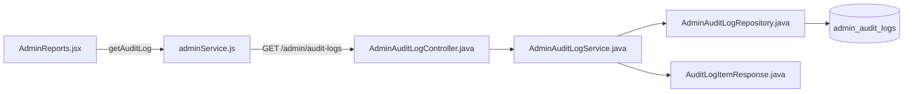
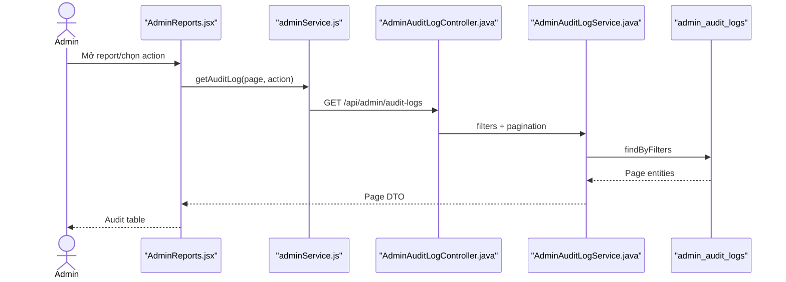

# Report Screen Feature Analysis

## 1. Tóm tắt tổng quan

Admin Reports hiện là màn hình báo cáo nhật ký quản trị, không phải hệ thống BI tổng hợp. Trang tải `admin_audit_logs`, phân trang và lọc theo action; backend map actor/action/description/timestamp thành DTO.

## 2. Bản đồ cấu trúc

| File | Vai trò | Loại |
|---|---|---|
| [AdminReports.jsx](apps/frontend/src/features/management/admin/AdminReports.jsx) | Bảng report, filter và pagination | React Page |
| [adminService.js](apps/frontend/src/shared/api/adminService.js) | Gọi audit log API | API Service |
| [AdminAuditLogController.java](apps/backend/src/main/java/com/jlpt/feature/admin/AdminAuditLogController.java) | Audit list endpoint | Controller |
| [AdminAuditLogService.java](apps/backend/src/main/java/com/jlpt/feature/admin/AdminAuditLogService.java) | Normalize filter và map DTO | Service |
| [AdminAuditLogRepository.java](apps/backend/src/main/java/com/jlpt/feature/admin/AdminAuditLogRepository.java) | Query audit phân trang | Repository |
| [AdminAuditLog.java](apps/backend/src/main/java/com/jlpt/feature/admin/AdminAuditLog.java) | Audit record | Entity |
| [AuditLogItemResponse.java](apps/backend/src/main/java/com/jlpt/feature/admin/dto/AuditLogItemResponse.java) | Dòng report trả về UI | DTO |

## 3. Bản đồ kết nối



| Từ | Đến | Cách kết nối | Dữ liệu |
|---|---|---|---|
| Reports | adminService | function | page/size/action |
| API | Controller | HTTP | query params |
| Controller | Service | method | filters |
| Service | Repository | `findByFilters` | pageable |
| Service | UI | DTO mapping | log page |

## 4. Luồng xử lý theo trình tự

1. Admin mở `/admin/reports`.
2. Effect gọi `fetchPage(page, actionFilter)`.
3. API gửi page zero-based và action nếu có.
4. Service chuyển chuỗi rỗng thành null và query repository.
5. Entity được map sang logId, actionType, actor, description, createdAt.
6. UI render chips và pagination; đổi filter reset page về 1.



## 5. Vai trò đoạn code quan trọng

[AdminReports.jsx#L40](apps/frontend/src/features/management/admin/AdminReports.jsx#L40)

```jsx
const fetchPage = useCallback((p, action) => {
  setLoading(true);
  // UI page bắt đầu từ 1, Spring PageRequest bắt đầu từ 0.
  getAuditLog({ page: p - 1, size: PAGE_SIZE, action: action || undefined })
    .then((data) => {
      setLogs(data?.content ?? []);
      setTotalPages(data?.totalPages ?? 1);
    })
    .finally(() => setLoading(false));
}, []);
```

[AdminAuditLogService.java#L20](apps/backend/src/main/java/com/jlpt/feature/admin/AdminAuditLogService.java#L20)

```java
public Page<AuditLogItemResponse> getAuditLogs(String action, String targetTable, int page, int size) {
    // Null biểu thị không áp dụng filter trong query repository.
    String a = action == null || action.isBlank() ? null : action;
    String t = targetTable == null || targetTable.isBlank() ? null : targetTable;
    return adminAuditLogRepository.findByFilters(a, t, PageRequest.of(page, size))
            .map(this::toResponse);
}
```

## 6. Dữ liệu di chuyển

Action/page UI → query params → repository filters → `Page<AdminAuditLog>` → `Page<AuditLogItemResponse>` → table/chips.

## 7. Bảng tra cứu tổng hợp

| Bước | File | Function | Kết nối tới | Dữ liệu | Ghi chú |
|---:|---|---|---|---|---|
| 1 | Reports | `fetchPage` | API | page/action | Load |
| 2 | adminService | `getAuditLog` | Controller | query | HTTP |
| 3 | Controller | `list` | Service | filters | Admin only |
| 4 | Service | `getAuditLogs` | Repository | pageable | Map DTO |
| 5 | Reports | render | Admin | logs | Pagination |

## 8. Các mục cần bổ sung context

- Không tìm thấy export CSV/PDF hoặc biểu đồ analytics trong source của màn hình này.
- Tên “Report Screen” trên UI hiện tương ứng audit log report.
