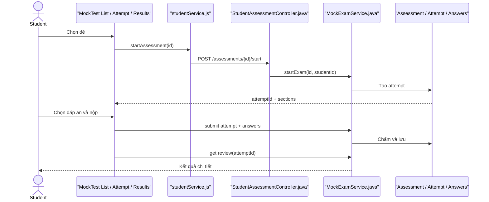

# Assessment Mock Test Feature Analysis

## 1. Tóm tắt tổng quan

Luồng Mock Test cho Student xem đề Exam đã published, bắt đầu attempt, làm bài theo section, nộp bài và xem review. Frontend gồm ba màn hình List–Attempt–Results; backend dùng `StudentAssessmentController` và `MockExamService`, lưu attempt/answer trong database và tính điểm phía server.

## 2. Bản đồ cấu trúc

| File | Vai trò | Loại |
|---|---|---|
| [MockTestList.jsx](apps/frontend/src/features/mock-test/mock-test/MockTestList.jsx) | Liệt kê Exam theo JLPT level | React Page |
| [MockTestAttempt.jsx](apps/frontend/src/features/mock-test/mock-test/MockTestAttempt.jsx) | Khởi tạo attempt, timer và câu trả lời | React Page |
| [MockTestResults.jsx](apps/frontend/src/features/mock-test/mock-test/MockTestResults.jsx) | Hiển thị kết quả/review | React Page |
| [studentService.js](apps/frontend/src/shared/api/studentService.js) | Gọi list/start/submit/review API | API Service |
| [StudentAssessmentController.java](apps/backend/src/main/java/com/jlpt/feature/assessment/StudentAssessmentController.java) | API list/start/submit | Controller |
| [MockExamService.java](apps/backend/src/main/java/com/jlpt/feature/assessment/MockExamService.java) | Kiểm tra thời gian, chấm điểm, lưu attempt | Service |
| [Assessment.java](apps/backend/src/main/java/com/jlpt/feature/assessment/Assessment.java) | Đề thi | Entity |
| [TestAttempt.java](apps/backend/src/main/java/com/jlpt/feature/assessment/TestAttempt.java) | Một lần làm bài | Entity |
| [AttemptAnswer.java](apps/backend/src/main/java/com/jlpt/feature/assessment/AttemptAnswer.java) | Câu trả lời trong attempt | Entity |

## 3. Bản đồ kết nối

```mermaid
flowchart LR
    List["MockTestList.jsx"] -->|"GET assessments"| API["studentService.js"]
    Attempt["MockTestAttempt.jsx"] -->|"start / submit"| API
    Result["MockTestResults.jsx"] -->|"GET review"| API
    API --> Ctrl["StudentAssessmentController.java"]
    Ctrl --> Svc["MockExamService.java"]
    Svc --> Assess[("assessments / question_assignments")]
    Svc --> Attempts[("test_attempts / attempt_answers")]
```



| Từ | Đến | Cách kết nối | Dữ liệu |
|---|---|---|---|
| List | API | `getExamList` | level/page |
| Attempt | API | `startAssessment` | assessmentId |
| Attempt | API | `submitAssessment` | attemptId/answers |
| Controller | Service | method call | studentId + DTO |
| Service | DB | JPA | exam/questions/attempt |

## 4. Luồng xử lý theo trình tự

1. [MockTestList.jsx#L24](apps/frontend/src/features/mock-test/mock-test/MockTestList.jsx#L24) tải Exam published theo level.
2. Student chọn đề và đi tới `/mock-test/{id}/attempt`.
3. [MockTestAttempt.jsx#L35](apps/frontend/src/features/mock-test/mock-test/MockTestAttempt.jsx#L35) gọi start; backend tạo/khôi phục attempt và trả sections.
4. UI lưu lựa chọn tạm theo `exam_draft_{id}`; đây chỉ là phục hồi UX.
5. `doSubmit` tạo mảng `{questionId, selectedOption}` và gửi backend.
6. `MockExamService.submitExam` kiểm tra attempt/student/thời gian, tính điểm server-side và lưu answers.
7. UI chuyển tới results kèm `attemptId`; Results gọi review API để hiển thị đúng/sai.



## 5. Vai trò đoạn code quan trọng

[MockTestAttempt.jsx#L81](apps/frontend/src/features/mock-test/mock-test/MockTestAttempt.jsx#L81)

```jsx
const payload = questions.map((q) => ({
  // Frontend chỉ gửi lựa chọn; không gửi điểm để tránh client tự chấm.
  questionId: q.questionId,
  selectedOption: answers[q.questionId] ?? null,
}));
const result = await submitAssessment(id, { attemptId, isAutoSubmit, answers: payload });
```

[studentService.js#L250](apps/frontend/src/shared/api/studentService.js#L250)

```js
export async function startAssessment(assessmentId) {
  // Endpoint tạo trạng thái làm bài phía server trước khi timer bắt đầu ở UI.
  const res = await api.post(`/assessments/${assessmentId}/start`);
  return res.data.data;
}
```

## 6. Dữ liệu di chuyển

Filter level → danh sách Exam → assessmentId → attemptId/sections → answer map ở UI → answer DTO → điểm và review do server tạo → Results UI.

## 7. Bảng tra cứu tổng hợp

| Bước | File | Function | Kết nối tới | Dữ liệu | Ghi chú |
|---:|---|---|---|---|---|
| 1 | `MockTestList` | `fetchExams` | list API | level/page | Chỉ Exam |
| 2 | `MockTestAttempt` | start effect | start API | assessmentId | Tạo attempt |
| 3 | `MockTestAttempt` | `handleSelect` | local state | answer | Draft UX |
| 4 | `MockTestAttempt` | `doSubmit` | submit API | answers | Server chấm |
| 5 | `MockTestResults` | effect | review API | attemptId | Chi tiết kết quả |

## 8. Các mục cần bổ sung context

- LocalStorage draft không phải nguồn sự thật; attempt server mới quyết định kết quả.
- Feature có trên 15 file nếu tính toàn bộ DTO/converter/repository; tài liệu chỉ liệt kê file lõi theo giới hạn workflow.
