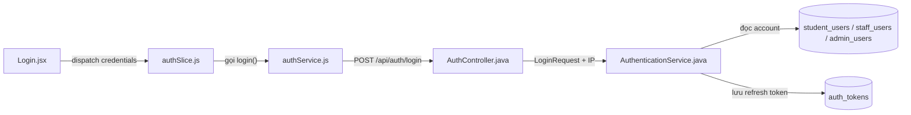
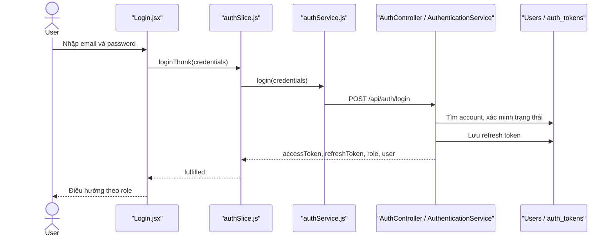

# Authentication Feature Analysis

## 1. Tóm tắt tổng quan

Authentication quản lý đăng nhập, đăng ký, xác minh email, refresh/logout, quên mật khẩu và Google Login cho Student, Staff và Admin. Frontend đi từ `Login.jsx` qua Redux `authSlice.js` và Axios `authService.js`; backend nhận tại `AuthController`, xử lý bằng `AuthenticationService` cùng các repository người dùng/token.

## 2. Bản đồ cấu trúc

| File | Vai trò | Loại |
|---|---|---|
| [Login.jsx](apps/frontend/src/features/auth/login/Login.jsx) | Thu thập credentials và điều hướng theo role | React Page |
| [authSlice.js](apps/frontend/src/features/auth/authSlice.js) | Quản lý trạng thái auth, token và async thunk | Redux Slice |
| [authService.js](apps/frontend/src/shared/api/authService.js) | Gọi API, gắn JWT và tự refresh khi gặp 401 | Axios Client |
| [AuthController.java](apps/backend/src/main/java/com/jlpt/feature/auth/AuthController.java) | Cung cấp `/api/auth/*` | Controller |
| [AuthenticationService.java](apps/backend/src/main/java/com/jlpt/feature/auth/AuthenticationService.java) | Xác thực ba loại tài khoản và phát token | Service |
| [AuthToken.java](apps/backend/src/main/java/com/jlpt/feature/auth/AuthToken.java) | Lưu refresh/verification/reset token | Entity |
| [AuthTokenRepository.java](apps/backend/src/main/java/com/jlpt/feature/auth/AuthTokenRepository.java) | Truy vấn và thu hồi token | Repository |
| [SecurityConfig.java](apps/backend/src/main/java/com/jlpt/shared/config/SecurityConfig.java) | Khai báo public/protected URL | Security Config |

## 3. Bản đồ kết nối



| Từ | Đến | Cách kết nối | Dữ liệu |
|---|---|---|---|
| `Login.jsx` | `authSlice.js` | Redux dispatch | `{email,password}` |
| `authSlice.js` | `authService.js` | JS function | credentials |
| `authService.js` | `AuthController` | HTTP | `LoginRequest` |
| `AuthenticationService` | user repositories | JPA | email/account |
| `AuthenticationService` | `AuthTokenRepository` | JPA | refresh token |

## 4. Luồng xử lý theo trình tự

1. `Login.handleSubmit` tại [Login.jsx#L38](apps/frontend/src/features/auth/login/Login.jsx#L38) validate UX và dispatch `loginThunk`.
2. Thunk tại [authSlice.js#L60](apps/frontend/src/features/auth/authSlice.js#L60) gọi API, nhận token/user rồi lưu session.
3. [authService.js#L81](apps/frontend/src/shared/api/authService.js#L81) gửi `POST /auth/login`.
4. [AuthController.login#L44](apps/backend/src/main/java/com/jlpt/feature/auth/AuthController.java#L44) truyền DTO và IP sang service.
5. [AuthenticationService.login#L126](apps/backend/src/main/java/com/jlpt/feature/auth/AuthenticationService.java#L126) phân loại Admin/Staff/Student, kiểm tra trạng thái và mật khẩu.
6. Service phát access/refresh token, lưu refresh token và trả `LoginApiResponse`.
7. Frontend điều hướng Student tới `/dashboard`, Admin tới `/admin`, Staff/Manager tới dashboard tương ứng.



## 5. Vai trò đoạn code quan trọng

[Login.jsx#L50](apps/frontend/src/features/auth/login/Login.jsx#L50)

```jsx
const res = await dispatch(loginThunk({ email, password })).unwrap();
// Redux trả role và cờ đổi mật khẩu; UI chỉ dùng kết quả để chọn màn hình tiếp theo.
if (res.requirePasswordChange) {
  navigate('/staff/change-temp-password');
} else if (res.role === 'ADMIN') {
  navigate('/admin');
}
```

[AuthController.java#L43](apps/backend/src/main/java/com/jlpt/feature/auth/AuthController.java#L43)

```java
@PostMapping("/login")
public ResponseEntity<ApiResponse<LoginApiResponse>> login(
        @Valid @RequestBody LoginRequest request, HttpServletRequest httpRequest) {
    // Controller lấy IP để service áp dụng kiểm soát đăng nhập và audit.
    String ip = httpRequest.getRemoteAddr();
    LoginApiResponse response = authenticationService.login(request, ip);
    return ResponseEntity.ok(ApiResponse.success("Đăng nhập thành công", response));
}
```

## 6. Dữ liệu di chuyển

`email/password` → `LoginRequest` → account đã xác thực → JWT/refresh token → `LoginApiResponse` → Redux/localStorage. Password thô chỉ dùng để xác minh, không được trả về client.

## 7. Bảng tra cứu tổng hợp

| Bước | File | Function | Kết nối tới | Dữ liệu | Ghi chú |
|---:|---|---|---|---|---|
| 1 | `Login.jsx` | `handleSubmit` | Redux | credentials | Validate UX |
| 2 | `authSlice.js` | `loginThunk` | API client | credentials | Lưu session |
| 3 | `AuthController` | `login` | Service | DTO + IP | `@Valid` |
| 4 | `AuthenticationService` | `login` | Repositories | account | Phân loại role |
| 5 | `AuthenticationService` | token generation | Client | JWT/user | Trả response |

## 8. Các mục cần bổ sung context

- Chính sách thời hạn token lấy từ cấu hình runtime; không ghi giá trị bí mật trong tài liệu.
- File cũ `authen_feature_analysis.md` có một số link frontend không còn đúng cấu trúc hiện tại.
