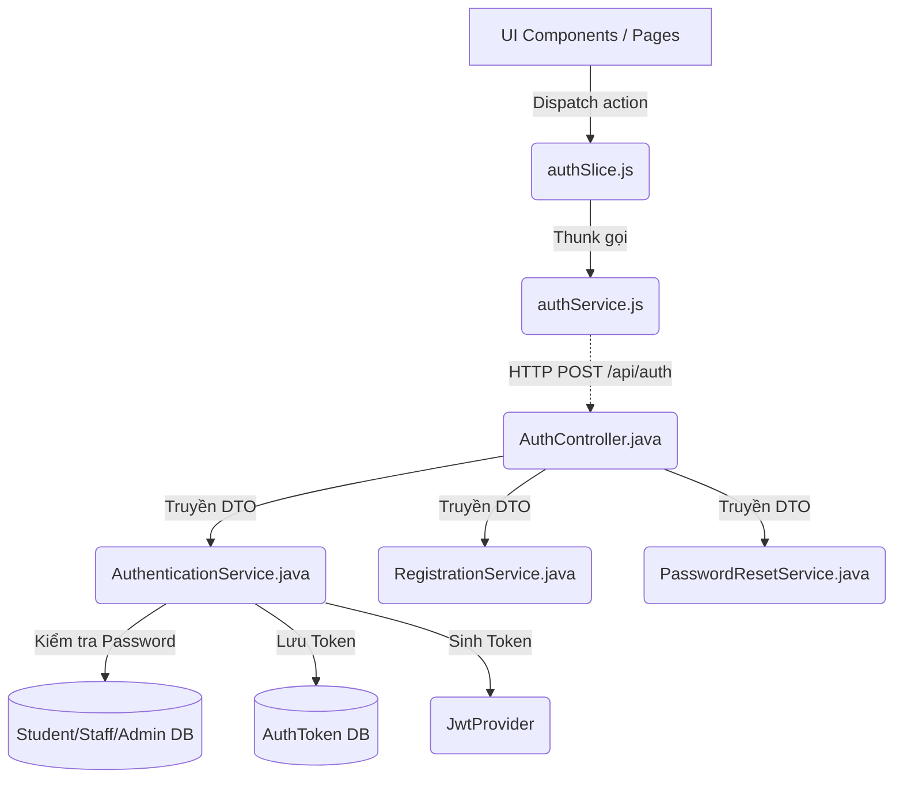
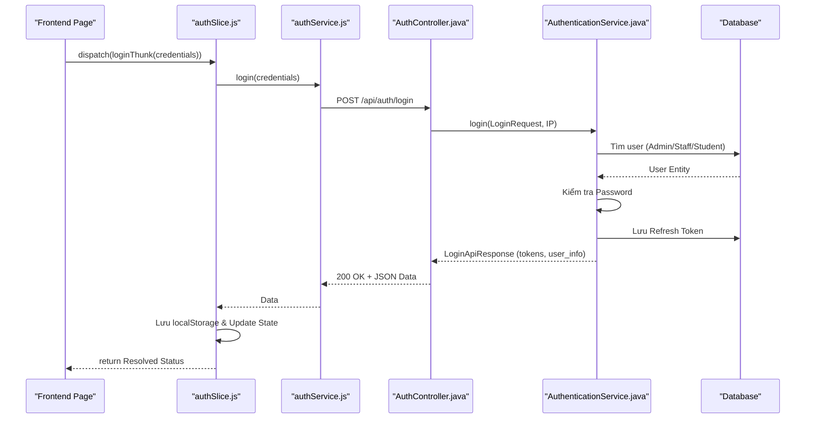

# Phân Tích Cấu Trúc – Luồng – Kết Nối Của Feature: Authentication

## 1. Tóm tắt tổng quan
Feature Authentication (Xác thực) quản lý toàn bộ vòng đời phiên làm việc của người dùng trong hệ thống (bao gồm Student, Staff và Admin). Tính năng này bao phủ từ đăng nhập, đăng ký, quên mật khẩu, đăng nhập Google, đến tự động cấp lại token (refresh token) khi hết hạn. 
- **Tầng Frontend** sử dụng Redux Toolkit để quản lý trạng thái, kết hợp với Axios Interceptors để đính kèm và làm mới token một cách tự động (silent refresh). 
- **Tầng Backend** xây dựng trên Spring Boot, tiếp nhận request qua Controller, xử lý nghiệp vụ tại Service và tương tác DB qua JPA. 
- **Điểm vào (Entry point)**: Ở Frontend là các Thunk trong `authSlice.js`, ở Backend là các endpoint trong `AuthController.java`.

---

## 2. Bản đồ cấu trúc (các "mảnh" và vai trò)

| File | Vai trò | Loại |
|------|----------|------|
| [authSlice.js](apps/frontend/src/store/slices/authSlice.js) | Quản lý trạng thái đăng nhập, user profile và xử lý các hành động bất đồng bộ (Thunk) liên quan đến Auth ở Frontend. | Redux Slice |
| [authService.js](apps/frontend/src/api/authService.js) | Thực hiện các lệnh gọi API qua HTTP, cấu hình Axios Interceptors để tự đính kèm JWT và tự động gọi API Refresh Token khi có lỗi 401. | API Service |
| [AuthController.java](apps/backend/src/main/java/com/jlpt/feature/auth/AuthController.java) | Tiếp nhận tất cả các HTTP request từ client (`/api/auth/*`) như login, register, refresh token. | Controller |
| [AuthenticationService.java](apps/backend/src/main/java/com/jlpt/feature/auth/AuthenticationService.java) | Trái tim của nghiệp vụ xác thực. Kiểm tra thông tin đăng nhập, phân loại user (Admin/Staff/Student), tạo/gia hạn JWT token. | Service |
| [RegistrationService.java](apps/backend/src/main/java/com/jlpt/feature/auth/RegistrationService.java) | Quản lý nghiệp vụ đăng ký tài khoản Student và xác minh email (gửi OTP). | Service |
| [PasswordResetService.java](apps/backend/src/main/java/com/jlpt/feature/auth/PasswordResetService.java) | Quản lý quy trình quên mật khẩu và đặt lại mật khẩu mới. | Service |
| [AuthToken.java](apps/backend/src/main/java/com/jlpt/feature/auth/AuthToken.java) / [AuthTokenRepository.java](apps/backend/src/main/java/com/jlpt/feature/auth/AuthTokenRepository.java) | Định nghĩa và thao tác lưu trữ các Refresh Token / Session Token (đối với Staff) vào trong cơ sở dữ liệu. | Entity / Repository |
| [JwtProvider.java](apps/backend/src/main/java/com/jlpt/shared/security/JwtProvider.java) | Chịu trách nhiệm khởi tạo token bằng thuật toán mã hóa (không xem trực tiếp nhưng được gọi liên tục bởi `AuthenticationService`). | Security Component |

---

## 3. Bản đồ kết nối (ai gọi ai, dữ liệu truyền qua đâu)



**Bảng tra cứu kết nối chính:**

| Từ (File A) | Đến (File B) | Cách kết nối | Dữ liệu truyền |
|---|---|---|---|
| Bất kỳ UI nào | `authSlice.js` | Redux `dispatch()` | Payload thông tin (VD: `credentials`) |
| `authSlice.js` | `authService.js` | Gọi hàm bất đồng bộ | JSON payload (VD: `{ email, password }`) |
| `authService.js` | `AuthController.java` | HTTP POST | Body JSON (`LoginRequest`) |
| `AuthController.java` | `AuthenticationService.java` | Gọi hàm (Dependency Injection) | DTO (`LoginRequest`, `GoogleTokenRequest`) |
| `AuthenticationService` | `AuthTokenRepository` | JPA Method | Đối tượng `AuthToken` để lưu trữ Refresh Token |

---

## 4. Luồng xử lý theo trình tự

**Ví dụ: Trình tự xử lý luồng Đăng Nhập (Login)**

1. Người dùng nhập thông tin và nhấn đăng nhập. UI Component gọi hàm `dispatch(loginThunk(credentials))`.
2. Hàm `loginThunk` (trong `authSlice.js`) chạy, chuyển dữ liệu cho hàm `login()` trong `authService.js`.
3. `authService.js` gửi một HTTP POST request (không chứa token do là public endpoint) đến backend `/api/auth/login`.
4. `AuthController.login()` (trong `AuthController.java`) tiếp nhận `LoginRequest` (đã được tự động validate định dạng) và gọi `authenticationService.login(request, ip)`.
5. `AuthenticationService` ưu tiên tìm kiếm account theo thứ tự: **Admin -> Staff -> Student** trong database.
6. Nếu tìm thấy, gọi hàm hash/verify password (như `passwordEncoder.matches`).
7. Nếu sai pass hoặc tài khoản bị khóa -> Bắn Exception (backend trả về 401 hoặc 429 hoặc 403).
8. Nếu đúng, `AuthenticationService` yêu cầu `JwtProvider` tạo 1 chuỗi JWT `accessToken` ngắn hạn và 1 chuỗi `refreshToken` dài hạn. Sau đó lưu `refreshToken` vào Database qua `AuthTokenRepository`.
9. `AuthenticationService` trả về đối tượng `LoginApiResponse` chứa các token và thông tin người dùng cho `AuthController` -> HTTP Response 200 gửi về client.
10. `loginThunk` nhận dữ liệu. Bóc tách `accessToken` và `refreshToken` lưu vào `localStorage`, đồng thời ghi nhận data `user` vào Redux state và `jlpt-user` trong `localStorage`.



---

## 5. Vai trò từng đoạn code quan trọng

### 1. Tự động Refresh Token khi gặp lỗi 401 (Frontend)
**File**: [authService.js](apps/frontend/src/api/authService.js) (dòng 35-77)
```javascript
api.interceptors.response.use(
  // Xử lý response thành công (không can thiệp)
  (response) => response,
  async (error) => {
    const originalRequest = error.config;
    
    // Nếu API trả về mã lỗi 401 (Unauthorized - token hết hạn) và request này chưa từng được retry
    if (error.response?.status === 401 && !originalRequest._retry) {
      // Đánh dấu request này đã được retry để tránh bị lặp vô hạn (infinite loop)
      originalRequest._retry = true;
      
      try {
        // Kỹ thuật Singleton Pattern cho refreshPromise
        // Tránh việc nhiều request bị 401 cùng lúc gọi API refresh nhiều lần
        if (!refreshPromise) {
          const refreshToken = localStorage.getItem('refreshToken');
          
          // Gửi request lấy token mới ẩn ở background
          refreshPromise = axios
            .post(`${API_BASE_URL}/auth/refresh`, { refreshToken })
            .then(({ data }) => { 
                // ... lưu accessToken mới vào localStorage ... 
            });
        }
        
        // Chờ tiến trình refresh hoàn tất và lấy token mới
        const accessToken = await refreshPromise;
        
        // Cập nhật lại header Authorization của request ban đầu bị lỗi
        originalRequest.headers.Authorization = `Bearer ${accessToken}`;
        
        // Tự động gọi lại request ban đầu với token mới
        return api(originalRequest);
      } // ... (catch) nếu refresh token cũng lỗi/hết hạn thì xóa session và logout
    }
    return Promise.reject(error);
  }
);
```
**Giải thích**: Cơ chế này là "silent refresh". Bất cứ API nào trả về lỗi `401 Unauthorized` (do access token hết hạn), Axios sẽ tạm chặn luồng lại, gọi API refresh token ở chế độ nền. Khi nhận được token mới, nó tự động gửi lại API đang lỗi. Sử dụng `refreshPromise` để đảm bảo nếu có nhiều API lỗi cùng lúc, chỉ 1 lệnh refresh token được gửi đi.

### 2. Định tuyến logic đăng nhập cho mọi Role (Backend)
**File**: [AuthenticationService.java](apps/backend/src/main/java/com/jlpt/feature/auth/AuthenticationService.java) (dòng 126-144)
```java
@Transactional
public LoginApiResponse login(LoginRequest request, String ip) {
    // 1. Quét tìm trong bảng Admin trước (quyền hạn cao nhất)
    Optional<AdminUser> adminOpt = adminUserRepository.findByEmail(request.getEmail());
    if (adminOpt.isPresent()) {
        // Thực thi luồng xử lý riêng, sinh token cho Admin
        return adminAuthService.processAdminLogin(adminOpt.get(), request.getPassword(), ip);
    }
    
    // 2. Nếu không phải Admin, quét tiếp trong bảng Staff
    Optional<StaffUser> staffOpt = staffUserRepository.findByEmail(request.getEmail());
    // ... (nếu tìm thấy xử lý processStaffLogin) ...
    
    // 3. Cuối cùng, quét trong bảng Student
    Optional<StudentUser> studentOpt = studentUserRepository.findByEmail(request.getEmail());
    // ... (nếu tìm thấy xử lý processStudentLogin) ...
    
    // 4. Nếu không tìm thấy ở cả 3 bảng, hoặc thông tin sai
    // Cố tình gộp chung lỗi 401 không mô tả chi tiết để bảo vệ hệ thống khỏi kỹ thuật quét dò tìm tài khoản
    throw new BusinessException(401, "INVALID_CREDENTIALS", "Email hoặc mật khẩu không đúng");
}
```
**Giải thích**: Một URL duy nhất (`/api/auth/login`) phục vụ cho tất cả các nhóm người dùng. Service quét tuyến tính từ Admin, đến Staff, rồi Student. Điều này tiện lợi cho frontend nhưng có thể gây chậm ở mức độ nhất định nếu user là Student (bảng cuối cùng bị quét). Exception ném ra ở cuối chung một thông báo nhằm che giấu (không tiết lộ) thông tin chi tiết bảng nào đã được kiểm tra (tính năng bảo mật).

---

## 6. Dữ liệu di chuyển như thế nào

1. **Email/Password**: Chứa trong 1 object JS (credentials) -> Gọi axios thành chuỗi JSON -> Xuyên qua mạng thành Request Body -> Spring Boot deserialize thành object Java `LoginRequest` (`@Valid`).
2. **Access/Refresh Token**: Tạo bởi Backend `JwtProvider` (là chuỗi mã hóa HMAC / RSA) -> Gói vào DTO `LoginApiResponse` -> Xuống Client dưới dạng JSON -> Được tách ra và lưu thành chuỗi (String) trong thẻ nhớ cục bộ của Browser (`localStorage.setItem('accessToken', ...)`).
3. **HTTP Header Auth**: Ở mỗi request gọi sau đó, Axios Interceptor lấy `accessToken` (chuỗi) từ `localStorage`, nối thêm chữ `Bearer ` và nhét vào Request Header (`Authorization: Bearer <token>`) -> Chạy đến server, bị Spring Security Filter chặn lại, bóc tách chuỗi ra để kiểm chứng (verify signature) trước khi cho phép vào Controller.

---

## 7. Bảng tra cứu tổng hợp

| Bước | File | Function | Kết nối tới | Dữ liệu | Ghi chú |
|---|---|---|---|---|---|
| Đăng nhập (FE) | [authSlice.js](apps/frontend/src/store/slices/authSlice.js) | `loginThunk(credentials)` | [authService.js](apps/frontend/src/api/authService.js) | `credentials` object | Xử lý trạng thái UI loading/error |
| Đăng nhập (API) | [authService.js](apps/frontend/src/api/authService.js) | `login()` | `AuthController` | `{email, pass}` | Giao tiếp mạng |
| Đăng nhập (BE) | [AuthController.java](apps/backend/src/main/java/com/jlpt/feature/auth/AuthController.java)| `login()` | `AuthenticationService` | `LoginRequest` | Validator đầu vào |
| Auth Xử lý | [AuthenticationService.java](apps/backend/src/main/java/com/jlpt/feature/auth/AuthenticationService.java)| `login()` | DB, `JwtProvider` | `LoginApiResponse` | Xác thực pass, phân loại Role, ghi token |
| Token Refresh (FE) | [authService.js](apps/frontend/src/api/authService.js) | Axios interceptor | `POST /auth/refresh` | `refreshToken` | Xử lý tự động lỗi 401 |

---

## 8. Các mục cần bổ sung context (nếu có)
- **Tầng UI / Pages**: Do chỉ tập trung khảo sát Service/Redux, file cụ thể chứa trang UI đăng nhập (ví dụ: `Login.jsx`, `Register.jsx` bên trong `apps/frontend/src/pages/*`) không được kiểm tra cụ thể. Tuy nhiên, luồng Redux chứng minh rằng các component này chỉ làm nhiệm vụ dispatch đơn giản.
- **`JwtProvider.java`**: Tạm thời coi đây là blackbox chuyên sinh token hợp chuẩn do file này không được đọc chi tiết trong phạm vi khảo sát, nhưng vai trò của nó đã rất tường minh ở Service layer.
