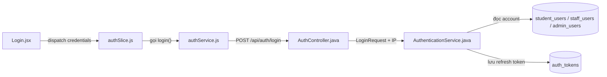
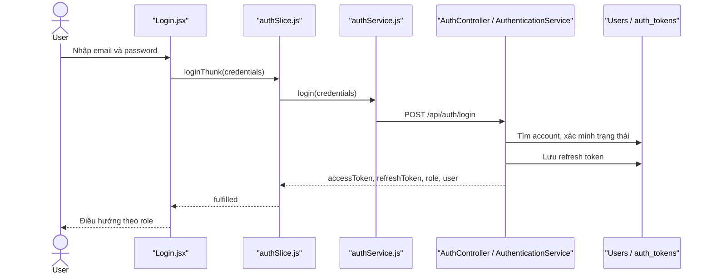

# Authentication Feature Analysis

## 1. Tóm tắt tổng quan

Authentication quản lý đăng nhập, đăng ký, xác minh email, refresh/logout, quên mật khẩu và Google Login cho Student, Staff và Admin. Frontend đi từ `Login.jsx` qua Redux `authSlice.js` và Axios `authService.js`; backend nhận tại `AuthController`, xử lý bằng `AuthenticationService` cùng các repository người dùng/token.

## 2. Bản đồ cấu trúc

| File | Vai trò | Loại |
|---|---|---|
| [Login.jsx](apps/frontend/src/features/auth/login/Login.jsx) | Thu thập credentials và điều hướng theo role | React Page |
| [authSlice.js](apps/frontend/src/features/auth/authSlice.js) | Quản lý trạng thái auth, token và async thunk | Redux Slice |
| [authService.js](apps/frontend/src/shared/api/authService.js) | Gọi API, gắn JWT và tự refresh khi gặp 401 | Axios Client |
| [AuthController.java](apps/backend/src/main/java/com/jlpt/feature/auth/AuthController.java) | Cung cấp `/api/auth/*` | Controller |
| [AuthenticationService.java](apps/backend/src/main/java/com/jlpt/feature/auth/AuthenticationService.java) | Xác thực ba loại tài khoản và phát token | Service |
| [AuthToken.java](apps/backend/src/main/java/com/jlpt/feature/auth/AuthToken.java) | Lưu refresh/verification/reset token | Entity |
| [AuthTokenRepository.java](apps/backend/src/main/java/com/jlpt/feature/auth/AuthTokenRepository.java) | Truy vấn và thu hồi token | Repository |
| [SecurityConfig.java](apps/backend/src/main/java/com/jlpt/shared/config/SecurityConfig.java) | Khai báo public/protected URL | Security Config |

## 3. Bản đồ kết nối



| Từ | Đến | Cách kết nối | Dữ liệu |
|---|---|---|---|
| `Login.jsx` | `authSlice.js` | Redux dispatch | `{email,password}` |
| `authSlice.js` | `authService.js` | JS function | credentials |
| `authService.js` | `AuthController` | HTTP | `LoginRequest` |
| `AuthenticationService` | user repositories | JPA | email/account |
| `AuthenticationService` | `AuthTokenRepository` | JPA | refresh token |

## 4. Luồng xử lý theo trình tự

1. `Login.handleSubmit` tại [Login.jsx#L38](apps/frontend/src/features/auth/login/Login.jsx#L38) validate UX và dispatch `loginThunk`.
2. Thunk tại [authSlice.js#L60](apps/frontend/src/features/auth/authSlice.js#L60) gọi API, nhận token/user rồi lưu session.
3. [authService.js#L81](apps/frontend/src/shared/api/authService.js#L81) gửi `POST /auth/login`.
4. [AuthController.login#L44](apps/backend/src/main/java/com/jlpt/feature/auth/AuthController.java#L44) truyền DTO và IP sang service.
5. [AuthenticationService.login#L126](apps/backend/src/main/java/com/jlpt/feature/auth/AuthenticationService.java#L126) phân loại Admin/Staff/Student, kiểm tra trạng thái và mật khẩu.
6. Service phát access/refresh token, lưu refresh token và trả `LoginApiResponse`.
7. Frontend điều hướng Student tới `/dashboard`, Admin tới `/admin`, Staff/Manager tới dashboard tương ứng.



## 5. Vai trò đoạn code quan trọng

[Login.jsx#L50](apps/frontend/src/features/auth/login/Login.jsx#L50)

```jsx
const res = await dispatch(loginThunk({ email, password })).unwrap();
// Redux trả role và cờ đổi mật khẩu; UI chỉ dùng kết quả để chọn màn hình tiếp theo.
if (res.requirePasswordChange) {
  navigate('/staff/change-temp-password');
} else if (res.role === 'ADMIN') {
  navigate('/admin');
}
```

[AuthController.java#L43](apps/backend/src/main/java/com/jlpt/feature/auth/AuthController.java#L43)

```java
@PostMapping("/login")
public ResponseEntity<ApiResponse<LoginApiResponse>> login(
        @Valid @RequestBody LoginRequest request, HttpServletRequest httpRequest) {
    // Controller lấy IP để service áp dụng kiểm soát đăng nhập và audit.
    String ip = httpRequest.getRemoteAddr();
    LoginApiResponse response = authenticationService.login(request, ip);
    return ResponseEntity.ok(ApiResponse.success("Đăng nhập thành công", response));
}
```

## 6. Dữ liệu di chuyển

`email/password` → `LoginRequest` → account đã xác thực → JWT/refresh token → `LoginApiResponse` → Redux/localStorage. Password thô chỉ dùng để xác minh, không được trả về client.

## 7. Bảng tra cứu tổng hợp

| Bước | File | Function | Kết nối tới | Dữ liệu | Ghi chú |
|---:|---|---|---|---|---|
| 1 | `Login.jsx` | `handleSubmit` | Redux | credentials | Validate UX |
| 2 | `authSlice.js` | `loginThunk` | API client | credentials | Lưu session |
| 3 | `AuthController` | `login` | Service | DTO + IP | `@Valid` |
| 4 | `AuthenticationService` | `login` | Repositories | account | Phân loại role |
| 5 | `AuthenticationService` | token generation | Client | JWT/user | Trả response |

## 8. Các mục cần bổ sung context

- Chính sách thời hạn token lấy từ cấu hình runtime; không ghi giá trị bí mật trong tài liệu.
- File cũ `authentication-feature-analysis.md` có một số link frontend không còn đúng cấu trúc hiện tại.

<!-- BACKEND-METHOD-INVENTORY:START -->

## Phụ lục — Danh mục đầy đủ hàm backend

> Phần này được đối chiếu trực tiếp từ source backend hiện tại. Chỉ liệt kê các hàm khai báo tường minh trong những file Java mà tài liệu này tham chiếu; các hàm do Lombok/JPA sinh tự động không xuất hiện trong source nên không liệt kê.

### `AuthController`

Nguồn: [AuthController.java](../../../apps/backend/src/main/java/com/jlpt/feature/auth/AuthController.java)

| # | Hàm backend (đầy đủ chữ ký) | Endpoint | Tác dụng/chức năng phục vụ |
|---:|---|---|---|
| 1 | [`ResponseEntity<ApiResponse<AccountTypeResponse>> checkAccountType(@Valid @RequestBody CheckAccountTypeRequest request, HttpServletRequest httpRequest)`](../../../apps/backend/src/main/java/com/jlpt/feature/auth/AuthController.java#L35) | `POST /check-account-type` | Xử lý endpoint `POST /check-account-type`; thực hiện nghiệp vụ `check account type`. |
| 2 | [`ResponseEntity<ApiResponse<LoginApiResponse>> login(@Valid @RequestBody LoginRequest request, HttpServletRequest httpRequest)`](../../../apps/backend/src/main/java/com/jlpt/feature/auth/AuthController.java#L43) | `POST /login` | Xử lý endpoint `POST /login`; thực hiện nghiệp vụ `login`. |
| 3 | [`ResponseEntity<ApiResponse<StudentResponse>> register(@Valid @RequestBody RegisterRequest request)`](../../../apps/backend/src/main/java/com/jlpt/feature/auth/AuthController.java#L51) | `POST /register` | Xử lý endpoint `POST /register`; thực hiện nghiệp vụ `register`. |
| 4 | [`ResponseEntity<ApiResponse<RefreshTokenResponse>> refresh(@Valid @RequestBody RefreshTokenRequest request)`](../../../apps/backend/src/main/java/com/jlpt/feature/auth/AuthController.java#L59) | `POST /refresh` | Xử lý endpoint `POST /refresh`; thực hiện nghiệp vụ `refresh`. |
| 5 | [`ResponseEntity<ApiResponse<Void>> logout(@Valid @RequestBody LogoutRequest request)`](../../../apps/backend/src/main/java/com/jlpt/feature/auth/AuthController.java#L65) | `POST /logout` | Xử lý endpoint `POST /logout`; thực hiện nghiệp vụ `logout`. |
| 6 | [`ResponseEntity<ApiResponse<Void>> verifyEmail(@Valid @RequestBody VerifyEmailRequest request)`](../../../apps/backend/src/main/java/com/jlpt/feature/auth/AuthController.java#L71) | `POST /verify-email` | Xử lý endpoint `POST /verify-email`; thực hiện nghiệp vụ `verify email`. |
| 7 | [`ResponseEntity<ApiResponse<Void>> resendVerification(@Valid @RequestBody ResendVerificationRequest request)`](../../../apps/backend/src/main/java/com/jlpt/feature/auth/AuthController.java#L77) | `POST /resend-verification` | Xử lý endpoint `POST /resend-verification`; thực hiện nghiệp vụ `resend verification`. |
| 8 | [`ResponseEntity<ApiResponse<Void>> forgotPassword(@Valid @RequestBody ForgotPasswordRequest request)`](../../../apps/backend/src/main/java/com/jlpt/feature/auth/AuthController.java#L83) | `POST /forgot-password` | Xử lý endpoint `POST /forgot-password`; thực hiện nghiệp vụ `forgot password`. |
| 9 | [`ResponseEntity<ApiResponse<Void>> resetPassword(@Valid @RequestBody ResetPasswordRequest request)`](../../../apps/backend/src/main/java/com/jlpt/feature/auth/AuthController.java#L90) | `POST /reset-password` | Xử lý endpoint `POST /reset-password`; thực hiện nghiệp vụ `reset password`. |
| 10 | [`ResponseEntity<ApiResponse<AuthResponse>> googleLogin(@Valid @RequestBody GoogleTokenRequest request)`](../../../apps/backend/src/main/java/com/jlpt/feature/auth/AuthController.java#L96) | `POST /google` | Xử lý endpoint `POST /google`; thực hiện nghiệp vụ `google login`. |

### `AuthenticationService`

Nguồn: [AuthenticationService.java](../../../apps/backend/src/main/java/com/jlpt/feature/auth/AuthenticationService.java)

| # | Hàm backend (đầy đủ chữ ký) | Endpoint | Tác dụng/chức năng phục vụ |
|---:|---|---|---|
| 1 | [`AccountTypeResponse checkAccountType(String email)`](../../../apps/backend/src/main/java/com/jlpt/feature/auth/AuthenticationService.java#L83) | `—` | Kiểm tra điều kiện/trạng thái phục vụ `check account type`. |
| 2 | [`AccountTypeResponse checkAccountType(String email, String ip)`](../../../apps/backend/src/main/java/com/jlpt/feature/auth/AuthenticationService.java#L88) | `—` | Kiểm tra điều kiện/trạng thái phục vụ `check account type`. |
| 3 | [`AccountTypeResponse resolveAccountType(String email)`](../../../apps/backend/src/main/java/com/jlpt/feature/auth/AuthenticationService.java#L94) | `—` | Biến đổi/tổng hợp dữ liệu nội bộ cho `resolve account type`. |
| 4 | [`void enforceCheckAccountTypeRateLimit(String ip)`](../../../apps/backend/src/main/java/com/jlpt/feature/auth/AuthenticationService.java#L105) | `—` | Thực hiện xử lý backend `enforce check account type rate limit` trong `AuthenticationService`. |
| 5 | [`LoginApiResponse login(LoginRequest request, String ip)`](../../../apps/backend/src/main/java/com/jlpt/feature/auth/AuthenticationService.java#L125) | `—` | Thực hiện xử lý backend `login` trong `AuthenticationService`. |
| 6 | [`LoginApiResponse loginStaff(LoginRequest request, String ip)`](../../../apps/backend/src/main/java/com/jlpt/feature/auth/AuthenticationService.java#L146) | `—` | Thực hiện xử lý backend `login staff` trong `AuthenticationService`. |
| 7 | [`LoginApiResponse handleStaffLogin(StaffUser staff, String rawPassword, String ip)`](../../../apps/backend/src/main/java/com/jlpt/feature/auth/AuthenticationService.java#L154) | `—` | Thực hiện xử lý backend `handle staff login` trong `AuthenticationService`. |
| 8 | [`LoginApiResponse handleStudentLogin(StudentUser user, String rawPassword, String ip)`](../../../apps/backend/src/main/java/com/jlpt/feature/auth/AuthenticationService.java#L215) | `—` | Thực hiện xử lý backend `handle student login` trong `AuthenticationService`. |
| 9 | [`RefreshTokenResponse refresh(RefreshTokenRequest request)`](../../../apps/backend/src/main/java/com/jlpt/feature/auth/AuthenticationService.java#L264) | `—` | Thực hiện xử lý backend `refresh` trong `AuthenticationService`. |
| 10 | [`void logout(LogoutRequest request)`](../../../apps/backend/src/main/java/com/jlpt/feature/auth/AuthenticationService.java#L301) | `—` | Thực hiện xử lý backend `logout` trong `AuthenticationService`. |
| 11 | [`AuthResponse loginWithGoogle(GoogleTokenRequest request)`](../../../apps/backend/src/main/java/com/jlpt/feature/auth/AuthenticationService.java#L307) | `—` | Thực hiện xử lý backend `login with google` trong `AuthenticationService`. |
| 12 | [`GoogleIdToken.Payload verifyGoogleToken(String idToken)`](../../../apps/backend/src/main/java/com/jlpt/feature/auth/AuthenticationService.java#L379) | `—` | Kiểm tra điều kiện/trạng thái phục vụ `verify google token`. |
| 13 | [`String resolveEmailFromToken(AuthToken token)`](../../../apps/backend/src/main/java/com/jlpt/feature/auth/AuthenticationService.java#L399) | `—` | Biến đổi/tổng hợp dữ liệu nội bộ cho `resolve email from token`. |

### `AuthToken`

Nguồn: [AuthToken.java](../../../apps/backend/src/main/java/com/jlpt/feature/auth/AuthToken.java)

| # | Hàm backend (đầy đủ chữ ký) | Endpoint | Tác dụng/chức năng phục vụ |
|---:|---|---|---|
| 1 | [`String getValue()`](../../../apps/backend/src/main/java/com/jlpt/feature/auth/AuthToken.java#L65) | `—` | Đọc hoặc tra cứu dữ liệu phục vụ `get value`. |
| 2 | [`String getValue()`](../../../apps/backend/src/main/java/com/jlpt/feature/auth/AuthToken.java#L82) | `—` | Đọc hoặc tra cứu dữ liệu phục vụ `get value`. |

### `AuthTokenRepository`

Nguồn: [AuthTokenRepository.java](../../../apps/backend/src/main/java/com/jlpt/feature/auth/AuthTokenRepository.java)

| # | Hàm backend (đầy đủ chữ ký) | Endpoint | Tác dụng/chức năng phục vụ |
|---:|---|---|---|
| 1 | [`Optional<AuthToken> findByTokenValue(String tokenValue)`](../../../apps/backend/src/main/java/com/jlpt/feature/auth/AuthTokenRepository.java#L16) | `—` | Đọc hoặc tra cứu dữ liệu phục vụ `find by token value`. |
| 2 | [`Optional<AuthToken> findByTokenValueAndTokenType(String tokenValue, AuthToken.TokenType tokenType)`](../../../apps/backend/src/main/java/com/jlpt/feature/auth/AuthTokenRepository.java#L18) | `—` | Đọc hoặc tra cứu dữ liệu phục vụ `find by token value and token type`. |
| 3 | [`void deleteByStudentIdAndTokenType(Long studentId, AuthToken.TokenType tokenType)`](../../../apps/backend/src/main/java/com/jlpt/feature/auth/AuthTokenRepository.java#L20) | `—` | Xóa mềm, thu hồi hoặc loại bỏ dữ liệu trong `delete by student id and token type`. |
| 4 | [`Optional<AuthToken> findFirstByStudentIdAndTokenTypeOrderByCreatedAtDesc(Long studentId, AuthToken.TokenType tokenType)`](../../../apps/backend/src/main/java/com/jlpt/feature/auth/AuthTokenRepository.java#L22) | `—` | Đọc hoặc tra cứu dữ liệu phục vụ `find first by student id and token type order by created at desc`. |

### `SecurityConfig`

Nguồn: [SecurityConfig.java](../../../apps/backend/src/main/java/com/jlpt/shared/config/SecurityConfig.java)

| # | Hàm backend (đầy đủ chữ ký) | Endpoint | Tác dụng/chức năng phục vụ |
|---:|---|---|---|
| 1 | [`SecurityFilterChain securityFilterChain(HttpSecurity http)`](../../../apps/backend/src/main/java/com/jlpt/shared/config/SecurityConfig.java#L48) | `—` | Thực hiện xử lý backend `security filter chain` trong `SecurityConfig`. |
| 2 | [`PasswordEncoder passwordEncoder()`](../../../apps/backend/src/main/java/com/jlpt/shared/config/SecurityConfig.java#L86) | `—` | Thực hiện xử lý backend `password encoder` trong `SecurityConfig`. |
| 3 | [`CorsConfigurationSource corsConfigurationSource()`](../../../apps/backend/src/main/java/com/jlpt/shared/config/SecurityConfig.java#L91) | `—` | Thực hiện xử lý backend `cors configuration source` trong `SecurityConfig`. |

**Tổng cộng:** `32` hàm backend trong `5` file Java được tham chiếu.

<!-- BACKEND-METHOD-INVENTORY:END -->
