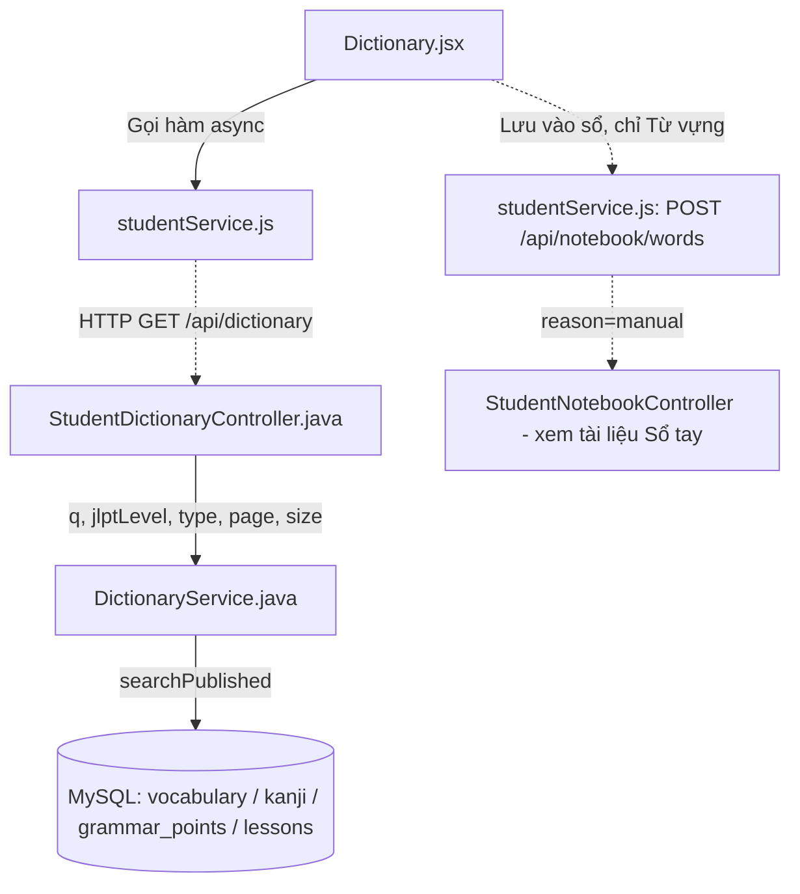
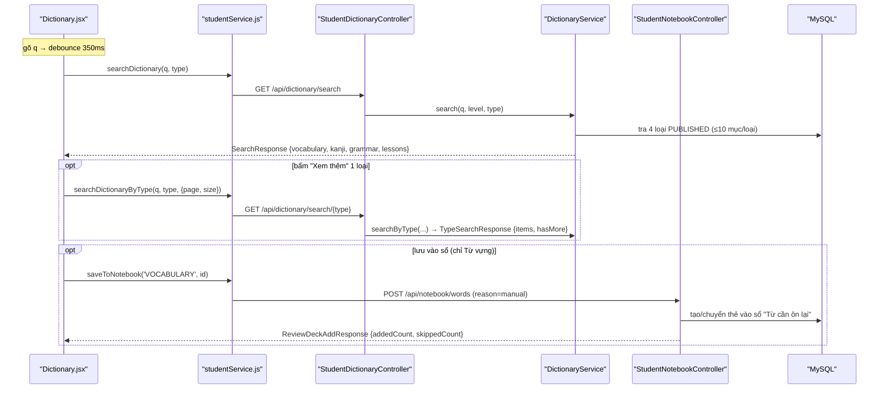

# Phân Tích Cấu Trúc – Luồng – Kết Nối Của Feature: Từ Điển (Dictionary)

> Tra cứu toàn bộ kho nội dung đã `PUBLISHED` của học viên (STUDENT). Backend thuộc package `feature.dictionary`.
> Hai tính năng anh em xem [flashcard_feature_analysis.md](flashcard_feature_analysis.md) và [notebook_feature_analysis.md](notebook_feature_analysis.md).

## 1. Tóm tắt tổng quan

Từ Điển cho phép học viên **tra cứu nhanh** 4 loại nội dung đã `PUBLISHED` — **Từ vựng / Kanji / Ngữ pháp / Bài học** — trong một lần tìm. Kết quả được gom nhóm theo loại (mỗi loại tối đa 10 mục overview), có nút "Xem thêm" phân trang theo từng loại, và nút "Lưu vào Sổ tay" (chỉ với Từ vựng) — là cửa ngõ đưa từ vào Sổ tay.

- **Tầng Frontend (React 18)**: trang `Dictionary.jsx` với ô tìm debounce 350ms, chip lọc theo loại, "Xem thêm", và **lịch sử tra cứu** lưu thuần client trong `localStorage`.
- **Tầng Backend (Spring Boot 3 + Java 21)**: Controller `StudentDictionaryController` → Service `DictionaryService` → 4 Repository nội dung (`Vocabulary`, `Kanji`, `GrammarPoint`, `Lesson`). Từ điển là **read-only**, không có trạng thái học phía server.
- **Điểm vào (Entry point)**:
  - FE: [App.jsx](apps/frontend/src/App.jsx#L107-L112) — route `/dictionary`.
  - BE: [StudentDictionaryController.java](apps/backend/src/main/java/com/jlpt/feature/dictionary/controller/StudentDictionaryController.java) — `/api/dictionary/*`.

---

## 2. Bản đồ cấu trúc (các "mảnh" và vai trò)

| File | Vai trò | Loại |
|------|---------|------|
| [Dictionary.jsx](apps/frontend/src/pages/dictionary/Dictionary.jsx) | Trang Từ điển: ô tìm debounce, chip lọc theo loại, "Xem thêm", lịch sử tra cứu (localStorage), nút "Lưu vào sổ". | Page (React) |
| [studentService.js](apps/frontend/src/api/studentService.js) | Gọi HTTP `searchDictionary`, `searchDictionaryByType`, `saveToNotebook` qua Axios. | API Service |
| [StudentDictionaryController.java](apps/backend/src/main/java/com/jlpt/feature/dictionary/controller/StudentDictionaryController.java) | Nhận `/api/dictionary/search` + `/api/dictionary/search/{type}`; `@PreAuthorize("hasRole('STUDENT')")`, `@Validated` (kiểm `page`/`size`). | Controller |
| [DictionaryService.java](apps/backend/src/main/java/com/jlpt/feature/dictionary/service/DictionaryService.java) | Tra 4 loại nội dung `PUBLISHED`, gom nhóm (overview 10 mục/loại) + phân trang theo loại; map Entity → DTO. | Service |
| [SearchResponse / TypeSearchResponse](apps/backend/src/main/java/com/jlpt/feature/dictionary/dto/) | DTO ra: gom nhóm 4 loại (`VocabItem`, `KanjiItem`, `GrammarItem`, `LessonItem`) và phân trang theo loại. | DTO |
| `Vocabulary/Kanji/GrammarPoint/Lesson` + Repository | Nội dung gốc (thuộc `feature.learning`); mỗi repo có `searchPublished(keyword, level, status, pageable)`. | Entity / Repository |
| `DictResultGroup / DictDetailPanel / DictGrammarPanel` | Component con hiển thị nhóm kết quả và chi tiết (suy vai trò từ props). | Component |

---

## 3. Bản đồ kết nối (ai gọi ai, dữ liệu truyền qua đâu)



**Bảng tra cứu kết nối chính:**

| Từ (File A) | Đến (File B) | Cách kết nối | Dữ liệu truyền |
|---|---|---|---|
| `Dictionary.jsx` | `studentService.js` | Gọi hàm async | `q, jlptLevel, type`; `{ page, size }`; `(contentType, contentId)` |
| `studentService.js` | `StudentDictionaryController` | HTTP GET | Query params `q`, `jlptLevel`, `type`, `page`, `size` |
| `StudentDictionaryController` | `DictionaryService` | Dependency Injection | `keyword`, `jlptLevel`, `type`, `page`, `size` |
| `DictionaryService` | 4 Repository nội dung | JPA `searchPublished` | `keyword`, `level`, `ContentStatus.PUBLISHED`, `PageRequest` |
| `Dictionary.jsx` (Lưu vào sổ) | `StudentNotebookController` | HTTP POST `/api/notebook/words` | `{ contentType:'VOCABULARY', contentId, reason:'manual' }` |

---

## 4. Luồng xử lý theo trình tự

**Ví dụ: Tra cứu và lưu vào sổ**

1. Gõ vào ô tìm → debounce 350ms → [useEffect](apps/frontend/src/pages/dictionary/Dictionary.jsx#L87-L104) gọi `searchDictionary(q, undefined, activeType)` → `GET /api/dictionary/search`.
2. [DictionaryService.search()](apps/backend/src/main/java/com/jlpt/feature/dictionary/service/DictionaryService.java#L35-L74): kiểm `keyword` không rỗng (ném `BadRequestException` nếu rỗng), parse `jlptLevel` (optional), tra tối đa **10 mục/loại** cho 4 loại `PUBLISHED`, trả `SearchResponse` gom nhóm. Nếu có `type` thì chỉ tra loại đó.
3. Bấm "Xem thêm" ở một loại → `searchDictionaryByType(q, type, { page, size })` → `GET /api/dictionary/search/{type}`. page-index khớp overview (`size` mặc định = 10): page 0 = đúng 10 mục overview, page 1+ nối tiếp; `hasMore` suy từ việc trang trả đủ `size` phần tử (tránh COUNT thừa).
4. Bấm "Lưu vào sổ" (chỉ Từ vựng) → `saveToNotebook('VOCABULARY', id)` → `POST /api/notebook/words` với `reason: 'manual'` (xem [notebook_feature_analysis.md](notebook_feature_analysis.md)).



---

## 5. Vai trò từng đoạn code quan trọng

### 1. Tra cứu tổng hợp 4 loại, gom nhóm overview
**File**: [DictionaryService.java](apps/backend/src/main/java/com/jlpt/feature/dictionary/service/DictionaryService.java) (dòng 35-74)
```java
public SearchResponse search(String keyword, String jlptLevel, String type) {
    if (keyword == null || keyword.isBlank())
        throw new BadRequestException("Từ khóa tìm kiếm không được để trống");

    StudentUser.JlptLevel level = JlptLevels.parseOptional(jlptLevel);
    PageRequest limit = PageRequest.of(0, MAX_RESULTS_PER_TYPE);   // 10 mục/loại

    // type == null → tra CẢ 4 loại; ngược lại chỉ loại được chỉ định (chip lọc FE).
    if (type == null || "VOCABULARY".equalsIgnoreCase(type))
        vocabulary = vocabularyRepository.searchPublished(keyword, level, PUBLISHED, limit).stream()
                .map(this::toVocabItem).toList();
    // ... KANJI / GRAMMAR / LESSON tương tự ...

    return new SearchResponse(keyword, vocabulary, kanji, grammar, lessons);
}
```
**Giải thích**: Một endpoint phục vụ cả tìm-tất-cả (chip "Tất cả") lẫn tìm-một-loại (`type`). Chỉ trả nội dung `PUBLISHED` (LESSON-003: học viên không thấy nội dung nháp). Mỗi loại giới hạn 10 mục để trang tổng quan gọn; muốn xem thêm thì gọi endpoint phân trang theo loại.

### 2. Phân trang "Xem thêm" — suy `hasMore` không cần COUNT
**File**: [DictionaryService.java](apps/backend/src/main/java/com/jlpt/feature/dictionary/service/DictionaryService.java) (dòng 81-118)
```java
public TypeSearchResponse searchByType(String keyword, String jlptLevel, String type, int page, int size) {
    // ... validate keyword + type ...
    int capped = Math.min(Math.max(size, 1), 50);          // chặn size 1..50
    PageRequest pageable = PageRequest.of(Math.max(page, 0), capped);

    List<Object> items = switch (type.toUpperCase()) {
        case "VOCABULARY" -> vocabularyRepository.searchPublished(keyword, level, pub, pageable).stream()
                .map(this::toVocabItem).map(Object.class::cast).toList();
        // ... KANJI / GRAMMAR / LESSON ...
        default -> throw new BadRequestException("Loại không hợp lệ: " + type);
    };

    boolean hasMore = items.size() == capped;   // trang đầy → đoán còn trang sau (tránh COUNT thừa)
    return new TypeSearchResponse(type.toUpperCase(), items, hasMore);
}
```
**Giải thích**: `hasMore` được **suy** từ việc trang trả về đủ `size` phần tử, tránh một truy vấn `COUNT(*)` riêng — đủ tốt cho cuộn "Xem thêm". `size` bị chặn cứng 1..50 ở Service (và Controller kiểm 1..100 bằng `@Min`/`@Max`), chống client đòi trang quá lớn.

### 3. Map Entity → DTO (đổi tên field, không lộ Entity ra API)
**File**: [DictionaryService.java](apps/backend/src/main/java/com/jlpt/feature/dictionary/service/DictionaryService.java) (dòng 120-159)
```java
private SearchResponse.VocabItem toVocabItem(Vocabulary v) {
    return new SearchResponse.VocabItem(
            v.getId(), v.getWord(), v.getFurigana(), v.getMeaning(), v.getWordType(),
            v.getJlptLevel() != null ? v.getJlptLevel().name() : null,
            v.getTopicRef() != null ? v.getTopicRef().getTitleVi() : null,   // topic → titleVi
            v.getExampleSentenceJp(), v.getExampleSentenceVi(), v.getAudioUrl());
}
```
**Giải thích**: Tuân ADR-005 (DTO Pattern) — Controller chỉ trả DTO, Entity được map tại Service. Field được đổi tên/làm phẳng cho FE (`example_sentence_jp` → `exampleJp`, quan hệ `topicRef` → `topicTitle`), enum `JlptLevel` chuyển sang `String`.

---

## 6. Dữ liệu di chuyển như thế nào

1. **Từ khóa `q`**: FE gửi query param (đã debounce 350ms) → Controller nhận `@RequestParam String q` → Service kiểm rỗng.
2. **Kết quả**: Service tra 4 repo, map Entity → `SearchResponse.*Item` (đổi tên field, enum → String) → JSON → FE hiển thị theo nhóm. **Không** lưu gì phía server.
3. **Lịch sử tra cứu**: thuần client — FE lưu tối đa 8 mục trong `localStorage` (`sakuji.dict.history`), không gọi backend.
4. **Lưu vào sổ**: FE chỉ gửi `{ contentType:'VOCABULARY', contentId:<vocabulary_id> }` (con trỏ, không copy nội dung) sang `/api/notebook/words` — đây là điểm nối duy nhất giữa Từ điển và phần lưu trữ; bản thân Từ điển không ghi dữ liệu.

---

## 7. Input / Output / Progress / Target

| Khía cạnh | Chi tiết |
|---|---|
| **Input** | Tìm tổng hợp: `q` (bắt buộc), `jlptLevel?`, `type?` (VOCABULARY/KANJI/GRAMMAR/LESSON). "Xem thêm" theo loại: `q, type, page(≥0), size(1–100, capped 50)`. |
| **Output** | `SearchResponse { keyword, vocabulary[], kanji[], grammar[], lessons[] }` (mỗi loại tối đa 10 mục overview); `TypeSearchResponse { type, items[], hasMore }` khi phân trang. |
| **Progress** | Không có trạng thái học phía server. FE tự lưu **lịch sử tra cứu** (tối đa 8) trong `localStorage` — thuần client. |
| **Target** | **Tra cứu nhanh** toàn kho nội dung đã `PUBLISHED`, lọc theo loại/cấp độ; là cửa ngõ đưa từ vào Sổ tay (nút "Lưu vào sổ", chỉ với từ vựng). |

---

## 8. Bảng tra cứu tổng hợp (endpoint)

| Bước | Method + Path | FE function | Service | Input | Output |
|---|---|---|---|---|---|
| Tìm tổng hợp | `GET /api/dictionary/search` | `searchDictionary` | `DictionaryService.search` | `q, jlptLevel?, type?` | `SearchResponse` |
| Xem thêm theo loại | `GET /api/dictionary/search/{type}` | `searchDictionaryByType` | `DictionaryService.searchByType` | `q, jlptLevel?, page, size` | `TypeSearchResponse` |
| Lưu vào sổ (nối) | `POST /api/notebook/words` | `saveToNotebook` | `NotebookService.addWrongWordsToReviewDeck` | `{ contentType, contentId, reason:'manual' }` | `ReviewDeckAddResponse` |

> Toàn bộ endpoint Từ điển yêu cầu `@PreAuthorize("hasRole('STUDENT')")`; Controller gắn `@Validated` để kiểm `page`/`size` ngay ở tầng nhận request.

---

## 9. Các mục cần bổ sung context (nếu có)

- **`searchPublished` của 4 repository**: JPQL cụ thể (LIKE trên field nào, có index chưa) thuộc `feature.learning`; ở đây chỉ suy vai trò từ chữ ký `searchPublished(keyword, level, status, pageable)`.
- **Component con** (`DictResultGroup`, `DictDetailPanel`, `DictGrammarPanel`): chỉ khảo sát trang cha `Dictionary.jsx`; vai trò suy từ props truyền vào.
- **Lưu vào sổ chỉ với Từ vựng**: hiện chỉ `VOCABULARY` có nút "Lưu vào sổ"; Kanji/Ngữ pháp/Bài học chưa có luồng đưa vào Sổ tay (Sổ "Từ cần ôn lại" hiện là deck `VOCABULARY`).
