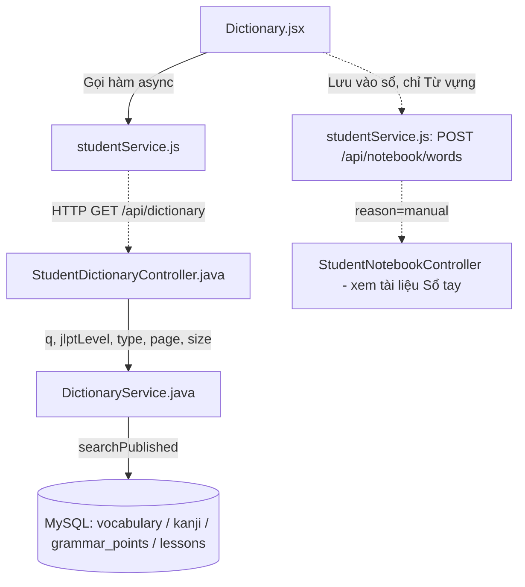
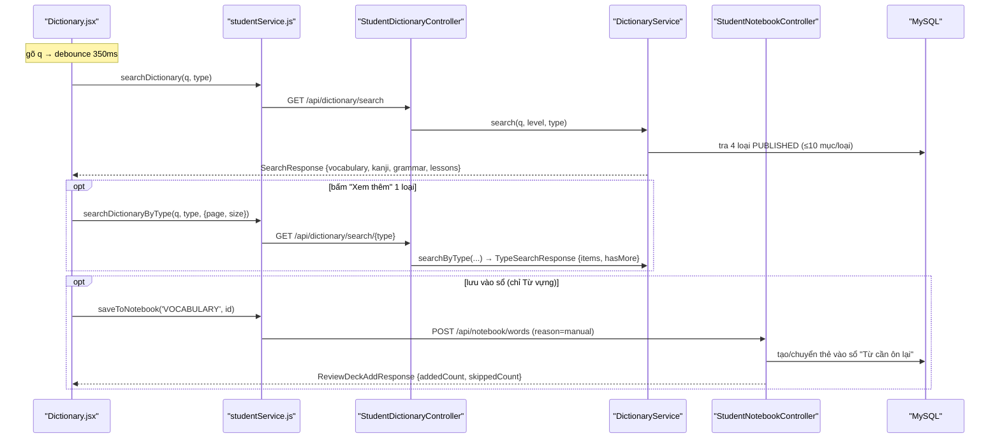

# Phân Tích Cấu Trúc – Luồng – Kết Nối Của Feature: Từ Điển (Dictionary)

> Tra cứu toàn bộ kho nội dung đã `PUBLISHED` của học viên (STUDENT). Backend thuộc package `feature.dictionary`.
> Hai tính năng anh em xem [flashcard_feature_analysis.md](flashcard_feature_analysis.md) và [notebook_feature_analysis.md](notebook_feature_analysis.md).
>
> _Cập nhật 2026-07-26: FE đã tái cấu trúc sang Feature-Based Architecture (commit `9915c443`) — `Dictionary.jsx` sang `src/features/dictionary/dictionary/`, 3 component `Dict*` sang `src/features/dashboard/student/`, `studentService.js` sang `src/shared/api/`; import dùng alias `@/`. Backend (`feature.dictionary`) không đổi._

## 0. Ghi nhớ nhanh (cheat-sheet)

**Câu thần chú**: *"Từ điển chỉ đọc. Nó không ghi gì — trừ khi bạn bấm 'Lưu vào sổ'."*

| # | Điều cần nhớ | Vì sao dễ quên / dễ sai |
|---|---|---|
| 1 | **Read-only tuyệt đối** — không có trạng thái học phía server | Toàn bộ tính năng chỉ có 2 endpoint `GET`; mọi thứ ghi dữ liệu đều là của Sổ tay |
| 2 | **1 lần tìm = 4 loại**: Từ vựng / Kanji / Ngữ pháp / Bài học, mỗi loại **tối đa 10 mục** | `MAX_RESULTS_PER_TYPE = 10` là hằng số overview, không phải giới hạn toàn cục |
| 3 | **Cùng 1 endpoint cho "Tất cả" và lọc 1 loại** — khác nhau ở param `type` | `type == null` → tra cả 4; có `type` → chỉ tra loại đó |
| 4 | **`hasMore` được ĐOÁN, không đếm**: trang trả đủ `size` phần tử ⇒ coi như còn trang sau | Tránh một truy vấn `COUNT(*)`; hệ quả: trang cuối vừa đủ 10 mục sẽ hiện nút "Xem thêm" thừa 1 lần |
| 5 | **`page 0` = đúng 10 mục overview** → "Xem thêm" bắt đầu từ `page 1` | Nếu lấy `page 0` cho lần "Xem thêm" đầu tiên sẽ hiển thị trùng 10 mục đã có |
| 6 | **Lịch sử tra cứu là 100% client** — `localStorage['sakuji.dict.history']`, tối đa 8 mục | Đừng đi tìm bảng lịch sử trong DB, không có |
| 7 | **Chỉ Từ vựng mới có nút "Lưu vào sổ"** | Sổ "Từ cần ôn lại" hiện là deck thuần `VOCABULARY` |
| 8 | Chỉ trả nội dung **`PUBLISHED`** (LESSON-003) | Lesson dùng enum `LessonStatus`, 3 loại kia dùng `ContentStatus` — khác kiểu |
| 9 | **Từ điển và màn Từ vựng tra CÙNG bảng `vocabulary` nhưng bằng 2 query khác nhau** | `searchPublished` (Từ điển) không lọc `topicId` và không kèm tiến độ; `findPublished` (Từ vựng) thì có — xem [§10](#10-liên-quan-từ-vựng-vocabulary--nguồn-dữ-liệu-và-ranh-giới) |

**Sơ đồ 1 dòng**: `gõ → debounce 350ms → GET /search (4 loại × 10) → [Xem thêm] GET /search/{type}?page=n → [Lưu vào sổ] POST /notebook/words`

---

## 1. Tóm tắt tổng quan

Từ Điển cho phép học viên **tra cứu nhanh** 4 loại nội dung đã `PUBLISHED` — **Từ vựng / Kanji / Ngữ pháp / Bài học** — trong một lần tìm. Kết quả được gom nhóm theo loại (mỗi loại tối đa 10 mục overview), có nút "Xem thêm" phân trang theo từng loại, và nút "Lưu vào Sổ tay" (chỉ với Từ vựng) — là cửa ngõ đưa từ vào Sổ tay.

- **Tầng Frontend (React 18)**: trang `Dictionary.jsx` với ô tìm debounce 350ms, chip lọc theo loại, "Xem thêm", và **lịch sử tra cứu** lưu thuần client trong `localStorage`.
- **Tầng Backend (Spring Boot 3 + Java 21)**: Controller `StudentDictionaryController` → Service `DictionaryService` → 4 Repository nội dung (`Vocabulary`, `Kanji`, `GrammarPoint`, `Lesson`). Từ điển là **read-only**, không có trạng thái học phía server.
- **Điểm vào (Entry point)**:
  - FE: [App.jsx](apps/frontend/src/App.jsx#L106-L110) — route `/dictionary`.
  - BE: [StudentDictionaryController.java](apps/backend/src/main/java/com/jlpt/feature/dictionary/controller/StudentDictionaryController.java) — `/api/dictionary/*`.

### 1.1 Chức năng tương ứng

| Chức năng | Người dùng thao tác | API / hàm xử lý | Tác dụng chính |
|---|---|---|---|
| Tra cứu tổng hợp | Nhập từ khóa vào ô tìm kiếm | `GET /api/dictionary/search` → `DictionaryService.search()` | Tìm đồng thời Từ vựng, Kanji, Ngữ pháp và Bài học đã `PUBLISHED`; mỗi nhóm trả tối đa 10 kết quả overview. |
| Lọc theo loại nội dung | Chọn chip `VOCABULARY`, `KANJI`, `GRAMMAR`, `LESSON` | `searchDictionary(q, jlptLevel, type)` | Giới hạn kết quả về đúng một loại nội dung để giảm nhiễu và giảm số query backend. |
| Xem thêm kết quả | Bấm "Xem thêm" ở từng nhóm | `GET /api/dictionary/search/{type}` → `DictionaryService.searchByType()` | Phân trang riêng theo từng loại nội dung, nối thêm kết quả vào nhóm đang xem. |
| Xem chi tiết mục tra cứu | Bấm vào một kết quả | `DictDetailPanel` / `DictGrammarPanel` | Mở panel chi tiết từ dữ liệu đã tải; không gọi API mới và không ghi DB. |
| Lưu từ vào Sổ tay | Bấm "Lưu vào sổ" trên kết quả Từ vựng | `POST /api/notebook/words` → `NotebookService.addWrongWordsToReviewDeck()` | Tạo hoặc chuyển thẻ `VOCABULARY` vào sổ "Từ cần ôn lại" với `reason = manual`. |
| Lịch sử tra cứu | Bấm lại từ khóa cũ hoặc xóa lịch sử | `localStorage['sakuji.dict.history']` | Lưu tối đa 8 từ khóa gần nhất trên client, giúp tra lại nhanh; không có lịch sử server-side. |

---
---

## 2. Bản đồ cấu trúc (các "mảnh" và vai trò)

| File | Vai trò | Loại |
|------|---------|------|
| [Dictionary.jsx](apps/frontend/src/features/dictionary/dictionary/Dictionary.jsx) | Trang Từ điển: ô tìm debounce, chip lọc theo loại, "Xem thêm", lịch sử tra cứu (localStorage), nút "Lưu vào sổ". | Page (React) |
| [studentService.js](apps/frontend/src/shared/api/studentService.js) | Gọi HTTP `searchDictionary`, `searchDictionaryByType`, `saveToNotebook` qua Axios. | API Service |
| [StudentDictionaryController.java](apps/backend/src/main/java/com/jlpt/feature/dictionary/controller/StudentDictionaryController.java) | Nhận `/api/dictionary/search` + `/api/dictionary/search/{type}`; `@PreAuthorize("hasRole('STUDENT')")`, `@Validated` (kiểm `page`/`size`). | Controller |
| [DictionaryService.java](apps/backend/src/main/java/com/jlpt/feature/dictionary/service/DictionaryService.java) | Tra 4 loại nội dung `PUBLISHED`, gom nhóm (overview 10 mục/loại) + phân trang theo loại; map Entity → DTO. | Service |
| [SearchResponse / TypeSearchResponse](apps/backend/src/main/java/com/jlpt/feature/dictionary/dto/) | DTO ra: gom nhóm 4 loại (`VocabItem`, `KanjiItem`, `GrammarItem`, `LessonItem`) và phân trang theo loại. | DTO |
| `Vocabulary/Kanji/GrammarPoint/Lesson` + Repository | Nội dung gốc (thuộc `feature.learning`); mỗi repo có `searchPublished(keyword, level, status, pageable)` — Lesson dùng enum `LessonStatus`, 3 loại còn lại dùng `ContentStatus`. | Entity / Repository |
| [DictResultGroup](apps/frontend/src/features/dashboard/student/DictResultGroup.jsx) / [DictDetailPanel](apps/frontend/src/features/dashboard/student/DictDetailPanel.jsx) / [DictGrammarPanel](apps/frontend/src/features/dashboard/student/DictGrammarPanel.jsx) | Component con hiển thị nhóm kết quả và chi tiết (suy vai trò từ props). | Component |

---

## 3. Bản đồ kết nối (ai gọi ai, dữ liệu truyền qua đâu)


```mermaid
graph TD
    UI["Dictionary.jsx"] -->|Gọi hàm async| SVC["studentService.js"]
    SVC -.->|HTTP GET /api/dictionary| Dcc["StudentDictionaryController.java"]
    Dcc -->|q, jlptLevel, type, page, size| Dcs["DictionaryService.java"]
    Dcs -->|searchPublished| DB[("MySQL: vocabulary / kanji / grammar_points / lessons")]
    UI -.->|Lưu vào sổ, chỉ Từ vựng| SVC2["studentService.js: POST /api/notebook/words"]
    SVC2 -.->|reason=manual| NBC["StudentNotebookController - xem tài liệu Sổ tay"]
```

**Bảng tra cứu kết nối chính:**

| Từ (File A) | Đến (File B) | Cách kết nối | Dữ liệu truyền |
|---|---|---|---|
| `Dictionary.jsx` | `studentService.js` | Gọi hàm async | `q, jlptLevel, type`; `{ page, size }`; `(contentType, contentId)` |
| `studentService.js` | `StudentDictionaryController` | HTTP GET | Query params `q`, `jlptLevel`, `type`, `page`, `size` |
| `StudentDictionaryController` | `DictionaryService` | Dependency Injection | `keyword`, `jlptLevel`, `type`, `page`, `size` |
| `DictionaryService` | 4 Repository nội dung | JPA `searchPublished` | `keyword`, `level`, `ContentStatus.PUBLISHED`, `PageRequest` |
| `Dictionary.jsx` (Lưu vào sổ) | `StudentNotebookController` | HTTP POST `/api/notebook/words` | `{ contentType:'VOCABULARY', contentId, reason:'manual' }` |

---

## 4. Luồng xử lý theo trình tự

**Ví dụ: Tra cứu và lưu vào sổ**

1. Gõ vào ô tìm → debounce 350ms → [useEffect](apps/frontend/src/features/dictionary/dictionary/Dictionary.jsx#L87-L104) gọi `searchDictionary(q, undefined, activeType)` → `GET /api/dictionary/search`.
2. [DictionaryService.search()](apps/backend/src/main/java/com/jlpt/feature/dictionary/service/DictionaryService.java#L35-L74): kiểm `keyword` không rỗng (ném `BadRequestException` nếu rỗng), parse `jlptLevel` (optional), tra tối đa **10 mục/loại** cho 4 loại `PUBLISHED`, trả `SearchResponse` gom nhóm. Nếu có `type` thì chỉ tra loại đó.
3. Bấm "Xem thêm" ở một loại → `searchDictionaryByType(q, type, { page, size })` → `GET /api/dictionary/search/{type}`. page-index khớp overview (`size` mặc định = 10): page 0 = đúng 10 mục overview, page 1+ nối tiếp; `hasMore` suy từ việc trang trả đủ `size` phần tử (tránh COUNT thừa).
4. Bấm "Lưu vào sổ" (chỉ Từ vựng) → `saveToNotebook('VOCABULARY', id)` → `POST /api/notebook/words` với `reason: 'manual'` (xem [notebook_feature_analysis.md](notebook_feature_analysis.md)).


```mermaid
sequenceDiagram
    participant UI as "Dictionary.jsx"
    participant API as "studentService.js"
    participant Dcc as "StudentDictionaryController"
    participant Dcs as "DictionaryService"
    participant Nbc as "StudentNotebookController"
    participant DB as "MySQL"

    Note over UI: gõ q → debounce 350ms
    UI->>API: searchDictionary(q, type)
    API->>Dcc: GET /api/dictionary/search
    Dcc->>Dcs: search(q, level, type)
    Dcs->>DB: tra 4 loại PUBLISHED (≤10 mục/loại)
    Dcs-->>UI: SearchResponse {vocabulary, kanji, grammar, lessons}

    opt bấm "Xem thêm" 1 loại
        UI->>API: searchDictionaryByType(q, type, {page, size})
        API->>Dcc: GET /api/dictionary/search/{type}
        Dcc->>Dcs: searchByType(...) → TypeSearchResponse {items, hasMore}
    end

    opt lưu vào sổ (chỉ Từ vựng)
        UI->>API: saveToNotebook('VOCABULARY', id)
        API->>Nbc: POST /api/notebook/words (reason=manual)
        Nbc->>DB: tạo/chuyển thẻ vào sổ "Từ cần ôn lại"
        Nbc-->>UI: ReviewDeckAddResponse {addedCount, skippedCount}
    end
```

### 4.1 Bấm vào đâu → nhảy vào hàm nào (click-trace)

| Thao tác trên UI | 1️⃣ FE handler | 2️⃣ FE service | 3️⃣ HTTP | 4️⃣ Controller | 5️⃣ Service (nơi xử lý thật) | Ghi DB? |
|---|---|---|---|---|---|---|
| **Gõ vào ô tìm** | [`onQueryChange()`](apps/frontend/src/features/dictionary/dictionary/Dictionary.jsx#L60-L67) → chờ 350ms → [`useEffect`](apps/frontend/src/features/dictionary/dictionary/Dictionary.jsx#L87-L104) | [`searchDictionary()`](apps/frontend/src/shared/api/studentService.js#L228-L231) | `GET /api/dictionary/search?q=` | [`search()`](apps/backend/src/main/java/com/jlpt/feature/dictionary/controller/StudentDictionaryController.java#L29-L36) | [`DictionaryService.search()`](apps/backend/src/main/java/com/jlpt/feature/dictionary/service/DictionaryService.java#L35-L74) → 4× `searchPublished()` → [`toVocabItem()`](apps/backend/src/main/java/com/jlpt/feature/dictionary/service/DictionaryService.java#L120-L132) | ❌ chỉ đọc |
| **Bấm chip lọc loại** | [`setActiveType()`](apps/frontend/src/features/dictionary/dictionary/Dictionary.jsx#L215) → `useEffect` chạy lại | như trên, kèm `type` | `GET …&type=KANJI` | như trên | như trên, chỉ tra **1 loại** (`if (type == null \|\| …)`) | ❌ chỉ đọc |
| **Bấm "Xem thêm"** ở 1 nhóm | [`handleMore()`](apps/frontend/src/features/dictionary/dictionary/Dictionary.jsx#L107-L127) *(`nextPage = cur ? cur.page + 1 : 1`)* | [`searchDictionaryByType()`](apps/frontend/src/shared/api/studentService.js#L235-L240) | `GET /api/dictionary/search/{type}?page=` | [`searchByType()`](apps/backend/src/main/java/com/jlpt/feature/dictionary/controller/StudentDictionaryController.java#L39-L51) *(`@Min`/`@Max` chặn page/size)* | [`DictionaryService.searchByType()`](apps/backend/src/main/java/com/jlpt/feature/dictionary/service/DictionaryService.java#L81-L117) *(size capped 1..50, `hasMore` suy ra)* | ❌ chỉ đọc |
| **Bấm 1 kết quả** để xem chi tiết | [`onOpen` → `setSelected()`](apps/frontend/src/features/dictionary/dictionary/Dictionary.jsx#L293) *(ngữ pháp: [L305](apps/frontend/src/features/dictionary/dictionary/Dictionary.jsx#L305))* → `DictDetailPanel` / `DictGrammarPanel` | — | — | — | — | ❌ **thuần FE** (dùng lại data đã tải) |
| **Bấm "Lưu vào sổ"** (chỉ Từ vựng) | [`handleSave()`](apps/frontend/src/features/dictionary/dictionary/Dictionary.jsx#L141-L158) | [`saveToNotebook()`](apps/frontend/src/shared/api/studentService.js#L218-L224) | `POST /api/notebook/words` *(`reason: 'manual'`)* | [`addWords()`](apps/backend/src/main/java/com/jlpt/feature/flashcard/controller/StudentNotebookController.java#L77-L83) ⚠️ **controller khác** | [`NotebookService.addWrongWordsToReviewDeck()`](apps/backend/src/main/java/com/jlpt/feature/flashcard/service/NotebookService.java#L137-L180) | ✅ **lần duy nhất ghi DB** |
| **Bấm 1 mục lịch sử tra cứu** | [`runHistorySearch()`](apps/frontend/src/features/dictionary/dictionary/Dictionary.jsx#L81-L85) → đặt lại `debounced` → `useEffect` | như dòng 1 | như dòng 1 | như dòng 1 | như dòng 1 | ❌ chỉ đọc |
| **Bấm "Xóa lịch sử"** | [`clearHistory()`](apps/frontend/src/features/dictionary/dictionary/Dictionary.jsx#L79) | — | — | — | — | ❌ **chỉ `localStorage`** |
| Bấm nút **Sổ tay** ở đầu trang | [`navigate('/notebook')`](apps/frontend/src/features/dictionary/dictionary/Dictionary.jsx#L176) | — | — | — | — | ❌ chỉ điều hướng |

> **3 bẫy hay gặp khi lần theo luồng**
> 1. Trong cả tính năng, **chỉ đúng một thao tác ghi DB**: "Lưu vào sổ" — và nó chạy sang `NotebookService`, không phải `DictionaryService`.
> 2. Gõ phím **không** gọi API ngay: có debounce 350ms; `useEffect` chỉ chạy khi `debounced` đổi.
> 3. "Xem thêm" dùng endpoint **khác** với ô tìm (`/search/{type}` vs `/search`) và bắt đầu ở `page 1`, vì `page 0` chính là 10 mục overview đã hiển thị.

### 4.2 Vào endpoint nào → chạy hàm nào ở backend (call-trace BE)

Phần trên dừng ở cột "Service". Phần này đi tiếp **bên trong backend** theo đúng thứ tự thực thi.

#### A. `GET /api/dictionary/search` — tra tổng hợp

```
SecurityFilterChain → JwtAuthenticationFilter → UserDetailsImpl
└─ @PreAuthorize("hasRole('STUDENT')") + @Validated       ← cấp LỚP StudentDictionaryController
   └─ StudentDictionaryController.search(q, jlptLevel, type)                   [L29-36]
      │   ⚠️ q là @RequestParam BẮT BUỘC → thiếu hẳn param = 400 do Spring ném
      │      (MissingServletRequestParameterException), CHƯA vào Service
      └─ DictionaryService.search()      @Transactional(readOnly = true)       [L35-74]
         ├─ 1. keyword null/blank → BadRequestException  ← chỉ bắt được `q=` RỖNG
         ├─ 2. JlptLevels.parseOptional(jlptLevel)       🧠 null nếu không truyền
         ├─ 3. PageRequest.of(0, MAX_RESULTS_PER_TYPE = 10)
         ├─ 4. if (type == null || "VOCABULARY")
         │       vocabularyRepository.searchPublished(q, level, PUBLISHED, limit)
         │         → .map(this::toVocabItem)                📖 SELECT vocabulary
         ├─ 5. if (type == null || "KANJI")   kanjiRepository.searchPublished
         │                                                  📖 SELECT kanji
         ├─ 6. if (type == null || "GRAMMAR") grammarPointRepository.searchPublished
         │                                                  📖 SELECT grammar_points
         ├─ 7. if (type == null || "LESSON")  lessonRepository.searchPublished
         │       ⚠️ tham số status là Lesson.LessonStatus.PUBLISHED — KHÁC KIỂU 3 loại trên
         │                                                  📖 SELECT lessons
         └─ 8. new SearchResponse(keyword, vocabulary, kanji, grammar, lessons)
```

⚠️ **4 query chạy tuần tự trong cùng một transaction**, không song song → thời gian phản hồi của chip "Tất cả" ≈ tổng 4 query. Chọn một chip loại cụ thể chỉ chạy **1** query.

#### B. `GET /api/dictionary/search/{type}` — "Xem thêm"

```
StudentDictionaryController.searchByType()                                     [L39-51]
│   @PathVariable type · @RequestParam q (bắt buộc)
│   @Min(0) page · @Min(1) @Max(100) size    ← chỉ có hiệu lực nhờ @Validated ở cấp lớp;
│                                              vi phạm → ConstraintViolationException (400)
└─ DictionaryService.searchByType()                                            [L81-118]
   ├─ 1. keyword blank → BadRequestException
   ├─ 2. type null/blank → BadRequestException("Tham số 'type' là bắt buộc")
   ├─ 3. capped = min(max(size, 1), 50)     ⚠️ CHẶN LẦN HAI, chặt hơn @Max(100) ở Controller
   ├─ 4. PageRequest.of(max(page, 0), capped)
   ├─ 5. switch (type.toUpperCase())
   │       VOCABULARY → vocabularyRepository.searchPublished  📖 SELECT vocabulary
   │       KANJI      → kanjiRepository.searchPublished       📖 SELECT kanji
   │       GRAMMAR    → grammarPointRepository.searchPublished 📖 SELECT grammar_points
   │       LESSON     → lessonRepository.searchPublished       📖 SELECT lessons
   │       default    → BadRequestException("Loại không hợp lệ: …")
   └─ 6. hasMore = items.size() == capped   🧠 ĐOÁN, không COUNT
```

Hệ quả của **hai tầng chặn `size`**: client gửi `size=100` qua được `@Max(100)` ở Controller nhưng bị Service ghì xuống 50 — và `hasMore` so với `capped` (50), nên vẫn nhất quán. Nhưng FE nhận về 50 mục dù xin 100, **không có cảnh báo nào**.

#### C. Bảng tra: repository → JPQL → bảng → đọc/ghi

| Repository method | JPQL / điều kiện | Bảng | Đọc/Ghi |
|---|---|---|---|
| [`VocabularyRepository.searchPublished`](apps/backend/src/main/java/com/jlpt/feature/learning/VocabularyRepository.java#L16-L30) | `status = :status AND (:jlptLevel IS NULL OR …) AND (word LIKE '%q%' OR furigana LIKE '%q%' OR meaning LIKE '%q%') ORDER BY word ASC` | `vocabulary` | 📖 |
| `KanjiRepository.searchPublished` | cùng khuôn, `status` kiểu `ContentStatus` | `kanji` | 📖 |
| `GrammarPointRepository.searchPublished` | cùng khuôn, `status` kiểu `ContentStatus` | `grammar_points` | 📖 |
| `LessonRepository.searchPublished` | cùng khuôn nhưng `status` kiểu **`LessonStatus`** | `lessons` | 📖 |
| *(nối sang Sổ tay)* `NotebookService.addWrongWordsToReviewDeck` | xem [notebook_feature_analysis.md](notebook_feature_analysis.md) §4.2 | `flashcards`, `flashcard_decks` | ✍️ |

**Toàn bộ `DictionaryService` là `@Transactional(readOnly = true)` ở cấp lớp** — không có đường nào ghi DB. Mọi thao tác ghi phát sinh từ trang Từ điển đều rời sang `NotebookService`.

#### D. 4 bẫy chỉ lộ ra khi đọc backend

1. **Hai loại lỗi 400 khác nhau cho cùng một ô tìm**: thiếu hẳn `q` → Spring ném `MissingServletRequestParameterException`; gửi `q=` rỗng → `BadRequestException` của Service. Thông điệp trả về khác nhau, cùng status 400.
2. **Bỏ `@Validated` ở cấp lớp là các `@Min`/`@Max` bị bỏ qua âm thầm** — không có lỗi biên dịch, chỉ là `page=-5` lọt qua Controller (rồi được `Math.max(page, 0)` cứu ở Service).
3. **`status` không cùng kiểu giữa 4 repo.** Vocabulary/Kanji/Grammar nhận `Kanji.ContentStatus.PUBLISHED`, còn Lesson nhận `Lesson.LessonStatus.PUBLISHED`. Copy-paste một nhánh sang nhánh khác sẽ không biên dịch được — đó là điều may.
4. **`LIKE '%q%'` trên 3 cột không dùng được index prefix.** Với 4 loại chạy tuần tự, endpoint `/search` (chip "Tất cả") là chỗ chậm nhất của tính năng; đo ở đây trước khi tối ưu chỗ khác.

---

## 5. Vai trò từng đoạn code quan trọng

### 1. Tra cứu tổng hợp 4 loại, gom nhóm overview
**File**: [DictionaryService.java](apps/backend/src/main/java/com/jlpt/feature/dictionary/service/DictionaryService.java) (dòng 35-74)
```java
public SearchResponse search(String keyword, String jlptLevel, String type) {
    if (keyword == null || keyword.isBlank())
        throw new BadRequestException("Từ khóa tìm kiếm không được để trống");

    StudentUser.JlptLevel level = JlptLevels.parseOptional(jlptLevel);
    PageRequest limit = PageRequest.of(0, MAX_RESULTS_PER_TYPE);   // 10 mục/loại

    // type == null → tra CẢ 4 loại; ngược lại chỉ loại được chỉ định (chip lọc FE).
    if (type == null || "VOCABULARY".equalsIgnoreCase(type))
        vocabulary = vocabularyRepository.searchPublished(keyword, level, PUBLISHED, limit).stream()
                .map(this::toVocabItem).toList();
    // ... KANJI / GRAMMAR / LESSON tương tự ...

    return new SearchResponse(keyword, vocabulary, kanji, grammar, lessons);
}
```
**Giải thích**: Một endpoint phục vụ cả tìm-tất-cả (chip "Tất cả") lẫn tìm-một-loại (`type`). Chỉ trả nội dung `PUBLISHED` (LESSON-003: học viên không thấy nội dung nháp). Mỗi loại giới hạn 10 mục để trang tổng quan gọn; muốn xem thêm thì gọi endpoint phân trang theo loại.

### 2. Phân trang "Xem thêm" — suy `hasMore` không cần COUNT
**File**: [DictionaryService.java](apps/backend/src/main/java/com/jlpt/feature/dictionary/service/DictionaryService.java) (dòng 81-118)
```java
public TypeSearchResponse searchByType(String keyword, String jlptLevel, String type, int page, int size) {
    // ... validate keyword + type ...
    int capped = Math.min(Math.max(size, 1), 50);          // chặn size 1..50
    PageRequest pageable = PageRequest.of(Math.max(page, 0), capped);

    List<Object> items = switch (type.toUpperCase()) {
        case "VOCABULARY" -> vocabularyRepository.searchPublished(keyword, level, pub, pageable).stream()
                .map(this::toVocabItem).map(Object.class::cast).toList();
        // ... KANJI / GRAMMAR / LESSON ...
        default -> throw new BadRequestException("Loại không hợp lệ: " + type);
    };

    boolean hasMore = items.size() == capped;   // trang đầy → đoán còn trang sau (tránh COUNT thừa)
    return new TypeSearchResponse(type.toUpperCase(), items, hasMore);
}
```
**Giải thích**: `hasMore` được **suy** từ việc trang trả về đủ `size` phần tử, tránh một truy vấn `COUNT(*)` riêng — đủ tốt cho cuộn "Xem thêm". `size` bị chặn cứng 1..50 ở Service (và Controller kiểm 1..100 bằng `@Min`/`@Max`), chống client đòi trang quá lớn.

### 3. Map Entity → DTO (đổi tên field, không lộ Entity ra API)
**File**: [DictionaryService.java](apps/backend/src/main/java/com/jlpt/feature/dictionary/service/DictionaryService.java) (dòng 120-159)
```java
private SearchResponse.VocabItem toVocabItem(Vocabulary v) {
    return new SearchResponse.VocabItem(
            v.getId(), v.getWord(), v.getFurigana(), v.getMeaning(), v.getWordType(),
            v.getJlptLevel() != null ? v.getJlptLevel().name() : null,
            v.getTopicRef() != null ? v.getTopicRef().getTitleVi() : null,   // topic → titleVi
            v.getExampleSentenceJp(), v.getExampleSentenceVi(), v.getAudioUrl());
}
```
**Giải thích**: Tuân ADR-005 (DTO Pattern) — Controller chỉ trả DTO, Entity được map tại Service. Field được đổi tên/làm phẳng cho FE (`example_sentence_jp` → `exampleJp`, quan hệ `topicRef` → `topicTitle`), enum `JlptLevel` chuyển sang `String`.

---

## 6. Dữ liệu di chuyển như thế nào

1. **Từ khóa `q`**: FE gửi query param (đã debounce 350ms) → Controller nhận `@RequestParam String q` → Service kiểm rỗng.
2. **Kết quả**: Service tra 4 repo, map Entity → `SearchResponse.*Item` (đổi tên field, enum → String) → JSON → FE hiển thị theo nhóm. **Không** lưu gì phía server.
3. **Lịch sử tra cứu**: thuần client — FE lưu tối đa 8 mục trong `localStorage` (`sakuji.dict.history`), không gọi backend.
4. **Lưu vào sổ**: FE chỉ gửi `{ contentType:'VOCABULARY', contentId:<vocabulary_id> }` (con trỏ, không copy nội dung) sang `/api/notebook/words` — đây là điểm nối duy nhất giữa Từ điển và phần lưu trữ; bản thân Từ điển không ghi dữ liệu.

---

## 7. Input / Output / Progress / Target

| Khía cạnh | Chi tiết |
|---|---|
| **Input** | Tìm tổng hợp: `q` (bắt buộc), `jlptLevel?`, `type?` (VOCABULARY/KANJI/GRAMMAR/LESSON). "Xem thêm" theo loại: `q, type, page(≥0), size(1–100, capped 50)`. |
| **Output** | `SearchResponse { keyword, vocabulary[], kanji[], grammar[], lessons[] }` (mỗi loại tối đa 10 mục overview); `TypeSearchResponse { type, items[], hasMore }` khi phân trang. |
| **Progress** | Không có trạng thái học phía server. FE tự lưu **lịch sử tra cứu** (tối đa 8) trong `localStorage` — thuần client. |
| **Target** | **Tra cứu nhanh** toàn kho nội dung đã `PUBLISHED`, lọc theo loại/cấp độ; là cửa ngõ đưa từ vào Sổ tay (nút "Lưu vào sổ", chỉ với từ vựng). |

---

## 8. Bảng tra cứu tổng hợp (endpoint)

| Bước | Method + Path | FE function | Service | Input | Output |
|---|---|---|---|---|---|
| Tìm tổng hợp | `GET /api/dictionary/search` | `searchDictionary` | `DictionaryService.search` | `q, jlptLevel?, type?` | `SearchResponse` |
| Xem thêm theo loại | `GET /api/dictionary/search/{type}` | `searchDictionaryByType` | `DictionaryService.searchByType` | `q, jlptLevel?, page, size` | `TypeSearchResponse` |
| Lưu vào sổ (nối) | `POST /api/notebook/words` | `saveToNotebook` | `NotebookService.addWrongWordsToReviewDeck` | `{ contentType, contentId, reason:'manual' }` | `ReviewDeckAddResponse` |

> Toàn bộ endpoint Từ điển yêu cầu `@PreAuthorize("hasRole('STUDENT')")`; Controller gắn `@Validated` để kiểm `page`/`size` ngay ở tầng nhận request.

---

## 9. Các mục cần bổ sung context (nếu có)

- **`searchPublished` của 4 repository**: JPQL cụ thể (LIKE trên field nào, có index chưa) thuộc `feature.learning`; ở đây chỉ suy vai trò từ chữ ký `searchPublished(keyword, level, status, pageable)`. Lưu ý tham số `status` **không cùng kiểu**: Vocabulary/Kanji/Grammar nhận `Kanji.ContentStatus.PUBLISHED`, còn Lesson nhận `Lesson.LessonStatus.PUBLISHED`.
- **Component con** (`DictResultGroup`, `DictDetailPanel`, `DictGrammarPanel`): chỉ khảo sát trang cha `Dictionary.jsx`; vai trò suy từ props truyền vào.
- **Lưu vào sổ chỉ với Từ vựng**: hiện chỉ `VOCABULARY` có nút "Lưu vào sổ"; Kanji/Ngữ pháp/Bài học chưa có luồng đưa vào Sổ tay (Sổ "Từ cần ôn lại" hiện là deck `VOCABULARY`).

---

## 10. Liên quan Từ Vựng (Vocabulary) — nguồn dữ liệu và ranh giới

Trong 4 loại nội dung Từ điển tra, **Từ vựng là loại đặc biệt**: nó là loại duy nhất có nút "Lưu vào sổ", và nó dùng chung bảng `vocabulary` với cả một feature riêng (màn Từ Vựng `/vocabulary`). Rất dễ nhầm hai màn này là một.

### 10.1 Bảng nguồn `vocabulary`

Entity [Vocabulary.java](apps/backend/src/main/java/com/jlpt/feature/learning/Vocabulary.java) (`feature.learning`, bảng `vocabulary`):

| Cột | Kiểu | Từ điển dùng? |
|---|---|---|
| `vocabulary_id` (PK) | BIGINT | ✅ `VocabItem.id` — cũng chính là `contentId` khi lưu vào Sổ tay |
| `word`, `furigana`, `meaning` | VARCHAR | ✅ vừa là **field tìm kiếm** (`LIKE`), vừa là field hiển thị |
| `word_type` | VARCHAR(50) | ✅ hiển thị (loại từ) |
| `jlpt_level` | ENUM N5–N1 | ✅ vừa hiển thị, vừa là bộ lọc tuỳ chọn `jlptLevel` |
| `topic_id` (FK → `vocabulary_topics`) | BIGINT | ⚠️ **chỉ đọc `title_vi` để hiển thị** — Từ điển **không** lọc theo chủ đề |
| `example_sentence_jp` / `_vi` | TEXT | ✅ hiển thị ở `DictDetailPanel` |
| `audio_url` | VARCHAR(500) | ✅ hiển thị |
| `status` | `ContentStatus` (lưu **chữ thường**, qua `ContentStatusConverter`) | ✅ bộ lọc bắt buộc `= PUBLISHED` |
| `lesson_id`, `created_by`, `approved_by`, `published_at` | — | ❌ không lộ ra API Từ điển |

### 10.2 Truy vấn Từ điển dùng — và nó KHÁC gì query của màn Từ vựng

Hai feature tra cùng một bảng bằng hai `@Query` khác nhau trong [VocabularyRepository.java](apps/backend/src/main/java/com/jlpt/feature/learning/VocabularyRepository.java):

| | `searchPublished` (**Từ điển**) | `findPublished` (**màn Từ vựng**) |
|---|---|---|
| Dòng | [L16-L30](apps/backend/src/main/java/com/jlpt/feature/learning/VocabularyRepository.java#L16-L30) | [L32-L48](apps/backend/src/main/java/com/jlpt/feature/learning/VocabularyRepository.java#L32-L48) |
| Trả về | `List<Vocabulary>` (không tổng số) | `Page<Vocabulary>` (có `totalElements`/`totalPages`) |
| Lọc `topicId` | ❌ không có | ✅ có |
| Từ khoá | **bắt buộc** (`q` rỗng → `BadRequestException`) | tuỳ chọn (`:q IS NULL` → bỏ qua) |
| `ORDER BY` | `word ASC` | `jlpt_level ASC, word ASC` |
| Kèm tiến độ học | ❌ không | ✅ `isCompleted` + `completedCount` từ `student_content_progress` |
| Endpoint | `GET /api/dictionary/search[/{type}]` | `GET /api/vocabulary` |

Hệ quả thực tế:
- Từ điển **không** biết học viên đã học từ nào — nó thuần read-only, không đọc bảng tiến độ. Muốn thấy "đã học" phải vào `/vocabulary?view=list`.
- Từ điển **không có bộ lọc chủ đề** trên UI, dù mỗi từ đều hiển thị tên chủ đề. Đó là hiển thị một chiều (`topicRef.titleVi` → `topicTitle`), không phải bộ lọc.
- `hasMore` của Từ điển được **đoán** (trang đầy ⇒ còn trang) vì `searchPublished` trả `List`, không phải `Page` — trong khi màn Từ vựng có `totalPages` thật.

### 10.3 Chuỗi liên kết Vocabulary xuyên 3 feature

```
vocabulary_id
   ├─ Từ điển   : VocabItem.id            (hiển thị kết quả tra cứu)
   ├─ Sổ tay    : flashcards.content_id   (contentType = VOCABULARY)
   └─ Flashcard : quiz.options[].optionId (server so với content_id để chấm)
```

Nút "Lưu vào sổ" chỉ gửi **con trỏ** `{ contentType:'VOCABULARY', contentId: <vocabulary_id>, reason:'manual' }` — không copy `word`/`meaning`. Vì thế:
- Staff sửa nghĩa của từ → thẻ đã lưu trong Sổ tay đổi theo ngay (resolve live).
- Từ bị gỡ khỏi `PUBLISHED` → **biến mất khỏi Từ điển ngay** (query lọc `status`), còn thẻ trong Sổ tay thì vẫn tồn tại nhưng bị ẩn (`frontText = null`).

### 10.4 Vì sao chỉ Từ vựng mới lưu được vào sổ

Sổ "Từ cần ôn lại" là deck thuần `VOCABULARY` ([notebook_feature_analysis.md](notebook_feature_analysis.md) §7). `Flashcard.ContentType` có `KANJI`/`GRAMMAR` nhưng luồng `POST /api/notebook/words` hiện chỉ xử lý `VOCABULARY`, nên FE chỉ render nút "Lưu vào sổ" ở nhóm kết quả Từ vựng. Kanji/Ngữ pháp/Bài học tra được nhưng **không** có đường vào Sổ tay.

### 10.5 Điểm cần lưu ý khi sửa

- **Tìm kiếm là `LIKE '%q%'` trên 3 cột** (`word`, `furigana`, `meaning`) → **không dùng được index prefix**. Khi bảng `vocabulary` lớn lên đây sẽ là điểm nghẽn đầu tiên; cân nhắc FULLTEXT index (MySQL 8) trước khi tối ưu chỗ khác.
- **Bộ lọc `jlptLevel` là tuỳ chọn và FE hiện không truyền** (`searchDictionary(q, undefined, activeType)`) — tham số đã có sẵn ở BE, chỉ chờ UI.
- **`status` là `ContentStatus` lưu chữ thường** — nếu thêm query mới cho Từ điển, phải dùng `ContentStatusConverter`, không `@Enumerated(EnumType.STRING)` (xem ghi chú lỗi 500 đã gặp ở `Assessment`/`Question`).

<!-- BACKEND-METHOD-INVENTORY:START -->

## Phụ lục — Danh mục đầy đủ hàm backend

> Phần này được đối chiếu trực tiếp từ source backend hiện tại. Chỉ liệt kê các hàm khai báo tường minh trong những file Java mà tài liệu này tham chiếu; các hàm do Lombok/JPA sinh tự động không xuất hiện trong source nên không liệt kê.

### `DictionaryService`

Nguồn: [DictionaryService.java](../../../apps/backend/src/main/java/com/jlpt/feature/dictionary/service/DictionaryService.java)

| # | Hàm backend (đầy đủ chữ ký) | Endpoint | Tác dụng/chức năng phục vụ |
|---:|---|---|---|
| 1 | [`SearchResponse search(String keyword, String jlptLevel, String type)`](../../../apps/backend/src/main/java/com/jlpt/feature/dictionary/service/DictionaryService.java#L35) | `—` | Đọc hoặc tra cứu dữ liệu phục vụ `search`. |
| 2 | [`TypeSearchResponse searchByType(String keyword, String jlptLevel, String type, int page, int size)`](../../../apps/backend/src/main/java/com/jlpt/feature/dictionary/service/DictionaryService.java#L81) | `—` | Đọc hoặc tra cứu dữ liệu phục vụ `search by type`. |
| 3 | [`SearchResponse.VocabItem toVocabItem(Vocabulary v)`](../../../apps/backend/src/main/java/com/jlpt/feature/dictionary/service/DictionaryService.java#L120) | `—` | Biến đổi/tổng hợp dữ liệu nội bộ cho `to vocab item`. |
| 4 | [`SearchResponse.KanjiItem toKanjiItem(Kanji k)`](../../../apps/backend/src/main/java/com/jlpt/feature/dictionary/service/DictionaryService.java#L134) | `—` | Biến đổi/tổng hợp dữ liệu nội bộ cho `to kanji item`. |
| 5 | [`SearchResponse.GrammarItem toGrammarItem(GrammarPoint g)`](../../../apps/backend/src/main/java/com/jlpt/feature/dictionary/service/DictionaryService.java#L144) | `—` | Biến đổi/tổng hợp dữ liệu nội bộ cho `to grammar item`. |
| 6 | [`SearchResponse.LessonItem toLessonItem(Lesson l)`](../../../apps/backend/src/main/java/com/jlpt/feature/dictionary/service/DictionaryService.java#L153) | `—` | Biến đổi/tổng hợp dữ liệu nội bộ cho `to lesson item`. |

### `StudentNotebookController`

Nguồn: [StudentNotebookController.java](../../../apps/backend/src/main/java/com/jlpt/feature/flashcard/controller/StudentNotebookController.java)

| # | Hàm backend (đầy đủ chữ ký) | Endpoint | Tác dụng/chức năng phục vụ |
|---:|---|---|---|
| 1 | [`ResponseEntity<ApiResponse<List<DeckSummaryResponse>>> getDecks(@AuthenticationPrincipal UserDetailsImpl userDetails)`](../../../apps/backend/src/main/java/com/jlpt/feature/flashcard/controller/StudentNotebookController.java#L36) | `GET /decks` | Xử lý endpoint `GET /decks`; thực hiện nghiệp vụ `get decks`. |
| 2 | [`ResponseEntity<ApiResponse<Void>> deleteCard(@PathVariable Long id, @AuthenticationPrincipal UserDetailsImpl userDetails)`](../../../apps/backend/src/main/java/com/jlpt/feature/flashcard/controller/StudentNotebookController.java#L61) | `DELETE /cards/{id}` | Xử lý endpoint `DELETE /cards/{id}`; thực hiện nghiệp vụ `delete card`. |
| 3 | [`ResponseEntity<ApiResponse<Integer>> bulkDelete(@Valid @RequestBody BulkDeleteRequest request, @AuthenticationPrincipal UserDetailsImpl userDetails)`](../../../apps/backend/src/main/java/com/jlpt/feature/flashcard/controller/StudentNotebookController.java#L69) | `POST /cards/bulk-delete` | Xử lý endpoint `POST /cards/bulk-delete`; thực hiện nghiệp vụ `bulk delete`. |
| 4 | [`ResponseEntity<ApiResponse<ReviewDeckAddResponse>> addWords(@Valid @RequestBody ReviewDeckAddRequest request, @AuthenticationPrincipal UserDetailsImpl userDetails)`](../../../apps/backend/src/main/java/com/jlpt/feature/flashcard/controller/StudentNotebookController.java#L77) | `POST /words` | Xử lý endpoint `POST /words`; thực hiện nghiệp vụ `add words`. |

### `NotebookService`

Nguồn: [NotebookService.java](../../../apps/backend/src/main/java/com/jlpt/feature/flashcard/service/NotebookService.java)

| # | Hàm backend (đầy đủ chữ ký) | Endpoint | Tác dụng/chức năng phục vụ |
|---:|---|---|---|
| 1 | [`List<DeckSummaryResponse> getDecks(Long studentId)`](../../../apps/backend/src/main/java/com/jlpt/feature/flashcard/service/NotebookService.java#L52) | `—` | Đọc hoặc tra cứu dữ liệu phục vụ `get decks`. |
| 2 | [`Page<FlashcardResponse> getCards(Long studentId, Long deckId, boolean dueOnly, String q, String sort, Pageable pageable)`](../../../apps/backend/src/main/java/com/jlpt/feature/flashcard/service/NotebookService.java#L66) | `—` | Đọc hoặc tra cứu dữ liệu phục vụ `get cards`. |
| 3 | [`int bulkDelete(Long studentId, List<Long> ids)`](../../../apps/backend/src/main/java/com/jlpt/feature/flashcard/service/NotebookService.java#L122) | `—` | Thực hiện xử lý backend `bulk delete` trong `NotebookService`. |
| 4 | [`void deleteCard(Long studentId, Long flashcardId)`](../../../apps/backend/src/main/java/com/jlpt/feature/flashcard/service/NotebookService.java#L130) | `—` | Xóa mềm, thu hồi hoặc loại bỏ dữ liệu trong `delete card`. |
| 5 | [`ReviewDeckAddResponse addWrongWordsToReviewDeck(Long studentId, ReviewDeckAddRequest request)`](../../../apps/backend/src/main/java/com/jlpt/feature/flashcard/service/NotebookService.java#L137) | `—` | Tạo hoặc ghi dữ liệu cho nghiệp vụ `add wrong words to review deck`. |
| 6 | [`FlashcardDeck getOrCreateReviewDeck(StudentUser student)`](../../../apps/backend/src/main/java/com/jlpt/feature/flashcard/service/NotebookService.java#L189) | `—` | Đọc hoặc tra cứu dữ liệu phục vụ `get or create review deck`. |
| 7 | [`String normalizeSort(String sort)`](../../../apps/backend/src/main/java/com/jlpt/feature/flashcard/service/NotebookService.java#L200) | `—` | Thực hiện xử lý backend `normalize sort` trong `NotebookService`. |
| 8 | [`Comparator<FlashcardResponse> responseComparator(String sortKey)`](../../../apps/backend/src/main/java/com/jlpt/feature/flashcard/service/NotebookService.java#L209) | `—` | Thực hiện xử lý backend `response comparator` trong `NotebookService`. |

### `Vocabulary`

Nguồn: [Vocabulary.java](../../../apps/backend/src/main/java/com/jlpt/feature/learning/Vocabulary.java)

| # | Hàm backend (đầy đủ chữ ký) | Endpoint | Tác dụng/chức năng phục vụ |
|---:|---|---|---|
| 1 | [`void onUpdate()`](../../../apps/backend/src/main/java/com/jlpt/feature/learning/Vocabulary.java#L82) | `—` | Thực hiện xử lý backend `on update` trong `Vocabulary`. |

### `VocabularyRepository`

Nguồn: [VocabularyRepository.java](../../../apps/backend/src/main/java/com/jlpt/feature/learning/VocabularyRepository.java)

| # | Hàm backend (đầy đủ chữ ký) | Endpoint | Tác dụng/chức năng phục vụ |
|---:|---|---|---|
| 1 | [`long countByTopicRefIdAndStatusNot(Long topicId, Kanji.ContentStatus status)`](../../../apps/backend/src/main/java/com/jlpt/feature/learning/VocabularyRepository.java#L91) | `—` | Đếm dữ liệu phục vụ thống kê `count by topic ref id and status not`. |

**Tổng cộng:** `20` hàm backend trong `6` file Java được tham chiếu.

<!-- BACKEND-METHOD-INVENTORY:END -->
