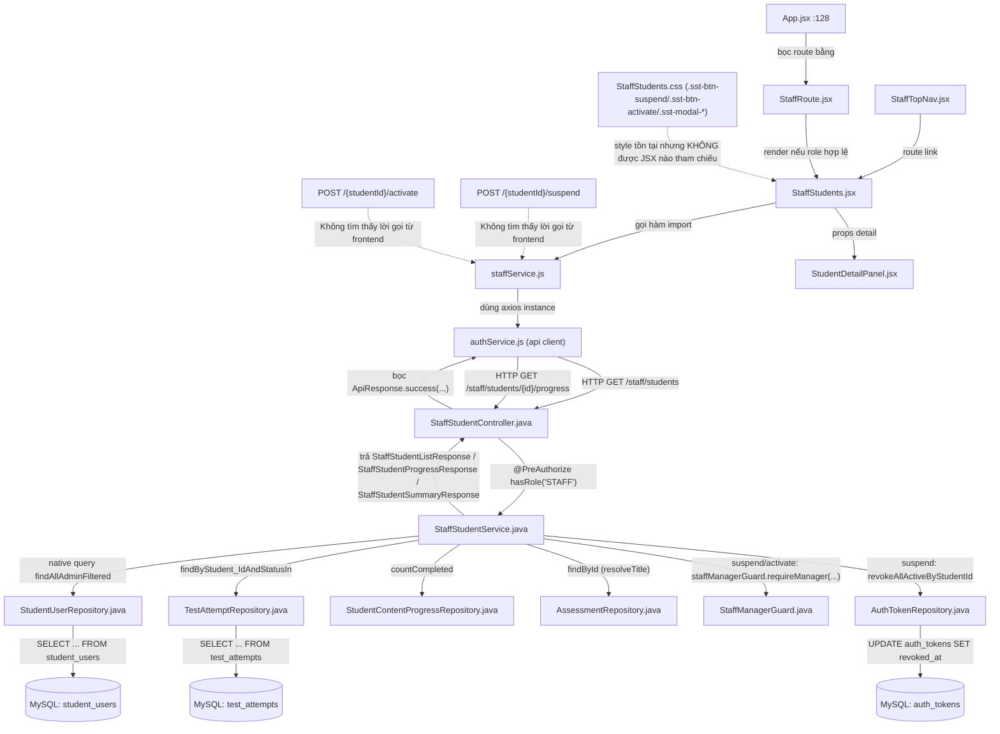
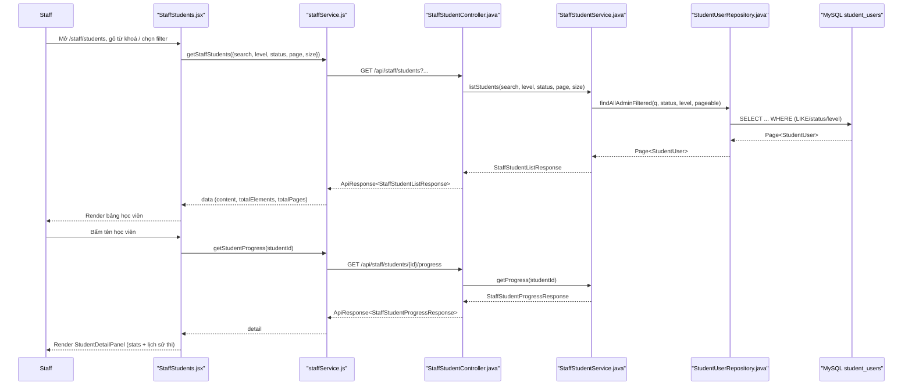
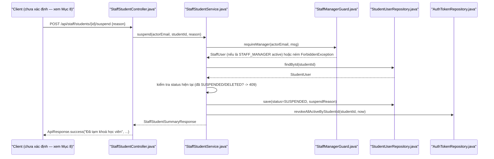

# Phân Tích Feature: feat-staff-student-management (Staff Quản Lý Tài Khoản Học Viên)

> **Tác giả phân tích:** AI Senior Software Architect
> **Ngày phân tích:** 2026-07-27
> **Backlog liên quan:** "Manage Student Accounts" và "Suspend or Activate Account" — màn hình "Staff Students Page"
> **Nguồn:** Đọc trực tiếp source code trong workspace

---

## 1. Tóm Tắt Tổng Quan

Feature này cho phép **Staff** (nhân viên vận hành) xem danh sách toàn bộ học viên trên hệ thống, lọc theo tên/email/cấp độ JLPT/trạng thái tài khoản, xem chi tiết tiến độ học tập của từng học viên, và **tạm khoá (suspend) / mở khoá (activate)** tài khoản của một học viên bất kỳ. Đây là góc nhìn "Staff quản lý tài khoản **của người khác**", khác hoàn toàn với feature tự quản lý hồ sơ của chính Student đã được phân tích tại [feat-student-management_feature_analysis.md](../../../docs/02-SDD-Architecture/feat_flow/feat-student-management_feature_analysis.md) (feature đó là Student tự sửa hồ sơ/đổi mật khẩu/đổi email của chính mình, và minh thị loại trừ phần Admin/Staff quản lý tài khoản người khác).

Feature trải dài trên 3 tầng:

| Tầng | Mô tả |
|---|---|
| **Frontend (React)** | [StaffStudents.jsx](../../../apps/frontend/src/pages/staff/StaffStudents.jsx) (danh sách + bộ lọc + phân trang + màn chi tiết) dùng [StudentDetailPanel.jsx](../../../apps/frontend/src/components/staff/StudentDetailPanel.jsx) để hiển thị tiến độ, gọi API qua [staffService.js](../../../apps/frontend/src/api/staffService.js) |
| **Backend (Spring Boot)** | [StaffStudentController.java](../../../apps/backend/src/main/java/com/jlpt/feature/staffcontent/student/StaffStudentController.java) nhận request tại `/api/staff/students/**` → ủy quyền cho [StaffStudentService.java](../../../apps/backend/src/main/java/com/jlpt/feature/staffcontent/student/StaffStudentService.java) → dùng [StudentUserRepository](../../../apps/backend/src/main/java/com/jlpt/feature/student/StudentUserRepository.java) đọc/ghi bảng `student_users`, [AuthTokenRepository](../../../apps/backend/src/main/java/com/jlpt/feature/auth/AuthTokenRepository.java) để thu hồi session khi suspend, và [StaffManagerGuard](../../../apps/backend/src/main/java/com/jlpt/feature/staff/StaffManagerGuard.java) để chốt chặn quyền hạn ở tầng Service |
| **Database (MySQL)** | Bảng `student_users` (entity [StudentUser.java](../../../apps/backend/src/main/java/com/jlpt/feature/student/StudentUser.java)), bảng `auth_tokens` (bị UPDATE khi suspend để thu hồi phiên đăng nhập) |

**Entry point**: route `/staff/students` khai báo tại [App.jsx:128](../../../apps/frontend/src/App.jsx#L128), bọc bởi [StaffRoute.jsx](../../../apps/frontend/src/components/common/StaffRoute.jsx) (guard UI, không phải lớp bảo mật thật). Backend entry point là `@RequestMapping("/api/staff/students")` tại [StaffStudentController.java:27](../../../apps/backend/src/main/java/com/jlpt/feature/staffcontent/student/StaffStudentController.java#L27), class-level `@PreAuthorize("hasRole('STAFF')")`.

**Lưu ý quan trọng phát hiện được khi khảo sát code** (chi tiết ở Mục 8): hành động suspend/activate **có endpoint backend đầy đủ** (`POST /{studentId}/suspend`, `POST /{studentId}/activate`) và có style CSS sẵn sàng (`.sst-btn-suspend`, `.sst-btn-activate`, `.sst-action-btn--suspend/--activate`, `.sst-modal-*` cho confirm modal trong [StaffStudents.css](../../../apps/frontend/src/pages/staff/StaffStudents.css)), nhưng **không tìm thấy bất kỳ nút bấm hay lời gọi API nào trong JSX** ([StaffStudents.jsx](../../../apps/frontend/src/pages/staff/StaffStudents.jsx), [StudentDetailPanel.jsx](../../../apps/frontend/src/components/staff/StudentDetailPanel.jsx)) thực sự gọi tới `/suspend` hay `/activate`. Ngoài ra, [StaffRoute.jsx:12](../../../apps/frontend/src/components/common/StaffRoute.jsx#L12) điều hướng `staff_manager` sang `/manager` — trong khi chính `StaffManagerGuard` lại yêu cầu người gọi suspend/activate phải là `STAFF_MANAGER` — nghĩa là vai trò duy nhất được phép thực hiện hành động này (theo backend) lại bị chuyển hướng khỏi trang duy nhất có UI danh sách học viên.

---

## 2. Bản Đồ Cấu Trúc (Các "Mảnh" Và Vai Trò)

### 2.1 Frontend

| File | Vai trò (1 câu) | Loại |
|---|---|---|
| [StaffStudents.jsx](../../../apps/frontend/src/pages/staff/StaffStudents.jsx) | Trang danh sách học viên: tìm kiếm/lọc (tên, email, level, trạng thái), phân trang server-side, chuyển sang view chi tiết khi bấm tên | Page Component |
| [StudentDetailPanel.jsx](../../../apps/frontend/src/components/staff/StudentDetailPanel.jsx) | Hiển thị 4 chỉ số tổng quan (streak, số bài học hoàn thành, điểm quiz TB, level) + bảng lịch sử thi gần đây của 1 học viên; **chỉ hiển thị dữ liệu, không có action** | Component (thuần hiển thị) |
| [staffService.js](../../../apps/frontend/src/api/staffService.js) | Tầng gọi API cho toàn bộ trang Staff; đoạn liên quan tới feature này export `getStaffStudents` và `getStudentProgress` — **không có hàm suspend/activate nào** | API Service |
| [authService.js](../../../apps/frontend/src/api/authService.js) | Tạo axios instance dùng chung (`baseURL` từ `VITE_API_BASE_URL`, mặc định `http://localhost:8080/api`), interceptor đính Bearer token + tự refresh khi 401 | API Client (shared) |
| [App.jsx](../../../apps/frontend/src/App.jsx) | Khai báo route `/staff/students` bọc `StaffRoute` | Router Config |
| [StaffRoute.jsx](../../../apps/frontend/src/components/common/StaffRoute.jsx) | Guard UI: chặn user chưa đăng nhập / không phải STAFF hoặc ADMIN; **điều hướng `staff_manager` sang `/manager`** thay vì cho vào `/staff/students` | Route Guard (UI-only) |
| [StaffTopNav.jsx](../../../apps/frontend/src/components/layout/StaffTopNav.jsx) | Thanh điều hướng của khu vực Staff, có mục `staff-students` trỏ route `/staff/students` | Component (Layout/Nav) |
| [StaffPageHero.jsx](../../../apps/frontend/src/components/staff/StaffPageHero.jsx) | Banner tiêu đề trang (thuần trình bày, không chứa logic nghiệp vụ) | Component (UI hiển thị) |
| [JlptBadge (Badges.jsx)](../../../apps/frontend/src/components/common/Badges.jsx) | Hiển thị badge cấp độ JLPT (N5-N1) | Component (UI hiển thị) |
| [Pagination.jsx](../../../apps/frontend/src/components/common/Pagination.jsx) | Điều khiển phân trang dùng chung | Component (UI hiển thị) |
| [EmptyState.jsx](../../../apps/frontend/src/components/common/EmptyState.jsx) | Hiển thị trạng thái loading/lỗi/rỗng dùng chung | Component (UI hiển thị) |
| [StaffStudents.css](../../../apps/frontend/src/pages/staff/StaffStudents.css) | Style cho toàn trang; chứa class `.sst-btn-suspend`, `.sst-btn-activate`, `.sst-action-btn--suspend/--activate`, `.sst-modal-*` (confirm modal) **chưa được dùng ở đâu trong JSX** | Stylesheet (có phần "mồ côi") |

### 2.2 Backend

| File | Vai trò (1 câu) | Loại |
|---|---|---|
| [StaffStudentController.java](../../../apps/backend/src/main/java/com/jlpt/feature/staffcontent/student/StaffStudentController.java) | Entry point HTTP `/api/staff/students/**`, ép `hasRole('STAFF')` ở class-level, 4 endpoint: list, progress, suspend, activate | Controller |
| [StaffStudentService.java](../../../apps/backend/src/main/java/com/jlpt/feature/staffcontent/student/StaffStudentService.java) | Business logic: lọc/phân trang danh sách, tổng hợp tiến độ học, suspend/activate (kèm chốt quyền `STAFF_MANAGER` + thu hồi session) | Service |
| [StaffManagerGuard.java](../../../apps/backend/src/main/java/com/jlpt/feature/staff/StaffManagerGuard.java) | Chốt chặn quyền ở tầng Service: chỉ `StaffUser` có `staffRole == STAFF_MANAGER` và `status == ACTIVE` mới được thao tác suspend/activate, vì JWT chỉ cấp `ROLE_STAFF` chung, không phân biệt cấp bậc | Service (guard dùng chung) |
| [StudentUser.java](../../../apps/backend/src/main/java/com/jlpt/feature/student/StudentUser.java) | Entity JPA bảng `student_users` — chứa `status` (enum `ACTIVE/SUSPENDED/PENDING/DELETED`), `suspendReason`, `fullName`, `email`, `currentJlptLevel`, `currentStreak`; có `@SQLRestriction` ẩn bản ghi `DELETED` khỏi mọi query (soft delete — ADR-004) | Entity |
| [StudentUserRepository.java](../../../apps/backend/src/main/java/com/jlpt/feature/student/StudentUserRepository.java) | Query native `findAllAdminFiltered` (tìm kiếm + lọc status/level, phân trang) dùng cho danh sách Staff xem | Repository |
| [AuthTokenRepository.java](../../../apps/backend/src/main/java/com/jlpt/feature/auth/AuthTokenRepository.java) | Có `revokeAllActiveByStudentId` — UPDATE thu hồi toàn bộ token đang hoạt động của học viên khi bị suspend | Repository |
| [TestAttemptRepository.java](../../../apps/backend/src/main/java/com/jlpt/feature/assessment/TestAttemptRepository.java) | Có `findByStudent_IdAndStatusIn` — lấy các lượt thi đã nộp của học viên để tính điểm TB + lịch sử gần đây | Repository (dùng chung với module Assessment) |
| [StudentContentProgressRepository.java](../../../apps/backend/src/main/java/com/jlpt/feature/student/StudentContentProgressRepository.java) | Có `countCompleted` — đếm số bài học đã hoàn thành của học viên | Repository (dùng chung với module Student) |
| [AssessmentRepository.java](../../../apps/backend/src/main/java/com/jlpt/feature/assessment/AssessmentRepository.java) | Dùng để tra tên bài thi/quiz (`resolveTitle`) hiển thị trong lịch sử thi | Repository (dùng chung) |
| [StaffStudentListResponse.java](../../../apps/backend/src/main/java/com/jlpt/feature/staffcontent/student/dto/StaffStudentListResponse.java) | DTO trang danh sách: `content`, `totalElements`, `totalPages`, `page`, `size` | DTO Response |
| [StaffStudentSummaryResponse.java](../../../apps/backend/src/main/java/com/jlpt/feature/staffcontent/student/dto/StaffStudentSummaryResponse.java) | DTO 1 dòng học viên trong danh sách/kết quả suspend-activate: `studentId`, `fullName`, `email`, `jlptLevel`, `status`, `subscription` | DTO Response |
| [StaffStudentProgressResponse.java](../../../apps/backend/src/main/java/com/jlpt/feature/staffcontent/student/dto/StaffStudentProgressResponse.java) | DTO chi tiết tiến độ học: streak, số bài học hoàn thành, điểm quiz TB, danh sách `AttemptItem` (lịch sử thi) | DTO Response |
| [SuspendStudentRequest.java](../../../apps/backend/src/main/java/com/jlpt/feature/staffcontent/student/dto/SuspendStudentRequest.java) | DTO nhận `reason` (tuỳ chọn, tối đa 500 ký tự) khi suspend | DTO Request |
| [ApiResponse.java](../../../apps/backend/src/main/java/com/jlpt/shared/common/ApiResponse.java) | Envelope response chung `{ status, message, code, data }` (ADR-008) | Shared DTO |
| [GlobalExceptionHandler.java](../../../apps/backend/src/main/java/com/jlpt/shared/exception/GlobalExceptionHandler.java) | Bắt `ResourceNotFoundException` → 404, `ForbiddenException` → 403, `DuplicateResourceException` → 409 | Exception Handler (ADR-008) |

---

## 3. Bản Đồ Kết Nối (Ai Gọi Ai, Dữ Liệu Truyền Qua Đâu)

### 3.1 Diagram Mermaid — Architecture Overview



### 3.2 Bảng phụ — Từ / Đến / Cách kết nối / Dữ liệu

| Từ (File A) | Đến (File B) | Cách kết nối | Dữ liệu truyền |
|---|---|---|---|
| [StaffTopNav.jsx](../../../apps/frontend/src/components/layout/StaffTopNav.jsx) | [StaffStudents.jsx](../../../apps/frontend/src/pages/staff/StaffStudents.jsx) | Router link (`route: '/staff/students'`) | Không có payload |
| [App.jsx](../../../apps/frontend/src/App.jsx) | [StaffRoute.jsx](../../../apps/frontend/src/components/common/StaffRoute.jsx) | Component composition (`<StaffRoute><StaffStudents /></StaffRoute>`) | `children` = `<StaffStudents />` |
| [StaffStudents.jsx](../../../apps/frontend/src/pages/staff/StaffStudents.jsx) | [staffService.js](../../../apps/frontend/src/api/staffService.js) | Import hàm `getStaffStudents`, `getStudentProgress` | `{ search, level, status, page, size }` → Promise dữ liệu |
| [staffService.js](../../../apps/frontend/src/api/staffService.js) | [authService.js](../../../apps/frontend/src/api/authService.js) | Import default `api` (axios instance) | Request config (headers, baseURL) |
| [staffService.js](../../../apps/frontend/src/api/staffService.js) | [StaffStudentController.java](../../../apps/backend/src/main/java/com/jlpt/feature/staffcontent/student/StaffStudentController.java) | HTTP GET `/staff/students`, GET `/staff/students/{studentId}/progress` | Query params → JSON `ApiResponse<...>` |
| [StaffStudents.jsx](../../../apps/frontend/src/pages/staff/StaffStudents.jsx) | [StudentDetailPanel.jsx](../../../apps/frontend/src/components/staff/StudentDetailPanel.jsx) | Props (`detail={detail}`) | `StaffStudentProgressResponse` (đã map JSON) |
| [StaffStudentController.java](../../../apps/backend/src/main/java/com/jlpt/feature/staffcontent/student/StaffStudentController.java) | [StaffStudentService.java](../../../apps/backend/src/main/java/com/jlpt/feature/staffcontent/student/StaffStudentService.java) | Gọi method trực tiếp (`@RequiredArgsConstructor` DI) | Tham số từ `@RequestParam`/`@PathVariable`/`@RequestBody` |
| [StaffStudentService.java](../../../apps/backend/src/main/java/com/jlpt/feature/staffcontent/student/StaffStudentService.java) | [StudentUserRepository.java](../../../apps/backend/src/main/java/com/jlpt/feature/student/StudentUserRepository.java) | Spring Data JPA method call | `Page<StudentUser>` |
| [StaffStudentService.java](../../../apps/backend/src/main/java/com/jlpt/feature/staffcontent/student/StaffStudentService.java) | [StaffManagerGuard.java](../../../apps/backend/src/main/java/com/jlpt/feature/staff/StaffManagerGuard.java) | Gọi `requireManager(actorEmail, message)` | `email` (từ JWT `Authentication.getName()`) → `StaffUser` hoặc ném `ForbiddenException` |
| [StaffStudentService.java](../../../apps/backend/src/main/java/com/jlpt/feature/staffcontent/student/StaffStudentService.java) | [AuthTokenRepository.java](../../../apps/backend/src/main/java/com/jlpt/feature/auth/AuthTokenRepository.java) | Gọi `revokeAllActiveByStudentId(studentId, now)` | `studentId`, thời điểm hiện tại → UPDATE hàng loạt |
| [StaffStudentService.java](../../../apps/backend/src/main/java/com/jlpt/feature/staffcontent/student/StaffStudentService.java) | [StudentUser.java](../../../apps/backend/src/main/java/com/jlpt/feature/student/StudentUser.java) | Đọc/ghi field entity (`setStatus`, `setSuspendReason`) | Enum `StudentStatus`, chuỗi `reason` |
| [GlobalExceptionHandler.java](../../../apps/backend/src/main/java/com/jlpt/shared/exception/GlobalExceptionHandler.java) | [StaffStudentController.java](../../../apps/backend/src/main/java/com/jlpt/feature/staffcontent/student/StaffStudentController.java) | `@ExceptionHandler` bắt exception ném ra từ Service/Controller | `ResourceNotFoundException`/`ForbiddenException`/`DuplicateResourceException` → `ApiResponse` lỗi + status HTTP |

---

## 4. Luồng Xử Lý Theo Trình Tự

### 4.1 Luồng A — Xem danh sách & lọc học viên (đã xác nhận đầy đủ FE↔BE)

1. Staff mở `/staff/students` → [App.jsx:128](../../../apps/frontend/src/App.jsx#L128) render `<StaffRoute><StaffStudents /></StaffRoute>`. [StaffRoute.jsx](../../../apps/frontend/src/components/common/StaffRoute.jsx) kiểm tra `isAuthenticated` và `user.role` (Redux store) — nếu không hợp lệ, `Navigate` sang `/login` hoặc `/dashboard`.
2. `StaffStudents.jsx` mount → effect tại [StaffStudents.jsx:56-76](../../../apps/frontend/src/pages/staff/StaffStudents.jsx#L56-L76) gọi `getStaffStudents({ search, level, status, page: page-1, size: 10 })` (hàm định nghĩa tại [staffService.js:45-52](../../../apps/frontend/src/api/staffService.js#L45-L52)).
3. `staffService.js` gửi `api.get('/staff/students', { params })` qua axios instance của [authService.js](../../../apps/frontend/src/api/authService.js) — request interceptor tự đính `Authorization: Bearer <accessToken>`.
4. Request tới [StaffStudentController.java:35-47](../../../apps/backend/src/main/java/com/jlpt/feature/staffcontent/student/StaffStudentController.java#L35-L47) (`GET /api/staff/students`). Spring Security kiểm `hasRole('STAFF')` (class-level `@PreAuthorize`).
5. Controller gọi `staffStudentService.listStudents(search, level, status, page, size)` tại [StaffStudentService.java:48-79](../../../apps/backend/src/main/java/com/jlpt/feature/staffcontent/student/StaffStudentService.java#L48-L79) — build `PageRequest`, gọi `studentUserRepository.findAllAdminFiltered(...)` (query native tại [StudentUserRepository.java:27-46](../../../apps/backend/src/main/java/com/jlpt/feature/student/StudentUserRepository.java#L27-L46)), map từng `StudentUser` sang `StaffStudentSummaryResponse`.
6. Kết quả bọc `ApiResponse.success(...)` trả về FE, `StaffStudents.jsx` set `students`, `totalElements`, `totalPages` vào state, render bảng.
7. Staff bấm tên học viên → `openDetail(student)` tại [StaffStudents.jsx:80-89](../../../apps/frontend/src/pages/staff/StaffStudents.jsx#L80-L89) gọi `getStudentProgress(student.studentId)` ([staffService.js:54-57](../../../apps/frontend/src/api/staffService.js#L54-L57)) → `GET /api/staff/students/{studentId}/progress` → [StaffStudentController.java:49-52](../../../apps/backend/src/main/java/com/jlpt/feature/staffcontent/student/StaffStudentController.java#L49-L52) → `staffStudentService.getProgress(studentId)` ([StaffStudentService.java:81-121](../../../apps/backend/src/main/java/com/jlpt/feature/staffcontent/student/StaffStudentService.java#L81-L121)) — truy `StudentUser`, đếm bài học hoàn thành, lấy lượt thi đã nộp, tính điểm % trung bình, trả `StaffStudentProgressResponse`.
8. FE nhận data → render `StudentDetailPanel.jsx` với props `detail`.



### 4.2 Luồng B — Suspend / Activate (chỉ xác nhận được phía Backend — xem Mục 8)

Backend có logic hoàn chỉnh dù frontend không có nút gọi tới. Trình tự **nếu** một client (Postman, hoặc UI tương lai) gọi API trực tiếp:

1. Client gửi `POST /api/staff/students/{studentId}/suspend` kèm body `{ "reason": "..." }` (tuỳ chọn) và JWT của một tài khoản `ROLE_STAFF`.
2. [StaffStudentController.java:54-62](../../../apps/backend/src/main/java/com/jlpt/feature/staffcontent/student/StaffStudentController.java#L54-L62) nhận request, lấy `authentication.getName()` (email từ JWT), gọi `staffStudentService.suspend(email, studentId, reason)`.
3. [StaffStudentService.java:123-139](../../../apps/backend/src/main/java/com/jlpt/feature/staffcontent/student/StaffStudentService.java#L123-L139):
   - Gọi `staffManagerGuard.requireManager(actorEmail, FORBIDDEN_MSG)` — nếu người gọi không phải `StaffUser` có `staffRole == STAFF_MANAGER` và `status == ACTIVE` → ném `ForbiddenException` (403).
   - Tìm `StudentUser` theo `studentId`, nếu không có → `ResourceNotFoundException` (404).
   - Nếu đã `SUSPENDED` hoặc `DELETED` → `DuplicateResourceException` (409).
   - Set `status = SUSPENDED`, `suspendReason = reason`, `save()`.
   - Gọi `authTokenRepository.revokeAllActiveByStudentId(studentId, now)` — thu hồi mọi token đang hoạt động (buộc đăng xuất ngay lập tức).
   - Trả `StaffStudentSummaryResponse` (trạng thái mới).
4. Luồng `activate` ([StaffStudentService.java:141-151](../../../apps/backend/src/main/java/com/jlpt/feature/staffcontent/student/StaffStudentService.java#L141-L151)) tương tự nhưng không kiểm tra trạng thái trước, set lại `ACTIVE`, xoá `suspendReason`, **không** thu hồi token (vì không có phiên đang hoạt động cần thu hồi).



---

## 5. Vai Trò Từng Đoạn Code Quan Trọng

### 5.1 Query lọc + phân trang danh sách học viên (native SQL)

File: [StudentUserRepository.java:27-46](../../../apps/backend/src/main/java/com/jlpt/feature/student/StudentUserRepository.java#L27-L46)

```java
value =
        """
SELECT * FROM student_users
WHERE (:q IS NULL OR full_name LIKE :q OR email LIKE :q)
  AND (:status IS NULL OR LOWER(status) = LOWER(:status))
  AND (:jlptLevel IS NULL OR LOWER(current_jlpt_level) = LOWER(:jlptLevel))
""",
// Giải thích:
// - Dùng native SQL (không phải JPQL) vì cần LIKE trên nhiều cột + toán tử LOWER
//   để lọc case-insensitive gọn hơn JPQL thuần.
// - (:q IS NULL OR ...) là mẫu "optional filter": nếu Service không truyền search/status/level
//   thì điều kiện đó luôn TRUE, không lọc.
// - Đầu vào: q/status/jlptLevel do StaffStudentService chuẩn hoá (trim, thêm "%...%" cho q).
// - Đầu ra: Page<StudentUser> — dùng cho danh sách hiển thị ở StaffStudents.jsx.
nativeQuery = true)
Page<StudentUser> findAllAdminFiltered(...)
```

Giải thích thêm: đây là điểm rẽ nhánh dữ liệu chính của toàn bộ trang danh sách — mọi bộ lọc (search/level/status) từ FE đều hội tụ về đây trước khi chạm DB.

### 5.2 Chốt chặn quyền hạn thật sự ở tầng Service (không dựa vào JWT role đơn thuần)

File: [StaffManagerGuard.java:22-31](../../../apps/backend/src/main/java/com/jlpt/feature/staff/StaffManagerGuard.java#L22-L31)

```java
/** Trả về StaffUser nếu là staff_manager đang active; ngược lại ném 403 với message tuỳ ngữ cảnh. */
public StaffUser requireManager(String email, String forbiddenMessage) {
    // Nhận vào: email lấy từ Authentication.getName() (JWT principal) của người gọi API.
    StaffUser staff =
            staffUserRepository.findByEmail(email).orElseThrow(() -> new ForbiddenException(forbiddenMessage));
    // Kiểm tra 2 điều kiện: (1) đúng cấp bậc STAFF_MANAGER, (2) tài khoản staff đang ACTIVE.
    // Lý do bắt buộc: JWT chỉ cấp authority chung ROLE_STAFF cho MỌI nhân viên — không phân biệt
    // staff thường với staff_manager — nên không thể chặn ở @PreAuthorize class-level.
    if (staff.getStaffRole() != StaffUser.StaffRole.STAFF_MANAGER
            || staff.getStatus() != StaffUser.StaffStatus.ACTIVE) {
        throw new ForbiddenException(forbiddenMessage);
        // Đưa dữ liệu đi đâu tiếp: GlobalExceptionHandler bắt ForbiddenException -> HTTP 403.
    }
    return staff; // Trả về cho StaffStudentService dùng tiếp nếu cần (hiện service không dùng field nào của staff).
}
```

Giải thích: đây là nơi thật sự quyết định "ai được suspend/activate", tách biệt khỏi Controller/Security filter chain — đúng theo nguyên tắc trong CLAUDE.md ("Authorization by UI hide" là anti-pattern, backend phải tự kiểm tra).

### 5.3 Suspend học viên — đổi trạng thái + thu hồi session

File: [StaffStudentService.java:123-139](../../../apps/backend/src/main/java/com/jlpt/feature/staffcontent/student/StaffStudentService.java#L123-L139)

```java
@Transactional
public StaffStudentSummaryResponse suspend(String actorEmail, Long studentId, String reason) {
    staffManagerGuard.requireManager(actorEmail, FORBIDDEN_MSG); // (1) Chặn quyền trước tiên
    StudentUser s = studentUserRepository
            .findById(studentId)
            .orElseThrow(() -> new ResourceNotFoundException("StudentUser", studentId)); // (2) 404 nếu không có
    if (s.getStatus() == StudentUser.StudentStatus.SUSPENDED
            || s.getStatus() == StudentUser.StudentStatus.DELETED) {
        throw new DuplicateResourceException("Tài khoản đã ở trạng thái này rồi"); // (3) 409 tránh suspend trùng
    }
    s.setStatus(StudentUser.StudentStatus.SUSPENDED); // (4) Đổi trạng thái — KHÔNG xoá bản ghi (ADR-004 Soft Delete)
    s.setSuspendReason(reason);
    studentUserRepository.save(s);
    // (5) Đình chỉ phải chấm dứt phiên đang hoạt động (parity với AdminUserService.suspendUser).
    authTokenRepository.revokeAllActiveByStudentId(studentId, LocalDateTime.now());
    return toSummary(s); // (6) Trả DTO gọn — KHÔNG trả thẳng Entity ra API (ADR-005 DTO Pattern)
}
```

Giải thích: nhận `studentId` + `reason` từ Controller (đến từ HTTP path/body), đưa dữ liệu đi tiếp 2 hướng — ghi xuống bảng `student_users` (trạng thái) và bảng `auth_tokens` (thu hồi phiên) — rồi trả `StaffStudentSummaryResponse` lên lại Controller.

### 5.4 Frontend — nơi lẽ ra cần gọi suspend/activate nhưng không có

File: [StaffStudents.jsx:228-243](../../../apps/frontend/src/pages/staff/StaffStudents.jsx#L228-L243)

```jsx
<td>
  <div className="sst-td-actions">
    <button
      className="sst-btn-icon"
      onClick={() => openDetail(s)}
      aria-label={`Xem tiến độ ${s.fullName}`}
      title="Xem tiến độ"
    >
      {/* Chỉ có 1 nút hành động: xem tiến độ (icon con mắt). */}
      {/* Không có nút suspend/activate nào ở đây, dù CSS .sst-btn-suspend/.sst-btn-activate
          đã được định nghĩa sẵn trong StaffStudents.css — xem Mục 8. */}
    </button>
  </div>
</td>
```

Giải thích: đây là bằng chứng trực tiếp trong code cho thấy cột "Hành động" của bảng danh sách chỉ có nút xem tiến độ, không có đường dẫn UI nào tới 2 endpoint suspend/activate đã tồn tại ở backend.

---

## 6. Dữ Liệu Di Chuyển Như Thế Nào

Theo dõi dữ liệu **trạng thái tài khoản học viên** (`status`) xuyên suốt hệ thống, từ khi Staff xem danh sách tới khi (giả định) suspend:

1. **DB → Repository**: Cột `status` (kiểu `VARCHAR`, lưu chuỗi thường như `'active'`/`'suspended'`) trong bảng `student_users` được convert qua [StudentStatusConverter](../../../apps/backend/src/main/java/com/jlpt/feature/student/StudentStatusConverter.java) (không đọc chi tiết converter này — xem Mục 8) thành enum `StudentUser.StudentStatus` khi Hibernate map Entity.
2. **Entity → DTO (Service)**: `StaffStudentService.listStudents()` gọi `s.getStatus().getValue()` ([StaffStudentService.java:67](../../../apps/backend/src/main/java/com/jlpt/feature/staffcontent/student/StaffStudentService.java#L67)) để lấy lại chuỗi thường (`"active"`/`"suspended"`), gán vào field `status` của `StaffStudentSummaryResponse` — tên field **không đổi** (`status` → `status`), nhưng kiểu dữ liệu đổi từ enum Java sang `String` JSON.
3. **DTO → JSON response**: `ApiResponse.success(...)` bọc `StaffStudentListResponse` (chứa `List<StaffStudentSummaryResponse>`) thành JSON `{ status, message, code, data }` (field `status` ở tầng ApiResponse là **HTTP status code kiểu int** — dễ nhầm lẫn tên với field `status` ở tầng DTO học viên, vốn là chuỗi trạng thái tài khoản).
4. **JSON → Frontend state**: `getStaffStudents()` trả `res.data.data` ([staffService.js:51](../../../apps/frontend/src/api/staffService.js#L51)), `StaffStudents.jsx` set vào `students` state, mỗi phần tử giữ nguyên field `status: "active" | "suspended"`.
5. **State → UI**: JSX render `className={`sst-status-badge sst-status-badge--${s.status}`}` ([StaffStudents.jsx:224](../../../apps/frontend/src/pages/staff/StaffStudents.jsx#L224)) — giá trị `status` được nối trực tiếp vào tên class CSS để tô màu badge (xanh cho active, đỏ cho suspended, theo [StaffStudents.css:74-75](../../../apps/frontend/src/pages/staff/StaffStudents.css#L74-L75)).
6. **Vòng ngược (giả định, suspend)**: Nếu Staff Manager gọi suspend, `SuspendStudentRequest.reason` (chuỗi tự do, tối đa 500 ký tự) đi từ body HTTP → Controller → Service → ghi thẳng vào cột `suspend_reason` của `StudentUser`, không qua biến đổi tên field nào. `status` được Service set cứng thành `StudentStatus.SUSPENDED` (không nhận giá trị tự do từ client — đúng nguyên tắc "Client-trusted Data" trong CLAUDE.md: chỉ `reason` là do client cung cấp, còn `status` đích là do Service quyết định).

---

## 7. Bảng Tra Cứu Tổng Hợp

| Bước | File | Function | Kết nối tới | Dữ liệu | Ghi chú |
|---|---|---|---|---|---|
| 1 | [StaffStudents.jsx](../../../apps/frontend/src/pages/staff/StaffStudents.jsx) | `useEffect` (fetch list) | `getStaffStudents` | `{search, level, status, page, size}` | Debounce 300ms cho ô search |
| 2 | [staffService.js](../../../apps/frontend/src/api/staffService.js) | `getStaffStudents` | `api.get('/staff/students')` | Query params → `res.data.data` | Dòng 45-52 |
| 3 | [StaffStudentController.java](../../../apps/backend/src/main/java/com/jlpt/feature/staffcontent/student/StaffStudentController.java) | `list(...)` | `staffStudentService.listStudents` | `search/level/status/page/size` | Dòng 35-47, `@PreAuthorize hasRole('STAFF')` |
| 4 | [StaffStudentService.java](../../../apps/backend/src/main/java/com/jlpt/feature/staffcontent/student/StaffStudentService.java) | `listStudents(...)` | `studentUserRepository.findAllAdminFiltered` | `q/statusFilter/levelFilter/PageRequest` | Dòng 48-79 |
| 5 | [StudentUserRepository.java](../../../apps/backend/src/main/java/com/jlpt/feature/student/StudentUserRepository.java) | `findAllAdminFiltered(...)` | Bảng `student_users` | Native SQL với optional filter | Dòng 27-46 |
| 6 | [StaffStudents.jsx](../../../apps/frontend/src/pages/staff/StaffStudents.jsx) | `openDetail(student)` | `getStudentProgress` | `student.studentId` | Dòng 80-89 |
| 7 | [staffService.js](../../../apps/frontend/src/api/staffService.js) | `getStudentProgress` | `api.get('/staff/students/{id}/progress')` | `studentId` → `res.data.data` | Dòng 54-57 |
| 8 | [StaffStudentController.java](../../../apps/backend/src/main/java/com/jlpt/feature/staffcontent/student/StaffStudentController.java) | `progress(...)` | `staffStudentService.getProgress` | `studentId` | Dòng 49-52 |
| 9 | [StaffStudentService.java](../../../apps/backend/src/main/java/com/jlpt/feature/staffcontent/student/StaffStudentService.java) | `getProgress(...)` | `progressRepository.countCompleted`, `testAttemptRepository.findByStudent_IdAndStatusIn`, `assessmentRepository.findById` | `studentId` | Dòng 81-121 |
| 10 | [StaffStudents.jsx](../../../apps/frontend/src/pages/staff/StaffStudents.jsx) | render `<StudentDetailPanel>` | Props `detail` | `StaffStudentProgressResponse` | Dòng 114-116 |
| 11 (giả định) | [StaffStudentController.java](../../../apps/backend/src/main/java/com/jlpt/feature/staffcontent/student/StaffStudentController.java) | `suspend(...)` | `staffStudentService.suspend` | `studentId`, `reason`, JWT email | Dòng 54-62 — **Không tìm thấy caller từ frontend** |
| 12 (giả định) | [StaffStudentService.java](../../../apps/backend/src/main/java/com/jlpt/feature/staffcontent/student/StaffStudentService.java) | `suspend(...)` | `staffManagerGuard.requireManager`, `studentUserRepository.save`, `authTokenRepository.revokeAllActiveByStudentId` | `actorEmail, studentId, reason` | Dòng 123-139 |
| 13 (giả định) | [StaffStudentController.java](../../../apps/backend/src/main/java/com/jlpt/feature/staffcontent/student/StaffStudentController.java) | `activate(...)` | `staffStudentService.activate` | `studentId`, JWT email | Dòng 64-69 — **Không tìm thấy caller từ frontend** |
| 14 (giả định) | [StaffStudentService.java](../../../apps/backend/src/main/java/com/jlpt/feature/staffcontent/student/StaffStudentService.java) | `activate(...)` | `staffManagerGuard.requireManager`, `studentUserRepository.save` | `actorEmail, studentId` | Dòng 141-151 |

---

## 8. Các Mục Cần Bổ Sung Context

Các điểm sau **không xác định được đầy đủ hoặc không tìm thấy** trong source code hiện có, cần người dùng/đội dự án xác nhận thêm:

1. **Không tìm thấy UI trigger cho suspend/activate ở frontend.** Đã đọc toàn bộ [StaffStudents.jsx](../../../apps/frontend/src/pages/staff/StaffStudents.jsx) (255 dòng) và [StudentDetailPanel.jsx](../../../apps/frontend/src/components/staff/StudentDetailPanel.jsx) (55 dòng) — không có bất kỳ nút, modal, hay lời gọi hàm nào hướng tới `/suspend` hoặc `/activate`. [staffService.js](../../../apps/frontend/src/api/staffService.js) cũng không export hàm nào cho 2 hành động này. Trong khi đó [StaffStudents.css](../../../apps/frontend/src/pages/staff/StaffStudents.css) có sẵn đầy đủ style cho nút suspend/activate (`.sst-btn-suspend`, `.sst-btn-activate`, dòng 86-99) và cho một confirm modal (`.sst-modal-*`, `.sst-action-btn--suspend/--activate`, dòng 129-214) — gợi ý rằng UI này **đã được thiết kế nhưng chưa (hoặc không còn) được implement trong JSX**, hoặc đang nằm ở một file/branch khác chưa được khảo sát. Cần xác nhận: tính năng có đang được phát triển dở (WIP) hay đã bị revert.
2. **Mâu thuẫn về vai trò được phép thao tác.** [StaffManagerGuard](../../../apps/backend/src/main/java/com/jlpt/feature/staff/StaffManagerGuard.java) yêu cầu người gọi suspend/activate phải có `staffRole == STAFF_MANAGER`. Nhưng [StaffRoute.jsx:12](../../../apps/frontend/src/components/common/StaffRoute.jsx#L12) lại điều hướng chính người dùng có `staffRole === 'staff_manager'` sang `/manager` thay vì cho phép ở lại `/staff/students`. Khảo sát [App.jsx](../../../apps/frontend/src/App.jsx) cũng không thấy route `/manager/students` hay tương đương nào trong khu vực `Manager*`. Không rõ Staff Manager dự kiến thao tác suspend/activate từ màn hình nào — cần xác nhận từ đội thiết kế/PO.
3. **`StudentStatusConverter.java`** ([apps/backend/src/main/java/com/jlpt/feature/student/StudentStatusConverter.java](../../../apps/backend/src/main/java/com/jlpt/feature/student/StudentStatusConverter.java)) — có tồn tại trong repo nhưng **chưa được đọc chi tiết** trong phân tích này; giả định nó chỉ convert qua lại giữa enum và chuỗi DB dựa trên tên file và cách dùng tại `@Convert(converter = StudentStatusConverter.class)` ([StudentUser.java:36](../../../apps/backend/src/main/java/com/jlpt/feature/student/StudentUser.java#L36)), chưa xác nhận logic converter cụ thể (ví dụ có xử lý hoa/thường hay giá trị lạ không).
4. **`AdminUserService.suspendUser`** được nhắc tới trong comment tại [StaffStudentService.java:136](../../../apps/backend/src/main/java/com/jlpt/feature/staffcontent/student/StaffStudentService.java#L136) ("parity với AdminUserService.suspendUser") nhưng **không nằm trong phạm vi entry point được giao** cho phân tích này nên chưa được đọc — đây là tính năng suspend phía Admin (`feature/admin`), khác với suspend phía Staff đang phân tích. Nếu cần so sánh 2 luồng suspend (Admin vs Staff) để phát hiện khác biệt hành vi, cần yêu cầu phân tích bổ sung riêng cho `feature/admin`.
5. **Không xác nhận được ai (role nào) thực sự đang gọi 2 endpoint suspend/activate trong thực tế** — vì không có test file hoặc Postman collection nào được khảo sát trong phạm vi nhiệm vụ này. Nếu có file test (`*Test.java`, `*.http`, Postman collection) mô tả cách gọi 2 endpoint này, nên cung cấp đường dẫn để xác nhận thêm.
