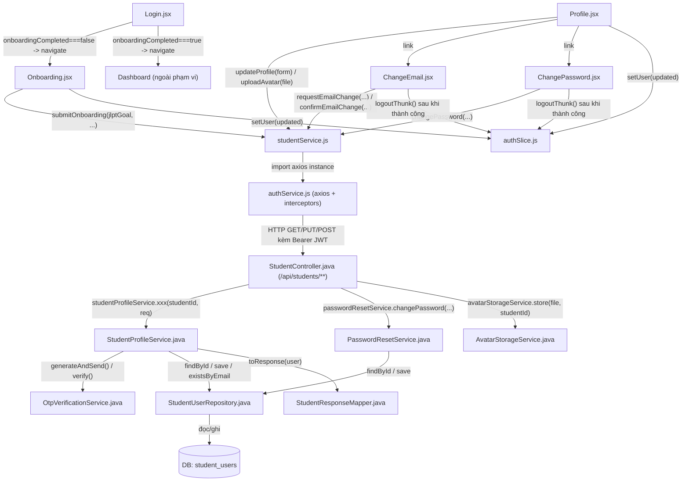
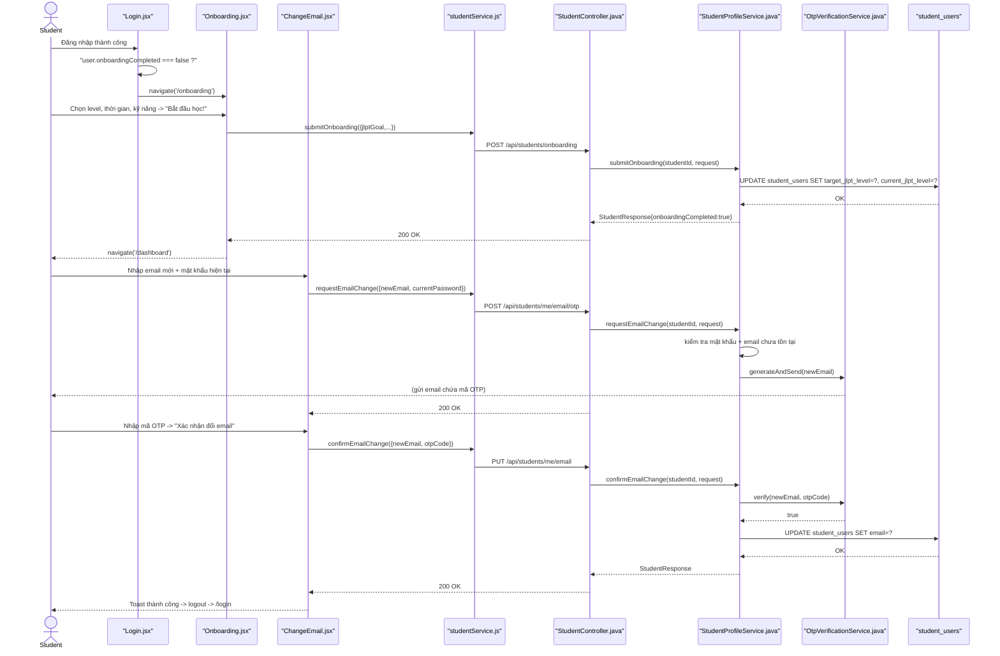

# Phân Tích Feature: feat-student-management (Quản Lý Hồ Sơ Cá Nhân - Student)

> **Tác giả phân tích:** AI Senior Software Architect
> **Ngày phân tích:** 2026-07-22
> **Phạm vi:** Góc nhìn **Student tự quản lý tài khoản của chính mình** — onboarding lần đầu, xem/sửa hồ sơ (tên, SĐT, avatar, mục tiêu JLPT), đổi mật khẩu, đổi email (xác thực OTP). Không bao gồm việc **Admin** quản lý tài khoản Student/Staff/Admin khác (đó là 1 feature riêng — package `feature/admin`, controller `AdminController`/`AdminUserService` — chưa được phân tích trong tài liệu này).
> **Nguồn:** Đọc trực tiếp source code trong workspace

---

## 1. Tóm Tắt Tổng Quan

Feature này cho phép **Student** tự quản lý tài khoản của chính mình, không cần Admin can thiệp: hoàn thành khảo sát mục tiêu học (onboarding) ngay sau lần đăng nhập đầu tiên, xem/chỉnh sửa hồ sơ cá nhân (họ tên, số điện thoại, ảnh đại diện, mục tiêu JLPT), đổi mật khẩu, và đổi địa chỉ email (bắt buộc xác thực bằng mã OTP gửi tới email mới). Đây chính là phần "quản lý" (management) của feature `student`, khác với phần "học tập" (kanji/vocab/grammar/reading/...) cũng nằm trong cùng package backend `com.jlpt.feature.student`.

Feature trải dài trên **3 tầng**:

| Tầng | Mô tả |
|---|---|
| **Frontend (React)** | [Onboarding.jsx](/apps/frontend/src/pages/onboarding/Onboarding.jsx) (khảo sát 3 bước) + [Profile.jsx](/apps/frontend/src/pages/profile/Profile.jsx) (xem/sửa hồ sơ + avatar) + [ChangePassword.jsx](/apps/frontend/src/pages/settings/ChangePassword.jsx) + [ChangeEmail.jsx](/apps/frontend/src/pages/settings/ChangeEmail.jsx), tất cả gọi API qua [studentService.js](/apps/frontend/src/api/studentService.js) |
| **Backend (Spring Boot)** | [StudentController.java](/apps/backend/src/main/java/com/jlpt/feature/student/StudentController.java) nhận request tại `/api/students/**` → ủy quyền cho [StudentProfileService.java](/apps/backend/src/main/java/com/jlpt/feature/auth/StudentProfileService.java) (profile/onboarding/avatar/đổi email) hoặc [PasswordResetService.java](/apps/backend/src/main/java/com/jlpt/feature/auth/PasswordResetService.java) (đổi mật khẩu) → [StudentUserRepository](/apps/backend/src/main/java/com/jlpt/feature/student/StudentUserRepository.java) đọc/ghi DB |
| **Database (MySQL)** | Bảng `student_users` (entity [StudentUser.java](/apps/backend/src/main/java/com/jlpt/feature/student/StudentUser.java)) |

**Entry point**: 4 route đều bọc `PrivateRoute` (đã xác nhận trong [App.jsx:95-98](/apps/frontend/src/App.jsx#L95-L98)):
- `/onboarding` → `Onboarding.jsx`
- `/profile` → `Profile.jsx`
- `/settings/change-password` → `ChangePassword.jsx`
- `/settings/change-email` → `ChangeEmail.jsx`

Điểm đặc biệt: `StudentProfileService` và các DTO đổi mật khẩu/email lại nằm ở package `feature/auth`, không phải `feature/student` — chỉ `StudentController` (entry point HTTP) và entity/repository (`StudentUser`, `StudentUserRepository`) nằm đúng package `feature/student`. Đây là điểm dễ gây nhầm lẫn khi tìm code (xem thêm Mục 8).

Các luồng được cover:
- Onboarding: chọn mục tiêu JLPT (bắt buộc), thời gian học/ngày và kỹ năng ưu tiên (chỉ FE thu thập, BE chưa lưu)
- Xem/sửa hồ sơ: họ tên, số điện thoại, mục tiêu JLPT, ảnh đại diện
- Đổi mật khẩu (yêu cầu nhập mật khẩu hiện tại, tự động đăng xuất sau khi đổi)
- Đổi email (2 bước: gửi OTP tới email mới → xác nhận OTP)

---

## 2. Bản Đồ Cấu Trúc (Các "Mảnh" Và Vai Trò)

### 2.1 Frontend

| File | Vai trò | Loại |
|---|---|---|
| [Onboarding.jsx](/apps/frontend/src/pages/onboarding/Onboarding.jsx) | Khảo sát 3 bước (level JLPT, thời gian học/ngày, kỹ năng ưu tiên) ngay sau lần đăng nhập đầu | Page Component |
| [Profile.jsx](/apps/frontend/src/pages/profile/Profile.jsx) | Trang hồ sơ: sửa họ tên/SĐT, đổi avatar (preview trước khi lưu), link sang đổi email/mật khẩu | Page Component |
| [ChangePassword.jsx](/apps/frontend/src/pages/settings/ChangePassword.jsx) | Form đổi mật khẩu: validate độ mạnh client-side, tự đăng xuất sau khi đổi thành công | Page Component |
| [ChangeEmail.jsx](/apps/frontend/src/pages/settings/ChangeEmail.jsx) | Form đổi email 2 bước (request OTP → confirm OTP), có cooldown gửi lại | Page Component |
| [studentService.js](/apps/frontend/src/api/studentService.js) | Tầng gọi API: `submitOnboarding`, `updateProfile`, `uploadAvatar`, `changePassword`, `requestEmailChange`, `confirmEmailChange` | API Service |
| [authSlice.js](/apps/frontend/src/store/slices/authSlice.js) | Redux slice: action `setUser` (đồng bộ lại `user` sau khi profile/onboarding đổi), thunk `logoutThunk` (dùng sau khi đổi mật khẩu/email) | State (Redux) |
| [Login.jsx](/apps/frontend/src/pages/login/Login.jsx) | Không thuộc feature này nhưng là nơi **quyết định điều hướng** `/onboarding` vs `/dashboard` ngay sau khi đăng nhập | Page Component (điểm kết nối) |
| [App.jsx](/apps/frontend/src/App.jsx) | Khai báo 4 route của feature, đều bọc `PrivateRoute` | Router Config |

### 2.2 Backend

| File | Vai trò | Loại |
|---|---|---|
| [StudentController.java](/apps/backend/src/main/java/com/jlpt/feature/student/StudentController.java) | Entry point HTTP `/api/students/**`, ép role STUDENT (`@PreAuthorize` class-level), lấy `studentId` từ JWT principal | Controller |
| [StudentProfileService.java](/apps/backend/src/main/java/com/jlpt/feature/auth/StudentProfileService.java) | Business logic: xem/sửa hồ sơ, onboarding, cập nhật avatar, đổi email (gửi OTP + xác nhận) | Service |
| [PasswordResetService.java](/apps/backend/src/main/java/com/jlpt/feature/auth/PasswordResetService.java) | Business logic đổi mật khẩu (`changePassword`) — cùng file còn có quên/đặt lại mật khẩu (ngoài phạm vi feature này) | Service |
| [AvatarStorageService.java](/apps/backend/src/main/java/com/jlpt/feature/student/AvatarStorageService.java) | Validate + lưu file ảnh đại diện ra thư mục `uploads/avatars` (không lưu BLOB — ADR-006/LESSON-002), trả về URL public | Service |
| [OtpVerificationService.java](/apps/backend/src/main/java/com/jlpt/shared/security/OtpVerificationService.java) | Sinh mã OTP 6 số, lưu in-memory kèm cooldown 60s + hết hạn 5 phút, gửi qua `EmailService` | Service (shared) |
| [StudentResponseMapper.java](/apps/backend/src/main/java/com/jlpt/feature/auth/StudentResponseMapper.java) | Map `StudentUser` (Entity) → `StudentResponse` (DTO), tính `onboardingCompleted` suy diễn từ `targetJlptLevel != null` | Mapper (dùng chung) |
| [StudentUser.java](/apps/backend/src/main/java/com/jlpt/feature/student/StudentUser.java) | Entity JPA bảng `student_users` — `fullName`, `phone`, `avatarUrl`, `currentJlptLevel`, `targetJlptLevel`, `email`, `passwordHash`, `status` (`@SQLRestriction` ẩn DELETED) | Entity |
| [StudentUserRepository.java](/apps/backend/src/main/java/com/jlpt/feature/student/StudentUserRepository.java) | Truy vấn DB: `findById`, `save`, `existsByEmail` (check trùng khi đổi email) | Repository |
| [OnboardingRequest.java](/apps/backend/src/main/java/com/jlpt/feature/student/dto/request/OnboardingRequest.java) | DTO nhận `jlptGoal` (bắt buộc), `dailyMinutes`/`focusSkills` (nhận nhưng chưa lưu) | DTO Request |
| [UpdateProfileRequest.java](/apps/backend/src/main/java/com/jlpt/feature/student/dto/request/UpdateProfileRequest.java) | DTO nhận `fullName`, `phone`, `targetJlptLevel`, `avatarUrl` — đều optional, validate độ dài/format | DTO Request |
| [ChangePasswordRequest.java](/apps/backend/src/main/java/com/jlpt/feature/auth/dto/request/ChangePasswordRequest.java) | DTO nhận `currentPassword`/`newPassword`/`confirmPassword`, validate độ mạnh mật khẩu mới bằng regex | DTO Request |
| [RequestEmailChangeRequest.java](/apps/backend/src/main/java/com/jlpt/feature/auth/dto/request/RequestEmailChangeRequest.java) | DTO nhận `newEmail` + `currentPassword` (bước 1 đổi email) | DTO Request |
| [ConfirmEmailChangeRequest.java](/apps/backend/src/main/java/com/jlpt/feature/auth/dto/request/ConfirmEmailChangeRequest.java) | DTO nhận `newEmail` + `otpCode` (bước 2 đổi email) | DTO Request |
| [StudentResponse.java](/apps/backend/src/main/java/com/jlpt/feature/student/dto/response/StudentResponse.java) | DTO trả về hồ sơ đầy đủ, kèm cờ `onboardingCompleted` | DTO Response |

---

## 3. Bản Đồ Kết Nối (Ai Gọi Ai, Dữ Liệu Truyền Qua Đâu)

### 3.1 Diagram Mermaid — Architecture Overview



### 3.2 Bảng phụ — Kết nối chi tiết

| Từ (File A) | Đến (File B) | Cách kết nối | Dữ liệu truyền |
|---|---|---|---|
| `Login.jsx` | `Onboarding.jsx` | `navigate()` có điều kiện dựa trên `user.onboardingCompleted` | Không truyền props, chỉ điều hướng route |
| `Onboarding.jsx` | `studentService.js` | Gọi `submitOnboarding({jlptGoal, dailyMinutes, focusSkills})` | Object 3 field, chỉ `jlptGoal` được BE dùng thật |
| `Profile.jsx` | `studentService.js` | Gọi `uploadAvatar(file)` rồi `updateProfile(form)` (tuần tự) | `File` (multipart) rồi `{fullName, phone}` |
| `ChangePassword.jsx` | `studentService.js` | Gọi `changePassword({currentPassword, newPassword, confirmPassword})` | 3 field password |
| `ChangeEmail.jsx` | `studentService.js` | Gọi `requestEmailChange({newEmail, currentPassword})` rồi `confirmEmailChange({newEmail, otpCode})` | Email mới + mật khẩu, rồi email mới + mã OTP |
| `studentService.js` | `authService.js` | `import api from './authService'` — dùng chung 1 axios instance | Không truyền dữ liệu, chỉ tái sử dụng cấu hình JWT interceptor |
| `authService.js` | `StudentController.java` | HTTP request thật tới `/api/students/**` | Header `Authorization: Bearer <JWT>`, body/query theo endpoint |
| `StudentController.java` | `StudentProfileService.java` | Gọi method Java (Spring DI), `studentId` lấy từ `@AuthenticationPrincipal` | `studentId` (Long) + DTO Request đã validate |
| `StudentController.java` | `PasswordResetService.java` | Gọi `changePassword(studentId, request)` | `studentId` + `ChangePasswordRequest` |
| `StudentController.java` | `AvatarStorageService.java` | Gọi `store(avatar, studentId)` trước, lấy URL rồi mới gọi `StudentProfileService.updateAvatar` | `MultipartFile` + `studentId` → trả `String avatarUrl` |
| `StudentProfileService.java` | `OtpVerificationService.java` | Gọi `generateAndSend(newEmail)` / `verify(newEmail, otpCode)` | `String email`, `String code` |
| `StudentProfileService.java` / `PasswordResetService.java` | `StudentUserRepository.java` | Spring Data JPA (`findById`, `save`, `existsByEmail`) | Entity `StudentUser` |
| `StudentProfileService.java` | `StudentResponseMapper.java` | Gọi `toResponse(user)` sau mỗi lần sửa đổi | Entity `StudentUser` → DTO `StudentResponse` |
| `ChangePassword.jsx` / `ChangeEmail.jsx` | `authSlice.js` | `dispatch(logoutThunk())` sau khi đổi thành công | Không có payload, chỉ trigger đăng xuất |
| `Onboarding.jsx` / `Profile.jsx` | `authSlice.js` | `dispatch(setUser(updated))` | `StudentResponse` (đã map lại từ BE) |

---

## 4. Luồng Xử Lý Theo Trình Tự

### 4.1 Luồng Onboarding (lần đầu đăng nhập)

1. Student đăng nhập thành công → `Login.jsx` kiểm tra `res.user?.onboardingCompleted === false` ([Login.jsx:63](/apps/frontend/src/pages/login/Login.jsx#L63), tương tự cho Google login ở [dòng 73](/apps/frontend/src/pages/login/Login.jsx#L73)) → `navigate('/onboarding')`.
2. `Onboarding.jsx` hiển thị 3 bước: chọn level JLPT (`step===1`), thời gian học/ngày (`step===2`), kỹ năng ưu tiên (`step===3`) — toàn bộ state cục bộ React, không gọi API cho tới bước cuối.
3. Student bấm "Bắt đầu học!" → `handleFinish()` ([Onboarding.jsx:47-60](/apps/frontend/src/pages/onboarding/Onboarding.jsx#L47-L60)) gọi `submitOnboarding({jlptGoal, dailyMinutes, focusSkills})`.
4. `studentService.submitOnboarding` ([studentService.js:22-25](/apps/frontend/src/api/studentService.js#L22-L25)) gửi `POST /api/students/onboarding`.
5. `StudentController.submitOnboarding` ([StudentController.java:64-70](/apps/backend/src/main/java/com/jlpt/feature/student/StudentController.java#L64-L70)) lấy `studentId` từ JWT, gọi `studentProfileService.submitOnboarding(studentId, request)`.
6. `StudentProfileService.submitOnboarding` ([StudentProfileService.java:68-80](/apps/backend/src/main/java/com/jlpt/feature/auth/StudentProfileService.java#L68-L80)): parse `jlptGoal`, set **cả** `targetJlptLevel` **và** `currentJlptLevel` bằng level vừa chọn, lưu qua `studentUserRepository.save()`. `dailyMinutes`/`focusSkills` bị bỏ qua (chưa có cột DB).
7. Backend trả `StudentResponse` với `onboardingCompleted=true` (vì `targetJlptLevel` giờ khác null).
8. Frontend `dispatch(setUser(updated))` rồi `navigate('/dashboard', {replace:true})`.

### 4.2 Luồng Đổi Email (2 bước, xác thực OTP)

1. Từ `Profile.jsx`, Student bấm "Đổi email" → điều hướng `/settings/change-email` → `ChangeEmail.jsx` render step `'request'`.
2. Student nhập email mới + mật khẩu hiện tại, submit → `handleRequestOtp()` ([ChangeEmail.jsx:28-42](/apps/frontend/src/pages/settings/ChangeEmail.jsx#L28-L42)) gọi `requestEmailChange({newEmail, currentPassword})`.
3. `studentService.requestEmailChange` ([studentService.js:49-52](/apps/frontend/src/api/studentService.js#L49-L52)) gửi `POST /api/students/me/email/otp`.
4. `StudentController.requestEmailChange` ([StudentController.java:120-126](/apps/backend/src/main/java/com/jlpt/feature/student/StudentController.java#L120-L126)) → `StudentProfileService.requestEmailChange` ([StudentProfileService.java:94-116](/apps/backend/src/main/java/com/jlpt/feature/auth/StudentProfileService.java#L94-L116)): xác thực `currentPassword` khớp `passwordHash` hiện tại, kiểm tra email mới khác email cũ và **chưa tồn tại ở cả 3 bảng** (`student_users`/`staff_users`/`admin_users`), rồi gọi `otpVerificationService.generateAndSend(newEmail)`.
5. `OtpVerificationService.generateAndSend` ([OtpVerificationService.java:36-50](/apps/backend/src/main/java/com/jlpt/shared/security/OtpVerificationService.java#L36-L50)): chặn resend nếu chưa qua cooldown 60s, sinh mã 6 số, lưu in-memory kèm hạn 5 phút, gửi email qua `EmailService`.
6. Frontend chuyển `step='confirm'`, hiện form nhập OTP + đếm ngược 60s trước khi cho gửi lại.
7. Student nhập mã OTP, submit → `handleConfirm()` ([ChangeEmail.jsx:58-75](/apps/frontend/src/pages/settings/ChangeEmail.jsx#L58-L75)) gọi `confirmEmailChange({newEmail, otpCode})`.
8. `StudentController.confirmEmailChange` ([StudentController.java:128-135](/apps/backend/src/main/java/com/jlpt/feature/student/StudentController.java#L128-L135)) → `StudentProfileService.confirmEmailChange` ([StudentProfileService.java:119-138](/apps/backend/src/main/java/com/jlpt/feature/auth/StudentProfileService.java#L119-L138)): gọi `otpVerificationService.verify()`, kiểm tra lại `existsByEmail` (chống race condition), set `user.setEmail(newEmail)`, lưu DB.
9. Frontend nhận thành công → toast → `setTimeout` 1.5s → `dispatch(logoutThunk())` → `navigate('/login')` (bắt buộc đăng nhập lại bằng email mới).

### 4.3 Sequence Diagram Tổng Hợp (Onboarding + Đổi Email)



---

## 5. Vai Trò Từng Đoạn Code Quan Trọng

### 5.1 `StudentProfileService.java` — Guard Không Ghi Đè Avatar Khi Update Profile

**File:** [StudentProfileService.java:42-62](/apps/backend/src/main/java/com/jlpt/feature/auth/StudentProfileService.java#L42-L62)

```java
@Transactional
public StudentResponse updateProfile(Long studentId, UpdateProfileRequest request) {
    StudentUser user = studentUserRepository
            .findById(studentId)
            .orElseThrow(() -> new BusinessException(404, "USER_NOT_FOUND", "Người dùng không tồn tại"));

    user.setFullName(request.getFullName());
    user.setPhone(request.getPhone());

    // Chỉ ghi avatarUrl khi client thực sự gửi — tránh xoá mất avatar đã upload
    // (Profile gọi upload avatar trước rồi mới updateProfile mà không kèm avatarUrl).
    if (request.getAvatarUrl() != null) {
        user.setAvatarUrl(request.getAvatarUrl());
    }

    if (request.getTargetJlptLevel() != null) {
        user.setTargetJlptLevel(StudentUser.JlptLevel.valueOf(request.getTargetJlptLevel()));
    }

    return studentResponseMapper.toResponse(studentUserRepository.save(user));
}
```

> **Giải thích:** Đây là điểm dễ gây bug nhất nếu code sai — `Profile.jsx` gọi 2 API tuần tự (`uploadAvatar` rồi `updateProfile`), và request thứ 2 (`UpdateProfileRequest`) **không kèm** `avatarUrl` (form chỉ gửi `fullName`/`phone`, xem [studentService.js:28-31](/apps/frontend/src/api/studentService.js#L28-L31)). Nếu `updateProfile` set thẳng `user.setAvatarUrl(request.getAvatarUrl())` mà không check null, avatar vừa upload xong sẽ bị ghi đè thành `null` ngay lập tức. Check `if (request.getAvatarUrl() != null)` chính là guard chống lại việc đó.

### 5.2 `StudentController.java` — Thứ Tự Gọi 2 Service Khi Upload Avatar

**File:** [StudentController.java:72-79](/apps/backend/src/main/java/com/jlpt/feature/student/StudentController.java#L72-L79)

```java
@PostMapping("/me/avatar")
public ResponseEntity<ApiResponse<StudentResponse>> uploadAvatar(
        @AuthenticationPrincipal UserDetailsImpl userDetails, @RequestParam("avatar") MultipartFile avatar) {
    Long studentId = userDetails.getStudentUser().getId();
    String avatarUrl = avatarStorageService.store(avatar, studentId); // (1) lưu file vật lý trước
    StudentResponse response = studentProfileService.updateAvatar(studentId, avatarUrl); // (2) ghi URL vào DB
    return ResponseEntity.ok(ApiResponse.success("Cập nhật ảnh đại diện thành công", response));
}
```

> **Giải thích:** Controller điều phối 2 service độc lập theo đúng thứ tự: `AvatarStorageService` chỉ lo I/O file (không biết gì về `StudentUser`), `StudentProfileService.updateAvatar` chỉ lo cập nhật DB (không biết gì về file). Tách trách nhiệm rõ ràng — nếu bước (1) lỗi (sai định dạng/quá 5MB), request dừng lại ngay, không bao giờ có bản ghi DB trỏ tới file không tồn tại.

### 5.3 `AvatarStorageService.java` — Validate Trước Khi Ghi File (Không BLOB Trong DB)

**File:** [AvatarStorageService.java:28-56](/apps/backend/src/main/java/com/jlpt/feature/student/AvatarStorageService.java#L28-L56)

```java
public String store(MultipartFile file, Long studentId) {
    if (file == null || file.isEmpty()) {
        throw new BadRequestException("Ảnh đại diện không được để trống");
    }
    if (file.getSize() > MAX_SIZE) { // 5MB
        throw new BadRequestException("Ảnh đại diện tối đa 5MB");
    }
    String contentType = file.getContentType();
    if (contentType == null || !ALLOWED_TYPES.contains(contentType.toLowerCase())) {
        throw new BadRequestException("Định dạng ảnh không hợp lệ (chỉ chấp nhận PNG/JPG/WEBP)");
    }
    // ... build filename duy nhất theo studentId + timestamp, transferTo(dir.resolve(filename))
    return "/api/files/avatars/" + filename; // Trả URL public, KHÔNG lưu bytes ảnh vào cột DB
}
```

> **Giải thích:** Toàn bộ validate (rỗng/quá size/sai định dạng) nằm ở tầng Service trước khi chạm ổ đĩa — không tin `contentType` do trình duyệt gửi lên là đủ, vẫn check whitelist `ALLOWED_TYPES`. Việc lưu file ra `uploads/avatars/` thay vì cột BLOB tuân theo ADR-006/LESSON-002 trong `CLAUDE.md` (BLOB trong DB làm phình DB, chậm backup) — DB chỉ giữ đường dẫn URL.

### 5.4 `StudentProfileService.java` — Đổi Email: Chặn Trùng Ở Cả 3 Bảng User

**File:** [StudentProfileService.java:94-116](/apps/backend/src/main/java/com/jlpt/feature/auth/StudentProfileService.java#L94-L116)

```java
@Transactional(readOnly = true)
public void requestEmailChange(Long studentId, RequestEmailChangeRequest request) {
    StudentUser user = studentUserRepository.findById(studentId)
            .orElseThrow(() -> new BusinessException(404, "USER_NOT_FOUND", "Người dùng không tồn tại"));

    if (!passwordEncoder.matches(request.getCurrentPassword(), user.getPasswordHash())) {
        throw new BusinessException(400, "INVALID_PASSWORD", "Mật khẩu hiện tại không đúng");
    }

    String newEmail = request.getNewEmail().trim().toLowerCase();
    if (newEmail.equals(user.getEmail())) {
        throw new BusinessException(400, "SAME_EMAIL", "Email mới phải khác email hiện tại");
    }
    // Email là duy nhất xuyên suốt CẢ 3 loại tài khoản (Student/Staff/Admin dùng chung không gian email)
    if (studentUserRepository.existsByEmail(newEmail)
            || staffUserRepository.existsByEmail(newEmail)
            || adminUserRepository.existsByEmail(newEmail)) {
        throw new BusinessException(409, "EMAIL_EXISTS", "Email đã được sử dụng");
    }

    otpVerificationService.generateAndSend(newEmail);
}
```

> **Giải thích:** Vì email dùng để đăng nhập cho cả 3 loại tài khoản trong hệ thống (xem `checkAccountType` ở feature auth), việc check trùng phải quét cả `student_users`, `staff_users`, `admin_users` — chỉ check 1 bảng sẽ để lọt trường hợp Student đổi sang email đã thuộc về 1 Staff. Bắt buộc xác thực lại `currentPassword` trước khi gửi OTP — chống trường hợp ai đó chiếm được phiên đăng nhập (session hijack) đổi email mà không biết mật khẩu thật.

### 5.5 `ChangePassword.jsx` — Validate Độ Mạnh Mật Khẩu Client-Side

**File:** [ChangePassword.jsx:12-24](/apps/frontend/src/pages/settings/ChangePassword.jsx#L12-L24)

```jsx
function validate(form) {
  const errs = {};
  if (!form.currentPassword) errs.currentPassword = 'Vui lòng nhập mật khẩu hiện tại';
  if (!form.newPassword) errs.newPassword = 'Vui lòng nhập mật khẩu mới';
  else if (form.newPassword.length < 8) errs.newPassword = 'Mật khẩu tối thiểu 8 ký tự';
  else if (!/[A-Z]/.test(form.newPassword)) errs.newPassword = 'Cần ít nhất 1 chữ hoa';
  else if (!/[a-z]/.test(form.newPassword)) errs.newPassword = 'Cần ít nhất 1 chữ thường';
  else if (!/\d/.test(form.newPassword)) errs.newPassword = 'Cần ít nhất 1 chữ số';
  if (!form.confirmPassword) errs.confirmPassword = 'Vui lòng xác nhận mật khẩu mới';
  else if (form.newPassword && form.newPassword !== form.confirmPassword)
    errs.confirmPassword = 'Mật khẩu xác nhận không khớp';
  return errs;
}
```

> **Giải thích:** Validate client-side chi tiết hơn cả regex ở backend ([ChangePasswordRequest.java](/apps/backend/src/main/java/com/jlpt/feature/auth/dto/request/ChangePasswordRequest.java) chỉ yêu cầu `.{8,}` + 1 hoa + 1 số qua 1 regex duy nhất, không tách lỗi từng tiêu chí) — mục đích là UX (thông báo lỗi cụ thể theo từng tiêu chí thiếu), backend vẫn là nơi validate thật sự đáng tin (không tin client dù đã qua bước này).

---

## 6. Dữ Liệu Di Chuyển Như Thế Nào

Theo dõi dữ liệu **"mục tiêu JLPT" (`jlptGoal`/`targetJlptLevel`)** xuyên suốt luồng Onboarding — vì đây là dữ liệu duy nhất thực sự được lưu từ toàn bộ khảo sát onboarding:

### 6.1 Hướng đi xuống (Frontend → Backend → DB)

```
[Onboarding.jsx]
  Student chọn "N3" ở bước 1 → state jlptGoal = "N3"
  (dailyMinutes=10, focusSkills=['all'] cũng có trong state nhưng chỉ để hiển thị UI)
        ↓
[studentService.js] → submitOnboarding({jlptGoal:"N3", dailyMinutes:10, focusSkills:['all']})
  HTTP POST /api/students/onboarding
  Header: Authorization: Bearer eyJ...
  Body:   { "jlptGoal":"N3", "dailyMinutes":10, "focusSkills":["all"] }
        ↓
[StudentController.java] → @RequestBody OnboardingRequest
  @Valid → @NotBlank, @Pattern("^(N5|N4|N3|N2|N1)$") chỉ áp dụng cho jlptGoal
  studentProfileService.submitOnboarding(studentId, request)
        ↓
[StudentProfileService.java]
  JlptLevels.parseRequired("N3") → StudentUser.JlptLevel.N3
  user.setTargetJlptLevel(N3)   // mục tiêu
  user.setCurrentJlptLevel(N3)  // ĐỒNG THỜI set luôn cấp đang học = cấp mục tiêu vừa chọn
  (dailyMinutes, focusSkills: KHÔNG có dòng code nào đọc 2 field này từ request — bị bỏ qua hoàn toàn)
        ↓
[DB: student_users] → UPDATE SET target_jlpt_level='N3', current_jlpt_level='N3' WHERE student_id=?
```

### 6.2 Hướng đi lên (DB → Backend → Frontend)

```
[StudentResponseMapper.java] → StudentResponse:
  { targetJlptLevel: "N3", currentJlptLevel: "N3", onboardingCompleted: true (vì targetJlptLevel != null), ... }
        ↓
[StudentController.java] → ApiResponse.success("Đã lưu mục tiêu học tập", response)
  HTTP 200: { "status":200, "data":{ targetJlptLevel:"N3", onboardingCompleted:true, ... } }
        ↓
[studentService.js] → return res.data.data
        ↓
[Onboarding.jsx] → dispatch(setUser(updated))   // Redux store.auth.user cập nhật ngay
  navigate('/dashboard', { replace: true })      // Dashboard đọc lại currentJlptLevel mới từ store
```

### 6.3 Biến đổi tên field qua từng tầng

| Tầng | Tên field | Kiểu dữ liệu | Giá trị ví dụ |
|---|---|---|---|
| Frontend state | `jlptGoal` (Onboarding.jsx) | `string` | `"N3"` |
| HTTP request body | `jlptGoal` | `string` (JSON) | `"N3"` |
| Controller/DTO | `OnboardingRequest.jlptGoal` | `String` | `"N3"` |
| Entity (2 field cùng lúc) | `StudentUser.targetJlptLevel` **và** `StudentUser.currentJlptLevel` | `JlptLevel` (Enum) | `JlptLevel.N3` |
| DB column (2 cột) | `target_jlpt_level`, `current_jlpt_level` | `VARCHAR(20)` | `'N3'` |
| DTO response | `StudentResponse.targetJlptLevel` / `.currentJlptLevel` | `String` | `"N3"` |
| Frontend render | `user.currentJlptLevel` | `string` | `"N3"` → hiển thị `<JlptBadge>` |

**Lưu ý quan trọng:** tên field đổi từ số ít `jlptGoal` (chỉ dùng ở FE + DTO request) sang **2 field riêng biệt** `targetJlptLevel`/`currentJlptLevel` ngay từ tầng Service — đây là điểm nên biết nếu debug: 1 giá trị Student chọn ở Onboarding ghi đè **cả 2 cột cùng lúc**, không phải chỉ set mục tiêu như tên `jlptGoal` gợi ý.

---

## 7. Bảng Tra Cứu Tổng Hợp

| Luồng | Bước | File | Function/Method | Kết nối tới | Dữ liệu | Ghi chú |
|---|---|---|---|---|---|---|
| Onboarding | 1 | [Login.jsx:63](/apps/frontend/src/pages/login/Login.jsx#L63) | điều kiện trong `handleSubmit` | `navigate('/onboarding')` | `user.onboardingCompleted` | Cũng áp dụng cho Google login (dòng 73) |
| Onboarding | 2 | [Onboarding.jsx](/apps/frontend/src/pages/onboarding/Onboarding.jsx) | `handleFinish()` (dòng 47-60) | `studentService.submitOnboarding` | `{jlptGoal, dailyMinutes, focusSkills}` | Chỉ `jlptGoal` được BE dùng |
| Onboarding | 3 | [StudentController.java:64-70](/apps/backend/src/main/java/com/jlpt/feature/student/StudentController.java#L64-L70) | `submitOnboarding()` | `StudentProfileService` | `studentId`, `OnboardingRequest` | `@PreAuthorize STUDENT` ở class-level |
| Onboarding | 4 | [StudentProfileService.java:68-80](/apps/backend/src/main/java/com/jlpt/feature/auth/StudentProfileService.java#L68-L80) | `submitOnboarding()` | `StudentUserRepository.save` | set cả `target`+`current` JlptLevel | `@Transactional` |
| Profile | 1 | [Profile.jsx](/apps/frontend/src/pages/profile/Profile.jsx) | `handleSave()` (dòng 59-77) | `uploadAvatar` rồi `updateProfile` | `File`, `{fullName, phone}` | Gọi tuần tự, không song song |
| Profile | 2 | [StudentController.java:72-79](/apps/backend/src/main/java/com/jlpt/feature/student/StudentController.java#L72-L79) | `uploadAvatar()` | `AvatarStorageService` + `StudentProfileService` | `MultipartFile` | Điều phối 2 service (mục 5.2) |
| Profile | 3 | [AvatarStorageService.java:28-56](/apps/backend/src/main/java/com/jlpt/feature/student/AvatarStorageService.java#L28-L56) | `store()` | Ghi file `uploads/avatars/` | trả `String avatarUrl` | Max 5MB, chỉ PNG/JPG/WEBP |
| Profile | 4 | [StudentProfileService.java:42-62](/apps/backend/src/main/java/com/jlpt/feature/auth/StudentProfileService.java#L42-L62) | `updateProfile()` | `StudentUserRepository.save` | `fullName`, `phone`, `avatarUrl?` | Guard không ghi đè avatar (mục 5.1) |
| Password | 1 | [ChangePassword.jsx](/apps/frontend/src/pages/settings/ChangePassword.jsx) | `handleSubmit()` (dòng 43-66) | `studentService.changePassword` | 3 field password | Validate độ mạnh client-side (mục 5.5) |
| Password | 2 | [StudentController.java:113-118](/apps/backend/src/main/java/com/jlpt/feature/student/StudentController.java#L113-L118) | `changePassword()` | `PasswordResetService` | `ChangePasswordRequest` | — |
| Password | 3 | [PasswordResetService.java:93-108](/apps/backend/src/main/java/com/jlpt/feature/auth/PasswordResetService.java#L93-L108) | `changePassword()` | `StudentUserRepository.save` | So khớp `currentPassword`, encode `newPassword` | `@Transactional` |
| Password | 4 | [ChangePassword.jsx:56-60](/apps/frontend/src/pages/settings/ChangePassword.jsx#L56-L60) | callback `then` | `authSlice.logoutThunk` | — | Đăng xuất sau 1.5s, `navigate('/login')` |
| Email | 1 | [ChangeEmail.jsx:28-42](/apps/frontend/src/pages/settings/ChangeEmail.jsx#L28-L42) | `handleRequestOtp()` | `studentService.requestEmailChange` | `{newEmail, currentPassword}` | Chuyển step sang `'confirm'` |
| Email | 2 | [StudentProfileService.java:94-116](/apps/backend/src/main/java/com/jlpt/feature/auth/StudentProfileService.java#L94-L116) | `requestEmailChange()` | `OtpVerificationService.generateAndSend` | Check trùng cả 3 bảng user (mục 5.4) | — |
| Email | 3 | [OtpVerificationService.java:36-50](/apps/backend/src/main/java/com/jlpt/shared/security/OtpVerificationService.java#L36-L50) | `generateAndSend()` | `EmailService.sendOtpEmail` | Mã 6 số, hạn 5 phút | Cooldown 60s giữa 2 lần gửi |
| Email | 4 | [ChangeEmail.jsx:58-75](/apps/frontend/src/pages/settings/ChangeEmail.jsx#L58-L75) | `handleConfirm()` | `studentService.confirmEmailChange` | `{newEmail, otpCode}` | — |
| Email | 5 | [StudentProfileService.java:119-138](/apps/backend/src/main/java/com/jlpt/feature/auth/StudentProfileService.java#L119-L138) | `confirmEmailChange()` | `OtpVerificationService.verify` + `StudentUserRepository.save` | Set `user.email` | Check lại `existsByEmail` chống race condition |
| Email | 6 | [ChangeEmail.jsx:65-69](/apps/frontend/src/pages/settings/ChangeEmail.jsx#L65-L69) | callback `then` | `authSlice.logoutThunk` | — | Đăng xuất, bắt đăng nhập lại bằng email mới |

---

## 8. Các Mục Cần Bổ Sung Context

1. **`StudentProfileService`/`PasswordResetService` nằm ở package `feature/auth`, không phải `feature/student`** — chỉ `StudentController` (entry point), `StudentUser`/`StudentUserRepository` (entity/repo) nằm đúng package `feature/student`. Đây là 1 điểm cấu trúc dễ gây nhầm khi tìm code theo tên package; không rõ đây là chủ đích thiết kế (coi profile là "một phần của auth") hay là lịch sử refactor còn sót — không tìm thấy ghi chú giải thích trong source code đã đọc.
2. **`dailyMinutes`/`focusSkills` từ Onboarding hoàn toàn không được lưu** — đã xác nhận rõ trong code (`OnboardingRequest` nhận nhưng `StudentProfileService.submitOnboarding` không có dòng nào đọc 2 field này) và có ghi chú thẳng trong javadoc của DTO. Không rõ kế hoạch tương lai có bổ sung cột lưu hay không.
3. **`GET /api/students/me`** (`StudentController.getProfile`, dòng 97-103) — có tồn tại trong Controller nhưng **không tìm thấy nơi Frontend nào gọi trực tiếp** trong nhóm file đã đọc (`Profile.jsx` lấy dữ liệu ban đầu từ Redux store `user` thay vì tự fetch lại qua API này lúc mount). Có thể route này chỉ dùng để tự kiểm tra qua Postman, hoặc được gọi ở 1 nơi khác ngoài phạm vi đã khảo sát (ví dụ lúc khởi tạo app/refresh token).
4. **`UserDetailsImpl.getStudentUser()`** — được gọi liên tục trong `StudentController` để lấy `studentId`, nhưng file định nghĩa class này (`shared/security/UserDetailsImpl.java`) **không nằm trong phạm vi đọc** của phân tích này — chưa xác nhận trực tiếp cách nó được populate lúc xác thực JWT.
5. **Rate-limit / brute-force cho `changePassword`/`requestEmailChange`** — không tìm thấy cơ chế giới hạn số lần thử nhập sai `currentPassword` ở 2 luồng này trong source code đã đọc (khác với luồng login có `checkAccountTypeAttempts` rate-limit theo IP).
6. **Không có audit log cho các thao tác tự quản lý này** — khác với các thao tác Admin thực hiện lên tài khoản người khác (có `AdminAuditLog`), việc Student tự đổi mật khẩu/email/hồ sơ của chính mình không thấy ghi log nào trong source code đã đọc — có thể là chủ đích (không cần audit hành động trên chính tài khoản của mình) chứ không phải thiếu sót.
