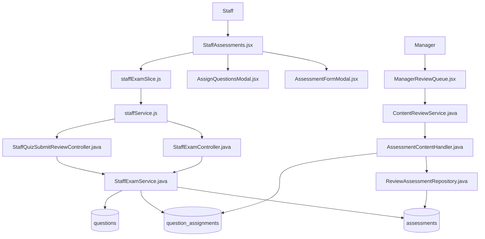
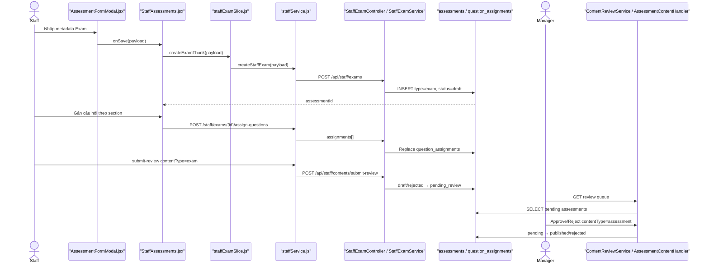

# Create Exam — Staff tạo đề thi và gửi Manager duyệt

> Phạm vi: thao tác Staff trên frontend → tạo Exam → gán câu hỏi theo section → submit-review → Manager Approve/Reject. Chỉ dùng thông tin tìm thấy trong source code.

## 1. Tóm tắt tổng quan

Staff mở trang Đề thi & Quiz, chọn tab Exam, nhập metadata rồi gọi `POST /api/staff/exams`. Backend buộc `assessment_type = exam`, gán `status = draft` và lưu vào bảng `assessments`. Staff gán các câu hỏi đã `published`, cùng `sectionName`, `displayOrder` và `score`, qua bảng `question_assignments`. Frontend gửi duyệt bằng `POST /api/staff/contents/submit-review` với `contentType = exam`; backend chuyển Exam từ `draft/rejected` sang `pending_review`. Khi đọc Review Queue, backend chuẩn hóa cả Quiz và Exam thành `contentType = assessment`, vì Manager dùng `AssessmentContentHandler`. Approve yêu cầu Exam có câu hỏi và tổng điểm câu hỏi bằng `totalScore`; Reject bắt buộc feedback.

Điểm vào:

- Route `/staff/assessments`: [App.jsx#L124](../../../../apps/frontend/src/App.jsx#L124).
- Staff page: [StaffAssessments.jsx](../../../../apps/frontend/src/features/management/staff/StaffAssessments.jsx).
- Tạo Exam: `POST /api/staff/exams`.
- Gán câu hỏi: `POST /api/staff/exams/{assessmentId}/assign-questions`.
- Gửi duyệt: `POST /api/staff/contents/submit-review` với `contentType=exam`.
- Manager review: `POST /api/manager/reviews` với `contentType=assessment`.

### 1.1. Đặc tả luồng: Input → Process → Output → Target

| Chặng | Input | Process | Output | Target |
|---|---|---|---|---|
| Mở form | Staff có `ROLE_STAFF`, chọn tab Exam | Mở form ở mode `exam` | Form tạo Exam | `StaffAssessments` → `AssessmentFormModal` |
| Nhập metadata | `title`, `jlptLevel`, `durationMin`, `description`, `passScore`, `totalScore` | Validate, trim chuỗi, chuẩn hóa kiểu số | Payload metadata hợp lệ | Frontend form |
| Tạo Draft | Payload + JWT Staff | Resolve Staff, validate level/điểm; gán `type=exam`, `status=draft`, creator | HTTP `201`, `assessmentId` | `POST /api/staff/exams` → `assessments` |
| Gán câu hỏi | `assessmentId`, `assignments[]` (`questionId`, `sectionName`, `displayOrder`, `score`) | Kiểm tra owner/status, trùng ID, section, Published và cùng level; thay toàn bộ assignments | Danh sách gán, tổng điểm, thống kê section | Assign API → `question_assignments` |
| Gửi duyệt | `{contentType:"exam", contentId}` | Kiểm tra owner, `draft/rejected`, có câu hỏi; chuyển trạng thái | `pending_review` | Submit-review API → `StaffExamService` |
| Manager Approve | `{contentType:"assessment", contentId, action:"APPROVE"}` | Chống tự duyệt/duyệt đồng thời; kiểm tra tổng assignment score bằng `totalScore`; ghi audit | `published`, approver, thời gian | Review API → `AssessmentContentHandler` |
| Manager Reject | `{contentType:"assessment", contentId, action:"REJECT", feedback}` | Bắt buộc feedback; guarded update; ghi audit | `rejected`, lý do từ chối | Review API → repository/audit |
| Nhánh lỗi | Field sai, sai owner/status, question không hợp lệ, tổng điểm lệch | Dừng tại validation/guard, không chuyển trạng thái tiếp | Response lỗi; dữ liệu giữ nguyên | Exception handler → frontend |

**Target cuối:** Exam chỉ sẵn sàng cho người học khi đạt `published`.

## 2. Bản đồ cấu trúc

| File | Vai trò | Loại |
|---|---|---|
| [StaffAssessments.jsx](../../../../apps/frontend/src/features/management/staff/StaffAssessments.jsx) | Điều phối tab Exam, tạo, gán câu hỏi và gửi duyệt | React Page |
| [AssessmentFormModal.jsx](../../../../apps/frontend/src/features/management/components/staff/AssessmentFormModal.jsx) | Form metadata dùng chung Quiz/Exam | React Component |
| [AssignQuestionsModal.jsx](../../../../apps/frontend/src/features/management/components/staff/AssignQuestionsModal.jsx) | Chọn câu hỏi, section, thứ tự và điểm | React Component |
| [staffExamSlice.js](../../../../apps/frontend/src/features/management/staffExamSlice.js) | Async thunk của luồng Exam | Redux Slice |
| [staffService.js](../../../../apps/frontend/src/shared/api/staffService.js) | Gọi create/update/assign/submit-review API | API Service |
| [authService.js](../../../../apps/frontend/src/shared/api/authService.js) | Axios base URL và JWT | Axios Client |
| [StaffExamController.java](../../../../apps/backend/src/main/java/com/jlpt/feature/staffcontent/exam/controller/StaffExamController.java) | API metadata và gán câu hỏi Exam | Controller |
| [StaffQuizSubmitReviewController.java](../../../../apps/backend/src/main/java/com/jlpt/feature/staffcontent/quiz/controller/StaffQuizSubmitReviewController.java) | Endpoint submit-review chung, route `exam` sang Exam service | Controller |
| [CreateExamRequest.java](../../../../apps/backend/src/main/java/com/jlpt/feature/staffcontent/exam/dto/CreateExamRequest.java) | Validate metadata tạo Exam | DTO |
| [ExamAssignQuestionsRequest.java](../../../../apps/backend/src/main/java/com/jlpt/feature/staffcontent/exam/dto/ExamAssignQuestionsRequest.java) | Validate assignments và sectionName | DTO |
| [StaffExamService.java](../../../../apps/backend/src/main/java/com/jlpt/feature/staffcontent/exam/service/StaffExamService.java) | Tạo draft, gán câu hỏi, submit pending_review | Service |
| [ExamAssessmentEntity.java](../../../../apps/backend/src/main/java/com/jlpt/feature/staffcontent/exam/entity/ExamAssessmentEntity.java) | Ánh xạ Exam vào bảng `assessments` | Entity |
| [ExamAssignmentEntity.java](../../../../apps/backend/src/main/java/com/jlpt/feature/staffcontent/exam/entity/ExamAssignmentEntity.java) | Ánh xạ câu hỏi được gán theo section | Entity |
| [ExamAssessmentRepository.java](../../../../apps/backend/src/main/java/com/jlpt/feature/staffcontent/exam/repository/ExamAssessmentRepository.java) | Lưu/tìm assessment loại Exam | Repository |
| [ManagerReviewQueue.jsx](../../../../apps/frontend/src/features/management/manager/ManagerReviewQueue.jsx) | Hiển thị hàng chờ và Approve/Reject | React Page |
| [ContentReviewService.java](../../../../apps/backend/src/main/java/com/jlpt/feature/contentreview/service/ContentReviewService.java) | Kiểm tra Manager và điều phối review | Service |
| [AssessmentContentHandler.java](../../../../apps/backend/src/main/java/com/jlpt/feature/contentreview/handler/AssessmentContentHandler.java) | Handler chung cho bảng assessments, gồm Exam | Handler |
| [ReviewAssessmentRepository.java](../../../../apps/backend/src/main/java/com/jlpt/feature/contentreview/repository/ReviewAssessmentRepository.java) | Query pending và cập nhật trạng thái | Repository |

Feature vượt 15 file vì gồm ba chặng: metadata, assignments theo section và Manager review. Các file phụ được nêu tại mục 8.

## 3. Bản đồ kết nối



| Từ | Đến | Kết nối | Dữ liệu |
|---|---|---|---|
| `AssessmentFormModal` | `StaffAssessments` | callback | Exam metadata |
| `StaffAssessments` | `staffExamSlice` | Redux dispatch | payload/assessmentId |
| `staffExamSlice` | `staffService` | JS call | HTTP payload |
| `staffService` | `StaffExamController` | Axios | create/assign JSON + JWT |
| `StaffExamController` | `StaffExamService` | method call | DTO + email Staff |
| `StaffExamService` | repositories | JPA | Exam/questions/assignments |
| `staffService` | Submit controller | Axios POST | `{contentType:'exam',contentId}` |
| Submit controller | `StaffExamService` | nhánh `exam` | ID + email |
| Manager UI | `ContentReviewService` | Review API | `contentType:'assessment'` |
| Review service | Assessment handler | resolver | Assessment snapshot |
| Assessment handler | Review repository | JPQL | pending → published/rejected |

## 4. Luồng xử lý theo trình tự

### 4.1. Staff nhập metadata Exam

1. [StaffAssessments.jsx](../../../../apps/frontend/src/features/management/staff/StaffAssessments.jsx) render hai tab Quiz/Exam. `handleTabChange` tại [StaffAssessments.jsx#L96](../../../../apps/frontend/src/features/management/staff/StaffAssessments.jsx#L96) đổi `activeTab` sang `exam`.
2. Nút tạo mới gọi `handleCreate` tại [StaffAssessments.jsx#L108](../../../../apps/frontend/src/features/management/staff/StaffAssessments.jsx#L108), mở [AssessmentFormModal.jsx](../../../../apps/frontend/src/features/management/components/staff/AssessmentFormModal.jsx) với `mode='exam'`.
3. Staff nhập `title`, `jlptLevel`, `durationMin`, `description`, `passScore`, `totalScore`.
4. `validateCommon` tại [AssessmentFormModal.jsx#L27](../../../../apps/frontend/src/features/management/components/staff/AssessmentFormModal.jsx#L27) kiểm tra dữ liệu chung; `buildData` tại dòng 67 trim chuỗi và đổi trường số.

### 4.2. Frontend gọi API tạo

5. Lưu nháp gọi `handleSave` tại [StaffAssessments.jsx#L122](../../../../apps/frontend/src/features/management/staff/StaffAssessments.jsx#L122), dispatch `createExamThunk(payload)`.
6. Lưu và gửi duyệt gọi `handleSaveAndSubmit` tại [StaffAssessments.jsx#L145](../../../../apps/frontend/src/features/management/staff/StaffAssessments.jsx#L145), tạo Exam rồi lấy `res?.data?.assessmentId`.
7. [staffExamSlice.createExamThunk#L30](../../../../apps/frontend/src/features/management/staffExamSlice.js#L30) gọi `staffService.createStaffExam`.
8. [staffService.createStaffExam#L174](../../../../apps/frontend/src/shared/api/staffService.js#L174) gửi `POST /staff/exams`.

### 4.3. Backend tạo Exam Draft

9. [StaffExamController.createExam#L45](../../../../apps/backend/src/main/java/com/jlpt/feature/staffcontent/exam/controller/StaffExamController.java#L45) nhận `@Valid CreateExamRequest` và `Authentication`.
10. [CreateExamRequest.java#L15](../../../../apps/backend/src/main/java/com/jlpt/feature/staffcontent/exam/dto/CreateExamRequest.java#L15) validate các trường bắt buộc và giới hạn số.
11. [StaffExamService.createExam#L78](../../../../apps/backend/src/main/java/com/jlpt/feature/staffcontent/exam/service/StaffExamService.java#L78) resolve Staff, chặn tự publish, validate JLPT và khoảng điểm.
12. Service bắt buộc `assessmentType=exam`, `status=draft`, gán `createdBy`, rồi lưu `assessments` tại [StaffExamService.java#L85](../../../../apps/backend/src/main/java/com/jlpt/feature/staffcontent/exam/service/StaffExamService.java#L85).

### 4.4. Staff gán câu hỏi theo section

13. Staff mở [AssignQuestionsModal.jsx](../../../../apps/frontend/src/features/management/components/staff/AssignQuestionsModal.jsx) ở mode Exam.
14. Mỗi assignment gồm `questionId`, `sectionName`, `displayOrder`, `score`. `sectionName` là bắt buộc tại [ExamAssignQuestionsRequest.java#L31](../../../../apps/backend/src/main/java/com/jlpt/feature/staffcontent/exam/dto/ExamAssignQuestionsRequest.java#L31).
15. `handleAssignSubmit` tại [StaffAssessments.jsx#L191](../../../../apps/frontend/src/features/management/staff/StaffAssessments.jsx#L191) dispatch `assignExamQuestionsThunk`.
16. [staffService.assignStaffExamQuestions#L184](../../../../apps/frontend/src/shared/api/staffService.js#L184) gọi `POST /staff/exams/{id}/assign-questions`.
17. [StaffExamController.assignQuestions#L82](../../../../apps/backend/src/main/java/com/jlpt/feature/staffcontent/exam/controller/StaffExamController.java#L82) chuyển DTO sang service.
18. [StaffExamService.assignQuestions#L174](../../../../apps/backend/src/main/java/com/jlpt/feature/staffcontent/exam/service/StaffExamService.java#L174) kiểm tra:
   - Exam thuộc Staff và chỉ sửa được khi `draft/rejected`;
   - không trùng `questionId`;
   - section thuộc `vocabulary`, `grammar`, `kanji`, `reading`, `listening`;
   - câu hỏi tồn tại, đã `published`, cùng JLPT level với Exam;
   - xóa assignments cũ rồi ghi danh sách mới;
   - tính tổng điểm và thống kê theo section.

### 4.5. Staff gửi duyệt

19. [staffExamSlice.submitExamReviewThunk#L54](../../../../apps/frontend/src/features/management/staffExamSlice.js#L54) gọi `submitAssessmentForReview('exam', assessmentId)`.
20. [staffService.submitAssessmentForReview#L192](../../../../apps/frontend/src/shared/api/staffService.js#L192) gửi `POST /staff/contents/submit-review`.
21. [StaffQuizSubmitReviewController.java#L53](../../../../apps/backend/src/main/java/com/jlpt/feature/staffcontent/quiz/controller/StaffQuizSubmitReviewController.java#L53) nhận request; nhánh `exam` tại [dòng 69](../../../../apps/backend/src/main/java/com/jlpt/feature/staffcontent/quiz/controller/StaffQuizSubmitReviewController.java#L69) gọi Exam service.
22. [StaffExamService.submitForReview#L273](../../../../apps/backend/src/main/java/com/jlpt/feature/staffcontent/exam/service/StaffExamService.java#L273) kiểm tra owner, Exam có câu hỏi và status là `draft/rejected`; sau đó chuyển `pending_review` tại dòng 291.

#### Vì sao Staff gửi `exam`, nhưng Manager lại dùng `assessment`?

Hai giá trị này được dùng ở **hai giai đoạn khác nhau** và không thể đổi tùy ý:

| Giai đoạn | `contentType` | Mục đích |
|---|---|---|
| Staff gửi duyệt Quiz | `assessment` | Submit controller gọi `StaffQuizService` |
| Staff gửi duyệt Exam | `exam` | Submit controller gọi `StaffExamService` |
| Manager nhận Quiz hoặc Exam | `assessment` | Review Queue dùng chung `AssessmentContentHandler` cho bảng `assessments` |

Endpoint `POST /api/staff/contents/submit-review` là endpoint dùng chung. Nó dùng `contentType` để chọn đúng service tại [StaffQuizSubmitReviewController.java#L64](../../../../apps/backend/src/main/java/com/jlpt/feature/staffcontent/quiz/controller/StaffQuizSubmitReviewController.java#L64):

```java
if ("assessment".equalsIgnoreCase(contentType)) {
    // Trong submit controller hiện tại, "assessment" được hiểu là Quiz.
    QuizSubmitReviewResponse data =
            staffQuizService.submitForReview(request.getContentId(), authentication.getName());
    return ResponseEntity.ok(ApiResponse.success("Đã gửi bài trắc nghiệm để phê duyệt", data));
}
if ("exam".equalsIgnoreCase(contentType)) {
    // Exam phải gửi "exam" để đi đúng vào StaffExamService.
    com.jlpt.feature.staffcontent.exam.dto.ExamSubmitReviewResponse data =
            staffExamService.submitForReview(request.getContentId(), authentication.getName());
    QuizSubmitReviewResponse mapped = QuizSubmitReviewResponse.builder()
            .contentId(data.getContentId())
            .contentType(data.getContentType())
            .status(data.getStatus())
            .build();
    return ResponseEntity.ok(ApiResponse.success("Đã gửi đề thi thử để phê duyệt", mapped));
}
```

Vì vậy, nếu frontend Exam gửi `contentType = assessment` ngay từ đầu, controller sẽ gọi nhầm `StaffQuizService`. Service này chỉ tìm bản ghi có `assessment_type = quiz`, nên không xử lý đúng Exam.

Sau khi `StaffExamService` đã chuyển Exam sang `pending_review`, việc kiểm duyệt không còn đi qua Staff service nữa. Quiz và Exam đều nằm trong bảng `assessments`, nên [AssessmentContentHandler.toSnapshot#L103](../../../../apps/backend/src/main/java/com/jlpt/feature/contentreview/handler/AssessmentContentHandler.java#L103) chuẩn hóa cả hai thành `ContentType.ASSESSMENT` để Manager xử lý chung:

```java
return ContentSnapshot.builder()
        .contentId(assessment.getId())
        // Quiz và Exam đều được trả về Review Queue dưới loại chung "assessment".
        .contentType(ContentType.ASSESSMENT)
        .titleOrText(assessment.getTitle())
        .jlptLevel(assessment.getJlptLevel() != null ? assessment.getJlptLevel().name() : null)
        .status(assessment.getStatus() != null ? assessment.getStatus().getValue() : null)
        .createdById(HandlerSupport.creatorId(assessment.getCreatedBy()))
        .createdByName(HandlerSupport.creatorName(assessment.getCreatedBy()))
        .submittedAt(assessment.getUpdatedAt())
        .detail(detail)
        .build();
```

Tóm tắt đường đi:

```text
Staff tạo Quiz → gửi "assessment" → StaffQuizService ─┐
                                                       ├→ bảng assessments → Manager dùng AssessmentContentHandler
Staff tạo Exam → gửi "exam"       → StaffExamService ─┘
```

### 4.6. Manager nhận và xử lý

23. Manager tải [ManagerReviewQueue.jsx](../../../../apps/frontend/src/features/management/manager/ManagerReviewQueue.jsx). Dù Staff submit bằng `exam`, [AssessmentContentHandler.toSnapshot#L103](../../../../apps/backend/src/main/java/com/jlpt/feature/contentreview/handler/AssessmentContentHandler.java#L103) trả `contentType=ASSESSMENT`.
24. [ContentReviewService.getReviewQueue#L58](../../../../apps/backend/src/main/java/com/jlpt/feature/contentreview/service/ContentReviewService.java#L58) kiểm tra `STAFF_MANAGER`, resolve Assessment handler và lấy `PENDING_REVIEW` qua [ReviewAssessmentRepository.findPending#L21](../../../../apps/backend/src/main/java/com/jlpt/feature/contentreview/repository/ReviewAssessmentRepository.java#L21).
25. Manager gửi `{contentType:'assessment', contentId, action, feedback}` tới `POST /manager/reviews`; [ContentReviewService.review#L117](../../../../apps/backend/src/main/java/com/jlpt/feature/contentreview/service/ContentReviewService.java#L117) chống tự duyệt và xử lý đồng thời.
26. Approve gọi [AssessmentContentHandler.approve#L56](../../../../apps/backend/src/main/java/com/jlpt/feature/contentreview/handler/AssessmentContentHandler.java#L56), kiểm tra Exam có câu hỏi và tổng assignment score bằng `totalScore`, rồi gọi [ReviewAssessmentRepository.approve#L36](../../../../apps/backend/src/main/java/com/jlpt/feature/contentreview/repository/ReviewAssessmentRepository.java#L36): `PENDING_REVIEW → PUBLISHED`, ghi approver và thời gian.
27. Reject bắt đầu tại [ContentReviewService.review#L147](../../../../apps/backend/src/main/java/com/jlpt/feature/contentreview/service/ContentReviewService.java#L147), bắt buộc feedback, gọi [AssessmentContentHandler.transitionFromPending#L84](../../../../apps/backend/src/main/java/com/jlpt/feature/contentreview/handler/AssessmentContentHandler.java#L84) và [ReviewAssessmentRepository.transition#L46](../../../../apps/backend/src/main/java/com/jlpt/feature/contentreview/repository/ReviewAssessmentRepository.java#L46): `PENDING_REVIEW → REJECTED`; feedback ghi bằng [ReviewAuditService.log#L33](../../../../apps/backend/src/main/java/com/jlpt/feature/contentreview/service/ReviewAuditService.java#L33).



## 5. Vai trò từng đoạn code quan trọng

### 5.1. Frontend chọn đúng thunk Exam

[StaffAssessments.jsx#L145](../../../../apps/frontend/src/features/management/staff/StaffAssessments.jsx#L145)

```jsx
const res = await dispatch(
  isQuiz ? createQuizThunk(payload) : createExamThunk(payload) // Tab exam làm isQuiz=false.
).unwrap();
assessmentId = res?.data?.assessmentId;                       // ID của dòng assessments.
await dispatch(
  isQuiz ? submitQuizReviewThunk(assessmentId) : submitExamReviewThunk(assessmentId)
).unwrap();                                                    // Gửi duyệt sau khi đã có ID.
```

### 5.2. Backend buộc type Exam và Draft

[StaffExamService.java#L85](../../../../apps/backend/src/main/java/com/jlpt/feature/staffcontent/exam/service/StaffExamService.java#L85)

```java
ExamAssessmentEntity exam = ExamAssessmentEntity.builder()
        .assessmentType(TYPE_EXAM) // Luôn là exam; bỏ qua type từ frontend.
        .title(request.getTitle().trim())
        .jlptLevel(request.getJlptLevel().trim().toUpperCase())
        .durationMin(request.getDurationMin())
        .passScore(request.getPassScore())
        .totalScore(request.getTotalScore())
        .status(ST_DRAFT)      // Exam mới chưa xuất bản trực tiếp.
        .createdBy(staff.getId())
        .build();
ExamAssessmentEntity saved = assessmentRepository.save(exam);
```

### 5.3. Guard câu hỏi và section

[StaffExamService.java#L196](../../../../apps/backend/src/main/java/com/jlpt/feature/staffcontent/exam/service/StaffExamService.java#L196)

```java
for (ExamAssignQuestionsRequest.ExamAssignmentItem item : items) {
    String section = item.getSectionName().trim().toLowerCase();
    if (!VALID_SECTIONS.contains(section)) {
        throw ExamBusinessException.invalidSection(item.getSectionName()); // Section phải hợp lệ.
    }
    ExamQuestionRefEntity ref = questionRefRepository.findById(item.getQuestionId())
            .orElseThrow(() -> ExamBusinessException.questionNotFound(item.getQuestionId()));
    if (!Q_PUBLISHED.equalsIgnoreCase(ref.getStatus())) {
        throw ExamBusinessException.questionNotPublished(item.getQuestionId()); // Chỉ câu published.
    }
    if (ref.getJlptLevel() != null && !ref.getJlptLevel().equalsIgnoreCase(examLevel)) {
        throw ExamBusinessException.levelMismatch(item.getQuestionId(), ref.getJlptLevel(), examLevel);
    }
}
```

### 5.4. Submit Review

[StaffExamService.java#L273](../../../../apps/backend/src/main/java/com/jlpt/feature/staffcontent/exam/service/StaffExamService.java#L273)

```java
ExamAssessmentEntity exam = requireExam(assessmentId); // Chỉ lấy assessment_type=exam.
guardOwnership(exam, staff);                            // Staff phải là người tạo.
long count = assignmentRepository.countByParentTypeAndParentId(PARENT_ASSESSMENT, assessmentId);
if (count == 0) {
    throw ExamBusinessException.emptyExam();            // Exam rỗng không được gửi.
}
if (!isEditable(exam.getStatus())) {
    throw ExamBusinessException.invalidStatusTransition(exam.getStatus()); // Chỉ draft/rejected.
}
exam.setStatus(ST_PENDING);
assessmentRepository.save(exam);
```

### 5.5. Manager chốt điều kiện xuất bản

[AssessmentContentHandler.java#L56](../../../../apps/backend/src/main/java/com/jlpt/feature/contentreview/handler/AssessmentContentHandler.java#L56)

```java
long questionCount = assignmentRepository
        .countByParentTypeAndParentId(QuestionAssignment.ParentType.ASSESSMENT, contentId);
if (questionCount == 0) {
    throw new BusinessException(422, "ASSESSMENT_EMPTY", "Không thể duyệt: bài chưa có câu hỏi nào");
}
BigDecimal assignedSum = assignmentRepository
        .sumScoreByParent(QuestionAssignment.ParentType.ASSESSMENT, contentId);
BigDecimal total = assessment.getTotalScore() == null ? null : BigDecimal.valueOf(assessment.getTotalScore());
if (total == null || assignedSum.compareTo(total) != 0) {
    throw new BusinessException(422, "ASSESSMENT_SCORE_MISMATCH", "Tổng điểm câu hỏi không khớp");
}
return repository.approve(contentId, manager, now,
        ContentStatus.PENDING_REVIEW, ContentStatus.PUBLISHED); // Chỉ publish sau các guard.
```

## 6. Dữ liệu di chuyển như thế nào

Metadata mẫu:

```json
{
  "title": "Đề thi thử JLPT N4 số 1",
  "jlptLevel": "N4",
  "description": "Đề tổng hợp",
  "durationMin": 90,
  "passScore": 90,
  "totalScore": 180
}
```

Assignments mẫu:

```json
{
  "assignments": [
    { "questionId": 21, "sectionName": "vocabulary", "displayOrder": 1, "score": 10 },
    { "questionId": 35, "sectionName": "reading", "displayOrder": 2, "score": 20 }
  ]
}
```

| Chặng | Biến đổi | Nơi lưu/trả về |
|---|---|---|
| Form | trim chuỗi, đổi số | payload frontend |
| Create | thêm type `exam`, status `draft`, creator | `assessments` |
| Assign | validate section/published/level | `question_assignments` |
| Submit | `contentType=exam`, ID | status `pending_review` |
| Review Queue | chuẩn hóa `exam → assessment` | `ContentSnapshot` |
| Approve | guard count và tổng điểm | `published` + approver/time |
| Reject | feedback bắt buộc | `rejected` + audit |

## 7. Comment tác dụng của từng hàm trong luồng

> Đọc bảng theo thứ tự từ trên xuống. Cột **Tác dụng của hàm** giải thích trách nhiệm của hàm tại đúng chặng mà request đi qua; các validation ở frontend chỉ hỗ trợ UX, backend vẫn là nơi chốt luật nghiệp vụ.

| Bước | File | Function | Kết nối tới | Dữ liệu | Tác dụng của hàm |
|---:|---|---|---|---|---|
| 1 | `AssessmentFormModal.jsx` | `buildData` | Staff page | metadata | Kiểm tra các trường chung của form, trim chuỗi và ép các trường thời lượng/điểm sang kiểu số trước khi trả payload Exam cho page. |
| 2 | `StaffAssessments.jsx` | `handleSave` | Exam thunk | payload | Nhận payload từ modal, chọn nhánh theo tab `exam`, dispatch thao tác tạo và đóng/làm mới UI khi tạo Draft thành công. |
| 3 | `staffExamSlice.js` | `createExamThunk` | staffService | payload | Bao lời gọi API tạo Exam trong Redux async thunk để chuẩn hóa trạng thái pending/fulfilled/rejected và chuyển lỗi về UI. |
| 4 | `StaffExamController.java` | `createExam` | Exam service | DTO + email | Nhận HTTP POST, chạy Bean Validation, lấy email Staff từ JWT rồi ủy quyền nghiệp vụ cho service; trả HTTP 201 cùng `assessmentId`. |
| 5 | `StaffExamService.java` | `createExam` | assessment repo | Entity | Resolve Staff, kiểm tra level và khoảng điểm, bỏ qua mọi ý định publish từ client, cố định `assessmentType=exam`, `status=draft`, creator rồi lưu assessment. |
| 6 | `StaffAssessments.jsx` | `handleAssignSubmit` | assign thunk | assignments | Gom danh sách câu hỏi/section/thứ tự/điểm từ modal và dispatch đúng thunk gán câu hỏi của Exam đang được chọn. |
| 7 | `StaffExamService.java` | `assignQuestions` | repositories | IDs/section/score | Kiểm tra owner và trạng thái sửa được, chống trùng câu hỏi, xác thực section/cùng level/câu hỏi Published; sau đó thay toàn bộ assignment cũ bằng danh sách mới và tính thống kê điểm. |
| 8 | `staffExamSlice.js` | `submitExamReviewThunk` | common API | ID | Đóng gói thao tác gửi duyệt, truyền `contentType=exam` cùng assessment ID và phản ánh kết quả chuyển trạng thái vào Redux. |
| 9 | Submit controller | `submitReview` | Exam service | type + ID | Đọc `contentType`; riêng giá trị `exam` được route sang `StaffExamService` để tránh nhầm với nhánh Quiz dùng `assessment`. |
| 10 | `StaffExamService.java` | `submitForReview` | assessment repo | ID/status | Tìm Exam thuộc Staff, yêu cầu trạng thái Draft/Rejected và đã có câu hỏi, rồi chuyển duy nhất sang `pending_review`. |
| 11 | `ContentReviewService.java` | `getReviewQueue` | assessment handler | filters | Xác thực người gọi có quyền Staff Manager, chuẩn hóa bộ lọc và nhờ handler Assessment lấy các Quiz/Exam đang chờ duyệt. |
| 12 | `AssessmentContentHandler.java` | `approve` | review repo | ID/score | Kiểm tra Exam có assignment và tổng điểm câu hỏi bằng `totalScore`, sau đó yêu cầu repository publish bằng guarded update. |
| 13 | `ReviewAssessmentRepository.java` | `approve/transition` | DB | status | Thực hiện JPQL update có điều kiện `status=pending_review`; chỉ một quyết định đồng thời được thắng và ghi approver/thời điểm khi approve. |
| 14 | `ReviewAuditService.java` | `log` | audit repo | feedback | Ghi dấu vết quyết định của Manager, action và feedback để truy vết approve/reject độc lập với bản ghi Exam. |

## 8. Các mục cần bổ sung context

- `ContentType` của Manager chỉ có `ASSESSMENT`, không có `EXAM`; vì vậy Manager frontend phải gửi lại `assessment`, dù Staff submit bằng `exam`.
- `AssessmentContentHandler` kiểm tra tổng điểm chung nhưng không kiểm tra đủ từng section; không tìm thấy quy tắc bắt buộc phải có mọi section trong handler.
- Submit-review cho phép tổng điểm chưa khớp; Manager Approve mới chặn cứng.
- Không tìm thấy thông báo realtime cho Staff sau khi review; Staff thấy kết quả khi tải lại danh sách/feedback.
- Luồng Student bắt đầu làm Exam sau khi published nằm ngoài phạm vi tài liệu này.

<!-- BACKEND-METHOD-INVENTORY:START -->

## Phụ lục — Danh mục đầy đủ hàm backend

> Phần này được đối chiếu trực tiếp từ source backend hiện tại. Chỉ liệt kê các hàm khai báo tường minh trong những file Java mà tài liệu này tham chiếu; các hàm do Lombok/JPA sinh tự động không xuất hiện trong source nên không liệt kê.

### `AssessmentContentHandler`

Nguồn: [AssessmentContentHandler.java](../../../apps/backend/src/main/java/com/jlpt/feature/contentreview/handler/AssessmentContentHandler.java)

| # | Hàm backend (đầy đủ chữ ký) | Endpoint | Tác dụng/chức năng phục vụ |
|---:|---|---|---|
| 1 | [`ContentType type()`](../../../apps/backend/src/main/java/com/jlpt/feature/contentreview/handler/AssessmentContentHandler.java#L30) | `—` | Thực hiện xử lý backend `type` trong `AssessmentContentHandler`. |
| 2 | [`String tableName()`](../../../apps/backend/src/main/java/com/jlpt/feature/contentreview/handler/AssessmentContentHandler.java#L35) | `—` | Thực hiện xử lý backend `table name` trong `AssessmentContentHandler`. |
| 3 | [`List<ContentSnapshot> findPending(JlptLevel level)`](../../../apps/backend/src/main/java/com/jlpt/feature/contentreview/handler/AssessmentContentHandler.java#L40) | `—` | Đọc hoặc tra cứu dữ liệu phục vụ `find pending`. |
| 4 | [`Optional<ContentSnapshot> findActiveById(Long contentId)`](../../../apps/backend/src/main/java/com/jlpt/feature/contentreview/handler/AssessmentContentHandler.java#L50) | `—` | Đọc hoặc tra cứu dữ liệu phục vụ `find active by id`. |
| 5 | [`int approve(Long contentId, StaffUser manager, LocalDateTime now)`](../../../apps/backend/src/main/java/com/jlpt/feature/contentreview/handler/AssessmentContentHandler.java#L57) | `—` | Thực hiện xử lý backend `approve` trong `AssessmentContentHandler`. |
| 6 | [`int transitionFromPending(Long contentId, String targetStatus, LocalDateTime now)`](../../../apps/backend/src/main/java/com/jlpt/feature/contentreview/handler/AssessmentContentHandler.java#L85) | `—` | Thực hiện xử lý backend `transition from pending` trong `AssessmentContentHandler`. |
| 7 | [`ContentSnapshot toSnapshot(Assessment assessment, boolean withDetail)`](../../../apps/backend/src/main/java/com/jlpt/feature/contentreview/handler/AssessmentContentHandler.java#L91) | `—` | Biến đổi/tổng hợp dữ liệu nội bộ cho `to snapshot`. |

### `ContentReviewService`

Nguồn: [ContentReviewService.java](../../../apps/backend/src/main/java/com/jlpt/feature/contentreview/service/ContentReviewService.java)

| # | Hàm backend (đầy đủ chữ ký) | Endpoint | Tác dụng/chức năng phục vụ |
|---:|---|---|---|
| 1 | [`ReviewQueueResponse getReviewQueue(String managerEmail, String typeStr, String levelStr, int page, int size)`](../../../apps/backend/src/main/java/com/jlpt/feature/contentreview/service/ContentReviewService.java#L54) | `—` | Đọc hoặc tra cứu dữ liệu phục vụ `get review queue`. |
| 2 | [`ReviewableContentDetailResponse getContentDetail(String managerEmail, Long contentId, String typeStr)`](../../../apps/backend/src/main/java/com/jlpt/feature/contentreview/service/ContentReviewService.java#L91) | `—` | Đọc hoặc tra cứu dữ liệu phục vụ `get content detail`. |
| 3 | [`ReviewResultResponse review(String managerEmail, ReviewActionRequest request)`](../../../apps/backend/src/main/java/com/jlpt/feature/contentreview/service/ContentReviewService.java#L113) | `—` | Thực hiện xử lý backend `review` trong `ContentReviewService`. |
| 4 | [`ReviewResultResponse requestChanges(String managerEmail, RequestChangesRequest request)`](../../../apps/backend/src/main/java/com/jlpt/feature/contentreview/service/ContentReviewService.java#L167) | `—` | Thực hiện xử lý backend `request changes` trong `ContentReviewService`. |
| 5 | [`StaffUser requireManager(String email)`](../../../apps/backend/src/main/java/com/jlpt/feature/contentreview/service/ContentReviewService.java#L205) | `—` | Thực hiện xử lý backend `require manager` trong `ContentReviewService`. |
| 6 | [`void guardSelfReview(ContentSnapshot snapshot, StaffUser manager)`](../../../apps/backend/src/main/java/com/jlpt/feature/contentreview/service/ContentReviewService.java#L217) | `—` | Thực hiện xử lý backend `guard self review` trong `ContentReviewService`. |
| 7 | [`void ensureUpdated(int affectedRows)`](../../../apps/backend/src/main/java/com/jlpt/feature/contentreview/service/ContentReviewService.java#L224) | `—` | Thực hiện xử lý backend `ensure updated` trong `ContentReviewService`. |
| 8 | [`String resolveRequestChangesTarget(String raw)`](../../../apps/backend/src/main/java/com/jlpt/feature/contentreview/service/ContentReviewService.java#L231) | `—` | Biến đổi/tổng hợp dữ liệu nội bộ cho `resolve request changes target`. |
| 9 | [`JlptLevel parseLevel(String levelStr)`](../../../apps/backend/src/main/java/com/jlpt/feature/contentreview/service/ContentReviewService.java#L242) | `—` | Thực hiện xử lý backend `parse level` trong `ContentReviewService`. |
| 10 | [`ReviewQueueItemResponse toQueueItem(ContentSnapshot contentSnapshot)`](../../../apps/backend/src/main/java/com/jlpt/feature/contentreview/service/ContentReviewService.java#L253) | `—` | Biến đổi/tổng hợp dữ liệu nội bộ cho `to queue item`. |

### `ReviewAuditService`

Nguồn: [ReviewAuditService.java](../../../apps/backend/src/main/java/com/jlpt/feature/contentreview/service/ReviewAuditService.java)

| # | Hàm backend (đầy đủ chữ ký) | Endpoint | Tác dụng/chức năng phục vụ |
|---:|---|---|---|
| 1 | [`void log(StaffUser actor, String action, ContentType contentType, String targetTable, Long contentId, String feedback)`](../../../apps/backend/src/main/java/com/jlpt/feature/contentreview/service/ReviewAuditService.java#L31) | `—` | Thực hiện xử lý backend `log` trong `ReviewAuditService`. |

### `StaffExamController`

Nguồn: [StaffExamController.java](../../../apps/backend/src/main/java/com/jlpt/feature/staffcontent/exam/controller/StaffExamController.java)

| # | Hàm backend (đầy đủ chữ ký) | Endpoint | Tác dụng/chức năng phục vụ |
|---:|---|---|---|
| 1 | [`ResponseEntity<ApiResponse<ExamDetailResponse>> createExam(@Valid @RequestBody CreateExamRequest request, Authentication authentication)`](../../../apps/backend/src/main/java/com/jlpt/feature/staffcontent/exam/controller/StaffExamController.java#L44) | `POST` | Xử lý endpoint `POST`; thực hiện nghiệp vụ `create exam`. |
| 2 | [`ResponseEntity<ApiResponse<ExamDetailResponse>> getExam(@PathVariable Long assessmentId, Authentication authentication)`](../../../apps/backend/src/main/java/com/jlpt/feature/staffcontent/exam/controller/StaffExamController.java#L65) | `GET /{assessmentId}` | Xử lý endpoint `GET /{assessmentId}`; thực hiện nghiệp vụ `get exam`. |
| 3 | [`ResponseEntity<ApiResponse<ExamDetailResponse>> updateExam(@PathVariable Long assessmentId, @Valid @RequestBody UpdateExamRequest request, Authentication authentication)`](../../../apps/backend/src/main/java/com/jlpt/feature/staffcontent/exam/controller/StaffExamController.java#L72) | `PUT /{assessmentId}` | Xử lý endpoint `PUT /{assessmentId}`; thực hiện nghiệp vụ `update exam`. |
| 4 | [`ResponseEntity<ApiResponse<ExamAssignResultResponse>> assignQuestions(@PathVariable Long assessmentId, @Valid @RequestBody ExamAssignQuestionsRequest request, Authentication authentication)`](../../../apps/backend/src/main/java/com/jlpt/feature/staffcontent/exam/controller/StaffExamController.java#L81) | `POST /{assessmentId}/assign-questions` | Xử lý endpoint `POST /{assessmentId}/assign-questions`; thực hiện nghiệp vụ `assign questions`. |

### `name`

Nguồn: [ExamAssessmentEntity.java](../../../apps/backend/src/main/java/com/jlpt/feature/staffcontent/exam/entity/ExamAssessmentEntity.java)

| # | Hàm backend (đầy đủ chữ ký) | Endpoint | Tác dụng/chức năng phục vụ |
|---:|---|---|---|
| 1 | [`void onUpdate()`](../../../apps/backend/src/main/java/com/jlpt/feature/staffcontent/exam/entity/ExamAssessmentEntity.java#L77) | `—` | Thực hiện xử lý backend `on update` trong `name`. |

### `ExamAssessmentRepository`

Nguồn: [ExamAssessmentRepository.java](../../../apps/backend/src/main/java/com/jlpt/feature/staffcontent/exam/repository/ExamAssessmentRepository.java)

| # | Hàm backend (đầy đủ chữ ký) | Endpoint | Tác dụng/chức năng phục vụ |
|---:|---|---|---|
| 1 | [`Optional<ExamAssessmentEntity> findByIdAndAssessmentTypeAndStatusNot(Long id, String assessmentType, String status)`](../../../apps/backend/src/main/java/com/jlpt/feature/staffcontent/exam/repository/ExamAssessmentRepository.java#L28) | `—` | Đọc hoặc tra cứu dữ liệu phục vụ `find by id and assessment type and status not`. |

### `StaffExamService`

Nguồn: [StaffExamService.java](../../../apps/backend/src/main/java/com/jlpt/feature/staffcontent/exam/service/StaffExamService.java)

| # | Hàm backend (đầy đủ chữ ký) | Endpoint | Tác dụng/chức năng phục vụ |
|---:|---|---|---|
| 1 | [`ExamDetailResponse createExam(CreateExamRequest request, String staffEmail)`](../../../apps/backend/src/main/java/com/jlpt/feature/staffcontent/exam/service/StaffExamService.java#L71) | `—` | Tạo hoặc ghi dữ liệu cho nghiệp vụ `create exam`. |
| 2 | [`ExamListResponse listExams(String level, String status, int page, int size, String staffEmail)`](../../../apps/backend/src/main/java/com/jlpt/feature/staffcontent/exam/service/StaffExamService.java#L102) | `—` | Đọc hoặc tra cứu dữ liệu phục vụ `list exams`. |
| 3 | [`ExamDetailResponse getExam(Long assessmentId, String staffEmail)`](../../../apps/backend/src/main/java/com/jlpt/feature/staffcontent/exam/service/StaffExamService.java#L123) | `—` | Đọc hoặc tra cứu dữ liệu phục vụ `get exam`. |
| 4 | [`ExamDetailResponse updateExam(Long assessmentId, UpdateExamRequest request, String staffEmail)`](../../../apps/backend/src/main/java/com/jlpt/feature/staffcontent/exam/service/StaffExamService.java#L137) | `—` | Cập nhật trạng thái/dữ liệu cho nghiệp vụ `update exam`. |
| 5 | [`ExamAssignResultResponse assignQuestions(Long assessmentId, ExamAssignQuestionsRequest request, String staffEmail)`](../../../apps/backend/src/main/java/com/jlpt/feature/staffcontent/exam/service/StaffExamService.java#L169) | `—` | Thực hiện xử lý backend `assign questions` trong `StaffExamService`. |
| 6 | [`ExamSubmitReviewResponse submitForReview(Long assessmentId, String staffEmail)`](../../../apps/backend/src/main/java/com/jlpt/feature/staffcontent/exam/service/StaffExamService.java#L268) | `—` | Tạo hoặc ghi dữ liệu cho nghiệp vụ `submit for review`. |
| 7 | [`StaffUser resolveStaff(String email)`](../../../apps/backend/src/main/java/com/jlpt/feature/staffcontent/exam/service/StaffExamService.java#L302) | `—` | Biến đổi/tổng hợp dữ liệu nội bộ cho `resolve staff`. |
| 8 | [`ExamAssessmentEntity requireExam(Long id)`](../../../apps/backend/src/main/java/com/jlpt/feature/staffcontent/exam/service/StaffExamService.java#L308) | `—` | Thực hiện xử lý backend `require exam` trong `StaffExamService`. |
| 9 | [`void guardOwnership(ExamAssessmentEntity exam, StaffUser staff)`](../../../apps/backend/src/main/java/com/jlpt/feature/staffcontent/exam/service/StaffExamService.java#L315) | `—` | Thực hiện xử lý backend `guard ownership` trong `StaffExamService`. |
| 10 | [`void guardNoPublish(String requestedStatus)`](../../../apps/backend/src/main/java/com/jlpt/feature/staffcontent/exam/service/StaffExamService.java#L325) | `—` | Thực hiện xử lý backend `guard no publish` trong `StaffExamService`. |
| 11 | [`void guardEditableStatus(String status)`](../../../apps/backend/src/main/java/com/jlpt/feature/staffcontent/exam/service/StaffExamService.java#L336) | `—` | Thực hiện xử lý backend `guard editable status` trong `StaffExamService`. |
| 12 | [`boolean isEditable(String status)`](../../../apps/backend/src/main/java/com/jlpt/feature/staffcontent/exam/service/StaffExamService.java#L342) | `—` | Kiểm tra điều kiện/trạng thái phục vụ `is editable`. |
| 13 | [`void validateLevel(String level)`](../../../apps/backend/src/main/java/com/jlpt/feature/staffcontent/exam/service/StaffExamService.java#L346) | `—` | Kiểm tra điều kiện/trạng thái phục vụ `validate level`. |
| 14 | [`void validateScoreRange(Integer durationMin, Integer passScore, Integer totalScore)`](../../../apps/backend/src/main/java/com/jlpt/feature/staffcontent/exam/service/StaffExamService.java#L352) | `—` | Kiểm tra điều kiện/trạng thái phục vụ `validate score range`. |
| 15 | [`boolean scoreMatches(BigDecimal assignedSum, Integer totalScore)`](../../../apps/backend/src/main/java/com/jlpt/feature/staffcontent/exam/service/StaffExamService.java#L365) | `—` | Thực hiện xử lý backend `score matches` trong `StaffExamService`. |
| 16 | [`String trimToNull(String value)`](../../../apps/backend/src/main/java/com/jlpt/feature/staffcontent/exam/service/StaffExamService.java#L370) | `—` | Thực hiện xử lý backend `trim to null` trong `StaffExamService`. |
| 17 | [`ExamSummaryResponse toSummary(ExamAssessmentEntity exam)`](../../../apps/backend/src/main/java/com/jlpt/feature/staffcontent/exam/service/StaffExamService.java#L380) | `—` | Biến đổi/tổng hợp dữ liệu nội bộ cho `to summary`. |
| 18 | [`ExamDetailResponse toDetail(ExamAssessmentEntity exam, List<ExamAssignmentEntity> assignments, List<Object[]> sectionAggregates)`](../../../apps/backend/src/main/java/com/jlpt/feature/staffcontent/exam/service/StaffExamService.java#L397) | `—` | Biến đổi/tổng hợp dữ liệu nội bộ cho `to detail`. |

### `StaffQuizSubmitReviewController`

Nguồn: [StaffQuizSubmitReviewController.java](../../../apps/backend/src/main/java/com/jlpt/feature/staffcontent/quiz/controller/StaffQuizSubmitReviewController.java)

| # | Hàm backend (đầy đủ chữ ký) | Endpoint | Tác dụng/chức năng phục vụ |
|---:|---|---|---|
| 1 | [`ResponseEntity<ApiResponse<QuizSubmitReviewResponse>> submitReview(@Valid @RequestBody QuizSubmitReviewRequest request, Authentication authentication)`](../../../apps/backend/src/main/java/com/jlpt/feature/staffcontent/quiz/controller/StaffQuizSubmitReviewController.java#L52) | `POST /submit-review` | Xử lý endpoint `POST /submit-review`; thực hiện nghiệp vụ `submit review`. |

**Tổng cộng:** `43` hàm backend trong `12` file Java được tham chiếu.

<!-- BACKEND-METHOD-INVENTORY:END -->
