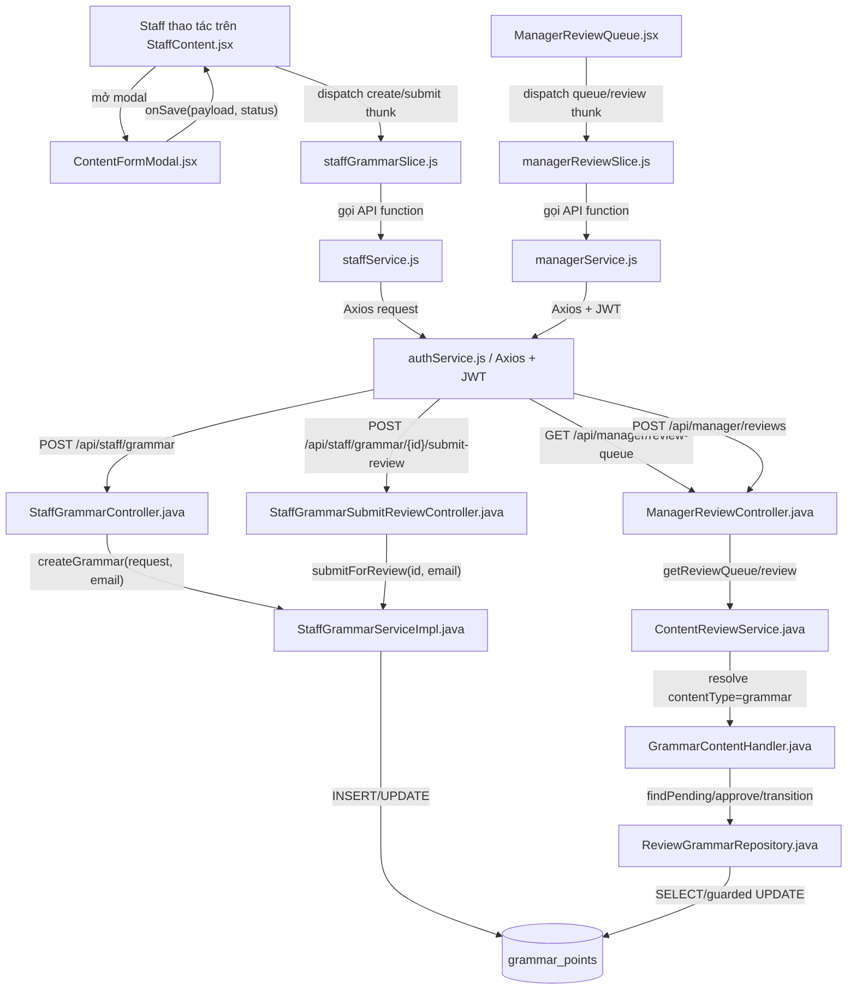
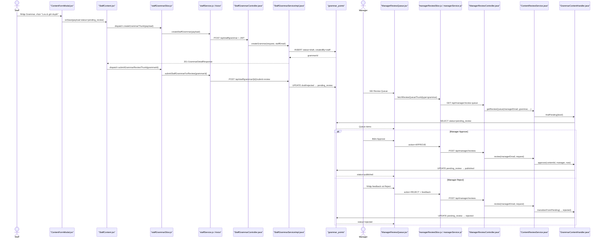

# Create Grammar — Staff gửi nội dung ngữ pháp sang Manager duyệt

> Phạm vi: đường chạy chính từ React UI của Staff → Redux/API → Spring Controller/Service → database → React UI của Manager → API review → backend Approve/Reject.
>
> Tên file giữ theo yêu cầu: `CreateGammar.md`.

## 1. Tóm tắt tổng quan

Feature này cho phép Staff tạo một điểm ngữ pháp dưới trạng thái `draft`, sau đó gửi riêng nội dung đó sang hàng đợi kiểm duyệt bằng thao tác `submit-review`. Manager mở Review Queue, xem các bản ghi `pending_review` rồi chọn Approve hoặc Reject. Approve chuyển bản ghi sang `published` và ghi người/thời gian duyệt; Reject chuyển sang `rejected` và bắt buộc có feedback. Luồng đi qua ba tầng frontend (React component → Redux thunk → Axios API), bốn tầng backend (Controller → Service → Handler → Repository) và bảng `grammar_points`.

Điểm vào chính:

- Staff UI: [StaffContent.jsx](../../../../apps/frontend/src/features/management/staff/StaffContent.jsx), hàm `handleSave`.
- API tạo: `POST /api/staff/grammar`.
- API gửi duyệt: `POST /api/staff/grammar/{grammarId}/submit-review`.
- Manager UI: [ManagerReviewQueue.jsx](../../../../apps/frontend/src/features/management/manager/ManagerReviewQueue.jsx).
- API duyệt/từ chối: `POST /api/manager/reviews`.

### 1.1. Đặc tả luồng: Input → Process → Output → Target

| Chặng | Input | Process | Output | Target |
|---|---|---|---|---|
| Nhập Grammar | Tiêu đề, cấu trúc/công thức, nghĩa, cách dùng, level, ví dụ, `lessonId` tùy chọn | Tạo payload và lựa chọn UI `draft`/`pending_review` | Payload Grammar | `ContentFormModal` → `StaffContent` |
| Tạo Draft | Payload + JWT Staff | `@Valid`, resolve Staff, parse level, trim; kiểm tra lesson cùng level; gán `DRAFT` | HTTP `201`, `grammarId` | `POST /api/staff/grammar` → `grammar_points` |
| Gửi duyệt | `grammarId` + JWT | Kiểm tra tồn tại, owner/quyền, `draft/rejected`, field bắt buộc | `pending_review` | `POST /api/staff/grammar/{id}/submit-review` |
| Tải queue | Manager hợp lệ; type/level/page/size | Xác minh `STAFF_MANAGER/ACTIVE`; query pending và tạo snapshot | Page Grammar chờ duyệt | Review queue API → `GrammarContentHandler` |
| Manager Approve | `{contentType:"grammar", contentId, action:"APPROVE"}` | Chống tự duyệt; guarded update; ghi approver/thời gian/audit | `published` | Review API → `ReviewGrammarRepository` |
| Manager Reject | `{contentType:"grammar", contentId, action:"REJECT", feedback}` | Bắt buộc feedback; guarded update và audit | `rejected`, feedback | Review API → repository/audit |
| Nhánh lỗi | Thiếu field, lesson khác level, sai owner/status/quyền, tự duyệt hoặc xung đột | Rollback/dừng trước chuyển trạng thái | Response lỗi; giữ trạng thái hiện có | Exception handler → frontend |

**Target cuối:** Grammar được kiểm duyệt, có audit trail và chỉ `published` qua guarded update.

## 2. Bản đồ cấu trúc

Phạm vi được giới hạn ở 15 file lõi theo yêu cầu của `analyze-feature.md`.

| File | Vai trò | Loại |
|---|---|---|
| [StaffContent.jsx](../../../../apps/frontend/src/features/management/staff/StaffContent.jsx) | Điều phối thao tác tạo Grammar và gọi gửi duyệt sau khi đã có `grammarId` | React Page |
| [ContentFormModal.jsx](../../../../apps/frontend/src/features/management/components/staff/ContentFormModal.jsx) | Thu thập dữ liệu form và phân biệt “Lưu nháp” với “Lưu & gửi duyệt” | React Component |
| [staffGrammarSlice.js](../../../../apps/frontend/src/features/management/staffGrammarSlice.js) | Chuyển thao tác UI thành async thunk tạo/cập nhật/gửi duyệt | Redux Slice |
| [staffService.js](../../../../apps/frontend/src/shared/api/staffService.js) | Khai báo HTTP request cho Staff Grammar API | API Client |
| [authService.js](../../../../apps/frontend/src/shared/api/authService.js) | Cấu hình Axios base URL, đính JWT và xử lý refresh token | Axios Infrastructure |
| [StaffGrammarController.java](../../../../apps/backend/src/main/java/com/jlpt/feature/staffcontent/grammar/controller/StaffGrammarController.java) | Nhận request tạo Grammar, validate DTO và lấy email từ Authentication | REST Controller |
| [StaffGrammarSubmitReviewController.java](../../../../apps/backend/src/main/java/com/jlpt/feature/staffcontent/grammar/controller/StaffGrammarSubmitReviewController.java) | Nhận request chuyển Grammar từ draft/rejected sang pending_review | REST Controller |
| [StaffGrammarServiceImpl.java](../../../../apps/backend/src/main/java/com/jlpt/feature/staffcontent/grammar/service/StaffGrammarServiceImpl.java) | Chứa nghiệp vụ tạo draft, ownership guard và submit review | Service |
| [ManagerReviewQueue.jsx](../../../../apps/frontend/src/features/management/manager/ManagerReviewQueue.jsx) | Hiển thị hàng đợi và phát sinh thao tác Approve/Reject | React Page |
| [managerReviewSlice.js](../../../../apps/frontend/src/features/management/managerReviewSlice.js) | Quản lý async state của queue/detail/review | Redux Slice |
| [managerService.js](../../../../apps/frontend/src/shared/api/managerService.js) | Gọi Review Queue API và Review API | API Client |
| [ManagerReviewController.java](../../../../apps/backend/src/main/java/com/jlpt/feature/contentreview/controller/ManagerReviewController.java) | Entry point backend cho hàng đợi và quyết định duyệt | REST Controller |
| [ContentReviewService.java](../../../../apps/backend/src/main/java/com/jlpt/feature/contentreview/service/ContentReviewService.java) | Xác minh Manager, cấm tự duyệt, điều phối handler, audit và transaction | Service |
| [GrammarContentHandler.java](../../../../apps/backend/src/main/java/com/jlpt/feature/contentreview/handler/GrammarContentHandler.java) | Adapter riêng cho Grammar, ánh xạ yêu cầu review sang repository | Handler |
| [ReviewGrammarRepository.java](../../../../apps/backend/src/main/java/com/jlpt/feature/contentreview/repository/ReviewGrammarRepository.java) | Query Grammar pending và guarded update trạng thái trong DB | Repository |

## 3. Bản đồ kết nối

### 3.1. Component/Architecture diagram



### 3.2. Bảng kết nối

| Từ | Đến | Cách kết nối | Dữ liệu truyền |
|---|---|---|---|
| `ContentFormModal.jsx` | `StaffContent.jsx` | Callback `onSave` | Form Grammar + `status` |
| `StaffContent.jsx` | `staffGrammarSlice.js` | Redux `dispatch` | Create payload hoặc `grammarId` |
| `staffGrammarSlice.js` | `staffService.js` | Gọi function async | JSON request |
| `staffService.js` | `authService.js` | Axios instance | URL, body, JWT |
| `authService.js` | Staff controller | HTTP REST | Bearer token + JSON |
| `StaffGrammarController` | `StaffGrammarServiceImpl` | Method call | `CreateGrammarRequest` + email principal |
| `StaffGrammarSubmitReviewController` | `StaffGrammarServiceImpl` | Method call | `grammarId` + email principal |
| `StaffGrammarServiceImpl` | database | JPA repository `save` | `GrammarPoint` |
| `ManagerReviewQueue.jsx` | `managerReviewSlice.js` | Redux `dispatch` | filter hoặc review payload |
| `managerReviewSlice.js` | `managerService.js` | Gọi function async | `contentType/contentId/action/feedback` |
| `managerService.js` | `ManagerReviewController` | HTTP REST qua Axios | Review request |
| `ManagerReviewController` | `ContentReviewService` | Method call | Manager email + DTO |
| `ContentReviewService` | `GrammarContentHandler` | Resolver/handler call | Content ID, action, timestamp |
| `GrammarContentHandler` | `ReviewGrammarRepository` | Repository method | Expected status + target status |
| `ReviewGrammarRepository` | `grammar_points` | JPQL SELECT/UPDATE | Trạng thái và audit columns |

## 4. Luồng xử lý theo trình tự

### 4.1. Staff nhập và tạo nội dung

1. Staff mở trang [StaffContent.jsx](../../../../apps/frontend/src/features/management/staff/StaffContent.jsx), chọn tab `grammar` và mở [ContentFormModal.jsx](../../../../apps/frontend/src/features/management/components/staff/ContentFormModal.jsx).
2. Staff nhập tiêu đề, cấu trúc, công thức, ý nghĩa, giải thích cách dùng, JLPT level và câu ví dụ.
3. Staff chọn một trong hai hành động tại [ContentFormModal.jsx#L297](../../../../apps/frontend/src/features/management/components/staff/ContentFormModal.jsx#L297):
   - `handleSaveDraft()` truyền status `draft`.
   - `handleSaveSubmit()` truyền status `pending_review`.
4. Modal gọi `onSave(getSubmitPayload(status))` tại [ContentFormModal.jsx#L294](../../../../apps/frontend/src/features/management/components/staff/ContentFormModal.jsx#L294).
5. [StaffContent.handleSave#L325](../../../../apps/frontend/src/features/management/staff/StaffContent.jsx#L325) nhận payload. Với Grammar mới, nó dispatch `createGrammarThunk(formData)`.
6. [createGrammarThunk#L30](../../../../apps/frontend/src/features/management/staffGrammarSlice.js#L30) gọi `staffService.createStaffGrammar(payload)`.
7. [createStaffGrammar#L113](../../../../apps/frontend/src/shared/api/staffService.js#L113) gọi `POST /staff/grammar` trên Axios instance. Vì Axios dùng API base URL, backend nhận `POST /api/staff/grammar`.
8. [StaffGrammarController.createGrammar#L40](../../../../apps/backend/src/main/java/com/jlpt/feature/staffcontent/grammar/controller/StaffGrammarController.java#L40) yêu cầu `ROLE_STAFF`, chạy `@Valid`, lấy email từ `Authentication` rồi gọi service.
9. [StaffGrammarServiceImpl.createGrammar#L38](../../../../apps/backend/src/main/java/com/jlpt/feature/staffcontent/grammar/service/StaffGrammarServiceImpl.java#L38):
   - Resolve Staff từ email JWT.
   - Parse `jlptLevel`.
   - Trim dữ liệu.
   - Luôn đặt `status=DRAFT`.
   - Hệ thống tự đặt `createdBy=staff`, không tin ID do client gửi.
   - Nếu có `lessonId`, kiểm tra Lesson cùng JLPT level.
   - Lưu `GrammarPoint` và trả `GrammarDetailResponse`.
10. Frontend nhận response 201, lấy `grammarId` từ object vừa tạo.

### 4.2. Staff gửi Manager duyệt

11. Nếu lựa chọn frontend là `pending_review`, [StaffContent.jsx#L341](../../../../apps/frontend/src/features/management/staff/StaffContent.jsx#L341) dispatch request thứ hai `submitGrammarReviewThunk(grammarId)`.
12. [submitGrammarReviewThunk#L55](../../../../apps/frontend/src/features/management/staffGrammarSlice.js#L55) gọi `submitStaffGrammarForReview(grammarId)`.
13. [staffService.js#L123](../../../../apps/frontend/src/shared/api/staffService.js#L123) gửi `POST /staff/grammar/{grammarId}/submit-review`.
14. [StaffGrammarSubmitReviewController.submitReview#L28](../../../../apps/backend/src/main/java/com/jlpt/feature/staffcontent/grammar/controller/StaffGrammarSubmitReviewController.java#L28) lấy `grammarId`, email principal và gọi service.
15. [StaffGrammarServiceImpl.submitForReview#L178](../../../../apps/backend/src/main/java/com/jlpt/feature/staffcontent/grammar/service/StaffGrammarServiceImpl.java#L178):
   - Tìm Grammar chưa deleted.
   - Kiểm tra ownership hoặc quyền manager.
   - Chỉ cho gửi nếu status là `draft` hoặc `rejected`.
   - Kiểm tra lại các field bắt buộc.
   - Đặt status thành `pending_review` và save.
16. Frontend hiển thị toast “Đã tạo và gửi duyệt ngữ pháp thành công”.

### 4.3. Manager tải hàng chờ

17. [ManagerReviewQueue.jsx#L63](../../../../apps/frontend/src/features/management/manager/ManagerReviewQueue.jsx#L63) dispatch `fetchReviewQueueThunk` với filter type, level, page, size.
18. [managerReviewSlice.js#L6](../../../../apps/frontend/src/features/management/managerReviewSlice.js#L6) gọi `managerService.getReviewQueue`.
19. [managerService.js#L5](../../../../apps/frontend/src/shared/api/managerService.js#L5) gửi `GET /manager/review-queue`; backend nhận `GET /api/manager/review-queue`.
20. [ManagerReviewController.getReviewQueue#L47](../../../../apps/backend/src/main/java/com/jlpt/feature/contentreview/controller/ManagerReviewController.java#L47) yêu cầu `ROLE_STAFF` rồi gọi `ContentReviewService.getReviewQueue`.
21. Service gọi `requireManager` để xác nhận Staff có `STAFF_MANAGER` và `ACTIVE`.
22. Với filter `type=grammar`, resolver chọn `GrammarContentHandler`.
23. [GrammarContentHandler.findPending#L36](../../../../apps/backend/src/main/java/com/jlpt/feature/contentreview/handler/GrammarContentHandler.java#L36) gọi repository tìm status `PENDING_REVIEW`.
24. [ReviewGrammarRepository.findPending#L21](../../../../apps/backend/src/main/java/com/jlpt/feature/contentreview/repository/ReviewGrammarRepository.java#L21) query `grammar_points`, join creator và sắp `updatedAt ASC`.
25. Queue response quay về Redux và React render danh sách.

### 4.4. Manager Approve

26. Manager bấm Approve. [ManagerReviewQueue.handleApprove#L81](../../../../apps/frontend/src/features/management/manager/ManagerReviewQueue.jsx#L81) dispatch:

    `{ contentType: "grammar", contentId, action: "APPROVE" }`.

27. [managerReviewSlice.js#L30](../../../../apps/frontend/src/features/management/managerReviewSlice.js#L30) gọi [managerService.reviewContent#L18](../../../../apps/frontend/src/shared/api/managerService.js#L18).
28. Axios gửi `POST /api/manager/reviews`.
29. [ManagerReviewController.review#L72](../../../../apps/backend/src/main/java/com/jlpt/feature/contentreview/controller/ManagerReviewController.java#L72) validate `ReviewActionRequest` rồi gọi service.
30. [ContentReviewService.review#L117](../../../../apps/backend/src/main/java/com/jlpt/feature/contentreview/service/ContentReviewService.java#L117):
   - Xác minh manager.
   - Resolve `contentType=grammar`.
   - Tải snapshot hiện tại.
   - Cấm manager duyệt nội dung do chính mình tạo.
   - Gọi `GrammarContentHandler.approve`.
31. Handler gọi guarded update của repository: chỉ update khi status hiện tại vẫn là `PENDING_REVIEW`.
32. Database đổi sang `PUBLISHED`, đặt `approvedBy`, `publishedAt` và `updatedAt`.
33. Service ghi review audit trong cùng transaction và trả status `published`.
34. Manager UI hiện toast thành công và fetch lại queue.

### 4.5. Manager Reject

35. Manager bấm Reject, [ManagerReviewQueue.handleReject#L95](../../../../apps/frontend/src/features/management/manager/ManagerReviewQueue.jsx#L95) mở feedback modal.
36. Khi submit feedback, [submitReject#L99](../../../../apps/frontend/src/features/management/manager/ManagerReviewQueue.jsx#L99) dispatch:

    `{ contentType: "grammar", contentId, action: "REJECT", feedback }`.

37. Request đi qua cùng `POST /api/manager/reviews`.
38. Service bắt buộc feedback không rỗng tại [ContentReviewService.java#L147](../../../../apps/backend/src/main/java/com/jlpt/feature/contentreview/service/ContentReviewService.java#L147).
39. `GrammarContentHandler.transitionFromPending` gọi guarded update `pending_review → rejected`.
40. Service ghi audit action REJECT cùng feedback, trả status `rejected` và Manager UI tải lại queue.

### 4.6. Sequence diagram



## 5. Vai trò từng đoạn code quan trọng

### 5.1. Frontend tách Create và Submit Review

File: [StaffContent.jsx — dòng 325–343](../../../../apps/frontend/src/features/management/staff/StaffContent.jsx#L325)

```jsx
// Giải thích: handleSave nhận payload đã được modal gắn contentType/status.
const handleSave = async (formData) => {
  const ct = formData.contentType;
  try {
    if (ct === "grammar") {
      if (editItem) {
        // Giải thích: bản ghi cũ được update trước.
        const grammarId = editItem.grammarId || editItem.id;
        await dispatch(updateGrammarThunk({ grammarId, payload: formData })).unwrap();
        if (formData.status === "pending_review") {
          // Giải thích: gửi request thứ hai để đổi trạng thái sang pending_review.
          await dispatch(submitGrammarReviewThunk(grammarId)).unwrap();
        }
      } else {
        // Giải thích: create API luôn tạo draft và trả về ID.
        const created = await dispatch(createGrammarThunk(formData)).unwrap();
        const grammarId = created.grammarId || created.id;
        if (formData.status === "pending_review" && grammarId) {
          // Giải thích: chỉ submit sau khi create thành công và đã có ID.
          await dispatch(submitGrammarReviewThunk(grammarId)).unwrap();
        }
      }
    }
  } catch (err) {
    // Giải thích: unwrap đẩy rejected thunk vào catch để UI hiện toast lỗi.
  }
};
```

Ý nghĩa: `pending_review` trong form không được gửi thẳng vào create backend để tin tưởng. Backend tạo draft trước, sau đó chạy endpoint nghiệp vụ riêng có guard đầy đủ.

### 5.2. API tạo Grammar

File: [StaffGrammarController.java — dòng 40–44](../../../../apps/backend/src/main/java/com/jlpt/feature/staffcontent/grammar/controller/StaffGrammarController.java#L40)

```java
@PostMapping
public ResponseEntity<ApiResponse<GrammarDetailResponse>> createGrammar(
        @Valid @RequestBody CreateGrammarRequest request,
        Authentication authentication) {
    // Giải thích: email lấy từ JWT principal, không lấy createdBy từ client.
    GrammarDetailResponse data =
            staffGrammarService.createGrammar(request, authentication.getName());
    // Giải thích: trả HTTP 201 và body ApiResponse chuẩn.
    return ResponseEntity.status(HttpStatus.CREATED)
            .body(ApiResponse.created("Tạo ngữ pháp thành công", data));
}
```

`@PreAuthorize("hasRole('STAFF')")` ở class chặn role khác trước khi method chạy.

### 5.3. Backend luôn tạo Draft

File: [StaffGrammarServiceImpl.java — dòng 48–69](../../../../apps/backend/src/main/java/com/jlpt/feature/staffcontent/grammar/service/StaffGrammarServiceImpl.java#L48)

```java
GrammarPoint grammar = GrammarPoint.builder()
        // Giải thích: dữ liệu nội dung lấy từ DTO và được trim ở Service.
        .title(request.getTitle())
        .structure(request.getStructure().trim())
        .formula(trimToNull(request.getFormula()))
        .meaning(request.getMeaning().trim())
        .usageExplanation(request.getUsageExplanation().trim())
        .jlptLevel(level)
        .exampleSentenceJp(request.getExampleSentenceJp().trim())
        .exampleSentenceVi(trimToNull(request.getExampleSentenceVi()))
        // Giải thích: bất kể status client gửi gì, create luôn là DRAFT.
        .status(ContentStatus.DRAFT)
        // Giải thích: creator do backend lấy từ tài khoản đăng nhập.
        .createdBy(staff)
        .build();

// Giải thích: JPA INSERT grammar_points và trả entity đã có ID.
GrammarPoint saved = grammarRepository.save(grammar);
```

### 5.4. Guard khi gửi duyệt

File: [StaffGrammarServiceImpl.java — dòng 178–208](../../../../apps/backend/src/main/java/com/jlpt/feature/staffcontent/grammar/service/StaffGrammarServiceImpl.java#L178)

```java
public GrammarSubmitReviewResponse submitForReview(Long grammarId, String staffEmail) {
    // Giải thích: resolve Staff từ JWT email và tìm nội dung chưa deleted.
    StaffUser staff = resolveStaff(staffEmail);
    GrammarPoint grammar = grammarRepository
            .findByIdAndStatusNot(grammarId, ContentStatus.DELETED)
            .orElseThrow(() -> GrammarBusinessException.grammarNotFound(grammarId));

    // Giải thích: Staff thường chỉ được thao tác nội dung của mình; Manager được phép ngoại lệ.
    guardOwnershipOrManager(grammar, staff);

    // Giải thích: published/pending_review không được submit lần nữa.
    if (grammar.getStatus() != ContentStatus.DRAFT
            && grammar.getStatus() != ContentStatus.REJECTED) {
        throw GrammarBusinessException.submitInvalidStatus(
                grammar.getStatus().getValue());
    }

    // Giải thích: backend kiểm tra lại các field bắt buộc trước khi vào queue.
    if (!StringUtils.hasText(grammar.getStructure()))
        throw GrammarBusinessException.submitIncomplete("structure");
    if (!StringUtils.hasText(grammar.getMeaning()))
        throw GrammarBusinessException.submitIncomplete("meaning");

    // Giải thích: đây là state transition chính Staff → Manager queue.
    grammar.setStatus(ContentStatus.PENDING_REVIEW);
    grammarRepository.save(grammar);
}
```

### 5.5. Manager review và các guard

File: [ContentReviewService.java — dòng 117–152](../../../../apps/backend/src/main/java/com/jlpt/feature/contentreview/service/ContentReviewService.java#L117)

```java
@Transactional
public ReviewResultResponse review(
        String managerEmail,
        ReviewActionRequest request) {
    // Giải thích: ROLE_STAFF ở Controller chưa đủ; Service bắt buộc STAFF_MANAGER active.
    StaffUser manager = requireManager(managerEmail);
    ContentType type = ContentType.fromValue(request.getContentType());
    ReviewAction action = ReviewAction.fromValue(request.getAction());

    // Giải thích: contentType=grammar được resolver ánh xạ sang GrammarContentHandler.
    ReviewableContentHandler handler = resolver.resolve(type);
    ContentSnapshot snapshot = handler.findActiveById(request.getContentId())
            .orElseThrow(() -> new ContentNotFoundException(
                    type.getValue(), request.getContentId()));

    // Giải thích: nguyên tắc bốn mắt, người tạo không được tự duyệt.
    guardSelfReview(snapshot, manager);

    LocalDateTime now = LocalDateTime.now();
    if (action == ReviewAction.APPROVE) {
        // Giải thích: guarded update chỉ thành công nếu DB vẫn pending_review.
        int rows = handler.approve(request.getContentId(), manager, now);
        ensureUpdated(rows);
        // Giải thích: audit và đổi trạng thái nằm chung transaction.
        reviewAuditService.log(
                manager, ReviewAuditService.ACTION_APPROVE,
                type, handler.tableName(),
                request.getContentId(), request.getFeedback());
    }

    // Giải thích: Reject bắt buộc có feedback.
    if (!StringUtils.hasText(request.getFeedback())) {
        throw new FeedbackRequiredException();
    }
    int rows = handler.transitionFromPending(
            request.getContentId(), STATUS_REJECTED, now);
    ensureUpdated(rows);
}
```

### 5.6. Guarded update chống duyệt đồng thời

File: [ReviewGrammarRepository.java — dòng 35–51](../../../../apps/backend/src/main/java/com/jlpt/feature/contentreview/repository/ReviewGrammarRepository.java#L35)

```java
@Modifying(clearAutomatically = true, flushAutomatically = true)
@Query("""
    UPDATE GrammarPoint g
       SET g.status = :to,
           g.approvedBy = :mgr,
           g.publishedAt = :now,
           g.updatedAt = :now
     WHERE g.id = :id
       AND g.status = :from
    """)
int approve(
        Long contentId,
        StaffUser manager,
        LocalDateTime reviewTimestamp,
        ContentStatus expectedStatus,
        ContentStatus targetStatus);
// Giải thích: WHERE status=:from đảm bảo chỉ pending_review mới đổi được.
// Nếu Manager khác đã xử lý trước, affectedRows=0 và Service ném ConcurrentReviewException.
```

## 6. Dữ liệu di chuyển như thế nào

### 6.1. Dữ liệu Staff nhập

Payload frontend mang các field Grammar:

| Frontend field | Backend sử dụng | Biến đổi | Nơi lưu |
|---|---|---|---|
| `title` | `request.getTitle()` | Giữ nguyên | `grammar_points.title` |
| `structure` | `request.getStructure()` | `trim()` | `grammar_points.structure` |
| `formula` | `request.getFormula()` | `trimToNull` | `grammar_points.formula` |
| `meaning` | `request.getMeaning()` | `trim()` | `grammar_points.meaning` |
| `usageExplanation` | `request.getUsageExplanation()` | `trim()` | `grammar_points.usage_explanation` |
| `jlptLevel` | `request.getJlptLevel()` | `JlptLevel.valueOf` | `grammar_points.jlpt_level` |
| `exampleSentenceJp` | getter tương ứng | `trim()` | Cột câu ví dụ JP |
| `exampleSentenceVi` | getter tương ứng | `trimToNull` | Cột câu ví dụ VI |
| `lessonId` | `request.getLessonId()` | Resolve Lesson + kiểm tra cùng level | Foreign key Lesson |
| `status` từ UI | Không được create service tin dùng | Create luôn ép `DRAFT` | `grammar_points.status` |

`createdBy` không đi từ frontend. Backend lấy email trong JWT, tìm `StaffUser` rồi gắn creator.

### 6.2. State transition

```text
Create API:
    client status bất kỳ → backend DRAFT

Submit Review API:
    DRAFT hoặc REJECTED → PENDING_REVIEW

Manager Approve:
    PENDING_REVIEW → PUBLISHED
    + approvedBy
    + publishedAt

Manager Reject:
    PENDING_REVIEW → REJECTED
    + feedback nằm trong review audit
```

### 6.3. Review request

Frontend Manager gửi:

```json
{
  "contentType": "grammar",
  "contentId": 123,
  "action": "APPROVE",
  "feedback": null
}
```

hoặc:

```json
{
  "contentType": "grammar",
  "contentId": 123,
  "action": "REJECT",
  "feedback": "Cần bổ sung giải thích cách dùng."
}
```

Backend chuyển:

- `contentType` → `ContentType.GRAMMAR` → `GrammarContentHandler`.
- `action` → `ReviewAction.APPROVE/REJECT`.
- `contentId` → guarded JPQL update.
- `feedback` → bắt buộc khi Reject và được chuyển vào `ReviewAuditService.log`.

## 7. Bảng tra cứu tổng hợp

| Bước | File | Function | Kết nối tới | Dữ liệu | Ghi chú |
|---:|---|---|---|---|---|
| 1 | [ContentFormModal.jsx](../../../../apps/frontend/src/features/management/components/staff/ContentFormModal.jsx) | `handleSaveDraft/handleSaveSubmit` | `StaffContent.handleSave` | Form + status | Chọn Draft hoặc gửi duyệt |
| 2 | [StaffContent.jsx](../../../../apps/frontend/src/features/management/staff/StaffContent.jsx) | `handleSave` | Redux thunk | Grammar payload | Create trước, submit sau |
| 3 | [staffGrammarSlice.js](../../../../apps/frontend/src/features/management/staffGrammarSlice.js) | `createGrammarThunk` | `staffService` | JSON | Quản lý pending/rejected |
| 4 | [staffService.js](../../../../apps/frontend/src/shared/api/staffService.js) | `createStaffGrammar` | Axios | POST body | URL tương đối với API base |
| 5 | [StaffGrammarController.java](../../../../apps/backend/src/main/java/com/jlpt/feature/staffcontent/grammar/controller/StaffGrammarController.java) | `createGrammar` | Grammar service | DTO + email | `ROLE_STAFF` + `@Valid` |
| 6 | [StaffGrammarServiceImpl.java](../../../../apps/backend/src/main/java/com/jlpt/feature/staffcontent/grammar/service/StaffGrammarServiceImpl.java) | `createGrammar` | JPA | GrammarPoint | Luôn tạo DRAFT |
| 7 | [StaffContent.jsx](../../../../apps/frontend/src/features/management/staff/StaffContent.jsx) | `handleSave` | submit thunk | grammarId | Chỉ khi UI chọn pending_review |
| 8 | [StaffGrammarSubmitReviewController.java](../../../../apps/backend/src/main/java/com/jlpt/feature/staffcontent/grammar/controller/StaffGrammarSubmitReviewController.java) | `submitReview` | Grammar service | ID + email | Endpoint riêng |
| 9 | [StaffGrammarServiceImpl.java](../../../../apps/backend/src/main/java/com/jlpt/feature/staffcontent/grammar/service/StaffGrammarServiceImpl.java) | `submitForReview` | DB | status | DRAFT/REJECTED → PENDING_REVIEW |
| 10 | [ManagerReviewQueue.jsx](../../../../apps/frontend/src/features/management/manager/ManagerReviewQueue.jsx) | `fetchQueue` | manager thunk | filters | Tải queue |
| 11 | [managerService.js](../../../../apps/frontend/src/shared/api/managerService.js) | `getReviewQueue` | Manager API | type/level/page | GET queue |
| 12 | [ManagerReviewController.java](../../../../apps/backend/src/main/java/com/jlpt/feature/contentreview/controller/ManagerReviewController.java) | `getReviewQueue` | Review service | manager email | Controller chỉ check ROLE_STAFF |
| 13 | [ContentReviewService.java](../../../../apps/backend/src/main/java/com/jlpt/feature/contentreview/service/ContentReviewService.java) | `getReviewQueue` | Grammar handler | type=grammar | Service check STAFF_MANAGER |
| 14 | [GrammarContentHandler.java](../../../../apps/backend/src/main/java/com/jlpt/feature/contentreview/handler/GrammarContentHandler.java) | `findPending` | Review repository | PENDING_REVIEW | Adapter theo content type |
| 15 | [ManagerReviewQueue.jsx](../../../../apps/frontend/src/features/management/manager/ManagerReviewQueue.jsx) | `handleApprove/submitReject` | review thunk | action + feedback | Phát sinh quyết định |
| 16 | [ManagerReviewController.java](../../../../apps/backend/src/main/java/com/jlpt/feature/contentreview/controller/ManagerReviewController.java) | `review` | Review service | Review DTO | POST reviews |
| 17 | [ContentReviewService.java](../../../../apps/backend/src/main/java/com/jlpt/feature/contentreview/service/ContentReviewService.java) | `review` | Handler + audit | Manager/action | Self-review guard |
| 18 | [GrammarContentHandler.java](../../../../apps/backend/src/main/java/com/jlpt/feature/contentreview/handler/GrammarContentHandler.java) | `approve/transitionFromPending` | Repository | State transition | Grammar-specific |
| 19 | [ReviewGrammarRepository.java](../../../../apps/backend/src/main/java/com/jlpt/feature/contentreview/repository/ReviewGrammarRepository.java) | `approve/transition` | Database | expected/target status | Chống xử lý đồng thời |

## 8. Các mục cần bổ sung context

Do feature đầy đủ vượt 15 file, tài liệu tập trung vào 15 file lõi. Các phần sau có tồn tại trong source nhưng không được giải phẫu riêng:

1. DTO validation chi tiết:
   - [CreateGrammarRequest.java](../../../../apps/backend/src/main/java/com/jlpt/feature/staffcontent/grammar/dto/CreateGrammarRequest.java)
   - [ReviewActionRequest.java](../../../../apps/backend/src/main/java/com/jlpt/feature/contentreview/dto/ReviewActionRequest.java)
2. Entity và mapping cột đầy đủ:
   - [GrammarPoint.java](../../../../apps/backend/src/main/java/com/jlpt/feature/learning/GrammarPoint.java)
3. Resolver ánh xạ `ContentType.GRAMMAR` sang handler:
   - [ReviewableContentResolver.java](../../../../apps/backend/src/main/java/com/jlpt/feature/contentreview/service/ReviewableContentResolver.java)
4. Audit persistence:
   - [ReviewAuditService.java](../../../../apps/backend/src/main/java/com/jlpt/feature/contentreview/service/ReviewAuditService.java)
5. Nội dung feedback sau Reject được Staff đọc lại qua feature feedback riêng; phần UI/API đó không nằm trong scope 15 file lõi.
6. Không tìm thấy trong source code đã đọc một notification push riêng gửi tức thời cho Manager. Manager thấy item khi Review Queue được fetch/refetch.

### Kết luận ngắn

Luồng không phải một request duy nhất. Với “Lưu & gửi duyệt”, frontend thực hiện tuần tự:

```text
POST /api/staff/grammar
    → tạo DRAFT, nhận grammarId

POST /api/staff/grammar/{grammarId}/submit-review
    → DRAFT/REJECTED thành PENDING_REVIEW

GET /api/manager/review-queue?type=grammar
    → Manager thấy nội dung

POST /api/manager/reviews
    → APPROVE: PUBLISHED
    → REJECT: REJECTED + audit feedback
```
