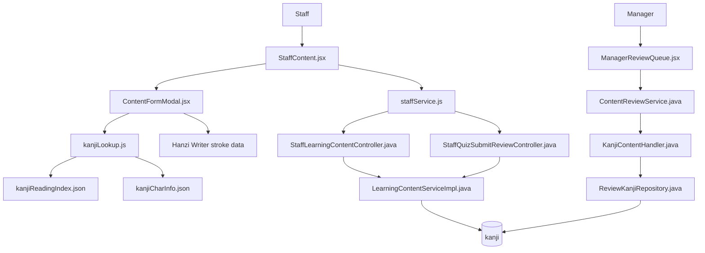
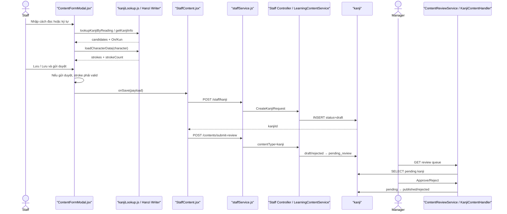

# Create Kanji — Staff tạo Kanji và gửi Manager duyệt

> Phạm vi: Staff tìm/nhập Kanji, frontend kiểm tra dữ liệu nét, backend tạo Draft, submit-review và Manager Approve/Reject.

## 1. Tóm tắt tổng quan

Staff mở trang quản lý học liệu, chọn Kanji và mở `ContentFormModal`. Staff có thể tìm Kanji bằng romaji/kana; frontend tra index cục bộ để gợi ý ký tự, tự điền âm On/Kun và dùng Hanzi Writer để tải dữ liệu nét. Khi lưu, frontend gọi `POST /api/staff/kanji`; backend validate ký tự, nghĩa, JLPT level, ít nhất một âm On/Kun, chống trùng ký tự và luôn tạo `DRAFT` trong bảng `kanji`. Nếu chọn **Lưu và gửi duyệt**, frontend chỉ cho tiếp tục khi dữ liệu nét hợp lệ, sau đó gọi endpoint submit-review chung với `contentType=kanji`; backend chuyển `DRAFT/REJECTED → PENDING_REVIEW`. Manager dùng `KanjiContentHandler` để Approve thành `PUBLISHED` hoặc Reject thành `REJECTED` kèm feedback.

Điểm vào:

- Staff UI: [StaffContent.jsx](../../../../apps/frontend/src/features/management/staff/StaffContent.jsx).
- Form Kanji: [ContentFormModal.jsx](../../../../apps/frontend/src/features/management/components/staff/ContentFormModal.jsx).
- Tra cứu Kanji: [kanjiLookup.js](../../../../apps/frontend/src/shared/utils/kanjiLookup.js).
- Tạo Kanji: `POST /api/staff/kanji`.
- Gửi duyệt: `POST /api/staff/contents/submit-review`.
- Manager review: `POST /api/manager/reviews`.

### 1.1. Đặc tả luồng: Input → Process → Output → Target

| Chặng | Input | Process | Output | Target |
|---|---|---|---|---|
| Tra cứu | Romaji/kana/ký tự Staff nhập | Tra index, gợi ý ký tự, tự điền On/Kun và tải dữ liệu nét | Form có dữ liệu tham khảo | `ContentFormModal` → lookup/Hanzi Writer |
| Hoàn thiện | Ký tự, On/Kun, nghĩa, level, ví dụ, stroke data | Validate field; yêu cầu stroke data hợp lệ khi gửi duyệt | Payload Kanji | Frontend form |
| Tạo Draft | Payload + JWT Staff | Resolve Staff, chống trùng, parse level; gán `status=draft` | HTTP `201`, `kanjiId` | `POST /api/staff/kanji` → `kanji` |
| Gửi duyệt | `{contentType:"kanji", contentId}` | Kiểm tra owner, `draft/rejected`, field và stroke data | `pending_review` | Submit-review API → learning service |
| Manager Approve | `{contentType:"kanji", contentId, action:"APPROVE"}` | Chống tự duyệt/đồng thời; guarded update và audit | `published` | Review API → `KanjiContentHandler` |
| Manager Reject | `{contentType:"kanji", contentId, action:"REJECT", feedback}` | Bắt buộc feedback; guarded update và audit | `rejected`, lý do | Review API → repository/audit |
| Nhánh lỗi | Ký tự trùng, thiếu field/stroke, sai owner/status/quyền | Dừng tại validation/guard | Response lỗi; giữ trạng thái trước | Exception handler → frontend |

**Target cuối:** Kanji đầy đủ dữ liệu học và nét viết, ở trạng thái `published`.

## 2. Bản đồ cấu trúc

| File | Vai trò | Loại |
|---|---|---|
| [StaffContent.jsx](../../../../apps/frontend/src/features/management/staff/StaffContent.jsx) | Điều phối tạo/cập nhật Kanji và submit-review | React Page |
| [ContentFormModal.jsx](../../../../apps/frontend/src/features/management/components/staff/ContentFormModal.jsx) | Nhập Kanji, tra cứu cách đọc và kiểm tra dữ liệu nét | React Component |
| [kanjiLookup.js](../../../../apps/frontend/src/shared/utils/kanjiLookup.js) | Tra reading index, thông tin On/Kun và tải stroke data | Utility |
| [kanjiReadingIndex.json](../../../../apps/frontend/src/shared/data/kanjiReadingIndex.json) | Ánh xạ cách đọc sang danh sách ký tự | Data |
| [kanjiCharInfo.json](../../../../apps/frontend/src/shared/data/kanjiCharInfo.json) | Thông tin âm On/Kun để tự điền | Data |
| [staffLearningSlice.js](../../../../apps/frontend/src/features/management/staffLearningSlice.js) | Tải danh sách Kanji vào Redux | Redux Slice |
| [staffService.js](../../../../apps/frontend/src/shared/api/staffService.js) | Gọi CRUD và submit-review API | API Service |
| [authService.js](../../../../apps/frontend/src/shared/api/authService.js) | Axios base URL và JWT | Axios Client |
| [StaffLearningContentController.java](../../../../apps/backend/src/main/java/com/jlpt/feature/staffcontent/learning/controller/StaffLearningContentController.java) | Nhận API tạo Kanji | Controller |
| [StaffQuizSubmitReviewController.java](../../../../apps/backend/src/main/java/com/jlpt/feature/staffcontent/quiz/controller/StaffQuizSubmitReviewController.java) | Endpoint submit-review chung, route Kanji | Controller |
| [CreateKanjiRequest.java](../../../../apps/backend/src/main/java/com/jlpt/feature/staffcontent/learning/dto/CreateKanjiRequest.java) | Validate payload tạo Kanji | DTO |
| [LearningContentServiceImpl.java](../../../../apps/backend/src/main/java/com/jlpt/feature/staffcontent/learning/service/LearningContentServiceImpl.java) | Tạo Draft, chống trùng và chuyển Pending Review | Service |
| [Kanji.java](../../../../apps/backend/src/main/java/com/jlpt/feature/learning/Kanji.java) | Entity ánh xạ bảng `kanji` | Entity |
| [StaffKanjiRepository.java](../../../../apps/backend/src/main/java/com/jlpt/feature/staffcontent/learning/repository/StaffKanjiRepository.java) | Lưu/tìm Kanji của Staff | Repository |
| [ManagerReviewQueue.jsx](../../../../apps/frontend/src/features/management/manager/ManagerReviewQueue.jsx) | Hiển thị hàng chờ và Approve/Reject | React Page |
| [ContentReviewService.java](../../../../apps/backend/src/main/java/com/jlpt/feature/contentreview/service/ContentReviewService.java) | Kiểm tra Manager và điều phối review | Service |
| [KanjiContentHandler.java](../../../../apps/backend/src/main/java/com/jlpt/feature/contentreview/handler/KanjiContentHandler.java) | Adapter kiểm duyệt Kanji | Handler |
| [ReviewKanjiRepository.java](../../../../apps/backend/src/main/java/com/jlpt/feature/contentreview/repository/ReviewKanjiRepository.java) | Query pending và cập nhật trạng thái | Repository |

Feature vượt 15 file do có nhánh dữ liệu tra cứu/nét chữ và nhánh Manager review. Các giới hạn được ghi tại mục 8.

## 3. Bản đồ kết nối



| Từ | Đến | Kết nối | Dữ liệu |
|---|---|---|---|
| Modal | `kanjiLookup.js` | import function | romaji/kana/ký tự |
| Lookup | JSON data | import | reading index, On/Kun |
| Modal | Hanzi Writer | `loadCharacterData` | characterValue/strokes |
| Modal | StaffContent | `onSave(payload)` | form + UI status |
| StaffContent | staffService | async call | payload/kanjiId |
| staffService | Staff controller | Axios | JSON + JWT |
| Staff controller | Learning service | method call | DTO + email |
| Learning service | Kanji repository | JPA | entity/status |
| Common submit controller | Learning service | switch `kanji` | contentId |
| Manager UI | Review service | Review API | type/id/action/feedback |
| Review service | Kanji handler | resolver | snapshot/status |
| Kanji handler | Review repository | JPQL | pending → published/rejected |

## 4. Luồng xử lý theo trình tự

### 4.1. Staff mở form và tìm Kanji

1. Staff chọn tab `kanji`, khai báo tại [StaffContent.jsx#L58](../../../../apps/frontend/src/features/management/staff/StaffContent.jsx#L58).
2. Form Kanji bắt đầu tại [ContentFormModal.jsx#L676](../../../../apps/frontend/src/features/management/components/staff/ContentFormModal.jsx#L676).
3. Staff có thể nhập romaji/kana vào ô tìm kiếm. `handleKanjiQuery` tại [ContentFormModal.jsx#L127](../../../../apps/frontend/src/features/management/components/staff/ContentFormModal.jsx#L127) gọi `lookupKanjiByReading`.
4. [kanjiLookup.lookupKanjiByReading#L71](../../../../apps/frontend/src/shared/utils/kanjiLookup.js#L71) chuyển cách đọc và tra `kanjiReadingIndex.json`, trả `{kana,candidates}`.
5. Khi Staff chọn một ký tự, `applyKanji` tại [ContentFormModal.jsx#L134](../../../../apps/frontend/src/features/management/components/staff/ContentFormModal.jsx#L134) gán `characterValue`; `getKanjiInfo` tự điền `onyomi/kunyomi` nếu có.

### 4.2. Frontend kiểm tra dữ liệu nét

6. Effect tại [ContentFormModal.jsx#L146](../../../../apps/frontend/src/features/management/components/staff/ContentFormModal.jsx#L146) chạy khi `characterValue` thay đổi.
7. `HanziWriter.loadCharacterData` tại dòng 155 dùng `jpCharDataLoader`, đếm `data.strokes.length` và đồng bộ `strokeCount`.
8. Trạng thái kiểm tra là `idle/checking/valid/invalid`; UI hiển thị kết quả tại [ContentFormModal.jsx#L740](../../../../apps/frontend/src/features/management/components/staff/ContentFormModal.jsx#L740).
9. Lưu Draft vẫn được phép khi stroke data chưa hợp lệ. Riêng gửi duyệt, `submit('pending_review')` tại [ContentFormModal.jsx#L281](../../../../apps/frontend/src/features/management/components/staff/ContentFormModal.jsx#L281) chặn nếu đang kiểm tra hoặc không `valid`.

### 4.3. Frontend tạo Kanji

10. Staff nhập `characterValue`, `onyomi`, `kunyomi`, `meaning`, `strokeCount`, `jlptLevel` và các trường ví dụ.
11. `getSubmitPayload` tại [ContentFormModal.jsx#L244](../../../../apps/frontend/src/features/management/components/staff/ContentFormModal.jsx#L244) tạo payload; nút Lưu nháp truyền `draft`, nút Lưu và gửi duyệt truyền `pending_review`.
12. `StaffContent.handleSave` tại [StaffContent.jsx#L325](../../../../apps/frontend/src/features/management/staff/StaffContent.jsx#L325) đi vào nhánh Kanji tại dòng 383.
13. Tạo mới gọi `createStaffKanji(formData)` tại [StaffContent.jsx#L394](../../../../apps/frontend/src/features/management/staff/StaffContent.jsx#L394).
14. [staffService.createStaffKanji#L226](../../../../apps/frontend/src/shared/api/staffService.js#L226) gửi `POST /staff/kanji`.

### 4.4. Backend tạo Draft

15. [StaffLearningContentController.createKanji#L137](../../../../apps/backend/src/main/java/com/jlpt/feature/staffcontent/learning/controller/StaffLearningContentController.java#L137) nhận `@Valid CreateKanjiRequest` và Authentication.
16. [CreateKanjiRequest.java#L17](../../../../apps/backend/src/main/java/com/jlpt/feature/staffcontent/learning/dto/CreateKanjiRequest.java#L17) yêu cầu `characterValue`, `meaning`, JLPT N5–N1; `strokeCount` nếu có phải >=1.
17. [LearningContentServiceImpl.createKanji#L178](../../../../apps/backend/src/main/java/com/jlpt/feature/staffcontent/learning/service/LearningContentServiceImpl.java#L178) yêu cầu ít nhất một trong `onyomi/kunyomi`.
18. Service dùng `existsByCharacterValue` tại dòng 187 để chặn ký tự trùng.
19. Service build Kanji với `status=DRAFT`, `createdBy=staff`, rồi lưu tại [LearningContentServiceImpl.java#L191](../../../../apps/backend/src/main/java/com/jlpt/feature/staffcontent/learning/service/LearningContentServiceImpl.java#L191).
20. API trả HTTP 201 cùng `kanjiId`.

### 4.5. Staff gửi Manager duyệt

21. Nếu form có UI status `pending_review`, StaffContent lấy `res.data.kanjiId` và gọi `submitAssessmentForReview('kanji', kanjiId)` tại [StaffContent.jsx#L396](../../../../apps/frontend/src/features/management/staff/StaffContent.jsx#L396).
22. [staffService.submitAssessmentForReview#L192](../../../../apps/frontend/src/shared/api/staffService.js#L192) gửi `POST /staff/contents/submit-review` với `{contentType:'kanji',contentId}`.
23. [StaffQuizSubmitReviewController.java#L99](../../../../apps/backend/src/main/java/com/jlpt/feature/staffcontent/quiz/controller/StaffQuizSubmitReviewController.java#L99) nhận nhánh Kanji và gọi learning service.
24. [LearningContentServiceImpl.submitForReview#L252](../../../../apps/backend/src/main/java/com/jlpt/feature/staffcontent/learning/service/LearningContentServiceImpl.java#L252) switch `kanji` sang `submitKanji`.
25. [LearningContentServiceImpl.submitKanji#L616](../../../../apps/backend/src/main/java/com/jlpt/feature/staffcontent/learning/service/LearningContentServiceImpl.java#L616) kiểm tra owner, trạng thái `DRAFT/REJECTED`, ký tự, nghĩa, JLPT level và ít nhất một âm On/Kun; sau đó đổi `PENDING_REVIEW`.

### 4.6. Manager nhận và xử lý

26. [ManagerReviewQueue.jsx](../../../../apps/frontend/src/features/management/manager/ManagerReviewQueue.jsx) tải Review Queue loại Kanji.
27. [ContentReviewService.getReviewQueue#L58](../../../../apps/backend/src/main/java/com/jlpt/feature/contentreview/service/ContentReviewService.java#L58) kiểm tra `STAFF_MANAGER` và resolve Kanji handler.
28. [KanjiContentHandler.findPending#L36](../../../../apps/backend/src/main/java/com/jlpt/feature/contentreview/handler/KanjiContentHandler.java#L36) gọi [ReviewKanjiRepository.findPending#L21](../../../../apps/backend/src/main/java/com/jlpt/feature/contentreview/repository/ReviewKanjiRepository.java#L21).
29. Manager gửi `{contentType:'kanji',contentId,action,feedback}` tới `POST /manager/reviews`; [ContentReviewService.review#L117](../../../../apps/backend/src/main/java/com/jlpt/feature/contentreview/service/ContentReviewService.java#L117) kiểm tra Manager và chống tự duyệt.
30. Approve gọi [KanjiContentHandler.approve#L49](../../../../apps/backend/src/main/java/com/jlpt/feature/contentreview/handler/KanjiContentHandler.java#L49), rồi [ReviewKanjiRepository.approve#L36](../../../../apps/backend/src/main/java/com/jlpt/feature/contentreview/repository/ReviewKanjiRepository.java#L36): `PENDING_REVIEW → PUBLISHED`, ghi approver và thời gian.
31. Reject bắt đầu tại [ContentReviewService.review#L147](../../../../apps/backend/src/main/java/com/jlpt/feature/contentreview/service/ContentReviewService.java#L147), bắt buộc feedback, gọi [KanjiContentHandler.transitionFromPending#L54](../../../../apps/backend/src/main/java/com/jlpt/feature/contentreview/handler/KanjiContentHandler.java#L54) và [ReviewKanjiRepository.transition#L46](../../../../apps/backend/src/main/java/com/jlpt/feature/contentreview/repository/ReviewKanjiRepository.java#L46): `PENDING_REVIEW → REJECTED`; feedback ghi qua [ReviewAuditService.log#L33](../../../../apps/backend/src/main/java/com/jlpt/feature/contentreview/service/ReviewAuditService.java#L33).



## 5. Vai trò từng đoạn code quan trọng

### 5.1. Tra cứu và tự điền On/Kun

[ContentFormModal.jsx#L127](../../../../apps/frontend/src/features/management/components/staff/ContentFormModal.jsx#L127)

```jsx
const handleKanjiQuery = (val) => {
  setKanjiQuery(val);
  setKanjiSuggest(lookupKanjiByReading(val)); // Romaji/kana → danh sách Kanji gợi ý.
};

const applyKanji = (ch, force) => {
  setForm((prev) => {
    const next = { ...prev, characterValue: ch };
    const info = getKanjiInfo(ch);             // Đọc dữ liệu On/Kun cục bộ.
    if (info) {
      if (force || !prev.onyomi) next.onyomi = info.on;
      if (force || !prev.kunyomi) next.kunyomi = info.kun;
    }
    return next;
  });
};
```

### 5.2. Chặn gửi duyệt khi thiếu stroke data

[ContentFormModal.jsx#L281](../../../../apps/frontend/src/features/management/components/staff/ContentFormModal.jsx#L281)

```jsx
if (contentType === 'kanji') {
  if (status === 'pending_review') {
    if (kanjiCheck.status === 'checking') {
      alert('Hệ thống đang tải và kiểm tra dữ liệu nét chữ Hán. Vui lòng đợi trong giây lát.');
      return; // Chưa gọi backend khi kiểm tra chưa xong.
    }
    if (kanjiCheck.status !== 'valid') {
      alert('Không thể gửi duyệt: Ký tự Kanji này không có dữ liệu nét viết hỗ trợ.');
      return; // Draft vẫn được phép, Pending Review thì không.
    }
  }
}
```

### 5.3. Backend tạo Draft và chống trùng

[LearningContentServiceImpl.java#L178](../../../../apps/backend/src/main/java/com/jlpt/feature/staffcontent/learning/service/LearningContentServiceImpl.java#L178)

```java
StaffUser staff = resolveStaff(staffEmail);
JlptLevel level = parseLevel(request.getJlptLevel());
if (!StringUtils.hasText(request.getOnyomi()) && !StringUtils.hasText(request.getKunyomi())) {
    throw LearningContentException.missingField("onyomi hoặc kunyomi"); // Cần ít nhất một âm đọc.
}
String characterValue = request.getCharacterValue().trim();
if (kanjiRepository.existsByCharacterValue(characterValue)) {
    throw LearningContentException.kanjiDuplicate(); // Không tạo trùng cùng ký tự.
}
Kanji kanji = Kanji.builder()
        .characterValue(characterValue)
        .meaning(request.getMeaning().trim())
        .status(ContentStatus.DRAFT) // Backend luôn tạo Draft.
        .createdBy(staff)
        .build();
```

### 5.4. Backend kiểm tra lại khi submit

[LearningContentServiceImpl.java#L616](../../../../apps/backend/src/main/java/com/jlpt/feature/staffcontent/learning/service/LearningContentServiceImpl.java#L616)

```java
Kanji kanji = kanjiRepository
        .findByIdAndStatusNot(contentId, ContentStatus.DELETED)
        .orElseThrow(LearningContentException::contentNotFound);
guardOwnership(kanji.getCreatedBy(), staff); // Chỉ người tạo được gửi.
guardSubmittable(kanji.getStatus() == ContentStatus.DRAFT || kanji.getStatus() == ContentStatus.REJECTED);
if (!StringUtils.hasText(kanji.getCharacterValue())) throw LearningContentException.missingField("characterValue");
if (!StringUtils.hasText(kanji.getMeaning())) throw LearningContentException.missingField("meaning");
if (kanji.getJlptLevel() == null) throw LearningContentException.missingField("jlptLevel");
if (!StringUtils.hasText(kanji.getOnyomi()) && !StringUtils.hasText(kanji.getKunyomi())) {
    throw LearningContentException.missingField("onyomi hoặc kunyomi");
}
kanji.setStatus(ContentStatus.PENDING_REVIEW);
kanjiRepository.save(kanji);
```

### 5.5. Manager Approve/Reject

[KanjiContentHandler.java#L49](../../../../apps/backend/src/main/java/com/jlpt/feature/contentreview/handler/KanjiContentHandler.java#L49)

```java
public int approve(Long contentId, StaffUser manager, LocalDateTime now) {
    // Chỉ PENDING_REVIEW mới được chuyển sang PUBLISHED.
    return repository.approve(contentId, manager, now,
            ContentStatus.PENDING_REVIEW, ContentStatus.PUBLISHED);
}

public int transitionFromPending(Long contentId, String targetStatus, LocalDateTime now) {
    ContentStatus targetContentStatus = HandlerSupport.toEnum(ContentStatus.class, targetStatus);
    // Nhánh Reject chuyển sang REJECTED.
    return repository.transition(contentId, now, ContentStatus.PENDING_REVIEW, targetContentStatus);
}
```

## 6. Dữ liệu di chuyển như thế nào

Payload mẫu:

```json
{
  "characterValue": "学",
  "meaning": "học",
  "onyomi": "ガク",
  "kunyomi": "まなぶ",
  "strokeCount": 8,
  "jlptLevel": "N5",
  "exampleWord": "学生",
  "exampleReading": "がくせい",
  "exampleMeaning": "học sinh"
}
```

| Chặng | Biến đổi | Nơi lưu/trả |
|---|---|---|
| Search | romaji/kana → candidates | frontend data index |
| Select | character → On/Kun | React form |
| Stroke check | character → strokes/count | Hanzi Writer/frontend |
| Create DTO | Validate required fields/range | backend request |
| Service | Trim, parse JLPT, check duplicate | Kanji entity |
| Database | Thêm Draft, creator, timestamps | bảng `kanji` |
| Submit | type + kanjiId | Pending Review |
| Review Queue | Kanji → ContentSnapshot | Manager response |
| Approve | approver/published time | Published |
| Reject | feedback audit | Rejected |

## 7. Comment tác dụng của từng hàm trong luồng

> Bảng dưới giải thích từng hàm theo đúng thứ tự request Create Kanji đi qua, gồm cả nhánh tra cứu nét, submit review và Manager review.

| Bước | File | Function | Kết nối tới | Dữ liệu | Tác dụng của hàm |
|---:|---|---|---|---|---|
| 1 | `ContentFormModal.jsx` | `handleKanjiQuery` | lookup util | reading | Nhận chuỗi Staff nhập, gọi tiện ích tra cứu và cập nhật danh sách ký tự gợi ý; không lưu dữ liệu xuống backend. |
| 2 | `ContentFormModal.jsx` | `applyKanji` | char info | character | Áp ký tự được chọn vào form và tự điền các cách đọc On/Kun từ kết quả tra cứu để giảm nhập tay. |
| 3 | `ContentFormModal.jsx` | stroke effect | Hanzi Writer | character | Chạy lại khi ký tự đổi, tải dữ liệu nét từ Hanzi Writer và đồng bộ `strokeCount`/stroke data vào state của form. |
| 4 | `ContentFormModal.jsx` | `submit` | StaffContent | payload/status | Kiểm tra dữ liệu nét bắt buộc, tạo payload kèm trạng thái UI rồi gọi `onSave`; dừng sớm nếu Kanji chưa đủ dữ liệu. |
| 5 | `StaffContent.jsx` | `handleSave` | staffService | payload | Chọn nhánh Kanji, gọi create trước và nếu status UI là Pending Review thì dùng ID vừa tạo để gọi submit-review. |
| 6 | `staffService.js` | `createStaffKanji` | learning controller | JSON | Gửi POST tạo Kanji qua Axios client có JWT và trả nguyên response chuẩn cho page xử lý. |
| 7 | Learning controller | `createKanji` | learning service | DTO/email | Validate DTO, lấy email Staff từ Authentication, gọi service và trả HTTP 201 cùng `kanjiId`. |
| 8 | Learning service | `createKanji` | Kanji repo | entity | Resolve Staff/level, kiểm tra trùng ký tự và dữ liệu bắt buộc, map request sang entity, ép Draft và lưu với creator. |
| 9 | staffService | `submitAssessmentForReview` | common controller | kanji/ID | Gửi request tối giản `{contentType:'kanji', contentId}` đến endpoint submit chung để tách create khỏi state transition. |
| 10 | Learning service | `submitKanji` | Kanji repo | status | Xác minh owner, trạng thái Draft/Rejected và tính đầy đủ của Kanji, sau đó đổi sang Pending Review và lưu. |
| 11 | Review service | `getReviewQueue` | Kanji handler | filters | Kiểm tra quyền Staff Manager, resolve Kanji handler và lấy trang nội dung đang Pending Review theo level/filter. |
| 12 | Kanji handler | `approve/transition` | review repo | ID/status | Chuyển quyết định chung thành guarded update riêng của Kanji: Pending → Published khi approve hoặc Pending → Rejected khi reject. |
| 13 | Review audit | `log` | audit repo | feedback | Lưu Manager, action, content ID và feedback để Staff có thể truy vết lý do nội dung bị từ chối. |

## 8. Các mục cần bổ sung context

- Kiểm tra stroke data chỉ nằm ở frontend. Backend DTO/service không xác nhận `strokeOrderUrl` hoặc nguồn stroke data tồn tại; request gọi trực tiếp vẫn có thể bỏ qua guard frontend.
- `kanjiLookup.js` tải Japanese stroke data từ CDN và có fallback; độ sẵn sàng của CDN là yếu tố bên ngoài source backend.
- Frontend gửi thêm `contentType`, UI `status`, `id`, `updatedAt`; DTO không khai báo các trường này. Cách xử lý field dư phụ thuộc cấu hình Jackson toàn cục.
- Manager Approve không kiểm tra lại stroke data; handler chỉ thực hiện transition có điều kiện.
- Không tìm thấy thông báo realtime tới Staff sau review; Staff thấy trạng thái/feedback khi tải lại.
- Luồng Student luyện viết Kanji Published nằm ngoài phạm vi Create Kanji.

<!-- BACKEND-METHOD-INVENTORY:START -->

## Phụ lục — Danh mục đầy đủ hàm backend

> Phần này được đối chiếu trực tiếp từ source backend hiện tại. Chỉ liệt kê các hàm khai báo tường minh trong những file Java mà tài liệu này tham chiếu; các hàm do Lombok/JPA sinh tự động không xuất hiện trong source nên không liệt kê.

### `KanjiContentHandler`

Nguồn: [KanjiContentHandler.java](../../../apps/backend/src/main/java/com/jlpt/feature/contentreview/handler/KanjiContentHandler.java)

| # | Hàm backend (đầy đủ chữ ký) | Endpoint | Tác dụng/chức năng phục vụ |
|---:|---|---|---|
| 1 | [`ContentType type()`](../../../apps/backend/src/main/java/com/jlpt/feature/contentreview/handler/KanjiContentHandler.java#L25) | `—` | Thực hiện xử lý backend `type` trong `KanjiContentHandler`. |
| 2 | [`String tableName()`](../../../apps/backend/src/main/java/com/jlpt/feature/contentreview/handler/KanjiContentHandler.java#L30) | `—` | Thực hiện xử lý backend `table name` trong `KanjiContentHandler`. |
| 3 | [`List<ContentSnapshot> findPending(JlptLevel level)`](../../../apps/backend/src/main/java/com/jlpt/feature/contentreview/handler/KanjiContentHandler.java#L35) | `—` | Đọc hoặc tra cứu dữ liệu phục vụ `find pending`. |
| 4 | [`Optional<ContentSnapshot> findActiveById(Long contentId)`](../../../apps/backend/src/main/java/com/jlpt/feature/contentreview/handler/KanjiContentHandler.java#L43) | `—` | Đọc hoặc tra cứu dữ liệu phục vụ `find active by id`. |
| 5 | [`int approve(Long contentId, StaffUser manager, LocalDateTime now)`](../../../apps/backend/src/main/java/com/jlpt/feature/contentreview/handler/KanjiContentHandler.java#L48) | `—` | Thực hiện xử lý backend `approve` trong `KanjiContentHandler`. |
| 6 | [`int transitionFromPending(Long contentId, String targetStatus, LocalDateTime now)`](../../../apps/backend/src/main/java/com/jlpt/feature/contentreview/handler/KanjiContentHandler.java#L53) | `—` | Thực hiện xử lý backend `transition from pending` trong `KanjiContentHandler`. |
| 7 | [`ContentSnapshot toSnapshot(Kanji kanji, boolean withDetail)`](../../../apps/backend/src/main/java/com/jlpt/feature/contentreview/handler/KanjiContentHandler.java#L59) | `—` | Biến đổi/tổng hợp dữ liệu nội bộ cho `to snapshot`. |

### `ContentReviewService`

Nguồn: [ContentReviewService.java](../../../apps/backend/src/main/java/com/jlpt/feature/contentreview/service/ContentReviewService.java)

| # | Hàm backend (đầy đủ chữ ký) | Endpoint | Tác dụng/chức năng phục vụ |
|---:|---|---|---|
| 1 | [`ReviewQueueResponse getReviewQueue(String managerEmail, String typeStr, String levelStr, int page, int size)`](../../../apps/backend/src/main/java/com/jlpt/feature/contentreview/service/ContentReviewService.java#L54) | `—` | Đọc hoặc tra cứu dữ liệu phục vụ `get review queue`. |
| 2 | [`ReviewableContentDetailResponse getContentDetail(String managerEmail, Long contentId, String typeStr)`](../../../apps/backend/src/main/java/com/jlpt/feature/contentreview/service/ContentReviewService.java#L91) | `—` | Đọc hoặc tra cứu dữ liệu phục vụ `get content detail`. |
| 3 | [`ReviewResultResponse review(String managerEmail, ReviewActionRequest request)`](../../../apps/backend/src/main/java/com/jlpt/feature/contentreview/service/ContentReviewService.java#L113) | `—` | Thực hiện xử lý backend `review` trong `ContentReviewService`. |
| 4 | [`ReviewResultResponse requestChanges(String managerEmail, RequestChangesRequest request)`](../../../apps/backend/src/main/java/com/jlpt/feature/contentreview/service/ContentReviewService.java#L167) | `—` | Thực hiện xử lý backend `request changes` trong `ContentReviewService`. |
| 5 | [`StaffUser requireManager(String email)`](../../../apps/backend/src/main/java/com/jlpt/feature/contentreview/service/ContentReviewService.java#L205) | `—` | Thực hiện xử lý backend `require manager` trong `ContentReviewService`. |
| 6 | [`void guardSelfReview(ContentSnapshot snapshot, StaffUser manager)`](../../../apps/backend/src/main/java/com/jlpt/feature/contentreview/service/ContentReviewService.java#L217) | `—` | Thực hiện xử lý backend `guard self review` trong `ContentReviewService`. |
| 7 | [`void ensureUpdated(int affectedRows)`](../../../apps/backend/src/main/java/com/jlpt/feature/contentreview/service/ContentReviewService.java#L224) | `—` | Thực hiện xử lý backend `ensure updated` trong `ContentReviewService`. |
| 8 | [`String resolveRequestChangesTarget(String raw)`](../../../apps/backend/src/main/java/com/jlpt/feature/contentreview/service/ContentReviewService.java#L231) | `—` | Biến đổi/tổng hợp dữ liệu nội bộ cho `resolve request changes target`. |
| 9 | [`JlptLevel parseLevel(String levelStr)`](../../../apps/backend/src/main/java/com/jlpt/feature/contentreview/service/ContentReviewService.java#L242) | `—` | Thực hiện xử lý backend `parse level` trong `ContentReviewService`. |
| 10 | [`ReviewQueueItemResponse toQueueItem(ContentSnapshot contentSnapshot)`](../../../apps/backend/src/main/java/com/jlpt/feature/contentreview/service/ContentReviewService.java#L253) | `—` | Biến đổi/tổng hợp dữ liệu nội bộ cho `to queue item`. |

### `ReviewAuditService`

Nguồn: [ReviewAuditService.java](../../../apps/backend/src/main/java/com/jlpt/feature/contentreview/service/ReviewAuditService.java)

| # | Hàm backend (đầy đủ chữ ký) | Endpoint | Tác dụng/chức năng phục vụ |
|---:|---|---|---|
| 1 | [`void log(StaffUser actor, String action, ContentType contentType, String targetTable, Long contentId, String feedback)`](../../../apps/backend/src/main/java/com/jlpt/feature/contentreview/service/ReviewAuditService.java#L31) | `—` | Thực hiện xử lý backend `log` trong `ReviewAuditService`. |

### `Kanji`

Nguồn: [Kanji.java](../../../apps/backend/src/main/java/com/jlpt/feature/learning/Kanji.java)

| # | Hàm backend (đầy đủ chữ ký) | Endpoint | Tác dụng/chức năng phục vụ |
|---:|---|---|---|
| 1 | [`void onUpdate()`](../../../apps/backend/src/main/java/com/jlpt/feature/learning/Kanji.java#L79) | `—` | Thực hiện xử lý backend `on update` trong `Kanji`. |
| 2 | [`String getValue()`](../../../apps/backend/src/main/java/com/jlpt/feature/learning/Kanji.java#L97) | `—` | Đọc hoặc tra cứu dữ liệu phục vụ `get value`. |

### `StaffLearningContentController`

Nguồn: [StaffLearningContentController.java](../../../apps/backend/src/main/java/com/jlpt/feature/staffcontent/learning/controller/StaffLearningContentController.java)

| # | Hàm backend (đầy đủ chữ ký) | Endpoint | Tác dụng/chức năng phục vụ |
|---:|---|---|---|
| 1 | [`ResponseEntity<ApiResponse<LessonDetailResponse>> updateLesson(@PathVariable Long lessonId, @Valid @RequestBody UpdateLessonRequest request, Authentication authentication)`](../../../apps/backend/src/main/java/com/jlpt/feature/staffcontent/learning/controller/StaffLearningContentController.java#L49) | `PUT /lessons/{lessonId}` | Xử lý endpoint `PUT /lessons/{lessonId}`; thực hiện nghiệp vụ `update lesson`. |
| 2 | [`ResponseEntity<ApiResponse<VocabularyDetailResponse>> createVocabulary(@Valid @RequestBody CreateVocabularyRequest request, Authentication authentication)`](../../../apps/backend/src/main/java/com/jlpt/feature/staffcontent/learning/controller/StaffLearningContentController.java#L81) | `POST /vocabulary` | Xử lý endpoint `POST /vocabulary`; thực hiện nghiệp vụ `create vocabulary`. |
| 3 | [`ResponseEntity<ApiResponse<VocabularyDetailResponse>> updateVocabulary(@PathVariable Long vocabularyId, @Valid @RequestBody UpdateVocabularyRequest request, Authentication authentication)`](../../../apps/backend/src/main/java/com/jlpt/feature/staffcontent/learning/controller/StaffLearningContentController.java#L88) | `PUT /vocabulary/{vocabularyId}` | Xử lý endpoint `PUT /vocabulary/{vocabularyId}`; thực hiện nghiệp vụ `update vocabulary`. |
| 4 | [`ResponseEntity<ApiResponse<VocabularyDetailResponse>> getVocabulary(@PathVariable Long vocabularyId, Authentication authentication)`](../../../apps/backend/src/main/java/com/jlpt/feature/staffcontent/learning/controller/StaffLearningContentController.java#L119) | `GET /vocabulary/{vocabularyId}` | Xử lý endpoint `GET /vocabulary/{vocabularyId}`; thực hiện nghiệp vụ `get vocabulary`. |
| 5 | [`ResponseEntity<ApiResponse<KanjiDetailResponse>> createKanji(@Valid @RequestBody CreateKanjiRequest request, Authentication authentication)`](../../../apps/backend/src/main/java/com/jlpt/feature/staffcontent/learning/controller/StaffLearningContentController.java#L128) | `POST /kanji` | Xử lý endpoint `POST /kanji`; thực hiện nghiệp vụ `create kanji`. |
| 6 | [`ResponseEntity<ApiResponse<KanjiDetailResponse>> updateKanji(@PathVariable Long kanjiId, @Valid @RequestBody UpdateKanjiRequest request, Authentication authentication)`](../../../apps/backend/src/main/java/com/jlpt/feature/staffcontent/learning/controller/StaffLearningContentController.java#L135) | `PUT /kanji/{kanjiId}` | Xử lý endpoint `PUT /kanji/{kanjiId}`; thực hiện nghiệp vụ `update kanji`. |
| 7 | [`ResponseEntity<ApiResponse<KanjiDetailResponse>> getKanji(@PathVariable Long kanjiId, Authentication authentication)`](../../../apps/backend/src/main/java/com/jlpt/feature/staffcontent/learning/controller/StaffLearningContentController.java#L162) | `GET /kanji/{kanjiId}` | Xử lý endpoint `GET /kanji/{kanjiId}`; thực hiện nghiệp vụ `get kanji`. |

### `StaffKanjiRepository`

Nguồn: [StaffKanjiRepository.java](../../../apps/backend/src/main/java/com/jlpt/feature/staffcontent/learning/repository/StaffKanjiRepository.java)

| # | Hàm backend (đầy đủ chữ ký) | Endpoint | Tác dụng/chức năng phục vụ |
|---:|---|---|---|
| 1 | [`boolean existsByCharacterValue(String characterValue)`](../../../apps/backend/src/main/java/com/jlpt/feature/staffcontent/learning/repository/StaffKanjiRepository.java#L21) | `—` | Kiểm tra điều kiện/trạng thái phục vụ `exists by character value`. |
| 2 | [`Optional<Kanji> findByIdAndStatusNot(Long id, Kanji.ContentStatus status)`](../../../apps/backend/src/main/java/com/jlpt/feature/staffcontent/learning/repository/StaffKanjiRepository.java#L24) | `—` | Đọc hoặc tra cứu dữ liệu phục vụ `find by id and status not`. |

### `LearningContentServiceImpl`

Nguồn: [LearningContentServiceImpl.java](../../../apps/backend/src/main/java/com/jlpt/feature/staffcontent/learning/service/LearningContentServiceImpl.java)

| # | Hàm backend (đầy đủ chữ ký) | Endpoint | Tác dụng/chức năng phục vụ |
|---:|---|---|---|
| 1 | [`LessonDetailResponse updateLesson(Long lessonId, UpdateLessonRequest request, String staffEmail)`](../../../apps/backend/src/main/java/com/jlpt/feature/staffcontent/learning/service/LearningContentServiceImpl.java#L59) | `—` | Cập nhật trạng thái/dữ liệu cho nghiệp vụ `update lesson`. |
| 2 | [`VocabularyDetailResponse createVocabulary(CreateVocabularyRequest request, String staffEmail)`](../../../apps/backend/src/main/java/com/jlpt/feature/staffcontent/learning/service/LearningContentServiceImpl.java#L96) | `—` | Tạo hoặc ghi dữ liệu cho nghiệp vụ `create vocabulary`. |
| 3 | [`VocabularyDetailResponse updateVocabulary(Long vocabularyId, UpdateVocabularyRequest request, String staffEmail)`](../../../apps/backend/src/main/java/com/jlpt/feature/staffcontent/learning/service/LearningContentServiceImpl.java#L132) | `—` | Cập nhật trạng thái/dữ liệu cho nghiệp vụ `update vocabulary`. |
| 4 | [`KanjiDetailResponse createKanji(CreateKanjiRequest request, String staffEmail)`](../../../apps/backend/src/main/java/com/jlpt/feature/staffcontent/learning/service/LearningContentServiceImpl.java#L176) | `—` | Tạo hoặc ghi dữ liệu cho nghiệp vụ `create kanji`. |
| 5 | [`KanjiDetailResponse updateKanji(Long kanjiId, UpdateKanjiRequest request, String staffEmail)`](../../../apps/backend/src/main/java/com/jlpt/feature/staffcontent/learning/service/LearningContentServiceImpl.java#L212) | `—` | Cập nhật trạng thái/dữ liệu cho nghiệp vụ `update kanji`. |
| 6 | [`SubmitReviewResponse submitForReview(SubmitReviewRequest request, String staffEmail)`](../../../apps/backend/src/main/java/com/jlpt/feature/staffcontent/learning/service/LearningContentServiceImpl.java#L251) | `—` | Tạo hoặc ghi dữ liệu cho nghiệp vụ `submit for review`. |
| 7 | [`Page<LessonDetailResponse> listLessons(String q, String jlptLevelStr, String lessonTypeStr, String statusStr, int page, int size, String staffEmail)`](../../../apps/backend/src/main/java/com/jlpt/feature/staffcontent/learning/service/LearningContentServiceImpl.java#L269) | `—` | Đọc hoặc tra cứu dữ liệu phục vụ `list lessons`. |
| 8 | [`Page<VocabularyDetailResponse> listVocabulary(String q, String jlptLevelStr, Long topicId, String statusStr, int page, int size, String staffEmail)`](../../../apps/backend/src/main/java/com/jlpt/feature/staffcontent/learning/service/LearningContentServiceImpl.java#L316) | `—` | Đọc hoặc tra cứu dữ liệu phục vụ `list vocabulary`. |
| 9 | [`VocabularyDetailResponse getVocabulary(Long vocabularyId, String staffEmail)`](../../../apps/backend/src/main/java/com/jlpt/feature/staffcontent/learning/service/LearningContentServiceImpl.java#L350) | `—` | Đọc hoặc tra cứu dữ liệu phục vụ `get vocabulary`. |
| 10 | [`Page<KanjiDetailResponse> listKanji(String q, String jlptLevelStr, String statusStr, int page, int size, String staffEmail)`](../../../apps/backend/src/main/java/com/jlpt/feature/staffcontent/learning/service/LearningContentServiceImpl.java#L361) | `—` | Đọc hoặc tra cứu dữ liệu phục vụ `list kanji`. |
| 11 | [`KanjiDetailResponse getKanji(Long kanjiId, String staffEmail)`](../../../apps/backend/src/main/java/com/jlpt/feature/staffcontent/learning/service/LearningContentServiceImpl.java#L389) | `—` | Đọc hoặc tra cứu dữ liệu phục vụ `get kanji`. |
| 12 | [`StaffUser resolveStaff(String email)`](../../../apps/backend/src/main/java/com/jlpt/feature/staffcontent/learning/service/LearningContentServiceImpl.java#L402) | `—` | Biến đổi/tổng hợp dữ liệu nội bộ cho `resolve staff`. |
| 13 | [`void guardOwnership(StaffUser owner, StaffUser staff)`](../../../apps/backend/src/main/java/com/jlpt/feature/staffcontent/learning/service/LearningContentServiceImpl.java#L409) | `—` | Thực hiện xử lý backend `guard ownership` trong `LearningContentServiceImpl`. |
| 14 | [`void guardEditableLesson(LessonStatus status)`](../../../apps/backend/src/main/java/com/jlpt/feature/staffcontent/learning/service/LearningContentServiceImpl.java#L419) | `—` | Thực hiện xử lý backend `guard editable lesson` trong `LearningContentServiceImpl`. |
| 15 | [`void guardEditable(ContentStatus status)`](../../../apps/backend/src/main/java/com/jlpt/feature/staffcontent/learning/service/LearningContentServiceImpl.java#L426) | `—` | Thực hiện xử lý backend `guard editable` trong `LearningContentServiceImpl`. |
| 16 | [`void guardSubmittable(boolean submittable)`](../../../apps/backend/src/main/java/com/jlpt/feature/staffcontent/learning/service/LearningContentServiceImpl.java#L432) | `—` | Thực hiện xử lý backend `guard submittable` trong `LearningContentServiceImpl`. |
| 17 | [`JlptLevel parseLevel(String value)`](../../../apps/backend/src/main/java/com/jlpt/feature/staffcontent/learning/service/LearningContentServiceImpl.java#L438) | `—` | Thực hiện xử lý backend `parse level` trong `LearningContentServiceImpl`. |
| 18 | [`VocabularyTopic resolveTopic(Long topicId, JlptLevel vocabLevel)`](../../../apps/backend/src/main/java/com/jlpt/feature/staffcontent/learning/service/LearningContentServiceImpl.java#L450) | `—` | Biến đổi/tổng hợp dữ liệu nội bộ cho `resolve topic`. |
| 19 | [`LessonType parseLessonType(String value)`](../../../apps/backend/src/main/java/com/jlpt/feature/staffcontent/learning/service/LearningContentServiceImpl.java#L462) | `—` | Thực hiện xử lý backend `parse lesson type` trong `LearningContentServiceImpl`. |
| 20 | [`void validateLessonContent(LessonType type, String contentText, String videoUrl, String audioUrl, String attachmentUrl)`](../../../apps/backend/src/main/java/com/jlpt/feature/staffcontent/learning/service/LearningContentServiceImpl.java#L471) | `—` | Kiểm tra điều kiện/trạng thái phục vụ `validate lesson content`. |
| 21 | [`String trimToNull(String value)`](../../../apps/backend/src/main/java/com/jlpt/feature/staffcontent/learning/service/LearningContentServiceImpl.java#L485) | `—` | Thực hiện xử lý backend `trim to null` trong `LearningContentServiceImpl`. |
| 22 | [`LessonDetailResponse toLessonDetail(Lesson entity)`](../../../apps/backend/src/main/java/com/jlpt/feature/staffcontent/learning/service/LearningContentServiceImpl.java#L493) | `—` | Biến đổi/tổng hợp dữ liệu nội bộ cho `to lesson detail`. |
| 23 | [`VocabularyDetailResponse toVocabularyDetail(Vocabulary entity)`](../../../apps/backend/src/main/java/com/jlpt/feature/staffcontent/learning/service/LearningContentServiceImpl.java#L513) | `—` | Biến đổi/tổng hợp dữ liệu nội bộ cho `to vocabulary detail`. |
| 24 | [`KanjiDetailResponse toKanjiDetail(Kanji entity)`](../../../apps/backend/src/main/java/com/jlpt/feature/staffcontent/learning/service/LearningContentServiceImpl.java#L535) | `—` | Biến đổi/tổng hợp dữ liệu nội bộ cho `to kanji detail`. |
| 25 | [`SubmitReviewResponse submitLesson(Long contentId, StaffUser staff)`](../../../apps/backend/src/main/java/com/jlpt/feature/staffcontent/learning/service/LearningContentServiceImpl.java#L557) | `—` | Tạo hoặc ghi dữ liệu cho nghiệp vụ `submit lesson`. |
| 26 | [`SubmitReviewResponse submitVocabulary(Long contentId, StaffUser staff)`](../../../apps/backend/src/main/java/com/jlpt/feature/staffcontent/learning/service/LearningContentServiceImpl.java#L584) | `—` | Tạo hoặc ghi dữ liệu cho nghiệp vụ `submit vocabulary`. |
| 27 | [`SubmitReviewResponse submitKanji(Long contentId, StaffUser staff)`](../../../apps/backend/src/main/java/com/jlpt/feature/staffcontent/learning/service/LearningContentServiceImpl.java#L607) | `—` | Tạo hoặc ghi dữ liệu cho nghiệp vụ `submit kanji`. |

### `StaffQuizSubmitReviewController`

Nguồn: [StaffQuizSubmitReviewController.java](../../../apps/backend/src/main/java/com/jlpt/feature/staffcontent/quiz/controller/StaffQuizSubmitReviewController.java)

| # | Hàm backend (đầy đủ chữ ký) | Endpoint | Tác dụng/chức năng phục vụ |
|---:|---|---|---|
| 1 | [`ResponseEntity<ApiResponse<QuizSubmitReviewResponse>> submitReview(@Valid @RequestBody QuizSubmitReviewRequest request, Authentication authentication)`](../../../apps/backend/src/main/java/com/jlpt/feature/staffcontent/quiz/controller/StaffQuizSubmitReviewController.java#L52) | `POST /submit-review` | Xử lý endpoint `POST /submit-review`; thực hiện nghiệp vụ `submit review`. |

**Tổng cộng:** `57` hàm backend trong `10` file Java được tham chiếu.

<!-- BACKEND-METHOD-INVENTORY:END -->
