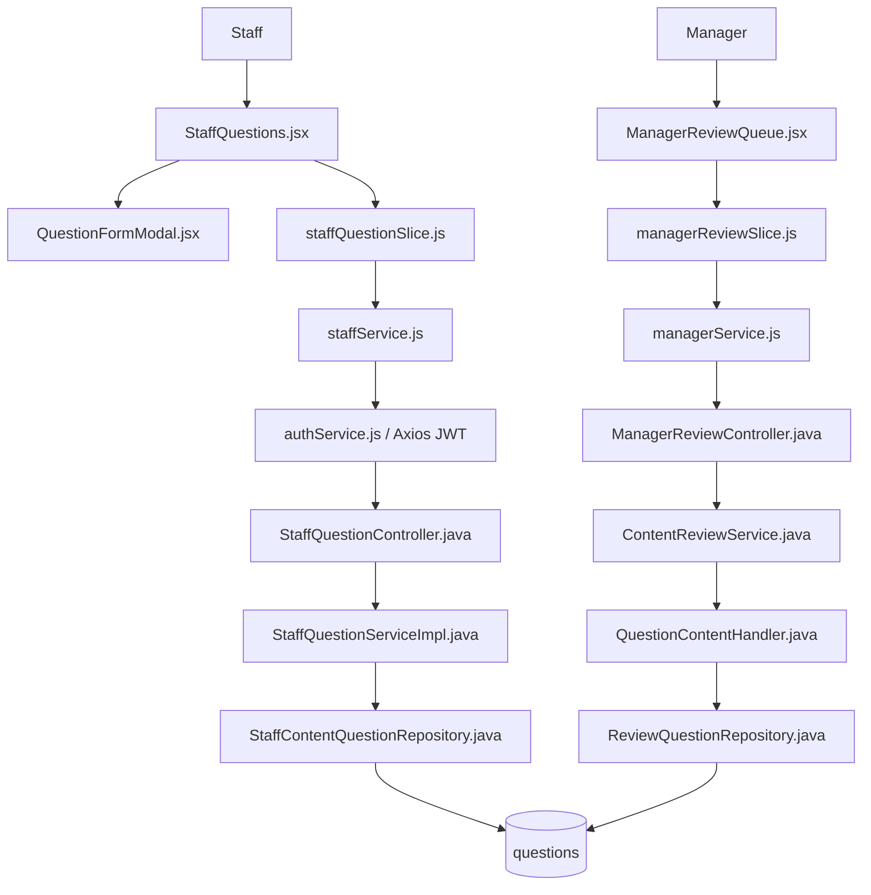
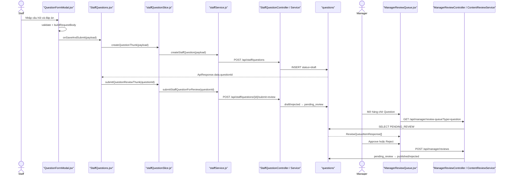

# Create Question — Staff tạo câu hỏi và gửi Manager duyệt

> Tên file `CreateQuession.md` được giữ đúng theo yêu cầu. Tài liệu chỉ mô tả hành vi tìm thấy trong source code.

## 1. Tóm tắt tổng quan

Luồng bắt đầu tại trang quản lý ngân hàng câu hỏi của Staff. Staff mở modal, nhập nội dung câu hỏi, loại câu hỏi, kỹ năng, cấp độ JLPT và đáp án. Frontend kiểm tra dữ liệu rồi gọi `POST /api/staff/questions`; backend luôn lưu câu hỏi mới với trạng thái `draft`. Nếu Staff chọn **Lưu và gửi duyệt**, frontend lấy `questionId` vừa tạo và gọi tiếp `POST /api/staff/questions/{questionId}/submit-review`; backend kiểm tra chủ sở hữu, trạng thái và đáp án rồi chuyển sang `pending_review`. Manager tải Review Queue, chọn nội dung loại `question`, sau đó Approve hoặc Reject qua `POST /api/manager/reviews`. Approve chuyển sang `published`; Reject bắt buộc có feedback và chuyển sang `rejected`.

Điểm vào chính:

- Staff UI: [StaffQuestions.jsx](../../../../apps/frontend/src/features/management/staff/StaffQuestions.jsx).
- Form: [QuestionFormModal.jsx](../../../../apps/frontend/src/features/management/components/staff/QuestionFormModal.jsx).
- Tạo câu hỏi: `POST /api/staff/questions`.
- Gửi duyệt: `POST /api/staff/questions/{questionId}/submit-review`.
- Manager UI: [ManagerReviewQueue.jsx](../../../../apps/frontend/src/features/management/manager/ManagerReviewQueue.jsx).
- Approve/Reject: `POST /api/manager/reviews`.

### 1.1. Đặc tả luồng: Input → Process → Output → Target

| Chặng | Input | Process | Output | Target |
|---|---|---|---|---|
| Nhập câu hỏi | Nội dung, loại, kỹ năng, JLPT level, đáp án, giải thích | Hiển thị và validate field theo loại; chuẩn hóa choices/đáp án đúng | Payload Question | `QuestionFormModal` → `StaffQuestions` |
| Tạo Draft | Payload + JWT Staff | Backend `@Valid`, resolve creator, kiểm tra cấu trúc đáp án; gán `status=draft` | HTTP `201`, `questionId` | `POST /api/staff/questions` → `questions` |
| Gửi duyệt | `questionId` + JWT | Kiểm tra owner, `draft/rejected`, nội dung và đáp án | `pending_review` | `POST /api/staff/questions/{id}/submit-review` |
| Manager Approve | `{contentType:"question", contentId, action:"APPROVE"}` | Chống tự duyệt/đồng thời; guarded update và audit | `published`, approver/thời gian | Review API → `QuestionContentHandler` |
| Manager Reject | `{contentType:"question", contentId, action:"REJECT", feedback}` | Bắt buộc feedback; guarded update và audit | `rejected`, lý do | Review API → repository/audit |
| Nhánh lỗi | Thiếu nội dung/đáp án, đáp án đúng sai, sai owner/status/quyền | Validation/guard chặn luồng | Response lỗi; không đổi trạng thái | Exception handler → frontend |

**Target cuối:** Question đạt `published` để được gán vào Quiz/Exam.

## 2. Bản đồ cấu trúc

| File | Vai trò | Loại |
|---|---|---|
| [StaffQuestions.jsx](../../../../apps/frontend/src/features/management/staff/StaffQuestions.jsx) | Mở form, nhận payload, tạo/cập nhật và gửi câu hỏi đi duyệt | React Page |
| [QuestionFormModal.jsx](../../../../apps/frontend/src/features/management/components/staff/QuestionFormModal.jsx) | Thu thập, kiểm tra và chuẩn hóa dữ liệu câu hỏi | React Component |
| [staffQuestionSlice.js](../../../../apps/frontend/src/features/management/staffQuestionSlice.js) | Async thunk nối UI với Staff API | Redux Slice |
| [staffService.js](../../../../apps/frontend/src/shared/api/staffService.js) | Khai báo request tạo và submit-review | API Service |
| [authService.js](../../../../apps/frontend/src/shared/api/authService.js) | Cấu hình Axios base URL và JWT | Axios Client |
| [StaffQuestionController.java](../../../../apps/backend/src/main/java/com/jlpt/feature/staffcontent/question/controller/StaffQuestionController.java) | Nhận API của Staff, validate DTO và lấy email từ Authentication | Controller |
| [CreateQuestionRequest.java](../../../../apps/backend/src/main/java/com/jlpt/feature/staffcontent/question/dto/CreateQuestionRequest.java) | Khai báo payload và validation đầu vào | DTO |
| [StaffQuestionServiceImpl.java](../../../../apps/backend/src/main/java/com/jlpt/feature/staffcontent/question/service/StaffQuestionServiceImpl.java) | Validate theo loại, tạo draft và chuyển pending_review | Service |
| [StaffContentQuestionEntity.java](../../../../apps/backend/src/main/java/com/jlpt/feature/staffcontent/question/entity/StaffContentQuestionEntity.java) | Ánh xạ dữ liệu Staff vào bảng `questions` | Entity |
| [StaffContentQuestionRepository.java](../../../../apps/backend/src/main/java/com/jlpt/feature/staffcontent/question/repository/StaffContentQuestionRepository.java) | Lưu và tìm câu hỏi của Staff | Repository |
| [ManagerReviewQueue.jsx](../../../../apps/frontend/src/features/management/manager/ManagerReviewQueue.jsx) | Hiển thị hàng chờ, mở Reject modal và phát lệnh review | React Page |
| [managerReviewSlice.js](../../../../apps/frontend/src/features/management/managerReviewSlice.js) | Gọi API hàng chờ và Approve/Reject | Redux Slice |
| [managerService.js](../../../../apps/frontend/src/shared/api/managerService.js) | Gửi request tới `/manager/review-queue` và `/manager/reviews` | API Service |
| [ManagerReviewController.java](../../../../apps/backend/src/main/java/com/jlpt/feature/contentreview/controller/ManagerReviewController.java) | Entry point Review Queue và Approve/Reject | Controller |
| [ContentReviewService.java](../../../../apps/backend/src/main/java/com/jlpt/feature/contentreview/service/ContentReviewService.java) | Kiểm tra Manager, chống tự duyệt, điều phối trạng thái và audit | Service |
| [QuestionContentHandler.java](../../../../apps/backend/src/main/java/com/jlpt/feature/contentreview/handler/QuestionContentHandler.java) | Adapter kiểm duyệt riêng cho `questions` | Handler |
| [ReviewQuestionRepository.java](../../../../apps/backend/src/main/java/com/jlpt/feature/contentreview/repository/ReviewQuestionRepository.java) | Query pending và cập nhật trạng thái có điều kiện | Repository |

Feature đầy đủ liên quan hơn 15 file. Bảng trên chia rõ nhánh Staff và nhánh Manager; các DTO audit/feedback phụ được ghi ở mục 8.

## 3. Bản đồ kết nối



| Từ | Đến | Cách kết nối | Dữ liệu truyền |
|---|---|---|---|
| `QuestionFormModal` | `StaffQuestions` | `onSave` hoặc `onSaveAndSubmit` | Request body đã trim |
| `StaffQuestions` | `staffQuestionSlice` | Redux `dispatch(...).unwrap()` | Payload hoặc `questionId` |
| `staffQuestionSlice` | `staffService` | Gọi hàm JavaScript | Payload HTTP |
| `staffService` | `StaffQuestionController` | Axios POST | JSON + Bearer JWT |
| `StaffQuestionController` | `StaffQuestionServiceImpl` | Method call | DTO + email đăng nhập |
| `StaffQuestionServiceImpl` | `StaffContentQuestionRepository` | `save(entity)` | Entity `draft`/`pending_review` |
| `ManagerReviewQueue` | `managerReviewSlice` | Redux thunk | filter hoặc review action |
| `managerService` | `ManagerReviewController` | GET/POST | type, contentId, action, feedback |
| `ContentReviewService` | `QuestionContentHandler` | Resolver theo `ContentType.QUESTION` | ID và trạng thái đích |
| `QuestionContentHandler` | `ReviewQuestionRepository` | JPQL query/update | `PENDING_REVIEW` → trạng thái mới |

## 4. Luồng xử lý theo trình tự

### 4.1. Staff nhập câu hỏi

1. Route `/staff/questions` render [StaffQuestions.jsx](../../../../apps/frontend/src/features/management/staff/StaffQuestions.jsx).
2. Trang mở [QuestionFormModal.jsx](../../../../apps/frontend/src/features/management/components/staff/QuestionFormModal.jsx) tại [StaffQuestions.jsx#L384](../../../../apps/frontend/src/features/management/staff/StaffQuestions.jsx#L384).
3. Staff nhập `questionText`, `questionType`, `skill`, `jlptLevel`, `explanation` và đáp án.
4. `buildRequestBody` tại [QuestionFormModal.jsx#L95](../../../../apps/frontend/src/features/management/components/staff/QuestionFormModal.jsx#L95) gọi `validate(form)`, trim chuỗi và chỉ gửi trường đáp án phù hợp với loại câu hỏi.
5. Nút lưu gọi `handleSave` tại [QuestionFormModal.jsx#L117](../../../../apps/frontend/src/features/management/components/staff/QuestionFormModal.jsx#L117); nút lưu và gửi duyệt gọi `handleSaveAndSubmit` tại [QuestionFormModal.jsx#L124](../../../../apps/frontend/src/features/management/components/staff/QuestionFormModal.jsx#L124).

### 4.2. Frontend gọi API tạo draft

6. `StaffQuestions.handleSaveAndSubmit` tại [StaffQuestions.jsx#L146](../../../../apps/frontend/src/features/management/staff/StaffQuestions.jsx#L146) dispatch `createQuestionThunk(formData)` nếu đang tạo mới.
7. `createQuestionThunk` tại [staffQuestionSlice.js#L30](../../../../apps/frontend/src/features/management/staffQuestionSlice.js#L30) gọi `createStaffQuestion(payload)`.
8. `createStaffQuestion` tại [staffService.js#L83](../../../../apps/frontend/src/shared/api/staffService.js#L83) gửi `POST /staff/questions`. Axios base URL biến nó thành `POST /api/staff/questions`.
9. Axios client đính JWT; Spring Security yêu cầu `hasRole('STAFF')` tại [StaffQuestionController.java#L46](../../../../apps/backend/src/main/java/com/jlpt/feature/staffcontent/question/controller/StaffQuestionController.java#L46).

### 4.3. Backend tạo câu hỏi

10. `StaffQuestionController.createQuestion` tại [StaffQuestionController.java#L55](../../../../apps/backend/src/main/java/com/jlpt/feature/staffcontent/question/controller/StaffQuestionController.java#L55) nhận `@Valid CreateQuestionRequest` và email từ `Authentication`.
11. `CreateQuestionRequest` kiểm tra `questionText`, `questionType`, `skill`, `jlptLevel` tại [CreateQuestionRequest.java#L14](../../../../apps/backend/src/main/java/com/jlpt/feature/staffcontent/question/dto/CreateQuestionRequest.java#L14).
12. `StaffQuestionServiceImpl.createQuestion` tại [StaffQuestionServiceImpl.java#L51](../../../../apps/backend/src/main/java/com/jlpt/feature/staffcontent/question/service/StaffQuestionServiceImpl.java#L51) resolve Staff, validate đáp án theo loại rồi build entity.
13. Backend tự gán `status = "draft"` và `createdBy = staff.id`; trạng thái từ frontend không quyết định trạng thái lưu.
14. `questionRepository.save(entity)` tại dòng 82 ghi vào bảng `questions` và trả `QuestionResponse` chứa `questionId`.

### 4.4. Staff gửi Manager duyệt

15. Frontend lấy ID bằng `response?.data?.questionId` tại [StaffQuestions.jsx#L156](../../../../apps/frontend/src/features/management/staff/StaffQuestions.jsx#L156).
16. `submitQuestionReviewThunk(questionId)` gọi `submitStaffQuestionForReview` tại [staffQuestionSlice.js#L55](../../../../apps/frontend/src/features/management/staffQuestionSlice.js#L55).
17. `staffService` gửi `POST /staff/questions/{questionId}/submit-review` tại [staffService.js#L93](../../../../apps/frontend/src/shared/api/staffService.js#L93).
18. `StaffQuestionController.submitForReview` tại [StaffQuestionController.java#L118](../../../../apps/backend/src/main/java/com/jlpt/feature/staffcontent/question/controller/StaffQuestionController.java#L118) chuyển ID và email sang service.
19. `StaffQuestionServiceImpl.submitForReview` tại [StaffQuestionServiceImpl.java#L198](../../../../apps/backend/src/main/java/com/jlpt/feature/staffcontent/question/service/StaffQuestionServiceImpl.java#L198):
   - tìm câu hỏi chưa bị xóa;
   - kiểm tra câu hỏi thuộc Staff hiện tại;
   - chỉ cho phép trạng thái `draft` hoặc `rejected`;
   - validate lại đáp án;
   - đổi thành `pending_review`, cập nhật thời gian và lưu.

### 4.5. Manager nhận và xử lý

20. [ManagerReviewQueue.jsx](../../../../apps/frontend/src/features/management/manager/ManagerReviewQueue.jsx) dispatch `fetchReviewQueueThunk`, gọi `GET /manager/review-queue` với `type=question` khi lọc Question.
21. [ManagerReviewController.getReviewQueue#L47](../../../../apps/backend/src/main/java/com/jlpt/feature/contentreview/controller/ManagerReviewController.java#L47) gọi `ContentReviewService.getReviewQueue`.
22. Service kiểm tra tài khoản có role nghiệp vụ `STAFF_MANAGER`, resolve [QuestionContentHandler.java](../../../../apps/backend/src/main/java/com/jlpt/feature/contentreview/handler/QuestionContentHandler.java), rồi lấy câu hỏi `PENDING_REVIEW` qua [ReviewQuestionRepository.java#L21](../../../../apps/backend/src/main/java/com/jlpt/feature/contentreview/repository/ReviewQuestionRepository.java#L21).
23. Manager chọn Approve hoặc Reject. Frontend gửi `{contentType: "question", contentId, action, feedback}` tới `POST /manager/reviews`.
24. [ContentReviewService.review#L117](../../../../apps/backend/src/main/java/com/jlpt/feature/contentreview/service/ContentReviewService.java#L117) kiểm tra Manager và không cho người tạo tự duyệt.
25. Nhánh Approve bắt đầu tại [ContentReviewService.review#L129](../../../../apps/backend/src/main/java/com/jlpt/feature/contentreview/service/ContentReviewService.java#L129). Service gọi [QuestionContentHandler.approve#L49](../../../../apps/backend/src/main/java/com/jlpt/feature/contentreview/handler/QuestionContentHandler.java#L49), sau đó handler gọi câu JPQL tại [ReviewQuestionRepository.approve#L36](../../../../apps/backend/src/main/java/com/jlpt/feature/contentreview/repository/ReviewQuestionRepository.java#L36) để chuyển `PENDING_REVIEW → PUBLISHED`, đồng thời cập nhật `approvedBy`, `publishedAt` và `updatedAt`.
26. Nhánh Reject bắt đầu tại [ContentReviewService.review#L147](../../../../apps/backend/src/main/java/com/jlpt/feature/contentreview/service/ContentReviewService.java#L147). Service kiểm tra `feedback` bắt buộc, rồi gọi [QuestionContentHandler.transitionFromPending#L54](../../../../apps/backend/src/main/java/com/jlpt/feature/contentreview/handler/QuestionContentHandler.java#L54). Handler gọi câu JPQL tại [ReviewQuestionRepository.transition#L46](../../../../apps/backend/src/main/java/com/jlpt/feature/contentreview/repository/ReviewQuestionRepository.java#L46) để chuyển `PENDING_REVIEW → REJECTED`. Cuối cùng, lý do từ chối được ghi bằng [ReviewAuditService.log#L33](../../../../apps/backend/src/main/java/com/jlpt/feature/contentreview/service/ReviewAuditService.java#L33).



## 5. Vai trò từng đoạn code quan trọng

### 5.1. Form tạo đúng payload theo loại câu hỏi

[QuestionFormModal.jsx#L95](../../../../apps/frontend/src/features/management/components/staff/QuestionFormModal.jsx#L95)

```jsx
const buildRequestBody = () => {
  const errs = validate(form); // Kiểm tra trường bắt buộc và đáp án theo questionType.
  if (Object.keys(errs).length > 0) {
    setErrors(errs);           // Hiển thị lỗi tại form, chưa gọi API.
    return null;
  }
  return {
    questionText: form.questionText.trim(),
    questionType: form.questionType,
    skill: form.skill,
    jlptLevel: form.jlptLevel,
    // Multiple choice gửi A-D và correctOption; loại khác gửi correctAnswerText.
    optionA: form.questionType === 'multiple_choice' ? form.optionA.trim() : undefined,
    correctAnswerText: form.questionType !== 'multiple_choice' ? form.correctAnswerText.trim() : undefined,
  };
};
```

### 5.2. Tạo trước, submit-review sau

[StaffQuestions.jsx#L146](../../../../apps/frontend/src/features/management/staff/StaffQuestions.jsx#L146)

```jsx
const handleSaveAndSubmit = async (formData) => {
  let response;
  if (editQuestion) {
    // Câu hỏi cũ được cập nhật trước khi gửi lại.
    response = await dispatch(updateQuestionThunk({ questionId: editQuestion.questionId, payload: formData })).unwrap();
  } else {
    // API thứ nhất tạo bản ghi draft và trả ID.
    response = await dispatch(createQuestionThunk(formData)).unwrap();
  }
  const questionId = response?.data?.questionId;
  // API thứ hai chuyển đúng bản ghi sang pending_review.
  await dispatch(submitQuestionReviewThunk(questionId)).unwrap();
};
```

### 5.3. Backend luôn tạo Draft

[StaffQuestionServiceImpl.java#L64](../../../../apps/backend/src/main/java/com/jlpt/feature/staffcontent/question/service/StaffQuestionServiceImpl.java#L64)

```java
StaffContentQuestionEntity entity = StaffContentQuestionEntity.builder()
        .questionText(request.getQuestionText().trim()) // Nội dung đã bỏ khoảng trắng thừa.
        .questionType(request.getQuestionType())        // multiple_choice/fill_blank/true_false.
        .skill(request.getSkill())
        .jlptLevel(request.getJlptLevel())
        .correctOption(trimToNull(request.getCorrectOption()))
        .correctAnswerText(trimToNull(request.getCorrectAnswerText()))
        .status("draft")           // Backend cố định trạng thái tạo mới là draft.
        .createdBy(staff.getId())  // Chủ sở hữu lấy từ JWT, không lấy từ payload.
        .build();
StaffContentQuestionEntity saved = questionRepository.save(entity);
```

### 5.4. Kiểm soát chuyển sang Pending Review

[StaffQuestionServiceImpl.java#L198](../../../../apps/backend/src/main/java/com/jlpt/feature/staffcontent/question/service/StaffQuestionServiceImpl.java#L198)

```java
StaffContentQuestionEntity entity = findActive(questionId); // Không nhận bản ghi deleted.
guardOwnership(entity.getCreatedBy(), staff);                // Chỉ chủ sở hữu được gửi.
if (!"draft".equals(entity.getStatus()) && !"rejected".equals(entity.getStatus())) {
    throw StaffQuestionBusinessException.invalidStatusTransition();
}
validateQuestionFields(/* các trường đáp án */);             // Validate lại trước khi gửi.
entity.setStatus("pending_review");                          // Đưa vào hàng chờ Manager.
entity.setUpdatedAt(LocalDateTime.now());
questionRepository.save(entity);
```

### 5.5. Manager Approve hoặc Reject

[ContentReviewService.java#L117](../../../../apps/backend/src/main/java/com/jlpt/feature/contentreview/service/ContentReviewService.java#L117)

```java
StaffUser manager = requireManager(managerEmail); // ROLE_STAFF chưa đủ; phải là STAFF_MANAGER active.
ReviewableContentHandler handler = resolver.resolve(type);
guardSelfReview(snapshot, manager);               // Manager không được duyệt nội dung do mình tạo.
if (action == ReviewAction.APPROVE) {
    int rows = handler.approve(request.getContentId(), manager, now); // → published.
    ensureUpdated(rows);                           // Chống hai Manager xử lý cùng item.
}
if (!StringUtils.hasText(request.getFeedback())) {
    throw new FeedbackRequiredException();         // Reject bắt buộc có lý do.
}
handler.transitionFromPending(request.getContentId(), "rejected", now);
```

## 6. Dữ liệu di chuyển như thế nào

Ví dụ câu hỏi trắc nghiệm:

```json
{
  "questionText": "「行きます」のて形は何ですか。",
  "questionType": "multiple_choice",
  "skill": "grammar",
  "jlptLevel": "N5",
  "explanation": "Động từ nhóm 1",
  "optionA": "行って",
  "optionB": "行いて",
  "optionC": "行きて",
  "optionD": "行んで",
  "correctOption": "A"
}
```

| Tầng | Dạng dữ liệu | Biến đổi |
|---|---|---|
| Form | React state `form` | Người dùng nhập chuỗi |
| Modal | Request body | Trim; bỏ trường không phù hợp loại câu hỏi |
| Redux | `payload` | Không đổi nội dung |
| Axios | JSON body + JWT | Gửi POST |
| Controller | `CreateQuestionRequest` | Bean Validation |
| Service | `StaffContentQuestionEntity` | Validate theo loại; thêm `draft`, `createdBy` |
| Database | Dòng trong `questions` | Sinh `question_id`, thời gian tạo |
| Submit review | `questionId` | `draft/rejected → pending_review` |
| Review Queue | `ContentSnapshot`/DTO | Chuyển entity thành item cho Manager |
| Manager review | `ReviewActionRequest` | `pending_review → published/rejected` |

Lưu ý: nhánh `multiple_choice` dùng `optionA-D` và `correctOption`; nhánh `fill_blank`/`true_false` dùng `correctAnswerText`.

## 7. Comment tác dụng của từng hàm trong luồng

> Bảng dưới là call walkthrough từ form Staff đến Manager review. Comment tập trung vào trách nhiệm của từng hàm, không coi validation frontend là thay thế cho backend.

| Bước | File | Function | Kết nối tới | Dữ liệu | Tác dụng của hàm |
|---:|---|---|---|---|---|
| 1 | `QuestionFormModal.jsx` | `buildRequestBody` | `StaffQuestions` | Form → payload | Kiểm tra dữ liệu theo loại câu hỏi, chuẩn hóa option/đáp án/level và tạo request body mà page có thể gửi backend. |
| 2 | `StaffQuestions.jsx` | `handleSaveAndSubmit` | Redux thunk | Payload | Điều phối create trước; nếu người dùng chọn gửi duyệt thì tiếp tục lấy ID từ kết quả create để chạy request submit thứ hai. |
| 3 | `staffQuestionSlice.js` | `createQuestionThunk` | `staffService` | Payload | Bọc API create trong Redux Toolkit thunk, quản lý loading/success/error và giữ thông báo lỗi backend. |
| 4 | `staffService.js` | `createStaffQuestion` | Staff controller | JSON | Gửi POST với payload câu hỏi qua Axios client đã cấu hình base URL/JWT và trả response chuẩn cho thunk. |
| 5 | `StaffQuestionController.java` | `createQuestion` | Staff service | DTO + email | Chạy `@Valid`, lấy email từ Authentication, gọi service tạo câu hỏi và trả HTTP 201 cùng `questionId`. |
| 6 | `StaffQuestionServiceImpl.java` | `createQuestion` | Staff repository | Entity | Resolve Staff, kiểm tra cấu trúc câu hỏi/đáp án, map DTO sang entity, ép `draft`, gắn owner và lưu database. |
| 7 | `StaffQuestions.jsx` | `handleSaveAndSubmit` | Submit thunk | `questionId` | Đọc chính xác ID backend sinh từ `response.data`; chỉ dispatch submit khi create thành công và có ID hợp lệ. |
| 8 | `StaffQuestionServiceImpl.java` | `submitForReview` | Staff repository | ID/status | Tìm câu hỏi không bị xóa, kiểm tra ownership và Draft/Rejected, validate lại nội dung bắt buộc rồi đổi sang `pending_review`. |
| 9 | `ManagerReviewQueue.jsx` | `fetchQueue` | Manager thunk | type/level/page | Ghép bộ lọc content type, JLPT level và pagination rồi dispatch tải trang câu hỏi đang chờ duyệt. |
| 10 | `ContentReviewService.java` | `getReviewQueue` | Question handler | `ContentType.QUESTION` | Kiểm tra role Staff Manager, resolve Question handler và ủy quyền truy vấn queue theo bộ lọc. |
| 11 | `QuestionContentHandler.java` | `findPending` | Review repository | status/level | Chuyển filter chung thành truy vấn riêng bảng questions và map các bản ghi Pending Review thành snapshot cho UI. |
| 12 | `ContentReviewService.java` | `review` | Handler/audit | action/feedback | Chống tự duyệt, bắt buộc feedback khi reject, gọi guarded transition và ghi audit; update count sai được coi là xung đột. |
| 13 | `QuestionContentHandler.java` | `approve`/`transitionFromPending` | Review repository | ID/status | Adapter quyết định target status: approve sang Published hoặc reject sang Rejected, luôn yêu cầu trạng thái hiện tại vẫn là Pending Review. |

## 8. Các mục cần bổ sung context

- Upload `audioUrl` và `imageUrl`: DTO/backend hỗ trợ hai trường này, nhưng `QuestionFormModal.buildRequestBody` hiện không đưa chúng vào payload. Không tìm thấy luồng upload trong form được phân tích.
- Feedback Reject được ghi qua `ReviewAuditService`; chi tiết schema bảng audit nằm ngoài nhóm file lõi của tài liệu này.
- Thông báo thời gian thực cho Staff sau khi Manager review: không tìm thấy WebSocket/event trong luồng; Staff thấy trạng thái mới khi danh sách được tải lại.
- Entity Staff dùng chuỗi trạng thái trong `StaffContentQuestionEntity`, còn Review handler dùng enum của `assessment.Question`; cả hai ánh xạ cùng bảng `questions`. Đây là thiết kế có thật trong source và cần cẩn thận khi thay đổi mapping.

<!-- BACKEND-METHOD-INVENTORY:START -->

## Phụ lục — Danh mục đầy đủ hàm backend

> Phần này được đối chiếu trực tiếp từ source backend hiện tại. Chỉ liệt kê các hàm khai báo tường minh trong những file Java mà tài liệu này tham chiếu; các hàm do Lombok/JPA sinh tự động không xuất hiện trong source nên không liệt kê.

### `ManagerReviewController`

Nguồn: [ManagerReviewController.java](../../../apps/backend/src/main/java/com/jlpt/feature/contentreview/controller/ManagerReviewController.java)

| # | Hàm backend (đầy đủ chữ ký) | Endpoint | Tác dụng/chức năng phục vụ |
|---:|---|---|---|
| 1 | [`ResponseEntity<ApiResponse<ReviewableContentDetailResponse>> getContentDetail(@PathVariable Long contentId, @RequestParam String contentType, Authentication authentication)`](../../../apps/backend/src/main/java/com/jlpt/feature/contentreview/controller/ManagerReviewController.java#L60) | `GET /contents/{contentId}` | Xử lý endpoint `GET /contents/{contentId}`; thực hiện nghiệp vụ `get content detail`. |
| 2 | [`ResponseEntity<ApiResponse<ReviewResultResponse>> review(@Valid @RequestBody ReviewActionRequest request, Authentication authentication)`](../../../apps/backend/src/main/java/com/jlpt/feature/contentreview/controller/ManagerReviewController.java#L69) | `POST /reviews` | Xử lý endpoint `POST /reviews`; thực hiện nghiệp vụ `review`. |
| 3 | [`ResponseEntity<ApiResponse<ReviewResultResponse>> requestChanges(@Valid @RequestBody RequestChangesRequest request, Authentication authentication)`](../../../apps/backend/src/main/java/com/jlpt/feature/contentreview/controller/ManagerReviewController.java#L79) | `POST /reviews/request-changes` | Xử lý endpoint `POST /reviews/request-changes`; thực hiện nghiệp vụ `request changes`. |

### `QuestionContentHandler`

Nguồn: [QuestionContentHandler.java](../../../apps/backend/src/main/java/com/jlpt/feature/contentreview/handler/QuestionContentHandler.java)

| # | Hàm backend (đầy đủ chữ ký) | Endpoint | Tác dụng/chức năng phục vụ |
|---:|---|---|---|
| 1 | [`ContentType type()`](../../../apps/backend/src/main/java/com/jlpt/feature/contentreview/handler/QuestionContentHandler.java#L25) | `—` | Thực hiện xử lý backend `type` trong `QuestionContentHandler`. |
| 2 | [`String tableName()`](../../../apps/backend/src/main/java/com/jlpt/feature/contentreview/handler/QuestionContentHandler.java#L30) | `—` | Thực hiện xử lý backend `table name` trong `QuestionContentHandler`. |
| 3 | [`List<ContentSnapshot> findPending(JlptLevel level)`](../../../apps/backend/src/main/java/com/jlpt/feature/contentreview/handler/QuestionContentHandler.java#L35) | `—` | Đọc hoặc tra cứu dữ liệu phục vụ `find pending`. |
| 4 | [`Optional<ContentSnapshot> findActiveById(Long contentId)`](../../../apps/backend/src/main/java/com/jlpt/feature/contentreview/handler/QuestionContentHandler.java#L43) | `—` | Đọc hoặc tra cứu dữ liệu phục vụ `find active by id`. |
| 5 | [`int approve(Long contentId, StaffUser manager, LocalDateTime now)`](../../../apps/backend/src/main/java/com/jlpt/feature/contentreview/handler/QuestionContentHandler.java#L48) | `—` | Thực hiện xử lý backend `approve` trong `QuestionContentHandler`. |
| 6 | [`int transitionFromPending(Long contentId, String targetStatus, LocalDateTime now)`](../../../apps/backend/src/main/java/com/jlpt/feature/contentreview/handler/QuestionContentHandler.java#L53) | `—` | Thực hiện xử lý backend `transition from pending` trong `QuestionContentHandler`. |
| 7 | [`ContentSnapshot toSnapshot(Question question, boolean withDetail)`](../../../apps/backend/src/main/java/com/jlpt/feature/contentreview/handler/QuestionContentHandler.java#L59) | `—` | Biến đổi/tổng hợp dữ liệu nội bộ cho `to snapshot`. |

### `ContentReviewService`

Nguồn: [ContentReviewService.java](../../../apps/backend/src/main/java/com/jlpt/feature/contentreview/service/ContentReviewService.java)

| # | Hàm backend (đầy đủ chữ ký) | Endpoint | Tác dụng/chức năng phục vụ |
|---:|---|---|---|
| 1 | [`ReviewQueueResponse getReviewQueue(String managerEmail, String typeStr, String levelStr, int page, int size)`](../../../apps/backend/src/main/java/com/jlpt/feature/contentreview/service/ContentReviewService.java#L54) | `—` | Đọc hoặc tra cứu dữ liệu phục vụ `get review queue`. |
| 2 | [`ReviewableContentDetailResponse getContentDetail(String managerEmail, Long contentId, String typeStr)`](../../../apps/backend/src/main/java/com/jlpt/feature/contentreview/service/ContentReviewService.java#L91) | `—` | Đọc hoặc tra cứu dữ liệu phục vụ `get content detail`. |
| 3 | [`ReviewResultResponse review(String managerEmail, ReviewActionRequest request)`](../../../apps/backend/src/main/java/com/jlpt/feature/contentreview/service/ContentReviewService.java#L113) | `—` | Thực hiện xử lý backend `review` trong `ContentReviewService`. |
| 4 | [`ReviewResultResponse requestChanges(String managerEmail, RequestChangesRequest request)`](../../../apps/backend/src/main/java/com/jlpt/feature/contentreview/service/ContentReviewService.java#L167) | `—` | Thực hiện xử lý backend `request changes` trong `ContentReviewService`. |
| 5 | [`StaffUser requireManager(String email)`](../../../apps/backend/src/main/java/com/jlpt/feature/contentreview/service/ContentReviewService.java#L205) | `—` | Thực hiện xử lý backend `require manager` trong `ContentReviewService`. |
| 6 | [`void guardSelfReview(ContentSnapshot snapshot, StaffUser manager)`](../../../apps/backend/src/main/java/com/jlpt/feature/contentreview/service/ContentReviewService.java#L217) | `—` | Thực hiện xử lý backend `guard self review` trong `ContentReviewService`. |
| 7 | [`void ensureUpdated(int affectedRows)`](../../../apps/backend/src/main/java/com/jlpt/feature/contentreview/service/ContentReviewService.java#L224) | `—` | Thực hiện xử lý backend `ensure updated` trong `ContentReviewService`. |
| 8 | [`String resolveRequestChangesTarget(String raw)`](../../../apps/backend/src/main/java/com/jlpt/feature/contentreview/service/ContentReviewService.java#L231) | `—` | Biến đổi/tổng hợp dữ liệu nội bộ cho `resolve request changes target`. |
| 9 | [`JlptLevel parseLevel(String levelStr)`](../../../apps/backend/src/main/java/com/jlpt/feature/contentreview/service/ContentReviewService.java#L242) | `—` | Thực hiện xử lý backend `parse level` trong `ContentReviewService`. |
| 10 | [`ReviewQueueItemResponse toQueueItem(ContentSnapshot contentSnapshot)`](../../../apps/backend/src/main/java/com/jlpt/feature/contentreview/service/ContentReviewService.java#L253) | `—` | Biến đổi/tổng hợp dữ liệu nội bộ cho `to queue item`. |

### `ReviewAuditService`

Nguồn: [ReviewAuditService.java](../../../apps/backend/src/main/java/com/jlpt/feature/contentreview/service/ReviewAuditService.java)

| # | Hàm backend (đầy đủ chữ ký) | Endpoint | Tác dụng/chức năng phục vụ |
|---:|---|---|---|
| 1 | [`void log(StaffUser actor, String action, ContentType contentType, String targetTable, Long contentId, String feedback)`](../../../apps/backend/src/main/java/com/jlpt/feature/contentreview/service/ReviewAuditService.java#L31) | `—` | Thực hiện xử lý backend `log` trong `ReviewAuditService`. |

### `StaffQuestionController`

Nguồn: [StaffQuestionController.java](../../../apps/backend/src/main/java/com/jlpt/feature/staffcontent/question/controller/StaffQuestionController.java)

| # | Hàm backend (đầy đủ chữ ký) | Endpoint | Tác dụng/chức năng phục vụ |
|---:|---|---|---|
| 1 | [`ResponseEntity<ApiResponse<QuestionResponse>> createQuestion(@Valid @RequestBody CreateQuestionRequest request, Authentication authentication)`](../../../apps/backend/src/main/java/com/jlpt/feature/staffcontent/question/controller/StaffQuestionController.java#L50) | `POST` | Xử lý endpoint `POST`; thực hiện nghiệp vụ `create question`. |
| 2 | [`ResponseEntity<ApiResponse<QuestionResponse>> getQuestion(@PathVariable Long questionId)`](../../../apps/backend/src/main/java/com/jlpt/feature/staffcontent/question/controller/StaffQuestionController.java#L92) | `GET /{questionId}` | Xử lý endpoint `GET /{questionId}`; thực hiện nghiệp vụ `get question`. |
| 3 | [`ResponseEntity<ApiResponse<QuestionResponse>> updateQuestion(@PathVariable Long questionId, @Valid @RequestBody UpdateQuestionRequest request, Authentication authentication)`](../../../apps/backend/src/main/java/com/jlpt/feature/staffcontent/question/controller/StaffQuestionController.java#L101) | `PUT /{questionId}` | Xử lý endpoint `PUT /{questionId}`; thực hiện nghiệp vụ `update question`. |
| 4 | [`ResponseEntity<ApiResponse<StaffQuestionSubmitReviewResponse>> submitForReview(@PathVariable Long questionId, Authentication authentication)`](../../../apps/backend/src/main/java/com/jlpt/feature/staffcontent/question/controller/StaffQuestionController.java#L113) | `POST /{questionId}/submit-review` | Xử lý endpoint `POST /{questionId}/submit-review`; thực hiện nghiệp vụ `submit for review`. |

### `StaffContentQuestionEntity`

Nguồn: [StaffContentQuestionEntity.java](../../../apps/backend/src/main/java/com/jlpt/feature/staffcontent/question/entity/StaffContentQuestionEntity.java)

| # | Hàm backend (đầy đủ chữ ký) | Endpoint | Tác dụng/chức năng phục vụ |
|---:|---|---|---|
| 1 | [`void onUpdate()`](../../../apps/backend/src/main/java/com/jlpt/feature/staffcontent/question/entity/StaffContentQuestionEntity.java#L86) | `—` | Thực hiện xử lý backend `on update` trong `StaffContentQuestionEntity`. |

### `StaffContentQuestionRepository`

Nguồn: [StaffContentQuestionRepository.java](../../../apps/backend/src/main/java/com/jlpt/feature/staffcontent/question/repository/StaffContentQuestionRepository.java)

| # | Hàm backend (đầy đủ chữ ký) | Endpoint | Tác dụng/chức năng phục vụ |
|---:|---|---|---|
| 1 | [`Optional<StaffContentQuestionEntity> findByIdAndStatusNot(Long id, String status)`](../../../apps/backend/src/main/java/com/jlpt/feature/staffcontent/question/repository/StaffContentQuestionRepository.java#L22) | `—` | Đọc hoặc tra cứu dữ liệu phục vụ `find by id and status not`. |

### `StaffQuestionServiceImpl`

Nguồn: [StaffQuestionServiceImpl.java](../../../apps/backend/src/main/java/com/jlpt/feature/staffcontent/question/service/StaffQuestionServiceImpl.java)

| # | Hàm backend (đầy đủ chữ ký) | Endpoint | Tác dụng/chức năng phục vụ |
|---:|---|---|---|
| 1 | [`QuestionResponse createQuestion(CreateQuestionRequest request, String staffEmail)`](../../../apps/backend/src/main/java/com/jlpt/feature/staffcontent/question/service/StaffQuestionServiceImpl.java#L41) | `—` | Tạo hoặc ghi dữ liệu cho nghiệp vụ `create question`. |
| 2 | [`Page<QuestionResponse> listQuestions(String q, String skill, String jlptLevel, String questionType, String status, Pageable pageable)`](../../../apps/backend/src/main/java/com/jlpt/feature/staffcontent/question/service/StaffQuestionServiceImpl.java#L83) | `—` | Đọc hoặc tra cứu dữ liệu phục vụ `list questions`. |
| 3 | [`QuestionResponse getQuestion(Long questionId)`](../../../apps/backend/src/main/java/com/jlpt/feature/staffcontent/question/service/StaffQuestionServiceImpl.java#L112) | `—` | Đọc hoặc tra cứu dữ liệu phục vụ `get question`. |
| 4 | [`QuestionResponse updateQuestion(Long questionId, UpdateQuestionRequest request, String staffEmail)`](../../../apps/backend/src/main/java/com/jlpt/feature/staffcontent/question/service/StaffQuestionServiceImpl.java#L124) | `—` | Cập nhật trạng thái/dữ liệu cho nghiệp vụ `update question`. |
| 5 | [`StaffQuestionSubmitReviewResponse submitForReview(Long questionId, String staffEmail)`](../../../apps/backend/src/main/java/com/jlpt/feature/staffcontent/question/service/StaffQuestionServiceImpl.java#L188) | `—` | Tạo hoặc ghi dữ liệu cho nghiệp vụ `submit for review`. |
| 6 | [`StaffUser resolveStaff(String email)`](../../../apps/backend/src/main/java/com/jlpt/feature/staffcontent/question/service/StaffQuestionServiceImpl.java#L229) | `—` | Biến đổi/tổng hợp dữ liệu nội bộ cho `resolve staff`. |
| 7 | [`StaffContentQuestionEntity findActive(Long id)`](../../../apps/backend/src/main/java/com/jlpt/feature/staffcontent/question/service/StaffQuestionServiceImpl.java#L235) | `—` | Đọc hoặc tra cứu dữ liệu phục vụ `find active`. |
| 8 | [`void guardOwnership(Long questionOwnerId, StaffUser current)`](../../../apps/backend/src/main/java/com/jlpt/feature/staffcontent/question/service/StaffQuestionServiceImpl.java#L244) | `—` | Thực hiện xử lý backend `guard ownership` trong `StaffQuestionServiceImpl`. |
| 9 | [`void validateQuestionFields(String questionType, String optionA, String optionB, String optionC, String optionD, String correctOption, String correctAnswerText)`](../../../apps/backend/src/main/java/com/jlpt/feature/staffcontent/question/service/StaffQuestionServiceImpl.java#L256) | `—` | Kiểm tra điều kiện/trạng thái phục vụ `validate question fields`. |
| 10 | [`String trimToNull(String value)`](../../../apps/backend/src/main/java/com/jlpt/feature/staffcontent/question/service/StaffQuestionServiceImpl.java#L288) | `—` | Thực hiện xử lý backend `trim to null` trong `StaffQuestionServiceImpl`. |
| 11 | [`String applyUpdate(String oldValue, String newValue)`](../../../apps/backend/src/main/java/com/jlpt/feature/staffcontent/question/service/StaffQuestionServiceImpl.java#L300) | `—` | Thực hiện xử lý backend `apply update` trong `StaffQuestionServiceImpl`. |
| 12 | [`QuestionResponse toResponse(StaffContentQuestionEntity entity, boolean locked)`](../../../apps/backend/src/main/java/com/jlpt/feature/staffcontent/question/service/StaffQuestionServiceImpl.java#L312) | `—` | Biến đổi/tổng hợp dữ liệu nội bộ cho `to response`. |

**Tổng cộng:** `39` hàm backend trong `10` file Java được tham chiếu.

<!-- BACKEND-METHOD-INVENTORY:END -->
