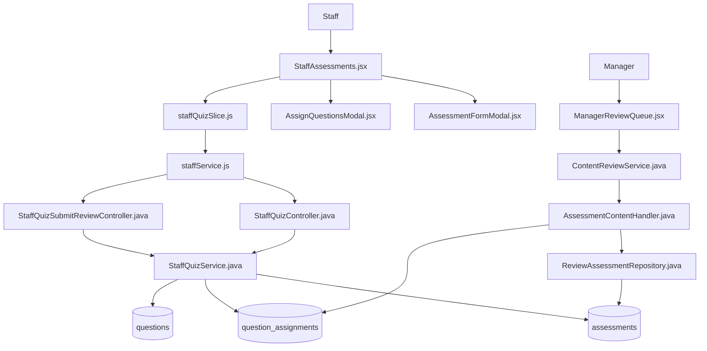
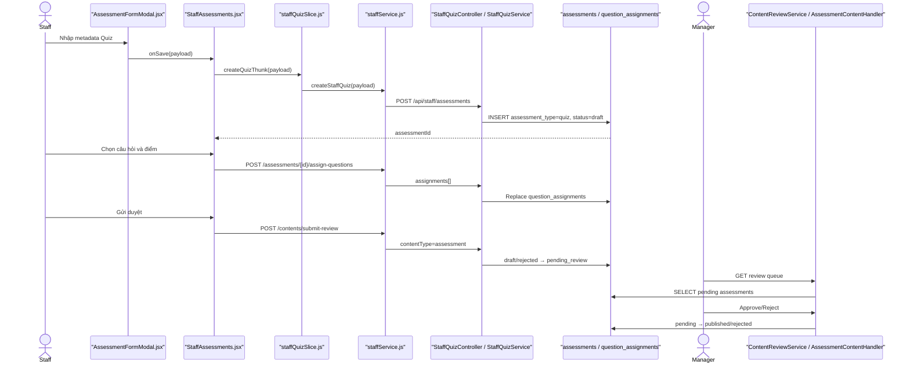

# Create Quiz — Staff tạo Quiz và gửi Manager duyệt

> Tài liệu mô tả source code thật của luồng Quiz từ frontend → API → backend → database → Manager review.

## 1. Tóm tắt tổng quan

Staff thao tác tại trang Đề thi & Quiz, chọn tab Quiz, mở form và nhập metadata gồm tiêu đề, JLPT level, thời gian, chủ đề, tổng điểm và điểm đạt. Frontend gọi `POST /api/staff/assessments`; backend bắt buộc `assessment_type = quiz`, gán `status = draft` và lưu vào bảng `assessments`. Staff tiếp tục dùng modal gán các câu hỏi đã `published` vào Quiz qua bảng `question_assignments`. Khi gửi duyệt, frontend gọi endpoint chung `POST /api/staff/contents/submit-review` với `contentType = assessment`; backend chuyển `draft/rejected → pending_review`. Manager tải Review Queue và Approve/Reject. Approve chỉ thành công nếu Quiz có câu hỏi và tổng điểm các câu bằng `totalScore`; trạng thái chuyển sang `published`. Reject bắt buộc feedback và chuyển sang `rejected`.

Điểm vào:

- Route: `/staff/assessments` tại [App.jsx#L124](../../../../apps/frontend/src/App.jsx#L124).
- Staff page: [StaffAssessments.jsx](../../../../apps/frontend/src/features/management/staff/StaffAssessments.jsx).
- Tạo Quiz: `POST /api/staff/assessments`.
- Gán câu hỏi: `POST /api/staff/assessments/{assessmentId}/assign-questions`.
- Gửi duyệt: `POST /api/staff/contents/submit-review`.
- Manager review: `POST /api/manager/reviews`.

### 1.1. Đặc tả luồng: Input → Process → Output → Target

| Chặng | Input | Process | Output | Target |
|---|---|---|---|---|
| Mở và nhập form | Staff đăng nhập; metadata Quiz | Validate trường bắt buộc, trim và chuẩn hóa số | Payload Quiz | `StaffAssessments` → `AssessmentFormModal` |
| Tạo Draft | Payload + JWT Staff | Resolve Staff; gán `type=quiz`, `status=draft`, creator | HTTP `201`, `assessmentId` | `POST /api/staff/assessments` → `assessments` |
| Gán câu hỏi | `assessmentId`, danh sách question/thứ tự/điểm | Kiểm tra owner/status, không trùng, Question Published và cùng level; thay danh sách gán | Questions và tổng điểm mới | Assign API → `question_assignments` |
| Gửi duyệt | `{contentType:"assessment", contentId}` | Kiểm tra `draft/rejected`, owner và có câu hỏi | `pending_review` | Submit-review API → `StaffQuizService` |
| Manager Approve | `{contentType:"assessment", contentId, action:"APPROVE"}` | Chống tự duyệt/đồng thời; kiểm tra tổng điểm bằng `totalScore`; ghi audit | `published` | Review API → `AssessmentContentHandler` |
| Manager Reject | `{contentType:"assessment", contentId, action:"REJECT", feedback}` | Bắt buộc feedback; guarded update và audit | `rejected`, lý do | Review API → repository/audit |
| Nhánh lỗi | Payload, owner, status, question hoặc tổng điểm không hợp lệ | Dừng trước thao tác ghi tiếp theo | Response lỗi; trạng thái hiện tại được giữ | Exception handler → frontend |

**Target cuối:** Quiz `published`, có bộ câu hỏi hợp lệ và tổng điểm nhất quán.

## 2. Bản đồ cấu trúc

| File | Vai trò | Loại |
|---|---|---|
| [StaffAssessments.jsx](../../../../apps/frontend/src/features/management/staff/StaffAssessments.jsx) | Điều phối tab Quiz, form, gán câu hỏi và gửi duyệt | React Page |
| [AssessmentFormModal.jsx](../../../../apps/frontend/src/features/management/components/staff/AssessmentFormModal.jsx) | Nhập và validate metadata Quiz | React Component |
| [AssignQuestionsModal.jsx](../../../../apps/frontend/src/features/management/components/staff/AssignQuestionsModal.jsx) | Chọn câu hỏi, thứ tự và điểm cho từng câu | React Component |
| [staffQuizSlice.js](../../../../apps/frontend/src/features/management/staffQuizSlice.js) | Async thunk tạo, gán câu hỏi và gửi duyệt | Redux Slice |
| [staffService.js](../../../../apps/frontend/src/shared/api/staffService.js) | Khai báo ba request của luồng Staff Quiz | API Service |
| [authService.js](../../../../apps/frontend/src/shared/api/authService.js) | Axios base URL, JWT và refresh token | Axios Client |
| [StaffQuizController.java](../../../../apps/backend/src/main/java/com/jlpt/feature/staffcontent/quiz/controller/StaffQuizController.java) | API tạo và gán câu hỏi cho Quiz | Controller |
| [StaffQuizSubmitReviewController.java](../../../../apps/backend/src/main/java/com/jlpt/feature/staffcontent/quiz/controller/StaffQuizSubmitReviewController.java) | Endpoint chung submit-review, định tuyến `assessment` sang Quiz service | Controller |
| [CreateQuizRequest.java](../../../../apps/backend/src/main/java/com/jlpt/feature/staffcontent/quiz/dto/CreateQuizRequest.java) | DTO metadata Quiz | DTO |
| [AssignQuestionsRequest.java](../../../../apps/backend/src/main/java/com/jlpt/feature/staffcontent/quiz/dto/AssignQuestionsRequest.java) | DTO danh sách questionId/displayOrder/score | DTO |
| [StaffQuizService.java](../../../../apps/backend/src/main/java/com/jlpt/feature/staffcontent/quiz/service/StaffQuizService.java) | Tạo draft, validate/gán câu hỏi và chuyển pending_review | Service |
| [QuizAssessmentEntity.java](../../../../apps/backend/src/main/java/com/jlpt/feature/staffcontent/quiz/entity/QuizAssessmentEntity.java) | Ánh xạ Quiz vào bảng `assessments` | Entity |
| [QuizAssignmentEntity.java](../../../../apps/backend/src/main/java/com/jlpt/feature/staffcontent/quiz/entity/QuizAssignmentEntity.java) | Ánh xạ quan hệ Quiz–Question | Entity |
| [QuizAssessmentRepository.java](../../../../apps/backend/src/main/java/com/jlpt/feature/staffcontent/quiz/repository/QuizAssessmentRepository.java) | Lưu/tìm Quiz với `assessment_type=quiz` | Repository |
| [ManagerReviewQueue.jsx](../../../../apps/frontend/src/features/management/manager/ManagerReviewQueue.jsx) | Hiển thị hàng chờ và phát lệnh Approve/Reject | React Page |
| [ContentReviewService.java](../../../../apps/backend/src/main/java/com/jlpt/feature/contentreview/service/ContentReviewService.java) | Kiểm tra Manager, self-review, feedback và điều phối handler | Service |
| [AssessmentContentHandler.java](../../../../apps/backend/src/main/java/com/jlpt/feature/contentreview/handler/AssessmentContentHandler.java) | Handler chung cho Quiz/Exam, kiểm tra câu hỏi và tổng điểm | Handler |
| [ReviewAssessmentRepository.java](../../../../apps/backend/src/main/java/com/jlpt/feature/contentreview/repository/ReviewAssessmentRepository.java) | Đọc pending và cập nhật published/rejected | Repository |

Feature vượt 15 file vì có ba chặng độc lập: tạo metadata, gán câu hỏi và Manager review. Bảng giữ các file quyết định luồng; thành phần phụ được ghi ở mục 8.

## 3. Bản đồ kết nối



| Từ | Đến | Cách kết nối | Dữ liệu |
|---|---|---|---|
| `AssessmentFormModal` | `StaffAssessments` | `onSave`/`onSaveAndSubmit` | Metadata Quiz |
| `StaffAssessments` | `staffQuizSlice` | Redux dispatch | payload hoặc assessmentId |
| `staffQuizSlice` | `staffService` | Gọi hàm JS | payload HTTP |
| `staffService` | `StaffQuizController` | Axios POST | Metadata/assignments + JWT |
| `StaffQuizController` | `StaffQuizService` | Method call | DTO + email Staff |
| `StaffQuizService` | repositories | JPA | Quiz, question refs, assignments |
| `staffService` | `StaffQuizSubmitReviewController` | POST chung | `{contentType:'assessment', contentId}` |
| `StaffQuizSubmitReviewController` | `StaffQuizService` | Nhánh contentType | assessmentId + email |
| Manager UI | `ContentReviewService` | Review API | assessment/contentId/action/feedback |
| `ContentReviewService` | `AssessmentContentHandler` | Resolver | Assessment pending |
| Handler | `ReviewAssessmentRepository` | JPQL update | pending → published/rejected |

## 4. Luồng xử lý theo trình tự

### 4.1. Staff nhập metadata Quiz

1. Staff mở `/staff/assessments`; [StaffAssessments.jsx#L59](../../../../apps/frontend/src/features/management/staff/StaffAssessments.jsx#L59) mặc định `activeTab = 'quiz'`.
2. Nút Tạo mới gọi `handleCreate` tại [StaffAssessments.jsx#L108](../../../../apps/frontend/src/features/management/staff/StaffAssessments.jsx#L108) và mở [AssessmentFormModal.jsx](../../../../apps/frontend/src/features/management/components/staff/AssessmentFormModal.jsx).
3. Staff nhập `title`, `jlptLevel`, `durationMin`, `topic`, `totalScore`, `passScore`.
4. `validateCommon` tại [AssessmentFormModal.jsx#L27](../../../../apps/frontend/src/features/management/components/staff/AssessmentFormModal.jsx#L27) kiểm tra tiêu đề, level, thời gian, tổng điểm và `passScore <= totalScore`.
5. `buildData` tại [AssessmentFormModal.jsx#L67](../../../../apps/frontend/src/features/management/components/staff/AssessmentFormModal.jsx#L67) trim chuỗi và chuyển trường số bằng `Number(...)`.

### 4.2. Frontend tạo Quiz

6. Nếu Staff chọn Lưu nháp, `handleSave` tại [StaffAssessments.jsx#L122](../../../../apps/frontend/src/features/management/staff/StaffAssessments.jsx#L122) dispatch `createQuizThunk(payload)`.
7. Nếu chọn Lưu và gửi duyệt, `handleSaveAndSubmit` tại [StaffAssessments.jsx#L145](../../../../apps/frontend/src/features/management/staff/StaffAssessments.jsx#L145) cũng tạo trước, rồi lấy `res?.data?.assessmentId`.
8. `createQuizThunk` tại [staffQuizSlice.js#L30](../../../../apps/frontend/src/features/management/staffQuizSlice.js#L30) gọi `createStaffQuiz`.
9. `createStaffQuiz` tại [staffService.js#L144](../../../../apps/frontend/src/shared/api/staffService.js#L144) gửi `POST /staff/assessments`.

### 4.3. Backend lưu Draft

10. [StaffQuizController.createQuiz#L44](../../../../apps/backend/src/main/java/com/jlpt/feature/staffcontent/quiz/controller/StaffQuizController.java#L44) nhận `@Valid CreateQuizRequest` và email từ `Authentication`.
11. [StaffQuizService.createQuiz#L75](../../../../apps/backend/src/main/java/com/jlpt/feature/staffcontent/quiz/service/StaffQuizService.java#L75) kiểm tra Staff, không cho payload tự publish và validate khoảng điểm.
12. Service buộc `assessmentType = quiz`, `status = draft`, `createdBy = staff`, rồi lưu vào `assessments` tại [StaffQuizService.java#L86](../../../../apps/backend/src/main/java/com/jlpt/feature/staffcontent/quiz/service/StaffQuizService.java#L86).

### 4.4. Staff gán câu hỏi

13. Staff mở [AssignQuestionsModal.jsx](../../../../apps/frontend/src/features/management/components/staff/AssignQuestionsModal.jsx), chọn danh sách câu hỏi và điểm.
14. `handleAssignSubmit` tại [StaffAssessments.jsx#L191](../../../../apps/frontend/src/features/management/staff/StaffAssessments.jsx#L191) dispatch `assignQuizQuestionsThunk({assessmentId, assignments})`.
15. [staffService.assignStaffQuizQuestions#L154](../../../../apps/frontend/src/shared/api/staffService.js#L154) gọi `POST /staff/assessments/{id}/assign-questions` với `{assignments}`.
16. [StaffQuizController.assignQuestions#L84](../../../../apps/backend/src/main/java/com/jlpt/feature/staffcontent/quiz/controller/StaffQuizController.java#L84) chuyển request sang service.
17. [StaffQuizService.assignQuestions#L180](../../../../apps/backend/src/main/java/com/jlpt/feature/staffcontent/quiz/service/StaffQuizService.java#L180) kiểm tra:
   - Quiz thuộc Staff và đang `draft/rejected`;
   - không trùng `questionId`;
   - mọi câu hỏi tồn tại, chưa deleted và đã `published`;
   - xóa assignments cũ rồi ghi toàn bộ danh sách mới theo replace semantics;
   - tính `assignedScoreSum` và trả `scoreMatched`.

### 4.5. Staff gửi Manager duyệt

18. `submitQuizReviewThunk` tại [staffQuizSlice.js#L54](../../../../apps/frontend/src/features/management/staffQuizSlice.js#L54) gọi `submitAssessmentForReview('assessment', assessmentId)`.
19. [staffService.submitAssessmentForReview#L192](../../../../apps/frontend/src/shared/api/staffService.js#L192) gửi `POST /staff/contents/submit-review` với `{contentType:'assessment', contentId}`.
20. [StaffQuizSubmitReviewController.java#L53](../../../../apps/backend/src/main/java/com/jlpt/feature/staffcontent/quiz/controller/StaffQuizSubmitReviewController.java#L53) nhận request; nhánh `assessment` tại dòng 64 gọi `staffQuizService.submitForReview`.
21. [StaffQuizService.submitForReview#L253](../../../../apps/backend/src/main/java/com/jlpt/feature/staffcontent/quiz/service/StaffQuizService.java#L253) kiểm tra owner, Quiz có ít nhất một câu hỏi và trạng thái là `draft/rejected`, sau đó chuyển sang `pending_review` tại dòng 271.

### 4.6. Manager nhận và xử lý

22. [ManagerReviewQueue.jsx](../../../../apps/frontend/src/features/management/manager/ManagerReviewQueue.jsx) tải `GET /manager/review-queue`; Quiz xuất hiện với `contentType = assessment`.
23. [ContentReviewService.getReviewQueue#L58](../../../../apps/backend/src/main/java/com/jlpt/feature/contentreview/service/ContentReviewService.java#L58) kiểm tra `STAFF_MANAGER` và resolve `AssessmentContentHandler`.
24. [AssessmentContentHandler.findPending#L41](../../../../apps/backend/src/main/java/com/jlpt/feature/contentreview/handler/AssessmentContentHandler.java#L41) đọc các assessment `PENDING_REVIEW` qua [ReviewAssessmentRepository.findPending#L21](../../../../apps/backend/src/main/java/com/jlpt/feature/contentreview/repository/ReviewAssessmentRepository.java#L21).
25. Manager gửi `{contentType:'assessment', contentId, action, feedback}` tới `POST /manager/reviews`; [ContentReviewService.review#L117](../../../../apps/backend/src/main/java/com/jlpt/feature/contentreview/service/ContentReviewService.java#L117) kiểm tra Manager và chống tự duyệt.
26. Approve gọi [AssessmentContentHandler.approve#L56](../../../../apps/backend/src/main/java/com/jlpt/feature/contentreview/handler/AssessmentContentHandler.java#L56). Handler kiểm tra có câu hỏi và tổng điểm assignments bằng `totalScore`, rồi gọi [ReviewAssessmentRepository.approve#L36](../../../../apps/backend/src/main/java/com/jlpt/feature/contentreview/repository/ReviewAssessmentRepository.java#L36) để chuyển `PENDING_REVIEW → PUBLISHED`, ghi `approvedBy`, `publishedAt`, `updatedAt`.
27. Reject bắt đầu tại [ContentReviewService.review#L147](../../../../apps/backend/src/main/java/com/jlpt/feature/contentreview/service/ContentReviewService.java#L147), bắt buộc feedback, gọi [AssessmentContentHandler.transitionFromPending#L84](../../../../apps/backend/src/main/java/com/jlpt/feature/contentreview/handler/AssessmentContentHandler.java#L84) và [ReviewAssessmentRepository.transition#L46](../../../../apps/backend/src/main/java/com/jlpt/feature/contentreview/repository/ReviewAssessmentRepository.java#L46) để chuyển `PENDING_REVIEW → REJECTED`; feedback được ghi bởi [ReviewAuditService.log#L33](../../../../apps/backend/src/main/java/com/jlpt/feature/contentreview/service/ReviewAuditService.java#L33).



## 5. Vai trò từng đoạn code quan trọng

### 5.1. Frontend tạo rồi lấy assessmentId

[StaffAssessments.jsx#L145](../../../../apps/frontend/src/features/management/staff/StaffAssessments.jsx#L145)

```jsx
async function handleSaveAndSubmit(payload) {
  let assessmentId;
  if (editItem) {
    assessmentId = editItem.assessmentId;
    await dispatch(updateQuizThunk({ assessmentId, payload })).unwrap(); // Cập nhật Quiz cũ.
  } else {
    const res = await dispatch(createQuizThunk(payload)).unwrap();       // API 1: tạo draft.
    assessmentId = res?.data?.assessmentId;                             // Lấy ID backend sinh.
  }
  await dispatch(submitQuizReviewThunk(assessmentId)).unwrap();          // API 2: gửi duyệt.
}
```

### 5.2. Backend cố định loại và trạng thái

[StaffQuizService.java#L86](../../../../apps/backend/src/main/java/com/jlpt/feature/staffcontent/quiz/service/StaffQuizService.java#L86)

```java
QuizAssessmentEntity quiz = QuizAssessmentEntity.builder()
        .assessmentType(TYPE_QUIZ) // Luôn là quiz, không tin assessmentType từ payload.
        .title(request.getTitle().trim())
        .jlptLevel(request.getJlptLevel())
        .durationMin(request.getDurationMin())
        .passScore(request.getPassScore())
        .totalScore(request.getTotalScore())
        .status(ST_DRAFT)            // Quiz mới luôn là draft.
        .createdBy(staff)            // Chủ sở hữu lấy từ tài khoản đăng nhập.
        .build();
QuizAssessmentEntity saved = assessmentRepository.save(quiz);
```

### 5.3. Chỉ gán câu hỏi Published

[StaffQuizService.java#L200](../../../../apps/backend/src/main/java/com/jlpt/feature/staffcontent/quiz/service/StaffQuizService.java#L200)

```java
for (AssignQuestionsRequest.AssignmentItem item : items) {
    QuizQuestionRefEntity ref = questionRefRepository
            .findById(item.getQuestionId())
            .orElseThrow(() -> QuizBusinessException.questionNotFound(item.getQuestionId()));
    if (ref.getStatus() == null || ST_DELETED.equalsIgnoreCase(ref.getStatus())) {
        throw QuizBusinessException.questionNotFound(item.getQuestionId()); // Không nhận deleted.
    }
    if (!Q_PUBLISHED.equalsIgnoreCase(ref.getStatus())) {
        throw QuizBusinessException.questionNotPublished(item.getQuestionId()); // Phải published.
    }
}
```

### 5.4. Submit Review

[StaffQuizService.java#L253](../../../../apps/backend/src/main/java/com/jlpt/feature/staffcontent/quiz/service/StaffQuizService.java#L253)

```java
QuizAssessmentEntity quiz = requireQuiz(assessmentId); // Chỉ tìm assessment_type=quiz.
guardOwnership(quiz, staff);                            // Chỉ người tạo được gửi.
long count = assignmentRepository.countByParentTypeAndParentId(PARENT_ASSESSMENT, assessmentId);
if (count == 0) {
    throw QuizBusinessException.noQuestionsAssigned(); // Quiz rỗng không được gửi.
}
if (!isEditable(quiz.getStatus())) {
    throw QuizBusinessException.invalidStatusTransition(quiz.getStatus()); // Chỉ draft/rejected.
}
quiz.setStatus(ST_PENDING);
assessmentRepository.save(quiz);
```

### 5.5. Manager Approve kiểm tra tổng điểm

[AssessmentContentHandler.java#L56](../../../../apps/backend/src/main/java/com/jlpt/feature/contentreview/handler/AssessmentContentHandler.java#L56)

```java
long questionCount = assignmentRepository
        .countByParentTypeAndParentId(QuestionAssignment.ParentType.ASSESSMENT, contentId);
if (questionCount == 0) {
    throw new BusinessException(422, "ASSESSMENT_EMPTY", "Không thể duyệt: bài chưa có câu hỏi nào");
}
BigDecimal assignedSum = assignmentRepository
        .sumScoreByParent(QuestionAssignment.ParentType.ASSESSMENT, contentId);
BigDecimal total = BigDecimal.valueOf(assessment.getTotalScore());
if (assignedSum.compareTo(total) != 0) {
    throw new BusinessException(422, "ASSESSMENT_SCORE_MISMATCH", "Tổng điểm không khớp");
}
// Chỉ sau hai guard trên mới cập nhật pending_review → published.
return repository.approve(contentId, manager, now, ContentStatus.PENDING_REVIEW, ContentStatus.PUBLISHED);
```

## 6. Dữ liệu di chuyển như thế nào

Metadata mẫu:

```json
{
  "title": "Quiz ngữ pháp N5 - Bài 1",
  "jlptLevel": "N5",
  "durationMin": 20,
  "topic": "Ngữ pháp cơ bản",
  "passScore": 70,
  "totalScore": 100
}
```

Assignments mẫu:

```json
{
  "assignments": [
    { "questionId": 10, "displayOrder": 1, "score": 50 },
    { "questionId": 11, "displayOrder": 2, "score": 50 }
  ]
}
```

| Chặng | Dữ liệu/biến đổi | Nơi lưu |
|---|---|---|
| Form | Chuỗi → trim; số → `Number` | React state |
| Create API | Metadata + JWT | Request JSON |
| Quiz service | Thêm type `quiz`, status `draft`, creator | `assessments` |
| Assign API | Danh sách ID/thứ tự/điểm | `question_assignments` |
| Submit API | `{contentType:'assessment', contentId}` | status `pending_review` |
| Manager Queue | Assessment snapshot | Response DTO |
| Approve | Validate count/score; thêm approver/time | status `published` |
| Reject | Feedback bắt buộc | status `rejected` + audit |

## 7. Bảng tra cứu tổng hợp

| Bước | File | Function | Kết nối tới | Dữ liệu | Ghi chú |
|---:|---|---|---|---|---|
| 1 | `AssessmentFormModal.jsx` | `buildData` | Staff page | Metadata | Validate frontend |
| 2 | `StaffAssessments.jsx` | `handleSave` | Quiz thunk | payload | Lưu draft |
| 3 | `staffQuizSlice.js` | `createQuizThunk` | staffService | payload | Async/error |
| 4 | `StaffQuizController.java` | `createQuiz` | Quiz service | DTO + email | HTTP 201 |
| 5 | `StaffQuizService.java` | `createQuiz` | assessment repo | Entity | Force quiz/draft |
| 6 | `StaffAssessments.jsx` | `handleAssignSubmit` | assign thunk | assignments | Replace list |
| 7 | `StaffQuizService.java` | `assignQuestions` | question/assignment repos | IDs/scores | Chỉ published |
| 8 | `staffQuizSlice.js` | `submitQuizReviewThunk` | common submit API | assessmentId | Type=assessment |
| 9 | `StaffQuizSubmitReviewController.java` | `submitReview` | Quiz service | type + ID | Route branch |
| 10 | `StaffQuizService.java` | `submitForReview` | assessment repo | ID/status | → pending_review |
| 11 | `ContentReviewService.java` | `getReviewQueue` | assessment handler | filters | Manager only |
| 12 | `AssessmentContentHandler.java` | `approve` | review repo | ID/manager/time | Guard count/score |
| 13 | `ReviewAssessmentRepository.java` | `approve/transition` | DB | status | Conditional update |
| 14 | `ReviewAuditService.java` | `log` | audit repository | action/feedback | Lưu lý do |

## 8. Các mục cần bổ sung context

- `AssessmentContentHandler` dùng chung cho Quiz và Exam; Review Queue trả `contentType=assessment`. Việc frontend Manager phân biệt hiển thị Quiz/Exam dựa trên detail `assessmentType` cần xem thêm UI detail nếu muốn tài liệu hóa riêng.
- Submit-review cho phép gửi khi tổng điểm chưa khớp; comment trong service nói đây là cảnh báo mềm. Manager Approve mới chặn cứng tại `AssessmentContentHandler.approve`.
- Không tìm thấy thông báo realtime tới Staff sau review; Staff nhận trạng thái/feedback khi tải lại danh sách hoặc gọi feedback API.
- Tài liệu không mở rộng luồng Student làm Quiz sau khi published; đó là feature khác.
