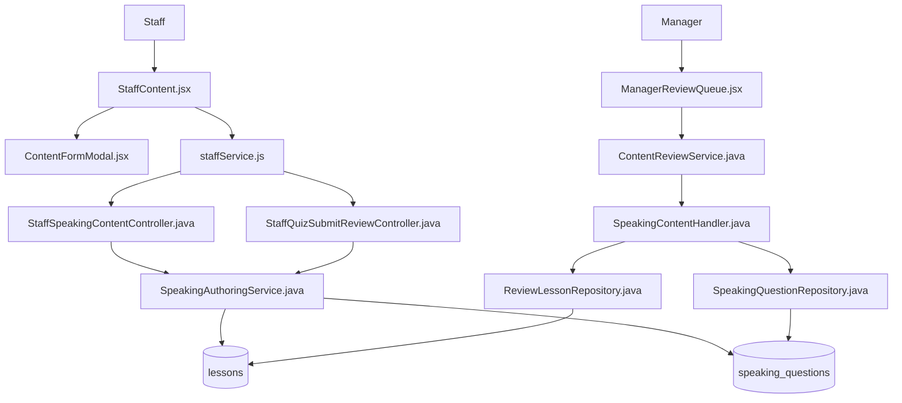
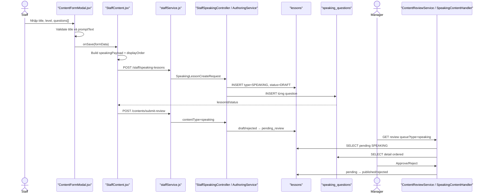

# Create Speaking — Staff tạo bài Speaking và gửi Manager duyệt

> Phạm vi: Staff tạo bài Speaking có nhiều câu hỏi, lưu Draft, submit-review và Manager Approve/Reject.

## 1. Tóm tắt tổng quan

Staff mở trang quản lý học liệu, chọn Speaking và nhập tiêu đề, JLPT level cùng một hoặc nhiều câu hỏi. Mỗi câu hỏi có `promptText`, hướng dẫn tùy chọn và URL audio mẫu tùy chọn. Frontend gọi `POST /api/staff/speaking-lessons`; backend tạo một dòng trong `lessons` với `lesson_type=SPEAKING`, `status=DRAFT`, đồng thời lưu từng câu hỏi vào `speaking_questions`. Câu hỏi đầu tiên còn được đưa vào `lessons.content_text/audio_url` để tương thích cấu trúc lesson cũ. Nếu Staff chọn gửi duyệt, frontend gọi endpoint chung với `contentType=speaking`; backend chuyển `DRAFT/REJECTED → PENDING_REVIEW`. Manager dùng `SpeakingContentHandler` để chỉ lấy lesson loại Speaking, sau đó Approve thành `PUBLISHED` hoặc Reject thành `REJECTED` kèm feedback.

Điểm vào:

- Staff UI: [StaffContent.jsx](../../../../apps/frontend/src/features/management/staff/StaffContent.jsx).
- Form: [ContentFormModal.jsx](../../../../apps/frontend/src/features/management/components/staff/ContentFormModal.jsx).
- Tạo Speaking: `POST /api/staff/speaking-lessons`.
- Gửi duyệt: `POST /api/staff/contents/submit-review`.
- Manager review: `POST /api/manager/reviews`.

### 1.1. Đặc tả luồng: Input → Process → Output → Target

| Chặng | Input | Process | Output | Target |
|---|---|---|---|---|
| Nhập bài | `title`, `jlptLevel`, `questions[]` (`promptText`, `instruction`, `sampleAudioUrl`) | Quản lý thêm/xóa; yêu cầu title, ít nhất một câu và prompt không rỗng | Form Speaking hợp lệ | `ContentFormModal` |
| Chuẩn hóa | Form + lựa chọn Lưu/Lưu & gửi | Giữ field backend cần, gán `displayOrder=index` | Create request | `StaffContent` → `staffService` |
| Tạo Draft | Request + JWT Staff | Resolve Staff; tạo Lesson `SPEAKING/DRAFT`; lưu questions và dữ liệu tương thích lesson cũ | HTTP `201`, `lessonId` | Create API → `lessons` + `speaking_questions` |
| Gửi duyệt | `{contentType:"speaking", contentId}` | Kiểm tra owner, đúng type, `draft/rejected`, có câu hỏi/dữ liệu legacy | `pending_review` | Submit-review API → `SpeakingAuthoringService` |
| Chỉnh sửa | `lessonId` + payload mới | Chỉ sửa `draft/rejected`; replace toàn bộ questions | Lesson/questions mới | Update API → hai bảng |
| Manager Approve | `{contentType:"speaking", contentId, action:"APPROVE"}` | Chống tự duyệt/đồng thời; guarded update và audit | `published` | Review API → `SpeakingContentHandler` |
| Manager Reject | `{contentType:"speaking", contentId, action:"REJECT", feedback}` | Bắt buộc feedback; guarded update và audit | `rejected`, lý do | Review API → repository/audit |
| Nhánh lỗi | Thiếu title/question/prompt, sai owner/type/status/quyền | Dừng tại validation/guard | Response lỗi; giữ trạng thái hợp lệ gần nhất | Exception handler → frontend |

**Target cuối:** Lesson Speaking và questions đạt `published`, đúng thứ tự hiển thị.

## 2. Bản đồ cấu trúc

| File | Vai trò | Loại |
|---|---|---|
| [StaffContent.jsx](../../../../apps/frontend/src/features/management/staff/StaffContent.jsx) | Điều phối tạo/cập nhật Speaking và submit-review | React Page |
| [ContentFormModal.jsx](../../../../apps/frontend/src/features/management/components/staff/ContentFormModal.jsx) | Nhập tiêu đề và danh sách câu hỏi Speaking | React Component |
| [staffLearningSlice.js](../../../../apps/frontend/src/features/management/staffLearningSlice.js) | Tải danh sách lesson loại Speaking | Redux Slice |
| [staffService.js](../../../../apps/frontend/src/shared/api/staffService.js) | Gọi authoring và submit-review API | API Service |
| [authService.js](../../../../apps/frontend/src/shared/api/authService.js) | Axios base URL và JWT | Axios Client |
| [StaffSpeakingContentController.java](../../../../apps/backend/src/main/java/com/jlpt/feature/speaking/controller/StaffSpeakingContentController.java) | API tạo/cập nhật/xem Speaking của Staff | Controller |
| [StaffQuizSubmitReviewController.java](../../../../apps/backend/src/main/java/com/jlpt/feature/staffcontent/quiz/controller/StaffQuizSubmitReviewController.java) | Endpoint submit-review chung, route `speaking` | Controller |
| [SpeakingLessonCreateRequest.java](../../../../apps/backend/src/main/java/com/jlpt/feature/speaking/dto/SpeakingLessonCreateRequest.java) | Validate lesson và danh sách câu hỏi | DTO |
| [SpeakingQuestionDto.java](../../../../apps/backend/src/main/java/com/jlpt/feature/speaking/dto/SpeakingQuestionDto.java) | DTO của từng câu hỏi | DTO |
| [SpeakingAuthoringService.java](../../../../apps/backend/src/main/java/com/jlpt/feature/speaking/service/SpeakingAuthoringService.java) | Tạo Lesson Draft, lưu questions và submit-review | Service |
| [Lesson.java](../../../../apps/backend/src/main/java/com/jlpt/feature/learning/Lesson.java) | Entity metadata Speaking trong bảng `lessons` | Entity |
| [SpeakingQuestion.java](../../../../apps/backend/src/main/java/com/jlpt/feature/speaking/entity/SpeakingQuestion.java) | Entity câu hỏi trong `speaking_questions` | Entity |
| [SpeakingQuestionRepository.java](../../../../apps/backend/src/main/java/com/jlpt/feature/speaking/repository/SpeakingQuestionRepository.java) | Lưu/xóa/tìm câu hỏi theo lesson | Repository |
| [ManagerReviewQueue.jsx](../../../../apps/frontend/src/features/management/manager/ManagerReviewQueue.jsx) | Hiển thị hàng chờ và Approve/Reject | React Page |
| [ContentReviewService.java](../../../../apps/backend/src/main/java/com/jlpt/feature/contentreview/service/ContentReviewService.java) | Kiểm tra Manager và điều phối review | Service |
| [SpeakingContentHandler.java](../../../../apps/backend/src/main/java/com/jlpt/feature/contentreview/handler/SpeakingContentHandler.java) | Handler chỉ xử lý lesson loại Speaking | Handler |
| [ReviewLessonRepository.java](../../../../apps/backend/src/main/java/com/jlpt/feature/contentreview/repository/ReviewLessonRepository.java) | Query Speaking pending và cập nhật lesson status | Repository |

Feature vượt 15 file do dữ liệu được chia giữa `lessons`, `speaking_questions` và nhánh Manager review. Thành phần phụ được ghi tại mục 8.

## 3. Bản đồ kết nối



| Từ | Đến | Kết nối | Dữ liệu |
|---|---|---|---|
| Modal | StaffContent | `onSave(payload)` | title, level, questions, UI status |
| StaffContent | staffService | async function | normalized payload |
| staffService | Speaking controller | Axios POST/PUT | JSON + JWT |
| Speaking controller | Authoring service | method call | DTO + email |
| Authoring service | Lesson repository | JPA save | lesson metadata |
| Authoring service | Question repository | JPA save | ordered questions |
| Common submit controller | Authoring service | nhánh speaking | lessonId/email |
| Manager UI | Review service | Review API | type/id/action/feedback |
| Review service | Speaking handler | resolver | Speaking snapshot |
| Speaking handler | Lesson/Question repos | query/update | status + question detail |

## 4. Luồng xử lý theo trình tự

### 4.1. Staff nhập bài Speaking

1. Staff chọn tab `speaking`, khai báo tại [StaffContent.jsx#L59](../../../../apps/frontend/src/features/management/staff/StaffContent.jsx#L59).
2. Form Speaking bắt đầu tại [ContentFormModal.jsx#L603](../../../../apps/frontend/src/features/management/components/staff/ContentFormModal.jsx#L603).
3. Staff nhập `title`, `jlptLevel`; form mặc định có một câu hỏi tại [ContentFormModal.jsx#L83](../../../../apps/frontend/src/features/management/components/staff/ContentFormModal.jsx#L83).
4. Mỗi câu hỏi gồm `promptText`, `instruction`, `sampleAudioUrl`.
5. `addSpeakingQuestion`, `removeSpeakingQuestion`, `setSpeakingQuestion` tại [ContentFormModal.jsx#L222](../../../../apps/frontend/src/features/management/components/staff/ContentFormModal.jsx#L222) quản lý mảng questions.

### 4.2. Frontend validate và tạo payload

6. `submit(status)` tại [ContentFormModal.jsx#L266](../../../../apps/frontend/src/features/management/components/staff/ContentFormModal.jsx#L266) yêu cầu tiêu đề, ít nhất một question và mọi `promptText` không rỗng.
7. Nút Lưu nháp truyền UI status `draft`; nút Lưu và gửi duyệt truyền `pending_review` tại [ContentFormModal.jsx#L297](../../../../apps/frontend/src/features/management/components/staff/ContentFormModal.jsx#L297).
8. `StaffContent.handleSave` tại [StaffContent.jsx#L325](../../../../apps/frontend/src/features/management/staff/StaffContent.jsx#L325) đi vào nhánh Speaking tại dòng 404.
9. Trang tạo `speakingPayload` tại [StaffContent.jsx#L405](../../../../apps/frontend/src/features/management/staff/StaffContent.jsx#L405), chỉ giữ `jlptLevel`, `title`, questions và tự gán `displayOrder=index`.
10. Tạo mới gọi `createStaffSpeakingLesson(speakingPayload)` tại [StaffContent.jsx#L425](../../../../apps/frontend/src/features/management/staff/StaffContent.jsx#L425).
11. [staffService.createStaffSpeakingLesson#L238](../../../../apps/frontend/src/shared/api/staffService.js#L238) gửi `POST /staff/speaking-lessons`.

### 4.3. Backend tạo Lesson và Questions

12. [StaffSpeakingContentController.create#L26](../../../../apps/backend/src/main/java/com/jlpt/feature/speaking/controller/StaffSpeakingContentController.java#L26) nhận `@Valid SpeakingLessonCreateRequest` và Authentication.
13. [SpeakingLessonCreateRequest.java#L15](../../../../apps/backend/src/main/java/com/jlpt/feature/speaking/dto/SpeakingLessonCreateRequest.java#L15) yêu cầu level, title và danh sách không rỗng; [SpeakingQuestionDto.java#L16](../../../../apps/backend/src/main/java/com/jlpt/feature/speaking/dto/SpeakingQuestionDto.java#L16) yêu cầu `promptText`.
14. [SpeakingAuthoringService.create#L38](../../../../apps/backend/src/main/java/com/jlpt/feature/speaking/service/SpeakingAuthoringService.java#L38) resolve Staff, validate và sắp questions theo `displayOrder`.
15. Service tạo `Lesson` với `lessonType=SPEAKING`, title, level, `status=DRAFT`, creator tại [SpeakingAuthoringService.java#L43](../../../../apps/backend/src/main/java/com/jlpt/feature/speaking/service/SpeakingAuthoringService.java#L43).
16. `questions[0].promptText` được copy vào `lesson.contentText`; audio đầu tiên copy vào `lesson.audioUrl` để tương thích lesson model.
17. Sau khi lưu Lesson để có `lessonId`, `saveQuestions` tại [SpeakingAuthoringService.java#L149](../../../../apps/backend/src/main/java/com/jlpt/feature/speaking/service/SpeakingAuthoringService.java#L149) lưu từng dòng vào `speaking_questions`.
18. API trả HTTP 201 với `lessonId` và `status=draft`.

### 4.4. Staff gửi Manager duyệt

19. Nếu UI status là `pending_review`, StaffContent lấy `res.data.lessonId` và gọi `submitAssessmentForReview('speaking', lessonId)` tại [StaffContent.jsx#L425](../../../../apps/frontend/src/features/management/staff/StaffContent.jsx#L425).
20. [staffService.submitAssessmentForReview#L192](../../../../apps/frontend/src/shared/api/staffService.js#L192) gửi `POST /staff/contents/submit-review` với `{contentType:'speaking',contentId}`.
21. Nhánh Speaking tại [StaffQuizSubmitReviewController.java#L89](../../../../apps/backend/src/main/java/com/jlpt/feature/staffcontent/quiz/controller/StaffQuizSubmitReviewController.java#L89) gọi `SpeakingAuthoringService.submitForReview`.
22. [SpeakingAuthoringService.submitForReview#L88](../../../../apps/backend/src/main/java/com/jlpt/feature/speaking/service/SpeakingAuthoringService.java#L88) chỉ tìm Lesson loại SPEAKING thuộc Staff, đang `DRAFT/REJECTED`.
23. Service kiểm tra có `speaking_questions`; nếu không có thì yêu cầu `lesson.contentText` không rỗng để hỗ trợ dữ liệu cũ. Sau đó đổi `PENDING_REVIEW` tại dòng 96.

### 4.5. Chỉnh sửa Speaking hiện có

24. Khi sửa/xem, StaffContent gọi `getStaffSpeakingLesson` tại [StaffContent.jsx#L218](../../../../apps/frontend/src/features/management/staff/StaffContent.jsx#L218) để lấy đầy đủ questions.
25. [SpeakingAuthoringService.update#L60](../../../../apps/backend/src/main/java/com/jlpt/feature/speaking/service/SpeakingAuthoringService.java#L60) cập nhật Lesson, xóa toàn bộ questions cũ tại dòng 72 rồi lưu lại danh sách mới. Đây là replace semantics.
26. Chỉ Lesson trạng thái `DRAFT/REJECTED` được sửa; guard nằm tại [SpeakingAuthoringService.java#L128](../../../../apps/backend/src/main/java/com/jlpt/feature/speaking/service/SpeakingAuthoringService.java#L128).

### 4.6. Manager nhận và xử lý

27. [ManagerReviewQueue.jsx](../../../../apps/frontend/src/features/management/manager/ManagerReviewQueue.jsx) tải Review Queue loại Speaking.
28. [ContentReviewService.getReviewQueue#L58](../../../../apps/backend/src/main/java/com/jlpt/feature/contentreview/service/ContentReviewService.java#L58) kiểm tra `STAFF_MANAGER`, resolve Speaking handler.
29. [SpeakingContentHandler.findPending#L38](../../../../apps/backend/src/main/java/com/jlpt/feature/contentreview/handler/SpeakingContentHandler.java#L38) gọi `ReviewLessonRepository.findPendingByType`, bắt buộc `LessonType.SPEAKING`.
30. Khi lấy detail, handler đọc questions theo `displayOrder` tại [SpeakingContentHandler.java#L89](../../../../apps/backend/src/main/java/com/jlpt/feature/contentreview/handler/SpeakingContentHandler.java#L89).
31. Manager gửi `{contentType:'speaking',contentId,action,feedback}` tới `POST /manager/reviews`; [ContentReviewService.review#L117](../../../../apps/backend/src/main/java/com/jlpt/feature/contentreview/service/ContentReviewService.java#L117) kiểm tra Manager và chống tự duyệt.
32. Approve gọi [SpeakingContentHandler.approve#L55](../../../../apps/backend/src/main/java/com/jlpt/feature/contentreview/handler/SpeakingContentHandler.java#L55), rồi [ReviewLessonRepository.approve#L71](../../../../apps/backend/src/main/java/com/jlpt/feature/contentreview/repository/ReviewLessonRepository.java#L71): `PENDING_REVIEW → PUBLISHED`, ghi approver và thời gian.
33. Reject bắt đầu tại [ContentReviewService.review#L147](../../../../apps/backend/src/main/java/com/jlpt/feature/contentreview/service/ContentReviewService.java#L147), bắt buộc feedback, gọi [SpeakingContentHandler.transitionFromPending#L61](../../../../apps/backend/src/main/java/com/jlpt/feature/contentreview/handler/SpeakingContentHandler.java#L61) và [ReviewLessonRepository.transition#L81](../../../../apps/backend/src/main/java/com/jlpt/feature/contentreview/repository/ReviewLessonRepository.java#L81): `PENDING_REVIEW → REJECTED`; feedback ghi qua [ReviewAuditService.log#L33](../../../../apps/backend/src/main/java/com/jlpt/feature/contentreview/service/ReviewAuditService.java#L33).



## 5. Vai trò từng đoạn code quan trọng

### 5.1. Frontend validate danh sách câu hỏi

[ContentFormModal.jsx#L266](../../../../apps/frontend/src/features/management/components/staff/ContentFormModal.jsx#L266)

```jsx
if (contentType === 'speaking') {
  if (!form.title?.trim()) {
    alert('Vui lòng nhập tiêu đề bài Speaking.');
    return; // Không chuyển payload sang trang cha nếu thiếu title.
  }
  if (!form.questions?.length || form.questions.some((question) => !question.promptText?.trim())) {
    alert('Bài Speaking phải có ít nhất một câu hỏi và nội dung câu hỏi không được để trống.');
    return; // Mọi question đều cần promptText.
  }
}
```

### 5.2. Chuẩn hóa payload và displayOrder

[StaffContent.jsx#L405](../../../../apps/frontend/src/features/management/staff/StaffContent.jsx#L405)

```jsx
const speakingPayload = {
  jlptLevel: formData.jlptLevel,
  title: formData.title,
  questions: formData.questions.map((question, index) => ({
    promptText: question.promptText,
    instruction: question.instruction || null,
    sampleAudioUrl: question.sampleAudioUrl || null,
    displayOrder: index, // Thứ tự hiện tại trên form trở thành thứ tự backend lưu.
  })),
};
```

### 5.3. Backend lưu Lesson Draft và dữ liệu tương thích

[SpeakingAuthoringService.java#L38](../../../../apps/backend/src/main/java/com/jlpt/feature/speaking/service/SpeakingAuthoringService.java#L38)

```java
validateQuestions(request.getQuestions());
List<SpeakingQuestionDto> questions = orderedQuestions(request.getQuestions());
Lesson lesson = Lesson.builder()
        .lessonType(Lesson.LessonType.SPEAKING) // Phân biệt với lesson thường.
        .title(request.getTitle().trim())
        .jlptLevel(parseLevel(request.getJlptLevel()))
        .contentText(questions.get(0).getPromptText().trim()) // Fallback tương thích dữ liệu cũ.
        .audioUrl(trimToNull(questions.get(0).getSampleAudioUrl()))
        .status(Lesson.LessonStatus.DRAFT) // Backend luôn tạo Draft.
        .createdBy(staff)
        .build();
lesson = lessonRepository.save(lesson);
saveQuestions(lesson, questions); // Lưu danh sách đầy đủ sang speaking_questions.
```

### 5.4. Lưu từng Speaking Question

[SpeakingAuthoringService.java#L149](../../../../apps/backend/src/main/java/com/jlpt/feature/speaking/service/SpeakingAuthoringService.java#L149)

```java
for (int index = 0; index < questions.size(); index++) {
    SpeakingQuestionDto question = questions.get(index);
    int displayOrder = question.getDisplayOrder() == null ? index : question.getDisplayOrder();
    questionRepository.save(SpeakingQuestion.builder()
            .lesson(lesson)                                  // FK tới lessons.lesson_id.
            .promptText(question.getPromptText().trim())
            .instruction(trimToNull(question.getInstruction()))
            .sampleAudioUrl(trimToNull(question.getSampleAudioUrl()))
            .displayOrder(displayOrder)
            .build());
}
```

### 5.5. Submit Review

[SpeakingAuthoringService.java#L88](../../../../apps/backend/src/main/java/com/jlpt/feature/speaking/service/SpeakingAuthoringService.java#L88)

```java
StaffUser staff = requireStaff(staffEmail);
Lesson lesson = findOwnedSpeakingLesson(lessonId, staff); // Kiểm tra owner, type và editable state.
List<SpeakingQuestion> questions = questionRepository.findByLesson_IdOrderByDisplayOrderAsc(lessonId);
if (questions.isEmpty() && !StringUtils.hasText(lesson.getContentText())) {
    throw SpeakingBusinessException.validationFailed(); // Không gửi lesson rỗng.
}
lesson.setStatus(Lesson.LessonStatus.PENDING_REVIEW);    // Entity managed được flush trong transaction.
```

### 5.6. Manager chỉ lấy LessonType.SPEAKING

[SpeakingContentHandler.java#L38](../../../../apps/backend/src/main/java/com/jlpt/feature/contentreview/handler/SpeakingContentHandler.java#L38)

```java
List<Lesson> lessons = (level == null)
        ? lessonRepository.findPendingByType(
                Lesson.LessonStatus.PENDING_REVIEW, Lesson.LessonType.SPEAKING)
        : lessonRepository.findPendingByTypeAndLevel(
                Lesson.LessonStatus.PENDING_REVIEW, Lesson.LessonType.SPEAKING, level);
return lessons.stream().map(lesson -> toSnapshot(lesson, false)).toList();
```

## 6. Dữ liệu di chuyển như thế nào

Payload mẫu:

```json
{
  "title": "Luyện nói giới thiệu bản thân",
  "jlptLevel": "N5",
  "questions": [
    {
      "promptText": "自己紹介をしてください。",
      "instruction": "Nói trong khoảng 30 giây",
      "sampleAudioUrl": "/audio/self-introduction.mp3",
      "displayOrder": 0
    }
  ]
}
```

| Chặng | Biến đổi | Nơi lưu/trả |
|---|---|---|
| Form | questions có thể thêm/xóa/sửa | React state |
| StaffContent | Bỏ field UI, thêm displayOrder | request payload |
| DTO | Validate title/level/questions/prompt | backend request |
| Authoring service | Tạo Lesson SPEAKING Draft | `lessons` |
| Authoring service | Tách từng question | `speaking_questions` |
| Compatibility | question đầu → contentText/audioUrl | `lessons` |
| Submit | type speaking + lessonId | Pending Review |
| Review detail | Ghép Lesson + ordered questions | ContentSnapshot |
| Approve/Reject | Cập nhật lesson status | `lessons` + audit |

## 7. Comment tác dụng của từng hàm trong luồng

> Mỗi dòng là một điểm gọi trong luồng Create Speaking. Comment nêu rõ trách nhiệm của hàm đối với Lesson cha, danh sách Speaking Question và state review.

| Bước | File | Function | Kết nối tới | Dữ liệu | Tác dụng của hàm |
|---:|---|---|---|---|---|
| 1 | `ContentFormModal.jsx` | speaking form helpers | StaffContent | questions[] | Thêm, xóa hoặc cập nhật từng câu hỏi trong React state, đồng thời giữ cấu trúc mảng mà payload Speaking yêu cầu. |
| 2 | `ContentFormModal.jsx` | `submit` | StaffContent | form/status | Validate metadata và từng câu hỏi, loại bỏ dữ liệu UI không cần thiết, gắn Draft/Pending intent rồi gọi callback của page. |
| 3 | `StaffContent.jsx` | `handleSave` | staffService | speakingPayload | Chọn nhánh Speaking, chuẩn hóa tên field và `displayOrder`, gọi create; nếu cần gửi duyệt thì dùng lesson ID vừa nhận. |
| 4 | `staffService.js` | `createStaffSpeakingLesson` | speaking controller | JSON | Gửi POST tạo Lesson Speaking và danh sách questions qua Axios client đã gắn JWT. |
| 5 | Speaking controller | `create` | authoring service | DTO/email | Chạy Bean Validation, lấy Staff email từ Authentication, gọi authoring service và trả HTTP 201 với lesson ID. |
| 6 | Authoring service | `create` | lesson/question repos | entities | Resolve Staff/level, tạo Lesson loại SPEAKING ở Draft, lưu Lesson cha trước rồi chuyển danh sách câu hỏi sang hàm lưu con. |
| 7 | Authoring service | `saveQuestions` | question repo | ordered questions | Map từng DTO thành Speaking Question gắn với Lesson, chuẩn hóa thứ tự hiển thị và lưu toàn bộ danh sách con. |
| 8 | staffService | `submitAssessmentForReview` | common controller | speaking/ID | Gửi `{contentType:'speaking', contentId:lessonId}` đến endpoint submit chung, tách rõ thao tác tạo và gửi duyệt. |
| 9 | Common controller | `submitReview` | authoring service | lessonId/email | Nhận content type Speaking và route đúng sang authoring service thay vì các service Kanji/Vocabulary/Assessment. |
| 10 | Authoring service | `submitForReview` | lesson entity | status | Kiểm tra owner, loại SPEAKING, trạng thái Draft/Rejected và danh sách câu hỏi hợp lệ rồi chuyển Lesson sang Pending Review. |
| 11 | Review service | `getReviewQueue` | speaking handler | filters | Xác thực Staff Manager, resolve handler và chuyển các filter chung thành truy vấn queue Speaking. |
| 12 | Speaking handler | `findPending` | lesson repo | type/status | Chỉ lấy Lesson có `lessonType=SPEAKING` và Pending Review, tránh trộn với lesson Reading/Listening khác. |
| 13 | Speaking handler | `approve/transition` | lesson repo | ID/status | Thực hiện guarded transition từ Pending sang Published/Rejected và trả update count để phát hiện review đồng thời. |
| 14 | Review audit | `log` | audit repo | action/feedback | Ghi quyết định, actor và feedback; đặc biệt giữ lý do reject bên ngoài entity Lesson. |

## 8. Các mục cần bổ sung context

- `sampleAudioUrl` chỉ là chuỗi URL trong authoring payload; không tìm thấy luồng Staff upload file audio trong form này.
- Update dùng replace semantics: xóa toàn bộ `speaking_questions` cũ rồi insert lại. `speakingQuestionId` từ frontend không được dùng để update từng dòng.
- Submit-review có fallback `lesson.contentText` cho dữ liệu Speaking cũ không có rows trong `speaking_questions`.
- Manager Approve không kiểm tra lại số questions; handler chỉ transition. Validation chính nằm khi create/update/submit của Staff.
- Không tìm thấy thông báo realtime tới Staff sau review; Staff xem kết quả khi tải lại trạng thái/feedback.
- Luồng Student thu âm và nộp Speaking nằm ngoài phạm vi Create Speaking.

<!-- BACKEND-METHOD-INVENTORY:START -->

## Phụ lục — Danh mục đầy đủ hàm backend

> Phần này được đối chiếu trực tiếp từ source backend hiện tại. Chỉ liệt kê các hàm khai báo tường minh trong những file Java mà tài liệu này tham chiếu; các hàm do Lombok/JPA sinh tự động không xuất hiện trong source nên không liệt kê.

### `SpeakingContentHandler`

Nguồn: [SpeakingContentHandler.java](../../../apps/backend/src/main/java/com/jlpt/feature/contentreview/handler/SpeakingContentHandler.java)

| # | Hàm backend (đầy đủ chữ ký) | Endpoint | Tác dụng/chức năng phục vụ |
|---:|---|---|---|
| 1 | [`ContentType type()`](../../../apps/backend/src/main/java/com/jlpt/feature/contentreview/handler/SpeakingContentHandler.java#L27) | `—` | Thực hiện xử lý backend `type` trong `SpeakingContentHandler`. |
| 2 | [`String tableName()`](../../../apps/backend/src/main/java/com/jlpt/feature/contentreview/handler/SpeakingContentHandler.java#L32) | `—` | Thực hiện xử lý backend `table name` trong `SpeakingContentHandler`. |
| 3 | [`List<ContentSnapshot> findPending(JlptLevel level)`](../../../apps/backend/src/main/java/com/jlpt/feature/contentreview/handler/SpeakingContentHandler.java#L37) | `—` | Đọc hoặc tra cứu dữ liệu phục vụ `find pending`. |
| 4 | [`Optional<ContentSnapshot> findActiveById(Long contentId)`](../../../apps/backend/src/main/java/com/jlpt/feature/contentreview/handler/SpeakingContentHandler.java#L46) | `—` | Đọc hoặc tra cứu dữ liệu phục vụ `find active by id`. |
| 5 | [`int approve(Long contentId, StaffUser manager, LocalDateTime now)`](../../../apps/backend/src/main/java/com/jlpt/feature/contentreview/handler/SpeakingContentHandler.java#L53) | `—` | Thực hiện xử lý backend `approve` trong `SpeakingContentHandler`. |
| 6 | [`int transitionFromPending(Long contentId, String targetStatus, LocalDateTime now)`](../../../apps/backend/src/main/java/com/jlpt/feature/contentreview/handler/SpeakingContentHandler.java#L59) | `—` | Thực hiện xử lý backend `transition from pending` trong `SpeakingContentHandler`. |
| 7 | [`ContentSnapshot toSnapshot(Lesson lesson, boolean withDetail)`](../../../apps/backend/src/main/java/com/jlpt/feature/contentreview/handler/SpeakingContentHandler.java#L65) | `—` | Biến đổi/tổng hợp dữ liệu nội bộ cho `to snapshot`. |
| 8 | [`List<Map<String, Object>> questionsFor(Lesson lesson)`](../../../apps/backend/src/main/java/com/jlpt/feature/contentreview/handler/SpeakingContentHandler.java#L90) | `—` | Thực hiện xử lý backend `questions for` trong `SpeakingContentHandler`. |
| 9 | [`Map<String, Object> questionDetail(SpeakingQuestion question)`](../../../apps/backend/src/main/java/com/jlpt/feature/contentreview/handler/SpeakingContentHandler.java#L106) | `—` | Thực hiện xử lý backend `question detail` trong `SpeakingContentHandler`. |

### `ContentReviewService`

Nguồn: [ContentReviewService.java](../../../apps/backend/src/main/java/com/jlpt/feature/contentreview/service/ContentReviewService.java)

| # | Hàm backend (đầy đủ chữ ký) | Endpoint | Tác dụng/chức năng phục vụ |
|---:|---|---|---|
| 1 | [`ReviewQueueResponse getReviewQueue(String managerEmail, String typeStr, String levelStr, int page, int size)`](../../../apps/backend/src/main/java/com/jlpt/feature/contentreview/service/ContentReviewService.java#L54) | `—` | Đọc hoặc tra cứu dữ liệu phục vụ `get review queue`. |
| 2 | [`ReviewableContentDetailResponse getContentDetail(String managerEmail, Long contentId, String typeStr)`](../../../apps/backend/src/main/java/com/jlpt/feature/contentreview/service/ContentReviewService.java#L91) | `—` | Đọc hoặc tra cứu dữ liệu phục vụ `get content detail`. |
| 3 | [`ReviewResultResponse review(String managerEmail, ReviewActionRequest request)`](../../../apps/backend/src/main/java/com/jlpt/feature/contentreview/service/ContentReviewService.java#L113) | `—` | Thực hiện xử lý backend `review` trong `ContentReviewService`. |
| 4 | [`ReviewResultResponse requestChanges(String managerEmail, RequestChangesRequest request)`](../../../apps/backend/src/main/java/com/jlpt/feature/contentreview/service/ContentReviewService.java#L167) | `—` | Thực hiện xử lý backend `request changes` trong `ContentReviewService`. |
| 5 | [`StaffUser requireManager(String email)`](../../../apps/backend/src/main/java/com/jlpt/feature/contentreview/service/ContentReviewService.java#L205) | `—` | Thực hiện xử lý backend `require manager` trong `ContentReviewService`. |
| 6 | [`void guardSelfReview(ContentSnapshot snapshot, StaffUser manager)`](../../../apps/backend/src/main/java/com/jlpt/feature/contentreview/service/ContentReviewService.java#L217) | `—` | Thực hiện xử lý backend `guard self review` trong `ContentReviewService`. |
| 7 | [`void ensureUpdated(int affectedRows)`](../../../apps/backend/src/main/java/com/jlpt/feature/contentreview/service/ContentReviewService.java#L224) | `—` | Thực hiện xử lý backend `ensure updated` trong `ContentReviewService`. |
| 8 | [`String resolveRequestChangesTarget(String raw)`](../../../apps/backend/src/main/java/com/jlpt/feature/contentreview/service/ContentReviewService.java#L231) | `—` | Biến đổi/tổng hợp dữ liệu nội bộ cho `resolve request changes target`. |
| 9 | [`JlptLevel parseLevel(String levelStr)`](../../../apps/backend/src/main/java/com/jlpt/feature/contentreview/service/ContentReviewService.java#L242) | `—` | Thực hiện xử lý backend `parse level` trong `ContentReviewService`. |
| 10 | [`ReviewQueueItemResponse toQueueItem(ContentSnapshot contentSnapshot)`](../../../apps/backend/src/main/java/com/jlpt/feature/contentreview/service/ContentReviewService.java#L253) | `—` | Biến đổi/tổng hợp dữ liệu nội bộ cho `to queue item`. |

### `ReviewAuditService`

Nguồn: [ReviewAuditService.java](../../../apps/backend/src/main/java/com/jlpt/feature/contentreview/service/ReviewAuditService.java)

| # | Hàm backend (đầy đủ chữ ký) | Endpoint | Tác dụng/chức năng phục vụ |
|---:|---|---|---|
| 1 | [`void log(StaffUser actor, String action, ContentType contentType, String targetTable, Long contentId, String feedback)`](../../../apps/backend/src/main/java/com/jlpt/feature/contentreview/service/ReviewAuditService.java#L31) | `—` | Thực hiện xử lý backend `log` trong `ReviewAuditService`. |

### `Lesson`

Nguồn: [Lesson.java](../../../apps/backend/src/main/java/com/jlpt/feature/learning/Lesson.java)

| # | Hàm backend (đầy đủ chữ ký) | Endpoint | Tác dụng/chức năng phục vụ |
|---:|---|---|---|
| 1 | [`void onUpdate()`](../../../apps/backend/src/main/java/com/jlpt/feature/learning/Lesson.java#L79) | `—` | Thực hiện xử lý backend `on update` trong `Lesson`. |
| 2 | [`String getValue()`](../../../apps/backend/src/main/java/com/jlpt/feature/learning/Lesson.java#L95) | `—` | Đọc hoặc tra cứu dữ liệu phục vụ `get value`. |
| 3 | [`String getValue()`](../../../apps/backend/src/main/java/com/jlpt/feature/learning/Lesson.java#L113) | `—` | Đọc hoặc tra cứu dữ liệu phục vụ `get value`. |

### `StaffSpeakingContentController`

Nguồn: [StaffSpeakingContentController.java](../../../apps/backend/src/main/java/com/jlpt/feature/speaking/controller/StaffSpeakingContentController.java)

| # | Hàm backend (đầy đủ chữ ký) | Endpoint | Tác dụng/chức năng phục vụ |
|---:|---|---|---|
| 1 | [`ResponseEntity<ApiResponse<SpeakingLessonMutationResponse>> create(@Valid @RequestBody SpeakingLessonCreateRequest request, Authentication authentication)`](../../../apps/backend/src/main/java/com/jlpt/feature/speaking/controller/StaffSpeakingContentController.java#L25) | `POST` | Xử lý endpoint `POST`; thực hiện nghiệp vụ `create`. |
| 2 | [`ResponseEntity<ApiResponse<SpeakingLessonDetailResponse>> update(@PathVariable Long lessonId, @Valid @RequestBody SpeakingLessonCreateRequest request, Authentication authentication)`](../../../apps/backend/src/main/java/com/jlpt/feature/speaking/controller/StaffSpeakingContentController.java#L32) | `PUT /{lessonId}` | Xử lý endpoint `PUT /{lessonId}`; thực hiện nghiệp vụ `update`. |
| 3 | [`ResponseEntity<ApiResponse<SpeakingLessonDetailResponse>> getOwnDetail(@PathVariable Long lessonId, Authentication authentication)`](../../../apps/backend/src/main/java/com/jlpt/feature/speaking/controller/StaffSpeakingContentController.java#L41) | `GET /{lessonId}` | Xử lý endpoint `GET /{lessonId}`; thực hiện nghiệp vụ `get own detail`. |

### `SpeakingQuestion`

Nguồn: [SpeakingQuestion.java](../../../apps/backend/src/main/java/com/jlpt/feature/speaking/entity/SpeakingQuestion.java)

| # | Hàm backend (đầy đủ chữ ký) | Endpoint | Tác dụng/chức năng phục vụ |
|---:|---|---|---|
| 1 | [`void onUpdate()`](../../../apps/backend/src/main/java/com/jlpt/feature/speaking/entity/SpeakingQuestion.java#L48) | `—` | Thực hiện xử lý backend `on update` trong `SpeakingQuestion`. |

### `SpeakingQuestionRepository`

Nguồn: [SpeakingQuestionRepository.java](../../../apps/backend/src/main/java/com/jlpt/feature/speaking/repository/SpeakingQuestionRepository.java)

| # | Hàm backend (đầy đủ chữ ký) | Endpoint | Tác dụng/chức năng phục vụ |
|---:|---|---|---|
| 1 | [`List<SpeakingQuestion> findByLesson_IdOrderByDisplayOrderAsc(Long lessonId)`](../../../apps/backend/src/main/java/com/jlpt/feature/speaking/repository/SpeakingQuestionRepository.java#L12) | `—` | Đọc hoặc tra cứu dữ liệu phục vụ `find by lesson_ id order by display order asc`. |
| 2 | [`void deleteByLesson_Id(Long lessonId)`](../../../apps/backend/src/main/java/com/jlpt/feature/speaking/repository/SpeakingQuestionRepository.java#L14) | `—` | Xóa mềm, thu hồi hoặc loại bỏ dữ liệu trong `delete by lesson_ id`. |

### `SpeakingAuthoringService`

Nguồn: [SpeakingAuthoringService.java](../../../apps/backend/src/main/java/com/jlpt/feature/speaking/service/SpeakingAuthoringService.java)

| # | Hàm backend (đầy đủ chữ ký) | Endpoint | Tác dụng/chức năng phục vụ |
|---:|---|---|---|
| 1 | [`SpeakingLessonMutationResponse create(SpeakingLessonCreateRequest request, String staffEmail)`](../../../apps/backend/src/main/java/com/jlpt/feature/speaking/service/SpeakingAuthoringService.java#L34) | `—` | Tạo hoặc ghi dữ liệu cho nghiệp vụ `create`. |
| 2 | [`SpeakingLessonDetailResponse update(Long lessonId, SpeakingLessonCreateRequest request, String staffEmail)`](../../../apps/backend/src/main/java/com/jlpt/feature/speaking/service/SpeakingAuthoringService.java#L56) | `—` | Cập nhật trạng thái/dữ liệu cho nghiệp vụ `update`. |
| 3 | [`SpeakingLessonDetailResponse getOwnDetail(Long lessonId, String staffEmail)`](../../../apps/backend/src/main/java/com/jlpt/feature/speaking/service/SpeakingAuthoringService.java#L76) | `—` | Đọc hoặc tra cứu dữ liệu phục vụ `get own detail`. |
| 4 | [`SpeakingLessonMutationResponse submitForReview(Long lessonId, String staffEmail)`](../../../apps/backend/src/main/java/com/jlpt/feature/speaking/service/SpeakingAuthoringService.java#L83) | `—` | Tạo hoặc ghi dữ liệu cho nghiệp vụ `submit for review`. |
| 5 | [`Lesson findOwnedSpeakingLesson(Long lessonId, StaffUser staff)`](../../../apps/backend/src/main/java/com/jlpt/feature/speaking/service/SpeakingAuthoringService.java#L98) | `—` | Đọc hoặc tra cứu dữ liệu phục vụ `find owned speaking lesson`. |
| 6 | [`StaffUser resolveActiveStaff(String email)`](../../../apps/backend/src/main/java/com/jlpt/feature/speaking/service/SpeakingAuthoringService.java#L107) | `—` | Biến đổi/tổng hợp dữ liệu nội bộ cho `resolve active staff`. |
| 7 | [`StudentUser.JlptLevel parseLevel(String level)`](../../../apps/backend/src/main/java/com/jlpt/feature/speaking/service/SpeakingAuthoringService.java#L117) | `—` | Thực hiện xử lý backend `parse level` trong `SpeakingAuthoringService`. |
| 8 | [`void guardEditable(Lesson lesson)`](../../../apps/backend/src/main/java/com/jlpt/feature/speaking/service/SpeakingAuthoringService.java#L125) | `—` | Thực hiện xử lý backend `guard editable` trong `SpeakingAuthoringService`. |
| 9 | [`void validateQuestions(List<SpeakingQuestionDto> questions)`](../../../apps/backend/src/main/java/com/jlpt/feature/speaking/service/SpeakingAuthoringService.java#L131) | `—` | Kiểm tra điều kiện/trạng thái phục vụ `validate questions`. |
| 10 | [`List<SpeakingQuestionDto> orderedQuestions(List<SpeakingQuestionDto> questions)`](../../../apps/backend/src/main/java/com/jlpt/feature/speaking/service/SpeakingAuthoringService.java#L139) | `—` | Thực hiện xử lý backend `ordered questions` trong `SpeakingAuthoringService`. |
| 11 | [`void saveQuestions(Lesson lesson, List<SpeakingQuestionDto> questions)`](../../../apps/backend/src/main/java/com/jlpt/feature/speaking/service/SpeakingAuthoringService.java#L146) | `—` | Tạo hoặc ghi dữ liệu cho nghiệp vụ `save questions`. |
| 12 | [`SpeakingLessonDetailResponse toDetail(Lesson lesson, List<SpeakingQuestion> questions)`](../../../apps/backend/src/main/java/com/jlpt/feature/speaking/service/SpeakingAuthoringService.java#L160) | `—` | Biến đổi/tổng hợp dữ liệu nội bộ cho `to detail`. |
| 13 | [`SpeakingQuestionDto toQuestionDto(SpeakingQuestion question)`](../../../apps/backend/src/main/java/com/jlpt/feature/speaking/service/SpeakingAuthoringService.java#L179) | `—` | Biến đổi/tổng hợp dữ liệu nội bộ cho `to question dto`. |
| 14 | [`SpeakingLessonMutationResponse mutationResponse(Lesson lesson)`](../../../apps/backend/src/main/java/com/jlpt/feature/speaking/service/SpeakingAuthoringService.java#L189) | `—` | Thực hiện xử lý backend `mutation response` trong `SpeakingAuthoringService`. |
| 15 | [`String trimToNull(String value)`](../../../apps/backend/src/main/java/com/jlpt/feature/speaking/service/SpeakingAuthoringService.java#L196) | `—` | Thực hiện xử lý backend `trim to null` trong `SpeakingAuthoringService`. |

### `StaffQuizSubmitReviewController`

Nguồn: [StaffQuizSubmitReviewController.java](../../../apps/backend/src/main/java/com/jlpt/feature/staffcontent/quiz/controller/StaffQuizSubmitReviewController.java)

| # | Hàm backend (đầy đủ chữ ký) | Endpoint | Tác dụng/chức năng phục vụ |
|---:|---|---|---|
| 1 | [`ResponseEntity<ApiResponse<QuizSubmitReviewResponse>> submitReview(@Valid @RequestBody QuizSubmitReviewRequest request, Authentication authentication)`](../../../apps/backend/src/main/java/com/jlpt/feature/staffcontent/quiz/controller/StaffQuizSubmitReviewController.java#L52) | `POST /submit-review` | Xử lý endpoint `POST /submit-review`; thực hiện nghiệp vụ `submit review`. |

**Tổng cộng:** `45` hàm backend trong `12` file Java được tham chiếu.

<!-- BACKEND-METHOD-INVENTORY:END -->
