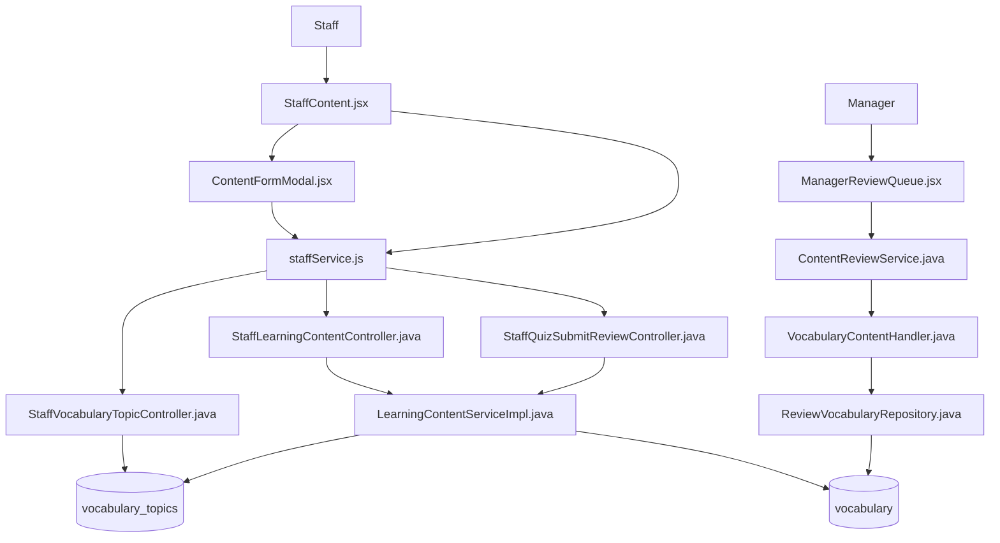
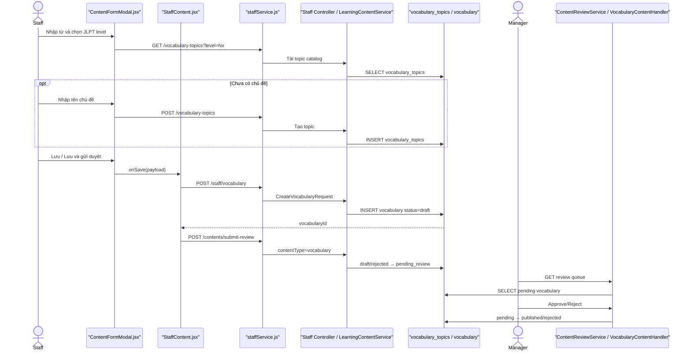

# Create Vocabulary — Staff tạo từ vựng và gửi Manager duyệt

> Phạm vi: Staff tạo một mục từ vựng trong project, gồm chọn/tạo chủ đề, lưu Draft, gửi duyệt và Manager Approve/Reject.

## 1. Tóm tắt tổng quan

Staff mở trang quản lý học liệu, chọn tab Từ vựng và mở form. Form tải danh sách chủ đề theo JLPT level; Staff phải chọn một `topicId` hoặc tạo chủ đề mới ngay trong modal. Khi lưu, frontend gọi `POST /api/staff/vocabulary`; backend kiểm tra DTO, xác nhận chủ đề tồn tại và cùng cấp độ, rồi luôn tạo bản ghi `DRAFT` trong bảng `vocabulary`. Nếu Staff chọn **Lưu và gửi duyệt**, frontend lấy `vocabularyId` và gọi `POST /api/staff/contents/submit-review` với `contentType=vocabulary`. Backend kiểm tra chủ sở hữu, trạng thái và các trường bắt buộc trước khi chuyển sang `PENDING_REVIEW`. Manager dùng `VocabularyContentHandler` để Approve thành `PUBLISHED` hoặc Reject thành `REJECTED` kèm feedback.

Điểm vào:

- Staff UI: [StaffContent.jsx](../../../../apps/frontend/src/features/management/staff/StaffContent.jsx).
- Form: [ContentFormModal.jsx](../../../../apps/frontend/src/features/management/components/staff/ContentFormModal.jsx).
- Tạo từ vựng: `POST /api/staff/vocabulary`.
- Tạo chủ đề: `POST /api/staff/vocabulary-topics`.
- Gửi duyệt: `POST /api/staff/contents/submit-review`.
- Manager review: `POST /api/manager/reviews`.

### 1.1. Đặc tả luồng: Input → Process → Output → Target

| Chặng | Input | Process | Output | Target |
|---|---|---|---|---|
| Tải/tạo topic | `jlptLevel`; tùy chọn `titleVi`, `titleJa` | Tải topic cùng level; nếu cần thì tạo, thêm và tự chọn topic mới | `topicId` hợp lệ | Topic APIs → `vocabulary_topics` |
| Nhập từ vựng | `word`, `furigana`, `meaning`, `wordType`, level, `topicId`, ví dụ | Bắt buộc topic; chuẩn hóa `topicId` thành Number | Payload Vocabulary | `ContentFormModal` → `StaffContent` |
| Tạo Draft | Payload + JWT Staff | Resolve Staff; kiểm tra topic tồn tại/cùng level; trim; gán `status=draft` | HTTP `201`, `vocabularyId` | `POST /api/staff/vocabulary` → `vocabulary` |
| Gửi duyệt | `{contentType:"vocabulary", contentId}` | Kiểm tra owner, `draft/rejected`, word/furigana/meaning/level | `pending_review` | Submit-review API → learning service |
| Manager Approve | `{contentType:"vocabulary", contentId, action:"APPROVE"}` | Chống tự duyệt/đồng thời; guarded update và audit | `published` | Review API → `VocabularyContentHandler` |
| Manager Reject | `{contentType:"vocabulary", contentId, action:"REJECT", feedback}` | Bắt buộc feedback; guarded update và audit | `rejected`, lý do | Review API → repository/audit |
| Nhánh lỗi | Thiếu topic/field, topic khác level, sai owner/status/quyền | Dừng trước bước ghi tiếp theo | Response lỗi; giữ dữ liệu hiện tại | Exception handler → frontend |

**Target cuối:** Vocabulary liên kết đúng topic/JLPT level và đạt `published`.

## 2. Bản đồ cấu trúc

| File | Vai trò | Loại |
|---|---|---|
| [StaffContent.jsx](../../../../apps/frontend/src/features/management/staff/StaffContent.jsx) | Điều phối tạo/cập nhật Vocabulary và submit-review | React Page |
| [ContentFormModal.jsx](../../../../apps/frontend/src/features/management/components/staff/ContentFormModal.jsx) | Nhập từ, cách đọc, nghĩa, loại từ, chủ đề và ví dụ | React Component |
| [staffLearningSlice.js](../../../../apps/frontend/src/features/management/staffLearningSlice.js) | Tải danh sách Vocabulary vào Redux | Redux Slice |
| [staffService.js](../../../../apps/frontend/src/shared/api/staffService.js) | API tạo từ, chủ đề, tải danh sách và gửi duyệt | API Service |
| [authService.js](../../../../apps/frontend/src/shared/api/authService.js) | Cấu hình Axios/JWT | Axios Client |
| [StaffLearningContentController.java](../../../../apps/backend/src/main/java/com/jlpt/feature/staffcontent/learning/controller/StaffLearningContentController.java) | Nhận CRUD API Vocabulary | Controller |
| [StaffVocabularyTopicController.java](../../../../apps/backend/src/main/java/com/jlpt/feature/staffcontent/learning/controller/StaffVocabularyTopicController.java) | Liệt kê/tạo chủ đề cho Staff | Controller |
| [StaffQuizSubmitReviewController.java](../../../../apps/backend/src/main/java/com/jlpt/feature/staffcontent/quiz/controller/StaffQuizSubmitReviewController.java) | Endpoint submit-review chung, route Vocabulary sang learning service | Controller |
| [CreateVocabularyRequest.java](../../../../apps/backend/src/main/java/com/jlpt/feature/staffcontent/learning/dto/CreateVocabularyRequest.java) | Validate payload tạo Vocabulary | DTO |
| [LearningContentServiceImpl.java](../../../../apps/backend/src/main/java/com/jlpt/feature/staffcontent/learning/service/LearningContentServiceImpl.java) | Tạo Draft, resolve topic và chuyển Pending Review | Service |
| [Vocabulary.java](../../../../apps/backend/src/main/java/com/jlpt/feature/learning/Vocabulary.java) | Entity ánh xạ bảng `vocabulary` | Entity |
| [VocabularyTopic.java](../../../../apps/backend/src/main/java/com/jlpt/feature/learning/VocabularyTopic.java) | Entity catalog chủ đề | Entity |
| [StaffVocabularyRepository.java](../../../../apps/backend/src/main/java/com/jlpt/feature/staffcontent/learning/repository/StaffVocabularyRepository.java) | Lưu/tìm Vocabulary của Staff | Repository |
| [ManagerReviewQueue.jsx](../../../../apps/frontend/src/features/management/manager/ManagerReviewQueue.jsx) | Hiển thị hàng chờ và thao tác review | React Page |
| [ContentReviewService.java](../../../../apps/backend/src/main/java/com/jlpt/feature/contentreview/service/ContentReviewService.java) | Kiểm tra Manager và điều phối Approve/Reject | Service |
| [VocabularyContentHandler.java](../../../../apps/backend/src/main/java/com/jlpt/feature/contentreview/handler/VocabularyContentHandler.java) | Adapter kiểm duyệt cho bảng Vocabulary | Handler |
| [ReviewVocabularyRepository.java](../../../../apps/backend/src/main/java/com/jlpt/feature/contentreview/repository/ReviewVocabularyRepository.java) | Query pending và cập nhật trạng thái | Repository |

Feature vượt 15 file do có nhánh tạo chủ đề và nhánh Manager review. Các thành phần phụ được ghi ở mục 8.

## 3. Bản đồ kết nối



| Từ | Đến | Cách kết nối | Dữ liệu |
|---|---|---|---|
| `ContentFormModal` | `staffService` | API trực tiếp | level hoặc topic payload |
| `ContentFormModal` | `StaffContent` | `onSave(payload)` | Vocabulary form + status |
| `StaffContent` | `staffService` | JS async call | create/update payload |
| `staffService` | Staff learning controller | Axios POST | JSON + JWT |
| Staff controller | Learning service | method call | DTO + email Staff |
| Learning service | Topic repository | lookup | topicId + JLPT level |
| Learning service | Vocabulary repository | JPA save | entity Draft/Pending |
| Common submit controller | Learning service | switch `vocabulary` | contentId + email |
| Manager UI | Review service | Review API | type/id/action/feedback |
| Review service | Vocabulary handler | resolver | Vocabulary snapshot |
| Vocabulary handler | Review repository | JPQL | status transition |

## 4. Luồng xử lý theo trình tự

### 4.1. Staff mở form và nhập từ vựng

1. Staff chọn tab `vocabulary`, được khai báo tại [StaffContent.jsx#L56](../../../../apps/frontend/src/features/management/staff/StaffContent.jsx#L56).
2. [ContentFormModal.jsx#L409](../../../../apps/frontend/src/features/management/components/staff/ContentFormModal.jsx#L409) render form Vocabulary.
3. Staff nhập `word`, `furigana`, `meaning`, `wordType`, `jlptLevel`, `exampleSentenceJp`, `exampleSentenceVi` và chọn chủ đề.
4. Khi modal mở hoặc level đổi, effect tại [ContentFormModal.jsx#L172](../../../../apps/frontend/src/features/management/components/staff/ContentFormModal.jsx#L172) gọi `getStaffVocabularyTopics(level)`.
5. [staffService.getStaffVocabularyTopics#L216](../../../../apps/frontend/src/shared/api/staffService.js#L216) gọi `GET /staff/vocabulary-topics?level=...`.

### 4.2. Nhánh tạo chủ đề mới nếu cần

6. Nếu chưa có chủ đề phù hợp, Staff nhập `titleVi` và `titleJa`; `handleCreateTopic` tại [ContentFormModal.jsx#L184](../../../../apps/frontend/src/features/management/components/staff/ContentFormModal.jsx#L184) gọi `createStaffVocabularyTopic`.
7. [staffService.createStaffVocabularyTopic#L221](../../../../apps/frontend/src/shared/api/staffService.js#L221) gửi `POST /staff/vocabulary-topics` với `{jlptLevel,titleVi,titleJa}`.
8. [StaffVocabularyTopicController.create#L40](../../../../apps/backend/src/main/java/com/jlpt/feature/staffcontent/learning/controller/StaffVocabularyTopicController.java#L40) gọi `VocabularyTopicService.create`, trả `topicId`.
9. Modal thêm topic vào danh sách và tự chọn topic mới tại [ContentFormModal.jsx#L194](../../../../apps/frontend/src/features/management/components/staff/ContentFormModal.jsx#L194).

### 4.3. Frontend tạo Vocabulary

10. `submit(status)` tại [ContentFormModal.jsx#L266](../../../../apps/frontend/src/features/management/components/staff/ContentFormModal.jsx#L266) chặn nếu chưa chọn `topicId`.
11. `getSubmitPayload` tại [ContentFormModal.jsx#L244](../../../../apps/frontend/src/features/management/components/staff/ContentFormModal.jsx#L244) chuyển `topicId` từ chuỗi thành Number; nút Lưu nháp dùng `draft`, nút Lưu và gửi duyệt dùng `pending_review`.
12. `StaffContent.handleSave` tại [StaffContent.jsx#L325](../../../../apps/frontend/src/features/management/staff/StaffContent.jsx#L325) đi vào nhánh Vocabulary tại dòng 362.
13. Tạo mới gọi `createStaffVocabulary(formData)` tại [StaffContent.jsx#L373](../../../../apps/frontend/src/features/management/staff/StaffContent.jsx#L373).
14. [staffService.createStaffVocabulary#L204](../../../../apps/frontend/src/shared/api/staffService.js#L204) gửi `POST /staff/vocabulary`.

### 4.4. Backend luôn tạo Draft

15. [StaffLearningContentController.createVocabulary#L90](../../../../apps/backend/src/main/java/com/jlpt/feature/staffcontent/learning/controller/StaffLearningContentController.java#L90) nhận `@Valid CreateVocabularyRequest` và email từ `Authentication`.
16. [CreateVocabularyRequest.java#L17](../../../../apps/backend/src/main/java/com/jlpt/feature/staffcontent/learning/dto/CreateVocabularyRequest.java#L17) yêu cầu `word`, `furigana`, `meaning`, `jlptLevel`, `topicId`.
17. [LearningContentServiceImpl.createVocabulary#L100](../../../../apps/backend/src/main/java/com/jlpt/feature/staffcontent/learning/service/LearningContentServiceImpl.java#L100) parse level và gọi `resolveTopic(topicId, level)`.
18. `resolveTopic` tại [LearningContentServiceImpl.java#L459](../../../../apps/backend/src/main/java/com/jlpt/feature/staffcontent/learning/service/LearningContentServiceImpl.java#L459) trả 404 nếu topic không tồn tại và 400 nếu topic khác JLPT level.
19. Service build entity, tự gán `DRAFT` và `createdBy=staff`, rồi lưu tại [LearningContentServiceImpl.java#L106](../../../../apps/backend/src/main/java/com/jlpt/feature/staffcontent/learning/service/LearningContentServiceImpl.java#L106).
20. API trả HTTP 201 cùng `vocabularyId`.

### 4.5. Staff gửi Manager duyệt

21. Nếu form chọn `pending_review`, `StaffContent` lấy `res.data.vocabularyId` và gọi `submitAssessmentForReview('vocabulary', vocabId)` tại [StaffContent.jsx#L375](../../../../apps/frontend/src/features/management/staff/StaffContent.jsx#L375).
22. [staffService.submitAssessmentForReview#L192](../../../../apps/frontend/src/shared/api/staffService.js#L192) gửi `POST /staff/contents/submit-review` với `{contentType:'vocabulary',contentId}`.
23. Submit controller nhận nhánh Vocabulary tại [StaffQuizSubmitReviewController.java#L99](../../../../apps/backend/src/main/java/com/jlpt/feature/staffcontent/quiz/controller/StaffQuizSubmitReviewController.java#L99), tạo `SubmitReviewRequest` và gọi learning service.
24. [LearningContentServiceImpl.submitForReview#L252](../../../../apps/backend/src/main/java/com/jlpt/feature/staffcontent/learning/service/LearningContentServiceImpl.java#L252) switch `vocabulary` sang `submitVocabulary`.
25. [LearningContentServiceImpl.submitVocabulary#L593](../../../../apps/backend/src/main/java/com/jlpt/feature/staffcontent/learning/service/LearningContentServiceImpl.java#L593) kiểm tra owner, trạng thái `DRAFT/REJECTED`, `word`, `furigana`, `meaning`, `jlptLevel`; sau đó đổi `PENDING_REVIEW`.

### 4.6. Manager nhận và xử lý

26. [ManagerReviewQueue.jsx](../../../../apps/frontend/src/features/management/manager/ManagerReviewQueue.jsx) tải Review Queue với type Vocabulary.
27. [ContentReviewService.getReviewQueue#L58](../../../../apps/backend/src/main/java/com/jlpt/feature/contentreview/service/ContentReviewService.java#L58) kiểm tra `STAFF_MANAGER` và resolve Vocabulary handler.
28. [VocabularyContentHandler.findPending#L36](../../../../apps/backend/src/main/java/com/jlpt/feature/contentreview/handler/VocabularyContentHandler.java#L36) gọi [ReviewVocabularyRepository.findPending#L21](../../../../apps/backend/src/main/java/com/jlpt/feature/contentreview/repository/ReviewVocabularyRepository.java#L21).
29. Manager gửi `{contentType:'vocabulary',contentId,action,feedback}` tới `POST /manager/reviews`; [ContentReviewService.review#L117](../../../../apps/backend/src/main/java/com/jlpt/feature/contentreview/service/ContentReviewService.java#L117) kiểm tra Manager và chống tự duyệt.
30. Approve gọi [VocabularyContentHandler.approve#L51](../../../../apps/backend/src/main/java/com/jlpt/feature/contentreview/handler/VocabularyContentHandler.java#L51), rồi [ReviewVocabularyRepository.approve#L36](../../../../apps/backend/src/main/java/com/jlpt/feature/contentreview/repository/ReviewVocabularyRepository.java#L36): `PENDING_REVIEW → PUBLISHED`, ghi `approvedBy`, `publishedAt`, `updatedAt`.
31. Reject bắt đầu tại [ContentReviewService.review#L147](../../../../apps/backend/src/main/java/com/jlpt/feature/contentreview/service/ContentReviewService.java#L147), bắt buộc feedback, gọi [VocabularyContentHandler.transitionFromPending#L56](../../../../apps/backend/src/main/java/com/jlpt/feature/contentreview/handler/VocabularyContentHandler.java#L56) và [ReviewVocabularyRepository.transition#L46](../../../../apps/backend/src/main/java/com/jlpt/feature/contentreview/repository/ReviewVocabularyRepository.java#L46): `PENDING_REVIEW → REJECTED`; feedback ghi qua [ReviewAuditService.log#L33](../../../../apps/backend/src/main/java/com/jlpt/feature/contentreview/service/ReviewAuditService.java#L33).



## 5. Vai trò từng đoạn code quan trọng

### 5.1. Frontend bắt buộc chọn chủ đề

[ContentFormModal.jsx#L265](../../../../apps/frontend/src/features/management/components/staff/ContentFormModal.jsx#L265)

```jsx
const submit = (status) => {
  if (contentType === 'vocabulary' && !form.topicId) {
    // Không gọi onSave nếu Staff chưa chọn hoặc tạo chủ đề.
    setTopicError('Vui lòng chọn (hoặc tạo) một chủ đề cho từ vựng.');
    return;
  }
  onSave(getSubmitPayload(status)); // Chuyển payload sang StaffContent.
};
```

### 5.2. Frontend tạo trước, submit sau

[StaffContent.jsx#L373](../../../../apps/frontend/src/features/management/staff/StaffContent.jsx#L373)

```jsx
const res = await createStaffVocabulary(formData); // API đầu tiên luôn tạo bản ghi Draft.
if (res.status && res.status !== 201) throw new Error(res.message || "Lỗi tạo từ vựng");
const vocabId = res.data?.vocabularyId || res.data?.id; // Lấy ID backend sinh.
if (formData.status === "pending_review" && vocabId) {
  // API thứ hai mới chuyển Draft sang Pending Review.
  await submitAssessmentForReview("vocabulary", vocabId);
}
```

### 5.3. Backend resolve topic và tạo Draft

[LearningContentServiceImpl.java#L100](../../../../apps/backend/src/main/java/com/jlpt/feature/staffcontent/learning/service/LearningContentServiceImpl.java#L100)

```java
StaffUser staff = resolveStaff(staffEmail);                  // Lấy người tạo từ JWT/email.
JlptLevel level = parseLevel(request.getJlptLevel());
VocabularyTopic topic = resolveTopic(request.getTopicId(), level); // Topic phải tồn tại và đúng level.
Vocabulary vocabulary = Vocabulary.builder()
        .word(request.getWord().trim())
        .furigana(request.getFurigana().trim())
        .meaning(request.getMeaning().trim())
        .jlptLevel(level)
        .topicRef(topic)
        .status(ContentStatus.DRAFT) // Không dùng status từ frontend để publish.
        .createdBy(staff)
        .build();
Vocabulary saved = vocabularyRepository.save(vocabulary);
```

### 5.4. Backend kiểm tra lại trước khi gửi duyệt

[LearningContentServiceImpl.java#L593](../../../../apps/backend/src/main/java/com/jlpt/feature/staffcontent/learning/service/LearningContentServiceImpl.java#L593)

```java
Vocabulary vocabulary = vocabularyRepository
        .findByIdAndStatusNot(contentId, ContentStatus.DELETED)
        .orElseThrow(LearningContentException::contentNotFound);
guardOwnership(vocabulary.getCreatedBy(), staff); // Chỉ người tạo được gửi.
guardSubmittable(
        vocabulary.getStatus() == ContentStatus.DRAFT || vocabulary.getStatus() == ContentStatus.REJECTED);
if (!StringUtils.hasText(vocabulary.getWord())) throw LearningContentException.missingField("word");
if (!StringUtils.hasText(vocabulary.getFurigana())) throw LearningContentException.missingField("furigana");
if (!StringUtils.hasText(vocabulary.getMeaning())) throw LearningContentException.missingField("meaning");
if (vocabulary.getJlptLevel() == null) throw LearningContentException.missingField("jlptLevel");
vocabulary.setStatus(ContentStatus.PENDING_REVIEW); // Đưa vào hàng chờ Manager.
vocabularyRepository.save(vocabulary);
```

### 5.5. Manager Approve/Reject

[VocabularyContentHandler.java#L51](../../../../apps/backend/src/main/java/com/jlpt/feature/contentreview/handler/VocabularyContentHandler.java#L51)

```java
public int approve(Long contentId, StaffUser manager, LocalDateTime now) {
    // Repository chỉ update nếu trạng thái hiện tại vẫn là PENDING_REVIEW.
    return repository.approve(contentId, manager, now,
            ContentStatus.PENDING_REVIEW, ContentStatus.PUBLISHED);
}

public int transitionFromPending(Long contentId, String targetStatus, LocalDateTime now) {
    ContentStatus targetContentStatus = HandlerSupport.toEnum(ContentStatus.class, targetStatus);
    // Reject chuyển từ PENDING_REVIEW sang REJECTED.
    return repository.transition(contentId, now, ContentStatus.PENDING_REVIEW, targetContentStatus);
}
```

## 6. Dữ liệu di chuyển như thế nào

Payload mẫu:

```json
{
  "word": "勉強",
  "furigana": "べんきょう",
  "meaning": "học tập",
  "wordType": "名詞",
  "jlptLevel": "N5",
  "topicId": 12,
  "exampleSentenceJp": "毎日日本語を勉強します。",
  "exampleSentenceVi": "Mỗi ngày tôi học tiếng Nhật."
}
```

| Chặng | Biến đổi | Nơi lưu/trả |
|---|---|---|
| Form | Nhập chuỗi; topicId ban đầu là string | React state |
| Payload | topicId đổi sang Number; thêm UI status | JS object |
| Create DTO | Bean Validation trường bắt buộc | Backend request |
| Service | Trim, parse JLPT, resolve topic | Vocabulary entity |
| Database | Thêm status Draft, creator, timestamps | `vocabulary` |
| Submit | Chỉ truyền type + vocabularyId | status Pending Review |
| Review Queue | Entity → ContentSnapshot | Manager response |
| Approve | Thêm approver/published time | status Published |
| Reject | Lưu feedback trong audit | status Rejected |

## 7. Bảng tra cứu tổng hợp

| Bước | File | Function | Kết nối tới | Dữ liệu | Ghi chú |
|---:|---|---|---|---|---|
| 1 | `ContentFormModal.jsx` | topic effect | staffService | JLPT level | Tải topics |
| 2 | `ContentFormModal.jsx` | `handleCreateTopic` | topic API | titleVi/titleJa | Nhánh tùy chọn |
| 3 | `ContentFormModal.jsx` | `submit` | StaffContent | form/status | Bắt buộc topic |
| 4 | `StaffContent.jsx` | `handleSave` | staffService | payload | Điều phối hai API |
| 5 | `staffService.js` | `createStaffVocabulary` | learning controller | JSON | POST create |
| 6 | `StaffLearningContentController` | `createVocabulary` | learning service | DTO/email | HTTP 201 |
| 7 | `LearningContentServiceImpl` | `createVocabulary` | topic/vocab repos | entity | Force Draft |
| 8 | `staffService.js` | `submitAssessmentForReview` | common controller | type/id | Vocabulary |
| 9 | Common submit controller | `submitReview` | learning service | request/email | Route type |
| 10 | Learning service | `submitVocabulary` | vocab repo | status | → Pending |
| 11 | Review service | `getReviewQueue` | vocab handler | filters | Manager only |
| 12 | Vocabulary handler | `approve/transition` | review repo | ID/status | Conditional update |
| 13 | Review audit | `log` | audit repo | action/feedback | Reject reason |

## 8. Các mục cần bổ sung context

- Frontend gửi thêm các trường UI như `contentType`, `status`, `id`, `updatedAt`; DTO create không khai báo chúng. Việc Jackson có bỏ qua trường dư hay không phụ thuộc cấu hình toàn cục, không xác định chỉ từ các file lõi này.
- Form hỗ trợ tạo topic ngay tại modal; chi tiết tạo `slug`, `displayOrder` và chống trùng nằm trong `VocabularyTopicService`, không mở rộng trong tài liệu này.
- Submit-review kiểm tra `furigana` bắt buộc, đúng với DTO. Staff cần nhập cách đọc trước khi lưu/gửi.
- Không tìm thấy thông báo realtime sau khi Manager review; Staff thấy trạng thái/feedback khi tải lại.
- Luồng Student xem/học từ vựng Published nằm ngoài phạm vi Create Vocabulary.
