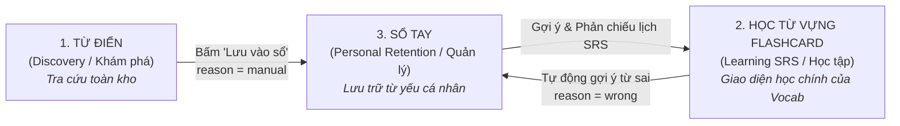
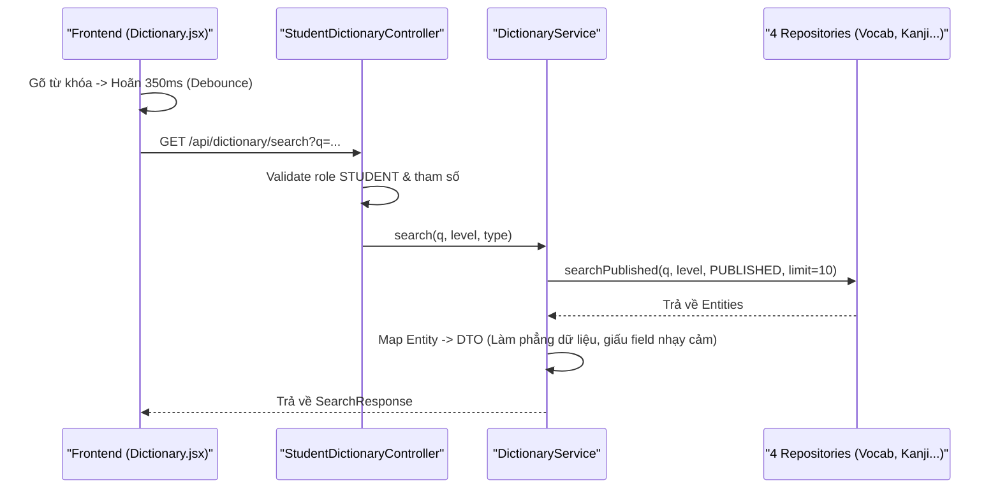

# BỘ TÀI LIỆU BẢO VỆ TOÀN DIỆN & SIÊU DỄ HIỂU
## CỤM TÍNH NĂNG: TỪ ĐIỂN – HỌC TỪ VỰNG DẠNG FLASHCARD (SRS) – SỔ TAY (NOTEBOOK)

> **Tài liệu Phục vụ Báo cáo Đồ án / Khóa luận Tốt nghiệp**  
> **Dự án:** Hệ thống Học Tiếng Nhật JLPT (Japanese Skill Practice Platform)  
> **Kiến trúc:** Java 21 + Spring Boot 3 (Backend) | React 18 (Frontend) | MySQL 8  
> **Phong cách:** Chi tiết từng bước, minh họa bằng ví dụ thực tế, ngữ nghĩa bình dân dễ nhớ nhưng chuẩn thuật ngữ chuyên môn.  

---

## 📌 MỤC LỤC
1. [CHƯƠNG 1: TÓM TẮT SIÊU NGẮN CHO BẢO VỆ (EXECUTIVE SUMMARY)](#chương-1-tóm-tắt-siêu-ngắn-cho-bảo-vệ-executive-summary)
2. [CHƯƠNG 2: KỊCH BẢN THỰC TẾ (STORY WALKTHROUGH - CÂU CHUYỆN HỌC VIÊN)](#chương-2-kịch-bản-thực-tế-story-walkthrough---câu-chuyện-học-viên)
3. [CHƯƠNG 3: BẢN THIẾT KẾ DỮ LIỆU & KIẾN TRÚC DB (DATABASE & ARCHITECTURE)](#chương-3-bản-thiết-kế-dữ-liệu--kiến-trúc-db-database--architecture)
4. [CHƯƠNG 4: PHÂN TÍCH CHI TIẾT 3 TÍNH NĂNG (TARGET - INPUT - OUTPUT - PROCESS)](#chương-4-phân-tích-chi-tiết-3-tính-năng-target---input---output---process)
   - [4.1. Từ Điển (Dictionary)](#41-từ-điển-dictionary)
   - [4.2. Học Từ Vựng dạng Flashcard SRS (Vocab Flashcard Session)](#42-học-từ-vựng-dạng-flashcard-srs-vocab-flashcard-session)
   - [4.3. Sổ Tay "Từ cần ôn lại" (Notebook)](#43-sổ-tay-từ-cần-ôn-lại-notebook)
5. [CHƯƠNG 5: BẢNG TỔNG HỢP ENDPOINT & DTO RESTFUL](#chương-5-bảng-tổng-hợp-endpoint--dto-restful)
6. [CHƯƠNG 6: BỘ 15 CÂU HỎI & CÂU TRẢ LỜI "BẮT BÀI" HỘI ĐỒNG (DEFENSE Q&A)](#chương-6-bộ-15-câu-hỏi--câu-trả-lời-bắt-bài-hội-đồng-defense-qa)

---

## CHƯƠNG 1: TÓM TẮT SIÊU NGẮN CHO BẢO VỆ (EXECUTIVE SUMMARY)

### 1.1. Khái niệm 3 từ khóa: Khám phá – Học tập – Quản lý
Hệ thống giải quyết bài toán học tiếng Nhật bằng **Vòng đời Từ vựng khép kín** gồm 3 tính năng liên kết chặt chẽ:



1. **Từ Điển (Dictionary):** Tính năng **Tra cứu (Discovery)**. Cho phép gõ từ khóa để tìm nhanh 4 loại kiến thức đã `PUBLISHED` (Từ vựng, Kanji, Ngữ pháp, Bài học). Có nút "Lưu vào sổ" để đưa từ vựng lạ về Sổ tay.
2. **Học Từ Vựng dạng Flashcard (Vocab Flashcard SRS):** Tính năng **Học & Đánh giá (Learning & Assessment)**. **Đây chính là hình thức thể hiện (UI) và động cơ học tập chủ đạo của Module Học Từ Vựng (`/vocabulary`)**. Từ vựng không hiển thị ở dạng danh sách tĩnh mà hiển thị dưới dạng thẻ Flashcard lật mặt và trắc nghiệm theo thuật toán lặp lại ngắt quãng **SM-2**.
3. **Sổ Tay "Từ cần ôn lại" (Notebook):** Tính năng **Quản lý cá nhân (Personal Retention)**. Kho gom các từ học viên hay làm sai khi học Flashcard hoặc chủ động lưu từ Từ điển. Nơi giúp người học theo dõi, lọc, tìm kiếm và gỡ các từ đã thuộc.

---

### 1.2. Bảng so sánh 3 tính năng (Trải nghiệm & Kỹ thuật)

| Tiêu chí | 1. Từ Điển (Dictionary) | 2. Học Từ Vựng dạng Flashcard (SRS) | 3. Sổ Tay (Notebook) |
|---|---|---|---|
| **Mục đích chính** | Tra cứu nhanh 4 loại kiến thức | Học & ghi nhớ từ vựng theo chủ đề | Gom & quản lý tập trung từ yếu |
| **Giao diện chính** | Ô tìm kiếm + Chip lọc 4 loại | Thẻ Flashcard lật mặt + Trắc nghiệm | Danh sách thẻ cuộn vô hạn |
| **Bản chất Backend** | Read-Only (Chỉ đọc DB) | Stateful (Ghi nhận điểm & lịch SM-2) | Stateful (Quản lý danh sách cá nhân) |
| **Độ lưu vết DB** | Không lưu (Client tự lưu lịch sử 8 từ) | Lưu trạng thái SRS (`interval_days`...) | Lưu bảng con trỏ `flashcards` |
| **Nguồn dữ liệu** | `vocabulary`, `kanji`, `grammar`, `lessons` | Bảng con trỏ `flashcards` trỏ tới `vocabulary` | Bảng con trỏ `flashcards` trỏ tới `vocabulary` |

---

## CHƯƠNG 2: KỊCH BẢN THỰC TẾ (STORY WALKTHROUGH - CÂU CHUYỆN HỌC VIÊN)

Để giúp Hội đồng dễ hình dung, hãy theo dõi hành trình học của học viên **Nam** trong một buổi sáng:

```
[ BƯỚC 1: TRA CỨU TỪ ĐIỂN ]
Nam gõ từ "Công ty" vào ô tìm kiếm ở trang Từ Điển (/dictionary).
↳ Frontend hoãn 350ms (debounce) rồi gọi API GET /api/dictionary/search?q=Công ty.
↳ Backend tìm thấy từ "会社" (Kaisha - ID: 105). Nam thấy từ này hay nên bấm nút "Lưu vào Sổ tay".
↳ FE gửi POST /api/notebook/words với body { contentId: 105, contentType: 'VOCABULARY', reason: 'manual' }.
↳ Backend tạo 1 thẻ trong Sổ tay của Nam trỏ tới từ 105.

[ BƯỚC 2: HỌC TỪ VỰNG DẠNG FLASHCARD ]
Nam quay lại Module Học Từ Vựng (/vocabulary), chọn Bài 1: "Công sở".
↳ Giao diện chuyển sang dạng Flashcard (/vocabulary/flashcard?topicId=1).
↳ Backend dệt hàng đợi Flashcard: Từ "会社" (ID: 105) xuất hiện ở dạng Thẻ MỚI (NEW).
↳ Nam chạm vào màn hình: Thẻ lật mặt sau, phát âm thanh "かいしゃ" và hiện ví dụ.
↳ Sau 2 thẻ MỚI, hệ thống đưa ngay 1 thẻ ÔN TẬP (Trắc nghiệm): "Từ 会社 nghĩa là gì?"
   A. Công viên    B. Công ty (Nam chọn)    C. Bệnh viện
↳ Nam chọn B. FE gửi POST /api/flashcards/105/review với { selectedOptionId: 105 }.
↳ Backend tự so sánh 105 == 105 -> ĐÚNG! Thuật toán SM-2 tăng khoảng cách ôn tập lên 1 ngày.

[ BƯỚC 3: LÀM SAI & TỰ ĐỘNG GỢI Ý VÀO SỔ TAY ]
Ở câu tiếp theo với từ "残業" (Làm thêm giờ - ID: 204), Nam chọn SAI.
↳ Backend tự chấm SAI, giảm Ease Factor của từ 204 xuống 2.30, reset lịch ôn về 1 ngày.
↳ Ở thẻ Flashcard cuối cùng của bài học, Backend trả về suggestAddToReviewDeck = true cùng danh sách wrongWords: [204].
↳ Giao diện hiển thị nút "Thêm 1 từ sai vào Sổ tay". Nam bấm nút.
↳ FE gọi POST /api/notebook/words với { items: [{ contentId: 204 }], reason: 'wrong' }.

[ BƯỚC 4: QUẢN LÝ SỔ TAY ]
Nam mở trang Sổ Tay (/notebook) để kiểm tra.
↳ Nam thấy cả 2 từ "会社" (do lưu thủ công) và "残業" (do làm sai) đều nằm gọn trong Sổ tay "Từ cần ôn lại".
↳ Khi Nam đã thuộc từ "会社", Nam bấm nút Gỡ từ. FE gọi DELETE /api/notebook/cards/{id}.
↳ Thẻ bị Soft Delete (is_deleted = true), biến mất khỏi Sổ tay của Nam nhưng từ gốc ở kho Vocabulary vẫn giữ nguyên!
```

---

## CHƯƠNG 3: BẢN THIẾT KẾ DỮ LIỆU & KIẾN TRÚC DB (DATABASE & ARCHITECTURE)

### 3.1. Cấu trúc 3 Bảng Database cốt lõi

```
+------------------------------------+       +-----------------------------------------+
|            vocabulary              |       |               flashcards                |
+------------------------------------+       +-----------------------------------------+
| PK  id                 BIGINT      |<------| PK  id                 BIGINT           |
|     word               VARCHAR(100)|       | FK  student_id         BIGINT           |
|     furigana           VARCHAR(100)|       | FK  deck_id            BIGINT           |
|     meaning            TEXT        |       |     content_type       VARCHAR(30)      |
|     example_sentence_jp TEXT       |       |     content_id         BIGINT (trỏ Vocab)|
|     example_sentence_vi TEXT       |       |     interval_days      INT DEFAULT 0    |
|     audio_url          VARCHAR(255)|       |     ease_factor        DECIMAL(3,2) 2.50|
|     status             VARCHAR(20) |       |     repetition_count   INT DEFAULT 0    |
|     is_deleted         BOOLEAN     |       |     next_review_date   DATE             |
+------------------------------------+       |     last_session_id    VARCHAR(36)      |
                                             |     added_reason       VARCHAR(20)      |
                                             |     is_deleted         BOOLEAN          |
                                             +-----------------------------------------+
                                                                  |
                                             +--------------------+--------------------+
                                             |            flashcard_decks              |
                                             +-----------------------------------------+
                                             | PK  id                 BIGINT           |
                                             | FK  student_id         BIGINT           |
                                             |     name               VARCHAR(100)     |
                                             |     is_review_deck     BOOLEAN          |
                                             +-----------------------------------------+
```

---

### 3.2. Giải thích Kiến trúc Con trỏ (Pointer-Based Architecture) siêu dễ hiểu

> **Câu hỏi của Thầy Cô:** *"Tại sao bảng `flashcards` không lưu luôn chữ '会社', nghĩa 'Công ty' mà lại chỉ lưu `content_id = 105`?"*

**Trả lời:**
1. **Tránh dư thừa dữ liệu (Single Source of Truth):** Một từ "会社" có 10,000 học viên cùng học. Nếu copy nghĩa "Công ty" 10,000 lần vào bảng `flashcards` sẽ làm phình DB cực nhanh. Chỉ lưu `content_id = 105` giúp bảng `flashcards` cực kỳ nhẹ.
2. **Cập nhật tức thì (Real-time Sync):** Khi Admin sửa từ "Công ty" thành "Công ty / Xí nghiệp", tất cả 10,000 học viên đều lập tức nhìn thấy nghĩa mới thông qua `FlashcardResolver` nạp live, không cần chạy script update dữ liệu.
3. **An toàn khi bị ẩn/xóa (FR-FC-34):** Nếu Admin ẩn từ 105 (`status != PUBLISHED` hoặc `is_deleted = true`), `FlashcardResolver` khi nạp sẽ trả về `frontText = null`. Giao diện Frontend tự động ẩn thẻ này đi mà không gây crash ứng dụng.

---

## CHƯƠNG 4: PHÂN TÍCH CHI TIẾT 3 TÍNH NĂNG (TARGET - INPUT - OUTPUT - PROCESS)

---

### 4.1. TỪ ĐIỂN (DICTIONARY)

#### 🎯 Target (Mục tiêu)
Tra cứu nhanh toàn bộ kho dữ liệu `PUBLISHED` (Từ vựng, Kanji, Ngữ pháp, Bài học) trong **1 lần gõ**. Giới hạn 10 mục overview/loại để không làm rối mắt, có nút "Xem thêm" phân trang lười (Lazy Loading) và nút "Lưu vào Sổ tay".

#### 📥 Input (Dữ liệu vào)
- **Tìm tổng hợp (`GET /api/dictionary/search`):**
  - `q` (*String*, bắt buộc): Từ khóa tìm kiếm (VD: "Nihon").
  - `jlptLevel` (*String*, tùy chọn): N5, N4, N3, N2, N1.
  - `type` (*String*, tùy chọn): VOCABULARY, KANJI, GRAMMAR, LESSON.
- **Xem thêm theo loại (`GET /api/dictionary/search/{type}`):**
  - `q`, `type`, `page` (*>= 0*), `size` (*1-100*, server tự cap tối đa `50`).

#### 📤 Output (Dữ liệu ra)
- **`SearchResponse`:** Gom 4 array (`vocabulary`, `kanji`, `grammar`, `lessons`). Mỗi loại max 10 mục overview.
- **`TypeSearchResponse`:** `type`, `items[]`, `hasMore` (*boolean*).

#### ⚙️ Process (Luồng xử lý 5 bước)


> **Điểm sáng Kỹ thuật cần khoe Hội đồng:**
> 1. **Kỹ thuật Debounce 350ms ở FE:** Giúp hoãn gửi request khi học viên đang gõ dở, giảm 80% số lượng request thừa lên server.
> 2. **Tính cờ `hasMore` không cần `COUNT(*)`:** 
>    `boolean hasMore = (items.size() == capped);`
>    Nếu số lượng phần tử lấy ra đúng bằng `size` yêu cầu (VD: 50 phần tử), Backend tự suy ra là vẫn còn trang sau. **Tiết kiệm 100% câu lệnh `SELECT COUNT(*)` đắt đỏ** trên DB.

---

### 4.2. HỌC TỪ VỰNG DẠNG FLASHCARD SRS (VOCAB FLASHCARD SESSION)

#### 🎯 Target (Mục tiêu)
Hiển thị toàn bộ kiến thức của **Module Học Từ Vựng (`/vocabulary`)** dưới dạng **Thẻ Flashcard tương tác**. Sử dụng thuật toán lặp lại ngắt quãng **SM-2** để phân bổ lịch ôn tập cá nhân hóa, khắc phục "đường cong quên".

#### 📥 Input (Dữ liệu vào)
- **Tạo phiên (`POST /api/flashcards/session?topicId=...`):** `topicId` (*Long*), `newLimit` (*int*, tùy chọn).
- **Nộp lượt ôn (`POST /api/flashcards/{id}/review`):**
  - Path: `flashcardId`
  - Body `ReviewRequest`:
    - `selectedOptionId` (*Long*): ID từ vựng chọn ở câu trắc nghiệm.
    - `sessionId` (*String*): UUID phiên học (VD: "uuid-123-abc").
    - `isLastCardInSession` (*boolean*): Cờ báo thẻ cuối cùng.

#### 📤 Output (Dữ liệu ra)
- **`SessionResponse`:** `sessionId`, `topicTitle`, `queue[]` (hàng đợi thẻ Flashcard). Mỗi thẻ gồm: mặt trước (`front`), mặt học nghĩa (`learn`), và trắc nghiệm (`quiz` với đáp án đúng + đáp án nhiễu distractor).
- **`ReviewResultResponse`:** `correct` (*boolean*), thông số SM-2 mới (`newIntervalDays`, `newEaseFactor`, `nextReviewDate`), cờ gợi ý từ sai `suggestAddToReviewDeck` và `wrongWords[]`.

#### ⚙️ Process & Công thức SM-2 siêu chi tiết bằng con số

##### A. Quy tắc Dệt hàng đợi Flashcard (Session Queue Weaving):
Backend ưu tiên chọn thẻ: **Chưa học (NEW) → Đến hạn ôn (DUE) → Khác**. Sau đó dệt theo tỉ lệ: **Học 2–3 thẻ NEW -> Đưa 1 thẻ REVIEW để test phản xạ ngay**.

##### B. Thuật toán SM-2 từng con số cụ thể (`applySm2`):
Mỗi thẻ có 3 thông số ban đầu: `Ease Factor` = 2.50, `Interval Days` = 0, `Repetition Count` = 0.

```
+-----------------------------------------------------------------------------------+
| KỊCH BẢN 1: Học viên trả lời ĐÚNG (EASY)                                          |
| - Lần 1 đúng: Repetition = 1, Interval = 1 ngày. Lịch ôn = Hôm nay + 1 ngày.     |
| - Lần 2 đúng: Repetition = 2, Interval = 6 ngày. Lịch ôn = Hôm nay + 6 ngày.     |
| - Lần 3 đúng: Ease Factor tăng từ 2.50 -> 2.60.                                   |
|   Interval = Round(6 * 2.60) = 16 ngày. Lịch ôn = Hôm nay + 16 ngày.              |
+-----------------------------------------------------------------------------------+

+-----------------------------------------------------------------------------------+
| KỊCH BẢN 2: Học viên trả lời SAI (WRONG)                                         |
| - Ease Factor bị trừ 0.20 (từ 2.50 xuống 2.30, không thấp hơn sàn 1.30).          |
| - Repetition reset về 0.                                                         |
| - Interval reset về 1 ngày (Ép học viên phải ôn lại vào ngày mai).                |
+-----------------------------------------------------------------------------------+
```

> **Điểm sáng Kỹ thuật cần khoe Hội đồng:**
> **Chấm điểm hoàn toàn ở Server (Server-side Grading):**
> Backend tự so sánh `boolean correct = request.selectedOptionId().equals(card.getContentId())`.
> Backend **không tin** cờ `correct` hay `rating` do client gửi lên (Tránh gian lận theo AGENTS.md §2.4).

---

### 4.3. SỔ TAY "TỪ CẦN ÔN LẠI" (NOTEBOOK)

#### 🎯 Target (Mục tiêu)
Kho lưu trữ **tập trung, cá nhân hóa** giúp học viên quản lý danh sách các từ vựng yếu. Hỗ trợ tìm kiếm mặt trước từ vựng server-side, lọc theo cấp độ, sắp xếp, cuộn vô hạn và gỡ từ (đơn hoặc hàng loạt). Đảm bảo tính **Idempotent** (mỗi từ vựng chỉ có 1 thẻ per-student).

#### 📥 Input (Dữ liệu vào)
- **Lấy danh sách thẻ (`GET /api/notebook/cards`):** `deckId`, `page`, `size`, `q` (từ khóa), `sortBy` (`recent`, `alpha`, `level`). *Đặt tên `sortBy` để không đụng hàng với keyword `sort` của Spring Pageable*.
- **Nạp từ vào sổ (`POST /api/notebook/words`):** `items: [{ contentType: 'VOCABULARY', contentId: 105 }]`, `reason` (`'wrong'` hoặc `'manual'`).
- **Gỡ từ (`DELETE /api/notebook/cards/{id}` hoặc `POST /api/notebook/cards/bulk-delete`):** ID thẻ hoặc danh sách `ids: [1, 2, 3]`.

#### 📤 Output (Dữ liệu ra)
- **`Page<FlashcardResponse>`:** Danh sách thẻ phân trang kèm thông số SRS và mặt thẻ (`frontText`, `furigana`, `meaning`, `audioUrl`, `isDue`).
- **`ReviewDeckAddResponse`:** `addedCount` (số từ thêm/chuyển sổ), `skippedCount` (số từ đã có sẵn trong sổ).

#### ⚙️ Process (Cơ chế Idempotence & Tìm kiếm Server-Side)

##### A. Cơ chế Chống tạo thẻ trùng (Idempotency):
Khi gọi `POST /api/notebook/words` để thêm từ ID 105:
1. Backend kiểm tra xem học viên đã có thẻ trỏ tới từ 105 chưa.
2. **Nếu chưa có:** Tạo thẻ mới trong sổ "Từ cần ôn lại" (`addedCount++`).
3. **Nếu đã có ở bài học Topic khác:** Backend **CHUYỂN** thẻ đó sang sổ "Từ cần ôn lại" bằng cách update `deck_id` (`addedCount++`).
4. **Nếu đã ở sẵn trong sổ "Từ cần ôn lại":** Bỏ qua (`skippedCount++`).
👉 **Kết luận:** Học viên bấm lưu 10 lần thì hệ thống vẫn chỉ duy trì đúng **1 thẻ duy nhất** cho từ đó!

##### B. Cơ chế Tìm kiếm In-Memory Server-Side (Khắc phục N+1):
Do mặt trước từ vựng (`word`) nằm ở bảng `vocabulary`, SQL không thể `WHERE word LIKE %q%` trực tiếp trên bảng `flashcards` nếu không dùng JOIN phức tạp.
Backend xử lý như sau:
```
[Bước 1] Lấy tất cả thẻ Flashcard của Student.
[Bước 2] Gọi FlashcardResolver.loadContentMaps() -> Chạy ĐÚNG 1 CÂU SQL findAllById() để nạp toàn bộ từ vựng vào RAM (Khắc phục lỗi N+1 Query).
[Bước 3] Filter từ khóa q trực tiếp trên RAM: filter(frontText.contains(q)).
[Bước 4] Sắp xếp (Sort) -> Phân trang thủ công (PageImpl).
```

---

## CHƯƠNG 5: BẢNG TỔNG HỢP ENDPOINT & DTO RESTFUL

| STT | Tính năng | HTTP Method & Path | Frontend Function | Backend Service | Response DTO chính |
|:---:|---|---|---|---|---|
| **1** | Từ điển | `GET /api/dictionary/search` | `searchDictionary` | `DictionaryService.search` | `SearchResponse` (Overview 4 loại) |
| **2** | Từ điển | `GET /api/dictionary/search/{type}` | `searchDictionaryByType` | `DictionaryService.searchByType` | `TypeSearchResponse` (`hasMore`) |
| **3** | Học Flashcard | `POST /api/flashcards/session` | `getVocabFlashcardSession` | `FlashcardSrsService.getSession` | `SessionResponse` (Queue thẻ) |
| **4** | Học Flashcard | `POST /api/flashcards/{id}/review` | `submitFlashcardReview` | `FlashcardSrsService.submitReview` | `ReviewResultResponse` (SM-2 & `wrongWords`) |
| **5** | Sổ tay | `GET /api/notebook/decks` | `getFlashcardDecks` | `NotebookService.getDecks` | `List<DeckSummaryResponse>` |
| **6** | Sổ tay | `GET /api/notebook/cards` | `getFlashcardsByDeck` | `NotebookService.getCards` | `Page<FlashcardResponse>` |
| **7** | Sổ tay | `DELETE /api/notebook/cards/{id}` | `removeFlashcardCard` | `NotebookService.deleteCard` | `Void` (Soft Delete) |
| **8** | Sổ tay | `POST /api/notebook/cards/bulk-delete` | `bulkDeleteFlashcards` | `NotebookService.bulkDelete` | `int` (Số thẻ đã gỡ) |
| **9** | Cầu nối | `POST /api/notebook/words` | `saveToNotebook` / `addWrongWords...` | `NotebookService.addWrongWords...` | `ReviewDeckAddResponse` (`addedCount`, `skippedCount`) |

---

## CHƯƠNG 6: BỘ 15 CÂU HỎI & CÂU TRẢ LỜI "BẮT BÀI" HỘI ĐỒNG (DEFENSE Q&A)

### ❓ Câu 1: Mối quan hệ giữa Module Học Từ Vựng (Vocab) và Flashcard trong hệ thống là gì?
> **Trả lời:**  
> Flashcard **chính là định dạng giao diện & động cơ học tập chủ đạo (Default Learning UI & Engine)** của Module Học Từ Vựng (`/vocabulary`). Khi học viên chọn bài học từ vựng theo chủ đề, hệ thống hiển thị toàn bộ từ vựng dưới dạng các **Thẻ Flashcard tương tác** (`/vocabulary/flashcard`). Việc này kết hợp lật thẻ (Học từ mới) và trắc nghiệm phản xạ (Ôn tập) theo thuật toán SM-2 để tối ưu hóa việc ghi nhớ.

---

### ❓ Câu 2: Tại sao không tính điểm Flashcard ở Frontend cho nhanh, mà phải gọi API về Backend chấm từng câu?
> **Trả lời:**  
> Tuân thủ nguyên tắc **Security & Data Integrity** (AGENTS.md §2.4). Frontend là "Untrusted Client". Nếu tính điểm ở Frontend, người dùng có thể mở DevTools chỉnh sửa biến kết quả, làm sai lệch thuật toán SM-2 và hỏng toàn bộ lịch trình ôn tập trên DB. Việc chấm điểm ở Backend (`selectedOptionId.equals(card.getContentId())`) đảm bảo tính chính xác và chống gian lận 100%.

---

### ❓ Câu 3: Tại sao kết quả tra cứu Từ điển tổng hợp chỉ trả về tối đa 10 mục cho mỗi loại nội dung?
> **Trả lời:**  
> Nhằm **tối ưu UX** và **giảm tải cho DB**: Trang tra cứu chung (Overview) phục vụ nhu cầu định hướng nhanh. Trả về quá nhiều dữ liệu sẽ làm rối mắt và tăng độ trễ mạng. Phân trang "Xem thêm" (`/api/dictionary/search/{type}`) hỗ trợ Lazy Loading, Backend chỉ nạp dữ liệu sâu khi người học bấm chọn đúng loại quan tâm.

---

### ❓ Câu 4: Thuật toán SM-2 trong hệ thống hoạt động như thế nào và các thông số cốt lõi là gì?
> **Trả lời:**  
> SM-2 giúp chống lại "đường cong quên":
> - `Ease Factor` (mặc định 2.50, sàn 1.30, trần 2.50): Hệ số độ khó. Trả lời SAI bị trừ 0.20, DỄ được cộng 0.10.
> - `Repetition Count`: Số lần đúng liên tiếp. Trả lời SAI reset về 0.
> - `Interval Days`: Số ngày giãn cách ôn tiếp theo. Lần 1 = 1 ngày, Lần 2 = 6 ngày, Lần n = $\text{round}(\text{Interval}_{\text{cũ}} \times \text{EaseFactor})$.
> - Lịch ôn = $\text{Ngày hiện tại} + \text{Interval Days}$.

---

### ❓ Câu 5: Làm thế nào Backend biết cờ `hasMore` trong phân trang Từ điển mà không cần chạy `COUNT(*)`?
> **Trả lời:**  
> Dùng kỹ thuật **Page-size Limit Checking**:
> Khi query với giới hạn $N$ phần tử (`capped size = 50`), Backend kiểm tra: `boolean hasMore = (items.size() == capped);`.
> Nếu danh sách trả về đúng bằng 50 phần tử, Backend suy ra là vẫn còn trang sau. Kỹ thuật này **tiết kiệm 100% câu lệnh `SELECT COUNT(*)` đắt đỏ** trên DB khi tìm kiếm bằng `LIKE`.

---

### ❓ Câu 6: Tại sao bảng `flashcards` không lưu trực tiếp thông tin từ vựng (word, meaning) mà chỉ lưu `content_id`?
> **Trả lời:**  
> Đây là thiết kế **Pointer-based Architecture** nhằm đạt 3 mục tiêu:
> 1. **Single Source of Truth:** Tránh dư thừa dữ liệu từ bảng `vocabulary`.
> 2. **Cập nhật tức thì (Real-time Sync):** Khi Admin sửa từ vựng, Flashcard và Sổ tay tự động phản chiếu nghĩa mới qua `FlashcardResolver` mà không cần sync DB.
> 3. **Tiết kiệm bộ nhớ DB.**

---

### ❓ Câu 7: Nếu một từ vựng bị Admin xóa (Soft Delete) hoặc ẩn (Unpublish), ứng dụng có bị crash không?
> **Trả lời:**  
> Không bao giờ crash nhờ **Live Resolving trong `FlashcardResolver`**:
> Khi nạp thẻ, Resolver kiểm tra từ vựng gốc. Nếu từ bị xóa (`is_deleted = true`) hoặc chưa `PUBLISHED`, Resolver trả về `ResolvedCard.EMPTY` (`frontText = null`). Service và UI tự động lọc bỏ các thẻ này khỏi danh sách hiển thị (tuân thủ FR-FC-34).

---

### ❓ Câu 8: Tại sao tính năng tìm kiếm ở Sổ tay phải xử lý in-memory ở Server?
> **Trả lời:**  
> Vì `frontText` nằm ở bảng `vocabulary` (không nằm ở bảng `flashcards`). Đơn giản hóa SQL và đảm bảo **không bỏ sót thẻ nằm ngoài trang đầu tiên của DB Paging**, `NotebookService` lấy toàn bộ thẻ -> dùng `FlashcardResolver` nạp batch nội dung từ vựng -> Filter từ khóa in-memory -> Phân trang thủ công (`PageImpl`).

---

### ❓ Câu 9: Cơ chế chống tạo thẻ trùng lặp (Idempotency) trong Sổ tay hoạt động ra sao?
> **Trả lời:**  
> Trong `NotebookService.addWrongWordsToReviewDeck`:
> Backend kiểm tra `findByStudentAndContent`: Nếu chưa có -> Tạo thẻ mới. Nếu đã có ở sổ khác -> **Chuyển** thẻ sang sổ Review Deck. Nếu đã ở sẵn trong Review Deck -> Bỏ qua. Đảm bảo mỗi học viên chỉ có **duy nhất 1 thẻ** cho 1 từ vựng.

---

### ❓ Câu 10: Tại sao lại tách Route Sổ tay từ `/api/flashcards` sang `/api/notebook/*` vào ngày 2026-07-22?
> **Trả lời:**  
> Đảm bảo **Chuẩn hóa RESTful và Tách biệt Domain (Bounded Context)**:
> - `/api/flashcards/*`: Thuộc domain **SRS Engine** (phiên học từ vựng, chấm điểm, SM-2).
> - `/api/notebook/*`: Thuộc domain **Personal Knowledge Management** (quản lý sổ tay, gỡ từ, tìm từ yếu).
> Giúp tuân thủ nguyên tắc SRP và phân quyền Spring Security rõ ràng hơn.

---

### ❓ Câu 11: Làm sao hệ thống khắc phục được bài toán N+1 Query khi hiển thị danh sách thẻ Flashcard/Sổ tay?
> **Trả lời:**  
> Thông qua phương thức `FlashcardResolver.loadContentMaps(Collection<Flashcard> cards)`:
> Resolver gom tất cả `contentId` lại và thực hiện **đúng 1 câu lệnh SQL `findAllById(ids)`** để nạp toàn bộ nội dung từ vựng vào RAM (`ContentMaps`). Giảm số lượng query DB từ $N+1$ xuống còn $O(1)$.

---

### ❓ Câu 12: Sự khác biệt giữa `reason = 'wrong'` và `reason = 'manual'` khi lưu từ vào Sổ tay là gì?
> **Trả lời:**  
> - `reason = 'wrong'`: Từ vựng hệ thống tự động gợi ý lưu sau khi học viên làm sai trong phiên Flashcard.
> - `reason = 'manual'`: Học viên chủ động bấm nút "Lưu vào sổ" khi tra cứu ở Từ điển.
> Ghi nhận `added_reason` giúp hệ thống phân tích nguồn gốc từ yếu của học viên để đưa ra thống kê về sau.

---

### ❓ Câu 13: Nếu có 100,000 học viên cùng mở phiên học Flashcard một lúc thì Backend xử lý thế nào để tránh quá tải?
> **Trả lời:**  
> 1. API khởi tạo phiên dùng **Batch Save (`saveAll`)** giúp tạo thẻ mới trong 1 câu Query duy nhất.
> 2. `FlashcardResolver` dùng **Batch Load In-Memory Cache** cho nội dung từ vựng tĩnh (`Vocabulary` ít thay đổi).
> 3. Trạng thái phiên (`sessionId`) được đóng dấu trực tiếp vào bản ghi nhẹ, giúp câu lệnh chấm điểm `submitReview` đạt thời gian phản hồi dưới 50ms.

---

### ❓ Câu 14: Tại sao trong Sổ tay param sắp xếp trên URL lại đặt tên là `sortBy` mà không phải `sort`?
> **Trả lời:**  
> Đây là một điểm xử lý **Xung đột Kỹ thuật (Framework Conflict Avoidance)**:
> Trong Spring Data JPA, `sort` là từ khóa dành riêng cho đối tượng `Pageable`. Nếu truyền `sort=alpha` trên URL, Spring sẽ tự động append thêm đoạn `ORDER BY alpha` vào JPQL. Do JPQL của chúng ta đã tự quản lý Order By, việc trùng từ khóa `sort` sẽ khiến Spring tạo ra câu SQL lỗi và trả về HTTP Status 500. Vì vậy, param được đổi tên thành `sortBy`.

---

### ❓ Câu 15: Tại sao Từ điển không có trạng thái học (Read-only) phía Server?
> **Trả lời:**  
> Từ điển được thiết kế thuần túy cho mục đích **Tra cứu thông tin (Information Lookup)**. Giữ cho Từ điển Read-only giúp tối ưu tối đa tốc độ phản hồi (High Throughput & Low Latency), có thể dễ dàng đánh Caching (Redis/CDN) ở tầng trên mà không lo về xung đột trạng thái dữ liệu cá nhân của từng học viên.

---

## 💡 MẸO ỨNG XỬ KHI BẢO VỆ TRƯỚC HỘI ĐỒNG
1. **Luôn bắt đầu bằng Vòng đời:** Khi được hỏi chung về 3 tính năng, hãy trả lời theo sơ đồ: **Từ điển (Tra cứu) -> Vocab Flashcard (Học SRS) -> Sổ tay (Lưu từ yếu)**.
2. **Nói rõ Flashcard là UI của Vocab:** Khẳng định ngay *"Flashcard không phải là module riêng lẻ mà là hình thức giao diện học tập của Vocab Module"*.
3. **Sử dụng con số thực tế:** Khi giải thích SM-2, hãy lấy ví dụ từ "会社" bị sai thì Ease Factor từ 2.50 giảm còn 2.30 như trong Chương 4.

---
*Chúc bạn có một buổi bảo vệ thành công rực rỡ và đạt điểm số cao nhất!*
