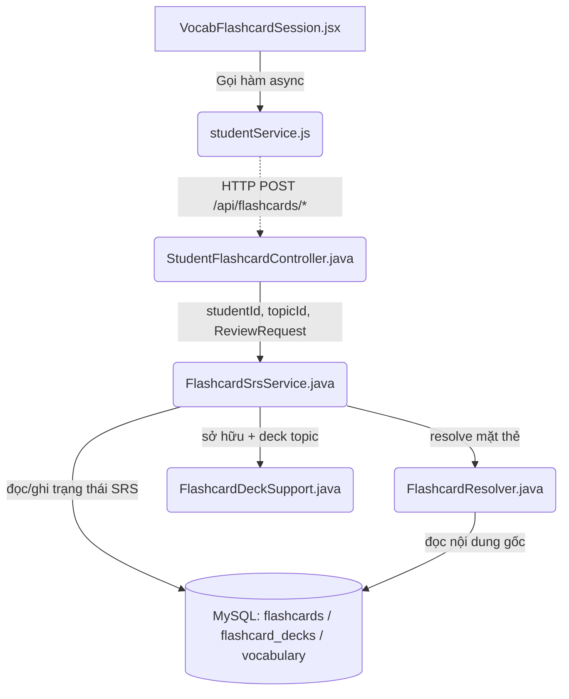
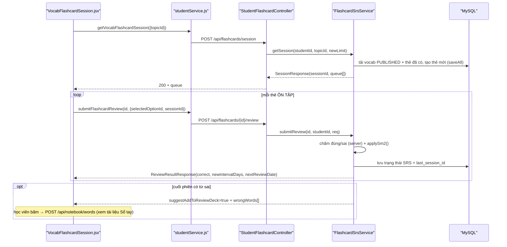

# Phân Tích Cấu Trúc – Luồng – Kết Nối Của Feature: Flashcard (Phiên học SRS)

> Tính năng học từ vựng theo giãn cách (Spaced Repetition) của học viên (STUDENT). Backend thuộc package `feature.flashcard`.
> Tài liệu tách riêng cho Flashcard; hai tính năng anh em xem [notebook_feature_analysis.md](notebook_feature_analysis.md) và [dictionary_feature_analysis.md](dictionary_feature_analysis.md).

## 1. Tóm tắt tổng quan

Feature Flashcard dựng một **phiên học trộn** theo chủ đề (topic): backend chọn ra các thẻ **MỚI** (lật để học nghĩa, không chấm điểm) và thẻ **ÔN TẬP** (trắc nghiệm chọn nghĩa, chấm server-side), dệt chúng thành hàng đợi theo lô "học 2–3 thẻ rồi kiểm tra ngay". Mỗi lượt trả lời được chấm ở backend (chống client-trusted data) và cập nhật lịch ôn theo thuật toán **SM-2**.

- **Tầng Frontend (React 18)**: trang `VocabFlashcardSession.jsx` quản lý state cục bộ bằng `useState`/`useEffect` (không Redux cho cụm này), gọi API qua `studentService.js` (Axios).
- **Tầng Backend (Spring Boot 3 + Java 21)**: Controller `StudentFlashcardController` → Service `FlashcardSrsService` (dựng phiên + chấm + SM-2) → Repository JPA → Entity `Flashcard`/`FlashcardDeck`, đọc nội dung gốc từ `Vocabulary`.
- **Điểm vào (Entry point)**:
  - FE: [App.jsx](apps/frontend/src/App.jsx#L107-L112) — route `/vocabulary/flashcard`.
  - BE: [StudentFlashcardController.java](apps/backend/src/main/java/com/jlpt/feature/flashcard/controller/StudentFlashcardController.java) — `/api/flashcards/*` (**chỉ** phiên ôn SRS; CRUD Sổ tay đã tách sang `/api/notebook/*`).

---

## 2. Bản đồ cấu trúc (các "mảnh" và vai trò)

| File | Vai trò | Loại |
|------|---------|------|
| [VocabFlashcardSession.jsx](apps/frontend/src/pages/vocabulary/VocabFlashcardSession.jsx) | Trang phiên học: lật thẻ MỚI, trắc nghiệm thẻ ÔN TẬP, thanh tiến độ `idx/total`, tổng kết `đúng/quizTotal`. | Page (React) |
| [studentService.js](apps/frontend/src/api/studentService.js) | Gọi HTTP `getVocabFlashcardSession`, `submitFlashcardReview` qua Axios; khử trùng request phiên. | API Service |
| [StudentFlashcardController.java](apps/backend/src/main/java/com/jlpt/feature/flashcard/controller/StudentFlashcardController.java) | Nhận `/api/flashcards/session` và `/api/flashcards/{id}/review`; `@PreAuthorize("hasRole('STUDENT')")`. | Controller |
| [FlashcardSrsService.java](apps/backend/src/main/java/com/jlpt/feature/flashcard/service/FlashcardSrsService.java) | **Trái tim** Flashcard: dựng phiên trộn NEW+REVIEW, chấm lượt server-side, tính lịch ôn theo SM-2, gom từ sai cuối phiên. | Service |
| [FlashcardResolver.java](apps/backend/src/main/java/com/jlpt/feature/flashcard/service/FlashcardResolver.java) | Read-model dùng chung: resolve **live** mặt thẻ (front/back/furigana/ví dụ/audio/level) theo `contentType`, nạp nội dung theo lô để tránh N+1. | Component |
| [FlashcardDeckSupport.java](apps/backend/src/main/java/com/jlpt/feature/flashcard/service/FlashcardDeckSupport.java) | Helper: kiểm tra sở hữu thẻ (`ownCardOrThrow`) + get-or-create deck phiên ôn theo topic (`getOrCreateDeck`). | Service (helper) |
| [Flashcard.java](apps/backend/src/main/java/com/jlpt/feature/flashcard/Flashcard.java) | Entity thẻ: student + deck + `content_type`/`content_id` + **trạng thái SRS** (`interval_days`, `ease_factor`, `repetition_count`, `next_review_date`, `last_rating`, `last_session_id`). Soft-delete. | Entity |
| [FlashcardDeck.java](apps/backend/src/main/java/com/jlpt/feature/flashcard/FlashcardDeck.java) | Entity sổ (deck) first-class; deck phiên ôn theo topic. Soft-delete. | Entity |
| [FlashcardRepository.java](apps/backend/src/main/java/com/jlpt/feature/flashcard/repository/FlashcardRepository.java) | Truy vấn thẻ: theo student/deck, theo content, các thẻ sai trong session, soft-delete. | Repository |
| [ReviewRequest / ReviewResultResponse / SessionResponse](apps/backend/src/main/java/com/jlpt/feature/flashcard/dto/) | DTO vào/ra của phiên và lượt ôn. | DTO |

---

## 3. Bản đồ kết nối (ai gọi ai, dữ liệu truyền qua đâu)



**Bảng tra cứu kết nối chính:**

| Từ (File A) | Đến (File B) | Cách kết nối | Dữ liệu truyền |
|---|---|---|---|
| `VocabFlashcardSession.jsx` | `studentService.js` | Gọi hàm async | `{ topicId }`; `(flashcardId, { selectedOptionId, isLastCardInSession, sessionId })` |
| `studentService.js` | `StudentFlashcardController` | HTTP POST | Query param `topicId`/`newLimit` + JSON body `ReviewRequest` |
| `StudentFlashcardController` | `FlashcardSrsService` | Dependency Injection | `studentId`, `topicId`, `newLimit`, `ReviewRequest` |
| `FlashcardSrsService` | `FlashcardResolver` | Gọi hàm | `Collection<Flashcard>` → `ContentMaps` → mặt thẻ |
| `FlashcardSrsService` | `FlashcardDeckSupport` | Gọi hàm | `flashcardId`, `studentId`, `StudentUser` → `Flashcard`, `FlashcardDeck` (deck topic) |
| `FlashcardSrsService` | `FlashcardRepository` | JPA method / `@Query` | Entity `Flashcard` (list, save, tìm thẻ sai trong session) |

---

## 4. Luồng xử lý theo trình tự

**Ví dụ: Một phiên học Flashcard hoàn chỉnh**

1. Học viên mở `/vocabulary/flashcard?topicId=…`. [VocabFlashcardSession.jsx:50-74](apps/frontend/src/pages/vocabulary/VocabFlashcardSession.jsx#L50-L74) gọi `getVocabFlashcardSession({ topicId })`.
2. `POST /api/flashcards/session?topicId=…` → [StudentFlashcardController.getSession()](apps/backend/src/main/java/com/jlpt/feature/flashcard/controller/StudentFlashcardController.java#L34-L42) → `flashcardSrsService.getSession(studentId, topicId, newLimit)`. Dùng **POST** (không GET) vì build phiên có side-effect: tạo deck/thẻ MỚI.
3. [FlashcardSrsService.getSessionLocked()](apps/backend/src/main/java/com/jlpt/feature/flashcard/service/FlashcardSrsService.java#L174-L264): tải các `Vocabulary` `PUBLISHED` của topic, map sang thẻ đã có; **xếp ưu tiên** chưa học → đến hạn → còn lại; tạo thẻ mới cho từ chưa có (`saveAll` — 1 lượt ghi, tránh N+1); dệt hàng đợi "học 2–3 thẻ rồi kiểm tra ngay" và cấp một `sessionId` (UUID).
4. FE nhận `SessionResponse { sessionId, level, topicTitle, queue[] }`, hiển thị thẻ đầu ở **mặt trước**.
5. Thẻ MỚI: học viên chạm lật xem nghĩa/ví dụ/audio → bấm "Tiếp theo" (không chấm điểm). Thẻ ÔN TẬP: chọn 1 trong 2 đáp án → [handleAnswer()](apps/frontend/src/pages/vocabulary/VocabFlashcardSession.jsx#L91-L110) gọi `submitFlashcardReview(flashcardId, { selectedOptionId, isLastCardInSession, sessionId })`.
6. `POST /api/flashcards/{id}/review` → [FlashcardSrsService.submitReview()](apps/backend/src/main/java/com/jlpt/feature/flashcard/service/FlashcardSrsService.java#L90-L161): **server tự** so `selectedOptionId == contentId` để quyết đúng/sai, đóng dấu `sessionId`, gọi `applySm2()` cập nhật lịch ôn, ghi log.
7. Ở thẻ cuối (`isLastCardInSession = true`), service gom các từ **sai trong chính phiên này** theo `sessionId` → trả `suggestAddToReviewDeck = true` + `wrongWords[]`.
8. FE hiện tổng kết `đúng/quizTotal`. Nếu có từ sai, học viên **bấm** "Thêm vào Từ cần ôn lại" → gọi sang endpoint Sổ tay `POST /api/notebook/words` (xem [notebook_feature_analysis.md](notebook_feature_analysis.md)).



---

## 5. Vai trò từng đoạn code quan trọng

### 1. Chấm điểm server-side + gom từ sai theo phiên
**File**: [FlashcardSrsService.java](apps/backend/src/main/java/com/jlpt/feature/flashcard/service/FlashcardSrsService.java) (dòng 90-161)
```java
public ReviewResultResponse submitReview(Long flashcardId, Long studentId, ReviewRequest request) {
    // Ép quyền sở hữu: thẻ phải thuộc đúng student (ném lỗi nếu không) — KHÔNG tin id từ client.
    Flashcard card = deckSupport.ownCardOrThrow(flashcardId, studentId);
    boolean isVocab = card.getContentType() == Flashcard.ContentType.VOCABULARY;

    if (isVocab && request.selectedOptionId() != null) {
        // Trắc nghiệm: SERVER tự xác định đúng/sai — optionId chính là vocabulary_id đúng.
        // Không nhận 'correct'/'rating' từ client (chống client-trusted data).
        correctOptionId = card.getContentId();
        correct = request.selectedOptionId().equals(card.getContentId());
        rating = correct ? Flashcard.LastRating.EASY : Flashcard.LastRating.WRONG;
    } else {
        // Thẻ lật (kanji/grammar/custom): rating do client gửi (EASY/HARD/WRONG).
        rating = Flashcard.LastRating.valueOf(request.rating().toUpperCase());
    }

    // Đóng dấu UUID phiên lên thẻ → cuối phiên gom ĐÚNG các từ sai của CHÍNH phiên này.
    if (request.sessionId() != null && !request.sessionId().isBlank()) card.setLastSessionId(request.sessionId());
    applySm2(card, rating);              // cập nhật trạng thái ôn (progress)
    flashcardRepository.save(card);

    // Cuối phiên: truy vấn các thẻ vocab bị sai trong cùng session_id → gợi ý thêm vào Sổ tay.
    if (request.isLastCardInSession() && card.getLastSessionId() != null) { ... }
}
```
**Giải thích**: Điểm rẽ nhánh chính. Đảm bảo **đúng/sai và rating đều do backend quyết định**, dùng `sessionId` (thay cửa sổ thời gian 2h cũ) để gom chính xác các từ sai của phiên. Service **chỉ gợi ý** (`suggestAddToReviewDeck` + `wrongWords`) — việc ghi vào Sổ tay do một request riêng (`/api/notebook/words`) thực hiện sau khi học viên bấm xác nhận.

### 2. Thuật toán SM-2 — sinh ra "tiến độ" của thẻ
**File**: [FlashcardSrsService.java](apps/backend/src/main/java/com/jlpt/feature/flashcard/service/FlashcardSrsService.java) (dòng 274-303)
```java
void applySm2(Flashcard card, Flashcard.LastRating rating) {
    double ease = card.getEaseFactor() != null ? card.getEaseFactor().doubleValue() : EASE_DEFAULT; // 2.50
    int rep = card.getRepetitionCount() != null ? card.getRepetitionCount() : 0;
    switch (rating) {
        case WRONG -> {                       // sai: giảm ease (sàn 1.30), reset chuỗi, ôn lại sau 1 ngày
            ease = clampEase(applyEaseDelta(ease, 0));
            card.setRepetitionCount(0);
            card.setIntervalDays(1);
        }
        case HARD -> card.setIntervalDays(Math.max(1, card.getIntervalDays())); // khó: giữ ease, interval = MAX(1, cũ)
        case EASY -> {                        // dễ: tăng ease (trần 2.50) rồi giãn 1 → 6 → interval*ease
            ease = clampEase(applyEaseDelta(ease, 5));
            if (rep == 0) card.setIntervalDays(1);
            else if (rep == 1) card.setIntervalDays(6);
            else card.setIntervalDays((int) Math.round(card.getIntervalDays() * ease));
            card.setRepetitionCount(rep + 1);
        }
    }
    card.setEaseFactor(BigDecimal.valueOf(ease).setScale(2, RoundingMode.HALF_UP));
    card.setNextReviewDate(LocalDate.now().plusDays(card.getIntervalDays())); // lịch ôn kế tiếp
    card.setLastReviewedAt(LocalDateTime.now());
    card.setLastRating(rating);
}
```
**Giải thích**: Nơi **tiến độ (progress)** của mỗi thẻ được sinh ra — `intervalDays`, `easeFactor` (1.30–2.50), `repetitionCount`, `nextReviewDate`, `lastRating`. Chính các trường này quyết định thẻ có được chọn vào phiên sau hay không (chưa học / đến hạn / chưa đến hạn).

### 3. Resolve live mặt thẻ (dùng chung, tránh N+1)
**File**: [FlashcardResolver.java](apps/backend/src/main/java/com/jlpt/feature/flashcard/service/FlashcardResolver.java) (dòng 38-46, 75-123)
```java
public ContentMaps loadContentMaps(Collection<Flashcard> cards) {
    // Nạp MỘT LẦT nội dung tích hợp theo loại (tránh N+1) để resolve nhiều thẻ.
    List<Vocabulary> vocab = vocabularyRepository.findAllById(idsOfType(cards, ContentType.VOCABULARY));
    // ... kanji, grammar ...
    return new ContentMaps(toMap(vocab, Vocabulary::getId), ...);
}
// resolve(): switch theo contentType; nguồn đã xóa/không PUBLISHED → ResolvedCard.EMPTY (frontText=null)
```
**Giải thích**: Mặt thẻ **không** lưu cứng trong bảng `flashcards` mà resolve live từ nội dung gốc. Nếu từ vựng bị gỡ hoặc không còn `PUBLISHED`, thẻ trả `frontText = null` và bị ẩn (FR-FC-34) — mặt thẻ luôn phản ánh nội dung mới nhất. Resolver là read-model **dùng chung** cho cả phiên ôn và Sổ tay để không lệch logic.

---

## 6. Dữ liệu di chuyển như thế nào

1. **`topicId`**: FE gửi query param → Controller nhận → Service tra `Vocabulary` `PUBLISHED` của topic.
2. **Thẻ (flashcards)**: bảng `flashcards` lưu **con trỏ + trạng thái học**, KHÔNG lưu bản sao nội dung. Khi dựng phiên, backend đọc `Vocabulary` theo `content_id`, sinh mặt trước (`word`+`furigana`) và mặt sau/đáp án (`meaning`), cùng distractor từ vocab khác.
3. **Lượt trả lời**: FE gửi `selectedOptionId` (= một `vocabulary_id`) trong JSON → Service so với `content_id` của thẻ để quyết đúng/sai. FE **không** gửi kết quả đúng/sai.
4. **Ghi tiến độ**: mỗi lượt chấm cập nhật các cột SRS trên chính dòng `flashcards` (`interval_days`, `ease_factor`, `repetition_count`, `next_review_date`, `last_reviewed_at`, `last_rating`, `last_session_id`) — nội dung gốc không đổi.
5. **Từ sai cuối phiên**: gom theo `last_session_id` → trả về `wrongWords[]` (danh sách `{ contentType, contentId }`) → FE dùng để gọi sang Sổ tay khi học viên xác nhận.

> Điểm mấu chốt: **một nguồn sự thật duy nhất** — cùng một dòng `flashcards` vừa được ôn qua phiên topic (tra theo `(student, content)`), vừa có thể nằm trong Sổ tay (deck `is_review_deck`).

---

## 7. Input / Output / Progress / Target

| Khía cạnh | Chi tiết |
|---|---|
| **Input** | `topicId` (bắt buộc), `newLimit?` khi tạo phiên. Mỗi lượt ôn: `selectedOptionId` (vocab) **hoặc** `rating` = easy/hard/wrong (kanji/grammar/custom), `isLastCardInSession`, `sessionId`. |
| **Output** | `SessionResponse { sessionId, deckId, level, topicTitle, wordCount, queue[] }`; mỗi `QueueItem { flashcardId, stage(NEW/REVIEW), front{word,furigana}, learn{meaning,exampleJp,exampleVi,audioUrl}, quiz{options[]} }`. Mỗi lượt: `ReviewResultResponse { correct, correctOptionId, correctMeaning, rating, newIntervalDays, newEaseFactor, nextReviewDate, repetitionCount, suggestAddToReviewDeck, wrongWords[] }`. |
| **Progress** | Trạng thái SRS trên từng thẻ: `intervalDays`, `easeFactor` (1.30–2.50), `repetitionCount`, `nextReviewDate`, `lastReviewedAt`, `lastRating`. FE hiển thị thanh `idx/total` và điểm cuối phiên `đúng/quizTotal`. |
| **Target** | Giúp học viên **ghi nhớ dài hạn** theo giãn cách: học rồi kiểm tra lại ngay trong phiên; SM-2 quyết định ngày ôn kế. Trần an toàn: tối đa `MAX_NEW = 20` từ/phiên, mặc định `NEW_CARDS_PER_DAY = 10`. |

---

## 8. Bảng tra cứu tổng hợp (endpoint)

| Bước | Method + Path | FE function | Service | Input | Output |
|---|---|---|---|---|---|
| Dựng phiên | `POST /api/flashcards/session` | `getVocabFlashcardSession` | `FlashcardSrsService.getSession` | `topicId, newLimit?` | `SessionResponse` |
| Chấm lượt ôn | `POST /api/flashcards/{id}/review` | `submitFlashcardReview` | `FlashcardSrsService.submitReview` | `ReviewRequest` | `ReviewResultResponse` |

> Toàn bộ endpoint yêu cầu `@PreAuthorize("hasRole('STUDENT')")` ở cấp lớp controller.

---

## 9. Các mục cần bổ sung context (nếu có)

- **`FlashcardSrsService.getSessionLocked()`**: thuật toán xếp ưu tiên (chưa học → đến hạn → còn lại) và cách dệt lô "học rồi kiểm tra" được suy từ chỗ gọi; chi tiết JPQL chọn thẻ chưa trích đầy đủ ở đây.
- **Distractor trắc nghiệm**: cách sinh đáp án nhiễu (2 lựa chọn) từ vocab khác cùng topic/level chưa được trích code cụ thể.
- **Kiểm soát cấp độ/subscription (LESSON-003)**: phiên chỉ kiểm tra topic `PUBLISHED`; ràng buộc "role + subscription/level" cho nội dung VIP (nếu có) cần xác nhận ở tầng Security/Course.
