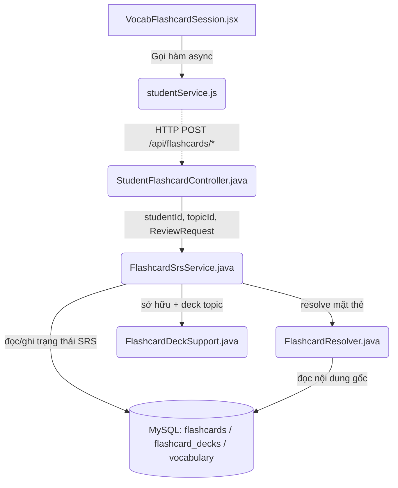
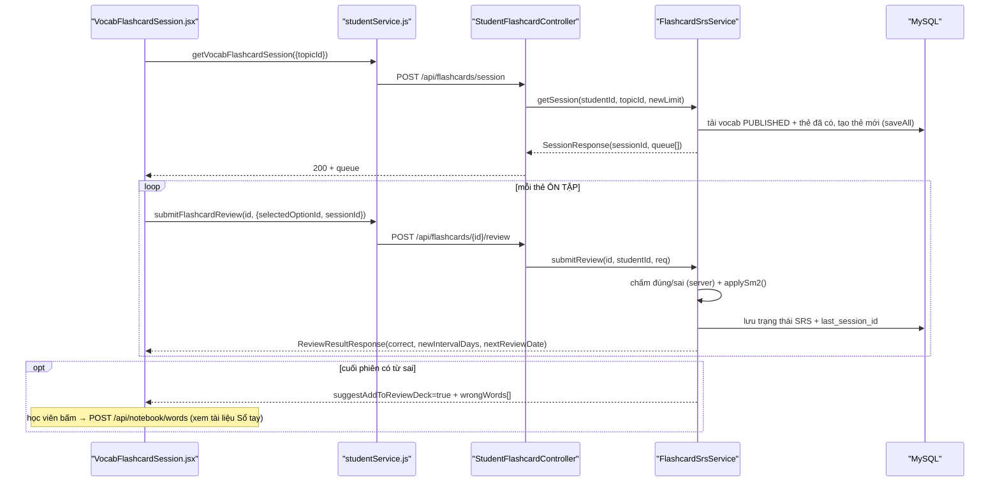

# Phân Tích Cấu Trúc – Luồng – Kết Nối Của Feature: Flashcard (Phiên học SRS)

> Tính năng học từ vựng theo giãn cách (Spaced Repetition) của học viên (STUDENT). Backend thuộc package `feature.flashcard`.
> Tài liệu tách riêng cho Flashcard; hai tính năng anh em xem [notebook_feature_analysis.md](notebook_feature_analysis.md) và [dictionary_feature_analysis.md](dictionary_feature_analysis.md).
>
> _Cập nhật 2026-07-26: FE đã tái cấu trúc sang Feature-Based Architecture (commit `9915c443`) — `src/pages/*` → `src/features/<feature>/…`, `src/api/*` → `src/shared/api/*`, `src/components/*` → `src/shared/components/*` hoặc `src/features/dashboard/student/*`; import dùng alias `@/`. Backend **không đổi** (package `feature.flashcard` giữ nguyên). Đường dẫn trong tài liệu này đã cập nhật theo cây mới._

## 0. Ghi nhớ nhanh (cheat-sheet)

**Câu thần chú**: *"Thẻ là con trỏ. Server chấm điểm. Lật không tính, trắc nghiệm mới tính."*

| # | Điều cần nhớ | Vì sao dễ quên / dễ sai |
|---|---|---|
| 1 | **Bảng `flashcards` KHÔNG lưu chữ** — chỉ lưu `content_type` + `content_id` (con trỏ) + trạng thái học | Nhìn tên bảng dễ tưởng có sẵn `word`/`meaning`; thực ra mặt thẻ được `FlashcardResolver` **resolve live** mỗi lần đọc |
| 2 | **FE không gửi đúng/sai** — chỉ gửi `selectedOptionId`, server tự so với `content_id` | Sửa nhầm sang tin `correct` từ client = lỗ hổng gian lận điểm |
| 3 | **Mỗi từ xuất hiện 2 lần**: 1 thẻ `NEW` (lật học) + 1 thẻ `REVIEW` (trắc nghiệm) | Nên `total` (số thẻ) = 2 × số từ, còn điểm chỉ tính trên `quizTotal` (thẻ REVIEW) |
| 4 | **Chỉ thẻ REVIEW mới gọi API** — lật thẻ NEW và bấm "Tiếp theo" là thuần FE | Đừng đi tìm request cho thao tác lật thẻ, nó không tồn tại |
| 5 | **`sessionId` là sợi chỉ xâu từ sai** — mỗi lượt chấm đóng dấu UUID lên thẻ | Thay cho cửa sổ thời gian 2h cũ (gom nhầm); cuối phiên gom theo `last_session_id` |
| 6 | **SM-2 chỉ đẻ ra 4 con số**: `intervalDays`, `easeFactor` (1.30–2.50), `repetitionCount`, `nextReviewDate` | Đây chính là toàn bộ "tiến độ" của thẻ — không có bảng progress riêng |
| 7 | **POST (không phải GET) để mở phiên** | Vì build phiên có side-effect: tạo deck + INSERT thẻ mới |
| 8 | **Có HAI hệ tiến độ từ vựng song song, không đồng bộ nhau**: SRS trên `flashcards` vs `student_content_progress` (`COMPLETED`) của màn Từ vựng | Số "đã học 12/40 từ" ở `/vocabulary?view=list` **không** đến từ phiên flashcard — xem [§10](#10-liên-quan-từ-vựng-vocabulary--nguồn-nội-dung-của-phiên) |

**Sơ đồ 1 dòng**: `Chủ đề → chọn từ (chưa học → đến hạn → còn lại) → dệt lô 2–3 thẻ (học → kiểm tra) → chấm server → SM-2 → gom từ sai → Sổ tay`

---

## 1. Tóm tắt tổng quan

Feature Flashcard dựng một **phiên học trộn** theo chủ đề (topic): backend chọn ra các thẻ **MỚI** (lật để học nghĩa, không chấm điểm) và thẻ **ÔN TẬP** (trắc nghiệm chọn nghĩa, chấm server-side), dệt chúng thành hàng đợi theo lô "học 2–3 thẻ rồi kiểm tra ngay". Mỗi lượt trả lời được chấm ở backend (chống client-trusted data) và cập nhật lịch ôn theo thuật toán **SM-2**.

- **Tầng Frontend (React 18)**: trang `VocabFlashcardSession.jsx` quản lý state cục bộ bằng `useState`/`useEffect` (không Redux cho cụm này), gọi API qua `studentService.js` (Axios).
- **Tầng Backend (Spring Boot 3 + Java 21)**: Controller `StudentFlashcardController` → Service `FlashcardSrsService` (dựng phiên + chấm + SM-2) → Repository JPA → Entity `Flashcard`/`FlashcardDeck`, đọc nội dung gốc từ `Vocabulary`.
- **Điểm vào (Entry point)**:
  - FE: [App.jsx](apps/frontend/src/App.jsx#L106-L110) — route `/vocabulary/flashcard`.
  - BE: [StudentFlashcardController.java](apps/backend/src/main/java/com/jlpt/feature/flashcard/controller/StudentFlashcardController.java) — `/api/flashcards/*` (**chỉ** phiên ôn SRS; CRUD Sổ tay đã tách sang `/api/notebook/*`).

---

## 2. Bản đồ cấu trúc (các "mảnh" và vai trò)

| File | Vai trò | Loại |
|------|---------|------|
| [VocabFlashcardSession.jsx](apps/frontend/src/features/vocabulary/vocabulary/VocabFlashcardSession.jsx) | Trang phiên học: lật thẻ MỚI, trắc nghiệm thẻ ÔN TẬP, thanh tiến độ `idx/total`, tổng kết `đúng/quizTotal`. | Page (React) |
| [studentService.js](apps/frontend/src/shared/api/studentService.js) | Gọi HTTP `getVocabFlashcardSession`, `submitFlashcardReview` qua Axios; khử trùng request phiên. | API Service |
| [StudentFlashcardController.java](apps/backend/src/main/java/com/jlpt/feature/flashcard/controller/StudentFlashcardController.java) | Nhận `/api/flashcards/session` và `/api/flashcards/{id}/review`; `@PreAuthorize("hasRole('STUDENT')")`. | Controller |
| [FlashcardSrsService.java](apps/backend/src/main/java/com/jlpt/feature/flashcard/service/FlashcardSrsService.java) | **Trái tim** Flashcard: dựng phiên trộn NEW+REVIEW, chấm lượt server-side, tính lịch ôn theo SM-2, gom từ sai cuối phiên. | Service |
| [FlashcardResolver.java](apps/backend/src/main/java/com/jlpt/feature/flashcard/service/FlashcardResolver.java) | Read-model dùng chung: resolve **live** mặt thẻ (front/back/furigana/ví dụ/audio/level) theo `contentType`, nạp nội dung theo lô để tránh N+1. | Component |
| [FlashcardDeckSupport.java](apps/backend/src/main/java/com/jlpt/feature/flashcard/service/FlashcardDeckSupport.java) | Helper: kiểm tra sở hữu thẻ (`ownCardOrThrow`) + get-or-create deck phiên ôn theo topic (`getOrCreateDeck`). | Service (helper) |
| [Flashcard.java](apps/backend/src/main/java/com/jlpt/feature/flashcard/Flashcard.java) | Entity thẻ: student + deck + `content_type`/`content_id` + **trạng thái SRS** (`interval_days`, `ease_factor`, `repetition_count`, `next_review_date`, `last_rating`, `last_session_id`). Soft-delete. | Entity |
| [FlashcardDeck.java](apps/backend/src/main/java/com/jlpt/feature/flashcard/FlashcardDeck.java) | Entity sổ (deck) first-class; deck phiên ôn theo topic. Soft-delete. | Entity |
| [FlashcardRepository.java](apps/backend/src/main/java/com/jlpt/feature/flashcard/repository/FlashcardRepository.java) | Truy vấn thẻ: theo student/deck, theo content, các thẻ sai trong session, soft-delete. | Repository |
| [ReviewRequest / ReviewResultResponse / SessionResponse](apps/backend/src/main/java/com/jlpt/feature/flashcard/dto/) | DTO vào/ra của phiên và lượt ôn. | DTO |

---

## 3. Bản đồ kết nối (ai gọi ai, dữ liệu truyền qua đâu)


```mermaid
graph TD
    UI["VocabFlashcardSession.jsx"] -->|Gọi hàm async| SVC("studentService.js")
    SVC -.->|HTTP POST /api/flashcards/*| Ctrl("StudentFlashcardController.java")
    Ctrl -->|studentId, topicId, ReviewRequest| Srs("FlashcardSrsService.java")
    Srs -->|resolve mặt thẻ| Res("FlashcardResolver.java")
    Srs -->|sở hữu + deck topic| Sup("FlashcardDeckSupport.java")
    Srs -->|đọc/ghi trạng thái SRS| DB[("MySQL: flashcards / flashcard_decks / vocabulary")]
    Res -->|đọc nội dung gốc| DB
```

**Bảng tra cứu kết nối chính:**

| Từ (File A) | Đến (File B) | Cách kết nối | Dữ liệu truyền |
|---|---|---|---|
| `VocabFlashcardSession.jsx` | `studentService.js` | Gọi hàm async | `{ topicId }`; `(flashcardId, { selectedOptionId, isLastCardInSession, sessionId })` |
| `studentService.js` | `StudentFlashcardController` | HTTP POST | Query param `topicId`/`newLimit` + JSON body `ReviewRequest` |
| `StudentFlashcardController` | `FlashcardSrsService` | Dependency Injection | `studentId`, `topicId`, `newLimit`, `ReviewRequest` |
| `FlashcardSrsService` | `FlashcardResolver` | Gọi hàm | `Collection<Flashcard>` → `ContentMaps` → mặt thẻ |
| `FlashcardSrsService` | `FlashcardDeckSupport` | Gọi hàm | `flashcardId`, `studentId`, `StudentUser` → `Flashcard`, `FlashcardDeck` (deck topic) |
| `FlashcardSrsService` | `FlashcardRepository` | JPA method / `@Query` | Entity `Flashcard` (list, save, tìm thẻ sai trong session) |

---

## 4. Luồng xử lý theo trình tự

**Ví dụ: Một phiên học Flashcard hoàn chỉnh**

1. Học viên mở `/vocabulary/flashcard?topicId=…`. [VocabFlashcardSession.jsx:50-74](apps/frontend/src/features/vocabulary/vocabulary/VocabFlashcardSession.jsx#L50-L74) gọi `getVocabFlashcardSession({ topicId })`.
2. `POST /api/flashcards/session?topicId=…` → [StudentFlashcardController.getSession()](apps/backend/src/main/java/com/jlpt/feature/flashcard/controller/StudentFlashcardController.java#L34-L42) → `flashcardSrsService.getSession(studentId, topicId, newLimit)`. Dùng **POST** (không GET) vì build phiên có side-effect: tạo deck/thẻ MỚI.
3. [FlashcardSrsService.getSessionLocked()](apps/backend/src/main/java/com/jlpt/feature/flashcard/service/FlashcardSrsService.java#L174-L264): tải các `Vocabulary` `PUBLISHED` của topic, map sang thẻ đã có; **xếp ưu tiên** chưa học → đến hạn → còn lại; tạo thẻ mới cho từ chưa có (`saveAll` — 1 lượt ghi, tránh N+1); dệt hàng đợi "học 2–3 thẻ rồi kiểm tra ngay" và cấp một `sessionId` (UUID).
4. FE nhận `SessionResponse { sessionId, level, topicTitle, queue[] }`, hiển thị thẻ đầu ở **mặt trước**.
5. Thẻ MỚI: học viên chạm lật xem nghĩa/ví dụ/audio → bấm "Tiếp theo" (không chấm điểm). Thẻ ÔN TẬP: chọn 1 trong 2 đáp án → [handleAnswer()](apps/frontend/src/features/vocabulary/vocabulary/VocabFlashcardSession.jsx#L91-L110) gọi `submitFlashcardReview(flashcardId, { selectedOptionId, isLastCardInSession, sessionId })`.
6. `POST /api/flashcards/{id}/review` → [FlashcardSrsService.submitReview()](apps/backend/src/main/java/com/jlpt/feature/flashcard/service/FlashcardSrsService.java#L90-L161): **server tự** so `selectedOptionId == contentId` để quyết đúng/sai, đóng dấu `sessionId`, gọi `applySm2()` cập nhật lịch ôn, ghi log.
7. Ở thẻ cuối (`isLastCardInSession = true`), service gom các từ **sai trong chính phiên này** theo `sessionId` → trả `suggestAddToReviewDeck = true` + `wrongWords[]`.
8. FE hiện tổng kết `đúng/quizTotal`. Nếu có từ sai, học viên **bấm** "Thêm vào Từ cần ôn lại" → gọi sang endpoint Sổ tay `POST /api/notebook/words` (xem [notebook_feature_analysis.md](notebook_feature_analysis.md)).


```mermaid
sequenceDiagram
    participant UI as "VocabFlashcardSession.jsx"
    participant API as "studentService.js"
    participant Ctrl as "StudentFlashcardController"
    participant Srs as "FlashcardSrsService"
    participant DB as "MySQL"

    UI->>API: getVocabFlashcardSession({topicId})
    API->>Ctrl: POST /api/flashcards/session
    Ctrl->>Srs: getSession(studentId, topicId, newLimit)
    Srs->>DB: tải vocab PUBLISHED + thẻ đã có, tạo thẻ mới (saveAll)
    Srs-->>Ctrl: SessionResponse(sessionId, queue[])
    Ctrl-->>UI: 200 + queue

    loop mỗi thẻ ÔN TẬP
        UI->>API: submitFlashcardReview(id, {selectedOptionId, sessionId})
        API->>Ctrl: POST /api/flashcards/{id}/review
        Ctrl->>Srs: submitReview(id, studentId, req)
        Srs->>Srs: chấm đúng/sai (server) + applySm2()
        Srs->>DB: lưu trạng thái SRS + last_session_id
        Srs-->>UI: ReviewResultResponse(correct, newIntervalDays, nextReviewDate)
    end

    opt cuối phiên có từ sai
        Srs-->>UI: suggestAddToReviewDeck=true + wrongWords[]
        Note over UI: học viên bấm → POST /api/notebook/words (xem tài liệu Sổ tay)
    end
```

### 4.1 Bấm vào đâu → nhảy vào hàm nào (click-trace)

Mỗi dòng là một thao tác thật trên màn hình; đi từ trái sang phải là thứ tự thực thi. Click vào link để nhảy thẳng tới hàm.

| Thao tác trên UI | 1️⃣ FE handler | 2️⃣ FE service | 3️⃣ HTTP | 4️⃣ Controller | 5️⃣ Service (nơi xử lý thật) | Ghi DB? |
|---|---|---|---|---|---|---|
| Bấm 1 **chủ đề** ở `/vocabulary` | [`startFlashcard()`](apps/frontend/src/features/vocabulary/vocabulary/VocabularyList.jsx#L92-L95) → `navigate('/vocabulary/flashcard?topicId=…')` | — | — | — | — | ❌ |
| **Trang phiên vừa mở** (tự chạy) | [`loadSession()`](apps/frontend/src/features/vocabulary/vocabulary/VocabFlashcardSession.jsx#L50-L74) | [`getVocabFlashcardSession()`](apps/frontend/src/shared/api/studentService.js#L175-L191) | `POST /api/flashcards/session?topicId=` | [`getSession()`](apps/backend/src/main/java/com/jlpt/feature/flashcard/controller/StudentFlashcardController.java#L34-L42) | [`FlashcardSrsService.getSession()`](apps/backend/src/main/java/com/jlpt/feature/flashcard/service/FlashcardSrsService.java#L166-L172) *(khoá)* → [`getSessionLocked()`](apps/backend/src/main/java/com/jlpt/feature/flashcard/service/FlashcardSrsService.java#L174-L264) → [`getOrCreateDeck()`](apps/backend/src/main/java/com/jlpt/feature/flashcard/service/FlashcardDeckSupport.java#L39) + [`rank()`](apps/backend/src/main/java/com/jlpt/feature/flashcard/service/FlashcardSrsService.java#L267-L270) + [`buildQuiz()`](apps/backend/src/main/java/com/jlpt/feature/flashcard/service/FlashcardSrsService.java#L333-L347) | ✅ INSERT deck + thẻ mới (`saveAll`) |
| **Chạm thẻ để lật** xem nghĩa | [`setRevealed()`](apps/frontend/src/features/vocabulary/vocabulary/VocabFlashcardSession.jsx#L249) | — | — | — | — | ❌ **thuần FE** |
| Bấm **loa** nghe phát âm | [`playAudio()`](apps/frontend/src/features/vocabulary/vocabulary/VocabFlashcardSession.jsx#L137-L139) | — | — | — | — | ❌ **thuần FE** |
| Bấm **"Tiếp theo"** | [`handleNext()`](apps/frontend/src/features/vocabulary/vocabulary/VocabFlashcardSession.jsx#L112-L118) | — | — | — | — | ❌ **thuần FE** (chỉ `idx + 1`) |
| **Chọn 1 đáp án** trắc nghiệm | [`handleAnswer()`](apps/frontend/src/features/vocabulary/vocabulary/VocabFlashcardSession.jsx#L91-L110) | [`submitFlashcardReview()`](apps/frontend/src/shared/api/studentService.js#L193-L204) | `POST /api/flashcards/{id}/review` | [`submitReview()`](apps/backend/src/main/java/com/jlpt/feature/flashcard/controller/StudentFlashcardController.java#L44-L52) | [`FlashcardSrsService.submitReview()`](apps/backend/src/main/java/com/jlpt/feature/flashcard/service/FlashcardSrsService.java#L90-L161) → [`ownCardOrThrow()`](apps/backend/src/main/java/com/jlpt/feature/flashcard/service/FlashcardDeckSupport.java#L28-L37) → [`applySm2()`](apps/backend/src/main/java/com/jlpt/feature/flashcard/service/FlashcardSrsService.java#L274-L303) | ✅ UPDATE cột SRS |
| Trả lời **thẻ cuối cùng** | như trên, kèm `isLastCardInSession: true` | như trên | như trên | như trên | nhánh cuối [`submitReview()`](apps/backend/src/main/java/com/jlpt/feature/flashcard/service/FlashcardSrsService.java#L131-L147) → `findWrongVocabCardsInSession()` | ✅ (chỉ đọc thêm) |
| Bấm **"Thêm vào Từ cần ôn lại"** | [`handleAddWrong()`](apps/frontend/src/features/vocabulary/vocabulary/VocabFlashcardSession.jsx#L120-L135) | [`addWrongWordsToReviewDeck()`](apps/frontend/src/shared/api/studentService.js#L206-L209) | `POST /api/notebook/words` | [`addWords()`](apps/backend/src/main/java/com/jlpt/feature/flashcard/controller/StudentNotebookController.java#L77-L83) ⚠️ **controller khác** | [`NotebookService.addWrongWordsToReviewDeck()`](apps/backend/src/main/java/com/jlpt/feature/flashcard/service/NotebookService.java#L137-L180) → [`getOrCreateReviewDeck()`](apps/backend/src/main/java/com/jlpt/feature/flashcard/service/NotebookService.java#L189-L197) | ✅ chuyển/tạo thẻ sang sổ |
| Bấm **"Học lại"** ở tổng kết | [`loadSession()`](apps/frontend/src/features/vocabulary/vocabulary/VocabFlashcardSession.jsx#L50-L74) *(gọi lại)* | như dòng mở phiên | như dòng mở phiên | như dòng mở phiên | phiên **mới** → `sessionId` UUID mới | ✅ |

> **3 bẫy hay gặp khi lần theo luồng**
> 1. Lật thẻ / bấm "Tiếp theo" **không sinh request nào** — đừng mở Network tab đi tìm.
> 2. Nút "Thêm vào Từ cần ôn lại" tuy nằm trong màn Flashcard nhưng chạy sang **`StudentNotebookController` + `NotebookService`**, không phải `FlashcardSrsService`.
> 3. `getSession()` chỉ là vỏ khoá `synchronized`; logic thật nằm ở `getSessionLocked()` — đặt breakpoint ở hàm sau.

### 4.2 Vào endpoint nào → chạy hàm nào ở backend (call-trace BE)

Phần trên dừng ở cột "Service". Phần này đi tiếp **bên trong backend**: request vào Controller rồi lần lượt chạm helper / repository / bảng nào, theo đúng thứ tự thực thi.

#### A. `POST /api/flashcards/session` — dựng phiên

```
SecurityFilterChain → JwtAuthenticationFilter → UserDetailsImpl (studentId lấy TỪ TOKEN)
└─ @PreAuthorize("hasRole('STUDENT')")            ← đặt ở cấp LỚP StudentFlashcardController
   └─ StudentFlashcardController.getSession()                                  [L34-42]
      └─ FlashcardSrsService.getSession()                @Transactional        [L166-172]
         ├─ SESSION_LOCKS.computeIfAbsent("<studentId>:topic:<topicId>")
         └─ synchronized (lock)
            └─ getSessionLocked()                                              [L174-264]
               ├─ 1. limit = newLimit>0 ? newLimit : NEW_CARDS_PER_DAY (10)
               ├─ 2. studentUserRepository.getReferenceById(studentId)   ⚠️ proxy, KHÔNG SELECT
               ├─ 3. topicId == null → BadRequestException (400)
               ├─ 4. vocabularyTopicRepository.findById(topicId)
               │       .filter(status == PUBLISHED) → ResourceNotFoundException (404)
               │                                              📖 SELECT vocabulary_topics
               ├─ 5. deckSupport.getOrCreateDeck(student, "<LEVEL>_<slug>")    [L39-44]
               │       findByStudentIdAndName → miss → save()
               │                                    📖 SELECT / ✍️ INSERT flashcard_decks
               ├─ 6. vocabularyRepository.findPublishedByTopicId(PUBLISHED, topicId)
               │                                              📖 SELECT vocabulary  (toàn bộ, KHÔNG paging)
               ├─ 7. flashcardRepository.findByStudentAndContentIds(studentId, VOCABULARY, ids)
               │                                              📖 SELECT flashcards  (1 query, chống N+1)
               ├─ 8. distractorPool: vocabList.size() >= 2 ? dùng luôn
               │       : vocabularyRepository.findPublishedByLevel(PUBLISHED, jl, PageRequest.of(0,30))
               │                                              📖 SELECT vocabulary  (chỉ khi topic < 2 từ)
               ├─ 9. Collections.shuffle(words) → sort(rank())        🧠 in-memory  [L267-270]
               ├─ 10. limit(min(limit, MAX_NEW = 20))                 🧠 in-memory
               ├─ 11. flashcardRepository.saveAll(toCreate)   ✍️ INSERT flashcards (batch, 1 lượt)
               ├─ 12. dệt lô 2–3: toQueueItem() → buildQuiz()  🧠 in-memory, KHÔNG query [L318-347]
               └─ 13. UUID.randomUUID() → sessionId
```

**Tổng cộng: 4–6 câu SQL** cho một phiên, không phụ thuộc số từ (mọi vòng lặp đều in-memory).

#### B. `POST /api/flashcards/{id}/review` — chấm một lượt

```
StudentFlashcardController.submitReview()   @Valid ReviewRequest                [L44-52]
└─ FlashcardSrsService.submitReview()        @Transactional                     [L90-161]
   ├─ 1. deckSupport.ownCardOrThrow(flashcardId, studentId)                     [L28-37]
   │       flashcardRepository.findById → empty → ResourceNotFoundException (404)
   │       card.student.id != studentId  → ForbiddenException (403)
   │                                                      📖 SELECT flashcards
   ├─ 2a. [vocab + selectedOptionId] correct = selectedOptionId.equals(contentId)
   │        vocabularyRepository.findById(contentId) → correctMeaning
   │                                                      📖 SELECT vocabulary
   ├─ 2b. [thẻ lật] rating == null → BadRequestException (400)
   │        Flashcard.LastRating.valueOf(rating.toUpperCase())
   ├─ 3. card.setLastSessionId(sessionId)
   ├─ 4. applySm2(card, rating)                            🧠 in-memory thuần   [L274-303]
   ├─ 5. flashcardRepository.save(card)                    ✍️ UPDATE flashcards
   ├─ 6. log.info("Flashcard review: …")                   📝 NFR-FC-05
   └─ 7. [isLastCardInSession] findWrongVocabCardsInSession(studentId, sessionId)
            │                                             📖 SELECT flashcards
            └─ resolver.loadContentMaps(wrong) → findAllById
                                                          📖 SELECT vocabulary (+kanji/grammar nếu có)
```

#### C. Bảng tra: repository → JPQL → bảng → đọc/ghi

| Repository method | Điều kiện chính trong JPQL | Bảng | Đọc/Ghi |
|---|---|---|---|
| `VocabularyTopicRepository.findById` | PK; `status == PUBLISHED` lọc **ở Java**, không ở SQL | `vocabulary_topics` | 📖 |
| [`findPublishedByTopicId`](apps/backend/src/main/java/com/jlpt/feature/learning/VocabularyRepository.java#L68-L76) | `status = :status AND topicRef.id = :topicId ORDER BY word` | `vocabulary` | 📖 |
| [`findPublishedByLevel`](apps/backend/src/main/java/com/jlpt/feature/learning/VocabularyRepository.java#L79-L89) | `status AND jlptLevel`, `PageRequest.of(0,30)` | `vocabulary` | 📖 |
| [`findByStudentAndContentIds`](apps/backend/src/main/java/com/jlpt/feature/flashcard/repository/FlashcardRepository.java#L184-L194) | `student.id AND contentType AND contentId IN :ids` | `flashcards` | 📖 |
| [`findWrongVocabCardsInSession`](apps/backend/src/main/java/com/jlpt/feature/flashcard/repository/FlashcardRepository.java#L160-L169) | `student.id AND lastSessionId AND contentType=VOCABULARY AND lastRating=WRONG` | `flashcards` | 📖 |
| `FlashcardDeckRepository.findByStudentIdAndName` | derived query | `flashcard_decks` | 📖 |
| `flashcardRepository.saveAll` / `save` | — | `flashcards` | ✍️ INSERT / UPDATE |

> **Không một câu JPQL nào ở trên viết `is_deleted = 0`** — điều kiện đó do [`@SQLRestriction("is_deleted = 0")`](apps/backend/src/main/java/com/jlpt/feature/flashcard/Flashcard.java#L14) trên Entity `Flashcard` tự chèn vào **mọi** truy vấn, kể cả `findById`.

#### D. 5 bẫy chỉ lộ ra khi đọc backend

1. **`studentId` KHÔNG bao giờ đến từ request.** Controller lấy `userDetails.getStudentUser().getId()` từ JWT; `topicId`/`flashcardId` từ client luôn được ép qua `ownCardOrThrow` hoặc điều kiện `student.id` trong JPQL. Đừng thêm param `studentId` — đó là lỗ hổng.
2. **`getReferenceById` trả proxy, không SELECT.** `studentId` không tồn tại sẽ không ra 404 sạch mà nổ `EntityNotFoundException` lúc flush — với JWT hợp lệ thì không xảy ra, nhưng test dựng student giả sẽ dính.
3. **Khoá `synchronized` nằm BÊN TRONG transaction.** `@Transactional` bọc ngoài `getSession()` nên transaction mở **trước** khi giành khoá. An toàn được là nhờ MySQL REPEATABLE READ lấy snapshot ở **câu đọc đầu tiên** — mà câu đọc đầu tiên xảy ra sau khi đã vào khối `synchronized`. Thêm bất kỳ truy vấn nào vào `getSession()` *trước* `synchronized` sẽ phá tính chất này.
4. **Thẻ đã soft-delete là "vô hình" với việc dựng phiên.** `findByStudentAndContentIds` bị `@SQLRestriction` lọc mất → từ đó bị coi là **chưa có thẻ** → bước 11 **INSERT một dòng mới** cho cùng `(student, content)`. Hệ quả: gỡ một từ khỏi Sổ tay rồi học lại chủ đề đó ⇒ DB có 2 dòng (1 cũ `is_deleted=1`, 1 mới) và **toàn bộ tiến độ SM-2 quay về 0**.
5. **`ownCardOrThrow` trên thẻ đã gỡ trả 404, không phải 403.** Vì `findById` không thấy dòng nào (bị `@SQLRestriction` chặn) nên rơi vào nhánh `ResourceNotFoundException` trước khi kịp so chủ sở hữu.

---

## 5. Vai trò từng đoạn code quan trọng

### 1. Chấm điểm server-side + gom từ sai theo phiên
**File**: [FlashcardSrsService.java](apps/backend/src/main/java/com/jlpt/feature/flashcard/service/FlashcardSrsService.java) (dòng 90-161)
```java
public ReviewResultResponse submitReview(Long flashcardId, Long studentId, ReviewRequest request) {
    // Ép quyền sở hữu: thẻ phải thuộc đúng student (ném lỗi nếu không) — KHÔNG tin id từ client.
    Flashcard card = deckSupport.ownCardOrThrow(flashcardId, studentId);
    boolean isVocab = card.getContentType() == Flashcard.ContentType.VOCABULARY;

    if (isVocab && request.selectedOptionId() != null) {
        // Trắc nghiệm: SERVER tự xác định đúng/sai — optionId chính là vocabulary_id đúng.
        // Không nhận 'correct'/'rating' từ client (chống client-trusted data).
        correctOptionId = card.getContentId();
        correct = request.selectedOptionId().equals(card.getContentId());
        rating = correct ? Flashcard.LastRating.EASY : Flashcard.LastRating.WRONG;
    } else {
        // Thẻ lật (kanji/grammar/custom): rating do client gửi (EASY/HARD/WRONG).
        rating = Flashcard.LastRating.valueOf(request.rating().toUpperCase());
    }

    // Đóng dấu UUID phiên lên thẻ → cuối phiên gom ĐÚNG các từ sai của CHÍNH phiên này.
    if (request.sessionId() != null && !request.sessionId().isBlank()) card.setLastSessionId(request.sessionId());
    applySm2(card, rating);              // cập nhật trạng thái ôn (progress)
    flashcardRepository.save(card);

    // Cuối phiên: truy vấn các thẻ vocab bị sai trong cùng session_id → gợi ý thêm vào Sổ tay.
    if (request.isLastCardInSession() && card.getLastSessionId() != null) { ... }
}
```
**Giải thích**: Điểm rẽ nhánh chính. Đảm bảo **đúng/sai và rating đều do backend quyết định**, dùng `sessionId` (thay cửa sổ thời gian 2h cũ) để gom chính xác các từ sai của phiên. Service **chỉ gợi ý** (`suggestAddToReviewDeck` + `wrongWords`) — việc ghi vào Sổ tay do một request riêng (`/api/notebook/words`) thực hiện sau khi học viên bấm xác nhận.

### 2. Thuật toán SM-2 — sinh ra "tiến độ" của thẻ
**File**: [FlashcardSrsService.java](apps/backend/src/main/java/com/jlpt/feature/flashcard/service/FlashcardSrsService.java) (dòng 274-303)
```java
void applySm2(Flashcard card, Flashcard.LastRating rating) {
    double ease = card.getEaseFactor() != null ? card.getEaseFactor().doubleValue() : EASE_DEFAULT; // 2.50
    int rep = card.getRepetitionCount() != null ? card.getRepetitionCount() : 0;
    switch (rating) {
        case WRONG -> {                       // sai: giảm ease (sàn 1.30), reset chuỗi, ôn lại sau 1 ngày
            ease = clampEase(applyEaseDelta(ease, 0));
            card.setRepetitionCount(0);
            card.setIntervalDays(1);
        }
        case HARD -> card.setIntervalDays(Math.max(1, card.getIntervalDays())); // khó: giữ ease, interval = MAX(1, cũ)
        case EASY -> {                        // dễ: tăng ease (trần 2.50) rồi giãn 1 → 6 → interval*ease
            ease = clampEase(applyEaseDelta(ease, 5));
            if (rep == 0) card.setIntervalDays(1);
            else if (rep == 1) card.setIntervalDays(6);
            else card.setIntervalDays((int) Math.round(card.getIntervalDays() * ease));
            card.setRepetitionCount(rep + 1);
        }
    }
    card.setEaseFactor(BigDecimal.valueOf(ease).setScale(2, RoundingMode.HALF_UP));
    card.setNextReviewDate(LocalDate.now().plusDays(card.getIntervalDays())); // lịch ôn kế tiếp
    card.setLastReviewedAt(LocalDateTime.now());
    card.setLastRating(rating);
}
```
**Giải thích**: Nơi **tiến độ (progress)** của mỗi thẻ được sinh ra — `intervalDays`, `easeFactor` (1.30–2.50), `repetitionCount`, `nextReviewDate`, `lastRating`. Chính các trường này quyết định thẻ có được chọn vào phiên sau hay không (chưa học / đến hạn / chưa đến hạn).

### 3. Resolve live mặt thẻ (dùng chung, tránh N+1)
**File**: [FlashcardResolver.java](apps/backend/src/main/java/com/jlpt/feature/flashcard/service/FlashcardResolver.java) (dòng 38-46, 75-123)
```java
public ContentMaps loadContentMaps(Collection<Flashcard> cards) {
    // Nạp MỘT LẦT nội dung tích hợp theo loại (tránh N+1) để resolve nhiều thẻ.
    List<Vocabulary> vocab = vocabularyRepository.findAllById(idsOfType(cards, ContentType.VOCABULARY));
    // ... kanji, grammar ...
    return new ContentMaps(toMap(vocab, Vocabulary::getId), ...);
}
// resolve(): switch theo contentType; nguồn đã xóa/không PUBLISHED → ResolvedCard.EMPTY (frontText=null)
```
**Giải thích**: Mặt thẻ **không** lưu cứng trong bảng `flashcards` mà resolve live từ nội dung gốc. Nếu từ vựng bị gỡ hoặc không còn `PUBLISHED`, thẻ trả `frontText = null` và bị ẩn (FR-FC-34) — mặt thẻ luôn phản ánh nội dung mới nhất. Resolver là read-model **dùng chung** cho cả phiên ôn và Sổ tay để không lệch logic.

---

## 6. Dữ liệu di chuyển như thế nào

1. **`topicId`**: FE gửi query param → Controller nhận → Service tra `Vocabulary` `PUBLISHED` của topic.
2. **Thẻ (flashcards)**: bảng `flashcards` lưu **con trỏ + trạng thái học**, KHÔNG lưu bản sao nội dung. Khi dựng phiên, backend đọc `Vocabulary` theo `content_id`, sinh mặt trước (`word`+`furigana`) và mặt sau/đáp án (`meaning`), cùng distractor từ vocab khác.
3. **Lượt trả lời**: FE gửi `selectedOptionId` (= một `vocabulary_id`) trong JSON → Service so với `content_id` của thẻ để quyết đúng/sai. FE **không** gửi kết quả đúng/sai.
4. **Ghi tiến độ**: mỗi lượt chấm cập nhật các cột SRS trên chính dòng `flashcards` (`interval_days`, `ease_factor`, `repetition_count`, `next_review_date`, `last_reviewed_at`, `last_rating`, `last_session_id`) — nội dung gốc không đổi.
5. **Từ sai cuối phiên**: gom theo `last_session_id` → trả về `wrongWords[]` (danh sách `{ contentType, contentId }`) → FE dùng để gọi sang Sổ tay khi học viên xác nhận.

> Điểm mấu chốt: **một nguồn sự thật duy nhất** — cùng một dòng `flashcards` vừa được ôn qua phiên topic (tra theo `(student, content)`), vừa có thể nằm trong Sổ tay (deck `is_review_deck`).

---

## 7. Input / Output / Progress / Target

| Khía cạnh | Chi tiết |
|---|---|
| **Input** | `topicId` (bắt buộc), `newLimit?` khi tạo phiên. Mỗi lượt ôn: `selectedOptionId` (vocab) **hoặc** `rating` = easy/hard/wrong (kanji/grammar/custom), `isLastCardInSession`, `sessionId`. |
| **Output** | `SessionResponse { sessionId, deckId, level, topicTitle, wordCount, queue[] }`; mỗi `QueueItem { flashcardId, stage(NEW/REVIEW), front{word,furigana}, learn{meaning,exampleJp,exampleVi,audioUrl}, quiz{options[]} }`. Mỗi lượt: `ReviewResultResponse { correct, correctOptionId, correctMeaning, rating, newIntervalDays, newEaseFactor, nextReviewDate, repetitionCount, suggestAddToReviewDeck, wrongWords[] }`. |
| **Progress** | Trạng thái SRS trên từng thẻ: `intervalDays`, `easeFactor` (1.30–2.50), `repetitionCount`, `nextReviewDate`, `lastReviewedAt`, `lastRating`. FE hiển thị thanh `idx/total` và điểm cuối phiên `đúng/quizTotal`. |
| **Target** | Giúp học viên **ghi nhớ dài hạn** theo giãn cách: học rồi kiểm tra lại ngay trong phiên; SM-2 quyết định ngày ôn kế. Trần an toàn: tối đa `MAX_NEW = 20` từ/phiên, mặc định `NEW_CARDS_PER_DAY = 10`. |

---

## 8. Bảng tra cứu tổng hợp (endpoint)

| Bước | Method + Path | FE function | Service | Input | Output |
|---|---|---|---|---|---|
| Dựng phiên | `POST /api/flashcards/session` | `getVocabFlashcardSession` | `FlashcardSrsService.getSession` | `topicId, newLimit?` | `SessionResponse` |
| Chấm lượt ôn | `POST /api/flashcards/{id}/review` | `submitFlashcardReview` | `FlashcardSrsService.submitReview` | `ReviewRequest` | `ReviewResultResponse` |

> Toàn bộ endpoint yêu cầu `@PreAuthorize("hasRole('STUDENT')")` ở cấp lớp controller.

---

## 9. Các mục cần bổ sung context (nếu có)

- **Xếp ưu tiên chọn từ**: không phải JPQL mà là sắp xếp in-memory — [`rank()`](apps/backend/src/main/java/com/jlpt/feature/flashcard/service/FlashcardSrsService.java#L267-L270) chấm điểm mỗi từ (chưa học = 0 → đến hạn = 1 → đã học chưa đến hạn = 2), sau khi `Collections.shuffle` để trộn trong từng nhóm; repository chỉ trả toàn bộ vocab `PUBLISHED` của topic (`findPublishedByTopicId`).
- **Distractor trắc nghiệm**: [`buildQuiz()`](apps/backend/src/main/java/com/jlpt/feature/flashcard/service/FlashcardSrsService.java#L333-L347) tạo 2 lựa chọn — nghĩa đúng + 1 distractor chọn ngẫu nhiên từ `distractorPool` (các từ khác **cùng topic**; nếu topic có < 2 từ thì rơi về 30 từ `PUBLISHED` **cùng level**), loại các từ trùng `id` hoặc trùng `meaning`, rồi `shuffle` thứ tự đáp án.
- **Khoá phiên đồng thời**: `getSession()` chặn race condition bằng `SESSION_LOCKS` (`ConcurrentHashMap` khoá theo `studentId:topic:topicId`). Khoá `static` nên **chỉ hiệu lực trong 1 JVM** — không đồng bộ khi scale ngang, và entry không bao giờ bị xoá (chấp nhận ở quy mô hiện tại).
- **Kiểm soát cấp độ/subscription (LESSON-003)**: phiên chỉ kiểm tra topic `PUBLISHED`; ràng buộc "role + subscription/level" cho nội dung VIP (nếu có) cần xác nhận ở tầng Security/Course.

---

## 10. Liên quan Từ Vựng (Vocabulary) — nguồn nội dung của phiên

Flashcard **không có nội dung của riêng nó**. Toàn bộ mặt thẻ đến từ feature Từ Vựng (`feature.learning`): bảng `vocabulary` + `vocabulary_topics`. Hiểu phần này thì mới hiểu vì sao thẻ trống, vì sao chọn được distractor, và vì sao có hai con số tiến độ khác nhau.

### 10.1 Hai bảng nguồn

| Bảng | Entity | Cột chính | Vai trò với Flashcard |
|---|---|---|---|
| `vocabulary` | [Vocabulary.java](apps/backend/src/main/java/com/jlpt/feature/learning/Vocabulary.java) | `vocabulary_id` (PK), `word`, `furigana`, `meaning`, `word_type`, `jlpt_level`, `topic_id` (FK), `audio_url`, `example_sentence_jp/vi`, `status` | `flashcards.content_id` **trỏ thẳng** vào `vocabulary_id` khi `content_type = VOCABULARY` |
| `vocabulary_topics` | [VocabularyTopic.java](apps/backend/src/main/java/com/jlpt/feature/learning/VocabularyTopic.java) | `topic_id` (PK), `jlpt_level`, `slug`, `title_ja`, `title_vi`, `display_order`, `status` | `topicId` truyền vào `POST /api/flashcards/session` chính là `topic_id` này; `title_vi` là `topicTitle` trong `SessionResponse` |

> `vocabulary.topic_id` là khoá chủ đề **duy nhất** — cột free-text `topic` cũ đã bị drop (migration V20). Đừng tìm chủ đề bằng chuỗi.
> `vocabulary_topics` unique theo `(jlpt_level, slug)` và `(jlpt_level, title_vi)` → cùng một tên chủ đề có thể tồn tại ở nhiều cấp độ với `topic_id` khác nhau.

### 10.2 `topicId` đi từ đâu tới phiên học

```
GET /api/vocabulary/topics?level=N5        (StudentVocabularyController)
   → StudentVocabularyService.getTopics()  → topicRepository.findPublishedByLevel(level, PUBLISHED)
   → [VocabTopicResponse { topicId, slug, titleJa, titleVi }]
   → FE VocabularyList.jsx: lưới "Học Flashcard theo chủ đề"
   → startFlashcard(t.topicId) → /vocabulary/flashcard?topicId=…&level=…
   → POST /api/flashcards/session?topicId=…
```

- FE handler: [`startFlashcard()`](apps/frontend/src/features/vocabulary/vocabulary/VocabularyList.jsx#L93-L94) — chỉ `navigate`, **không** gọi API.
- `VocabHome.jsx` (route mặc định `/vocabulary`) cũng phát ra `topicId` qua `GET /api/students/vocab-home` ([VocabHomeService](apps/backend/src/main/java/com/jlpt/feature/student/VocabHomeService.java)) — mỗi chủ đề là một "bài" trong lesson-path.
- Hệ quả: **`topicId` không do Flashcard sinh ra**. Topic bị `UNPUBLISHED` hoặc `topicId` không tồn tại → phiên rỗng, không có lỗi tường minh.

### 10.3 Ba truy vấn `vocabulary` mà Flashcard thực sự dùng

| Nơi gọi | Query (VocabularyRepository) | Dùng để làm gì |
|---|---|---|
| [`getSessionLocked()`](apps/backend/src/main/java/com/jlpt/feature/flashcard/service/FlashcardSrsService.java#L174-L264) | [`findPublishedByTopicId(PUBLISHED, topicId)`](apps/backend/src/main/java/com/jlpt/feature/learning/VocabularyRepository.java#L68-L76) | Lấy **toàn bộ** từ `PUBLISHED` của chủ đề (không phân trang) → làm tập ứng viên, rồi `rank()` in-memory |
| [`buildQuiz()`](apps/backend/src/main/java/com/jlpt/feature/flashcard/service/FlashcardSrsService.java#L333-L347) | [`findPublishedByLevel(PUBLISHED, level, pageable)`](apps/backend/src/main/java/com/jlpt/feature/learning/VocabularyRepository.java#L79-L89) | Pool distractor dự phòng (30 từ cùng cấp độ) khi chủ đề có < 2 từ |
| [`FlashcardResolver.loadContentMaps()`](apps/backend/src/main/java/com/jlpt/feature/flashcard/service/FlashcardResolver.java#L38-L46) | `findAllById(ids)` | Resolve **live** mặt thẻ theo lô (tránh N+1) |

⚠️ `findAllById` của Resolver **không lọc `status`** ở tầng SQL — việc loại nội dung không `PUBLISHED` xảy ra ở `resolve()` (trả `ResolvedCard.EMPTY`). Nghĩa là thẻ trỏ vào từ đã bị gỡ vẫn tồn tại trong DB, chỉ bị ẩn khi hiển thị (FR-FC-34).

### 10.4 Trường `vocabulary` → thành phần nào của thẻ

| Cột `vocabulary` | Xuất hiện ở | Ghi chú |
|---|---|---|
| `word` | `front.word` (mặt trước) | Cũng là thứ Sổ tay lọc khi tìm kiếm (`frontText`) |
| `furigana` | `front.furigana` | Null được — mặt trước vẫn hợp lệ |
| `meaning` | `learn.meaning` + đáp án đúng của `quiz.options[]` | `buildQuiz()` loại distractor **trùng `meaning`** để tránh 2 đáp án cùng nghĩa |
| `example_sentence_jp` / `_vi` | `learn.exampleJp` / `learn.exampleVi` | Chỉ hiện ở mặt sau thẻ NEW |
| `audio_url` | `learn.audioUrl` | Nút loa là **thuần FE**, không có request nào |
| `jlpt_level` | `SessionResponse.level` | Cũng là khoá chọn pool distractor dự phòng |
| `vocabulary_id` | `flashcards.content_id` **và** `quiz.options[].optionId` | Chính vì thế server chấm điểm bằng `selectedOptionId == card.getContentId()` |
| `status` | (bộ lọc) | Kiểu `ContentStatus` lưu **chữ thường** trong DB, đọc qua `ContentStatusConverter` — không phải `@Enumerated(STRING)` thuần |

> Điểm mấu chốt: `optionId` **chính là `vocabulary_id`**. Đây là lý do FE không cần (và không được) gửi đúng/sai.

### 10.5 Hai hệ tiến độ từ vựng — dễ nhầm nhất

| | **SRS (Flashcard)** | **Đánh dấu đã học (màn Từ vựng)** |
|---|---|---|
| Lưu ở | `flashcards` (`interval_days`, `ease_factor`, `repetition_count`, `next_review_date`) | `student_content_progress` (`content_type = VOCABULARY`, `status = COMPLETED`) |
| Ghi bởi | `POST /api/flashcards/{id}/review` → `applySm2()` | `POST /api/learning-progress` (FE: `markVocabComplete(vocabId)`) |
| Hiển thị ở | Phiên học, Sổ tay (`isDue`, `nextReviewDate`) | Thanh "đã học N/M từ" ở [VocabularyList.jsx](apps/frontend/src/features/vocabulary/vocabulary/VocabularyList.jsx#L119-L129), `completedCount` |
| Reset | Không có | `DELETE /api/learning-progress/reset?contentType=vocabulary` (nút `VocabResetButton`) |

**Hai hệ này KHÔNG đồng bộ với nhau**: học hết một chủ đề bằng flashcard vẫn để thanh "đã học" ở màn danh sách bằng 0, và ngược lại. `VocabHomeService` là chỗ duy nhất trộn cả hai — `completed` (quyết định trạng thái `active`/`available` của bài) lấy từ `student_content_progress`, còn `learnedCount`/`masteredCount` (`repetition_count >= 3`) lấy từ `flashcards`.

### 10.6 Điểm nối cần nhớ

- **`level` trên URL phiên học chỉ để hiển thị** — backend suy cấp độ từ chính các `Vocabulary` của topic, không đọc query param `level`.
- **Staff đổi nội dung từ vựng có hiệu lực ngay** với mọi thẻ đang tồn tại (resolve live), kể cả thẻ đã ôn nhiều lần — không cần migration hay job đồng bộ.
- **Gỡ một từ khỏi `PUBLISHED`** làm thẻ tương ứng biến mất khỏi phiên và Sổ tay nhưng **không** xoá trạng thái SRS đã tích luỹ; publish lại thì tiến độ cũ quay về nguyên vẹn.
