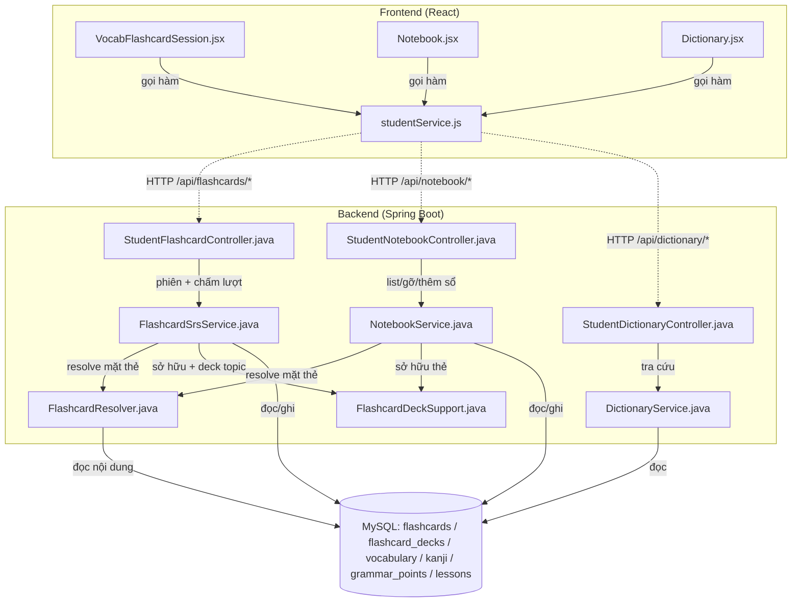
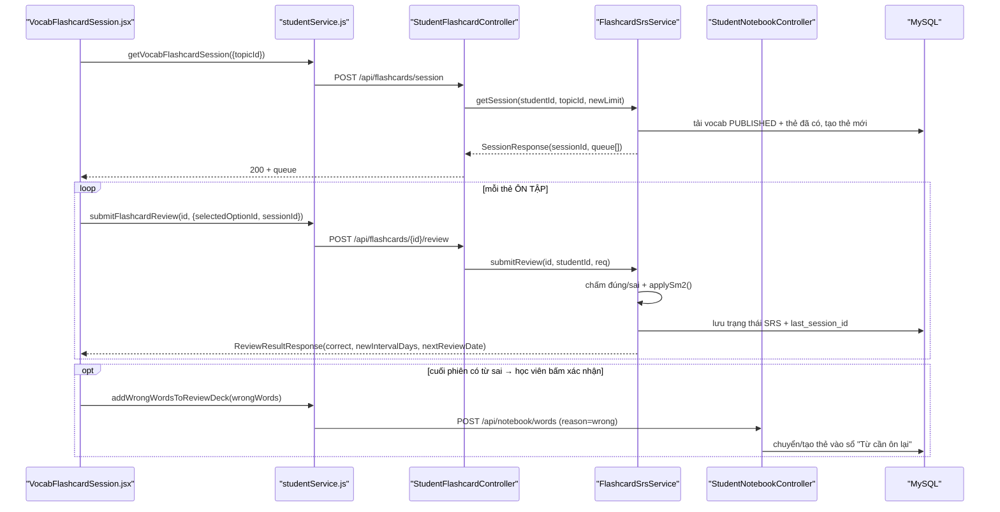
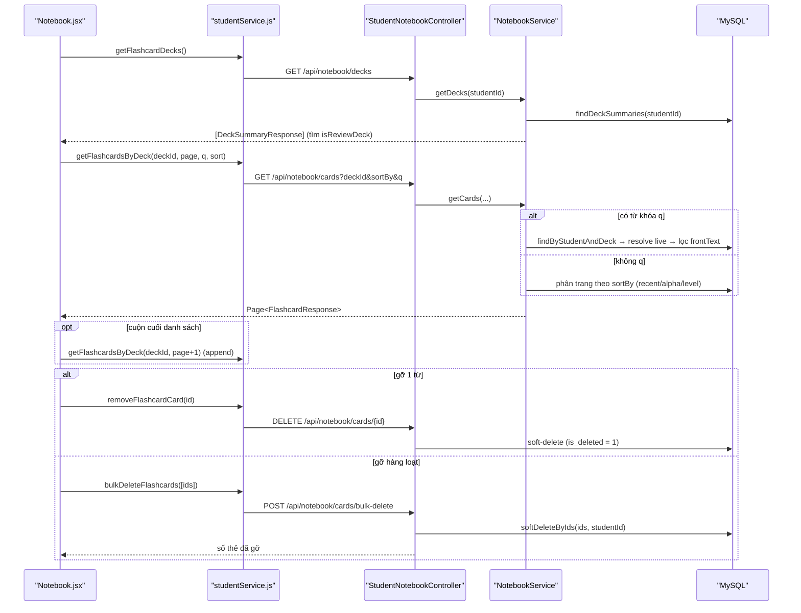
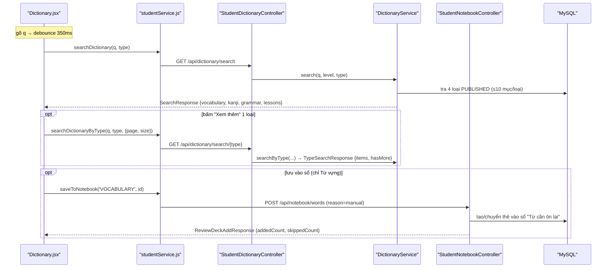

# Phân Tích Cấu Trúc – Luồng – Kết Nối Của Feature: Flashcard · Sổ Tay · Từ Điển

> Ba tính năng học từ vựng của học viên (STUDENT), dùng chung một backend package `feature.flashcard` + `feature.dictionary`.
> Tài liệu nhấn mạnh **Input / Output / Progress / Target** của từng tính năng (theo yêu cầu), lồng trong cấu trúc chuẩn 8 mục.
>
> _Cập nhật 2026-07-22: API Sổ tay tách khỏi `/api/flashcards` sang route riêng `/api/notebook/*` (controller riêng `StudentNotebookController`); logic sổ "Từ cần ôn lại" chuyển hẳn vào `NotebookService`._

## 1. Tóm tắt tổng quan

Cụm 3 tính năng phục vụ vòng đời "học – tra cứu – ghi nhớ" từ vựng của học viên:

- **Flashcard (Phiên học SRS)**: học viên vào một chủ đề (topic), backend dựng một *phiên học trộn* gồm thẻ **MỚI** (lật học nghĩa) và thẻ **ÔN TẬP** (trắc nghiệm chọn nghĩa). Mỗi lượt trả lời được chấm server-side và cập nhật lịch ôn theo thuật toán **SM-2**.
- **Sổ Tay "Từ cần ôn lại" (Notebook)**: kho gom các từ học viên cần ghi nhớ — được nạp **bán tự động** (gợi ý các từ trả lời sai cuối phiên, học viên bấm xác nhận) hoặc **thủ công** (lưu từ Từ điển). Trang chỉ liệt kê/tìm/gỡ từ, **không tự chạy phiên ôn**.
- **Từ Điển (Dictionary)**: tra cứu toàn bộ kho nội dung đã `PUBLISHED` (từ vựng / Kanji / ngữ pháp / bài học), gom nhóm theo loại, có "Xem thêm" phân trang và nút "Lưu vào Sổ tay".

- **Tầng Frontend (React 18)**: 3 page độc lập gọi API qua `studentService.js` (Axios). State cục bộ bằng `useState`/`useEffect`, không dùng Redux cho cụm này.
- **Tầng Backend (Spring Boot 3 + Java 21)**: 3 controller (`StudentFlashcardController`, `StudentNotebookController`, `StudentDictionaryController`) → Service (`FlashcardSrsService`, `NotebookService`, `DictionaryService`) → JPA Repository → Entity (`Flashcard`, `FlashcardDeck`) + nội dung tích hợp (`Vocabulary`, `Kanji`, `GrammarPoint`, `Lesson`).
- **Điểm vào (Entry point)**:
  - FE: [App.jsx](apps/frontend/src/App.jsx#L107-L112) — `/dictionary`, `/notebook`, `/vocabulary/flashcard`.
  - BE:
    - [StudentFlashcardController.java](apps/backend/src/main/java/com/jlpt/feature/flashcard/controller/StudentFlashcardController.java) — `/api/flashcards/*` (chỉ phiên ôn SRS).
    - [StudentNotebookController.java](apps/backend/src/main/java/com/jlpt/feature/flashcard/controller/StudentNotebookController.java) — `/api/notebook/*` (Sổ tay).
    - [StudentDictionaryController.java](apps/backend/src/main/java/com/jlpt/feature/dictionary/controller/StudentDictionaryController.java) — `/api/dictionary/*`.

---

## 2. Bản đồ cấu trúc (các "mảnh" và vai trò)

| File | Vai trò | Loại |
|------|---------|------|
| [VocabFlashcardSession.jsx](apps/frontend/src/pages/vocabulary/VocabFlashcardSession.jsx) | Trang phiên học Flashcard: lật thẻ MỚI, trắc nghiệm thẻ ÔN TẬP, hiển thị tiến độ + tổng kết phiên. | Page (React) |
| [Notebook.jsx](apps/frontend/src/pages/notebook/Notebook.jsx) | Trang Sổ tay "Từ cần ôn lại": liệt kê/tìm/sắp xếp, cuộn vô hạn, gỡ 1 từ hoặc gỡ hàng loạt. | Page (React) |
| [Dictionary.jsx](apps/frontend/src/pages/dictionary/Dictionary.jsx) | Trang Từ điển: ô tìm debounce, chip lọc theo loại, "Xem thêm", lịch sử tra cứu (localStorage), lưu vào sổ. | Page (React) |
| [NotebookWordCard.jsx](apps/frontend/src/components/student/NotebookWordCard.jsx) | Thẻ hiển thị một từ trong Sổ tay (chọn/gỡ). | Component |
| [studentService.js](apps/frontend/src/api/studentService.js) | Tất cả lệnh gọi HTTP của học viên (flashcard, notebook, dictionary) qua Axios; khử trùng request phiên. | API Service |
| [StudentFlashcardController.java](apps/backend/src/main/java/com/jlpt/feature/flashcard/controller/StudentFlashcardController.java) | Nhận request `/api/flashcards/*`: **chỉ** phiên học SRS + chấm lượt ôn. | Controller |
| [StudentNotebookController.java](apps/backend/src/main/java/com/jlpt/feature/flashcard/controller/StudentNotebookController.java) | Nhận request `/api/notebook/*`: list deck/thẻ, gỡ thẻ, thêm từ vào sổ (từ sai + lưu thủ công). | Controller |
| [FlashcardSrsService.java](apps/backend/src/main/java/com/jlpt/feature/flashcard/service/FlashcardSrsService.java) | Trái tim Flashcard: dựng phiên học trộn NEW+REVIEW, chấm lượt, tính lịch ôn theo **SM-2**. | Service |
| [NotebookService.java](apps/backend/src/main/java/com/jlpt/feature/flashcard/service/NotebookService.java) | CRUD sổ/thẻ (list, tìm server-side, gỡ, gỡ hàng loạt) + nạp sổ "Từ cần ôn lại" (`getOrCreateReviewDeck` nội bộ). | Service |
| [FlashcardResolver.java](apps/backend/src/main/java/com/jlpt/feature/flashcard/service/FlashcardResolver.java) | Read-model dùng chung: resolve **live** mặt thẻ (front/back/furigana/ví dụ/audio/level) theo `contentType`, tránh N+1. | Component |
| [FlashcardDeckSupport.java](apps/backend/src/main/java/com/jlpt/feature/flashcard/service/FlashcardDeckSupport.java) | Helper dùng chung SRS ↔ Sổ tay: kiểm tra sở hữu thẻ (`ownCardOrThrow`) + get-or-create deck phiên ôn theo topic (`getOrCreateDeck`). Sổ "Từ cần ôn lại" KHÔNG ở đây. | Service (helper) |
| [StudentDictionaryController.java](apps/backend/src/main/java/com/jlpt/feature/dictionary/controller/StudentDictionaryController.java) | Nhận request `/api/dictionary/search` + `/api/dictionary/search/{type}`. | Controller |
| [DictionaryService.java](apps/backend/src/main/java/com/jlpt/feature/dictionary/service/DictionaryService.java) | Tra cứu 4 loại nội dung `PUBLISHED`, gom nhóm (overview 10 mục/loại) + phân trang theo loại. | Service |
| [Flashcard.java](apps/backend/src/main/java/com/jlpt/feature/flashcard/Flashcard.java) | Entity thẻ: liên kết student + deck + nội dung (`content_type`/`content_id`) + **trạng thái SRS**. Soft-delete. | Entity |
| [FlashcardDeck.java](apps/backend/src/main/java/com/jlpt/feature/flashcard/FlashcardDeck.java) | Entity sổ (deck) first-class; `is_review_deck = true` là sổ auto "Từ cần ôn lại". Soft-delete. | Entity |
| [FlashcardRepository.java](apps/backend/src/main/java/com/jlpt/feature/flashcard/repository/FlashcardRepository.java) / [FlashcardDeckRepository.java](apps/backend/src/main/java/com/jlpt/feature/flashcard/repository/FlashcardDeckRepository.java) | Truy vấn thẻ/deck (list, due, sort, tìm theo content, soft-delete, deck summary). | Repository |

---

## 3. Bản đồ kết nối (ai gọi ai, dữ liệu truyền qua đâu)



**Bảng tra cứu kết nối chính:**

| Từ (File A) | Đến (File B) | Cách kết nối | Dữ liệu truyền |
|---|---|---|---|
| `VocabFlashcardSession.jsx` | `studentService.js` | Gọi hàm async | `{ topicId }`, `{ selectedOptionId, isLastCardInSession, sessionId }`, `[{contentType, contentId}]` |
| `Notebook.jsx` | `studentService.js` | Gọi hàm async | `deckId, page, size, q, sort`, `flashcardId`, `[ids]` |
| `Dictionary.jsx` | `studentService.js` | Gọi hàm async | `q, jlptLevel, type`, `{ page, size }`, `(contentType, contentId)` |
| `studentService.js` | `StudentFlashcardController` | HTTP POST | Query params + JSON body (`ReviewRequest`) |
| `studentService.js` | `StudentNotebookController` | HTTP GET/POST/DELETE | Query params + JSON body (`BulkDeleteRequest`, `ReviewDeckAddRequest`) |
| `studentService.js` | `StudentDictionaryController` | HTTP GET | Query params (`q`, `jlptLevel`, `type`, `page`, `size`) |
| `StudentFlashcardController` | `FlashcardSrsService` | Dependency Injection | `studentId`, `topicId`, `ReviewRequest` |
| `StudentNotebookController` | `NotebookService` | Dependency Injection | `studentId`, `deckId`, `ReviewDeckAddRequest`, `ids` |
| `FlashcardSrsService` / `NotebookService` | `FlashcardResolver` | Gọi hàm | `Collection<Flashcard>` → `ContentMaps` / `FlashcardResponse` |
| `FlashcardSrsService` | `FlashcardDeckSupport` | Gọi hàm | `flashcardId`, `studentId`, `StudentUser` → `Flashcard`, `FlashcardDeck` (deck topic) |
| `NotebookService` | `FlashcardDeckSupport` | Gọi hàm | `flashcardId`, `studentId` → `Flashcard` (chỉ `ownCardOrThrow`; deck "Từ cần ôn lại" tạo nội bộ) |
| Service | Repository | JPA method / `@Query` | Entity `Flashcard`, `FlashcardDeck`, `Vocabulary`… |

---

## 4. Luồng xử lý theo trình tự

### 4.1 Flashcard — một phiên học hoàn chỉnh

1. Học viên mở `/vocabulary/flashcard?topicId=…`. [VocabFlashcardSession.jsx:50-74](apps/frontend/src/pages/vocabulary/VocabFlashcardSession.jsx#L50-L74) gọi `getVocabFlashcardSession({ topicId })`.
2. `POST /api/flashcards/session?topicId=…` → [StudentFlashcardController.getSession()](apps/backend/src/main/java/com/jlpt/feature/flashcard/controller/StudentFlashcardController.java#L35-L43) → `flashcardSrsService.getSession(studentId, topicId, newLimit)`.
3. [FlashcardSrsService.getSessionLocked()](apps/backend/src/main/java/com/jlpt/feature/flashcard/service/FlashcardSrsService.java#L174-L264): tải các `Vocabulary` `PUBLISHED` của topic, map sang thẻ đã có; **xếp ưu tiên** chưa học → đến hạn → còn lại; tạo thẻ mới cho từ chưa có (`saveAll`); dệt hàng đợi theo lô "học 2–3 thẻ rồi kiểm tra ngay" và cấp một `sessionId` (UUID).
4. FE nhận `SessionResponse { sessionId, level, topicTitle, queue[] }`, hiển thị thẻ đầu ở **mặt trước**.
5. Thẻ MỚI: học viên chạm để lật xem nghĩa/ví dụ/audio → bấm "Tiếp theo" (không chấm điểm). Thẻ ÔN TẬP: chọn 1 trong 2 đáp án → [handleAnswer()](apps/frontend/src/pages/vocabulary/VocabFlashcardSession.jsx#L91-L110) gọi `submitFlashcardReview(flashcardId, { selectedOptionId, isLastCardInSession, sessionId })`.
6. `POST /api/flashcards/{id}/review` → [FlashcardSrsService.submitReview()](apps/backend/src/main/java/com/jlpt/feature/flashcard/service/FlashcardSrsService.java#L90-L161): **server tự** so `selectedOptionId == contentId` để quyết đúng/sai (chống client-trusted data), đóng dấu `sessionId`, gọi `applySm2()` cập nhật lịch ôn, ghi log.
7. Ở thẻ cuối (`isLastCardInSession = true`), service gom các từ **sai trong chính phiên này** theo `sessionId` → trả `suggestAddToReviewDeck = true` + `wrongWords[]`.
8. FE hiện tổng kết `đúng/quizTotal`. Nếu có từ sai, học viên **bấm** "Thêm vào Từ cần ôn lại" → `addWrongWordsToReviewDeck()` (`reason: 'wrong'`) → `POST /api/notebook/words`.



### 4.2 Sổ Tay — nạp từ, liệt kê, gỡ

1. Mở `/notebook` → [loadDeck()](apps/frontend/src/pages/notebook/Notebook.jsx#L54-L69) gọi `getFlashcardDecks()` → `GET /api/notebook/decks`; tìm deck có `isReviewDeck = true`.
2. [loadCards()](apps/frontend/src/pages/notebook/Notebook.jsx#L73-L88) gọi `getFlashcardsByDeck(deckId, page, size, q, false, sort)` → `GET /api/notebook/cards?deckId=…&sortBy=…`.
3. [NotebookService.getCards()](apps/backend/src/main/java/com/jlpt/feature/flashcard/service/NotebookService.java#L65-L118): nếu có `q` thì **resolve live rồi lọc mặt trước server-side** (không bỏ sót ngoài trang đầu); nếu không thì phân trang theo `sortBy` (`recent/alpha/level`), resolve qua `FlashcardResolver`.
4. Cuộn xuống cuối → `IntersectionObserver` gọi trang kế (append). Gỡ 1 từ → `DELETE /api/notebook/cards/{id}` (soft-delete). Gỡ nhiều → `POST /api/notebook/cards/bulk-delete` với `{ ids }`.



### 4.3 Từ Điển — tra cứu và lưu

1. Gõ vào ô tìm → debounce 350ms → [useEffect](apps/frontend/src/pages/dictionary/Dictionary.jsx#L87-L104) gọi `searchDictionary(q, undefined, activeType)` → `GET /api/dictionary/search`.
2. [DictionaryService.search()](apps/backend/src/main/java/com/jlpt/feature/dictionary/service/DictionaryService.java#L35-L74): tra tối đa **10 mục/loại** cho 4 loại `PUBLISHED`, trả `SearchResponse` gom nhóm.
3. Bấm "Xem thêm" ở một loại → `searchDictionaryByType(q, type, { page, size })` → `GET /api/dictionary/search/{type}` phân trang nối tiếp.
4. Bấm "Lưu vào sổ" (chỉ Từ vựng) → `saveToNotebook('VOCABULARY', id)` → `POST /api/notebook/words` với `reason: 'manual'`.



---

## 5. Vai trò từng đoạn code quan trọng

### 5.1 Chấm điểm server-side + gom từ sai theo phiên (Flashcard)
**File**: [FlashcardSrsService.java](apps/backend/src/main/java/com/jlpt/feature/flashcard/service/FlashcardSrsService.java) (dòng 90-161)
```java
public ReviewResultResponse submitReview(Long flashcardId, Long studentId, ReviewRequest request) {
    // Ép quyền sở hữu: thẻ phải thuộc về đúng student (ném lỗi nếu không) — không tin id từ client.
    Flashcard card = deckSupport.ownCardOrThrow(flashcardId, studentId);
    boolean isVocab = card.getContentType() == Flashcard.ContentType.VOCABULARY;

    if (isVocab && request.selectedOptionId() != null) {
        // Trắc nghiệm: SERVER tự xác định đúng/sai — optionId chính là vocabulary_id đúng.
        // Không nhận 'correct' hay 'rating' từ client (chống client-trusted data).
        correctOptionId = card.getContentId();
        correct = request.selectedOptionId().equals(card.getContentId());
        rating = correct ? Flashcard.LastRating.EASY : Flashcard.LastRating.WRONG;
    } else {
        // Thẻ lật (kanji/grammar/custom): rating bắt buộc do client gửi (EASY/HARD/WRONG).
        rating = Flashcard.LastRating.valueOf(request.rating().toUpperCase());
    }

    // Đóng dấu UUID phiên lên thẻ → cuối phiên gom ĐÚNG các từ sai của chính phiên này.
    if (request.sessionId() != null && !request.sessionId().isBlank()) card.setLastSessionId(request.sessionId());
    applySm2(card, rating);              // cập nhật trạng thái ôn (progress)
    flashcardRepository.save(card);

    // Cuối phiên: truy vấn các thẻ vocab bị sai trong cùng session_id → gợi ý thêm vào Sổ tay.
    if (request.isLastCardInSession() && card.getLastSessionId() != null) { ... }
}
```
**Giải thích**: Đây là điểm rẽ nhánh chính của tính năng Flashcard. Nó bảo đảm **đúng/sai và rating đều do backend quyết định** (không tin client), đồng thời dùng `sessionId` (thay cửa sổ thời gian 2h cũ) để gom chính xác các từ sai của phiên → phục vụ cầu nối sang Sổ tay. Lưu ý: service **chỉ gợi ý** (`suggestAddToReviewDeck` + `wrongWords`); việc ghi vào sổ do một request riêng (`/api/notebook/words`) sau khi học viên bấm xác nhận.

### 5.2 Thuật toán SM-2 — cập nhật tiến độ (progress) của thẻ
**File**: [FlashcardSrsService.java](apps/backend/src/main/java/com/jlpt/feature/flashcard/service/FlashcardSrsService.java) (dòng 274-303)
```java
void applySm2(Flashcard card, Flashcard.LastRating rating) {
    double ease = card.getEaseFactor() != null ? card.getEaseFactor().doubleValue() : EASE_DEFAULT; // mặc định 2.50
    int rep = card.getRepetitionCount() != null ? card.getRepetitionCount() : 0;

    switch (rating) {
        case WRONG -> {                       // sai: giảm ease (sàn 1.30), reset chuỗi, ôn lại sau 1 ngày
            ease = clampEase(applyEaseDelta(ease, 0));
            card.setRepetitionCount(0);
            card.setIntervalDays(1);
        }
        case HARD -> card.setIntervalDays(Math.max(1, card.getIntervalDays())); // khó: giữ ease, interval = MAX(1, cũ)
        case EASY -> {                        // dễ: tăng ease (trần 2.50) rồi giãn interval 1 → 6 → interval*ease
            ease = clampEase(applyEaseDelta(ease, 5));
            if (rep == 0) card.setIntervalDays(1);
            else if (rep == 1) card.setIntervalDays(6);
            else card.setIntervalDays((int) Math.round(card.getIntervalDays() * ease));
            card.setRepetitionCount(rep + 1);
        }
    }
    card.setEaseFactor(BigDecimal.valueOf(ease).setScale(2, RoundingMode.HALF_UP));
    card.setNextReviewDate(LocalDate.now().plusDays(card.getIntervalDays())); // lịch ôn kế tiếp
    card.setLastReviewedAt(LocalDateTime.now());
    card.setLastRating(rating);
}
```
**Giải thích**: Đây là nơi **tiến độ (progress)** của mỗi thẻ được sinh ra — `intervalDays`, `easeFactor`, `repetitionCount`, `nextReviewDate`, `lastRating`. Chính các trường này quyết định thẻ có được chọn vào phiên sau (chưa học / đến hạn / chưa đến hạn) hay không.

### 5.3 Tìm kiếm server-side không bỏ sót (Sổ tay)
**File**: [NotebookService.java](apps/backend/src/main/java/com/jlpt/feature/flashcard/service/NotebookService.java) (dòng 75-90)
```java
if (needle != null && !needle.isEmpty()) {
    // Lấy TẤT CẢ thẻ (theo deck hoặc toàn bộ student), resolve live rồi mới lọc theo mặt trước —
    // không bị giới hạn bởi paging DB nên không bỏ sót thẻ nằm ngoài trang đầu.
    List<Flashcard> all = deckId != null
            ? flashcardRepository.findByStudentAndDeck(studentId, deckId)
            : flashcardRepository.findByStudent(studentId);
    ContentMaps maps = resolver.loadContentMaps(all);       // nạp nội dung 1 lần → tránh N+1
    List<FlashcardResponse> matched = all.stream()
            .map(c -> resolver.toFlashcardResponse(c, maps))
            .filter(r -> r.frontText() != null && r.frontText().toLowerCase().contains(needle))
            .sorted(responseComparator(sortKey))
            .toList();
    // Phân trang thủ công trên tập đã lọc.
    return new PageImpl<>(matched.subList(from, to), pageable, matched.size());
}
```
**Giải thích**: Vì mặt thẻ được **resolve live** từ nội dung gốc (không lưu cứng trong bảng `flashcards`), tìm kiếm phải resolve trước rồi lọc — nếu lọc ở SQL sẽ không thấy `frontText`. Đây là lý do tìm kiếm chạy in-memory sau khi nạp nội dung theo lô.

### 5.4 Nạp/chuyển thẻ vào sổ "Từ cần ôn lại" (cầu nối 3 tính năng)
**File**: [NotebookService.java](apps/backend/src/main/java/com/jlpt/feature/flashcard/service/NotebookService.java) (dòng 137-179)
```java
public ReviewDeckAddResponse addWrongWordsToReviewDeck(Long studentId, ReviewDeckAddRequest request) {
    FlashcardDeck deck = getOrCreateReviewDeck(student);                       // sổ auto per-student (helper riêng của Sổ tay)
    String reason = ... ? request.reason() : "manual";                        // 'wrong' | 'manual'
    for (ReviewDeckAddRequest.Item item : request.items()) {
        Optional<Flashcard> existing = flashcardRepository.findByStudentAndContent(studentId, VOCABULARY, contentId);
        if (existing.isPresent()) {
            // Mỗi nội dung chỉ 1 thẻ: nếu đã học ở sổ khác → CHUYỂN sang sổ "Từ cần ôn lại";
            // chỉ bỏ qua khi thẻ đã nằm sẵn trong sổ này (tránh lưu thủ công bị "im lặng").
            if (card.getDeck() != null && deck.getId().equals(card.getDeck().getId())) skipped++;
            else { card.setDeck(deck); card.setAddedReason(reason); flashcardRepository.save(card); added++; }
        } else { /* tạo thẻ mới trỏ vào vocabulary_id */ added++; }
    }
    return new ReviewDeckAddResponse(deck.getId(), deck.getName(), added, skipped);
}
```
**Giải thích**: Cùng một endpoint (`POST /api/notebook/words`) phục vụ cả hai nguồn — từ sai của Flashcard (`reason=wrong`) và lưu thủ công ở Từ điển (`reason=manual`). Đây là **điểm hợp lưu** của cả cụm 3 tính năng. `getOrCreateReviewDeck` là method **riêng** của `NotebookService` (không nằm ở `FlashcardDeckSupport`) vì sổ "Từ cần ôn lại" chỉ thuộc domain Sổ tay.

---

## 6. Dữ liệu di chuyển như thế nào

Theo dõi **một từ vựng** xuyên suốt cụm:

1. **Nội dung gốc** nằm ở bảng `vocabulary` (`word`, `furigana`, `meaning`, `example_*`, `audio_url`, `jlpt_level`, `topic_id`, `status`).
2. **Tra cứu (Từ điển)**: `DictionaryService` map `Vocabulary` → `SearchResponse.VocabItem` (đổi tên field: `example_sentence_jp` → `exampleJp`…) → JSON → hiển thị.
3. **Lưu vào sổ**: FE gửi `{ contentType: 'VOCABULARY', contentId: <vocabulary_id> }`. Backend **không copy nội dung** — chỉ tạo/chuyển một dòng `flashcards` trỏ tới `content_id` + gán `deck_id` của sổ "Từ cần ôn lại", `added_reason`.
4. **Học Flashcard**: khi dựng phiên, backend đọc lại `Vocabulary` theo `content_id`, sinh mặt trước (`word`+`furigana`) và mặt sau/đáp án (`meaning`), cùng distractor từ vocab khác.
5. **Ghi tiến độ**: mỗi lượt chấm cập nhật **các cột SRS trên chính dòng `flashcards`** (`interval_days`, `ease_factor`, `repetition_count`, `next_review_date`, `last_reviewed_at`, `last_rating`, `last_session_id`) — nội dung gốc không đổi.
6. **Hiển thị lại ở Sổ tay**: `FlashcardResolver` **resolve live** từ `content_id` → nếu vocab bị gỡ/không `PUBLISHED` thì thẻ trả `frontText = null` và bị ẩn (FR-FC-34). Nghĩa là **mặt thẻ luôn phản ánh nội dung mới nhất**, không bị cũ.

> Điểm mấu chốt: bảng `flashcards` lưu **con trỏ + trạng thái học**, không lưu bản sao nội dung → một nguồn sự thật duy nhất. Sổ tay và phiên ôn dùng chung dòng `flashcards` này: cùng một từ vừa nằm trong sổ (deck `is_review_deck`), vừa được ôn qua phiên topic (tra theo `(student, content)` bất kể deck).

---

## 7. Input / Output / Progress / Target theo từng tính năng

### 7.1 FLASHCARD (Phiên học SRS)

| Khía cạnh | Chi tiết |
|---|---|
| **Input** | `topicId` (bắt buộc), `newLimit?` khi tạo phiên. Mỗi lượt ôn: `selectedOptionId` (vocab) **hoặc** `rating` = easy/hard/wrong (kanji/grammar/custom), `isLastCardInSession`, `sessionId`. |
| **Output** | `SessionResponse { sessionId, deckId, level, topicTitle, wordCount, queue[] }`; mỗi `QueueItem { flashcardId, stage(NEW/REVIEW), front{word,furigana}, learn{meaning,exampleJp,exampleVi,audioUrl}, quiz{options[]} }`. Mỗi lượt: `ReviewResultResponse { correct, correctOptionId, correctMeaning, rating, newIntervalDays, newEaseFactor, nextReviewDate, repetitionCount, suggestAddToReviewDeck, wrongWords[] }`. |
| **Progress** | Trạng thái SRS trên từng thẻ: `intervalDays`, `easeFactor` (1.30–2.50), `repetitionCount`, `nextReviewDate`, `lastReviewedAt`, `lastRating`. FE hiển thị thanh tiến độ `idx/total` và điểm cuối phiên `đúng/quizTotal`. |
| **Target** | Giúp học viên **ghi nhớ dài hạn** theo giãn cách: mỗi từ được học rồi kiểm tra lại ngay trong phiên; SM-2 quyết định ngày ôn kế. Trần an toàn: tối đa `MAX_NEW = 20` từ/phiên, mặc định `NEW_CARDS_PER_DAY = 10`. |

### 7.2 SỔ TAY "Từ cần ôn lại" (Notebook)

| Khía cạnh | Chi tiết |
|---|---|
| **Input** | Tra deck: (không tham số). List thẻ: `deckId, page, size, q?, dueOnly, sortBy(recent/alpha/level)`. Gỡ: `flashcardId` (đơn) hoặc `{ ids: [] }` (hàng loạt). Nạp: `{ items:[{contentType:'VOCABULARY', contentId}], reason:'wrong'|'manual' }`. |
| **Output** | `DeckSummaryResponse { deckId, deckName, totalCards, isReviewDeck }`; `Page<FlashcardResponse>` (mỗi thẻ: `flashcardId, frontText, meaning, furigana, audioUrl, jlptLevel, nextReviewDate, intervalDays, repetitionCount, lastRating, addedReason, isDue`); số thẻ đã gỡ; `ReviewDeckAddResponse { deckId, name, addedCount, skippedCount }`. |
| **Progress** | Bản thân sổ **không chạy phiên ôn**; nó phản chiếu trạng thái SRS của thẻ (`isDue`, `nextReviewDate`, `intervalDays`) và tổng số từ (`totalCards`). Việc ôn thực tế diễn ra ở phiên Flashcard theo topic. |
| **Target** | Là **kho ghi chú tập trung** các từ cần chú ý (trả lời sai + lưu thủ công), cho phép tìm/sắp xếp/gỡ để học viên chủ động quản lý danh sách từ yếu. Mỗi nội dung chỉ tồn tại **một** thẻ (idempotent). |

### 7.3 TỪ ĐIỂN (Dictionary)

| Khía cạnh | Chi tiết |
|---|---|
| **Input** | Tìm tổng hợp: `q` (bắt buộc), `jlptLevel?`, `type?` (VOCABULARY/KANJI/GRAMMAR/LESSON). "Xem thêm" theo loại: `q, type, page(≥0), size(1–100, capped 50)`. |
| **Output** | `SearchResponse { keyword, vocabulary[], kanji[], grammar[], lessons[] }` (mỗi loại tối đa 10 mục overview); `TypeSearchResponse { type, items[], hasMore }` khi phân trang. |
| **Progress** | Không có trạng thái học phía server. FE tự lưu **lịch sử tra cứu** (tối đa 8) trong `localStorage` (`sakuji.dict.history`) — thuần client. |
| **Target** | **Tra cứu nhanh** toàn kho nội dung đã `PUBLISHED`, lọc theo loại/cấp độ; là cửa ngõ đưa từ vào Sổ tay (nút "Lưu vào sổ", chỉ với từ vựng). |

---

## 8. Bảng tra cứu tổng hợp (endpoint)

| Tính năng | Method + Path | FE function | Service |  Input | Output |
|---|---|---|---|---|---|
| Flashcard | `POST /api/flashcards/session` | `getVocabFlashcardSession` | `FlashcardSrsService.getSession` | `topicId, newLimit?` | `SessionResponse` |
| Flashcard | `POST /api/flashcards/{id}/review` | `submitFlashcardReview` | `FlashcardSrsService.submitReview` | `ReviewRequest` | `ReviewResultResponse` |
| Sổ tay | `GET /api/notebook/decks` | `getFlashcardDecks` | `NotebookService.getDecks` | — | `List<DeckSummaryResponse>` |
| Sổ tay | `GET /api/notebook/cards` | `getFlashcardsByDeck` | `NotebookService.getCards` | `deckId, page, size, q, dueOnly, sortBy` | `Page<FlashcardResponse>` |
| Sổ tay | `DELETE /api/notebook/cards/{id}` | `removeFlashcardCard` | `NotebookService.deleteCard` | `flashcardId` | `Void` (soft-delete) |
| Sổ tay | `POST /api/notebook/cards/bulk-delete` | `bulkDeleteFlashcards` | `NotebookService.bulkDelete` | `{ ids[] }` | `int` (số đã gỡ) |
| Cầu nối | `POST /api/notebook/words` | `addWrongWordsToReviewDeck` / `saveToNotebook` | `NotebookService.addWrongWordsToReviewDeck` | `ReviewDeckAddRequest` | `ReviewDeckAddResponse` |
| Từ điển | `GET /api/dictionary/search` | `searchDictionary` | `DictionaryService.search` | `q, jlptLevel?, type?` | `SearchResponse` |
| Từ điển | `GET /api/dictionary/search/{type}` | `searchDictionaryByType` | `DictionaryService.searchByType` | `q, jlptLevel?, page, size` | `TypeSearchResponse` |

> Toàn bộ endpoint yêu cầu `hasRole('STUDENT')` (`@PreAuthorize` cấp lớp controller). Route `/api/notebook/**` được bảo vệ bởi `anyRequest().authenticated()` trong `SecurityConfig` (không cần khai báo riêng).

---

## 9. Các mục cần bổ sung context (nếu có)

- **Tách controller (2026-07-22)**: endpoint Sổ tay đã rời `/api/flashcards` sang `StudentNotebookController` (`/api/notebook/*`) để đường dẫn phản ánh đúng domain — `/api/flashcards/*` giờ **chỉ** là phiên ôn SRS. Không đổi hành vi, chỉ đổi path (FE `studentService.js` cập nhật đồng bộ).
- **`FlashcardDeckSupport.java`**: helper dùng chung SRS ↔ Sổ tay, chỉ còn `ownCardOrThrow` (sở hữu thẻ) + `getOrCreateDeck` (deck phiên ôn theo topic). `getOrCreateDeck` chỉ lưu `name` (đã gỡ đoạn parse `jlpt_level/topic` vì không nơi nào đọc). Sổ "Từ cần ôn lại" (`getOrCreateReviewDeck`) nằm ở `NotebookService`.
- **Repository chi tiết**: các truy vấn (`findWrongVocabCardsInSession`, `findByDeckOrderByWord`, `findDeckSummaries`, `softDeleteByIds`…) được suy vai trò từ chỗ gọi ở Service; JPQL cụ thể chưa trích trong tài liệu này.
- **Kiểm soát cấp độ/subscription (LESSON-003)**: phiên Flashcard chỉ kiểm tra topic `PUBLISHED`; ràng buộc "role + subscription/level" (nếu áp dụng cho nội dung VIP) không thấy trong các file đã đọc — cần xác nhận ở tầng Security/Course nếu có.
- **Component con Từ điển** (`DictResultGroup`, `DictDetailPanel`, `DictGrammarPanel`): chỉ khảo sát trang cha `Dictionary.jsx`; các component này được suy vai trò từ props truyền vào.
