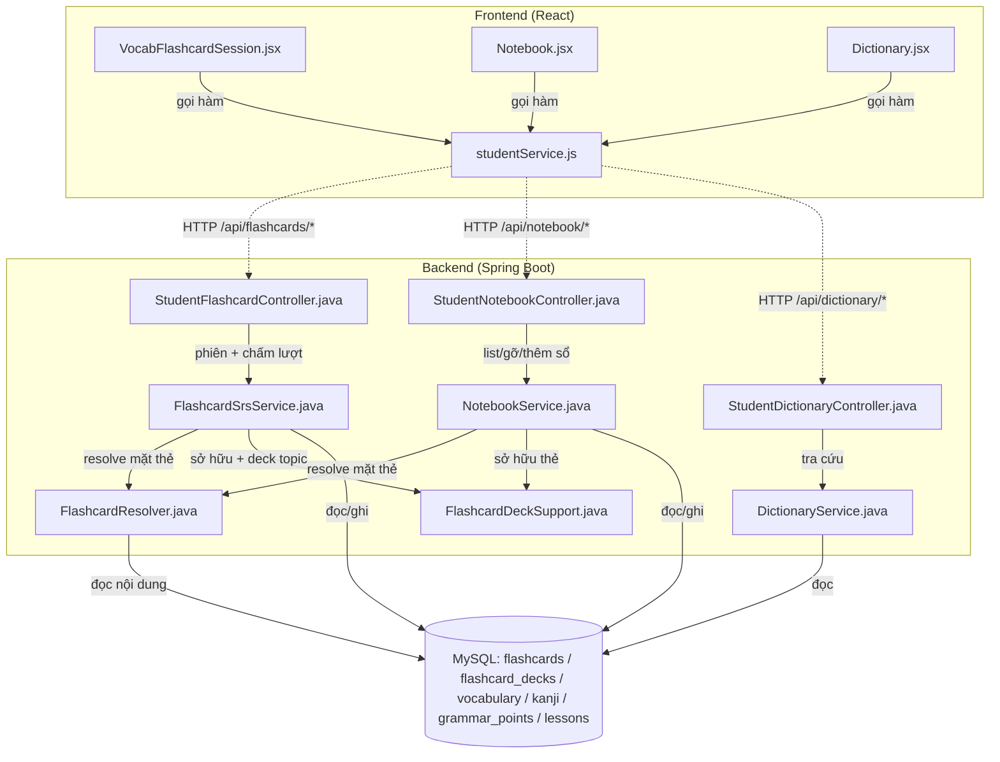
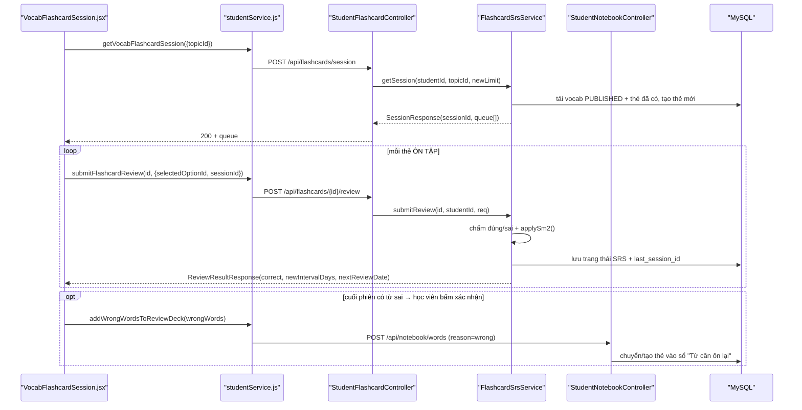
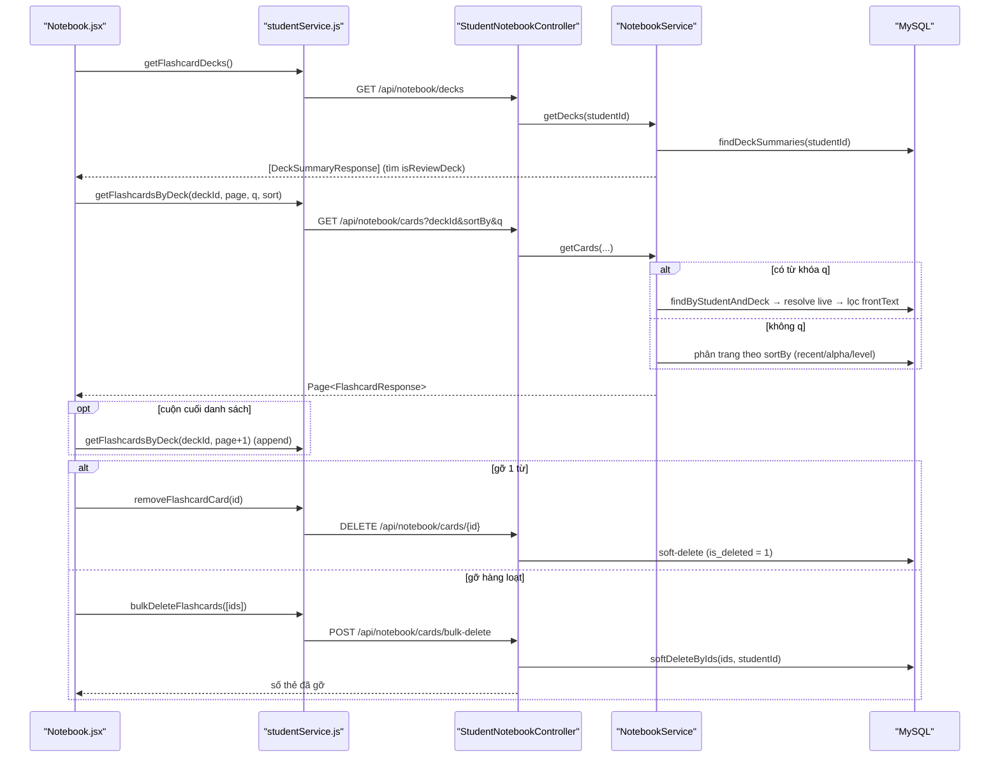
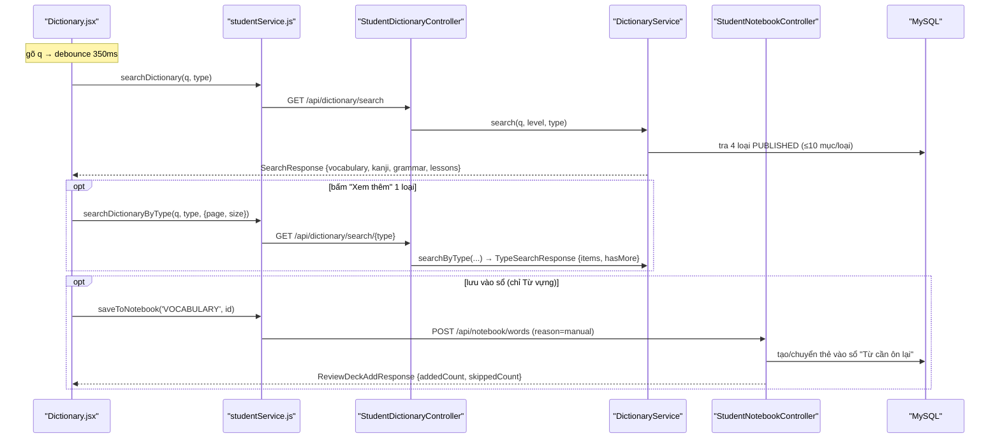

# Phân Tích Cấu Trúc – Luồng – Kết Nối Của Feature: Flashcard · Sổ Tay · Từ Điển

> Ba tính năng học từ vựng của học viên (STUDENT), dùng chung một backend package `feature.flashcard` + `feature.dictionary`.
> Tài liệu nhấn mạnh **Input / Output / Progress / Target** của từng tính năng (theo yêu cầu), lồng trong cấu trúc chuẩn 8 mục.
>
> _Cập nhật 2026-07-22: API Sổ tay tách khỏi `/api/flashcards` sang route riêng `/api/notebook/*` (controller riêng `StudentNotebookController`); logic sổ "Từ cần ôn lại" chuyển hẳn vào `NotebookService`._
>
> _Cập nhật 2026-07-26: FE đã tái cấu trúc sang Feature-Based Architecture (commit `9915c443`) — `src/pages/*` → `src/features/<feature>/…`, `src/api/*` → `src/shared/api/*`, component dùng chung → `src/shared/components/*`, component con của trang student → `src/features/dashboard/student/*`; import dùng alias `@/`. Backend **không đổi** (package, controller, endpoint giữ nguyên)._

## 0. Ghi nhớ nhanh (cheat-sheet)

**Câu thần chú cả cụm**: *"Từ điển tra — Sổ tay giữ — Flashcard ôn. Cả ba dùng chung MỘT dòng `flashcards`."*

**Chia vai trong 1 dòng mỗi tính năng**

| Tính năng | Làm gì | KHÔNG làm gì | Ghi DB? |
|---|---|---|---|
| **Từ điển** | Tra 4 loại nội dung `PUBLISHED` | Không lưu trạng thái học, không có lịch sử server-side | ❌ (trừ nút "Lưu vào sổ") |
| **Sổ tay** | Liệt kê / tìm / sắp xếp / gỡ từ cần nhớ | **Không chạy phiên ôn** | ✅ thêm / gỡ thẻ |
| **Flashcard** | Dựng phiên NEW+REVIEW, chấm, chạy SM-2 | Không tự thêm từ vào sổ (chỉ **gợi ý**) | ✅ trạng thái SRS |

**8 điều dễ quên nhất**

| # | Điều cần nhớ | Vì sao dễ sai |
|---|---|---|
| 1 | Bảng `flashcards` lưu **con trỏ** (`content_type` + `content_id`) + trạng thái học, **không lưu chữ** | Mặt thẻ resolve **live** mỗi lần đọc → nội dung sửa ở đâu, thẻ đổi theo ở đó |
| 2 | **Một nội dung — một thẻ.** Đã có ở sổ khác thì **chuyển**, không nhân bản | Cùng dòng đó vừa nằm trong Sổ tay, vừa được ôn qua phiên topic |
| 3 | **`POST /api/notebook/words` là điểm hợp lưu duy nhất** của cả 3 tính năng | Phân biệt nguồn bằng `reason`: `'wrong'` (từ phiên ôn) vs `'manual'` (từ Từ điển) |
| 4 | Backend **chỉ gợi ý** từ sai (`suggestAddToReviewDeck`), học viên phải **bấm xác nhận** | Việc ghi vào sổ là một request riêng, không xảy ra tự động cuối phiên |
| 5 | Đúng/sai do **server** quyết (so `selectedOptionId` với `content_id`) | Không bao giờ tin `correct`/`rating` từ client với thẻ vocab |
| 6 | Sổ tay dùng param **`sortBy`**, không phải `sort` | `sort` là của `Pageable` → sinh `ORDER BY` thứ hai → **500** |
| 7 | Mở phiên dùng **POST**, không phải GET | Vì có side-effect: tạo deck + INSERT thẻ mới |
| 8 | **Cả 3 tính năng đều là "vệ tinh" của bảng `vocabulary`** — không tính năng nào sở hữu nội dung | `topicId`, `contentId`, `optionId` đều quy về `vocabulary_id`/`topic_id` của feature Từ Vựng — xem [§10](#10-liên-quan-từ-vựng-vocabulary--nền-móng-của-cả-cụm) |

**Vòng đời một từ (nhớ theo hình tròn)**

```
Từ điển (tra)  ──"Lưu vào sổ" (manual)──┐
                                        ├──▶  sổ "Từ cần ôn lại"  ──▶  phiên Flashcard theo topic
Phiên Flashcard ──từ sai (wrong)────────┘         (deck is_review_deck)      │
        ▲                                                                    │
        └──────────────── SM-2 cập nhật nextReviewDate ──────────────────────┘
```

---

## 1. Tóm tắt tổng quan

Cụm 3 tính năng phục vụ vòng đời "học – tra cứu – ghi nhớ" từ vựng của học viên:

- **Flashcard (Phiên học SRS)**: học viên vào một chủ đề (topic), backend dựng một *phiên học trộn* gồm thẻ **MỚI** (lật học nghĩa) và thẻ **ÔN TẬP** (trắc nghiệm chọn nghĩa). Mỗi lượt trả lời được chấm server-side và cập nhật lịch ôn theo thuật toán **SM-2**.
- **Sổ Tay "Từ cần ôn lại" (Notebook)**: kho gom các từ học viên cần ghi nhớ — được nạp **bán tự động** (gợi ý các từ trả lời sai cuối phiên, học viên bấm xác nhận) hoặc **thủ công** (lưu từ Từ điển). Trang chỉ liệt kê/tìm/gỡ từ, **không tự chạy phiên ôn**.
- **Từ Điển (Dictionary)**: tra cứu toàn bộ kho nội dung đã `PUBLISHED` (từ vựng / Kanji / ngữ pháp / bài học), gom nhóm theo loại, có "Xem thêm" phân trang và nút "Lưu vào Sổ tay".

- **Tầng Frontend (React 18)**: 3 page độc lập gọi API qua `studentService.js` (Axios). State cục bộ bằng `useState`/`useEffect`, không dùng Redux cho cụm này.
- **Tầng Backend (Spring Boot 3 + Java 21)**: 3 controller (`StudentFlashcardController`, `StudentNotebookController`, `StudentDictionaryController`) → Service (`FlashcardSrsService`, `NotebookService`, `DictionaryService`) → JPA Repository → Entity (`Flashcard`, `FlashcardDeck`) + nội dung tích hợp (`Vocabulary`, `Kanji`, `GrammarPoint`, `Lesson`).
- **Điểm vào (Entry point)**:
  - FE: [App.jsx](apps/frontend/src/App.jsx#L106-L110) — `/dictionary`, `/notebook`, `/vocabulary/flashcard`.
  - BE:
    - [StudentFlashcardController.java](apps/backend/src/main/java/com/jlpt/feature/flashcard/controller/StudentFlashcardController.java) — `/api/flashcards/*` (chỉ phiên ôn SRS).
    - [StudentNotebookController.java](apps/backend/src/main/java/com/jlpt/feature/flashcard/controller/StudentNotebookController.java) — `/api/notebook/*` (Sổ tay).
    - [StudentDictionaryController.java](apps/backend/src/main/java/com/jlpt/feature/dictionary/controller/StudentDictionaryController.java) — `/api/dictionary/*`.

---

## 2. Bản đồ cấu trúc (các "mảnh" và vai trò)

| File | Vai trò | Loại |
|------|---------|------|
| [VocabFlashcardSession.jsx](apps/frontend/src/features/vocabulary/vocabulary/VocabFlashcardSession.jsx) | Trang phiên học Flashcard: lật thẻ MỚI, trắc nghiệm thẻ ÔN TẬP, hiển thị tiến độ + tổng kết phiên. | Page (React) |
| [Notebook.jsx](apps/frontend/src/features/notebook/notebook/Notebook.jsx) | Trang Sổ tay "Từ cần ôn lại": liệt kê/tìm/sắp xếp, cuộn vô hạn, gỡ 1 từ hoặc gỡ hàng loạt. | Page (React) |
| [Dictionary.jsx](apps/frontend/src/features/dictionary/dictionary/Dictionary.jsx) | Trang Từ điển: ô tìm debounce, chip lọc theo loại, "Xem thêm", lịch sử tra cứu (localStorage), lưu vào sổ. | Page (React) |
| [NotebookWordCard.jsx](apps/frontend/src/features/dashboard/student/NotebookWordCard.jsx) | Thẻ hiển thị một từ trong Sổ tay (chọn/gỡ). | Component |
| [studentService.js](apps/frontend/src/shared/api/studentService.js) | Tất cả lệnh gọi HTTP của học viên (flashcard, notebook, dictionary) qua Axios; khử trùng request phiên. | API Service |
| [StudentFlashcardController.java](apps/backend/src/main/java/com/jlpt/feature/flashcard/controller/StudentFlashcardController.java) | Nhận request `/api/flashcards/*`: **chỉ** phiên học SRS + chấm lượt ôn. | Controller |
| [StudentNotebookController.java](apps/backend/src/main/java/com/jlpt/feature/flashcard/controller/StudentNotebookController.java) | Nhận request `/api/notebook/*`: list deck/thẻ, gỡ thẻ, thêm từ vào sổ (từ sai + lưu thủ công). | Controller |
| [FlashcardSrsService.java](apps/backend/src/main/java/com/jlpt/feature/flashcard/service/FlashcardSrsService.java) | Trái tim Flashcard: dựng phiên học trộn NEW+REVIEW, chấm lượt, tính lịch ôn theo **SM-2**. | Service |
| [NotebookService.java](apps/backend/src/main/java/com/jlpt/feature/flashcard/service/NotebookService.java) | CRUD sổ/thẻ (list, tìm server-side, gỡ, gỡ hàng loạt) + nạp sổ "Từ cần ôn lại" (`getOrCreateReviewDeck` nội bộ). | Service |
| [FlashcardResolver.java](apps/backend/src/main/java/com/jlpt/feature/flashcard/service/FlashcardResolver.java) | Read-model dùng chung: resolve **live** mặt thẻ (front/back/furigana/ví dụ/audio/level) theo `contentType`, tránh N+1. | Component |
| [FlashcardDeckSupport.java](apps/backend/src/main/java/com/jlpt/feature/flashcard/service/FlashcardDeckSupport.java) | Helper dùng chung SRS ↔ Sổ tay: kiểm tra sở hữu thẻ (`ownCardOrThrow`) + get-or-create deck phiên ôn theo topic (`getOrCreateDeck`). Sổ "Từ cần ôn lại" KHÔNG ở đây. | Service (helper) |
| [StudentDictionaryController.java](apps/backend/src/main/java/com/jlpt/feature/dictionary/controller/StudentDictionaryController.java) | Nhận request `/api/dictionary/search` + `/api/dictionary/search/{type}`. | Controller |
| [DictionaryService.java](apps/backend/src/main/java/com/jlpt/feature/dictionary/service/DictionaryService.java) | Tra cứu 4 loại nội dung `PUBLISHED`, gom nhóm (overview 10 mục/loại) + phân trang theo loại. | Service |
| [Flashcard.java](apps/backend/src/main/java/com/jlpt/feature/flashcard/Flashcard.java) | Entity thẻ: liên kết student + deck + nội dung (`content_type`/`content_id`) + **trạng thái SRS**. Soft-delete. | Entity |
| [FlashcardDeck.java](apps/backend/src/main/java/com/jlpt/feature/flashcard/FlashcardDeck.java) | Entity sổ (deck) first-class; `is_review_deck = true` là sổ auto "Từ cần ôn lại". Soft-delete. | Entity |
| [FlashcardRepository.java](apps/backend/src/main/java/com/jlpt/feature/flashcard/repository/FlashcardRepository.java) / [FlashcardDeckRepository.java](apps/backend/src/main/java/com/jlpt/feature/flashcard/repository/FlashcardDeckRepository.java) | Truy vấn thẻ/deck (list, due, sort, tìm theo content, soft-delete, deck summary). | Repository |

---

## 3. Bản đồ kết nối (ai gọi ai, dữ liệu truyền qua đâu)


```mermaid
graph TD
    subgraph FE["Frontend (React)"]
        VFS["VocabFlashcardSession.jsx"]
        NTB["Notebook.jsx"]
        DCT["Dictionary.jsx"]
        SVC["studentService.js"]
    end

    subgraph BE["Backend (Spring Boot)"]
        FCC["StudentFlashcardController.java"]
        NBC["StudentNotebookController.java"]
        DCC["StudentDictionaryController.java"]
        SRS["FlashcardSrsService.java"]
        NBS["NotebookService.java"]
        DCS["DictionaryService.java"]
        RES["FlashcardResolver.java"]
        SUP["FlashcardDeckSupport.java"]
    end

    DB[("MySQL: flashcards / flashcard_decks / vocabulary / kanji / grammar_points / lessons")]

    VFS -->|gọi hàm| SVC
    NTB -->|gọi hàm| SVC
    DCT -->|gọi hàm| SVC

    SVC -.->|HTTP /api/flashcards/*| FCC
    SVC -.->|HTTP /api/notebook/*| NBC
    SVC -.->|HTTP /api/dictionary/*| DCC

    FCC -->|phiên + chấm lượt| SRS
    NBC -->|list/gỡ/thêm sổ| NBS
    DCC -->|tra cứu| DCS

    SRS -->|resolve mặt thẻ| RES
    NBS -->|resolve mặt thẻ| RES
    SRS -->|sở hữu + deck topic| SUP
    NBS -->|sở hữu thẻ| SUP

    SRS -->|đọc/ghi| DB
    NBS -->|đọc/ghi| DB
    DCS -->|đọc| DB
    RES -->|đọc nội dung| DB
```

**Bảng tra cứu kết nối chính:**

| Từ (File A) | Đến (File B) | Cách kết nối | Dữ liệu truyền |
|---|---|---|---|
| `VocabFlashcardSession.jsx` | `studentService.js` | Gọi hàm async | `{ topicId }`, `{ selectedOptionId, isLastCardInSession, sessionId }`, `[{contentType, contentId}]` |
| `Notebook.jsx` | `studentService.js` | Gọi hàm async | `deckId, page, size, q, sort`, `flashcardId`, `[ids]` |
| `Dictionary.jsx` | `studentService.js` | Gọi hàm async | `q, jlptLevel, type`, `{ page, size }`, `(contentType, contentId)` |
| `studentService.js` | `StudentFlashcardController` | HTTP POST | Query params + JSON body (`ReviewRequest`) |
| `studentService.js` | `StudentNotebookController` | HTTP GET/POST/DELETE | Query params + JSON body (`BulkDeleteRequest`, `ReviewDeckAddRequest`) |
| `studentService.js` | `StudentDictionaryController` | HTTP GET | Query params (`q`, `jlptLevel`, `type`, `page`, `size`) |
| `StudentFlashcardController` | `FlashcardSrsService` | Dependency Injection | `studentId`, `topicId`, `ReviewRequest` |
| `StudentNotebookController` | `NotebookService` | Dependency Injection | `studentId`, `deckId`, `ReviewDeckAddRequest`, `ids` |
| `FlashcardSrsService` / `NotebookService` | `FlashcardResolver` | Gọi hàm | `Collection<Flashcard>` → `ContentMaps` / `FlashcardResponse` |
| `FlashcardSrsService` | `FlashcardDeckSupport` | Gọi hàm | `flashcardId`, `studentId`, `StudentUser` → `Flashcard`, `FlashcardDeck` (deck topic) |
| `NotebookService` | `FlashcardDeckSupport` | Gọi hàm | `flashcardId`, `studentId` → `Flashcard` (chỉ `ownCardOrThrow`; deck "Từ cần ôn lại" tạo nội bộ) |
| Service | Repository | JPA method / `@Query` | Entity `Flashcard`, `FlashcardDeck`, `Vocabulary`… |

---

## 4. Luồng xử lý theo trình tự

### 4.1 Flashcard — một phiên học hoàn chỉnh

1. Học viên mở `/vocabulary/flashcard?topicId=…`. [VocabFlashcardSession.jsx:50-74](apps/frontend/src/features/vocabulary/vocabulary/VocabFlashcardSession.jsx#L50-L74) gọi `getVocabFlashcardSession({ topicId })`.
2. `POST /api/flashcards/session?topicId=…` → [StudentFlashcardController.getSession()](apps/backend/src/main/java/com/jlpt/feature/flashcard/controller/StudentFlashcardController.java#L34-L42) → `flashcardSrsService.getSession(studentId, topicId, newLimit)`.
3. [FlashcardSrsService.getSessionLocked()](apps/backend/src/main/java/com/jlpt/feature/flashcard/service/FlashcardSrsService.java#L174-L264): tải các `Vocabulary` `PUBLISHED` của topic, map sang thẻ đã có; **xếp ưu tiên** chưa học → đến hạn → còn lại; tạo thẻ mới cho từ chưa có (`saveAll`); dệt hàng đợi theo lô "học 2–3 thẻ rồi kiểm tra ngay" và cấp một `sessionId` (UUID).
4. FE nhận `SessionResponse { sessionId, level, topicTitle, queue[] }`, hiển thị thẻ đầu ở **mặt trước**.
5. Thẻ MỚI: học viên chạm để lật xem nghĩa/ví dụ/audio → bấm "Tiếp theo" (không chấm điểm). Thẻ ÔN TẬP: chọn 1 trong 2 đáp án → [handleAnswer()](apps/frontend/src/features/vocabulary/vocabulary/VocabFlashcardSession.jsx#L91-L110) gọi `submitFlashcardReview(flashcardId, { selectedOptionId, isLastCardInSession, sessionId })`.
6. `POST /api/flashcards/{id}/review` → [FlashcardSrsService.submitReview()](apps/backend/src/main/java/com/jlpt/feature/flashcard/service/FlashcardSrsService.java#L90-L161): **server tự** so `selectedOptionId == contentId` để quyết đúng/sai (chống client-trusted data), đóng dấu `sessionId`, gọi `applySm2()` cập nhật lịch ôn, ghi log.
7. Ở thẻ cuối (`isLastCardInSession = true`), service gom các từ **sai trong chính phiên này** theo `sessionId` → trả `suggestAddToReviewDeck = true` + `wrongWords[]`.
8. FE hiện tổng kết `đúng/quizTotal`. Nếu có từ sai, học viên **bấm** "Thêm vào Từ cần ôn lại" → `addWrongWordsToReviewDeck()` (`reason: 'wrong'`) → `POST /api/notebook/words`.


```mermaid
sequenceDiagram
    participant UI as "VocabFlashcardSession.jsx"
    participant API as "studentService.js"
    participant Ctrl as "StudentFlashcardController"
    participant Srs as "FlashcardSrsService"
    participant Nbc as "StudentNotebookController"
    participant DB as "MySQL"

    UI->>API: getVocabFlashcardSession({topicId})
    API->>Ctrl: POST /api/flashcards/session
    Ctrl->>Srs: getSession(studentId, topicId, newLimit)
    Srs->>DB: tải vocab PUBLISHED + thẻ đã có, tạo thẻ mới
    Srs-->>Ctrl: SessionResponse(sessionId, queue[])
    Ctrl-->>UI: 200 + queue

    loop mỗi thẻ ÔN TẬP
        UI->>API: submitFlashcardReview(id, {selectedOptionId, sessionId})
        API->>Ctrl: POST /api/flashcards/{id}/review
        Ctrl->>Srs: submitReview(id, studentId, req)
        Srs->>Srs: chấm đúng/sai + applySm2()
        Srs->>DB: lưu trạng thái SRS + last_session_id
        Srs-->>UI: ReviewResultResponse(correct, newIntervalDays, nextReviewDate)
    end

    opt cuối phiên có từ sai → học viên bấm xác nhận
        UI->>API: addWrongWordsToReviewDeck(wrongWords)
        API->>Nbc: POST /api/notebook/words (reason=wrong)
        Nbc->>DB: chuyển/tạo thẻ vào sổ "Từ cần ôn lại"
    end
```

### 4.2 Sổ Tay — nạp từ, liệt kê, gỡ

1. Mở `/notebook` → [loadDeck()](apps/frontend/src/features/notebook/notebook/Notebook.jsx#L54-L69) gọi `getFlashcardDecks()` → `GET /api/notebook/decks`; tìm deck có `isReviewDeck = true`.
2. [loadCards()](apps/frontend/src/features/notebook/notebook/Notebook.jsx#L73-L88) gọi `getFlashcardsByDeck(deckId, page, size, q, false, sort)` → `GET /api/notebook/cards?deckId=…&sortBy=…`.
3. [NotebookService.getCards()](apps/backend/src/main/java/com/jlpt/feature/flashcard/service/NotebookService.java#L66-L119): nếu có `q` thì **resolve live rồi lọc mặt trước server-side** (không bỏ sót ngoài trang đầu); nếu không thì phân trang theo `sortBy` (`recent/alpha/level`), resolve qua `FlashcardResolver`.
4. Cuộn xuống cuối → `IntersectionObserver` gọi trang kế (append). Gỡ 1 từ → `DELETE /api/notebook/cards/{id}` (soft-delete). Gỡ nhiều → `POST /api/notebook/cards/bulk-delete` với `{ ids }`.


```mermaid
sequenceDiagram
    participant UI as "Notebook.jsx"
    participant API as "studentService.js"
    participant Ctrl as "StudentNotebookController"
    participant Nbs as "NotebookService"
    participant DB as "MySQL"

    UI->>API: getFlashcardDecks()
    API->>Ctrl: GET /api/notebook/decks
    Ctrl->>Nbs: getDecks(studentId)
    Nbs->>DB: findDeckSummaries(studentId)
    Nbs-->>UI: [DeckSummaryResponse] (tìm isReviewDeck)

    UI->>API: getFlashcardsByDeck(deckId, page, q, sort)
    API->>Ctrl: GET /api/notebook/cards?deckId&sortBy&q
    Ctrl->>Nbs: getCards(...)
    alt có từ khóa q
        Nbs->>DB: findByStudentAndDeck → resolve live → lọc frontText
    else không q
        Nbs->>DB: phân trang theo sortBy (recent/alpha/level)
    end
    Nbs-->>UI: Page<FlashcardResponse>

    opt cuộn cuối danh sách
        UI->>API: getFlashcardsByDeck(deckId, page+1) (append)
    end

    alt gỡ 1 từ
        UI->>API: removeFlashcardCard(id)
        API->>Ctrl: DELETE /api/notebook/cards/{id}
        Ctrl->>DB: soft-delete (is_deleted = 1)
    else gỡ hàng loạt
        UI->>API: bulkDeleteFlashcards([ids])
        API->>Ctrl: POST /api/notebook/cards/bulk-delete
        Ctrl->>DB: softDeleteByIds(ids, studentId)
        Ctrl-->>UI: số thẻ đã gỡ
    end
```

### 4.3 Từ Điển — tra cứu và lưu

1. Gõ vào ô tìm → debounce 350ms → [useEffect](apps/frontend/src/features/dictionary/dictionary/Dictionary.jsx#L87-L104) gọi `searchDictionary(q, undefined, activeType)` → `GET /api/dictionary/search`.
2. [DictionaryService.search()](apps/backend/src/main/java/com/jlpt/feature/dictionary/service/DictionaryService.java#L35-L74): tra tối đa **10 mục/loại** cho 4 loại `PUBLISHED`, trả `SearchResponse` gom nhóm.
3. Bấm "Xem thêm" ở một loại → `searchDictionaryByType(q, type, { page, size })` → `GET /api/dictionary/search/{type}` phân trang nối tiếp.
4. Bấm "Lưu vào sổ" (chỉ Từ vựng) → `saveToNotebook('VOCABULARY', id)` → `POST /api/notebook/words` với `reason: 'manual'`.


```mermaid
sequenceDiagram
    participant UI as "Dictionary.jsx"
    participant API as "studentService.js"
    participant Dcc as "StudentDictionaryController"
    participant Dcs as "DictionaryService"
    participant Nbc as "StudentNotebookController"
    participant DB as "MySQL"

    Note over UI: gõ q → debounce 350ms
    UI->>API: searchDictionary(q, type)
    API->>Dcc: GET /api/dictionary/search
    Dcc->>Dcs: search(q, level, type)
    Dcs->>DB: tra 4 loại PUBLISHED (≤10 mục/loại)
    Dcs-->>UI: SearchResponse {vocabulary, kanji, grammar, lessons}

    opt bấm "Xem thêm" 1 loại
        UI->>API: searchDictionaryByType(q, type, {page, size})
        API->>Dcc: GET /api/dictionary/search/{type}
        Dcc->>Dcs: searchByType(...) → TypeSearchResponse {items, hasMore}
    end

    opt lưu vào sổ (chỉ Từ vựng)
        UI->>API: saveToNotebook('VOCABULARY', id)
        API->>Nbc: POST /api/notebook/words (reason=manual)
        Nbc->>DB: tạo/chuyển thẻ vào sổ "Từ cần ôn lại"
        Nbc-->>UI: ReviewDeckAddResponse {addedCount, skippedCount}
    end
```

### 4.4 Bấm vào đâu → nhảy vào hàm nào (click-trace toàn cụm)

Bảng gộp cả 3 tính năng, xếp theo vòng đời một từ. Click link để nhảy thẳng tới hàm.

| Màn hình | Thao tác | 1️⃣ FE handler | 2️⃣ FE service | 3️⃣ HTTP | 4️⃣ Controller | 5️⃣ Service (nơi xử lý thật) | Ghi DB? |
|---|---|---|---|---|---|---|---|
| Từ điển | **Gõ ô tìm** (debounce 350ms) | [`useEffect`](apps/frontend/src/features/dictionary/dictionary/Dictionary.jsx#L87-L104) | [`searchDictionary()`](apps/frontend/src/shared/api/studentService.js#L228-L231) | `GET /api/dictionary/search` | [`search()`](apps/backend/src/main/java/com/jlpt/feature/dictionary/controller/StudentDictionaryController.java#L29-L36) | [`DictionaryService.search()`](apps/backend/src/main/java/com/jlpt/feature/dictionary/service/DictionaryService.java#L35-L74) | ❌ |
| Từ điển | **"Xem thêm"** 1 loại | [`handleMore()`](apps/frontend/src/features/dictionary/dictionary/Dictionary.jsx#L107-L127) | [`searchDictionaryByType()`](apps/frontend/src/shared/api/studentService.js#L235-L240) | `GET /api/dictionary/search/{type}` | [`searchByType()`](apps/backend/src/main/java/com/jlpt/feature/dictionary/controller/StudentDictionaryController.java#L39-L51) | [`DictionaryService.searchByType()`](apps/backend/src/main/java/com/jlpt/feature/dictionary/service/DictionaryService.java#L81-L117) | ❌ |
| Từ điển | 🔗 **"Lưu vào sổ"** | [`handleSave()`](apps/frontend/src/features/dictionary/dictionary/Dictionary.jsx#L141-L158) | [`saveToNotebook()`](apps/frontend/src/shared/api/studentService.js#L218-L224) | `POST /api/notebook/words` (`manual`) | [`addWords()`](apps/backend/src/main/java/com/jlpt/feature/flashcard/controller/StudentNotebookController.java#L77-L83) | [`addWrongWordsToReviewDeck()`](apps/backend/src/main/java/com/jlpt/feature/flashcard/service/NotebookService.java#L137-L180) | ✅ |
| Vocabulary | **Bấm 1 chủ đề** | [`startFlashcard()`](apps/frontend/src/features/vocabulary/vocabulary/VocabularyList.jsx#L92-L95) | — | — | — | — | ❌ |
| Flashcard | **Mở phiên** (tự chạy) | [`loadSession()`](apps/frontend/src/features/vocabulary/vocabulary/VocabFlashcardSession.jsx#L50-L74) | [`getVocabFlashcardSession()`](apps/frontend/src/shared/api/studentService.js#L175-L191) | `POST /api/flashcards/session` | [`getSession()`](apps/backend/src/main/java/com/jlpt/feature/flashcard/controller/StudentFlashcardController.java#L34-L42) | [`getSessionLocked()`](apps/backend/src/main/java/com/jlpt/feature/flashcard/service/FlashcardSrsService.java#L174-L264) + [`buildQuiz()`](apps/backend/src/main/java/com/jlpt/feature/flashcard/service/FlashcardSrsService.java#L333-L347) | ✅ deck + thẻ mới |
| Flashcard | **Lật thẻ / "Tiếp theo"** | [`setRevealed()`](apps/frontend/src/features/vocabulary/vocabulary/VocabFlashcardSession.jsx#L249) / [`handleNext()`](apps/frontend/src/features/vocabulary/vocabulary/VocabFlashcardSession.jsx#L112-L118) | — | — | — | — | ❌ **thuần FE** |
| Flashcard | **Chọn đáp án** | [`handleAnswer()`](apps/frontend/src/features/vocabulary/vocabulary/VocabFlashcardSession.jsx#L91-L110) | [`submitFlashcardReview()`](apps/frontend/src/shared/api/studentService.js#L193-L204) | `POST /api/flashcards/{id}/review` | [`submitReview()`](apps/backend/src/main/java/com/jlpt/feature/flashcard/controller/StudentFlashcardController.java#L44-L52) | [`submitReview()`](apps/backend/src/main/java/com/jlpt/feature/flashcard/service/FlashcardSrsService.java#L90-L161) → [`applySm2()`](apps/backend/src/main/java/com/jlpt/feature/flashcard/service/FlashcardSrsService.java#L274-L303) | ✅ cột SRS |
| Flashcard | 🔗 **"Thêm vào Từ cần ôn lại"** | [`handleAddWrong()`](apps/frontend/src/features/vocabulary/vocabulary/VocabFlashcardSession.jsx#L120-L135) | [`addWrongWordsToReviewDeck()`](apps/frontend/src/shared/api/studentService.js#L206-L209) | `POST /api/notebook/words` (`wrong`) | [`addWords()`](apps/backend/src/main/java/com/jlpt/feature/flashcard/controller/StudentNotebookController.java#L77-L83) | [`addWrongWordsToReviewDeck()`](apps/backend/src/main/java/com/jlpt/feature/flashcard/service/NotebookService.java#L137-L180) | ✅ |
| Sổ tay | **Mở trang** | [`loadDeck()`](apps/frontend/src/features/notebook/notebook/Notebook.jsx#L54-L69) → [`loadCards()`](apps/frontend/src/features/notebook/notebook/Notebook.jsx#L73-L88) | [`getFlashcardDecks()`](apps/frontend/src/shared/api/studentService.js#L150-L153) → [`getFlashcardsByDeck()`](apps/frontend/src/shared/api/studentService.js#L155-L167) | `GET /decks` → `GET /cards` | [`getDecks()`](apps/backend/src/main/java/com/jlpt/feature/flashcard/controller/StudentNotebookController.java#L36-L42) / [`getCards()`](apps/backend/src/main/java/com/jlpt/feature/flashcard/controller/StudentNotebookController.java#L44-L58) | [`getDecks()`](apps/backend/src/main/java/com/jlpt/feature/flashcard/service/NotebookService.java#L52-L62) / [`getCards()`](apps/backend/src/main/java/com/jlpt/feature/flashcard/service/NotebookService.java#L66-L119) | ❌ |
| Sổ tay | **Gỡ 1 từ** | [`handleRemove()`](apps/frontend/src/features/notebook/notebook/Notebook.jsx#L130) | [`removeFlashcardCard()`](apps/frontend/src/shared/api/studentService.js#L212-L215) | `DELETE /api/notebook/cards/{id}` | [`deleteCard()`](apps/backend/src/main/java/com/jlpt/feature/flashcard/controller/StudentNotebookController.java#L61-L66) | [`deleteCard()`](apps/backend/src/main/java/com/jlpt/feature/flashcard/service/NotebookService.java#L130-L134) | ✅ soft-delete |
| Sổ tay | **Gỡ hàng loạt** | [`handleBulkDelete()`](apps/frontend/src/features/notebook/notebook/Notebook.jsx#L167) | [`bulkDeleteFlashcards()`](apps/frontend/src/shared/api/studentService.js#L170-L173) | `POST /cards/bulk-delete` | [`bulkDelete()`](apps/backend/src/main/java/com/jlpt/feature/flashcard/controller/StudentNotebookController.java#L69-L74) | [`bulkDelete()`](apps/backend/src/main/java/com/jlpt/feature/flashcard/service/NotebookService.java#L122-L127) | ✅ soft-delete |

🔗 = **điểm hợp lưu**: hai màn hình khác nhau, cùng đổ về `POST /api/notebook/words` → `NotebookService.addWrongWordsToReviewDeck()`, chỉ khác `reason`.

> **3 bẫy hay gặp khi lần theo luồng**
> 1. Nút ở **màn Flashcard** và **màn Từ điển** đều chạy vào `StudentNotebookController` + `NotebookService` — không phải service của màn đang đứng.
> 2. Lật thẻ, bấm "Tiếp theo", xem chi tiết từ điển, xoá lịch sử tra cứu: **không sinh request nào**.
> 3. `getSession()` chỉ là vỏ khoá `synchronized`; logic thật ở `getSessionLocked()`. Tương tự `getCards()` có 2 nhánh (có `q` → lọc in-memory; không `q` → phân trang DB).

### 4.5 Vào endpoint nào → chạy hàm nào ở backend (call-trace toàn cụm)

Bảng §4.4 dừng ở cột "Service". Phần này đi tiếp **bên trong backend**: mỗi endpoint chạm helper / repository / bảng nào, theo đúng thứ tự thực thi.

#### A. Khung chung cho cả 3 controller

```
SecurityFilterChain → JwtAuthenticationFilter → UserDetailsImpl
└─ @PreAuthorize("hasRole('STUDENT')")        ← đặt ở cấp LỚP trên CẢ BA controller
   └─ Controller: studentId = userDetails.getStudentUser().getId()   ⚠️ TỪ TOKEN, không từ request
      └─ Service (@Transactional) → Repository → MySQL
         └─ ApiResponse.success(dto)          ← ADR-005: chỉ DTO ra ngoài, không Entity
```

`studentId` **không bao giờ** là tham số client gửi lên. Mọi `id` từ client (`flashcardId`, `topicId`, `contentId`) đều bị ép qua `ownCardOrThrow` hoặc điều kiện `student.id` ngay trong JPQL.

#### B. `POST /api/flashcards/session` — dựng phiên (nặng nhất)

```
StudentFlashcardController.getSession()                                        [L34-42]
└─ FlashcardSrsService.getSession()   @Transactional                           [L166-172]
   ├─ SESSION_LOCKS.computeIfAbsent("<studentId>:topic:<topicId>")
   └─ synchronized → getSessionLocked()                                        [L174-264]
      ├─ 1. limit = newLimit>0 ? newLimit : NEW_CARDS_PER_DAY (10)
      ├─ 2. studentUserRepository.getReferenceById()          ⚠️ proxy, KHÔNG SELECT
      ├─ 3. topicId == null → BadRequestException (400)
      ├─ 4. vocabularyTopicRepository.findById().filter(PUBLISHED) → 404
      │                                          📖 SELECT vocabulary_topics
      ├─ 5. deckSupport.getOrCreateDeck(student, "<LEVEL>_<slug>")             [L39-44]
      │                                          📖 SELECT / ✍️ INSERT flashcard_decks
      ├─ 6. vocabularyRepository.findPublishedByTopicId()
      │                                          📖 SELECT vocabulary (toàn bộ, không paging)
      ├─ 7. flashcardRepository.findByStudentAndContentIds()
      │                                          📖 SELECT flashcards (1 query, chống N+1)
      ├─ 8. [chỉ khi topic < 2 từ] findPublishedByLevel(…, PageRequest.of(0,30))
      │                                          📖 SELECT vocabulary
      ├─ 9. shuffle → sort(rank())                🧠 in-memory                 [L267-270]
      ├─ 10. limit(min(limit, MAX_NEW = 20))      🧠
      ├─ 11. flashcardRepository.saveAll(toCreate) ✍️ INSERT flashcards (batch)
      ├─ 12. toQueueItem() → buildQuiz()          🧠 KHÔNG query               [L318-347]
      └─ 13. UUID.randomUUID() → sessionId
```
**4–6 câu SQL**, không phụ thuộc số từ — mọi vòng lặp đều in-memory.

#### C. `POST /api/flashcards/{id}/review` — chấm lượt

```
FlashcardSrsService.submitReview()   @Transactional                            [L90-161]
├─ 1. deckSupport.ownCardOrThrow()  → 404 (không thấy) | 403 (không sở hữu)
│                                          📖 SELECT flashcards
├─ 2a. [vocab] correct = selectedOptionId.equals(card.getContentId())
│        vocabularyRepository.findById() → correctMeaning
│                                          📖 SELECT vocabulary
├─ 2b. [thẻ lật] rating == null → 400; valueOf(rating.toUpperCase())
├─ 3. setLastSessionId → 4. applySm2()     🧠 in-memory thuần                  [L274-303]
├─ 5. flashcardRepository.save()           ✍️ UPDATE flashcards
├─ 6. log.info(…)                          📝 NFR-FC-05
└─ 7. [thẻ cuối] findWrongVocabCardsInSession()  📖 SELECT flashcards
        └─ resolver.loadContentMaps()             📖 SELECT vocabulary
```

#### D. `POST /api/notebook/words` — điểm hợp lưu 🔗

```
StudentNotebookController.addWords()   @Valid ReviewDeckAddRequest             [L77-83]
└─ NotebookService.addWrongWordsToReviewDeck()   @Transactional                [L137-180]
   ├─ 1. getReferenceById(studentId)                       ⚠️ proxy
   ├─ 2. getOrCreateReviewDeck() — findByStudentIdAndIsReviewDeckTrue          [L189-197]
   │                                  📖 SELECT / ✍️ INSERT flashcard_decks (tạo LƯỜI)
   ├─ 3. reason = request.reason() ?: "manual"    ← 'wrong' | 'manual'
   └─ 4. VÒNG LẶP theo item:
         ├─ findByStudentAndContent(studentId, VOCABULARY, contentId)
         │                             📖 SELECT flashcards      ⚠️ 1 query/item
         ├─ [đã có] cùng deck → skipped++ | khác deck → setDeck+setAddedReason+save
         │                             ✍️ UPDATE flashcards (CHUYỂN, không nhân bản)
         └─ [chưa có] vocabularyRepository.findById()  📖 SELECT vocabulary  ⚠️ 1 query/item
                      null → skipped++ | ngược lại → save()  ✍️ INSERT flashcards
```
⚠️ **N+1 theo số phần tử `items`** (tối đa 2 query/item). Chấp nhận vì `items` nhỏ (từ sai 1 phiên ≤ 20) — đừng dùng để nạp hàng loạt.

#### E. `GET /api/notebook/cards` — hai nhánh khác hẳn nhau

```
NotebookService.getCards()   @Transactional(readOnly = true)                   [L66-119]
├─ sortKey = normalizeSort(sort) → recent|alpha|level, còn lại → "due"         [L200-206]
│
├─ ══ CÓ q ══ (in-memory)                                                      [L76-91]
│   findByStudentAndDeck / findByStudent  📖 SELECT flashcards ⚠️ KHÔNG paging
│   → loadContentMaps  📖 SELECT vocabulary(+kanji,grammar)
│   → filter(dueOnly) → map(resolve) → filter(frontText.contains) ⚠️ CHỈ mặt trước
│   → sorted(responseComparator) → PageImpl(subList)   🧠 total ĐÚNG
│
└─ ══ KHÔNG q ══ (phân trang DB)                                               [L93-118]
    deckId != null && sortKey != "due" → switch:
      recent → findByDeckOrderByRecent   ORDER BY createdAt DESC
      alpha  → findByDeckOrderByWord  ⋈ Vocabulary, v.status=:status, ORDER BY v.word
      level  → findByDeckOrderByLevel ⋈ Vocabulary, ORDER BY v.jlptLevel, v.word
    else if dueOnly → findDueByDeck / findAllDue
    else            → findAllByDeck / findAllByStudent
    → loadContentMaps → filter(frontText != null)
    → PageImpl(items, pageable, cards.getTotalElements())
                                 ⚠️ total TỪ QUERY, chưa trừ thẻ vừa bị lọc
```
`alpha`/`level` ép `v.status = PUBLISHED` **ngay trong SQL**; `due`/`recent` thì dựa vào `.filter(frontText != null)` phía sau — đó là lý do số phần tử một trang có thể ít hơn `size` xin.

#### F. `GET /api/dictionary/search` — 4 query tuần tự

```
StudentDictionaryController.search()   @Validated                              [L29-36]
│   q là @RequestParam BẮT BUỘC → thiếu hẳn = 400 do Spring, chưa vào Service
└─ DictionaryService.search()   @Transactional(readOnly = true)                [L35-74]
   ├─ keyword blank → BadRequestException   ← chỉ bắt `q=` RỖNG
   ├─ JlptLevels.parseOptional(jlptLevel) · PageRequest.of(0, 10)
   ├─ if (type == null || "VOCABULARY") vocabularyRepository.searchPublished
   │                                        📖 SELECT vocabulary
   ├─ if (… "KANJI")   kanjiRepository        📖 SELECT kanji
   ├─ if (… "GRAMMAR") grammarPointRepository 📖 SELECT grammar_points
   └─ if (… "LESSON")  lessonRepository       📖 SELECT lessons
        ⚠️ status kiểu Lesson.LessonStatus — KHÁC KIỂU 3 loại trên
```
Bốn query chạy **tuần tự trong cùng transaction**, không song song → chip "Tất cả" tốn ≈ tổng 4 query; chọn 1 chip chỉ chạy 1 query.

`GET /api/dictionary/search/{type}` thêm một tầng chặn: Controller `@Min(0)`/`@Max(100)`, rồi Service `min(max(size,1), 50)` — xin `size=100` sẽ **im lặng** nhận về 50.

#### G. Bảng tra tổng hợp: endpoint → repository → bảng

| Endpoint | Repository chạm tới | Bảng | Đọc/Ghi |
|---|---|---|---|
| `POST /flashcards/session` | `VocabularyTopicRepository.findById`, `FlashcardDeckRepository.findByStudentIdAndName` + `save`, `VocabularyRepository.findPublishedByTopicId` / `findPublishedByLevel`, `FlashcardRepository.findByStudentAndContentIds` + `saveAll` | `vocabulary_topics`, `flashcard_decks`, `vocabulary`, `flashcards` | 📖 + ✍️ |
| `POST /flashcards/{id}/review` | `FlashcardRepository.findById` + `save` + `findWrongVocabCardsInSession`, `VocabularyRepository.findById`/`findAllById` | `flashcards`, `vocabulary` | 📖 + ✍️ |
| `GET /notebook/decks` | `FlashcardDeckRepository.findDeckSummaries` | `flashcard_decks` ⋈ `flashcards` | 📖 |
| `GET /notebook/cards` | 8 method tuỳ nhánh (xem §E) + `findAllById` của Resolver | `flashcards` (± ⋈ `vocabulary`), `vocabulary`/`kanji`/`grammar_points` | 📖 |
| `DELETE /notebook/cards/{id}` | `findById` + `save` | `flashcards` | ✍️ UPDATE |
| `POST /notebook/cards/bulk-delete` | `softDeleteByIds` (`@Modifying`) | `flashcards` | ✍️ UPDATE |
| `POST /notebook/words` 🔗 | `FlashcardDeckRepository.findByStudentIdAndIsReviewDeckTrue` + `save`, `FlashcardRepository.findByStudentAndContent` + `save`, `VocabularyRepository.findById` | `flashcard_decks`, `flashcards`, `vocabulary` | 📖 + ✍️ |
| `GET /dictionary/search[/{type}]` | 4× `searchPublished` | `vocabulary`, `kanji`, `grammar_points`, `lessons` | 📖 **only** |

> **Không một câu JPQL nào trong cụm viết `is_deleted = 0`** — [`@SQLRestriction("is_deleted = 0")`](apps/backend/src/main/java/com/jlpt/feature/flashcard/Flashcard.java#L14) trên `Flashcard` (và tương tự `FlashcardDeck`) tự chèn vào **mọi** truy vấn, kể cả `findById` và nhánh `LEFT JOIN`.

#### H. 6 bẫy chỉ lộ ra khi đọc backend

1. **Thẻ đã soft-delete là "vô hình" với việc dựng phiên.** `findByStudentAndContentIds` bị `@SQLRestriction` lọc mất → từ đó bị coi là chưa có thẻ → `saveAll` **INSERT dòng mới** cho cùng `(student, content)`. Gỡ một từ khỏi Sổ tay rồi học lại chủ đề ⇒ DB có 2 dòng và **tiến độ SM-2 về 0**. `addWrongWordsToReviewDeck` cũng vậy (`findByStudentAndContent` không thấy → tạo mới).
2. **`ownCardOrThrow` trên thẻ đã gỡ trả 404, không phải 403** — `findById` bị chặn trước khi kịp so chủ sở hữu.
3. **Khoá `synchronized` nằm BÊN TRONG transaction.** `@Transactional` bọc ngoài `getSession()` nên transaction mở *trước* khi giành khoá; an toàn được nhờ MySQL REPEATABLE READ lấy snapshot ở câu đọc đầu tiên — mà câu đọc đầu tiên xảy ra sau khi đã vào `synchronized`. Thêm truy vấn nào vào `getSession()` *trước* `synchronized` sẽ phá tính chất này.
4. **`getReferenceById` trả proxy, không SELECT** — `studentId` không tồn tại nổ `EntityNotFoundException` lúc flush, không ra 404 sạch.
5. **`softDeleteByIds` là `@Modifying` không kèm `clearAutomatically`** — persistence context trong cùng transaction vẫn giữ entity cũ (`isDeleted = false`).
6. **`findDeckSummaries` có `OR d.isSystem = true`** → deck hệ thống của mọi học viên đều lọt vào danh sách sổ, không chỉ deck của chính mình.

---

## 5. Vai trò từng đoạn code quan trọng

### 5.1 Chấm điểm server-side + gom từ sai theo phiên (Flashcard)
**File**: [FlashcardSrsService.java](apps/backend/src/main/java/com/jlpt/feature/flashcard/service/FlashcardSrsService.java) (dòng 90-161)
```java
public ReviewResultResponse submitReview(Long flashcardId, Long studentId, ReviewRequest request) {
    // Ép quyền sở hữu: thẻ phải thuộc về đúng student (ném lỗi nếu không) — không tin id từ client.
    Flashcard card = deckSupport.ownCardOrThrow(flashcardId, studentId);
    boolean isVocab = card.getContentType() == Flashcard.ContentType.VOCABULARY;

    if (isVocab && request.selectedOptionId() != null) {
        // Trắc nghiệm: SERVER tự xác định đúng/sai — optionId chính là vocabulary_id đúng.
        // Không nhận 'correct' hay 'rating' từ client (chống client-trusted data).
        correctOptionId = card.getContentId();
        correct = request.selectedOptionId().equals(card.getContentId());
        rating = correct ? Flashcard.LastRating.EASY : Flashcard.LastRating.WRONG;
    } else {
        // Thẻ lật (kanji/grammar/custom): rating bắt buộc do client gửi (EASY/HARD/WRONG).
        rating = Flashcard.LastRating.valueOf(request.rating().toUpperCase());
    }

    // Đóng dấu UUID phiên lên thẻ → cuối phiên gom ĐÚNG các từ sai của chính phiên này.
    if (request.sessionId() != null && !request.sessionId().isBlank()) card.setLastSessionId(request.sessionId());
    applySm2(card, rating);              // cập nhật trạng thái ôn (progress)
    flashcardRepository.save(card);

    // Cuối phiên: truy vấn các thẻ vocab bị sai trong cùng session_id → gợi ý thêm vào Sổ tay.
    if (request.isLastCardInSession() && card.getLastSessionId() != null) { ... }
}
```
**Giải thích**: Đây là điểm rẽ nhánh chính của tính năng Flashcard. Nó bảo đảm **đúng/sai và rating đều do backend quyết định** (không tin client), đồng thời dùng `sessionId` (thay cửa sổ thời gian 2h cũ) để gom chính xác các từ sai của phiên → phục vụ cầu nối sang Sổ tay. Lưu ý: service **chỉ gợi ý** (`suggestAddToReviewDeck` + `wrongWords`); việc ghi vào sổ do một request riêng (`/api/notebook/words`) sau khi học viên bấm xác nhận.

### 5.2 Thuật toán SM-2 — cập nhật tiến độ (progress) của thẻ
**File**: [FlashcardSrsService.java](apps/backend/src/main/java/com/jlpt/feature/flashcard/service/FlashcardSrsService.java) (dòng 274-303)
```java
void applySm2(Flashcard card, Flashcard.LastRating rating) {
    double ease = card.getEaseFactor() != null ? card.getEaseFactor().doubleValue() : EASE_DEFAULT; // mặc định 2.50
    int rep = card.getRepetitionCount() != null ? card.getRepetitionCount() : 0;

    switch (rating) {
        case WRONG -> {                       // sai: giảm ease (sàn 1.30), reset chuỗi, ôn lại sau 1 ngày
            ease = clampEase(applyEaseDelta(ease, 0));
            card.setRepetitionCount(0);
            card.setIntervalDays(1);
        }
        case HARD -> card.setIntervalDays(Math.max(1, card.getIntervalDays())); // khó: giữ ease, interval = MAX(1, cũ)
        case EASY -> {                        // dễ: tăng ease (trần 2.50) rồi giãn interval 1 → 6 → interval*ease
            ease = clampEase(applyEaseDelta(ease, 5));
            if (rep == 0) card.setIntervalDays(1);
            else if (rep == 1) card.setIntervalDays(6);
            else card.setIntervalDays((int) Math.round(card.getIntervalDays() * ease));
            card.setRepetitionCount(rep + 1);
        }
    }
    card.setEaseFactor(BigDecimal.valueOf(ease).setScale(2, RoundingMode.HALF_UP));
    card.setNextReviewDate(LocalDate.now().plusDays(card.getIntervalDays())); // lịch ôn kế tiếp
    card.setLastReviewedAt(LocalDateTime.now());
    card.setLastRating(rating);
}
```
**Giải thích**: Đây là nơi **tiến độ (progress)** của mỗi thẻ được sinh ra — `intervalDays`, `easeFactor`, `repetitionCount`, `nextReviewDate`, `lastRating`. Chính các trường này quyết định thẻ có được chọn vào phiên sau (chưa học / đến hạn / chưa đến hạn) hay không.

### 5.3 Tìm kiếm server-side không bỏ sót (Sổ tay)
**File**: [NotebookService.java](apps/backend/src/main/java/com/jlpt/feature/flashcard/service/NotebookService.java) (dòng 76-91)
```java
if (needle != null && !needle.isEmpty()) {
    // Lấy TẤT CẢ thẻ (theo deck hoặc toàn bộ student), resolve live rồi mới lọc theo mặt trước —
    // không bị giới hạn bởi paging DB nên không bỏ sót thẻ nằm ngoài trang đầu.
    List<Flashcard> all = deckId != null
            ? flashcardRepository.findByStudentAndDeck(studentId, deckId)
            : flashcardRepository.findByStudent(studentId);
    ContentMaps maps = resolver.loadContentMaps(all);       // nạp nội dung 1 lần → tránh N+1
    List<FlashcardResponse> matched = all.stream()
            .filter(c -> !dueOnly || FlashcardResolver.isDue(c, today))   // nhánh tìm vẫn tôn trọng dueOnly
            .map(c -> resolver.toFlashcardResponse(c, maps))
            .filter(r -> r.frontText() != null && r.frontText().toLowerCase().contains(needle))
            .sorted(responseComparator(sortKey))
            .toList();
    // Phân trang thủ công trên tập đã lọc.
    return new PageImpl<>(matched.subList(from, to), pageable, matched.size());
}
```
**Giải thích**: Vì mặt thẻ được **resolve live** từ nội dung gốc (không lưu cứng trong bảng `flashcards`), tìm kiếm phải resolve trước rồi lọc — nếu lọc ở SQL sẽ không thấy `frontText`. Đây là lý do tìm kiếm chạy in-memory sau khi nạp nội dung theo lô.

### 5.4 Nạp/chuyển thẻ vào sổ "Từ cần ôn lại" (cầu nối 3 tính năng)
**File**: [NotebookService.java](apps/backend/src/main/java/com/jlpt/feature/flashcard/service/NotebookService.java) (dòng 137-180)
```java
public ReviewDeckAddResponse addWrongWordsToReviewDeck(Long studentId, ReviewDeckAddRequest request) {
    FlashcardDeck deck = getOrCreateReviewDeck(student);                       // sổ auto per-student (helper riêng của Sổ tay)
    String reason = ... ? request.reason() : "manual";                        // 'wrong' | 'manual'
    for (ReviewDeckAddRequest.Item item : request.items()) {
        Optional<Flashcard> existing = flashcardRepository.findByStudentAndContent(studentId, VOCABULARY, contentId);
        if (existing.isPresent()) {
            // Mỗi nội dung chỉ 1 thẻ: nếu đã học ở sổ khác → CHUYỂN sang sổ "Từ cần ôn lại";
            // chỉ bỏ qua khi thẻ đã nằm sẵn trong sổ này (tránh lưu thủ công bị "im lặng").
            if (card.getDeck() != null && deck.getId().equals(card.getDeck().getId())) skipped++;
            else { card.setDeck(deck); card.setAddedReason(reason); flashcardRepository.save(card); added++; }
        } else { /* tạo thẻ mới trỏ vào vocabulary_id */ added++; }
    }
    return new ReviewDeckAddResponse(deck.getId(), deck.getName(), added, skipped);
}
```
**Giải thích**: Cùng một endpoint (`POST /api/notebook/words`) phục vụ cả hai nguồn — từ sai của Flashcard (`reason=wrong`) và lưu thủ công ở Từ điển (`reason=manual`). Đây là **điểm hợp lưu** của cả cụm 3 tính năng. `getOrCreateReviewDeck` là method **riêng** của `NotebookService` (không nằm ở `FlashcardDeckSupport`) vì sổ "Từ cần ôn lại" chỉ thuộc domain Sổ tay.

---

## 6. Dữ liệu di chuyển như thế nào

Theo dõi **một từ vựng** xuyên suốt cụm:

1. **Nội dung gốc** nằm ở bảng `vocabulary` (`word`, `furigana`, `meaning`, `example_*`, `audio_url`, `jlpt_level`, `topic_id`, `status`).
2. **Tra cứu (Từ điển)**: `DictionaryService` map `Vocabulary` → `SearchResponse.VocabItem` (đổi tên field: `example_sentence_jp` → `exampleJp`…) → JSON → hiển thị.
3. **Lưu vào sổ**: FE gửi `{ contentType: 'VOCABULARY', contentId: <vocabulary_id> }`. Backend **không copy nội dung** — chỉ tạo/chuyển một dòng `flashcards` trỏ tới `content_id` + gán `deck_id` của sổ "Từ cần ôn lại", `added_reason`.
4. **Học Flashcard**: khi dựng phiên, backend đọc lại `Vocabulary` theo `content_id`, sinh mặt trước (`word`+`furigana`) và mặt sau/đáp án (`meaning`), cùng distractor từ vocab khác.
5. **Ghi tiến độ**: mỗi lượt chấm cập nhật **các cột SRS trên chính dòng `flashcards`** (`interval_days`, `ease_factor`, `repetition_count`, `next_review_date`, `last_reviewed_at`, `last_rating`, `last_session_id`) — nội dung gốc không đổi.
6. **Hiển thị lại ở Sổ tay**: `FlashcardResolver` **resolve live** từ `content_id` → nếu vocab bị gỡ/không `PUBLISHED` thì thẻ trả `frontText = null` và bị ẩn (FR-FC-34). Nghĩa là **mặt thẻ luôn phản ánh nội dung mới nhất**, không bị cũ.

> Điểm mấu chốt: bảng `flashcards` lưu **con trỏ + trạng thái học**, không lưu bản sao nội dung → một nguồn sự thật duy nhất. Sổ tay và phiên ôn dùng chung dòng `flashcards` này: cùng một từ vừa nằm trong sổ (deck `is_review_deck`), vừa được ôn qua phiên topic (tra theo `(student, content)` bất kể deck).

---

## 7. Input / Output / Progress / Target theo từng tính năng

### 7.1 FLASHCARD (Phiên học SRS)

| Khía cạnh | Chi tiết |
|---|---|
| **Input** | `topicId` (bắt buộc), `newLimit?` khi tạo phiên. Mỗi lượt ôn: `selectedOptionId` (vocab) **hoặc** `rating` = easy/hard/wrong (kanji/grammar/custom), `isLastCardInSession`, `sessionId`. |
| **Output** | `SessionResponse { sessionId, deckId, level, topicTitle, wordCount, queue[] }`; mỗi `QueueItem { flashcardId, stage(NEW/REVIEW), front{word,furigana}, learn{meaning,exampleJp,exampleVi,audioUrl}, quiz{options[]} }`. Mỗi lượt: `ReviewResultResponse { correct, correctOptionId, correctMeaning, rating, newIntervalDays, newEaseFactor, nextReviewDate, repetitionCount, suggestAddToReviewDeck, wrongWords[] }`. |
| **Progress** | Trạng thái SRS trên từng thẻ: `intervalDays`, `easeFactor` (1.30–2.50), `repetitionCount`, `nextReviewDate`, `lastReviewedAt`, `lastRating`. FE hiển thị thanh tiến độ `idx/total` và điểm cuối phiên `đúng/quizTotal`. |
| **Target** | Giúp học viên **ghi nhớ dài hạn** theo giãn cách: mỗi từ được học rồi kiểm tra lại ngay trong phiên; SM-2 quyết định ngày ôn kế. Trần an toàn: tối đa `MAX_NEW = 20` từ/phiên, mặc định `NEW_CARDS_PER_DAY = 10`. |

### 7.2 SỔ TAY "Từ cần ôn lại" (Notebook)

| Khía cạnh | Chi tiết |
|---|---|
| **Input** | Tra deck: (không tham số). List thẻ: `deckId, page, size, q?, dueOnly, sortBy(recent/alpha/level)`. Gỡ: `flashcardId` (đơn) hoặc `{ ids: [] }` (hàng loạt). Nạp: `{ items:[{contentType:'VOCABULARY', contentId}], reason:'wrong'|'manual' }`. |
| **Output** | `DeckSummaryResponse { deckId, deckName, totalCards, isReviewDeck }`; `Page<FlashcardResponse>` (mỗi thẻ: `flashcardId, frontText, meaning, furigana, audioUrl, jlptLevel, nextReviewDate, intervalDays, repetitionCount, lastRating, addedReason, isDue`); số thẻ đã gỡ; `ReviewDeckAddResponse { deckId, name, addedCount, skippedCount }`. |
| **Progress** | Bản thân sổ **không chạy phiên ôn**; nó phản chiếu trạng thái SRS của thẻ (`isDue`, `nextReviewDate`, `intervalDays`) và tổng số từ (`totalCards`). Việc ôn thực tế diễn ra ở phiên Flashcard theo topic. |
| **Target** | Là **kho ghi chú tập trung** các từ cần chú ý (trả lời sai + lưu thủ công), cho phép tìm/sắp xếp/gỡ để học viên chủ động quản lý danh sách từ yếu. Mỗi nội dung chỉ tồn tại **một** thẻ (idempotent). |

### 7.3 TỪ ĐIỂN (Dictionary)

| Khía cạnh | Chi tiết |
|---|---|
| **Input** | Tìm tổng hợp: `q` (bắt buộc), `jlptLevel?`, `type?` (VOCABULARY/KANJI/GRAMMAR/LESSON). "Xem thêm" theo loại: `q, type, page(≥0), size(1–100, capped 50)`. |
| **Output** | `SearchResponse { keyword, vocabulary[], kanji[], grammar[], lessons[] }` (mỗi loại tối đa 10 mục overview); `TypeSearchResponse { type, items[], hasMore }` khi phân trang. |
| **Progress** | Không có trạng thái học phía server. FE tự lưu **lịch sử tra cứu** (tối đa 8) trong `localStorage` (`sakuji.dict.history`) — thuần client. |
| **Target** | **Tra cứu nhanh** toàn kho nội dung đã `PUBLISHED`, lọc theo loại/cấp độ; là cửa ngõ đưa từ vào Sổ tay (nút "Lưu vào sổ", chỉ với từ vựng). |

---

## 8. Bảng tra cứu tổng hợp (endpoint)

| Tính năng | Method + Path | FE function | Service |  Input | Output |
|---|---|---|---|---|---|
| Flashcard | `POST /api/flashcards/session` | `getVocabFlashcardSession` | `FlashcardSrsService.getSession` | `topicId, newLimit?` | `SessionResponse` |
| Flashcard | `POST /api/flashcards/{id}/review` | `submitFlashcardReview` | `FlashcardSrsService.submitReview` | `ReviewRequest` | `ReviewResultResponse` |
| Sổ tay | `GET /api/notebook/decks` | `getFlashcardDecks` | `NotebookService.getDecks` | — | `List<DeckSummaryResponse>` |
| Sổ tay | `GET /api/notebook/cards` | `getFlashcardsByDeck` | `NotebookService.getCards` | `deckId, page, size, q, dueOnly, sortBy` | `Page<FlashcardResponse>` |
| Sổ tay | `DELETE /api/notebook/cards/{id}` | `removeFlashcardCard` | `NotebookService.deleteCard` | `flashcardId` | `Void` (soft-delete) |
| Sổ tay | `POST /api/notebook/cards/bulk-delete` | `bulkDeleteFlashcards` | `NotebookService.bulkDelete` | `{ ids[] }` | `int` (số đã gỡ) |
| Cầu nối | `POST /api/notebook/words` | `addWrongWordsToReviewDeck` / `saveToNotebook` | `NotebookService.addWrongWordsToReviewDeck` | `ReviewDeckAddRequest` | `ReviewDeckAddResponse` |
| Từ điển | `GET /api/dictionary/search` | `searchDictionary` | `DictionaryService.search` | `q, jlptLevel?, type?` | `SearchResponse` |
| Từ điển | `GET /api/dictionary/search/{type}` | `searchDictionaryByType` | `DictionaryService.searchByType` | `q, jlptLevel?, page, size` | `TypeSearchResponse` |

> Toàn bộ endpoint yêu cầu `hasRole('STUDENT')` (`@PreAuthorize` cấp lớp controller). Route `/api/notebook/**` được bảo vệ bởi `anyRequest().authenticated()` trong `SecurityConfig` (không cần khai báo riêng).

---

## 9. Các mục cần bổ sung context (nếu có)

- **Tách controller (2026-07-22)**: endpoint Sổ tay đã rời `/api/flashcards` sang `StudentNotebookController` (`/api/notebook/*`) để đường dẫn phản ánh đúng domain — `/api/flashcards/*` giờ **chỉ** là phiên ôn SRS. Không đổi hành vi, chỉ đổi path (FE `studentService.js` cập nhật đồng bộ).
- **`FlashcardDeckSupport.java`**: helper dùng chung SRS ↔ Sổ tay, chỉ còn `ownCardOrThrow` (sở hữu thẻ) + `getOrCreateDeck` (deck phiên ôn theo topic). `getOrCreateDeck` chỉ lưu `name` (đã gỡ đoạn parse `jlpt_level/topic` vì không nơi nào đọc). Sổ "Từ cần ôn lại" (`getOrCreateReviewDeck`) nằm ở `NotebookService`.
- **Repository chi tiết**: các truy vấn (`findWrongVocabCardsInSession`, `findByDeckOrderByWord`, `findDeckSummaries`, `softDeleteByIds`…) được suy vai trò từ chỗ gọi ở Service; JPQL cụ thể chưa trích trong tài liệu này.
- **Kiểm soát cấp độ/subscription (LESSON-003)**: phiên Flashcard chỉ kiểm tra topic `PUBLISHED`; ràng buộc "role + subscription/level" (nếu áp dụng cho nội dung VIP) không thấy trong các file đã đọc — cần xác nhận ở tầng Security/Course nếu có.
- **Component con Từ điển** (`DictResultGroup`, `DictDetailPanel`, `DictGrammarPanel`): chỉ khảo sát trang cha `Dictionary.jsx`; các component này được suy vai trò từ props truyền vào.

---

## 10. Liên quan Từ Vựng (Vocabulary) — nền móng của cả cụm

Cả ba tính năng đều là **vệ tinh** quanh một feature thứ tư không nằm trong tài liệu này: **Từ Vựng** (`feature.learning`, bảng `vocabulary` + `vocabulary_topics`, route FE `/vocabulary`). Không tính năng nào trong cụm sở hữu nội dung — chúng chỉ trỏ vào đó.

### 10.1 Sơ đồ sở hữu dữ liệu

```
                    ┌──────────────────────────────────────────────┐
                    │  FEATURE TỪ VỰNG  (feature.learning)         │
                    │  vocabulary_topics ──1:n──▶ vocabulary       │
                    │  (staff tạo, có vòng đời DRAFT → PUBLISHED)  │
                    └───────┬───────────────┬──────────────┬───────┘
              topic_id      │   vocabulary_id│      vocabulary_id│
                            ▼               ▼                    ▼
                     ┌────────────┐  ┌────────────┐      ┌────────────┐
                     │ FLASHCARD  │  │  SỔ TAY    │      │  TỪ ĐIỂN   │
                     │ topicId →  │  │ content_id │      │ VocabItem  │
                     │ dựng phiên │  │ = con trỏ  │      │ .id        │
                     └────────────┘  └────────────┘      └────────────┘
                       ghi SRS        ghi deck/gỡ         không ghi gì
```

Ba tính năng **chỉ ghi cột của học viên** (`flashcards.*`). Cột nội dung (`word`, `meaning`, `audio_url`, `status`…) do Staff sở hữu qua feature Từ Vựng.

### 10.2 Hai bảng nguồn

| Bảng | Entity | Khoá / cột chính | Cụm dùng làm gì |
|---|---|---|---|
| `vocabulary` | [Vocabulary.java](apps/backend/src/main/java/com/jlpt/feature/learning/Vocabulary.java) | `vocabulary_id`, `word`, `furigana`, `meaning`, `word_type`, `jlpt_level`, `topic_id` (FK), `audio_url`, `example_sentence_jp/vi`, `status` | Nguồn của **mọi** mặt thẻ, mọi kết quả tra từ vựng, mọi đáp án trắc nghiệm |
| `vocabulary_topics` | [VocabularyTopic.java](apps/backend/src/main/java/com/jlpt/feature/learning/VocabularyTopic.java) | `topic_id`, `jlpt_level`, `slug`, `title_ja`, `title_vi`, `display_order`, `status`; unique `(jlpt_level, slug)` và `(jlpt_level, title_vi)` | Đơn vị dựng phiên Flashcard; `title_vi` → `topicTitle`/`topicTitle` hiển thị ở Từ điển |

> `topic_id` là khoá chủ đề **duy nhất** — cột free-text `vocabulary.topic` cũ đã bị drop (migration V20). `status` thuộc kiểu `ContentStatus` **lưu chữ thường** trong DB, đọc qua `ContentStatusConverter` (dùng `@Enumerated(EnumType.STRING)` sẽ ra 500).

### 10.3 Cùng một `vocabulary_id`, ba cái tên

| Tính năng | Tên trong DTO/API | Ý nghĩa |
|---|---|---|
| Từ điển | `SearchResponse.VocabItem.id` | Kết quả tra cứu; là thứ gửi đi khi bấm "Lưu vào sổ" |
| Sổ tay | `flashcards.content_id` (+ `contentType: 'VOCABULARY'`) | Con trỏ; thẻ **không chứa chữ** |
| Flashcard | `quiz.options[].optionId` **và** `card.content_id` | Server chấm bằng `selectedOptionId.equals(card.getContentId())` |

Đây chính là lý do FE không cần — và không được — gửi kết quả đúng/sai: `optionId` **chính là** `vocabulary_id`, server tự so.

### 10.4 Ai gọi query nào của `VocabularyRepository`

| Tính năng | Query ([VocabularyRepository.java](apps/backend/src/main/java/com/jlpt/feature/learning/VocabularyRepository.java)) | Đặc điểm |
|---|---|---|
| Flashcard — dựng phiên | `findPublishedByTopicId(PUBLISHED, topicId)` [L68-76](apps/backend/src/main/java/com/jlpt/feature/learning/VocabularyRepository.java#L68-L76) | Lấy **toàn bộ** từ của chủ đề, **không phân trang** → `rank()` in-memory |
| Flashcard — distractor | `findPublishedByLevel(PUBLISHED, level, pageable)` [L79-89](apps/backend/src/main/java/com/jlpt/feature/learning/VocabularyRepository.java#L79-L89) | Pool 30 từ cùng cấp độ, chỉ dùng khi chủ đề < 2 từ |
| Sổ tay + Flashcard — hiển thị | `findAllById(ids)` qua `FlashcardResolver.loadContentMaps()` | Nạp theo lô, tránh N+1; **không lọc `status` ở SQL** — lọc ở `resolve()` |
| Từ điển | `searchPublished(q, level, PUBLISHED, pageable)` [L16-30](apps/backend/src/main/java/com/jlpt/feature/learning/VocabularyRepository.java#L16-L30) | `LIKE '%q%'` trên `word`/`furigana`/`meaning`; trả `List`, **không** có `topicId`, **không** có tổng số → `hasMore` phải đoán |
| *(màn Từ vựng — ngoài cụm)* | `findPublished(PUBLISHED, level, topicId, q, pageable)` [L32-48](apps/backend/src/main/java/com/jlpt/feature/learning/VocabularyRepository.java#L32-L48) | Trả `Page`, **có** lọc `topicId`, **có** kèm tiến độ `isCompleted` |

Hai query cuối rất dễ nhầm: cùng bảng, cùng `LIKE`, nhưng khác chữ ký, khác kiểu trả về và khác khả năng lọc.

### 10.5 `topicId` — nó đến từ đâu

Phiên Flashcard cần `topicId`, nhưng **không tính năng nào trong cụm sinh ra nó**:

```
GET /api/vocabulary/topics?level=N5   → StudentVocabularyService.getTopics()
GET /api/students/vocab-home          → VocabHomeService (lesson-path gamified)
        │
        └─► FE VocabularyList.jsx / VocabHome.jsx  ── bấm chủ đề ──►
            /vocabulary/flashcard?topicId=…&level=…
            └─► POST /api/flashcards/session?topicId=…
```

- [`startFlashcard()`](apps/frontend/src/features/vocabulary/vocabulary/VocabularyList.jsx#L93-L94) chỉ `navigate`, không gọi API.
- Query param `level` trên URL **chỉ để hiển thị**; backend suy cấp độ từ chính các `Vocabulary` của chủ đề.
- Chủ đề bị `UNPUBLISHED` hoặc `topicId` sai → phiên **rỗng**, không có lỗi tường minh.

### 10.6 Sửa nội dung ở Từ Vựng ⇒ cả cụm đổi theo

| Staff làm gì với `vocabulary` | Từ điển | Sổ tay | Flashcard |
|---|---|---|---|
| Sửa `meaning` / `furigana` / `audio_url` | Kết quả tra đổi ngay | Thẻ đổi ngay (resolve live) | Mặt sau + đáp án đúng đổi ngay, kể cả thẻ đã ôn nhiều lần |
| Gỡ khỏi `PUBLISHED` / xoá | Biến mất khỏi kết quả (query lọc `status`) | Thẻ **ẩn** (`frontText = null`) nhưng dòng `flashcards` vẫn còn → `totalCards` cao hơn số thẻ hiện | Bị loại khỏi phiên; trạng thái SRS **không mất** |
| Publish lại | Hiện lại | Hiện lại **nguyên trạng thái SRS cũ** | Quay lại hàng đợi với `nextReviewDate` cũ |
| Đổi `jlpt_level` | Đổi badge cấp độ | Đổi thứ tự khi `sortBy=level` | Đổi pool distractor dự phòng |
| Đổi `topic_id` | Đổi `topicTitle` hiển thị | Không ảnh hưởng (sổ không dùng chủ đề) | Từ **chuyển sang phiên của chủ đề khác** |

Không có job đồng bộ, không có migration nào cần chạy — vì không nơi nào giữ bản sao nội dung.

### 10.7 Ba hệ tiến độ từ vựng — bảng phân biệt

| | SRS (`flashcards`) | Đánh dấu đã học (`student_content_progress`) | Sổ tay (`deck_id` / `added_reason`) |
|---|---|---|---|
| Ghi bởi | `POST /api/flashcards/{id}/review` → `applySm2()` | `POST /api/learning-progress` (`markVocabComplete`) | `POST /api/notebook/words`, `DELETE /api/notebook/cards/{id}` |
| Trigger UI | Trả lời trắc nghiệm trong phiên | Nút "đã học" ở [VocabularyList.jsx](apps/frontend/src/features/vocabulary/vocabulary/VocabularyList.jsx#L80-L90) | "Thêm vào Từ cần ôn lại" / "Lưu vào sổ" / "Gỡ" |
| Hiển thị ở | Phiên học, `isDue`/`nextReviewDate` ở Sổ tay | Thanh "đã học N/M từ" ở `/vocabulary?view=list` | `totalCards` của sổ |
| Reset | ❌ không có | ✅ `DELETE /api/learning-progress/reset?contentType=vocabulary` | Gỡ thẻ (soft-delete) |

**Ba hệ này độc lập.** Học hết một chủ đề bằng flashcard vẫn để thanh "đã học" bằng 0; đánh dấu đã học không tạo thẻ nào; gỡ thẻ khỏi sổ không xoá tiến độ SRS.

Chỗ **duy nhất** trộn chúng lại là [VocabHomeService](apps/backend/src/main/java/com/jlpt/feature/student/VocabHomeService.java): trạng thái `active`/`available` của mỗi "bài" lấy từ `student_content_progress`, còn `learnedCount`/`masteredCount` (`repetition_count >= MASTERY_THRESHOLD = 3`) lấy từ `flashcards`.

### 10.8 Khoảng trống hiện tại (nếu định mở rộng)

- **Chỉ `VOCABULARY` vào được Sổ tay**: `Flashcard.ContentType` có `KANJI`/`GRAMMAR` và `FlashcardResolver` resolve được cả ba, nhưng [`addWrongWordsToReviewDeck()`](apps/backend/src/main/java/com/jlpt/feature/flashcard/service/NotebookService.java#L137-L180) chốt cứng `VOCABULARY`. Mở rộng phải sửa cả BE lẫn FE, không chỉ thêm enum.
- **Từ điển không lọc theo chủ đề** dù hiển thị tên chủ đề; **màn Từ vựng thì lọc được** (`findPublished` có `topicId`).
- **Sổ tay không tìm theo nghĩa**: `q` chỉ so với `frontText` (= `word`); Từ điển và màn Từ vựng thì `LIKE` cả `meaning`.
- **`LIKE '%q%'` trên 3 cột** không dùng được index prefix — điểm nghẽn đầu tiên khi bảng `vocabulary` lớn lên; cân nhắc FULLTEXT index (MySQL 8) trước khi tối ưu chỗ khác.
- **VIP-gate chưa có**: `VocabHomeService` để `vipOnly = false` và `subscription = "FREE"` cứng vì hệ thống chưa có model subscription — LESSON-003 ("role + subscription/level") mới thực thi được một nửa.
