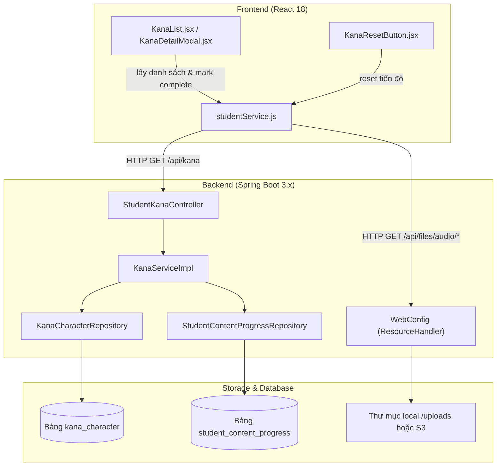
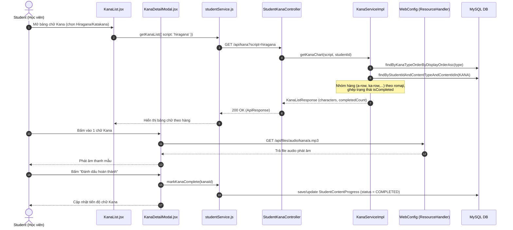

# Phân Tích Cấu Trúc – Luồng – Kết Nối Chức Năng Kana (Student)

---

## 1. TÓM TẮT TỔNG QUAN

Chức năng **Kana** thuộc hệ thống E-Learning luyện thi JLPT. Đây là bảng chữ cái nền tảng (Hiragana / Katakana) dành cho **Student** (người học); dữ liệu Kana là tập tra chuẩn quốc gia (static dataset) được hệ thống khởi tạo sẵn, nên **Staff không cần thao tác CRUD thường xuyên**:

- **Student (Học viên)**:
  - Xem bảng chữ cái Kana (Hiragana / Katakana) sắp xếp theo hàng (a-row, ka-row,...), nghe âm thanh mẫu, xem nét vẽ.
  - Đánh dấu hoàn thành từng chữ Kana và cập nhật tiến độ học tập (`StudentContentProgress`).
  - Khôi phục (reset) tiến độ Kana khi muốn ôn tập lại từ đầu.
- **Staff / Hệ thống**:
  - Bảng chữ Kana là dữ liệu tra chuẩn (static dataset) được khởi tạo sẵn trong Database (`kana_character`); Staff không chỉnh sửa thường xuyên.

**Kiến trúc tổng thể**:
- **Frontend**: React 18, Redux Toolkit (`studentSlice`), CSS Vanilla & Custom Components (`KanaDetailModal`, `KanaResetButton`).
- **Backend**: Java 21, Spring Boot 3.x, Spring Security (JWT + `@PreAuthorize`), JPA/Hibernate.
- **Database**: MySQL 8 (các bảng `kana_character`, `student_content_progress`).
- **Media Asset Storage**: Theo quyết định kiến trúc ADR-006 & `WebConfig.java`, file media (mp3 audio Kana, SVG nét vẽ) được phục vụ tĩnh qua tuyến `/api/files/**` từ thư mục `uploads/` (dev) hoặc S3 (prod), Database chỉ lưu trữ đường dẫn URL.

---

## 2. BẢN ĐỒ CẤU TRÚC (CÁC MẢNH VÀ VAI TRÒ)

| File | Vai trò | Loại |
| :--- | :--- | :--- |
| [KanaList.jsx](apps/frontend/src/pages/kana/KanaList.jsx) | Giao diện bảng chữ cái Hiragana/Katakana phân theo hàng cho Student | FE Page |
| [KanaDetailModal.jsx](apps/frontend/src/components/student/KanaDetailModal.jsx) | Modal xem chi tiết chữ Kana, nghe phát âm và bấm đánh dấu đã hoàn thành | FE Component |
| [KanaResetButton.jsx](apps/frontend/src/components/student/KanaResetButton.jsx) | Nút hỗ trợ học viên khôi phục/reset tiến độ bảng chữ Kana | FE Component |
| [studentService.js](apps/frontend/src/api/studentService.js) | Module API client chứa các hàm gọi REST endpoint dành cho Student (Kana) | FE Service |
| [StudentKanaController.java](apps/backend/src/main/java/com/jlpt/feature/student/kana/controller/StudentKanaController.java) | REST Controller tiếp nhận request xem bảng chữ Kana của Student (`/api/kana`) | BE Controller |
| [KanaService.java](apps/backend/src/main/java/com/jlpt/feature/student/kana/service/KanaService.java) / [ServiceImpl](apps/backend/src/main/java/com/jlpt/feature/student/kana/service/impl/KanaServiceImpl.java) | Business logic lấy bảng Kana theo script, nhóm hàng và tính tiến độ đã học | BE Service |
| [WebConfig.java](apps/backend/src/main/java/com/jlpt/shared/config/WebConfig.java) | Cấu hình Spring MVC WebResourceHandler để phục vụ file audio/SVG tĩnh từ `/uploads` | BE Config |
| [KanaCharacterRepository.java](apps/backend/src/main/java/com/jlpt/feature/learning/repository/KanaCharacterRepository.java) | Repository truy vấn bảng `kana_character` theo loại chữ (Hiragana/Katakana) | BE Repository |
| [StudentContentProgressRepository.java](apps/backend/src/main/java/com/jlpt/feature/student/StudentContentProgressRepository.java) | Repository quản lý và đếm bản ghi tiến độ học tập (`KANA`) | BE Repository |
| [KanaCharacter.java](apps/backend/src/main/java/com/jlpt/feature/learning/KanaCharacter.java) | Entity đại diện cho bảng `kana_character` trong Database | BE Entity |

---

## 3. BẢN ĐỒ KẾT NỐI (DỮ LIỆU TRUYỀN QUA ĐÂU)

### 3.1. Architecture Diagram (Mermaid)



### 3.2. Bảng Mô Tả Kết Nối

| Từ (File A) | Đến (File B) | Cách kết nối | Dữ liệu truyền |
| :--- | :--- | :--- | :--- |
| [KanaList.jsx](apps/frontend/src/pages/kana/KanaList.jsx) | [studentService.js](apps/frontend/src/api/studentService.js) | Async call `getKanaList()` | `script: 'hiragana'` |
| [KanaDetailModal.jsx](apps/frontend/src/components/student/KanaDetailModal.jsx) | [studentService.js](apps/frontend/src/api/studentService.js) | Async call `markKanaComplete()` | `kanaId: Long` |
| [KanaResetButton.jsx](apps/frontend/src/components/student/KanaResetButton.jsx) | [studentService.js](apps/frontend/src/api/studentService.js) | Async call `resetProgress()` | `contentType = 'KANA'` |
| [studentService.js](apps/frontend/src/api/studentService.js) | [StudentKanaController.java](apps/backend/src/main/java/com/jlpt/feature/student/kana/controller/StudentKanaController.java) | REST HTTP Client (Axios) | Query Params `script` |
| [StudentKanaController.java](apps/backend/src/main/java/com/jlpt/feature/student/kana/controller/StudentKanaController.java) | [KanaServiceImpl.java](apps/backend/src/main/java/com/jlpt/feature/student/kana/service/impl/KanaServiceImpl.java) | Java Method Call | `(script, studentId)` |

---

## 4. LUỒNG XỬ LÝ THEO TRÌNH TỰ (SEQUENCE DIAGRAM)

### 4.1. Luồng Student Xem Bảng Kana, Nghe Phát Âm & Đánh Dấu Hoàn Thành



---

## 5. VAI TRÒ TỪNG ĐOẠN CODE QUAN TRỌNG

### 5.1. Xử Lý Phân Nhóm Hàng & Bảng Chữ Kana cho Student
File: [KanaServiceImpl.java](apps/backend/src/main/java/com/jlpt/feature/student/kana/service/impl/KanaServiceImpl.java) (Dòng 29 - 74)

```java
@Override
public KanaListResponse getKanaChart(String script, Long studentId) {
    KanaType type;
    try {
        type = KanaType.valueOf(script.toUpperCase());
    } catch (IllegalArgumentException e) {
        throw new IllegalArgumentException("Invalid script: " + script);
    }

    // 1. Lấy danh sách ký tự Kana theo loại (HIRAGANA hoặc KATAKANA) sắp xếp theo displayOrder
    List<KanaCharacter> characters = kanaRepository.findByKanaTypeOrderByDisplayOrderAsc(type);

    List<Long> contentIds =
            characters.stream().map(c -> c.getId().longValue()).collect(Collectors.toList());

    // 2. Lấy tiến độ đã hoàn thành từ StudentContentProgress với ContentType = KANA
    List<StudentContentProgress> progresses =
            progressRepository.findByStudentIdAndContentTypeAndContentIdIn(studentId, ContentType.KANA, contentIds);

    Map<Long, Boolean> completedMap = progresses.stream()
            .collect(Collectors.toMap(
                    StudentContentProgress::getContentId,
                    p -> p.getStatus() == StudentContentProgress.ProgressStatus.COMPLETED,
                    (existing, replacement) -> existing));

    // 3. Ghép thông tin hàng (a-row, ka-row,...) dựa trên romaji
    List<KanaResponse> responses = characters.stream()
            .map(c -> KanaResponse.builder()
                    .kanaId(c.getId())
                    .character(c.getCharacterValue())
                    .romaji(c.getRomaji())
                    .kanaType(c.getKanaType().getValue())
                    .audioUrl(c.getAudioUrl())
                    .strokeOrderUrl(c.getStrokeOrderUrl())
                    .displayOrder(c.getDisplayOrder())
                    .row(determineRow(c.getRomaji())) // Tự động xác định hàng chữ
                    .isCompleted(completedMap.getOrDefault(c.getId().longValue(), false))
                    .build())
            .collect(Collectors.toList());

    long completedCount = responses.stream().filter(KanaResponse::isCompleted).count();

    return KanaListResponse.builder()
            .characters(responses)
            .completedCount(completedCount)
            .totalCount((long) responses.size())
            .build();
}
```

---

## 6. DỮ LIỆU DI CHUYỂN NHƯ THẾ NÀO

### 6.1. Dữ Liệu Bảng Kana & Tiến Độ Học Tập (Student)

```
[Student mở bảng Kana]
   │  chọn script = 'hiragana' / 'katakana'
   ▼
KanaList.jsx
   │  getKanaList({ script })
   ▼  HTTP GET /api/kana?script=hiragana
StudentKanaController.getKanaChart()
   │
   ▼
KanaServiceImpl.getKanaChart()
   ├── 1. findByKanaTypeOrderByDisplayOrderAsc() -> Lấy ký tự Kana theo thứ tự hiển thị
   ├── 2. findByStudentIdAndContentTypeAndContentIdIn(KANA) -> Lấy tiến độ đã học
   └── 3. determineRow(romaji) -> Nhóm hàng a-row, ka-row,...
   │
   ▼
KanaListResponse { characters[], completedCount, totalCount }
   │  Trả bảng chữ + audioUrl + strokeOrderUrl
   ▼
[Student nghe phát âm] GET /api/files/audio/kana/a.mp3 (WebConfig -> /uploads)
   │
   ▼  Student bấm "Đánh dấu hoàn thành" -> markKanaComplete(kanaId)
Bảng `student_content_progress` (MySQL) [content_type = 'KANA', status = COMPLETED]
```

---

## 7. BẢNG TRA CỨU TỔNG HỢP

| Bước | File | Function | Kết nối tới | Dữ liệu di chuyển | Ghi chú |
| :--- | :--- | :--- | :--- | :--- | :--- |
| **ST-01** | [KanaList.jsx](apps/frontend/src/pages/kana/KanaList.jsx) | `loadKana()` | `studentService.getKanaList` | `script` (`hiragana`/`katakana`) | Tải bảng chữ Kana và tiến độ |
| **ST-02** | [KanaServiceImpl.java](apps/backend/src/main/java/com/jlpt/feature/student/kana/service/impl/KanaServiceImpl.java) | `getKanaChart()` | `KanaCharacterRepository` | `script`, `studentId` | Sắp xếp chữ Kana theo thứ tự hiển thị & nhóm hàng |
| **ST-03** | [KanaDetailModal.jsx](apps/frontend/src/components/student/KanaDetailModal.jsx) | `handleComplete()` | `studentService.markKanaComplete` | `kanaId` | Đánh dấu hoàn thành chữ Kana vào `student_content_progress` |
| **ST-04** | [KanaResetButton.jsx](apps/frontend/src/components/student/KanaResetButton.jsx) | `handleReset()` | `studentService.resetProgress` | `contentType = 'KANA'` | Xóa bản ghi tiến độ Kana để học lại từ đầu |

---

## 8. PHÂN TÍCH CHI TIẾT NGỮ CẢNH BỔ SUNG

### 8.1. Kiến Trúc Phục Vụ Tệp Truyền Thông Tĩnh (Audio & Nét Vẽ - ADR-006 & WebConfig)

Hệ thống tuân thủ nguyên tắc thiết kế **ADR-006**: Không lưu dữ liệu nhị phân (BLOB) trực tiếp trong Database, Database chỉ lưu chuỗi đường dẫn URL:

1. **Cấu hình Spring Resource Handler**:
   - File [WebConfig.java](apps/backend/src/main/java/com/jlpt/shared/config/WebConfig.java) đăng ký đường dẫn tài nguyên tĩnh:
     ```java
     registry.addResourceHandler("/api/files/**").addResourceLocations(uploadLocation);
     ```
   - Request lấy tệp phát âm `GET /api/files/audio/kana/a.mp3` được Spring MVC tự động tìm và trả về tệp từ thư mục vật lý `uploads/audio/kana/a.mp3`.
2. **Sinh Tệp Phát Âm Kana (Script)**:
   - Dự án trang bị sẵn tệp kịch bản `apps/frontend/scripts/generate-kana-audio.mjs` hỗ trợ tự động tạo tệp âm thanh chuẩn MP3 cho 46 chữ cái Kana cơ bản vào thư mục static uploads.

### 8.2. Cơ Chế Khôi Phục / Reset Tiến Độ Học Tập (Reset Progress)

Để đáp ứng nhu cầu ôn tập lại từ đầu của Học viên:

1. **Giao diện Reset**:
   - Học viên bấm nút [KanaResetButton.jsx](apps/frontend/src/components/student/KanaResetButton.jsx).
2. **Xử lý Backend**:
   - Client gọi API `DELETE /learning-progress/reset?contentType=KANA` từ [studentService.js](apps/frontend/src/api/studentService.js).
   - Backend xóa hoặc cập nhật các bản ghi tiến độ tương ứng trong bảng `student_content_progress` thuộc `student_id` hiện tại về trạng thái ban đầu, cho phép Học viên bắt đầu lại lộ trình học tập.
