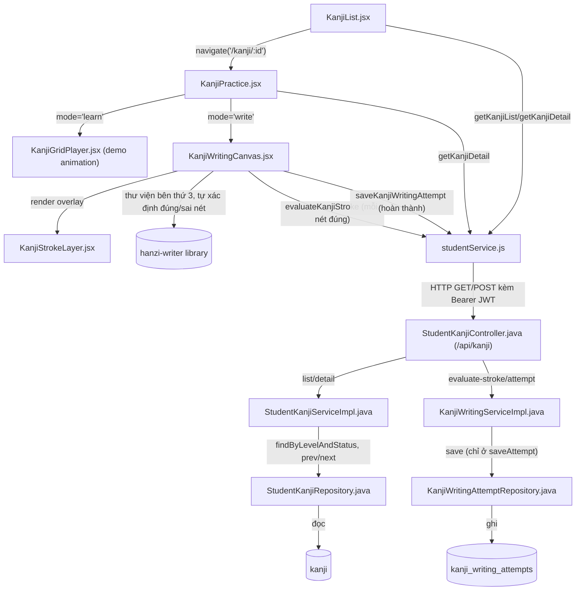
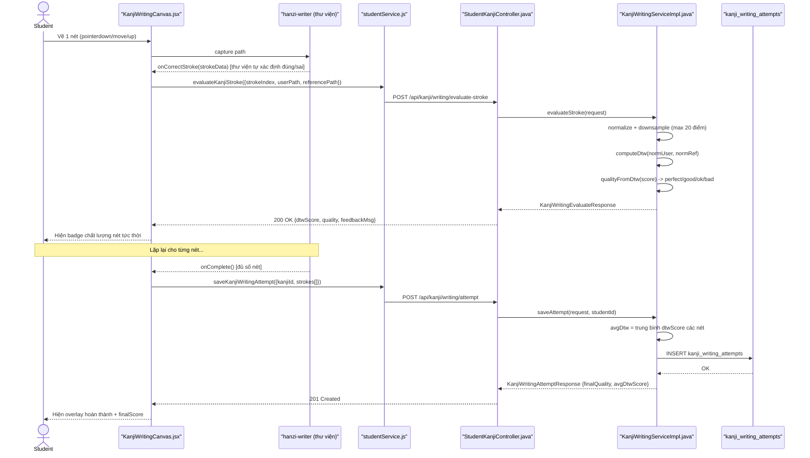

# Phân Tích Feature: Kanji (Học Kanji + Luyện Viết Tay/OCR bằng DTW)

> **Tác giả phân tích:** AI Senior Software Architect
> **Ngày phân tích:** 2026-07-22
> **Phạm vi:** Nhóm con của feature "learning" — góc nhìn Student (xem danh sách/chi tiết Kanji + luyện viết tay chấm điểm bằng thuật toán Dynamic Time Warping)
> **Nguồn:** Đọc trực tiếp source code trong workspace

---

## 1. Tóm Tắt Tổng Quan

Feature **Kanji** gồm 2 phần rõ rệt: (1) **xem học** — danh sách/chi tiết Kanji theo cấp độ JLPT, và (2) **luyện viết tay** — Student vẽ từng nét trên canvas, hệ thống so khớp với nét chuẩn bằng thuật toán DTW (Dynamic Time Warping) và chấm điểm theo 4 mức chất lượng (perfect/good/ok/bad). Đúng theo `ADR-007` của dự án: đây là **so sánh hình dạng nét vẽ**, không phải OCR nhận diện ảnh chữ viết tay truyền thống.

Feature trải dài trên 3 tầng:

| Tầng | Mô tả |
|---|---|
| **Frontend (React)** | [KanjiList.jsx](apps/frontend/src/pages/kanji/KanjiList.jsx) (danh sách) → [KanjiPractice.jsx](apps/frontend/src/pages/kanji/KanjiPractice.jsx) (chi tiết, 2 mode `learn`/`write`) dùng [KanjiWritingCanvas.jsx](apps/frontend/src/components/kanji/KanjiWritingCanvas.jsx) để bắt nét vẽ, gọi API qua [studentService.js](apps/frontend/src/api/studentService.js) |
| **Backend (Spring Boot)** | [StudentKanjiController.java](apps/backend/src/main/java/com/jlpt/feature/student/kanji/StudentKanjiController.java) → [StudentKanjiServiceImpl](apps/backend/src/main/java/com/jlpt/feature/student/kanji/StudentKanjiServiceImpl.java) (danh sách/chi tiết) + [KanjiWritingServiceImpl](apps/backend/src/main/java/com/jlpt/feature/student/kanji/KanjiWritingServiceImpl.java) (thuật toán DTW) |
| **Database** | Bảng `kanji` ([Kanji.java](apps/backend/src/main/java/com/jlpt/feature/learning/Kanji.java)), `kanji_writing_attempts` ([KanjiWritingAttempt.java](apps/backend/src/main/java/com/jlpt/feature/student/kanji/KanjiWritingAttempt.java)) |

**Entry point**: route `/kanji` (danh sách) và `/kanji/:id` (chi tiết/luyện viết), cả 2 đăng ký tại `App.jsx:104-105`, bọc `PrivateRoute`.

**Lưu ý quan trọng**: việc **xác định đúng/sai 1 nét vẽ** (khớp outline hay không) do thư viện bên thứ ba `hanzi-writer` tự xử lý ở frontend — thuật toán DTW của dự án **chỉ chấm "chất lượng"** (quality) của 1 nét đã được `hanzi-writer` công nhận là đúng, không phải bộ máy xác định đúng/sai chính.

---

## 2. Bản Đồ Cấu Trúc (Các "Mảnh" Và Vai Trò)

### 2.1 Frontend

| File | Vai trò | Loại |
|---|---|---|
| [KanjiList.jsx](apps/frontend/src/pages/kanji/KanjiList.jsx) | Trang danh sách Kanji theo level, modal xem nhanh chi tiết, nút reset tiến độ | Page Component |
| [KanjiPractice.jsx](apps/frontend/src/pages/kanji/KanjiPractice.jsx) | Trang chi tiết 1 Kanji: mode `learn` (xem animation + thông tin) và mode `write` (luyện viết) | Page Component |
| [KanjiGridPlayer.jsx](apps/frontend/src/components/kanji/KanjiGridPlayer.jsx) | Component demo animation viết chữ (Play/Pause/Replay), không chấm điểm | Component |
| [KanjiStrokeLayer.jsx](apps/frontend/src/components/kanji/KanjiStrokeLayer.jsx) | SVG overlay: nét tương lai (ghost), nét hiện tại (guide), gợi ý hướng, animation đầu bút | Component |
| [KanjiWritingCanvas.jsx](apps/frontend/src/components/kanji/KanjiWritingCanvas.jsx) | Component chính luyện viết: dùng `hanzi-writer` chế độ quiz, bắt pointer path, gọi API evaluate-stroke/saveAttempt | Component |
| [kanjiLookup.js](apps/frontend/src/utils/kanjiLookup.js) | Tiện ích tra cứu Kanji theo âm đọc + custom loader dữ liệu chữ Nhật cho `hanzi-writer` | Util |
| [studentService.js](apps/frontend/src/api/studentService.js) | Tầng gọi API: `getKanjiList`, `getKanjiDetail`, `evaluateKanjiStroke`, `saveKanjiWritingAttempt` | API Service |

### 2.2 Backend

| File | Vai trò | Loại |
|---|---|---|
| [Kanji.java](apps/backend/src/main/java/com/jlpt/feature/learning/Kanji.java) | Entity JPA bảng `kanji` (nghĩa, âm on/kun, số nét, trạng thái duyệt) | Entity |
| [StudentKanjiController.java](apps/backend/src/main/java/com/jlpt/feature/student/kanji/StudentKanjiController.java) | REST Controller `/api/kanji`, `@PreAuthorize("hasRole('STUDENT')")`: list, detail, evaluate-stroke, attempt | Controller |
| [StudentKanjiService.java](apps/backend/src/main/java/com/jlpt/feature/student/kanji/StudentKanjiService.java) | Interface: `getKanjiList`, `getKanjiDetail` | Service Interface |
| [StudentKanjiServiceImpl.java](apps/backend/src/main/java/com/jlpt/feature/student/kanji/StudentKanjiServiceImpl.java) | Impl: danh sách phân trang kèm tiến độ, chi tiết kèm prev/next id | Service Impl |
| [StudentKanjiRepository.java](apps/backend/src/main/java/com/jlpt/feature/student/kanji/StudentKanjiRepository.java) | Query theo level/status, tìm id kanji trước/sau cùng level | Repository |
| [KanjiWritingService.java](apps/backend/src/main/java/com/jlpt/feature/student/kanji/KanjiWritingService.java) | Interface: `evaluateStroke` (stateless), `saveAttempt` (lưu DB) | Service Interface |
| [KanjiWritingServiceImpl.java](apps/backend/src/main/java/com/jlpt/feature/student/kanji/KanjiWritingServiceImpl.java) | Impl thuật toán DTW: chấm chất lượng từng nét + lưu kết quả tổng hợp 1 lượt luyện | Service Impl |
| [KanjiWritingAttempt.java](apps/backend/src/main/java/com/jlpt/feature/student/kanji/KanjiWritingAttempt.java) | Entity JPA bảng `kanji_writing_attempts` — 1 lượt luyện viết hoàn chỉnh | Entity |
| [KanjiWritingAttemptRepository.java](apps/backend/src/main/java/com/jlpt/feature/student/kanji/KanjiWritingAttemptRepository.java) | Repository JPA thuần (không có custom query) | Repository |
| dto/KanjiListResponse, KanjiItemResponse, KanjiDetailResponse | DTO danh sách/chi tiết Kanji (kèm `isCompleted`, prev/next) | DTO Response |
| dto/KanjiWritingEvaluateRequest/Response | DTO request/response cho 1 nét vẽ (userPath, referencePath → dtwScore, quality, direction) | DTO Request/Response |
| dto/KanjiWritingAttemptRequest/Response | DTO request/response cho 1 lượt luyện hoàn chỉnh (list stroke → finalQuality, avgDtwScore) | DTO Request/Response |

---

## 3. Bản Đồ Kết Nối (Ai Gọi Ai, Dữ Liệu Truyền Qua Đâu)

### 3.1 Diagram Mermaid — Architecture Overview



### 3.2 Bảng phụ — Kết nối chi tiết

| Từ (File A) | Đến (File B) | Cách kết nối | Dữ liệu truyền |
|---|---|---|---|
| `KanjiList.jsx` | `studentService.js` | `getKanjiList({level, page, size})` | Query params → `KanjiListResponse` |
| `KanjiList.jsx` | `KanjiPractice.jsx` | `navigate('/kanji/{kanjiId}')` sau khi bấm "Luyện tập" trong modal | `kanjiId` (URL param) |
| `KanjiPractice.jsx` | `studentService.js` | `getKanjiDetail(id)` | `kanjiId` → `KanjiDetailResponse` |
| `KanjiWritingCanvas.jsx` | thư viện `hanzi-writer` | Gọi API thư viện `quiz()`, đăng ký callback `onCorrectStroke`/`onComplete`/`onMistake` | Path người dùng vẽ (pointer events) |
| `KanjiWritingCanvas.jsx` (callback `onCorrectStroke`) | `studentService.js` | `evaluateKanjiStroke({strokeIndex, userPath, referencePath})` | `referencePath` lấy từ `medians` nội bộ của `hanzi-writer` |
| `KanjiWritingCanvas.jsx` (callback `onComplete`) | `studentService.js` | `saveKanjiWritingAttempt({kanjiId, characterValue, totalStrokes, strokes[]})` | Toàn bộ kết quả các nét đã evaluate |
| `studentService.js` | `StudentKanjiController.java` | HTTP request thật, JWT tự đính qua interceptor | Body/query JSON |
| `StudentKanjiController.java` | `StudentKanjiServiceImpl.java` / `KanjiWritingServiceImpl.java` | Gọi method Java (Spring DI) — 2 service tách biệt cho 2 mối quan tâm khác nhau | DTO Request → DTO Response |
| `KanjiWritingServiceImpl.saveAttempt` | `KanjiPractice.jsx` (qua chuỗi callback) | `onComplete()` prop → `handleWritingComplete` gọi tiếp `markProgress('kanji', kanjiId, ...)` | Đánh dấu tiến độ học (API dùng chung, ngoài phạm vi 2 service Kanji) |

---

## 4. Luồng Xử Lý Theo Trình Tự

Luồng **"Student luyện viết 1 chữ Kanji từ đầu đến khi hoàn thành"** — luồng giá trị nhất vì thể hiện rõ thuật toán DTW:

1. `KanjiList.jsx` fetch danh sách ([KanjiList.jsx:42-55](apps/frontend/src/pages/kanji/KanjiList.jsx#L42-L55)) → `getKanjiList` → `StudentKanjiController.getKanjiList` ([dòng 33-48](apps/backend/src/main/java/com/jlpt/feature/student/kanji/StudentKanjiController.java#L33-L48)) → `StudentKanjiServiceImpl.getKanjiList` ([dòng 37-86](apps/backend/src/main/java/com/jlpt/feature/student/kanji/StudentKanjiServiceImpl.java#L37-L86)).
2. Student bấm 1 thẻ Kanji → mở modal xem nhanh ([KanjiList.jsx:65-77](apps/frontend/src/pages/kanji/KanjiList.jsx#L65-L77)) gọi `getKanjiDetail` → `StudentKanjiServiceImpl.getKanjiDetail` ([dòng 89-137](apps/backend/src/main/java/com/jlpt/feature/student/kanji/StudentKanjiServiceImpl.java#L89-L137)).
3. Bấm "Luyện tập" trong modal ([KanjiList.jsx:257-259](apps/frontend/src/pages/kanji/KanjiList.jsx#L257-L259)) → `navigate('/kanji/{id}')` → route `App.jsx:105` render `KanjiPractice`.
4. `KanjiPractice` mount ở mode `learn` ([KanjiPractice.jsx:23-43](apps/frontend/src/pages/kanji/KanjiPractice.jsx#L23-L43)), gọi lại `getKanjiDetail(id)`, hiển thị `KanjiGridPlayer` (demo animation).
5. Student bấm "Bắt đầu luyện viết" ([KanjiPractice.jsx:182-190](apps/frontend/src/pages/kanji/KanjiPractice.jsx#L182-L190)) → `setMode('write')` → render `KanjiWritingCanvas`.
6. Student vẽ 1 nét: `KanjiWritingCanvas.jsx:87-117` bắt `pointerdown/move/up`, lưu `currentUserPathRef` (đã flip trục Y để khớp hệ tọa độ `hanzi-writer`).
7. Thư viện `hanzi-writer` (bên thứ 3) tự xác định nét vừa vẽ đúng hay sai theo outline nội bộ → nếu đúng, callback `onCorrectStroke` ([KanjiWritingCanvas.jsx:151-174](apps/frontend/src/components/kanji/KanjiWritingCanvas.jsx#L151-L174)) chạy: lấy `userPath` vừa vẽ + `referencePath` = median chuẩn tại nét đó → gọi `evaluateKanjiStroke`.
8. `StudentKanjiController.evaluateStroke` ([dòng 63-69](apps/backend/src/main/java/com/jlpt/feature/student/kanji/StudentKanjiController.java#L63-L69)) → `KanjiWritingServiceImpl.evaluateStroke` ([dòng 39-73](apps/backend/src/main/java/com/jlpt/feature/student/kanji/KanjiWritingServiceImpl.java#L39-L73)): downsample + normalize 2 path → `computeDtw` → `qualityFromDtw` → trả `quality` (perfect/good/ok/bad) hiển thị badge tức thời.
9. Lặp lại bước 6-8 cho từng nét, kết quả tích lũy vào `strokeResRef.current[]` phía frontend.
10. Khi đủ số nét, `hanzi-writer` gọi `onComplete` ([KanjiWritingCanvas.jsx:176-199](apps/frontend/src/components/kanji/KanjiWritingCanvas.jsx#L176-L199)) → gộp toàn bộ `strokes[]` → gọi `saveKanjiWritingAttempt`.
11. `StudentKanjiController.saveWritingAttempt` ([dòng 74-82](apps/backend/src/main/java/com/jlpt/feature/student/kanji/StudentKanjiController.java#L74-L82)) → `KanjiWritingServiceImpl.saveAttempt` ([dòng 79-122](apps/backend/src/main/java/com/jlpt/feature/student/kanji/KanjiWritingServiceImpl.java#L79-L122)): tính `avgDtw` trung bình toàn bộ nét, `finalQuality`, lưu entity `KanjiWritingAttempt`.
12. Kết quả trả về → `KanjiPractice.handleWritingComplete` ([dòng 47-56](apps/frontend/src/pages/kanji/KanjiPractice.jsx#L47-L56)) gọi `markProgress('kanji', kanjiId, 'completed', 100)` để đánh dấu tiến độ học.

### 4.1 Sequence Diagram



---

## 5. Vai Trò Từng Đoạn Code Quan Trọng

### 5.1 Thuật toán DTW cốt lõi (so khớp 2 đường nét)

File: [KanjiWritingServiceImpl.java:128-144](apps/backend/src/main/java/com/jlpt/feature/student/kanji/KanjiWritingServiceImpl.java#L128-L144)

```java
private double computeDtw(List<double[]> s1, List<double[]> s2) {
    int n = s1.size(), m = s2.size();
    double[][] dp = new double[n][m]; // Bảng quy hoạch động n x m
    for (double[] row : dp) Arrays.fill(row, Double.MAX_VALUE / 2); // Khởi tạo "vô cực"

    dp[0][0] = euclidean(s1.get(0), s2.get(0)); // Ô góc: khoảng cách 2 điểm đầu
    for (int i = 1; i < n; i++) dp[i][0] = dp[i - 1][0] + euclidean(s1.get(i), s2.get(0)); // Cột đầu
    for (int j = 1; j < m; j++) dp[0][j] = dp[0][j - 1] + euclidean(s1.get(0), s2.get(j)); // Hàng đầu

    for (int i = 1; i < n; i++) {
        for (int j = 1; j < m; j++) {
            double cost = euclidean(s1.get(i), s2.get(j));
            // Chọn đường đi rẻ nhất trong 3 hướng: trên, trái, chéo trái-trên
            dp[i][j] = cost + Math.min(dp[i - 1][j], Math.min(dp[i][j - 1], dp[i - 1][j - 1]));
        }
    }
    return dp[n - 1][m - 1]; // Tổng chi phí tích lũy nhỏ nhất từ đầu tới cuối 2 đường
}
```
Giải thích: DTW cho phép so khớp 2 đường nét dù chúng có số điểm/tốc độ vẽ khác nhau (bất biến với biến dạng thời gian) — đây là lý do chọn DTW thay vì so sánh điểm-đối-điểm đơn giản. Input đã qua `downsample`+`normalize` trước khi vào hàm này.

### 5.2 Quy đổi điểm DTW sang mức chất lượng (ngưỡng cố định)

File: [KanjiWritingServiceImpl.java:26-29, 191-196](apps/backend/src/main/java/com/jlpt/feature/student/kanji/KanjiWritingServiceImpl.java#L191-L196)

```java
private static final double THRESHOLD_PERFECT = 300.0;
private static final double THRESHOLD_GOOD = 650.0;
private static final double THRESHOLD_OK = 1200.0;
...
private String qualityFromDtw(double score) {
    if (score < THRESHOLD_PERFECT) return "perfect";
    if (score < THRESHOLD_GOOD) return "good";
    if (score < THRESHOLD_OK) return "ok";
    return "bad"; // score càng thấp càng khớp mẫu chuẩn
}
```
Giải thích: dùng chung cho cả chấm từng nét (`evaluateStroke`) lẫn chấm trung bình cả chữ (`saveAttempt`) — ngưỡng cố định (hard-code), không cấu hình theo độ khó/số nét của từng chữ.

### 5.3 Frontend: gọi API ngay khi thư viện xác nhận 1 nét đúng

File: [KanjiWritingCanvas.jsx:151-174](apps/frontend/src/components/kanji/KanjiWritingCanvas.jsx#L151-L174)

```jsx
onCorrectStroke: (strokeData) => {
  const completed  = total - strokeData.strokesRemaining;
  const strokeIdx  = completed - 1;
  const userPath      = [...currentUserPathRef.current];
  const referencePath = charDataRef.current?.medians?.[strokeIdx] ?? [];
  // referencePath lấy từ dữ liệu "medians" (đường trung tâm chuẩn) do hanzi-writer cung cấp sẵn
  setStrokeQuality('loading');
  evaluateKanjiStroke({ strokeIndex: strokeIdx, userPath, referencePath })
    .then((result) => {
      strokeResRef.current[strokeIdx] = result; // Tích lũy kết quả để dùng khi saveAttempt
      setStrokeQuality(result.quality);
    })
    .catch(() => { setStrokeQuality('ok'); });
},
```
Giải thích: **`hanzi-writer` quyết định đúng/sai nét** (đây là logic thư viện bên thứ 3, không phải code dự án); backend DTW chỉ được gọi SAU KHI đã biết nét đúng, chỉ để tính điểm "chất lượng" — nếu lỗi mạng khi gọi API, code fallback về `quality='ok'` thay vì để UI treo.

### 5.4 Backend: tính điểm trung bình toàn bộ nét khi lưu kết quả cuối

File: [KanjiWritingServiceImpl.java:86-93](apps/backend/src/main/java/com/jlpt/feature/student/kanji/KanjiWritingServiceImpl.java#L86-L93) (theo mô tả agent khảo sát, dòng 86-93 nằm trong method `saveAttempt` 79-122)

```java
double avgDtw = strokes.isEmpty()
        ? 0.0
        : strokes.stream()
                .mapToDouble(KanjiWritingAttemptRequest.StrokeResult::getDtwScore)
                .average()
                .orElse(0.0);
String finalQuality = qualityFromDtw(avgDtw);
```
Giải thích: điểm cuối cùng của cả chữ là **trung bình cộng** điểm DTW từng nét đã được frontend gửi kèm — nghĩa là backend **tin tưởng lại** kết quả `dtwScore` mà chính nó đã trả về ở bước `evaluateStroke` trước đó (client gửi lại), không tính lại từ đầu bằng `referencePath` gốc — xem Mục 8 về rủi ro này.

---

## 6. Dữ Liệu Di Chuyển Như Thế Nào

Theo dõi dữ liệu **"đường nét Student vừa vẽ" (`userPath`)** xuyên suốt hệ thống:

1. **Bắt dữ liệu thô**: `KanjiWritingCanvas.jsx:87-117` — sự kiện con trỏ chuột/cảm ứng (`pointerdown/move/up`), toạ độ `(x, y)` tính từ `getBoundingClientRect()`, **Y bị đảo ngược** (`y = rect.height - (e.clientY - rect.top)`) để khớp hệ trục Y-hướng-lên của `hanzi-writer`.
2. **Tích lũy trong phiên vẽ**: mảng `currentUserPathRef.current` (mảng `[x, y]`) tăng dần khi con trỏ di chuyển, KHÔNG lưu vào state React (dùng `ref` để tránh re-render liên tục khi vẽ).
3. **Gửi lên server (theo từng nét)**: khi 1 nét được `hanzi-writer` công nhận đúng, `userPath` (đã copy bằng `[...currentUserPathRef.current]`) + `referencePath` (median chuẩn từ thư viện) được gửi nguyên dạng mảng tọa độ qua `POST /kanji/writing/evaluate-stroke` — tên field `userPath`/`referencePath` giữ nguyên tới `KanjiWritingEvaluateRequest` DTO.
4. **Biến đổi ở Backend**: `KanjiWritingServiceImpl.toDoubleArray()` convert `List<List<Double>>` (JSON) sang `List<double[]>` (Java) → qua `downsample` (tối đa 20 điểm) → qua `normalize` (đưa về hộp toạ độ [0,100], bất biến scale/translation) — dữ liệu gốc **không được lưu**, chỉ dùng tức thời để tính `computeDtw`.
5. **Kết quả trả về**: `dtwScore` (số thực) + `quality` (chuỗi) — KHÔNG trả lại toạ độ đã xử lý.
6. **Tích lũy phía Frontend**: `strokeResRef.current[strokeIdx] = result` — chỉ giữ lại **kết quả chấm điểm** của từng nét (không giữ toạ độ thô) để dùng ở bước cuối.
7. **Gửi lên server lần 2 (khi hoàn thành cả chữ)**: mảng các `{strokeIndex, dtwScore, quality, direction}` (không còn toạ độ thô) được gửi qua `POST /kanji/writing/attempt`.
8. **Lưu vĩnh viễn**: `KanjiWritingServiceImpl.saveAttempt` build chuỗi JSON thủ công (`buildStrokeJson`) lưu vào cột `strokeDetails` (kiểu String) của bảng `kanji_writing_attempts` — đây là nơi DUY NHẤT toạ độ/kết quả nét được lưu lại lâu dài (dạng JSON string, không phải bảng con quan hệ).

**Nhận xét**: toạ độ thô của nét vẽ (`userPath`) không bao giờ được lưu vào DB — chỉ dùng tức thời để tính điểm rồi bị loại bỏ; dữ liệu lưu lại lâu dài chỉ là con số (`dtwScore`, `quality`) đã qua xử lý.

---

## 7. Bảng Tra Cứu Tổng Hợp

| Bước | File | Function | Kết nối tới | Dữ liệu | Ghi chú |
|---|---|---|---|---|---|
| 1 | [KanjiList.jsx](apps/frontend/src/pages/kanji/KanjiList.jsx) | `fetchKanji()` (dòng 42-55) | `studentService.getKanjiList` | `{level, page, size}` | — |
| 2 | [StudentKanjiServiceImpl.java](apps/backend/src/main/java/com/jlpt/feature/student/kanji/StudentKanjiServiceImpl.java) | `getKanjiList()` (dòng 37-86) | `StudentKanjiRepository` | `PageRequest`, progress map | `completedCount` đếm riêng toàn level, không chỉ trang hiện tại |
| 3 | [KanjiList.jsx](apps/frontend/src/pages/kanji/KanjiList.jsx) | `openKanji()` (dòng 65-77) | `studentService.getKanjiDetail` | `kanjiId` | Mở modal xem nhanh |
| 4 | [KanjiPractice.jsx](apps/frontend/src/pages/kanji/KanjiPractice.jsx) | mount (dòng 23-43) | `studentService.getKanjiDetail` | `id` (URL param) | Load lại chi tiết khi vào trang luyện tập |
| 5 | [KanjiWritingCanvas.jsx](apps/frontend/src/components/kanji/KanjiWritingCanvas.jsx) | `onDown/onMove/onUp` (dòng 87-117) | Nội bộ (ref) | Toạ độ pointer | Flip trục Y |
| 6 | [KanjiWritingCanvas.jsx](apps/frontend/src/components/kanji/KanjiWritingCanvas.jsx) | `onCorrectStroke` (dòng 151-174) | `studentService.evaluateKanjiStroke` | `{strokeIndex, userPath, referencePath}` | Gọi ngay sau khi `hanzi-writer` xác nhận đúng nét |
| 7 | [KanjiWritingServiceImpl.java](apps/backend/src/main/java/com/jlpt/feature/student/kanji/KanjiWritingServiceImpl.java) | `evaluateStroke()` (dòng 39-73) | `computeDtw`, `qualityFromDtw` | `dtwScore`, `quality` | Stateless — không ghi DB |
| 8 | [KanjiWritingCanvas.jsx](apps/frontend/src/components/kanji/KanjiWritingCanvas.jsx) | `onComplete` (dòng 176-199) | `studentService.saveKanjiWritingAttempt` | `strokes[]` tích lũy | Đủ số nét mới gọi |
| 9 | [KanjiWritingServiceImpl.java](apps/backend/src/main/java/com/jlpt/feature/student/kanji/KanjiWritingServiceImpl.java) | `saveAttempt()` (dòng 79-122) | `KanjiWritingAttemptRepository.save` | `avgDtw`, `finalQuality`, `strokeDetails` JSON | Ghi `kanji_writing_attempts` |
| 10 | [KanjiPractice.jsx](apps/frontend/src/pages/kanji/KanjiPractice.jsx) | `handleWritingComplete()` (dòng 47-56) | `markProgress('kanji', ...)` (ngoài phạm vi 2 service Kanji) | `kanjiId` | Đánh dấu tiến độ học |

---

## 8. Các Mục Cần Bổ Sung Context

- **`hanzi-writer` là thư viện bên thứ ba** — logic xác định đúng/sai 1 nét (mistake/correct) nằm trong thư viện, **không phải code của dự án**, nên không thể phân tích sâu hơn từ source code trong workspace. Cần đọc tài liệu/source của `hanzi-writer` nếu muốn hiểu chính xác thuật toán nhận diện nét của họ.
- **Rủi ro tin tưởng lại dữ liệu client** ở `saveAttempt` (Mục 5.4): điểm `avgDtw` cuối cùng tính từ `dtwScore` mà **client tự gửi lên** (đã nhận trước đó từ `evaluateStroke`), backend không tính lại từ toạ độ gốc ở bước lưu — về lý thuyết, client có thể sửa `strokes[].dtwScore` trước khi gọi `saveAttempt` để làm giả kết quả tốt hơn. Đây là quan sát từ code, cần xác nhận với đội bảo mật xem có phải rủi ro đã biết/chấp nhận được hay không.
- **`KanjiDetailResponse.radical`** được khai báo trong DTO nhưng theo agent khảo sát, `StudentKanjiServiceImpl.getKanjiDetail` không set field này — luôn `null`. Không tìm thấy nguồn dữ liệu "bộ thủ" (radical) trong entity `Kanji.java`.
- **`markProgress`** (đánh dấu tiến độ học Kanji) nằm trong `studentService.js` nhưng route backend xử lý (`POST /learning-progress`) không thuộc 2 service Kanji đã khảo sát — chưa xác nhận trực tiếp source backend của bước này (tương tự gap đã ghi nhận ở tài liệu Vocabulary).
- **`KanjiWritingAttemptRepository`** không có custom query nào ngoài kế thừa `JpaRepository` — hiện chưa có API nào cho Student xem lại lịch sử các lần luyện viết trước đó (chỉ có ghi, chưa thấy đọc lại).
