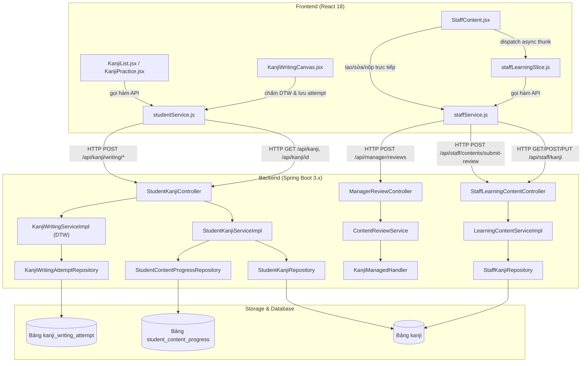
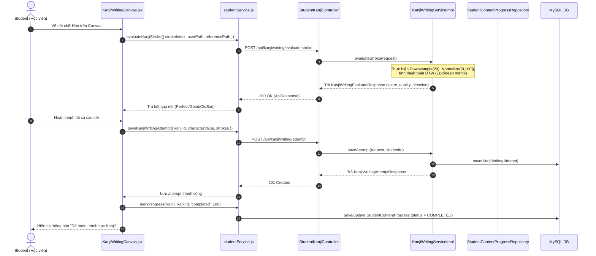
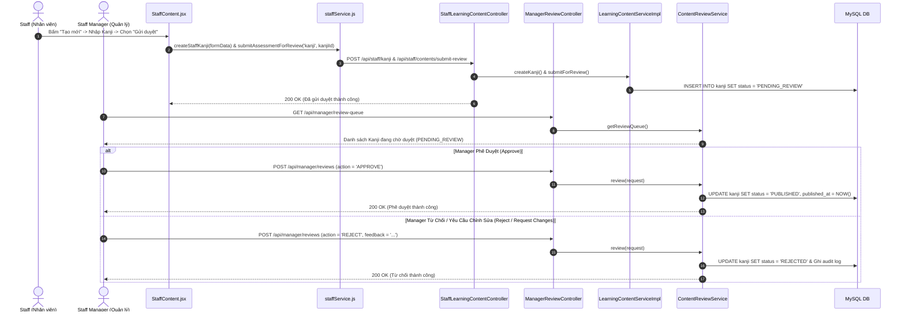

# Phân Tích Cấu Trúc – Luồng – Kết Nối Chức Năng Kanji (Student, Staff & Manager)

---

## 1. TÓM TẮT TỔNG QUAN

Chức năng **Kanji** thuộc hệ thống E-Learning luyện thi JLPT. Hệ thống chia rõ vai trò giữa **Student** (người học), **Staff** (nhân viên biên soạn) và **Manager** (quản lý duyệt nội dung):

- **Student (Học viên)**:
  - Tra cứu danh sách Kanji theo cấp độ (N5–N1), xem chi tiết phát âm (Onyomi/Kunyomi), số nét, ví dụ và hoạt ảnh thứ tự nét vẽ.
  - Luyện viết Kanji với thuật toán chấm điểm **DTW (Dynamic Time Warping)** nhận diện độ chính xác từng nét vẽ theo thời gian thực (stateless endpoint), sau đó lưu kết quả phiên luyện viết (`KanjiWritingAttempt`) và cập nhật tiến độ học tập (`StudentContentProgress`).
- **Staff (Nhân viên)**:
  - Quản lý danh sách Kanji (CRUD): Tạo mới Hán tự ở trạng thái Nháp (`DRAFT`), chỉnh sửa thông tin Hán tự (chỉ cho phép khi ở trạng thái `DRAFT` hoặc `REJECTED`), và Gửi yêu cầu duyệt nội dung (`PENDING_REVIEW`) lên Manager.
- **Manager (Quản lý nội dung)**:
  - Xem hàng đợi phê duyệt (`/api/manager/review-queue`), kiểm tra chi tiết Kanji và phê duyệt xuất bản (`PUBLISHED`), từ chối (`REJECTED`) hoặc yêu cầu chỉnh sửa kèm phản hồi góp ý ghi vết audit log.

**Kiến trúc tổng thể**:
- **Frontend**: React 18, Redux Toolkit (`staffLearningSlice`), CSS Vanilla & Custom Components (`KanjiWritingCanvas`, `ContentFormModal`, `KanjiGridPlayer`).
- **Backend**: Java 21, Spring Boot 3.x, Spring Security (JWT + `@PreAuthorize`), JPA/Hibernate.
- **Database**: MySQL 8 (các bảng `kanji`, `kanji_writing_attempt`, `student_content_progress`, `review_audit_log`).
- **Media Asset Storage**: Theo quyết định kiến trúc ADR-006 & `WebConfig.java`, file media (SVG nét vẽ) được phục vụ tĩnh qua tuyến `/api/files/**` từ thư mục `uploads/` (dev) hoặc S3 (prod), Database chỉ lưu trữ đường dẫn URL.

---

## 2. BẢN ĐỒ CẤU TRÚC (CÁC MẢNH VÀ VAI TRÒ)

| File | Vai trò | Loại |
| :--- | :--- | :--- |
| [KanjiList.jsx](apps/frontend/src/pages/kanji/KanjiList.jsx) | Giao diện hiển thị danh sách Kanji theo JLPT level, tiến độ và modal chi tiết cho Student | FE Page |
| [KanjiPractice.jsx](apps/frontend/src/pages/kanji/KanjiPractice.jsx) | Giao diện xem hoạt ảnh vẽ nét và chuyển sang chế độ luyện viết chữ Hán | FE Page |
| [KanjiWritingCanvas.jsx](apps/frontend/src/components/kanji/KanjiWritingCanvas.jsx) | Component Canvas cho phép học viên vẽ nét chữ, gọi API chấm DTW và lưu attempt | FE Component |
| [KanjiGridPlayer.jsx](apps/frontend/src/components/kanji/KanjiGridPlayer.jsx) | Component render hoạt họa thứ tự nét vẽ Kanji bằng thư viện HanziWriter | FE Component |
| [StaffContent.jsx](apps/frontend/src/pages/staff/StaffContent.jsx) | Giao diện quản lý danh sách Kanji, mở modal tạo/sửa và gửi duyệt Kanji cho Staff | FE Page |
| [studentService.js](apps/frontend/src/api/studentService.js) | Module API client chứa các hàm gọi REST endpoint dành cho Student (Kanji, DTW) | FE Service |
| [staffService.js](apps/frontend/src/api/staffService.js) | Module API client chứa các hàm gọi REST endpoint dành cho Staff (Kanji CRUD & review) | FE Service |
| [staffLearningSlice.js](apps/frontend/src/store/slices/staffLearningSlice.js) | Redux slice quản lý state danh sách Kanji và kết quả thao tác cho Staff | FE Redux Slice |
| [StudentKanjiController.java](apps/backend/src/main/java/com/jlpt/feature/student/kanji/StudentKanjiController.java) | REST Controller tiếp nhận request tra cứu Kanji & luyện viết của Student (`/api/kanji`) | BE Controller |
| [StaffLearningContentController.java](apps/backend/src/main/java/com/jlpt/feature/staffcontent/learning/StaffLearningContentController.java) | REST Controller tiếp nhận request CRUD & gửi duyệt Kanji của Staff (`/api/staff/kanji`) | BE Controller |
| [ManagerReviewController.java](apps/backend/src/main/java/com/jlpt/feature/contentreview/ManagerReviewController.java) | REST Controller tiếp nhận request duyệt bài, phê duyệt/từ chối của Manager (`/api/manager`) | BE Controller |
| [StudentKanjiService.java](apps/backend/src/main/java/com/jlpt/feature/student/kanji/StudentKanjiService.java) / [ServiceImpl](apps/backend/src/main/java/com/jlpt/feature/student/kanji/StudentKanjiServiceImpl.java) | Business logic lấy danh sách, chi tiết Kanji và tính số Kanji đã hoàn thành | BE Service |
| [KanjiWritingService.java](apps/backend/src/main/java/com/jlpt/feature/student/kanji/KanjiWritingService.java) / [ServiceImpl](apps/backend/src/main/java/com/jlpt/feature/student/kanji/KanjiWritingServiceImpl.java) | Business logic tính toán điểm thuật toán DTW cho từng nét vẽ và lưu phiên luyện tập | BE Service |
| [LearningContentService.java](apps/backend/src/main/java/com/jlpt/feature/staffcontent/learning/LearningContentService.java) / [ServiceImpl](apps/backend/src/main/java/com/jlpt/feature/staffcontent/learning/LearningContentServiceImpl.java) | Business logic tạo/sửa Kanji, kiểm tra quyền sở hữu Staff và chuyển trạng thái gửi duyệt | BE Service |
| [ContentReviewService.java](apps/backend/src/main/java/com/jlpt/feature/contentreview/ContentReviewService.java) | Business logic xử lý quy trình phê duyệt, từ chối và yêu cầu chỉnh sửa Kanji từ Manager | BE Service |
| [KanjiManagedHandler.java](apps/backend/src/main/java/com/jlpt/feature/publishedcontent/handler/KanjiManagedHandler.java) | Handler xử lý chuyển đổi trạng thái công bố (`PUBLISHED`, `ARCHIVED`, `DELETED`) của Kanji | BE Handler |
| [WebConfig.java](apps/backend/src/main/java/com/jlpt/shared/config/WebConfig.java) | Cấu hình Spring MVC WebResourceHandler để phục vụ file SVG tĩnh từ `/uploads` | BE Config |
| [StudentKanjiRepository.java](apps/backend/src/main/java/com/jlpt/feature/student/kanji/StudentKanjiRepository.java) | Repository truy vấn bảng `kanji` theo cấp độ và trạng thái `PUBLISHED` cho Student | BE Repository |
| [StaffKanjiRepository.java](apps/backend/src/main/java/com/jlpt/feature/staffcontent/learning/StaffKanjiRepository.java) | Repository truy vấn bảng `kanji` phục vụ tìm kiếm, phân trang theo Staff tạo | BE Repository |
| [KanjiWritingAttemptRepository.java](apps/backend/src/main/java/com/jlpt/feature/student/kanji/KanjiWritingAttemptRepository.java) | Repository lưu trữ lịch sử chấm điểm luyện viết Kanji | BE Repository |
| [StudentContentProgressRepository.java](apps/backend/src/main/java/com/jlpt/feature/student/StudentContentProgressRepository.java) | Repository quản lý và đếm bản ghi tiến độ học tập (`KANJI`) | BE Repository |
| [Kanji.java](apps/backend/src/main/java/com/jlpt/feature/learning/Kanji.java) | Entity đại diện cho bảng `kanji` trong Database | BE Entity |
| [KanjiWritingAttempt.java](apps/backend/src/main/java/com/jlpt/feature/student/kanji/KanjiWritingAttempt.java) | Entity đại diện cho bảng `kanji_writing_attempt` trong Database | BE Entity |

---

## 3. BẢN ĐỒ KẾT NỐI (AI GỌI AI, DỮ LIỆU TRUYỀN QUA ĐÂU)

### 3.1. Architecture Diagram (Mermaid)



### 3.2. Bảng Mô Tả Kết Nối

| Từ (File A) | Đến (File B) | Cách kết nối | Dữ liệu truyền |
| :--- | :--- | :--- | :--- |
| [KanjiList.jsx](apps/frontend/src/pages/kanji/KanjiList.jsx) | [studentService.js](apps/frontend/src/api/studentService.js) | Async call `getKanjiList()` | `{ level: 'N5', page: 0, size: 50 }` |
| [KanjiWritingCanvas.jsx](apps/frontend/src/components/kanji/KanjiWritingCanvas.jsx) | [studentService.js](apps/frontend/src/api/studentService.js) | Async call `evaluateKanjiStroke()` | `{ strokeIndex, userPath, referencePath }` |
| [KanjiWritingCanvas.jsx](apps/frontend/src/components/kanji/KanjiWritingCanvas.jsx) | [studentService.js](apps/frontend/src/api/studentService.js) | Async call `saveKanjiWritingAttempt()` | `{ kanjiId, characterValue, totalStrokes, strokes }` |
| [StaffContent.jsx](apps/frontend/src/pages/staff/StaffContent.jsx) | [staffLearningSlice.js](apps/frontend/src/store/slices/staffLearningSlice.js) | Dispatch `fetchKanjiThunk()` | `{ q, jlptLevel, status, page, size }` |
| [StaffContent.jsx](apps/frontend/src/pages/staff/StaffContent.jsx) | [staffService.js](apps/frontend/src/api/staffService.js) | Async call `createStaffKanji()` / `updateStaffKanji()` / `submitAssessmentForReview()` | Form Object / `{ contentType: 'kanji', contentId }` |
| [studentService.js](apps/frontend/src/api/studentService.js) | [StudentKanjiController.java](apps/backend/src/main/java/com/jlpt/feature/student/kanji/StudentKanjiController.java) | REST HTTP Client (Axios) | Query Params & Body JSON |
| [staffService.js](apps/frontend/src/api/staffService.js) | [StaffLearningContentController.java](apps/backend/src/main/java/com/jlpt/feature/staffcontent/learning/StaffLearningContentController.java) | REST HTTP Client (Axios) | Query Params & Body JSON |
| [staffService.js](apps/frontend/src/api/staffService.js) | [ManagerReviewController.java](apps/backend/src/main/java/com/jlpt/feature/contentreview/ManagerReviewController.java) | REST HTTP Client (Axios) | `ReviewActionRequest { contentType, contentId, action }` |
| [StudentKanjiController.java](apps/backend/src/main/java/com/jlpt/feature/student/kanji/StudentKanjiController.java) | [StudentKanjiServiceImpl.java](apps/backend/src/main/java/com/jlpt/feature/student/kanji/StudentKanjiServiceImpl.java) | Java Method Call | `(level, studentId, page, size)` |
| [StudentKanjiController.java](apps/backend/src/main/java/com/jlpt/feature/student/kanji/StudentKanjiController.java) | [KanjiWritingServiceImpl.java](apps/backend/src/main/java/com/jlpt/feature/student/kanji/KanjiWritingServiceImpl.java) | Java Method Call | Request DTO (`KanjiWritingEvaluateRequest`, `KanjiWritingAttemptRequest`) |
| [StaffLearningContentController.java](apps/backend/src/main/java/com/jlpt/feature/staffcontent/learning/StaffLearningContentController.java) | [LearningContentServiceImpl.java](apps/backend/src/main/java/com/jlpt/feature/staffcontent/learning/LearningContentServiceImpl.java) | Java Method Call | Request DTO & Authentication Email |
| [ManagerReviewController.java](apps/backend/src/main/java/com/jlpt/feature/contentreview/ManagerReviewController.java) | [ContentReviewService.java](apps/backend/src/main/java/com/jlpt/feature/contentreview/ContentReviewService.java) | Java Method Call | `ReviewActionRequest` |

---

## 4. LUỒNG XỬ LÝ THEO TRÌNH TỰ (SEQUENCE DIAGRAMS)

### 4.1. Luồng Student Luyện Viết Kanji & Chấm Điểm AI (DTW)



### 4.2. Luồng Staff Tạo Mới & Gửi Duyệt Kanji -> Manager Phê Duyệt



---

## 5. VAI TRÒ TỪNG ĐOẠN CODE QUAN TRỌNG

### 5.1. Xử lý Lấy Danh Sách Kanji & Tính Số Lượng Hoàn Thành (Student)
File: [StudentKanjiServiceImpl.java](apps/backend/src/main/java/com/jlpt/feature/student/kanji/StudentKanjiServiceImpl.java) (Dòng 35 - 86)

```java
@Override
@Transactional(readOnly = true)
public KanjiListResponse getKanjiList(String level, Long studentId, int page, int size) {
    // 1. Chuyển đổi chuỗi level thành Enum JlptLevel (N5, N4, N3, N2, N1)
    JlptLevel jlptLevel;
    try {
        jlptLevel = JlptLevel.valueOf(level.toUpperCase());
    } catch (IllegalArgumentException e) {
        throw new IllegalArgumentException("Invalid JLPT level: " + level);
    }

    // 2. Truy vấn danh sách Kanji có trạng thái PUBLISHED theo trang
    Page<Kanji> kanjiPage =
            kanjiRepository.findByLevelAndStatus(jlptLevel, ContentStatus.PUBLISHED, PageRequest.of(page, size));

    List<Long> kanjiIds = kanjiPage.getContent().stream().map(Kanji::getId).collect(Collectors.toList());

    // 3. Lấy tiến độ học tập của Học viên hiện tại đối với danh sách Kanji ở trang này
    List<StudentContentProgress> progresses = new java.util.ArrayList<>();
    if (!kanjiIds.isEmpty()) {
        progresses = progressRepository.findByStudentIdAndContentTypeAndContentIdIn(
                studentId, ContentType.KANJI, kanjiIds);
    }

    // 4. Ánh xạ trạng thái hoàn thành (COMPLETED) theo kanjiId
    Map<Long, Boolean> completionMap = progresses.stream()
            .collect(Collectors.toMap(
                    StudentContentProgress::getContentId,
                    p -> p.getStatus() == StudentContentProgress.ProgressStatus.COMPLETED));

    // 5. Map sang danh sách DTO phản hồi về client
    List<KanjiItemResponse> items = kanjiPage.getContent().stream()
            .map(k -> KanjiItemResponse.builder()
                    .kanjiId(k.getId())
                    .characterValue(k.getCharacterValue())
                    .meaning(k.getMeaning())
                    .onyomi(k.getOnyomi())
                    .kunyomi(k.getKunyomi())
                    .strokeCount(k.getStrokeCount())
                    .jlptLevel(k.getJlptLevel() != null ? k.getJlptLevel().name() : null)
                    .isCompleted(completionMap.getOrDefault(k.getId(), false))
                    .build())
            .collect(Collectors.toList());

    // 6. Đếm tổng số Kanji đã hoàn thành của toàn bộ level này (không chỉ trang hiện tại)
    long completedCount = progressRepository.countCompletedKanjiByLevel(
            studentId, jlptLevel, ContentType.KANJI, StudentContentProgress.ProgressStatus.COMPLETED);

    return KanjiListResponse.builder()
            .content(items)
            .totalPages(kanjiPage.getTotalPages())
            .totalElements(kanjiPage.getTotalElements())
            .page(kanjiPage.getNumber())
            .size(kanjiPage.getSize())
            .completedCount(completedCount)
            .build();
}
```

### 5.2. Chấm Điểm Thuật Toán DTW Chữ Vẽ Tay (Kanji Writing AI)
File: [KanjiWritingServiceImpl.java](apps/backend/src/main/java/com/jlpt/feature/student/kanji/KanjiWritingServiceImpl.java) (Dòng 39 - 73 & 128 - 162)

```java
@Override
public KanjiWritingEvaluateResponse evaluateStroke(KanjiWritingEvaluateRequest req) {
    List<double[]> userPath = toDoubleArray(req.getUserPath());
    List<double[]> refPath = toDoubleArray(req.getReferencePath());

    String direction = computeDirection(refPath);

    // Bỏ qua nếu nét quá ngắn (< 2 tọa độ)
    if (userPath.size() < 2 || refPath.size() < 2) {
        return KanjiWritingEvaluateResponse.builder()
                .dtwScore(0.0)
                .quality("ok")
                .direction(direction)
                .feedbackMsg("Đúng rồi")
                .build();
    }

    // Downsample về tối đa 20 điểm và Chuẩn hóa (Normalize) về hệ tọa độ [0, 100]
    List<double[]> normUser = normalize(downsample(userPath, MAX_DOWNSAMPLE));
    List<double[]> normRef = normalize(downsample(refPath, MAX_DOWNSAMPLE));

    // Tính toán khoảng cách DTW (Dynamic Time Warping)
    double score = computeDtw(normUser, normRef);
    String quality = qualityFromDtw(score);

    return KanjiWritingEvaluateResponse.builder()
            .dtwScore(score)
            .quality(quality)
            .direction(direction)
            .feedbackMsg(feedbackMessage(quality))
            .build();
}

// Thuật toán ma trận quy hoạch động (DP Matrix) cho DTW
private double computeDtw(List<double[]> s1, List<double[]> s2) {
    int n = s1.size(), m = s2.size();
    double[][] dp = new double[n][m];
    for (double[] row : dp) Arrays.fill(row, Double.MAX_VALUE / 2);

    dp[0][0] = euclidean(s1.get(0), s2.get(0));
    for (int i = 1; i < n; i++) dp[i][0] = dp[i - 1][0] + euclidean(s1.get(i), s2.get(0));
    for (int j = 1; j < m; j++) dp[0][j] = dp[0][j - 1] + euclidean(s1.get(0), s2.get(j));

    for (int i = 1; i < n; i++) {
        for (int j = 1; j < m; j++) {
            double cost = euclidean(s1.get(i), s2.get(j));
            dp[i][j] = cost + Math.min(dp[i - 1][j], Math.min(dp[i][j - 1], dp[i - 1][j - 1]));
        }
    }
    return dp[n - 1][m - 1];
}
```

### 5.3. Quy Tắc Nghiệp Vụ Tạo & Gửi Duyệt Kanji Dành Cho Staff
File: [LearningContentServiceImpl.java](apps/backend/src/main/java/com/jlpt/feature/staffcontent/learning/LearningContentServiceImpl.java) (Dòng 207 - 239 & 646 - 669)

```java
@Override
@Transactional
public KanjiDetailResponse createKanji(CreateKanjiRequest request, String staffEmail) {
    StaffUser staff = resolveStaff(staffEmail);
    JlptLevel level = parseLevel(request.getJlptLevel());

    // 1. Kiểm tra bắt buộc phải có ít nhất Onyomi hoặc Kunyomi
    if (!StringUtils.hasText(request.getOnyomi()) && !StringUtils.hasText(request.getKunyomi())) {
        throw LearningContentException.missingField("onyomi hoặc kunyomi");
    }

    // 2. Chống trùng lặp ký tự Kanji đã tồn tại trong DB
    String characterValue = request.getCharacterValue().trim();
    if (kanjiRepository.existsByCharacterValue(characterValue)) {
        throw LearningContentException.kanjiDuplicate();
    }

    // 3. Khởi tạo Entity với trạng thái mặc định DRAFT (FR-27-01) và gán nguời tạo
    Kanji kanji = Kanji.builder()
            .characterValue(characterValue)
            .meaning(request.getMeaning().trim())
            .onyomi(trimToNull(request.getOnyomi()))
            .kunyomi(trimToNull(request.getKunyomi()))
            .strokeCount(request.getStrokeCount())
            .jlptLevel(level)
            .strokeOrderUrl(trimToNull(request.getStrokeOrderUrl()))
            .exampleWord(trimToNull(request.getExampleWord()))
            .exampleReading(trimToNull(request.getExampleReading()))
            .exampleMeaning(trimToNull(request.getExampleMeaning()))
            .status(ContentStatus.DRAFT) // Mặc định là Nháp
            .createdBy(staff)            // Lưu Staff sở hữu
            .build();

    Kanji saved = kanjiRepository.save(kanji);
    return toKanjiDetail(saved);
}

// Xử lý gửi duyệt nội dung (Submit for review)
private SubmitReviewResponse submitKanji(Long contentId, StaffUser staff) {
    Kanji kanji = kanjiRepository
            .findByIdAndStatusNot(contentId, ContentStatus.DELETED)
            .orElseThrow(LearningContentException::contentNotFound);

    // Kiểm tra quyền sở hữu: Chỉ chính tác giả hoặc Staff Manager mới được gửi
    guardOwnership(kanji.getCreatedBy(), staff);

    // Chỉ cho phép chuyển trạng thái từ DRAFT hoặc REJECTED sang PENDING_REVIEW
    guardSubmittable(kanji.getStatus() == ContentStatus.DRAFT || kanji.getStatus() == ContentStatus.REJECTED);

    // Validate các trường dữ liệu bắt buộc trước khi gửi duyệt
    if (!StringUtils.hasText(kanji.getCharacterValue())) throw LearningContentException.missingField("characterValue");
    if (!StringUtils.hasText(kanji.getMeaning())) throw LearningContentException.missingField("meaning");
    if (kanji.getJlptLevel() == null) throw LearningContentException.missingField("jlptLevel");

    kanji.setStatus(ContentStatus.PENDING_REVIEW); // Chuyển trạng thái chờ Manager duyệt
    kanjiRepository.save(kanji);

    return SubmitReviewResponse.builder()
            .contentId(kanji.getId())
            .contentType("kanji")
            .status(ContentStatus.PENDING_REVIEW.getValue())
            .build();
}
```

---

## 6. DỮ LIỆU DI CHUYỂN NHƯ THẾ NÀO

### 6.1. Dữ Liệu Luyện Viết Kanji & Điểm DTW (Student)

```
[Người dùng vẽ trên Canvas]
   │
   ▼ (chuỗi các điểm {x, y} trên tọa độ màn hình)
KanjiWritingCanvas.jsx
   │  transform: Y-up coordinates & Median points từ HanziWriter
   ▼
evaluateKanjiStroke({ strokeIndex, userPath, referencePath })
   │  JSON Body HTTP POST /api/kanji/writing/evaluate-stroke
   ▼
StudentKanjiController.evaluateStroke()
   │
   ▼
KanjiWritingServiceImpl.evaluateStroke()
   ├── 1. Downsample(path, 20) -> Giảm bớt điểm dư thừa
   ├── 2. Normalize(path)      -> Đưa về khung hình chuẩn [0, 100]
   ├── 3. computeDtw()         -> Quy hoạch động tính tổng khoảng cách Euclidean
   └── 4. qualityFromDtw()     -> Mapping score sang "perfect", "good", "ok", "bad"
   │
   ▼
KanjiWritingEvaluateResponse { dtwScore, quality, direction, feedbackMsg }
   │  Trả kết quả hiển thị màu nét trên Canvas
   ▼
saveKanjiWritingAttempt({ kanjiId, totalStrokes, strokes })
   │  HTTP POST /api/kanji/writing/attempt
   ▼
Bảng `kanji_writing_attempt` (MySQL)
   (Lưu trữ id, student_id, kanji_id, avg_dtw_score, final_quality, stroke_details)
```

### 6.2. Dữ Liệu Vòng Đời Nội Dung Kanji (Staff & Manager)

```
Form Tạo Kanji (Staff)
   │  Input: { characterValue: "日", onyomi: "NICHI", jlptLevel: "N5" }
   ▼  HTTP POST /api/staff/kanji
LearningContentServiceImpl.createKanji()
   │  Khởi tạo status = DRAFT, createdBy = currentStaff
   ▼
Bảng `kanji` (MySQL) [status = 'draft']
   │
   ▼  Staff bấm "Gửi duyệt" -> HTTP POST /api/staff/contents/submit-review
LearningContentServiceImpl.submitForReview()
   │  Kiểm tra guardOwnership() & guardSubmittable()
   ▼
Bảng `kanji` (MySQL) [status = 'pending_review']
   │
   ▼  Manager Phê duyệt qua HTTP POST /api/manager/reviews
ContentReviewService.review()
   │  Cập nhật status = PUBLISHED & Ghi Audit Log
   ▼
Bảng `kanji` (MySQL) [status = 'published']
   │
   ▼  Hiển thị công khai cho Student học tại GET /api/kanji?level=N5
```

---

## 7. BẢNG TRA CỨU TỔNG HỢP

| Bước | File | Function | Kết nối tới | Dữ liệu di chuyển | Ghi chú |
| :--- | :--- | :--- | :--- | :--- | :--- |
| **ST-01** | [KanjiList.jsx](apps/frontend/src/pages/kanji/KanjiList.jsx) | `fetchKanji()` | `studentService.getKanjiList` | `level`, `page`, `size` | Tải danh sách Kanji kèm trạng thái `isCompleted` |
| **ST-02** | [StudentKanjiServiceImpl.java](apps/backend/src/main/java/com/jlpt/feature/student/kanji/StudentKanjiServiceImpl.java) | `getKanjiList()` | `StudentKanjiRepository`, `StudentContentProgressRepository` | `JlptLevel`, `studentId` | Chỉ lấy các Kanji có status = `PUBLISHED` |
| **ST-03** | [KanjiWritingCanvas.jsx](apps/frontend/src/components/kanji/KanjiWritingCanvas.jsx) | `evaluateStroke()` | `studentService.evaluateKanjiStroke` | `strokeIndex`, `userPath`, `referencePath` | Chạy sau mỗi nét người dùng vừa hoàn tất vẽ |
| **ST-04** | [KanjiWritingServiceImpl.java](apps/backend/src/main/java/com/jlpt/feature/student/kanji/KanjiWritingServiceImpl.java) | `evaluateStroke()` | Statelss Helper methods (`normalize`, `computeDtw`) | Raw coordinates `->` DTW Score | Thuật toán DTW thuần túy, không ghi DB |
| **ST-05** | [KanjiWritingServiceImpl.java](apps/backend/src/main/java/com/jlpt/feature/student/kanji/KanjiWritingServiceImpl.java) | `saveAttempt()` | `KanjiWritingAttemptRepository` | `KanjiWritingAttemptRequest` | Tính `avgDtwScore` và lưu chi tiết nét vẽ vào DB |
| **SF-01** | [StaffContent.jsx](apps/frontend/src/pages/staff/StaffContent.jsx) | `fetchData()` | `staffLearningSlice.fetchKanjiThunk` | `q`, `jlptLevel`, `status`, `page` | Staff xem danh sách Kanji do mình soạn thảo |
| **SF-02** | [StaffContent.jsx](apps/frontend/src/pages/staff/StaffContent.jsx) | `handleSave()` | `staffService.createStaffKanji` / `updateStaffKanji` | `CreateKanjiRequest` / `UpdateKanjiRequest` | Xử lý tạo mới hoặc chỉnh sửa Hán tự |
| **SF-03** | [LearningContentServiceImpl.java](apps/backend/src/main/java/com/jlpt/feature/staffcontent/learning/LearningContentServiceImpl.java) | `createKanji()` | `StaffKanjiRepository` | `CreateKanjiRequest` | Check trùng chữ Hán, validate Onyomi/Kunyomi |
| **SF-04** | [LearningContentServiceImpl.java](apps/backend/src/main/java/com/jlpt/feature/staffcontent/learning/LearningContentServiceImpl.java) | `submitForReview()` | `StaffKanjiRepository` | `SubmitReviewRequest` | Guard ownership & chuyển status sang `PENDING_REVIEW` |
| **MG-01** | [ManagerReviewController.java](apps/backend/src/main/java/com/jlpt/feature/contentreview/ManagerReviewController.java) | `review()` | `ContentReviewService` | `ReviewActionRequest` | Manager duyệt xuất bản (`PUBLISHED`) hoặc từ chối |

---

## 8. PHÂN TÍCH CHI TIẾT NGỮ CẢNH BỔ SUNG

### 8.1. Luồng Manager Phê Duyệt & Kiểm Duyệt Nội Dung (UC-33 / Manager Review)

Quá trình chuyển đổi trạng thái Hán tự từ Staff sang Student công khai bắt buộc phải thông qua luồng kiểm duyệt của Manager:

1. **Hàng đợi phê duyệt (Review Queue)**:
   - Staff Manager gửi HTTP GET đến `/api/manager/review-queue?type=kanji` do [ManagerReviewController.java](apps/backend/src/main/java/com/jlpt/feature/contentreview/ManagerReviewController.java) tiếp nhận.
   - Controller chuyển tiếp sang [ContentReviewService.java](apps/backend/src/main/java/com/jlpt/feature/contentreview/ContentReviewService.java) để lấy các bản ghi có `status = 'PENDING_REVIEW'`.
2. **Quyết định phê duyệt (Approve / Reject / Request Changes)**:
   - Manager gửi yêu cầu đến `POST /api/manager/reviews` với `ReviewActionRequest`.
   - Nếu `action = 'APPROVE'`: [ContentReviewService.java](apps/backend/src/main/java/com/jlpt/feature/contentreview/ContentReviewService.java) chuyển trạng thái `status = 'PUBLISHED'` và ghi nhận thời điểm xuất bản `published_at = LocalDateTime.now()`. Ngay sau bước này, Student mới có thể truy vấn thấy Kanji qua API `/api/kanji`.
   - Nếu `action = 'REJECT'` hoặc `action = 'REQUEST_CHANGES'`: Trạng thái chuyển thành `REJECTED`, đồng thời lý do từ chối được lưu trữ vào bảng `review_audit_log`. Staff có thể xem lại phản hồi này trên giao diện [StaffContent.jsx](apps/frontend/src/pages/staff/StaffContent.jsx) thông qua hàm `getContentReviewFeedback()`.

### 8.2. Kiến Trúc Phục Vụ Tệp Truyền Thông Tĩnh (Nét Vẽ - ADR-006 & WebConfig)

Hệ thống tuân thủ nguyên tắc thiết kế **ADR-006**: Không lưu dữ liệu nhị phân (BLOB) trực tiếp trong Database, Database chỉ lưu chuỗi đường dẫn URL:

1. **Cấu hình Spring Resource Handler**:
   - File [WebConfig.java](apps/backend/src/main/java/com/jlpt/shared/config/WebConfig.java) đăng ký đường dẫn tài nguyên tĩnh:
     ```java
     registry.addResourceHandler("/api/files/**").addResourceLocations(uploadLocation);
     ```
2. **Thứ Tự Nét Vẽ & Hoạt Họa Chữ Hán (Client-side Renderer)**:
   - Thay vì tải các video nặng, Frontend sử dụng thư viện **HanziWriter** tại [KanjiGridPlayer.jsx](apps/frontend/src/components/kanji/KanjiGridPlayer.jsx) và [KanjiWritingCanvas.jsx](apps/frontend/src/components/kanji/KanjiWritingCanvas.jsx). Thư viện này giải mã dữ liệu nét SVG trực tiếp ở Client, cho phép vẽ từng nét hoạt hình mềm mại và cung cấp tọa độ trung vị (median path) để gửi lên API backend chạy thuật toán DTW.

### 8.3. Cơ Chế Khôi Phục / Reset Tiến Độ Học Tập (Reset Progress)

Để đáp ứng nhu cầu ôn tập lại từ đầu của Học viên:

1. **Giao diện Reset**:
   - Học viên bấm nút **Reset** trên [KanjiList.jsx](apps/frontend/src/pages/kanji/KanjiList.jsx).
2. **Xử lý Backend**:
   - Client gọi API `DELETE /learning-progress/reset?contentType=KANJI` từ [studentService.js](apps/frontend/src/api/studentService.js).
   - Backend xóa hoặc cập nhật các bản ghi tiến độ tương ứng trong bảng `student_content_progress` thuộc `student_id` hiện tại về trạng thái ban đầu, cho phép Học viên bắt đầu lại lộ trình học tập.
