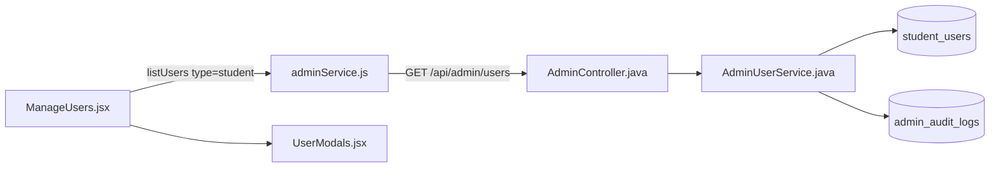
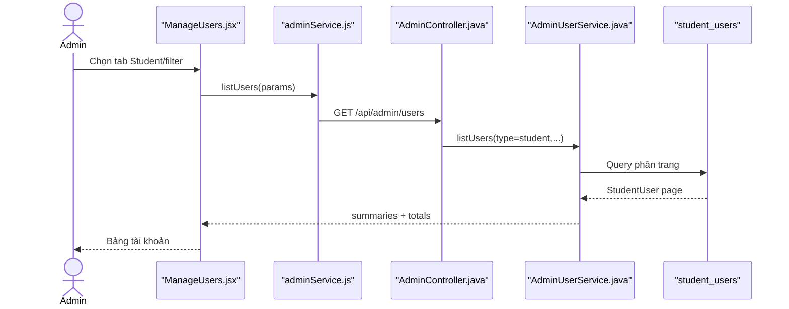

# Manage Student Accounts Feature Analysis

## 1. Tóm tắt tổng quan

Admin quản lý tài khoản Student trong trang `/admin/users` với tab `student`: tìm kiếm, lọc trạng thái/JLPT, xem danh sách và gọi các hành động quản trị. Luồng này tập trung vào list/detail/update Student; suspend/activate được tách thành tài liệu riêng.

## 2. Bản đồ cấu trúc

| File | Vai trò | Loại |
|---|---|---|
| [ManageUsers.jsx](apps/frontend/src/features/management/admin/ManageUsers.jsx) | UI quản lý Student/Staff/Admin | React Page |
| [UserModals.jsx](apps/frontend/src/features/management/components/admin/UserModals.jsx) | Các modal xác nhận/thao tác | Component |
| [adminService.js](apps/frontend/src/shared/api/adminService.js) | API client quản lý user | API Service |
| [AdminController.java](apps/backend/src/main/java/com/jlpt/feature/admin/AdminController.java) | REST endpoints `/api/admin/users` | Controller |
| [AdminUserService.java](apps/backend/src/main/java/com/jlpt/feature/admin/AdminUserService.java) | Query, map DTO và mutation user | Service |
| [StudentUserRepository.java](apps/backend/src/main/java/com/jlpt/feature/student/StudentUserRepository.java) | Truy vấn Student | Repository |
| [UserSummaryResponse.java](apps/backend/src/main/java/com/jlpt/feature/admin/dto/response/UserSummaryResponse.java) | Dữ liệu hàng trong bảng | DTO |
| [AdminAuditLog.java](apps/backend/src/main/java/com/jlpt/feature/admin/AdminAuditLog.java) | Audit hành động Admin | Entity |

## 3. Bản đồ kết nối



| Từ | Đến | Cách kết nối | Dữ liệu |
|---|---|---|---|
| ManageUsers | adminService | function | type/filter/page |
| adminService | AdminController | HTTP | query/body |
| Controller | AdminUserService | method | normalized type |
| Service | Student repository | JPA | StudentUser |
| Service | audit log | JPA save | actor/action/target |

## 4. Luồng xử lý theo trình tự

1. `ManageUsers` mặc định `activeType='student'`.
2. `buildParams` tạo `type`, `q`, `status`, `jlptLevel`, page/size.
3. `adminService.listUsers` gửi `GET /api/admin/users`.
4. `AdminController.listUsers` chuyển filter sang `AdminUserService.listUsers`.
5. Service chọn repository theo type, map thành summary DTO và trả page metadata.
6. UI render bảng, badges và mở modal cho hành động tiếp theo.



## 5. Vai trò đoạn code quan trọng

[ManageUsers.jsx#L80](apps/frontend/src/features/management/admin/ManageUsers.jsx#L80)

```jsx
function buildParams(page) {
  // activeType quyết định backend query bảng Student, Staff hay Admin.
  const params = { type: activeType, page: page - 1, size: PAGE_SIZE };
  if (debouncedSearch) params.q = debouncedSearch;
  if (statusFilter) params.status = statusFilter;
  if (activeType === 'student' && jlptFilter) params.jlptLevel = jlptFilter;
  return params;
}
```

[adminService.js#L5](apps/frontend/src/shared/api/adminService.js#L5)

```js
export async function listUsers({ type, q, status, jlptLevel, staffRole, page = 0, size = 20 } = {}) {
  const params = { type, page, size };
  // Chỉ thêm filter có giá trị để backend phân biệt "không lọc".
  if (q) params.q = q;
  if (status) params.status = status;
  if (jlptLevel) params.jlptLevel = jlptLevel;
  const res = await api.get('/admin/users', { params });
  return res.data.data;
}
```

## 6. Dữ liệu di chuyển

UI filter → query params → service chọn `student` → repository page → `UserSummaryResponse` → `{content,totalElements,totalPages}` → bảng Admin.

## 7. Bảng tra cứu tổng hợp

| Bước | File | Function | Kết nối tới | Dữ liệu | Ghi chú |
|---:|---|---|---|---|---|
| 1 | `ManageUsers` | `buildParams` | API | filters | Student tab |
| 2 | `adminService` | `listUsers` | Controller | query params | JWT Admin |
| 3 | `AdminController` | `listUsers` | Service | type/filter | API entry |
| 4 | `AdminUserService` | `listUsers` | Student repo | pageable | Map DTO |
| 5 | `ManageUsers` | render | Admin | summaries | Table |

## 8. Các mục cần bổ sung context

- Suspend/Activate được mô tả riêng trong `suspend_activate_account_feature_analysis.md`.
- UI dùng chung một trang cho ba loại user; tài liệu này chỉ theo nhánh Student.
