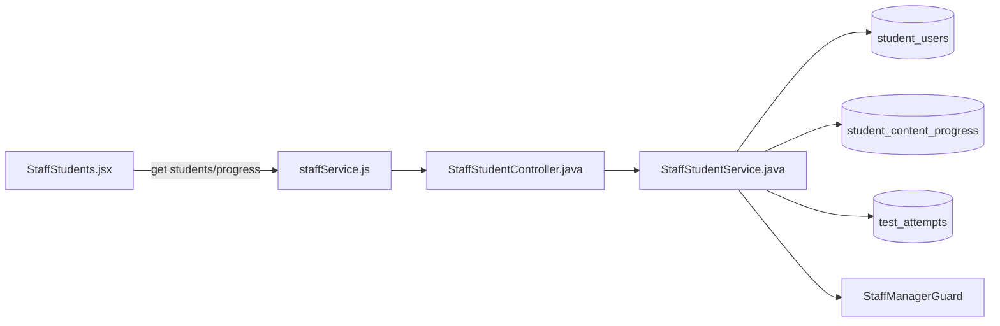
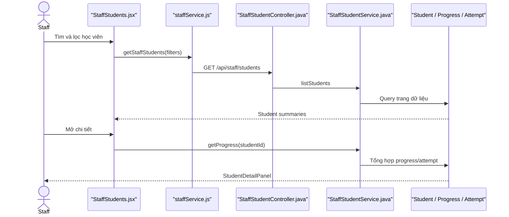

# Manager Student Account Feature Analysis

## 1. Tóm tắt tổng quan

Luồng này là Staff/Staff Manager xem danh sách học viên và tiến độ. Staff thường được xem dữ liệu; riêng khóa/mở khóa yêu cầu `StaffManagerGuard`. Entry point là `/staff/students`.

## 2. Bản đồ cấu trúc

| File | Vai trò | Loại |
|---|---|---|
| [StaffStudents.jsx](apps/frontend/src/features/management/staff/StaffStudents.jsx) | Danh sách, filter và mở chi tiết tiến độ | React Page |
| [StudentDetailPanel.jsx](apps/frontend/src/features/management/components/staff/StudentDetailPanel.jsx) | Hiển thị tiến độ học viên | Component |
| [staffService.js](apps/frontend/src/shared/api/staffService.js) | Gọi Staff Student API | API Service |
| [StaffStudentController.java](apps/backend/src/main/java/com/jlpt/feature/staffcontent/student/controller/StaffStudentController.java) | List/progress/suspend/activate endpoints | Controller |
| [StaffStudentService.java](apps/backend/src/main/java/com/jlpt/feature/staffcontent/student/service/StaffStudentService.java) | Tổng hợp account, progress và attempts | Service |
| [StudentUserRepository.java](apps/backend/src/main/java/com/jlpt/feature/student/StudentUserRepository.java) | Truy vấn học viên | Repository |
| [StudentContentProgressRepository.java](apps/backend/src/main/java/com/jlpt/feature/student/StudentContentProgressRepository.java) | Thống kê tiến độ | Repository |
| [TestAttemptRepository.java](apps/backend/src/main/java/com/jlpt/feature/assessment/TestAttemptRepository.java) | Lấy lịch sử bài làm | Repository |

## 3. Bản đồ kết nối



| Từ | Đến | Cách kết nối | Dữ liệu |
|---|---|---|---|
| Page | staffService | JS async | search/level/status/page |
| staffService | Controller | HTTP | query/path parameters |
| Controller | Service | method | studentId/filter |
| Service | repositories | JPA | account/progress/attempt |

## 4. Luồng xử lý theo trình tự

1. `StaffStudents` debounce từ khóa và gửi filter.
2. `GET /api/staff/students` gọi `StaffStudentService.listStudents`.
3. Service phân trang và map entity thành `StaffStudentSummaryResponse`.
4. Khi chọn học viên, UI gọi `GET /{studentId}/progress`.
5. Service tổng hợp completed progress, attempt và assessment title.
6. `StudentDetailPanel` hiển thị dữ liệu trả về.



## 5. Vai trò đoạn code quan trọng

[StaffStudentController.java#L50](apps/backend/src/main/java/com/jlpt/feature/staffcontent/student/controller/StaffStudentController.java#L50)

```java
@GetMapping("/{studentId}/progress")
public ResponseEntity<ApiResponse<StaffStudentProgressResponse>> progress(@PathVariable Long studentId) {
    // Controller chỉ chuyển ID; service chịu trách nhiệm tổng hợp nhiều nguồn dữ liệu.
    return ResponseEntity.ok(ApiResponse.success("Lấy tiến độ học viên thành công",
            staffStudentService.getProgress(studentId)));
}
```

## 6. Dữ liệu di chuyển

Filter UI → query params → `Page<StudentUser>` → summary DTO → chọn `studentId` → progress/attempt aggregation → detail DTO → panel.

## 7. Bảng tra cứu tổng hợp

| Bước | File | Function | Kết nối tới | Dữ liệu | Ghi chú |
|---:|---|---|---|---|---|
| 1 | `StaffStudents` | effects | API | filters | Debounce |
| 2 | Controller | `list` | Service | query params | Phân trang |
| 3 | Service | `listStudents` | Student repo | accounts | Summary |
| 4 | Controller | `progress` | Service | studentId | Detail |
| 5 | Service | `getProgress` | progress/attempt repos | metrics | Tổng hợp |

## 8. Các mục cần bổ sung context

- Tên “Manager Student Account” trong source tương ứng trang Staff; quyền mutation mới yêu cầu Staff Manager.
- Không tìm thấy quan hệ “Manager sở hữu riêng một nhóm Student”; danh sách là truy vấn hệ thống.
