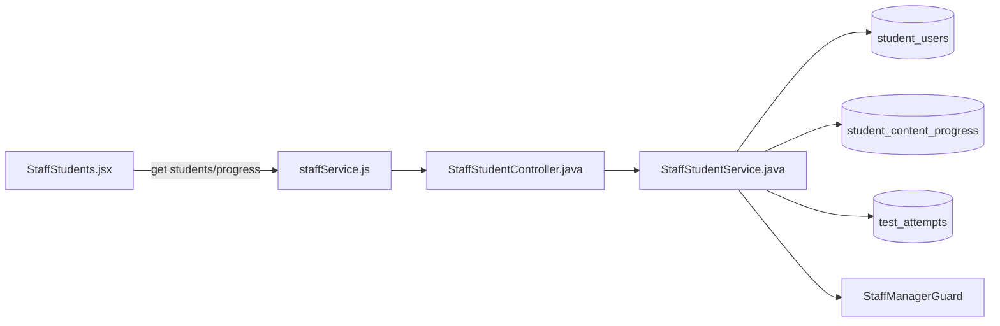
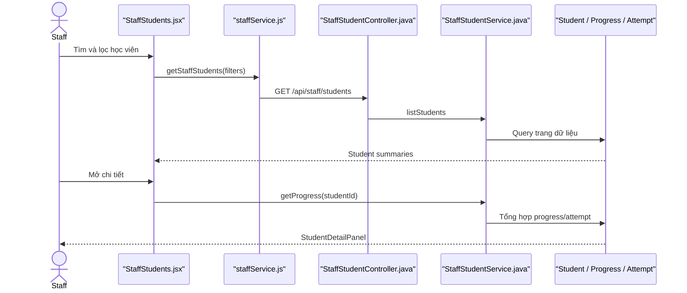

# Manager Student Account Feature Analysis

## 1. Tóm tắt tổng quan

Luồng này là Staff/Staff Manager xem danh sách học viên và tiến độ. Staff thường được xem dữ liệu; riêng khóa/mở khóa yêu cầu `StaffManagerGuard`. Entry point là `/staff/students`.

## 2. Bản đồ cấu trúc

| File | Vai trò | Loại |
|---|---|---|
| [StaffStudents.jsx](apps/frontend/src/features/management/staff/StaffStudents.jsx) | Danh sách, filter và mở chi tiết tiến độ | React Page |
| [StudentDetailPanel.jsx](apps/frontend/src/features/management/components/staff/StudentDetailPanel.jsx) | Hiển thị tiến độ học viên | Component |
| [staffService.js](apps/frontend/src/shared/api/staffService.js) | Gọi Staff Student API | API Service |
| [StaffStudentController.java](apps/backend/src/main/java/com/jlpt/feature/staffcontent/student/controller/StaffStudentController.java) | List/progress/suspend/activate endpoints | Controller |
| [StaffStudentService.java](apps/backend/src/main/java/com/jlpt/feature/staffcontent/student/service/StaffStudentService.java) | Tổng hợp account, progress và attempts | Service |
| [StudentUserRepository.java](apps/backend/src/main/java/com/jlpt/feature/student/StudentUserRepository.java) | Truy vấn học viên | Repository |
| [StudentContentProgressRepository.java](apps/backend/src/main/java/com/jlpt/feature/student/StudentContentProgressRepository.java) | Thống kê tiến độ | Repository |
| [TestAttemptRepository.java](apps/backend/src/main/java/com/jlpt/feature/assessment/TestAttemptRepository.java) | Lấy lịch sử bài làm | Repository |

## 3. Bản đồ kết nối



| Từ | Đến | Cách kết nối | Dữ liệu |
|---|---|---|---|
| Page | staffService | JS async | search/level/status/page |
| staffService | Controller | HTTP | query/path parameters |
| Controller | Service | method | studentId/filter |
| Service | repositories | JPA | account/progress/attempt |

## 4. Luồng xử lý theo trình tự

1. `StaffStudents` debounce từ khóa và gửi filter.
2. `GET /api/staff/students` gọi `StaffStudentService.listStudents`.
3. Service phân trang và map entity thành `StaffStudentSummaryResponse`.
4. Khi chọn học viên, UI gọi `GET /{studentId}/progress`.
5. Service tổng hợp completed progress, attempt và assessment title.
6. `StudentDetailPanel` hiển thị dữ liệu trả về.



## 5. Vai trò đoạn code quan trọng

[StaffStudentController.java#L50](apps/backend/src/main/java/com/jlpt/feature/staffcontent/student/controller/StaffStudentController.java#L50)

```java
@GetMapping("/{studentId}/progress")
public ResponseEntity<ApiResponse<StaffStudentProgressResponse>> progress(@PathVariable Long studentId) {
    // Controller chỉ chuyển ID; service chịu trách nhiệm tổng hợp nhiều nguồn dữ liệu.
    return ResponseEntity.ok(ApiResponse.success("Lấy tiến độ học viên thành công",
            staffStudentService.getProgress(studentId)));
}
```

## 6. Dữ liệu di chuyển

Filter UI → query params → `Page<StudentUser>` → summary DTO → chọn `studentId` → progress/attempt aggregation → detail DTO → panel.

## 7. Bảng tra cứu tổng hợp

| Bước | File | Function | Kết nối tới | Dữ liệu | Ghi chú |
|---:|---|---|---|---|---|
| 1 | `StaffStudents` | effects | API | filters | Debounce |
| 2 | Controller | `list` | Service | query params | Phân trang |
| 3 | Service | `listStudents` | Student repo | accounts | Summary |
| 4 | Controller | `progress` | Service | studentId | Detail |
| 5 | Service | `getProgress` | progress/attempt repos | metrics | Tổng hợp |

## 8. Các mục cần bổ sung context

- Tên “Manager Student Account” trong source tương ứng trang Staff; quyền mutation mới yêu cầu Staff Manager.
- Không tìm thấy quan hệ “Manager sở hữu riêng một nhóm Student”; danh sách là truy vấn hệ thống.

<!-- BACKEND-METHOD-INVENTORY:START -->

## Phụ lục — Danh mục đầy đủ hàm backend

> Phần này được đối chiếu trực tiếp từ source backend hiện tại. Chỉ liệt kê các hàm khai báo tường minh trong những file Java mà tài liệu này tham chiếu; các hàm do Lombok/JPA sinh tự động không xuất hiện trong source nên không liệt kê.

### `TestAttemptRepository`

Nguồn: [TestAttemptRepository.java](../../../apps/backend/src/main/java/com/jlpt/feature/assessment/TestAttemptRepository.java)

| # | Hàm backend (đầy đủ chữ ký) | Endpoint | Tác dụng/chức năng phục vụ |
|---:|---|---|---|
| 1 | [`Page<TestAttempt> findByStudent_IdAndStatusOrderBySubmittedAtDesc(Long studentId, TestAttempt.AttemptStatus status, Pageable pageable)`](../../../apps/backend/src/main/java/com/jlpt/feature/assessment/TestAttemptRepository.java#L18) | `—` | Đọc hoặc tra cứu dữ liệu phục vụ `find by student_ id and status order by submitted at desc`. |
| 2 | [`Page<TestAttempt> findByStudent_IdAndParentIdAndStatusOrderBySubmittedAtDesc(Long studentId, Long parentId, TestAttempt.AttemptStatus status, Pageable pageable)`](../../../apps/backend/src/main/java/com/jlpt/feature/assessment/TestAttemptRepository.java#L21) | `—` | Đọc hoặc tra cứu dữ liệu phục vụ `find by student_ id and parent id and status order by submitted at desc`. |
| 3 | [`List<TestAttempt> findByStudent_IdAndParentIdAndStatus(Long studentId, Long parentId, TestAttempt.AttemptStatus status)`](../../../apps/backend/src/main/java/com/jlpt/feature/assessment/TestAttemptRepository.java#L24) | `—` | Đọc hoặc tra cứu dữ liệu phục vụ `find by student_ id and parent id and status`. |
| 4 | [`Page<TestAttempt> findByStudent_IdAndAttemptTypeAndStatusInOrderBySubmittedAtDesc(Long studentId, TestAttempt.AttemptType attemptType, List<TestAttempt.AttemptStatus> statuses, Pageable pageable)`](../../../apps/backend/src/main/java/com/jlpt/feature/assessment/TestAttemptRepository.java#L27) | `—` | Đọc hoặc tra cứu dữ liệu phục vụ `find by student_ id and attempt type and status in order by submitted at desc`. |
| 5 | [`List<TestAttempt> findByStudent_IdAndStatusIn(Long studentId, List<TestAttempt.AttemptStatus> statuses)`](../../../apps/backend/src/main/java/com/jlpt/feature/assessment/TestAttemptRepository.java#L38) | `—` | Đọc hoặc tra cứu dữ liệu phục vụ `find by student_ id and status in`. |

### `StaffStudentController`

Nguồn: [StaffStudentController.java](../../../apps/backend/src/main/java/com/jlpt/feature/staffcontent/student/controller/StaffStudentController.java)

| # | Hàm backend (đầy đủ chữ ký) | Endpoint | Tác dụng/chức năng phục vụ |
|---:|---|---|---|
| 1 | [`ResponseEntity<ApiResponse<StaffStudentProgressResponse>> progress(@PathVariable Long studentId)`](../../../apps/backend/src/main/java/com/jlpt/feature/staffcontent/student/controller/StaffStudentController.java#L50) | `GET /{studentId}/progress` | Xử lý endpoint `GET /{studentId}/progress`; thực hiện nghiệp vụ `progress`. |
| 2 | [`ResponseEntity<ApiResponse<StaffStudentSummaryResponse>> activate(@PathVariable Long studentId, Authentication authentication)`](../../../apps/backend/src/main/java/com/jlpt/feature/staffcontent/student/controller/StaffStudentController.java#L65) | `POST /{studentId}/activate` | Xử lý endpoint `POST /{studentId}/activate`; thực hiện nghiệp vụ `activate`. |

### `StaffStudentService`

Nguồn: [StaffStudentService.java](../../../apps/backend/src/main/java/com/jlpt/feature/staffcontent/student/service/StaffStudentService.java)

| # | Hàm backend (đầy đủ chữ ký) | Endpoint | Tác dụng/chức năng phục vụ |
|---:|---|---|---|
| 1 | [`StaffStudentListResponse listStudents(String search, String level, String status, int page, int size)`](../../../apps/backend/src/main/java/com/jlpt/feature/staffcontent/student/service/StaffStudentService.java#L48) | `—` | Đọc hoặc tra cứu dữ liệu phục vụ `list students`. |
| 2 | [`StaffStudentProgressResponse getProgress(Long studentId)`](../../../apps/backend/src/main/java/com/jlpt/feature/staffcontent/student/service/StaffStudentService.java#L81) | `—` | Đọc hoặc tra cứu dữ liệu phục vụ `get progress`. |
| 3 | [`StaffStudentSummaryResponse suspend(String actorEmail, Long studentId, String reason)`](../../../apps/backend/src/main/java/com/jlpt/feature/staffcontent/student/service/StaffStudentService.java#L123) | `—` | Cập nhật trạng thái/dữ liệu cho nghiệp vụ `suspend`. |
| 4 | [`StaffStudentSummaryResponse activate(String actorEmail, Long studentId)`](../../../apps/backend/src/main/java/com/jlpt/feature/staffcontent/student/service/StaffStudentService.java#L141) | `—` | Cập nhật trạng thái/dữ liệu cho nghiệp vụ `activate`. |
| 5 | [`int scorePct(TestAttempt a)`](../../../apps/backend/src/main/java/com/jlpt/feature/staffcontent/student/service/StaffStudentService.java#L153) | `—` | Thực hiện xử lý backend `score pct` trong `StaffStudentService`. |
| 6 | [`String resolveTitle(Long assessmentId)`](../../../apps/backend/src/main/java/com/jlpt/feature/staffcontent/student/service/StaffStudentService.java#L165) | `—` | Biến đổi/tổng hợp dữ liệu nội bộ cho `resolve title`. |
| 7 | [`StaffStudentSummaryResponse toSummary(StudentUser s)`](../../../apps/backend/src/main/java/com/jlpt/feature/staffcontent/student/service/StaffStudentService.java#L175) | `—` | Biến đổi/tổng hợp dữ liệu nội bộ cho `to summary`. |

### `StudentContentProgressRepository`

Nguồn: [StudentContentProgressRepository.java](../../../apps/backend/src/main/java/com/jlpt/feature/student/StudentContentProgressRepository.java)

| # | Hàm backend (đầy đủ chữ ký) | Endpoint | Tác dụng/chức năng phục vụ |
|---:|---|---|---|
| 1 | [`Optional<StudentContentProgress> findByStudentIdAndContentTypeAndContentId(Long studentId, StudentContentProgress.ContentType contentType, Long contentId)`](../../../apps/backend/src/main/java/com/jlpt/feature/student/StudentContentProgressRepository.java#L17) | `—` | Đọc hoặc tra cứu dữ liệu phục vụ `find by student id and content type and content id`. |
| 2 | [`List<StudentContentProgress> findByStudentIdAndContentTypeAndContentIdIn(Long studentId, StudentContentProgress.ContentType contentType, Collection<Long> contentIds)`](../../../apps/backend/src/main/java/com/jlpt/feature/student/StudentContentProgressRepository.java#L20) | `—` | Đọc hoặc tra cứu dữ liệu phục vụ `find by student id and content type and content id in`. |
| 3 | [`void deleteByStudentIdAndContentType(Long studentId, StudentContentProgress.ContentType contentType)`](../../../apps/backend/src/main/java/com/jlpt/feature/student/StudentContentProgressRepository.java#L23) | `—` | Xóa mềm, thu hồi hoặc loại bỏ dữ liệu trong `delete by student id and content type`. |
| 4 | [`Optional<StudentContentProgress> findByStudent_IdAndContentTypeAndContentId(Long studentId, StudentContentProgress.ContentType contentType, Long contentId)`](../../../apps/backend/src/main/java/com/jlpt/feature/student/StudentContentProgressRepository.java#L130) | `—` | Đọc hoặc tra cứu dữ liệu phục vụ `find by student_ id and content type and content id`. |
| 5 | [`List<StudentContentProgress> findByStudent_IdAndContentTypeAndContentIdIn(Long studentId, StudentContentProgress.ContentType contentType, List<Long> contentIds)`](../../../apps/backend/src/main/java/com/jlpt/feature/student/StudentContentProgressRepository.java#L133) | `—` | Đọc hoặc tra cứu dữ liệu phục vụ `find by student_ id and content type and content id in`. |
| 6 | [`long countByStudent_IdAndContentTypeAndContentIdInAndStatus(Long studentId, StudentContentProgress.ContentType contentType, List<Long> contentIds, StudentContentProgress.ProgressStatus status)`](../../../apps/backend/src/main/java/com/jlpt/feature/student/StudentContentProgressRepository.java#L136) | `—` | Đếm dữ liệu phục vụ thống kê `count by student_ id and content type and content id in and status`. |

### `StudentUserRepository`

Nguồn: [StudentUserRepository.java](../../../apps/backend/src/main/java/com/jlpt/feature/student/StudentUserRepository.java)

| # | Hàm backend (đầy đủ chữ ký) | Endpoint | Tác dụng/chức năng phục vụ |
|---:|---|---|---|
| 1 | [`Optional<StudentUser> findByEmail(String email)`](../../../apps/backend/src/main/java/com/jlpt/feature/student/StudentUserRepository.java#L15) | `—` | Đọc hoặc tra cứu dữ liệu phục vụ `find by email`. |
| 2 | [`boolean existsByEmail(String email)`](../../../apps/backend/src/main/java/com/jlpt/feature/student/StudentUserRepository.java#L17) | `—` | Kiểm tra điều kiện/trạng thái phục vụ `exists by email`. |

**Tổng cộng:** `22` hàm backend trong `5` file Java được tham chiếu.

<!-- BACKEND-METHOD-INVENTORY:END -->
