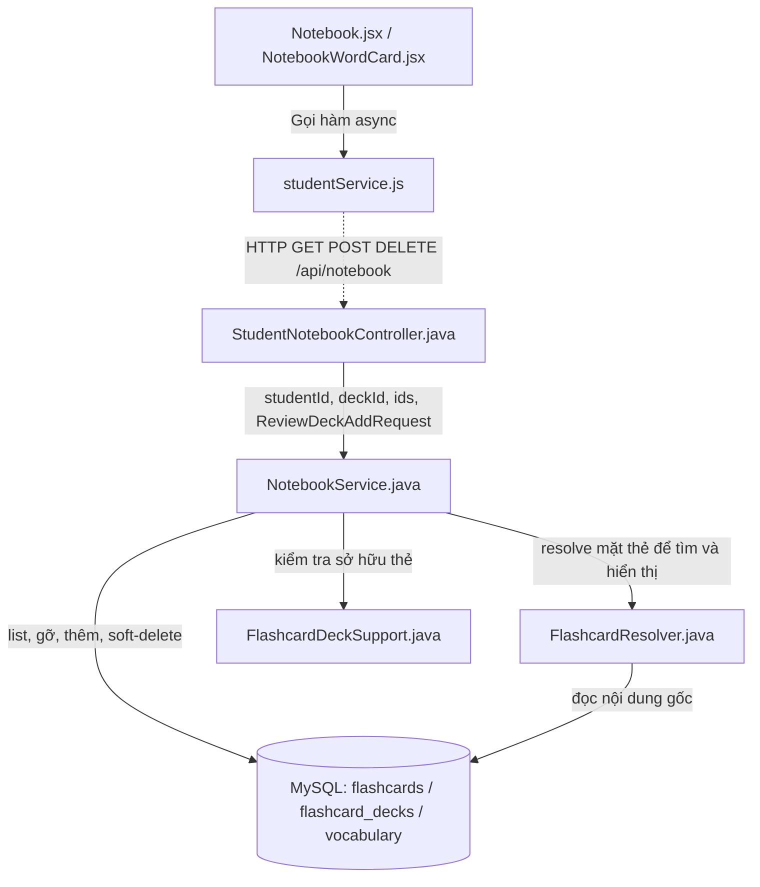
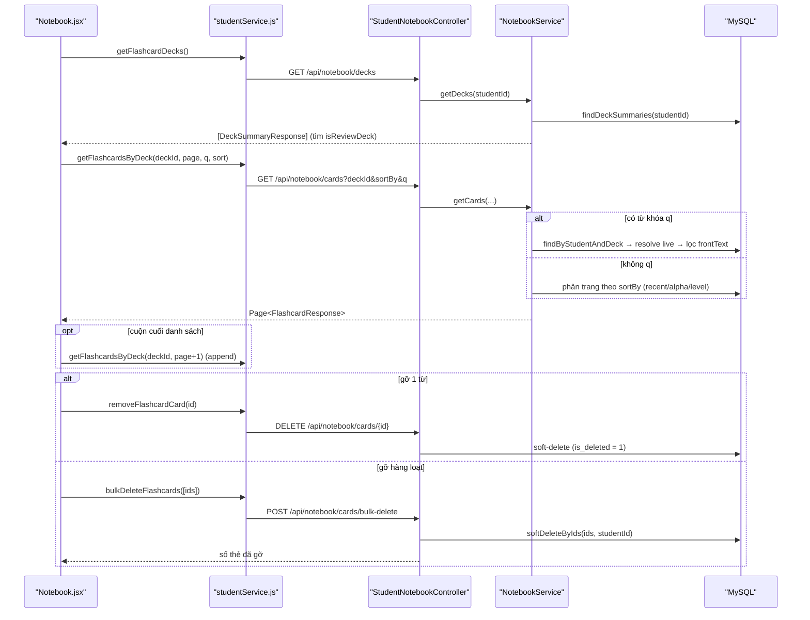

# Phân Tích Cấu Trúc – Luồng – Kết Nối Của Feature: Sổ Tay "Từ cần ôn lại" (Notebook)

> Kho gom các từ vựng học viên cần ghi nhớ. Backend thuộc package `feature.flashcard` (dùng chung entity với phiên ôn), nhưng có Controller/Service riêng.
> Hai tính năng anh em xem [flashcard_feature_analysis.md](flashcard_feature_analysis.md) và [dictionary_feature_analysis.md](dictionary_feature_analysis.md).
>
> _Cập nhật 2026-07-22: API Sổ tay đã tách khỏi `/api/flashcards` sang route riêng `/api/notebook/*` (controller `StudentNotebookController`); logic sổ "Từ cần ôn lại" chuyển hẳn vào `NotebookService`._

## 1. Tóm tắt tổng quan

Sổ Tay là kho **tập trung** các từ cần chú ý, được nạp theo hai nguồn:
- **Bán tự động**: các từ trả lời sai cuối phiên Flashcard (học viên bấm xác nhận).
- **Thủ công**: lưu một từ từ Từ điển.

Trang chỉ **liệt kê / tìm / sắp xếp / gỡ** từ — **không** tự chạy phiên ôn (việc ôn diễn ra ở phiên Flashcard theo topic). Mỗi nội dung chỉ tồn tại **một** thẻ (idempotent): nếu từ đã học ở sổ khác thì được **chuyển** sang sổ "Từ cần ôn lại", không tạo bản trùng.

- **Tầng Frontend (React 18)**: trang `Notebook.jsx` + component `NotebookWordCard.jsx`, cuộn vô hạn bằng `IntersectionObserver`, state cục bộ (`useState`/`useEffect`).
- **Tầng Backend (Spring Boot 3 + Java 21)**: Controller `StudentNotebookController` → Service `NotebookService` → Repository JPA → Entity `Flashcard`/`FlashcardDeck` (deck có `is_review_deck = true`).
- **Điểm vào (Entry point)**:
  - FE: [App.jsx](apps/frontend/src/App.jsx#L107-L112) — route `/notebook`.
  - BE: [StudentNotebookController.java](apps/backend/src/main/java/com/jlpt/feature/flashcard/controller/StudentNotebookController.java) — `/api/notebook/*`.

---

## 2. Bản đồ cấu trúc (các "mảnh" và vai trò)

| File | Vai trò | Loại |
|------|---------|------|
| [Notebook.jsx](apps/frontend/src/pages/notebook/Notebook.jsx) | Trang Sổ tay: liệt kê/tìm/sắp xếp, cuộn vô hạn, gỡ 1 từ hoặc gỡ hàng loạt. | Page (React) |
| [NotebookWordCard.jsx](apps/frontend/src/components/student/NotebookWordCard.jsx) | Thẻ hiển thị một từ trong Sổ tay (chọn/gỡ). | Component |
| [studentService.js](apps/frontend/src/api/studentService.js) | Gọi HTTP `getFlashcardDecks`, `getFlashcardsByDeck`, `removeFlashcardCard`, `bulkDeleteFlashcards`, `addWrongWordsToReviewDeck`/`saveToNotebook`. | API Service |
| [StudentNotebookController.java](apps/backend/src/main/java/com/jlpt/feature/flashcard/controller/StudentNotebookController.java) | Nhận `/api/notebook/*`: list deck/thẻ, gỡ thẻ, gỡ hàng loạt, thêm từ vào sổ. `@PreAuthorize("hasRole('STUDENT')")`. | Controller |
| [NotebookService.java](apps/backend/src/main/java/com/jlpt/feature/flashcard/service/NotebookService.java) | CRUD sổ/thẻ (list, tìm server-side, gỡ, gỡ hàng loạt) + nạp sổ "Từ cần ôn lại" (`getOrCreateReviewDeck` nội bộ, `addWrongWordsToReviewDeck`). | Service |
| [FlashcardResolver.java](apps/backend/src/main/java/com/jlpt/feature/flashcard/service/FlashcardResolver.java) | Resolve **live** mặt thẻ để hiển thị/tìm; nạp nội dung theo lô tránh N+1 (dùng chung với phiên ôn). | Component |
| [FlashcardDeckSupport.java](apps/backend/src/main/java/com/jlpt/feature/flashcard/service/FlashcardDeckSupport.java) | Sổ tay chỉ dùng `ownCardOrThrow` (sở hữu thẻ). Deck "Từ cần ôn lại" là chuyện riêng của Sổ tay → nằm trong `NotebookService`. | Service (helper) |
| [Flashcard.java](apps/backend/src/main/java/com/jlpt/feature/flashcard/Flashcard.java) / [FlashcardDeck.java](apps/backend/src/main/java/com/jlpt/feature/flashcard/FlashcardDeck.java) | Entity thẻ (soft-delete) và deck; `is_review_deck = true` là sổ auto "Từ cần ôn lại". | Entity |
| [FlashcardRepository / FlashcardDeckRepository](apps/backend/src/main/java/com/jlpt/feature/flashcard/repository/) | `findByStudentAndDeck`, `findByStudent`, `findByStudentAndContent`, `softDeleteByIds`, `findDeckSummaries`. | Repository |
| [BulkDeleteRequest / ReviewDeckAddRequest / ReviewDeckAddResponse / DeckSummaryResponse / FlashcardResponse](apps/backend/src/main/java/com/jlpt/feature/flashcard/dto/) | DTO vào/ra của Sổ tay. | DTO |

---

## 3. Bản đồ kết nối (ai gọi ai, dữ liệu truyền qua đâu)



**Bảng tra cứu kết nối chính:**

| Từ (File A) | Đến (File B) | Cách kết nối | Dữ liệu truyền |
|---|---|---|---|
| `Notebook.jsx` | `studentService.js` | Gọi hàm async | `deckId, page, size, q, sort`; `flashcardId`; `[ids]`; `{ items, reason }` |
| `studentService.js` | `StudentNotebookController` | HTTP GET/POST/DELETE | Query params + JSON body (`BulkDeleteRequest`, `ReviewDeckAddRequest`) |
| `StudentNotebookController` | `NotebookService` | Dependency Injection | `studentId`, `deckId`, `sortBy`, `ids`, `ReviewDeckAddRequest` |
| `NotebookService` | `FlashcardResolver` | Gọi hàm | `List<Flashcard>` → `ContentMaps` → `FlashcardResponse` |
| `NotebookService` | `FlashcardDeckSupport` | Gọi hàm | `flashcardId`, `studentId` → `Flashcard` (chỉ `ownCardOrThrow`) |
| `NotebookService` | `FlashcardRepository` | JPA method / `@Query` | Entity `Flashcard`/`FlashcardDeck` (list, tìm content, soft-delete) |

---

## 4. Luồng xử lý theo trình tự

**Ví dụ 1: Mở sổ, liệt kê và tìm**

1. Mở `/notebook` → [loadDeck()](apps/frontend/src/pages/notebook/Notebook.jsx#L54-L69) gọi `getFlashcardDecks()` → `GET /api/notebook/decks`; tìm deck có `isReviewDeck = true`.
2. [loadCards()](apps/frontend/src/pages/notebook/Notebook.jsx#L73-L88) gọi `getFlashcardsByDeck(deckId, page, size, q, false, sort)` → `GET /api/notebook/cards?deckId=…&sortBy=…`.
3. [NotebookService.getCards()](apps/backend/src/main/java/com/jlpt/feature/flashcard/service/NotebookService.java#L65-L118): nếu có `q` thì **resolve live rồi lọc mặt trước server-side** (không bỏ sót ngoài trang đầu); nếu không thì phân trang theo `sortBy` (`recent/alpha/level`), resolve qua `FlashcardResolver`.
4. Cuộn xuống cuối → `IntersectionObserver` gọi trang kế (append).

**Ví dụ 2: Gỡ từ**

- Gỡ 1 từ → `DELETE /api/notebook/cards/{id}` (soft-delete `is_deleted = 1`).
- Gỡ nhiều → `POST /api/notebook/cards/bulk-delete` với `{ ids }` → `softDeleteByIds(ids, studentId)`, trả số thẻ đã gỡ.

**Ví dụ 3: Nạp từ (điểm hợp lưu 3 tính năng)**

- Từ sai cuối phiên Flashcard hoặc lưu thủ công ở Từ điển đều gọi `POST /api/notebook/words` với `{ items:[{contentType:'VOCABULARY', contentId}], reason:'wrong'|'manual' }`.



---

## 5. Vai trò từng đoạn code quan trọng

### 1. Tìm kiếm server-side không bỏ sót
**File**: [NotebookService.java](apps/backend/src/main/java/com/jlpt/feature/flashcard/service/NotebookService.java) (dòng 75-90)
```java
if (needle != null && !needle.isEmpty()) {
    // Lấy TẤT CẢ thẻ (theo deck hoặc toàn bộ student), resolve live rồi mới lọc theo mặt trước —
    // không bị giới hạn bởi paging DB nên không bỏ sót thẻ nằm ngoài trang đầu.
    List<Flashcard> all = deckId != null
            ? flashcardRepository.findByStudentAndDeck(studentId, deckId)
            : flashcardRepository.findByStudent(studentId);
    ContentMaps maps = resolver.loadContentMaps(all);       // nạp nội dung 1 lần → tránh N+1
    List<FlashcardResponse> matched = all.stream()
            .map(c -> resolver.toFlashcardResponse(c, maps))
            .filter(r -> r.frontText() != null && r.frontText().toLowerCase().contains(needle))
            .sorted(responseComparator(sortKey))
            .toList();
    return new PageImpl<>(matched.subList(from, to), pageable, matched.size()); // phân trang thủ công
}
```
**Giải thích**: Vì mặt thẻ được **resolve live** từ nội dung gốc (không lưu cứng trong bảng `flashcards`), lọc ở SQL sẽ không thấy `frontText`. Do đó tìm kiếm phải nạp nội dung theo lô rồi lọc in-memory. Đây cũng là lý do param sắp xếp trên URL đặt tên `sortBy` (không phải `sort`) — `sort` là param dành riêng cho `Pageable`, nếu trùng Spring sẽ tự thêm `ORDER BY` thứ hai vào JPQL đã có `ORDER BY` → 500.

### 2. Nạp/chuyển thẻ vào sổ "Từ cần ôn lại" (cầu nối 3 tính năng)
**File**: [NotebookService.java](apps/backend/src/main/java/com/jlpt/feature/flashcard/service/NotebookService.java) (dòng 137-179)
```java
public ReviewDeckAddResponse addWrongWordsToReviewDeck(Long studentId, ReviewDeckAddRequest request) {
    FlashcardDeck deck = getOrCreateReviewDeck(student);                       // sổ auto per-student (helper riêng)
    String reason = ... ? request.reason() : "manual";                        // 'wrong' | 'manual'
    for (ReviewDeckAddRequest.Item item : request.items()) {
        Optional<Flashcard> existing = flashcardRepository.findByStudentAndContent(studentId, VOCABULARY, contentId);
        if (existing.isPresent()) {
            // Mỗi nội dung chỉ 1 thẻ: nếu đã học ở sổ khác → CHUYỂN sang sổ "Từ cần ôn lại";
            // chỉ bỏ qua khi thẻ đã nằm sẵn trong sổ này (tránh lưu thủ công bị "im lặng").
            if (card.getDeck() != null && deck.getId().equals(card.getDeck().getId())) skipped++;
            else { card.setDeck(deck); card.setAddedReason(reason); flashcardRepository.save(card); added++; }
        } else { /* tạo thẻ mới trỏ vào vocabulary_id */ added++; }
    }
    return new ReviewDeckAddResponse(deck.getId(), deck.getName(), added, skipped);
}
```
**Giải thích**: Cùng một endpoint (`POST /api/notebook/words`) phục vụ cả hai nguồn — từ sai của Flashcard (`reason=wrong`) và lưu thủ công ở Từ điển (`reason=manual`). Đây là **điểm hợp lưu** của cả cụm 3 tính năng. `getOrCreateReviewDeck` là method **riêng** của `NotebookService` (không nằm ở `FlashcardDeckSupport`) vì sổ "Từ cần ôn lại" chỉ thuộc domain Sổ tay. Logic đảm bảo **idempotent**: một nội dung chỉ có một thẻ.

### 3. Sở hữu thẻ trước khi gỡ (chống thao tác chéo tài khoản)
**File**: [FlashcardDeckSupport.java](apps/backend/src/main/java/com/jlpt/feature/flashcard/service/FlashcardDeckSupport.java) (dòng 28-37)
```java
public Flashcard ownCardOrThrow(Long flashcardId, Long studentId) {
    Flashcard card = flashcardRepository.findById(flashcardId)
            .orElseThrow(() -> new ResourceNotFoundException("Flashcard", flashcardId));
    if (card.getStudent() == null || !studentId.equals(card.getStudent().getId())) {
        throw new ForbiddenException("Flashcard không thuộc về bạn");   // 403
    }
    return card;
}
```
**Giải thích**: Mọi thao tác trên một thẻ đơn (gỡ) đều ép quyền sở hữu trước — không tin `id` từ client. Gỡ hàng loạt dùng `softDeleteByIds(ids, studentId)` với điều kiện `studentId` ngay trong `@Query` để đạt hiệu quả tương đương.

---

## 6. Dữ liệu di chuyển như thế nào

Theo dõi **một từ vựng** khi vào Sổ tay:

1. FE gửi `{ contentType: 'VOCABULARY', contentId: <vocabulary_id>, reason }`.
2. Backend **không copy nội dung** — chỉ tạo/chuyển một dòng `flashcards` trỏ tới `content_id` + gán `deck_id` của sổ "Từ cần ôn lại" + `added_reason`.
3. Khi hiển thị lại, `FlashcardResolver` **resolve live** từ `content_id`: nếu vocab bị gỡ/không `PUBLISHED` thì thẻ trả `frontText = null` và bị ẩn (FR-FC-34).
4. Sổ **không** ghi trạng thái học riêng: nó phản chiếu các cột SRS của chính dòng `flashcards` (`isDue`, `nextReviewDate`, `intervalDays`, `repetitionCount`, `lastRating`). Việc ôn thực tế cập nhật các cột này diễn ra ở **phiên Flashcard** theo topic.

> Điểm mấu chốt: cùng một dòng `flashcards` vừa nằm trong Sổ tay (deck `is_review_deck`), vừa được ôn qua phiên topic (tra theo `(student, content)` bất kể deck) → một nguồn sự thật duy nhất.

---

## 7. Input / Output / Progress / Target

| Khía cạnh | Chi tiết |
|---|---|
| **Input** | Tra deck: (không tham số). List thẻ: `deckId, page, size, q?, dueOnly, sortBy(recent/alpha/level)`. Gỡ: `flashcardId` (đơn) hoặc `{ ids: [] }` (hàng loạt). Nạp: `{ items:[{contentType:'VOCABULARY', contentId}], reason:'wrong'|'manual' }`. |
| **Output** | `DeckSummaryResponse { deckId, deckName, totalCards, isReviewDeck }`; `Page<FlashcardResponse>` (mỗi thẻ: `flashcardId, frontText, meaning, furigana, audioUrl, jlptLevel, nextReviewDate, intervalDays, repetitionCount, lastRating, addedReason, isDue`); số thẻ đã gỡ; `ReviewDeckAddResponse { deckId, name, addedCount, skippedCount }`. |
| **Progress** | Bản thân sổ **không chạy phiên ôn**; nó phản chiếu trạng thái SRS của thẻ (`isDue`, `nextReviewDate`, `intervalDays`) và tổng số từ (`totalCards`). |
| **Target** | Là **kho ghi chú tập trung** các từ cần chú ý (trả lời sai + lưu thủ công), cho phép tìm/sắp xếp/gỡ để học viên chủ động quản lý danh sách từ yếu. Mỗi nội dung chỉ tồn tại **một** thẻ (idempotent). |

---

## 8. Bảng tra cứu tổng hợp (endpoint)

| Bước | Method + Path | FE function | Service | Input | Output |
|---|---|---|---|---|---|
| List deck | `GET /api/notebook/decks` | `getFlashcardDecks` | `NotebookService.getDecks` | — | `List<DeckSummaryResponse>` |
| List thẻ | `GET /api/notebook/cards` | `getFlashcardsByDeck` | `NotebookService.getCards` | `deckId, page, size, q, dueOnly, sortBy` | `Page<FlashcardResponse>` |
| Gỡ 1 thẻ | `DELETE /api/notebook/cards/{id}` | `removeFlashcardCard` | `NotebookService.deleteCard` | `flashcardId` | `Void` (soft-delete) |
| Gỡ hàng loạt | `POST /api/notebook/cards/bulk-delete` | `bulkDeleteFlashcards` | `NotebookService.bulkDelete` | `{ ids[] }` | `int` (số đã gỡ) |
| Thêm từ vào sổ | `POST /api/notebook/words` | `addWrongWordsToReviewDeck` / `saveToNotebook` | `NotebookService.addWrongWordsToReviewDeck` | `ReviewDeckAddRequest` | `ReviewDeckAddResponse` |

> Toàn bộ endpoint yêu cầu `@PreAuthorize("hasRole('STUDENT')")`. Route `/api/notebook/**` cũng được bảo vệ bởi `anyRequest().authenticated()` trong `SecurityConfig`.

---

## 9. Các mục cần bổ sung context (nếu có)

- **`getOrCreateReviewDeck`**: nằm **riêng** trong `NotebookService` (không ở `FlashcardDeckSupport`) vì sổ "Từ cần ôn lại" chỉ thuộc domain Sổ tay; chỉ có tối đa một deck `is_review_deck` per-student.
- **Repository chi tiết**: JPQL cụ thể của `findDeckSummaries` (GROUP BY tính `totalCards`), `softDeleteByIds`, `findByStudentAndContent` được suy vai trò từ chỗ gọi ở Service; chưa trích toàn văn ở đây.
- **Component con** (`NotebookWordCard.jsx`): chỉ khảo sát trang cha `Notebook.jsx`; vai trò component suy từ props (chọn/gỡ) truyền vào.
