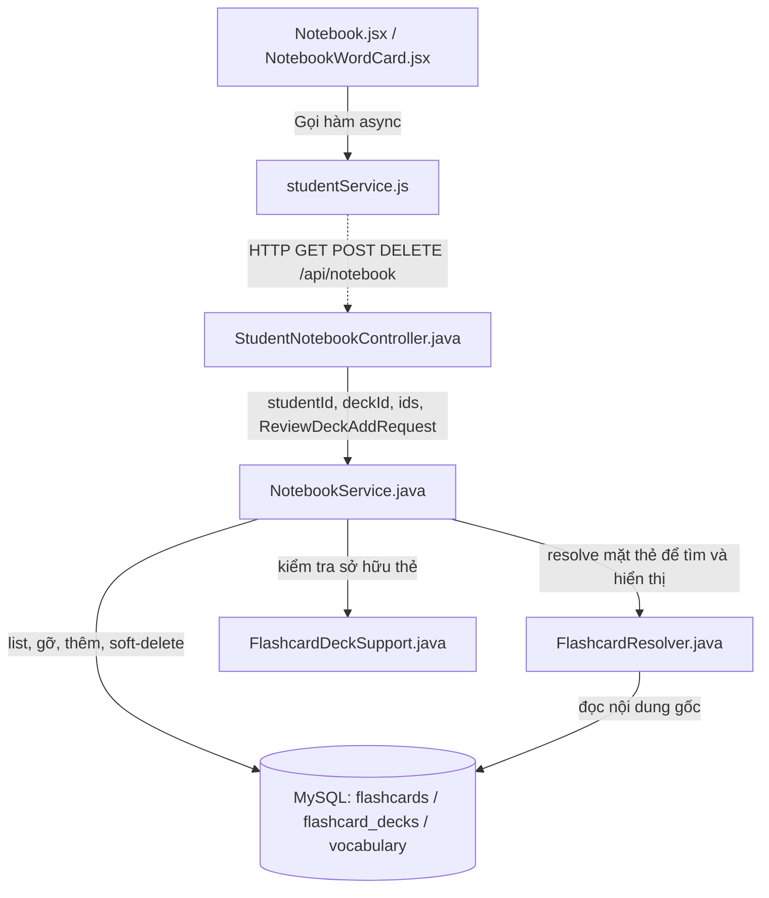
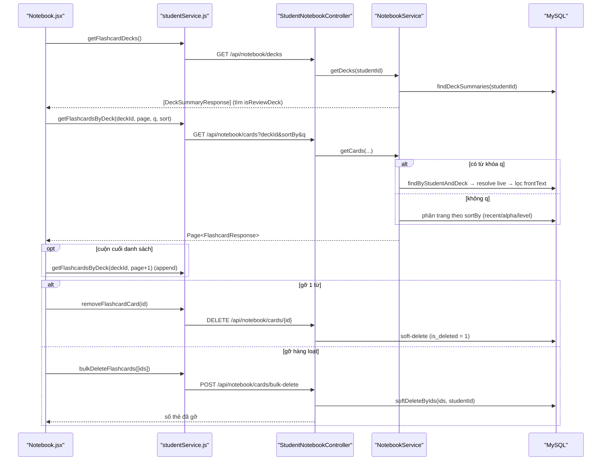

# Phân Tích Cấu Trúc – Luồng – Kết Nối Của Feature: Sổ Tay "Từ cần ôn lại" (Notebook)

> Kho gom các từ vựng học viên cần ghi nhớ. Backend thuộc package `feature.flashcard` (dùng chung entity với phiên ôn), nhưng có Controller/Service riêng.
> Hai tính năng anh em xem [flashcard_feature_analysis.md](flashcard_feature_analysis.md) và [dictionary_feature_analysis.md](dictionary_feature_analysis.md).
>
> _Cập nhật 2026-07-22: API Sổ tay đã tách khỏi `/api/flashcards` sang route riêng `/api/notebook/*` (controller `StudentNotebookController`); logic sổ "Từ cần ôn lại" chuyển hẳn vào `NotebookService`._
>
> _Cập nhật 2026-07-26: FE đã tái cấu trúc sang Feature-Based Architecture (commit `9915c443`) — `Notebook.jsx` sang `src/features/notebook/notebook/`, `NotebookWordCard.jsx` sang `src/features/dashboard/student/`, `studentService.js` sang `src/shared/api/`; import dùng alias `@/`. Backend không đổi._

## 0. Ghi nhớ nhanh (cheat-sheet)

**Câu thần chú**: *"Sổ tay là danh sách theo dõi, không phải chỗ ôn. Một nội dung — một thẻ."*

| # | Điều cần nhớ | Vì sao dễ quên / dễ sai |
|---|---|---|
| 1 | **Sổ tay KHÔNG chạy phiên ôn** — chỉ liệt kê / tìm / sắp xếp / gỡ | Nhánh ôn theo `deckId` đã bị gỡ (2026-07-17); muốn ôn thì vào phiên Flashcard theo topic |
| 2 | **Một nội dung chỉ có MỘT thẻ** (idempotent) — đã tồn tại ở sổ khác thì **chuyển**, không tạo bản trùng | Chỉ `skipped` khi thẻ đã nằm sẵn trong chính sổ này; nếu không, "lưu thủ công" sẽ im lặng không vào sổ |
| 3 | **Sổ dùng chung dòng `flashcards` với phiên ôn** — không có trạng thái học riêng | Vì thế `isDue`/`nextReviewDate` hiển thị trong sổ chính là kết quả ôn ở màn Flashcard |
| 4 | **Param sắp xếp tên là `sortBy`, KHÔNG phải `sort`** | `sort` là param dành riêng cho `Pageable` → Spring tự thêm `ORDER BY` thứ hai vào JPQL đã có `ORDER BY` → **500** |
| 5 | **Tìm kiếm chạy in-memory, không phải SQL `LIKE`** | Vì `frontText` được resolve live từ bảng nội dung gốc, SQL không "thấy" nó để lọc |
| 6 | **Gỡ = soft-delete** (`is_deleted = 1`), đúng ADR-004 | Không có `DELETE FROM` ở bất kỳ đâu trong luồng này |
| 7 | Sổ "Từ cần ôn lại" = deck có **`is_review_deck = true`**, mỗi student tối đa 1 | Tạo lười (lazy) — chỉ sinh ra khi có từ đầu tiên cần thêm |
| 8 | **Sổ chỉ chứa `contentType = VOCABULARY`** — thẻ là con trỏ tới `vocabulary_id`, không chứa chữ | Gỡ một từ khỏi `PUBLISHED` làm thẻ "biến mất" mà không ai xoá nó — xem [§10](#10-liên-quan-từ-vựng-vocabulary--thứ-thực-sự-nằm-trong-sổ) |

**Sơ đồ 1 dòng**: `Từ sai (phiên ôn) ─┐` + `Lưu thủ công (Từ điển) ─┘` → `POST /api/notebook/words` → `sổ is_review_deck` → *liệt kê / tìm / gỡ*

---

## 1. Tóm tắt tổng quan

Sổ Tay là kho **tập trung** các từ cần chú ý, được nạp theo hai nguồn:
- **Bán tự động**: các từ trả lời sai cuối phiên Flashcard (học viên bấm xác nhận).
- **Thủ công**: lưu một từ từ Từ điển.

Trang chỉ **liệt kê / tìm / sắp xếp / gỡ** từ — **không** tự chạy phiên ôn (việc ôn diễn ra ở phiên Flashcard theo topic). Mỗi nội dung chỉ tồn tại **một** thẻ (idempotent): nếu từ đã học ở sổ khác thì được **chuyển** sang sổ "Từ cần ôn lại", không tạo bản trùng.

- **Tầng Frontend (React 18)**: trang `Notebook.jsx` + component `NotebookWordCard.jsx`, cuộn vô hạn bằng `IntersectionObserver`, state cục bộ (`useState`/`useEffect`).
- **Tầng Backend (Spring Boot 3 + Java 21)**: Controller `StudentNotebookController` → Service `NotebookService` → Repository JPA → Entity `Flashcard`/`FlashcardDeck` (deck có `is_review_deck = true`).
- **Điểm vào (Entry point)**:
  - FE: [App.jsx](apps/frontend/src/App.jsx#L106-L110) — route `/notebook`.
  - BE: [StudentNotebookController.java](apps/backend/src/main/java/com/jlpt/feature/flashcard/controller/StudentNotebookController.java) — `/api/notebook/*`.

### 1.1 Chức năng tương ứng

| Chức năng | Người dùng thao tác / nguồn phát sinh | API / hàm xử lý | Tác dụng chính |
|---|---|---|---|
| Xem danh sách sổ | Mở trang `/notebook` | `GET /api/notebook/decks` → `NotebookService.getDecks()` | Lấy các deck của học viên và xác định sổ `isReviewDeck = true` để hiển thị "Từ cần ôn lại". |
| Xem danh sách từ trong sổ | Trang có `deckId` sau khi tải deck | `GET /api/notebook/cards` → `NotebookService.getCards()` | Trả `Page<FlashcardResponse>` gồm mặt thẻ đã resolve live từ `vocabulary`, kèm trạng thái SRS hiện tại. |
| Tìm từ trong sổ | Nhập từ khóa `q` | `getCards(deckId, q, sortBy, pageable)` | Lọc server-side trên `frontText` sau khi resolve nội dung, tránh chỉ tìm trong trang đầu. |
| Sắp xếp danh sách | Chọn `recent`, `alpha`, `level` | `normalizeSort()` + query/sort tương ứng | Đổi thứ tự hiển thị theo mới thêm, alphabet hoặc JLPT level; bắt buộc dùng param `sortBy`. |
| Cuộn vô hạn | Kéo tới cuối danh sách | FE `IntersectionObserver` → `GET /api/notebook/cards?page=n` | Nạp trang kế tiếp và append vào danh sách hiện tại. |
| Gỡ một từ | Bấm "Gỡ" trên một thẻ | `DELETE /api/notebook/cards/{id}` → `NotebookService.deleteCard()` | Soft-delete đúng thẻ thuộc học viên (`is_deleted = 1`), không hard delete. |
| Gỡ nhiều từ | Chọn nhiều thẻ rồi gỡ hàng loạt | `POST /api/notebook/cards/bulk-delete` → `NotebookService.bulkDelete()` | Soft-delete nhiều thẻ trong một request, trả số thẻ đã gỡ. |
| Thêm từ vào sổ | Từ sai cuối phiên Flashcard hoặc lưu thủ công từ Từ điển | `POST /api/notebook/words` → `NotebookService.addWrongWordsToReviewDeck()` | Tạo hoặc chuyển thẻ vào sổ "Từ cần ôn lại"; idempotent theo `(student, contentType, contentId)`. |

---
---

## 2. Bản đồ cấu trúc (các "mảnh" và vai trò)

| File | Vai trò | Loại |
|------|---------|------|
| [Notebook.jsx](apps/frontend/src/features/notebook/notebook/Notebook.jsx) | Trang Sổ tay: liệt kê/tìm/sắp xếp, cuộn vô hạn, gỡ 1 từ hoặc gỡ hàng loạt. | Page (React) |
| [NotebookWordCard.jsx](apps/frontend/src/features/dashboard/student/NotebookWordCard.jsx) | Thẻ hiển thị một từ trong Sổ tay (chọn/gỡ). | Component |
| [studentService.js](apps/frontend/src/shared/api/studentService.js) | Gọi HTTP `getFlashcardDecks`, `getFlashcardsByDeck`, `removeFlashcardCard`, `bulkDeleteFlashcards`, `addWrongWordsToReviewDeck`/`saveToNotebook`. | API Service |
| [StudentNotebookController.java](apps/backend/src/main/java/com/jlpt/feature/flashcard/controller/StudentNotebookController.java) | Nhận `/api/notebook/*`: list deck/thẻ, gỡ thẻ, gỡ hàng loạt, thêm từ vào sổ. `@PreAuthorize("hasRole('STUDENT')")`. | Controller |
| [NotebookService.java](apps/backend/src/main/java/com/jlpt/feature/flashcard/service/NotebookService.java) | CRUD sổ/thẻ (list, tìm server-side, gỡ, gỡ hàng loạt) + nạp sổ "Từ cần ôn lại" (`getOrCreateReviewDeck` nội bộ, `addWrongWordsToReviewDeck`). | Service |
| [FlashcardResolver.java](apps/backend/src/main/java/com/jlpt/feature/flashcard/service/FlashcardResolver.java) | Resolve **live** mặt thẻ để hiển thị/tìm; nạp nội dung theo lô tránh N+1 (dùng chung với phiên ôn). | Component |
| [FlashcardDeckSupport.java](apps/backend/src/main/java/com/jlpt/feature/flashcard/service/FlashcardDeckSupport.java) | Sổ tay chỉ dùng `ownCardOrThrow` (sở hữu thẻ). Deck "Từ cần ôn lại" là chuyện riêng của Sổ tay → nằm trong `NotebookService`. | Service (helper) |
| [Flashcard.java](apps/backend/src/main/java/com/jlpt/feature/flashcard/Flashcard.java) / [FlashcardDeck.java](apps/backend/src/main/java/com/jlpt/feature/flashcard/FlashcardDeck.java) | Entity thẻ (soft-delete) và deck; `is_review_deck = true` là sổ auto "Từ cần ôn lại". | Entity |
| [FlashcardRepository / FlashcardDeckRepository](apps/backend/src/main/java/com/jlpt/feature/flashcard/repository/) | `findByStudentAndDeck`, `findByStudent`, `findByStudentAndContent`, `softDeleteByIds`, `findDeckSummaries`. | Repository |
| [BulkDeleteRequest / ReviewDeckAddRequest / ReviewDeckAddResponse / DeckSummaryResponse / FlashcardResponse](apps/backend/src/main/java/com/jlpt/feature/flashcard/dto/) | DTO vào/ra của Sổ tay. | DTO |

---

## 3. Bản đồ kết nối (ai gọi ai, dữ liệu truyền qua đâu)


```mermaid
graph TD
    UI["Notebook.jsx / NotebookWordCard.jsx"] -->|Gọi hàm async| SVC["studentService.js"]
    SVC -.->|HTTP GET POST DELETE /api/notebook| Ctrl["StudentNotebookController.java"]
    Ctrl -->|studentId, deckId, ids, ReviewDeckAddRequest| Nbs["NotebookService.java"]
    Nbs -->|resolve mặt thẻ để tìm và hiển thị| Res["FlashcardResolver.java"]
    Nbs -->|kiểm tra sở hữu thẻ| Sup["FlashcardDeckSupport.java"]
    Nbs -->|list, gỡ, thêm, soft-delete| DB[("MySQL: flashcards / flashcard_decks / vocabulary")]
    Res -->|đọc nội dung gốc| DB
```

**Bảng tra cứu kết nối chính:**

| Từ (File A) | Đến (File B) | Cách kết nối | Dữ liệu truyền |
|---|---|---|---|
| `Notebook.jsx` | `studentService.js` | Gọi hàm async | `deckId, page, size, q, sort`; `flashcardId`; `[ids]`; `{ items, reason }` |
| `studentService.js` | `StudentNotebookController` | HTTP GET/POST/DELETE | Query params + JSON body (`BulkDeleteRequest`, `ReviewDeckAddRequest`) |
| `StudentNotebookController` | `NotebookService` | Dependency Injection | `studentId`, `deckId`, `sortBy`, `ids`, `ReviewDeckAddRequest` |
| `NotebookService` | `FlashcardResolver` | Gọi hàm | `List<Flashcard>` → `ContentMaps` → `FlashcardResponse` |
| `NotebookService` | `FlashcardDeckSupport` | Gọi hàm | `flashcardId`, `studentId` → `Flashcard` (chỉ `ownCardOrThrow`) |
| `NotebookService` | `FlashcardRepository` | JPA method / `@Query` | Entity `Flashcard`/`FlashcardDeck` (list, tìm content, soft-delete) |

---

## 4. Luồng xử lý theo trình tự

**Ví dụ 1: Mở sổ, liệt kê và tìm**

1. Mở `/notebook` → [loadDeck()](apps/frontend/src/features/notebook/notebook/Notebook.jsx#L54-L69) gọi `getFlashcardDecks()` → `GET /api/notebook/decks`; tìm deck có `isReviewDeck = true`.
2. [loadCards()](apps/frontend/src/features/notebook/notebook/Notebook.jsx#L73-L88) gọi `getFlashcardsByDeck(deckId, page, size, q, false, sort)` → `GET /api/notebook/cards?deckId=…&sortBy=…`.
3. [NotebookService.getCards()](apps/backend/src/main/java/com/jlpt/feature/flashcard/service/NotebookService.java#L66-L119): nếu có `q` thì **resolve live rồi lọc mặt trước server-side** (không bỏ sót ngoài trang đầu); nếu không thì phân trang theo `sortBy` (`recent/alpha/level`), resolve qua `FlashcardResolver`.
4. Cuộn xuống cuối → `IntersectionObserver` gọi trang kế (append).

**Ví dụ 2: Gỡ từ**

- Gỡ 1 từ → `DELETE /api/notebook/cards/{id}` (soft-delete `is_deleted = 1`).
- Gỡ nhiều → `POST /api/notebook/cards/bulk-delete` với `{ ids }` → `softDeleteByIds(ids, studentId)`, trả số thẻ đã gỡ.

**Ví dụ 3: Nạp từ (điểm hợp lưu 3 tính năng)**

- Từ sai cuối phiên Flashcard hoặc lưu thủ công ở Từ điển đều gọi `POST /api/notebook/words` với `{ items:[{contentType:'VOCABULARY', contentId}], reason:'wrong'|'manual' }`.


```mermaid
sequenceDiagram
    participant UI as "Notebook.jsx"
    participant API as "studentService.js"
    participant Ctrl as "StudentNotebookController"
    participant Nbs as "NotebookService"
    participant DB as "MySQL"

    UI->>API: getFlashcardDecks()
    API->>Ctrl: GET /api/notebook/decks
    Ctrl->>Nbs: getDecks(studentId)
    Nbs->>DB: findDeckSummaries(studentId)
    Nbs-->>UI: [DeckSummaryResponse] (tìm isReviewDeck)

    UI->>API: getFlashcardsByDeck(deckId, page, q, sort)
    API->>Ctrl: GET /api/notebook/cards?deckId&sortBy&q
    Ctrl->>Nbs: getCards(...)
    alt có từ khóa q
        Nbs->>DB: findByStudentAndDeck → resolve live → lọc frontText
    else không q
        Nbs->>DB: phân trang theo sortBy (recent/alpha/level)
    end
    Nbs-->>UI: Page<FlashcardResponse>

    opt cuộn cuối danh sách
        UI->>API: getFlashcardsByDeck(deckId, page+1) (append)
    end

    alt gỡ 1 từ
        UI->>API: removeFlashcardCard(id)
        API->>Ctrl: DELETE /api/notebook/cards/{id}
        Ctrl->>DB: soft-delete (is_deleted = 1)
    else gỡ hàng loạt
        UI->>API: bulkDeleteFlashcards([ids])
        API->>Ctrl: POST /api/notebook/cards/bulk-delete
        Ctrl->>DB: softDeleteByIds(ids, studentId)
        Ctrl-->>UI: số thẻ đã gỡ
    end
```

### 4.1 Bấm vào đâu → nhảy vào hàm nào (click-trace)

| Thao tác trên UI | 1️⃣ FE handler | 2️⃣ FE service | 3️⃣ HTTP | 4️⃣ Controller | 5️⃣ Service (nơi xử lý thật) | Ghi DB? |
|---|---|---|---|---|---|---|
| **Mở `/notebook`** (tự chạy, bước 1) | [`loadDeck()`](apps/frontend/src/features/notebook/notebook/Notebook.jsx#L54-L69) | [`getFlashcardDecks()`](apps/frontend/src/shared/api/studentService.js#L150-L153) | `GET /api/notebook/decks` | [`getDecks()`](apps/backend/src/main/java/com/jlpt/feature/flashcard/controller/StudentNotebookController.java#L36-L42) | [`NotebookService.getDecks()`](apps/backend/src/main/java/com/jlpt/feature/flashcard/service/NotebookService.java#L52-L62) → `findDeckSummaries()` | ❌ chỉ đọc |
| **Có `deckId` → nạp thẻ** (bước 2) | [`loadCards()`](apps/frontend/src/features/notebook/notebook/Notebook.jsx#L73-L88) | [`getFlashcardsByDeck()`](apps/frontend/src/shared/api/studentService.js#L155-L167) | `GET /api/notebook/cards?deckId=` | [`getCards()`](apps/backend/src/main/java/com/jlpt/feature/flashcard/controller/StudentNotebookController.java#L44-L58) | [`NotebookService.getCards()`](apps/backend/src/main/java/com/jlpt/feature/flashcard/service/NotebookService.java#L66-L119) — **nhánh phân trang DB** (L93-118) | ❌ chỉ đọc |
| **Gõ vào ô tìm** | [`onQueryChange()`](apps/frontend/src/features/notebook/notebook/Notebook.jsx#L215) → debounce → `loadCards()` | như trên, kèm `q` | `GET …&q=` | như trên | [`getCards()`](apps/backend/src/main/java/com/jlpt/feature/flashcard/service/NotebookService.java#L76-L91) — **nhánh resolve-live rồi lọc in-memory** | ❌ chỉ đọc |
| **Đổi dropdown sắp xếp** | [`setSort()`](apps/frontend/src/features/notebook/notebook/Notebook.jsx#L224) → `loadCards()` | như trên, kèm `sortBy` | `GET …&sortBy=` | như trên | [`normalizeSort()`](apps/backend/src/main/java/com/jlpt/feature/flashcard/service/NotebookService.java#L200-L206) + [`responseComparator()`](apps/backend/src/main/java/com/jlpt/feature/flashcard/service/NotebookService.java#L209-L221) | ❌ chỉ đọc |
| **Cuộn xuống cuối danh sách** | [`IntersectionObserver`](apps/frontend/src/features/notebook/notebook/Notebook.jsx#L117-L128) → [`loadMore()`](apps/frontend/src/features/notebook/notebook/Notebook.jsx#L112-L116) | như trên, `page + 1` | `GET …&page=n` | như trên | như trên (kết quả **append**, không thay danh sách) | ❌ chỉ đọc |
| **Bấm "Gỡ"** trong modal xác nhận | [`handleRemove()`](apps/frontend/src/features/notebook/notebook/Notebook.jsx#L130) | [`removeFlashcardCard()`](apps/frontend/src/shared/api/studentService.js#L212-L215) | `DELETE /api/notebook/cards/{id}` | [`deleteCard()`](apps/backend/src/main/java/com/jlpt/feature/flashcard/controller/StudentNotebookController.java#L61-L66) | [`NotebookService.deleteCard()`](apps/backend/src/main/java/com/jlpt/feature/flashcard/service/NotebookService.java#L130-L134) → [`ownCardOrThrow()`](apps/backend/src/main/java/com/jlpt/feature/flashcard/service/FlashcardDeckSupport.java#L28-L37) | ✅ UPDATE `is_deleted = 1` |
| **Chọn nhiều → bấm gỡ hàng loạt** | [`handleBulkDelete()`](apps/frontend/src/features/notebook/notebook/Notebook.jsx#L167) | [`bulkDeleteFlashcards()`](apps/frontend/src/shared/api/studentService.js#L170-L173) | `POST /api/notebook/cards/bulk-delete` | [`bulkDelete()`](apps/backend/src/main/java/com/jlpt/feature/flashcard/controller/StudentNotebookController.java#L69-L74) | [`NotebookService.bulkDelete()`](apps/backend/src/main/java/com/jlpt/feature/flashcard/service/NotebookService.java#L122-L127) → `softDeleteByIds(ids, studentId)` | ✅ UPDATE hàng loạt |
| **Thêm từ vào sổ** (từ Flashcard/Từ điển gọi sang) | — *(không có nút trong trang này)* | [`addWrongWordsToReviewDeck()`](apps/frontend/src/shared/api/studentService.js#L206-L209) / [`saveToNotebook()`](apps/frontend/src/shared/api/studentService.js#L218-L224) | `POST /api/notebook/words` | [`addWords()`](apps/backend/src/main/java/com/jlpt/feature/flashcard/controller/StudentNotebookController.java#L77-L83) | [`addWrongWordsToReviewDeck()`](apps/backend/src/main/java/com/jlpt/feature/flashcard/service/NotebookService.java#L137-L180) | ✅ tạo **hoặc chuyển** thẻ |
| Bấm **"Học Flashcard"** (sổ trống) | [`navigate('/vocabulary')`](apps/frontend/src/features/notebook/notebook/Notebook.jsx#L289) | — | — | — | — | ❌ chỉ điều hướng |

> **3 bẫy hay gặp khi lần theo luồng**
> 1. `getCards()` có **hai nhánh khác hẳn nhau**: có `q` → lọc in-memory (L76-91); không `q` → phân trang DB (L93-118). Debug sai nhánh sẽ không thấy gì.
> 2. Trang này **không có nút "thêm từ"** — dòng cuối bảng chỉ để đối chiếu; nút thật nằm ở màn Flashcard (tổng kết phiên) và Từ điển.
> 3. Xoá thẻ xong danh sách vẫn còn tổng `totalCards` cũ cho tới lần `loadDeck()` kế — số đếm đến từ `findDeckSummaries()`, không tự trừ.

### 4.2 Vào endpoint nào → chạy hàm nào ở backend (call-trace BE)

Phần trên dừng ở cột "Service". Phần này đi tiếp **bên trong backend** theo đúng thứ tự thực thi.

#### A. `GET /api/notebook/decks` — liệt kê sổ

```
@PreAuthorize("hasRole('STUDENT')")          ← cấp LỚP StudentNotebookController
└─ StudentNotebookController.getDecks()                                        [L36-42]
   └─ NotebookService.getDecks()      @Transactional(readOnly = true)          [L52-62]
      └─ flashcardDeckRepository.findDeckSummaries(studentId)                   [L27-36]
           SELECT d.id, d.name, COUNT(f.id), d.isReviewDeck
           FROM FlashcardDeck d LEFT JOIN d.flashcards f
           WHERE d.student.id = :studentId OR d.isSystem = true
           GROUP BY d.id, d.name, d.isReviewDeck, d.displayOrder
           ORDER BY d.displayOrder ASC, d.id ASC
                                          📖 SELECT flashcard_decks ⋈ flashcards
      └─ map Object[] → DeckSummaryResponse   ⚠️ ép kiểu thủ công:
           ((Number) r[0]).longValue() · (String) r[1] · ((Number) r[2]).intValue() · r[3]
```

- `LEFT JOIN` để **deck rỗng vẫn hiện** (FR-FC-07).
- `OR d.isSystem = true` → deck hệ thống của **mọi** học viên cũng lọt vào danh sách, không chỉ deck của chính mình.
- `COUNT(f.id)` chỉ đếm thẻ chưa gỡ, vì `@SQLRestriction("is_deleted = 0")` trên `Flashcard` tự chèn điều kiện vào cả nhánh JOIN.

#### B. `GET /api/notebook/cards` — liệt kê / tìm / sắp xếp (**endpoint phức tạp nhất**)

```
StudentNotebookController.getCards()                                           [L44-58]
│   deckId? · dueOnly=false · q? · sortBy?  ⚠️ tên PHẢI là "sortBy", không phải "sort"
│   @PageableDefault(size = 20) Pageable
└─ NotebookService.getCards()      @Transactional(readOnly = true)             [L66-119]
   ├─ needle  = q?.trim().toLowerCase()
   ├─ sortKey = normalizeSort(sort)   → "recent"|"alpha"|"level", còn lại → "due"  [L200-206]
   │
   ├─ ══ NHÁNH 1: CÓ q ══ (tìm kiếm in-memory)                                 [L76-91]
   │   ├─ deckId != null ? findByStudentAndDeck(studentId, deckId)   📖 SELECT flashcards
   │   │                 : findByStudent(studentId)                  📖 SELECT flashcards
   │   │                              ⚠️ KHÔNG phân trang — nạp TẤT CẢ thẻ
   │   ├─ resolver.loadContentMaps(all) → findAllById × 3 loại
   │   │                              📖 SELECT vocabulary (+ kanji, grammar_points)
   │   ├─ .filter(dueOnly → isDue)     🧠
   │   ├─ .map(toFlashcardResponse)    🧠 resolve live
   │   ├─ .filter(frontText != null && frontText.contains(needle))   🧠 ⚠️ CHỈ mặt trước
   │   ├─ .sorted(responseComparator(sortKey))                       🧠 [L209-221]
   │   └─ new PageImpl<>(matched.subList(from, to), pageable, matched.size())
   │                                   🧠 phân trang THỦ CÔNG, total ĐÚNG
   │
   └─ ══ NHÁNH 2: KHÔNG q ══ (phân trang ở DB)                                 [L93-118]
       ├─ if (deckId != null && sortKey != "due")   switch (sortKey):
       │     "recent" → findByDeckOrderByRecent   ORDER BY f.createdAt DESC
       │     "alpha"  → findByDeckOrderByWord     FROM Flashcard f, Vocabulary v
       │                                          … f.contentId = v.id AND v.status = :status
       │                                          ORDER BY v.word ASC   + countQuery riêng
       │     "level"  → findByDeckOrderByLevel    ORDER BY v.jlptLevel ASC, v.word ASC
       │                                📖 SELECT flashcards ⋈ vocabulary
       ├─ else if (dueOnly)  findDueByDeck / findAllDue      ORDER BY nextReviewDate ASC
       ├─ else               findAllByDeck / findAllByStudent ORDER BY nextReviewDate ASC
       │                                📖 SELECT flashcards
       ├─ resolver.loadContentMaps(cards.getContent())
       │                                📖 SELECT vocabulary (+ kanji, grammar_points)
       ├─ .filter(frontText != null)    🧠 ẩn thẻ nguồn đã gỡ (FR-FC-34)
       └─ new PageImpl<>(items, pageable, cards.getTotalElements())
                                        ⚠️ total lấy TỪ QUERY, chưa trừ thẻ vừa bị lọc
```

Ba điều chỉ thấy được ở đây:
- **`alpha`/`level` join `Vocabulary` và ép `v.status = PUBLISHED` ngay trong SQL** → thẻ trỏ vào từ không `PUBLISHED` **biến mất ngay ở tầng DB**, không cần bước `.filter` phía sau. Hai kiểu sắp xếp còn lại (`due`, `recent`) thì không — chúng dựa vào `.filter(frontText != null)`.
- **`sortKey = "due"` luôn rơi xuống nhánh `else`** dù có `deckId`, vì điều kiện là `deckId != null && !"due".equals(sortKey)`.
- **Số phần tử trả về có thể ít hơn `size` xin** ở nhánh 2 (do `.filter` chạy *sau* khi DB đã phân trang) trong khi `totalElements` vẫn là số cũ → cuộn vô hạn ở FE có thể thấy trang "thiếu" mà vẫn còn trang sau.

#### C. `DELETE /api/notebook/cards/{id}` và `POST /api/notebook/cards/bulk-delete`

```
deleteCard()                                                            [L61-66 → L129-134]
└─ deckSupport.ownCardOrThrow(flashcardId, studentId)                          [L28-37]
   │    findById → empty → ResourceNotFoundException (404)     📖 SELECT flashcards
   │    card.student.id != studentId → ForbiddenException (403)
   ├─ card.setIsDeleted(true)
   └─ flashcardRepository.save(card)                           ✍️ UPDATE flashcards

bulkDelete()   @Valid BulkDeleteRequest                                 [L69-74 → L122-127]
├─ ids null/empty → return 0                                  ⚠️ KHÔNG chạm DB
└─ flashcardRepository.softDeleteByIds(ids, studentId)                         [L155-157]
     @Modifying UPDATE Flashcard f SET f.isDeleted = true
     WHERE f.id IN :ids AND f.student.id = :studentId          ✍️ UPDATE flashcards (1 câu)
```

Hai đường **ép quyền sở hữu theo hai cách khác nhau nhưng tương đương**: gỡ đơn dùng `ownCardOrThrow` (nạp rồi so ở Java, phân biệt được 404 vs 403); gỡ hàng loạt nhét `AND f.student.id` thẳng vào `WHERE` (không phân biệt được — id của người khác chỉ đơn giản không được đếm).

#### D. `POST /api/notebook/words` — nạp từ (điểm hợp lưu 3 tính năng)

```
StudentNotebookController.addWords()   @Valid ReviewDeckAddRequest             [L77-83]
└─ NotebookService.addWrongWordsToReviewDeck()   @Transactional                [L137-180]
   ├─ 1. studentUserRepository.getReferenceById(studentId)   ⚠️ proxy, KHÔNG SELECT
   ├─ 2. getOrCreateReviewDeck(student)                                        [L189-197]
   │       findByStudentIdAndIsReviewDeckTrue → miss → save(name=REVIEW_DECK_NAME,
   │                                                        isReviewDeck=true)
   │                                  📖 SELECT / ✍️ INSERT flashcard_decks (tạo LƯỜI)
   ├─ 3. reason = request.reason() ?: "manual"      ← 'wrong' (phiên ôn) | 'manual' (Từ điển)
   └─ 4. VÒNG LẶP theo từng item:
         ├─ findByStudentAndContent(studentId, VOCABULARY, contentId)
         │                                  📖 SELECT flashcards   ⚠️ 1 query / item
         ├─ [đã có] cùng deck này?  → skipped++          (không ghi gì)
         │          khác deck       → setDeck + setAddedReason + save
         │                                  ✍️ UPDATE flashcards (CHUYỂN, không nhân bản)
         └─ [chưa có] vocabularyRepository.findById(contentId)
                        📖 SELECT vocabulary   ⚠️ 1 query / item
                      null → skipped++ ;  ngược lại → save(Flashcard.builder()…)
                                  ✍️ INSERT flashcards
```

⚠️ Vòng lặp này là **N+1 theo số phần tử `items`** (2 query/item ở trường hợp xấu nhất). Chấp nhận được vì `items` thường nhỏ (số từ sai trong một phiên ≤ 20), nhưng đừng dùng endpoint này để nạp hàng loạt.

#### E. Bảng tra: repository → JPQL → bảng → đọc/ghi

| Repository method | Điều kiện chính | Bảng | Đọc/Ghi |
|---|---|---|---|
| [`findDeckSummaries`](apps/backend/src/main/java/com/jlpt/feature/flashcard/repository/FlashcardDeckRepository.java#L27-L36) | `LEFT JOIN`, `student.id = :id OR isSystem = true`, `GROUP BY` | `flashcard_decks` ⋈ `flashcards` | 📖 |
| [`findByStudentAndDeck`](apps/backend/src/main/java/com/jlpt/feature/flashcard/repository/FlashcardRepository.java#L146-L147) / [`findByStudent`](apps/backend/src/main/java/com/jlpt/feature/flashcard/repository/FlashcardRepository.java#L150-L151) | `student.id` (+ `deck.id`) — **không phân trang** | `flashcards` | 📖 |
| [`findAllByDeck`](apps/backend/src/main/java/com/jlpt/feature/flashcard/repository/FlashcardRepository.java#L23-L30) / [`findAllByStudent`](apps/backend/src/main/java/com/jlpt/feature/flashcard/repository/FlashcardRepository.java#L32-L38) | `ORDER BY nextReviewDate ASC` | `flashcards` | 📖 |
| [`findDueByDeck`](apps/backend/src/main/java/com/jlpt/feature/flashcard/repository/FlashcardRepository.java#L40-L52) / [`findAllDue`](apps/backend/src/main/java/com/jlpt/feature/flashcard/repository/FlashcardRepository.java#L54-L61) | `nextReviewDate <= :today` | `flashcards` | 📖 |
| [`findByDeckOrderByRecent`](apps/backend/src/main/java/com/jlpt/feature/flashcard/repository/FlashcardRepository.java#L67-L80) | `(:dueOnly = false OR nextReviewDate <= :today)`, `ORDER BY createdAt DESC` | `flashcards` | 📖 |
| [`findByDeckOrderByWord`](apps/backend/src/main/java/com/jlpt/feature/flashcard/repository/FlashcardRepository.java#L84-L112) / [`…ByLevel`](apps/backend/src/main/java/com/jlpt/feature/flashcard/repository/FlashcardRepository.java#L115-L143) | cross join `Vocabulary`, `contentType = VOCABULARY`, `v.status = :status`, có `countQuery` riêng | `flashcards` ⋈ `vocabulary` | 📖 |
| [`findByStudentAndContent`](apps/backend/src/main/java/com/jlpt/feature/flashcard/repository/FlashcardRepository.java#L171-L181) | `student.id AND contentType AND contentId` | `flashcards` | 📖 |
| [`softDeleteByIds`](apps/backend/src/main/java/com/jlpt/feature/flashcard/repository/FlashcardRepository.java#L155-L157) | `@Modifying`, `id IN :ids AND student.id` | `flashcards` | ✍️ UPDATE |
| `flashcardRepository.save` | — | `flashcards` | ✍️ INSERT/UPDATE |
| `flashcardDeckRepository.save` | — | `flashcard_decks` | ✍️ INSERT |

> **Không một câu JPQL nào viết `is_deleted = 0`** — [`@SQLRestriction("is_deleted = 0")`](apps/backend/src/main/java/com/jlpt/feature/flashcard/Flashcard.java#L14) trên Entity `Flashcard` (và tương tự trên `FlashcardDeck`) tự chèn vào **mọi** truy vấn, kể cả `findById` và nhánh `LEFT JOIN` của `findDeckSummaries`.

#### F. 5 bẫy chỉ lộ ra khi đọc backend

1. **`@Modifying` không kèm `clearAutomatically`/`flushAutomatically`.** `softDeleteByIds` chạy thẳng xuống DB, nhưng persistence context trong cùng transaction **vẫn giữ entity cũ** với `isDeleted = false`. Nếu ai đó thêm code đọc lại thẻ ngay sau `bulkDelete` trong cùng transaction, sẽ thấy dữ liệu cũ.
2. **`getReferenceById` trả proxy, không SELECT.** `studentId` không tồn tại sẽ nổ `EntityNotFoundException` lúc flush chứ không ra 404 sạch.
3. **`ownCardOrThrow` trên thẻ đã soft-delete trả 404 chứ không phải 403** — `findById` bị `@SQLRestriction` chặn nên không tới được bước so chủ sở hữu. Gỡ hai lần cùng một thẻ ⇒ lần hai là 404.
4. **`totalCards` (từ `findDeckSummaries`) và số thẻ hiển thị (từ `getCards`) đếm theo hai cách khác nhau** — cái trước đếm mọi dòng chưa gỡ, cái sau còn loại thêm thẻ có nguồn không `PUBLISHED`. Lệch số là bình thường, không phải bug.
5. **Nhánh tìm kiếm nạp toàn bộ thẻ của học viên vào bộ nhớ.** `findByStudent` không có `LIMIT`. Với sổ vài nghìn thẻ thì mỗi lần gõ phím là một lần nạp hết — đây là chỗ sẽ vỡ trước tiên nếu quy mô tăng.

---

## 5. Vai trò từng đoạn code quan trọng

### 1. Tìm kiếm server-side không bỏ sót
**File**: [NotebookService.java](apps/backend/src/main/java/com/jlpt/feature/flashcard/service/NotebookService.java) (dòng 76-91)
```java
if (needle != null && !needle.isEmpty()) {
    // Lấy TẤT CẢ thẻ (theo deck hoặc toàn bộ student), resolve live rồi mới lọc theo mặt trước —
    // không bị giới hạn bởi paging DB nên không bỏ sót thẻ nằm ngoài trang đầu.
    // Không có deckId → tìm trên toàn bộ thẻ của student (trước đây bỏ qua `q` âm thầm).
    List<Flashcard> all = deckId != null
            ? flashcardRepository.findByStudentAndDeck(studentId, deckId)
            : flashcardRepository.findByStudent(studentId);
    ContentMaps maps = resolver.loadContentMaps(all);       // nạp nội dung 1 lần → tránh N+1
    List<FlashcardResponse> matched = all.stream()
            .filter(c -> !dueOnly || FlashcardResolver.isDue(c, today))   // nhánh tìm vẫn tôn trọng dueOnly
            .map(c -> resolver.toFlashcardResponse(c, maps))
            .filter(r -> r.frontText() != null && r.frontText().toLowerCase().contains(needle))
            .sorted(responseComparator(sortKey))
            .toList();
    return new PageImpl<>(matched.subList(from, to), pageable, matched.size()); // phân trang thủ công
}
```
**Giải thích**: Vì mặt thẻ được **resolve live** từ nội dung gốc (không lưu cứng trong bảng `flashcards`), lọc ở SQL sẽ không thấy `frontText`. Do đó tìm kiếm phải nạp nội dung theo lô rồi lọc in-memory. Đây cũng là lý do param sắp xếp trên URL đặt tên `sortBy` (không phải `sort`) — `sort` là param dành riêng cho `Pageable`, nếu trùng Spring sẽ tự thêm `ORDER BY` thứ hai vào JPQL đã có `ORDER BY` → 500.

### 2. Nạp/chuyển thẻ vào sổ "Từ cần ôn lại" (cầu nối 3 tính năng)
**File**: [NotebookService.java](apps/backend/src/main/java/com/jlpt/feature/flashcard/service/NotebookService.java) (dòng 137-180)
```java
public ReviewDeckAddResponse addWrongWordsToReviewDeck(Long studentId, ReviewDeckAddRequest request) {
    FlashcardDeck deck = getOrCreateReviewDeck(student);                       // sổ auto per-student (helper riêng)
    String reason = ... ? request.reason() : "manual";                        // 'wrong' | 'manual'
    for (ReviewDeckAddRequest.Item item : request.items()) {
        Optional<Flashcard> existing = flashcardRepository.findByStudentAndContent(studentId, VOCABULARY, contentId);
        if (existing.isPresent()) {
            // Mỗi nội dung chỉ 1 thẻ: nếu đã học ở sổ khác → CHUYỂN sang sổ "Từ cần ôn lại";
            // chỉ bỏ qua khi thẻ đã nằm sẵn trong sổ này (tránh lưu thủ công bị "im lặng").
            if (card.getDeck() != null && deck.getId().equals(card.getDeck().getId())) skipped++;
            else { card.setDeck(deck); card.setAddedReason(reason); flashcardRepository.save(card); added++; }
        } else { /* tạo thẻ mới trỏ vào vocabulary_id */ added++; }
    }
    return new ReviewDeckAddResponse(deck.getId(), deck.getName(), added, skipped);
}
```
**Giải thích**: Cùng một endpoint (`POST /api/notebook/words`) phục vụ cả hai nguồn — từ sai của Flashcard (`reason=wrong`) và lưu thủ công ở Từ điển (`reason=manual`). Đây là **điểm hợp lưu** của cả cụm 3 tính năng. `getOrCreateReviewDeck` là method **riêng** của `NotebookService` (không nằm ở `FlashcardDeckSupport`) vì sổ "Từ cần ôn lại" chỉ thuộc domain Sổ tay. Logic đảm bảo **idempotent**: một nội dung chỉ có một thẻ.

### 3. Sở hữu thẻ trước khi gỡ (chống thao tác chéo tài khoản)
**File**: [FlashcardDeckSupport.java](apps/backend/src/main/java/com/jlpt/feature/flashcard/service/FlashcardDeckSupport.java) (dòng 28-37)
```java
public Flashcard ownCardOrThrow(Long flashcardId, Long studentId) {
    Flashcard card = flashcardRepository.findById(flashcardId)
            .orElseThrow(() -> new ResourceNotFoundException("Flashcard", flashcardId));
    if (card.getStudent() == null || !studentId.equals(card.getStudent().getId())) {
        throw new ForbiddenException("Flashcard không thuộc về bạn");   // 403
    }
    return card;
}
```
**Giải thích**: Mọi thao tác trên một thẻ đơn (gỡ) đều ép quyền sở hữu trước — không tin `id` từ client. Gỡ hàng loạt dùng `softDeleteByIds(ids, studentId)` với điều kiện `studentId` ngay trong `@Query` để đạt hiệu quả tương đương.

---

## 6. Dữ liệu di chuyển như thế nào

Theo dõi **một từ vựng** khi vào Sổ tay:

1. FE gửi `{ contentType: 'VOCABULARY', contentId: <vocabulary_id>, reason }`.
2. Backend **không copy nội dung** — chỉ tạo/chuyển một dòng `flashcards` trỏ tới `content_id` + gán `deck_id` của sổ "Từ cần ôn lại" + `added_reason`.
3. Khi hiển thị lại, `FlashcardResolver` **resolve live** từ `content_id`: nếu vocab bị gỡ/không `PUBLISHED` thì thẻ trả `frontText = null` và bị ẩn (FR-FC-34).
4. Sổ **không** ghi trạng thái học riêng: nó phản chiếu các cột SRS của chính dòng `flashcards` (`isDue`, `nextReviewDate`, `intervalDays`, `repetitionCount`, `lastRating`). Việc ôn thực tế cập nhật các cột này diễn ra ở **phiên Flashcard** theo topic.

> Điểm mấu chốt: cùng một dòng `flashcards` vừa nằm trong Sổ tay (deck `is_review_deck`), vừa được ôn qua phiên topic (tra theo `(student, content)` bất kể deck) → một nguồn sự thật duy nhất.

---

## 7. Input / Output / Progress / Target

| Khía cạnh | Chi tiết |
|---|---|
| **Input** | Tra deck: (không tham số). List thẻ: `deckId, page, size, q?, dueOnly, sortBy(recent/alpha/level)`. Gỡ: `flashcardId` (đơn) hoặc `{ ids: [] }` (hàng loạt). Nạp: `{ items:[{contentType:'VOCABULARY', contentId}], reason:'wrong'|'manual' }`. |
| **Output** | `DeckSummaryResponse { deckId, deckName, totalCards, isReviewDeck }`; `Page<FlashcardResponse>` (mỗi thẻ: `flashcardId, frontText, meaning, furigana, audioUrl, jlptLevel, nextReviewDate, intervalDays, repetitionCount, lastRating, addedReason, isDue`); số thẻ đã gỡ; `ReviewDeckAddResponse { deckId, name, addedCount, skippedCount }`. |
| **Progress** | Bản thân sổ **không chạy phiên ôn**; nó phản chiếu trạng thái SRS của thẻ (`isDue`, `nextReviewDate`, `intervalDays`) và tổng số từ (`totalCards`). |
| **Target** | Là **kho ghi chú tập trung** các từ cần chú ý (trả lời sai + lưu thủ công), cho phép tìm/sắp xếp/gỡ để học viên chủ động quản lý danh sách từ yếu. Mỗi nội dung chỉ tồn tại **một** thẻ (idempotent). |

---

## 8. Bảng tra cứu tổng hợp (endpoint)

| Bước | Method + Path | FE function | Service | Input | Output |
|---|---|---|---|---|---|
| List deck | `GET /api/notebook/decks` | `getFlashcardDecks` | `NotebookService.getDecks` | — | `List<DeckSummaryResponse>` |
| List thẻ | `GET /api/notebook/cards` | `getFlashcardsByDeck` | `NotebookService.getCards` | `deckId, page, size, q, dueOnly, sortBy` | `Page<FlashcardResponse>` |
| Gỡ 1 thẻ | `DELETE /api/notebook/cards/{id}` | `removeFlashcardCard` | `NotebookService.deleteCard` | `flashcardId` | `Void` (soft-delete) |
| Gỡ hàng loạt | `POST /api/notebook/cards/bulk-delete` | `bulkDeleteFlashcards` | `NotebookService.bulkDelete` | `{ ids[] }` | `int` (số đã gỡ) |
| Thêm từ vào sổ | `POST /api/notebook/words` | `addWrongWordsToReviewDeck` / `saveToNotebook` | `NotebookService.addWrongWordsToReviewDeck` | `ReviewDeckAddRequest` | `ReviewDeckAddResponse` |

> Toàn bộ endpoint yêu cầu `@PreAuthorize("hasRole('STUDENT')")`. Route `/api/notebook/**` cũng được bảo vệ bởi `anyRequest().authenticated()` trong `SecurityConfig`.

---

## 9. Các mục cần bổ sung context (nếu có)

- **`getOrCreateReviewDeck`**: nằm **riêng** trong `NotebookService` (không ở `FlashcardDeckSupport`) vì sổ "Từ cần ôn lại" chỉ thuộc domain Sổ tay; chỉ có tối đa một deck `is_review_deck` per-student.
- **Repository chi tiết**: JPQL cụ thể của `findDeckSummaries` (GROUP BY tính `totalCards`), `softDeleteByIds`, `findByStudentAndContent` được suy vai trò từ chỗ gọi ở Service; chưa trích toàn văn ở đây.
- **Component con** (`NotebookWordCard.jsx`): chỉ khảo sát trang cha `Notebook.jsx`; vai trò component suy từ props (chọn/gỡ) truyền vào.

---

## 10. Liên quan Từ Vựng (Vocabulary) — thứ thực sự nằm trong sổ

Sổ tay **không lưu từ**. Mỗi dòng trong sổ là một `flashcards` với `content_type = VOCABULARY` và `content_id = vocabulary_id` — một **con trỏ** vào bảng `vocabulary` của feature Từ Vựng (`feature.learning`). Mọi hành vi "lạ" của Sổ tay (thẻ trống, thẻ tự đổi nghĩa, số đếm lệch) đều bắt nguồn từ chỗ này.

### 10.1 Một dòng sổ = con trỏ + trạng thái, không có chữ

```
flashcards                         vocabulary  (feature.learning)
├─ flashcard_id                    ├─ vocabulary_id  ◄── content_id trỏ vào đây
├─ student_id                      ├─ word          → frontText
├─ deck_id  (is_review_deck=true)  ├─ furigana      → furigana
├─ content_type = 'VOCABULARY'     ├─ meaning       → meaning (mặt sau)
├─ content_id ──────────────────►  ├─ audio_url     → audioUrl
├─ added_reason ('wrong'|'manual') ├─ jlpt_level    → jlptLevel
└─ interval_days / ease_factor /   ├─ topic_id      (KHÔNG dùng trong sổ)
   repetition_count /              └─ status        → PUBLISHED thì mới hiện
   next_review_date / last_rating
```

Cột bên trái là **của học viên**, cột bên phải là **của staff**. Sổ tay chỉ ghi cột trái; nội dung hiển thị luôn được [`FlashcardResolver`](apps/backend/src/main/java/com/jlpt/feature/flashcard/service/FlashcardResolver.java) resolve live từ cột phải mỗi lần đọc.

### 10.2 Hệ quả trực tiếp lên hành vi Sổ tay

| Chuyện xảy ra ở `vocabulary` | Sổ tay biểu hiện thế nào |
|---|---|
| Staff sửa `meaning`/`furigana`/`audio_url` | Thẻ đổi theo **ngay lần load kế**, không cần thao tác gì — không có bản copy để lệch |
| Từ chuyển khỏi `PUBLISHED` hoặc bị xoá | `resolve()` trả `ResolvedCard.EMPTY` → `frontText = null` → thẻ **bị ẩn** (FR-FC-34), nhưng dòng `flashcards` vẫn còn (`is_deleted = 0`) |
| Từ được publish lại | Thẻ **hiện lại nguyên trạng thái SRS cũ** — không mất tiến độ |
| Từ đổi `jlpt_level` | Sắp xếp `sortBy=level` đổi thứ tự, dù học viên không làm gì |

⚠️ Đây là lý do `totalCards` (từ `findDeckSummaries()`, đếm dòng `flashcards`) **có thể lớn hơn** số thẻ thực sự hiển thị: thẻ trỏ vào từ không còn `PUBLISHED` vẫn được đếm nhưng bị lọc khỏi danh sách.

### 10.3 Tìm kiếm trong sổ = tìm trên `vocabulary.word`, nhưng không phải bằng SQL

`q` được so với `frontText` — tức `vocabulary.word` sau khi resolve. Vì `word` **không nằm** trong bảng `flashcards`, SQL không "thấy" nó → phải nạp toàn bộ thẻ, resolve theo lô (`loadContentMaps` → `findAllById`), rồi lọc in-memory ([NotebookService L76-91](apps/backend/src/main/java/com/jlpt/feature/flashcard/service/NotebookService.java#L76-L91)).

Khác biệt cần nhớ so với hai màn tra từ khác:

| | Sổ tay | Từ điển | Màn Từ vựng |
|---|---|---|---|
| Tìm ở đâu | in-memory trên `frontText` (`word`) | SQL `LIKE` trên `word`/`furigana`/`meaning` | SQL `LIKE` trên `word`/`furigana`/`meaning` |
| Phạm vi | chỉ thẻ của **chính học viên** | toàn kho `PUBLISHED` | toàn kho `PUBLISHED` |
| Tìm theo `meaning`? | ❌ **không** — chỉ mặt trước | ✅ có | ✅ có |

→ Gõ nghĩa tiếng Việt vào ô tìm của Sổ tay sẽ **không ra gì**, dù cũng từ đó tìm được ở Từ điển. Đây là hành vi hiện tại, không phải bug ngẫu nhiên.

### 10.4 Sổ tay KHÔNG động tới tiến độ của màn Từ Vựng

Có hai hệ tiến độ từ vựng độc lập:

| | `flashcards` (Sổ tay + phiên SRS phản chiếu) | `student_content_progress` (màn Từ vựng) |
|---|---|---|
| Nội dung | `interval_days`, `ease_factor`, `repetition_count`, `next_review_date`, `last_rating` | `content_type = VOCABULARY`, `status = COMPLETED` |
| Ghi bởi | `POST /api/flashcards/{id}/review` | `POST /api/learning-progress` (nút "đã học" ở [VocabularyList.jsx](apps/frontend/src/features/vocabulary/vocabulary/VocabularyList.jsx#L80-L90)) |
| Sổ tay có ghi không? | ❌ **không** — sổ chỉ đổi `deck_id`, `added_reason`, `is_deleted` | ❌ không |

Thêm hoặc gỡ một từ khỏi Sổ tay **không** làm số "đã học N/M từ" ở `/vocabulary?view=list` thay đổi, và ngược lại. Chỗ duy nhất trộn cả hai là [VocabHomeService](apps/backend/src/main/java/com/jlpt/feature/student/VocabHomeService.java): `completed` (trạng thái bài) lấy từ `student_content_progress`, còn `learnedCount`/`masteredCount` (`repetition_count >= 3`) lấy từ `flashcards`.

### 10.5 Vì sao sổ chỉ nhận từ vựng

`Flashcard.ContentType` có `VOCABULARY`/`KANJI`/`GRAMMAR`, và `FlashcardResolver` resolve được cả ba. Nhưng [`addWrongWordsToReviewDeck()`](apps/backend/src/main/java/com/jlpt/feature/flashcard/service/NotebookService.java#L137-L180) chỉ tra `findByStudentAndContent(studentId, VOCABULARY, contentId)` — nghĩa là **luồng nạp chốt cứng ở `VOCABULARY`**. Hai nguồn nạp (từ sai phiên Flashcard, lưu thủ công từ Từ điển) cũng chỉ phát ra `contentType: 'VOCABULARY'`. Muốn mở rộng sang Kanji/Ngữ pháp phải sửa cả hằng số này lẫn FE, không chỉ thêm enum.

### 10.6 Chủ đề (`vocabulary_topics`) — có mà như không

Mỗi từ đều thuộc một `topic_id` (`vocabulary_topics`, khoá chủ đề **duy nhất** sau khi cột free-text `topic` bị drop ở V20). Nhưng Sổ tay:
- **Không** hiển thị tên chủ đề trên thẻ,
- **Không** cho lọc/nhóm theo chủ đề,
- **Không** dùng chủ đề để dựng phiên ôn (phiên ôn đi theo `topicId` từ màn Từ vựng, không đi qua sổ — nhánh ôn theo `deckId` đã gỡ 2026-07-17).

Đây là khoảng trống có chủ ý hiện tại: nút "Học Flashcard" khi sổ trống điều hướng thẳng về `/vocabulary` để học viên chọn chủ đề ở đó.

<!-- BACKEND-METHOD-INVENTORY:START -->

## Phụ lục — Danh mục đầy đủ hàm backend

> Phần này được đối chiếu trực tiếp từ source backend hiện tại. Chỉ liệt kê các hàm khai báo tường minh trong những file Java mà tài liệu này tham chiếu; các hàm do Lombok/JPA sinh tự động không xuất hiện trong source nên không liệt kê.

### `StudentNotebookController`

Nguồn: [StudentNotebookController.java](../../../apps/backend/src/main/java/com/jlpt/feature/flashcard/controller/StudentNotebookController.java)

| # | Hàm backend (đầy đủ chữ ký) | Endpoint | Tác dụng/chức năng phục vụ |
|---:|---|---|---|
| 1 | [`ResponseEntity<ApiResponse<List<DeckSummaryResponse>>> getDecks(@AuthenticationPrincipal UserDetailsImpl userDetails)`](../../../apps/backend/src/main/java/com/jlpt/feature/flashcard/controller/StudentNotebookController.java#L36) | `GET /decks` | Xử lý endpoint `GET /decks`; thực hiện nghiệp vụ `get decks`. |
| 2 | [`ResponseEntity<ApiResponse<Void>> deleteCard(@PathVariable Long id, @AuthenticationPrincipal UserDetailsImpl userDetails)`](../../../apps/backend/src/main/java/com/jlpt/feature/flashcard/controller/StudentNotebookController.java#L61) | `DELETE /cards/{id}` | Xử lý endpoint `DELETE /cards/{id}`; thực hiện nghiệp vụ `delete card`. |
| 3 | [`ResponseEntity<ApiResponse<Integer>> bulkDelete(@Valid @RequestBody BulkDeleteRequest request, @AuthenticationPrincipal UserDetailsImpl userDetails)`](../../../apps/backend/src/main/java/com/jlpt/feature/flashcard/controller/StudentNotebookController.java#L69) | `POST /cards/bulk-delete` | Xử lý endpoint `POST /cards/bulk-delete`; thực hiện nghiệp vụ `bulk delete`. |
| 4 | [`ResponseEntity<ApiResponse<ReviewDeckAddResponse>> addWords(@Valid @RequestBody ReviewDeckAddRequest request, @AuthenticationPrincipal UserDetailsImpl userDetails)`](../../../apps/backend/src/main/java/com/jlpt/feature/flashcard/controller/StudentNotebookController.java#L77) | `POST /words` | Xử lý endpoint `POST /words`; thực hiện nghiệp vụ `add words`. |

### `Flashcard`

Nguồn: [Flashcard.java](../../../apps/backend/src/main/java/com/jlpt/feature/flashcard/Flashcard.java)

| # | Hàm backend (đầy đủ chữ ký) | Endpoint | Tác dụng/chức năng phục vụ |
|---:|---|---|---|
| 1 | [`String getValue()`](../../../apps/backend/src/main/java/com/jlpt/feature/flashcard/Flashcard.java#L104) | `—` | Đọc hoặc tra cứu dữ liệu phục vụ `get value`. |
| 2 | [`String getValue()`](../../../apps/backend/src/main/java/com/jlpt/feature/flashcard/Flashcard.java#L119) | `—` | Đọc hoặc tra cứu dữ liệu phục vụ `get value`. |

### `FlashcardDeckRepository`

Nguồn: [FlashcardDeckRepository.java](../../../apps/backend/src/main/java/com/jlpt/feature/flashcard/repository/FlashcardDeckRepository.java)

| # | Hàm backend (đầy đủ chữ ký) | Endpoint | Tác dụng/chức năng phục vụ |
|---:|---|---|---|
| 1 | [`Optional<FlashcardDeck> findByStudentIdAndName(Long studentId, String name)`](../../../apps/backend/src/main/java/com/jlpt/feature/flashcard/repository/FlashcardDeckRepository.java#L17) | `—` | Đọc hoặc tra cứu dữ liệu phục vụ `find by student id and name`. |
| 2 | [`Optional<FlashcardDeck> findByStudentIdAndIsReviewDeckTrue(Long studentId)`](../../../apps/backend/src/main/java/com/jlpt/feature/flashcard/repository/FlashcardDeckRepository.java#L20) | `—` | Đọc hoặc tra cứu dữ liệu phục vụ `find by student id and is review deck true`. |

### `FlashcardDeckSupport`

Nguồn: [FlashcardDeckSupport.java](../../../apps/backend/src/main/java/com/jlpt/feature/flashcard/service/FlashcardDeckSupport.java)

| # | Hàm backend (đầy đủ chữ ký) | Endpoint | Tác dụng/chức năng phục vụ |
|---:|---|---|---|
| 1 | [`Flashcard ownCardOrThrow(Long flashcardId, Long studentId)`](../../../apps/backend/src/main/java/com/jlpt/feature/flashcard/service/FlashcardDeckSupport.java#L28) | `—` | Thực hiện xử lý backend `own card or throw` trong `FlashcardDeckSupport`. |
| 2 | [`FlashcardDeck getOrCreateDeck(StudentUser student, String name)`](../../../apps/backend/src/main/java/com/jlpt/feature/flashcard/service/FlashcardDeckSupport.java#L39) | `—` | Đọc hoặc tra cứu dữ liệu phục vụ `get or create deck`. |

### `FlashcardResolver`

Nguồn: [FlashcardResolver.java](../../../apps/backend/src/main/java/com/jlpt/feature/flashcard/service/FlashcardResolver.java)

| # | Hàm backend (đầy đủ chữ ký) | Endpoint | Tác dụng/chức năng phục vụ |
|---:|---|---|---|
| 1 | [`ContentMaps loadContentMaps(Collection<Flashcard> cards)`](../../../apps/backend/src/main/java/com/jlpt/feature/flashcard/service/FlashcardResolver.java#L39) | `—` | Đọc hoặc tra cứu dữ liệu phục vụ `load content maps`. |
| 2 | [`FlashcardResponse toFlashcardResponse(Flashcard card, ContentMaps maps)`](../../../apps/backend/src/main/java/com/jlpt/feature/flashcard/service/FlashcardResolver.java#L48) | `—` | Biến đổi/tổng hợp dữ liệu nội bộ cho `to flashcard response`. |
| 3 | [`ResolvedCard resolve(Flashcard card, ContentMaps maps)`](../../../apps/backend/src/main/java/com/jlpt/feature/flashcard/service/FlashcardResolver.java#L75) | `—` | Biến đổi/tổng hợp dữ liệu nội bộ cho `resolve`. |
| 4 | [`boolean isNew(Flashcard c)`](../../../apps/backend/src/main/java/com/jlpt/feature/flashcard/service/FlashcardResolver.java#L125) | `—` | Kiểm tra điều kiện/trạng thái phục vụ `is new`. |
| 5 | [`boolean isDue(Flashcard c, LocalDate today)`](../../../apps/backend/src/main/java/com/jlpt/feature/flashcard/service/FlashcardResolver.java#L129) | `—` | Kiểm tra điều kiện/trạng thái phục vụ `is due`. |
| 6 | [`static <T> Map<Long, T> toMap(List<T> entities, Function<T, Long> idFn)`](../../../apps/backend/src/main/java/com/jlpt/feature/flashcard/service/FlashcardResolver.java#L133) | `—` | Biến đổi/tổng hợp dữ liệu nội bộ cho `to map`. |
| 7 | [`String levelName(StudentUser.JlptLevel level)`](../../../apps/backend/src/main/java/com/jlpt/feature/flashcard/service/FlashcardResolver.java#L137) | `—` | Thực hiện xử lý backend `level name` trong `FlashcardResolver`. |
| 8 | [`Set<Long> idsOfType(Collection<Flashcard> cards, Flashcard.ContentType type)`](../../../apps/backend/src/main/java/com/jlpt/feature/flashcard/service/FlashcardResolver.java#L141) | `—` | Thực hiện xử lý backend `ids of type` trong `FlashcardResolver`. |
| 9 | [`record ContentMaps(Map<Long, Vocabulary> vocab, Map<Long, Kanji> kanji, Map<Long, GrammarPoint> grammar)`](../../../apps/backend/src/main/java/com/jlpt/feature/flashcard/service/FlashcardResolver.java#L149) | `—` | Thực hiện xử lý backend `content maps` trong `FlashcardResolver`. |
| 10 | [`record ResolvedCard(String front, String back, String furigana, String exampleJp, String exampleVi, String audioUrl, String strokeUrl, String jlptLevel)`](../../../apps/backend/src/main/java/com/jlpt/feature/flashcard/service/FlashcardResolver.java#L151) | `—` | Biến đổi/tổng hợp dữ liệu nội bộ cho `resolved card`. |

### `NotebookService`

Nguồn: [NotebookService.java](../../../apps/backend/src/main/java/com/jlpt/feature/flashcard/service/NotebookService.java)

| # | Hàm backend (đầy đủ chữ ký) | Endpoint | Tác dụng/chức năng phục vụ |
|---:|---|---|---|
| 1 | [`List<DeckSummaryResponse> getDecks(Long studentId)`](../../../apps/backend/src/main/java/com/jlpt/feature/flashcard/service/NotebookService.java#L52) | `—` | Đọc hoặc tra cứu dữ liệu phục vụ `get decks`. |
| 2 | [`Page<FlashcardResponse> getCards(Long studentId, Long deckId, boolean dueOnly, String q, String sort, Pageable pageable)`](../../../apps/backend/src/main/java/com/jlpt/feature/flashcard/service/NotebookService.java#L66) | `—` | Đọc hoặc tra cứu dữ liệu phục vụ `get cards`. |
| 3 | [`int bulkDelete(Long studentId, List<Long> ids)`](../../../apps/backend/src/main/java/com/jlpt/feature/flashcard/service/NotebookService.java#L122) | `—` | Thực hiện xử lý backend `bulk delete` trong `NotebookService`. |
| 4 | [`void deleteCard(Long studentId, Long flashcardId)`](../../../apps/backend/src/main/java/com/jlpt/feature/flashcard/service/NotebookService.java#L130) | `—` | Xóa mềm, thu hồi hoặc loại bỏ dữ liệu trong `delete card`. |
| 5 | [`ReviewDeckAddResponse addWrongWordsToReviewDeck(Long studentId, ReviewDeckAddRequest request)`](../../../apps/backend/src/main/java/com/jlpt/feature/flashcard/service/NotebookService.java#L137) | `—` | Tạo hoặc ghi dữ liệu cho nghiệp vụ `add wrong words to review deck`. |
| 6 | [`FlashcardDeck getOrCreateReviewDeck(StudentUser student)`](../../../apps/backend/src/main/java/com/jlpt/feature/flashcard/service/NotebookService.java#L189) | `—` | Đọc hoặc tra cứu dữ liệu phục vụ `get or create review deck`. |
| 7 | [`String normalizeSort(String sort)`](../../../apps/backend/src/main/java/com/jlpt/feature/flashcard/service/NotebookService.java#L200) | `—` | Thực hiện xử lý backend `normalize sort` trong `NotebookService`. |
| 8 | [`Comparator<FlashcardResponse> responseComparator(String sortKey)`](../../../apps/backend/src/main/java/com/jlpt/feature/flashcard/service/NotebookService.java#L209) | `—` | Thực hiện xử lý backend `response comparator` trong `NotebookService`. |

### `VocabHomeService`

Nguồn: [VocabHomeService.java](../../../apps/backend/src/main/java/com/jlpt/feature/student/VocabHomeService.java)

| # | Hàm backend (đầy đủ chữ ký) | Endpoint | Tác dụng/chức năng phục vụ |
|---:|---|---|---|
| 1 | [`VocabHomeResponse getVocabHome(Long studentId)`](../../../apps/backend/src/main/java/com/jlpt/feature/student/VocabHomeService.java#L44) | `—` | Đọc hoặc tra cứu dữ liệu phục vụ `get vocab home`. |
| 2 | [`VocabHomeResponse getVocabHome(Long studentId, String levelOverride)`](../../../apps/backend/src/main/java/com/jlpt/feature/student/VocabHomeService.java#L53) | `—` | Đọc hoặc tra cứu dữ liệu phục vụ `get vocab home`. |
| 3 | [`Map<Long, Long> toCountMap(List<Object[]> rows)`](../../../apps/backend/src/main/java/com/jlpt/feature/student/VocabHomeService.java#L126) | `—` | Biến đổi/tổng hợp dữ liệu nội bộ cho `to count map`. |
| 4 | [`List<Boolean> computeWeekDays(LocalDate lastActivity, int streak)`](../../../apps/backend/src/main/java/com/jlpt/feature/student/VocabHomeService.java#L139) | `—` | Biến đổi/tổng hợp dữ liệu nội bộ cho `compute week days`. |

**Tổng cộng:** `32` hàm backend trong `9` file Java được tham chiếu.

<!-- BACKEND-METHOD-INVENTORY:END -->
