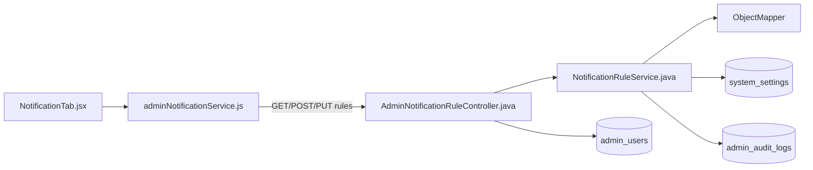
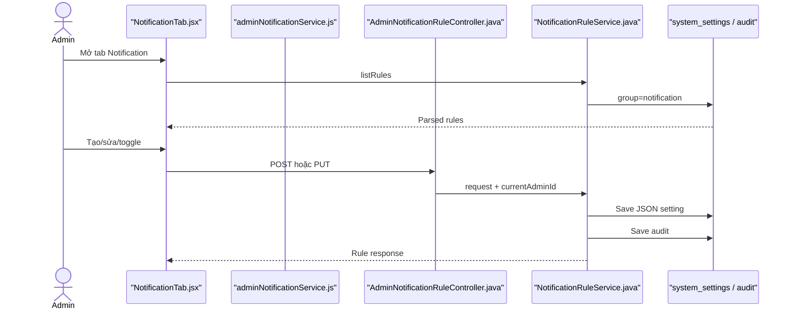

# Notification Rules Feature Analysis

## 1. Tóm tắt tổng quan

Notification Rules cho Admin liệt kê, tạo, sửa và bật/tắt quy tắc thông báo tự động trong tab Notification. Rule được serialize thành JSON và lưu trong `system_settings` với group `notification`; mọi create/update ghi Admin audit log.

## 2. Bản đồ cấu trúc

| File | Vai trò | Loại |
|---|---|---|
| [NotificationTab.jsx](apps/frontend/src/features/management/components/admin/settings/NotificationTab.jsx) | Danh sách, form và toggle rule | React Component |
| [adminNotificationService.js](apps/frontend/src/shared/api/adminNotificationService.js) | Rule REST client | API Service |
| [AdminNotificationRuleController.java](apps/backend/src/main/java/com/jlpt/feature/admin/AdminNotificationRuleController.java) | List/create/update endpoints | Controller |
| [NotificationRuleService.java](apps/backend/src/main/java/com/jlpt/shared/notification/service/NotificationRuleService.java) | Validate, JSON serialize và audit | Service |
| [NotificationRuleRequest.java](apps/backend/src/main/java/com/jlpt/shared/notification/dto/NotificationRuleRequest.java) | Rule input | DTO |
| [NotificationRuleResponse.java](apps/backend/src/main/java/com/jlpt/shared/notification/dto/NotificationRuleResponse.java) | Rule output | DTO |
| [SystemSetting.java](apps/backend/src/main/java/com/jlpt/feature/admin/SystemSetting.java) | Lưu JSON theo key | Entity |
| [SystemSettingRepository.java](apps/backend/src/main/java/com/jlpt/feature/admin/SystemSettingRepository.java) | Query notification group | Repository |
| [AdminAuditLogRepository.java](apps/backend/src/main/java/com/jlpt/feature/admin/AdminAuditLogRepository.java) | Lưu audit | Repository |

## 3. Bản đồ kết nối



| Từ | Đến | Cách kết nối | Dữ liệu |
|---|---|---|---|
| NotificationTab | API service | async call | rule form |
| API service | Controller | REST | ruleKey/payload |
| Controller | Service | method | request + adminId |
| Service | ObjectMapper | JSON | rule fields |
| Service | repositories | JPA | setting/audit |

## 4. Luồng xử lý theo trình tự

1. Tab mount gọi `listNotificationRules`.
2. Controller trả các setting thuộc group `notification`; JSON lỗi bị log và bỏ qua.
3. Create gửi ruleKey, enabled, condition, channel và template.
4. Service chặn trùng ruleKey, serialize fields và lưu `SystemSetting`.
5. Update dùng `ruleKey` từ path thay vì tin key trong body.
6. Toggle là update lại cùng rule với `isEnabled` đảo giá trị.
7. Create/update ghi audit kèm Admin actor.



## 5. Vai trò đoạn code quan trọng

[NotificationTab.jsx#L215](apps/frontend/src/features/management/components/admin/settings/NotificationTab.jsx#L215)

```jsx
async function handleSubmit(form) {
  // Validate L1 đã chạy trong RuleForm; tại đây chỉ chuẩn hóa description và gọi API.
  const payload = { ...form, description: form.description.trim() };
  if (editing.mode === 'create') {
    // Create dùng ruleKey mới; backend sẽ chặn duplicate.
    await createNotificationRule(payload);
  } else {
    // Update lấy ruleKey từ URL path.
    await updateNotificationRule(form.ruleKey, payload);
  }
}
```

[NotificationRuleService.java#L49](apps/backend/src/main/java/com/jlpt/shared/notification/service/NotificationRuleService.java#L49)

```java
public NotificationRuleResponse createRule(NotificationRuleRequest req, Long adminId) {
    if (settingRepository.existsBySettingGroupAndSettingKey(NOTIFICATION_GROUP, req.getRuleKey())) {
        throw new BusinessException(400, "DUPLICATE_RULE_KEY",
                "Rule key đã tồn tại: " + req.getRuleKey());
    }
    // Toàn bộ cấu hình rule được đóng thành JSON trong một setting.
    String jsonValue = buildJson(req);
    SystemSetting setting = SystemSetting.builder()
            .settingGroup(NOTIFICATION_GROUP)
            .settingKey(req.getRuleKey())
            .settingValue(jsonValue)
            .valueType(SystemSetting.ValueType.STRING)
            .isEditable(true)
            .updatedBy(admin)
            .build();
    settingRepository.save(setting);
}
```

## 6. Dữ liệu di chuyển

Form fields → `NotificationRuleRequest` → JSON map → `system_settings.setting_value` → parse JSON → `NotificationRuleResponse` → table/toggle UI.

## 7. Bảng tra cứu tổng hợp

| Bước | File | Function | Kết nối tới | Dữ liệu | Ghi chú |
|---:|---|---|---|---|---|
| 1 | NotificationTab | `fetchRules` | API | none | List |
| 2 | Controller | `list` | Service | none | Admin only |
| 3 | Tab | `handleSubmit` | POST/PUT | form | Create/update |
| 4 | Service | `createRule` | settings repo | JSON | Duplicate guard |
| 5 | Service | `updateRule` | settings/audit | path key | Audit |

## 8. Các mục cần bổ sung context

- Source quản lý cấu hình rule nhưng không cho thấy một scheduler tổng quát tự động đọc và thực thi tất cả rule này.
- Không có endpoint delete rule trong controller hiện tại.
