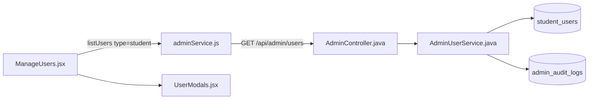
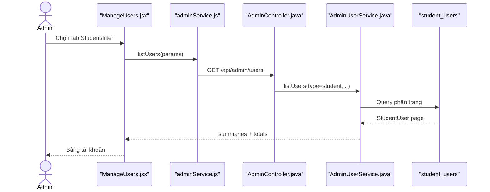

# Manage Student Accounts Feature Analysis

## 1. Tóm tắt tổng quan

Admin quản lý tài khoản Student trong trang `/admin/users` với tab `student`: tìm kiếm, lọc trạng thái/JLPT, xem danh sách và gọi các hành động quản trị. Luồng này tập trung vào list/detail/update Student; suspend/activate được tách thành tài liệu riêng.

## 2. Bản đồ cấu trúc

| File | Vai trò | Loại |
|---|---|---|
| [ManageUsers.jsx](apps/frontend/src/features/management/admin/ManageUsers.jsx) | UI quản lý Student/Staff/Admin | React Page |
| [UserModals.jsx](apps/frontend/src/features/management/components/admin/UserModals.jsx) | Các modal xác nhận/thao tác | Component |
| [adminService.js](apps/frontend/src/shared/api/adminService.js) | API client quản lý user | API Service |
| [AdminController.java](apps/backend/src/main/java/com/jlpt/feature/admin/AdminController.java) | REST endpoints `/api/admin/users` | Controller |
| [AdminUserService.java](apps/backend/src/main/java/com/jlpt/feature/admin/AdminUserService.java) | Query, map DTO và mutation user | Service |
| [StudentUserRepository.java](apps/backend/src/main/java/com/jlpt/feature/student/StudentUserRepository.java) | Truy vấn Student | Repository |
| [UserSummaryResponse.java](apps/backend/src/main/java/com/jlpt/feature/admin/dto/response/UserSummaryResponse.java) | Dữ liệu hàng trong bảng | DTO |
| [AdminAuditLog.java](apps/backend/src/main/java/com/jlpt/feature/admin/AdminAuditLog.java) | Audit hành động Admin | Entity |

## 3. Bản đồ kết nối



| Từ | Đến | Cách kết nối | Dữ liệu |
|---|---|---|---|
| ManageUsers | adminService | function | type/filter/page |
| adminService | AdminController | HTTP | query/body |
| Controller | AdminUserService | method | normalized type |
| Service | Student repository | JPA | StudentUser |
| Service | audit log | JPA save | actor/action/target |

## 4. Luồng xử lý theo trình tự

1. `ManageUsers` mặc định `activeType='student'`.
2. `buildParams` tạo `type`, `q`, `status`, `jlptLevel`, page/size.
3. `adminService.listUsers` gửi `GET /api/admin/users`.
4. `AdminController.listUsers` chuyển filter sang `AdminUserService.listUsers`.
5. Service chọn repository theo type, map thành summary DTO và trả page metadata.
6. UI render bảng, badges và mở modal cho hành động tiếp theo.



## 5. Vai trò đoạn code quan trọng

[ManageUsers.jsx#L80](apps/frontend/src/features/management/admin/ManageUsers.jsx#L80)

```jsx
function buildParams(page) {
  // activeType quyết định backend query bảng Student, Staff hay Admin.
  const params = { type: activeType, page: page - 1, size: PAGE_SIZE };
  if (debouncedSearch) params.q = debouncedSearch;
  if (statusFilter) params.status = statusFilter;
  if (activeType === 'student' && jlptFilter) params.jlptLevel = jlptFilter;
  return params;
}
```

[adminService.js#L5](apps/frontend/src/shared/api/adminService.js#L5)

```js
export async function listUsers({ type, q, status, jlptLevel, staffRole, page = 0, size = 20 } = {}) {
  const params = { type, page, size };
  // Chỉ thêm filter có giá trị để backend phân biệt "không lọc".
  if (q) params.q = q;
  if (status) params.status = status;
  if (jlptLevel) params.jlptLevel = jlptLevel;
  const res = await api.get('/admin/users', { params });
  return res.data.data;
}
```

## 6. Dữ liệu di chuyển

UI filter → query params → service chọn `student` → repository page → `UserSummaryResponse` → `{content,totalElements,totalPages}` → bảng Admin.

## 7. Bảng tra cứu tổng hợp

| Bước | File | Function | Kết nối tới | Dữ liệu | Ghi chú |
|---:|---|---|---|---|---|
| 1 | `ManageUsers` | `buildParams` | API | filters | Student tab |
| 2 | `adminService` | `listUsers` | Controller | query params | JWT Admin |
| 3 | `AdminController` | `listUsers` | Service | type/filter | API entry |
| 4 | `AdminUserService` | `listUsers` | Student repo | pageable | Map DTO |
| 5 | `ManageUsers` | render | Admin | summaries | Table |

## 8. Các mục cần bổ sung context

- Suspend/Activate được mô tả riêng trong `suspend-activate-account-feature-analysis.md`.
- UI dùng chung một trang cho ba loại user; tài liệu này chỉ theo nhánh Student.

<!-- BACKEND-METHOD-INVENTORY:START -->

## Phụ lục — Danh mục đầy đủ hàm backend

> Phần này được đối chiếu trực tiếp từ source backend hiện tại. Chỉ liệt kê các hàm khai báo tường minh trong những file Java mà tài liệu này tham chiếu; các hàm do Lombok/JPA sinh tự động không xuất hiện trong source nên không liệt kê.

### `AdminController`

Nguồn: [AdminController.java](../../../apps/backend/src/main/java/com/jlpt/feature/admin/AdminController.java)

| # | Hàm backend (đầy đủ chữ ký) | Endpoint | Tác dụng/chức năng phục vụ |
|---:|---|---|---|
| 1 | [`ResponseEntity<ApiResponse<Object>> getUserDetail(@PathVariable String type, @PathVariable Long userId)`](../../../apps/backend/src/main/java/com/jlpt/feature/admin/AdminController.java#L73) | `GET /users/{type}/{userId}` | Xử lý endpoint `GET /users/{type}/{userId}`; thực hiện nghiệp vụ `get user detail`. |
| 2 | [`ResponseEntity<ApiResponse<CreateStaffResponse>> createStaff(Authentication auth, @Valid @RequestBody CreateStaffRequest request)`](../../../apps/backend/src/main/java/com/jlpt/feature/admin/AdminController.java#L81) | `POST /staff` | Xử lý endpoint `POST /staff`; thực hiện nghiệp vụ `create staff`. |
| 3 | [`ResponseEntity<ApiResponse<Object>> updateStudent(Authentication auth, @PathVariable Long userId, @Valid @RequestBody UpdateStudentRequest request)`](../../../apps/backend/src/main/java/com/jlpt/feature/admin/AdminController.java#L91) | `PUT /users/student/{userId}` | Xử lý endpoint `PUT /users/student/{userId}`; thực hiện nghiệp vụ `update student`. |
| 4 | [`ResponseEntity<ApiResponse<Object>> updateStaff(Authentication auth, @PathVariable Long userId, @Valid @RequestBody UpdateStaffInfoRequest request)`](../../../apps/backend/src/main/java/com/jlpt/feature/admin/AdminController.java#L98) | `PUT /users/staff/{userId}` | Xử lý endpoint `PUT /users/staff/{userId}`; thực hiện nghiệp vụ `update staff`. |
| 5 | [`ResponseEntity<ApiResponse<SuspendUserResponse>> suspendUser(Authentication auth, @PathVariable String type, @PathVariable Long userId, @Valid @RequestBody SuspendUserRequest request)`](../../../apps/backend/src/main/java/com/jlpt/feature/admin/AdminController.java#L107) | `POST /users/{type}/{userId}/suspend` | Xử lý endpoint `POST /users/{type}/{userId}/suspend`; thực hiện nghiệp vụ `suspend user`. |
| 6 | [`ResponseEntity<ApiResponse<ActivateUserResponse>> activateUser(Authentication auth, @PathVariable String type, @PathVariable Long userId)`](../../../apps/backend/src/main/java/com/jlpt/feature/admin/AdminController.java#L119) | `POST /users/{type}/{userId}/activate` | Xử lý endpoint `POST /users/{type}/{userId}/activate`; thực hiện nghiệp vụ `activate user`. |
| 7 | [`ResponseEntity<ApiResponse<Void>> resetPassword(Authentication auth, @PathVariable String type, @PathVariable Long userId)`](../../../apps/backend/src/main/java/com/jlpt/feature/admin/AdminController.java#L128) | `POST /users/{type}/{userId}/reset-password` | Xử lý endpoint `POST /users/{type}/{userId}/reset-password`; thực hiện nghiệp vụ `reset password`. |
| 8 | [`ResponseEntity<ApiResponse<IssueTempPasswordResponse>> issueTempPassword(Authentication auth, @PathVariable Long staffId, @Valid @RequestBody IssueTempPasswordRequest request)`](../../../apps/backend/src/main/java/com/jlpt/feature/admin/AdminController.java#L144) | `POST /staff/{staffId}/issue-temp-password` | Xử lý endpoint `POST /staff/{staffId}/issue-temp-password`; thực hiện nghiệp vụ `issue temp password`. |
| 9 | [`ResponseEntity<ApiResponse<SoftDeleteUserResponse>> softDeleteUser(Authentication auth, @PathVariable String type, @PathVariable Long userId)`](../../../apps/backend/src/main/java/com/jlpt/feature/admin/AdminController.java#L153) | `DELETE /users/{type}/{userId}` | Xử lý endpoint `DELETE /users/{type}/{userId}`; thực hiện nghiệp vụ `soft delete user`. |
| 10 | [`ResponseEntity<ApiResponse<RestoreUserResponse>> restoreUser(Authentication auth, @PathVariable String type, @PathVariable Long userId)`](../../../apps/backend/src/main/java/com/jlpt/feature/admin/AdminController.java#L162) | `POST /users/{type}/{userId}/restore` | Xử lý endpoint `POST /users/{type}/{userId}/restore`; thực hiện nghiệp vụ `restore user`. |
| 11 | [`ResponseEntity<ApiResponse<ChangeStaffRoleResponse>> changeStaffRole(Authentication auth, @PathVariable Long staffId, @Valid @RequestBody ChangeStaffRoleRequest request)`](../../../apps/backend/src/main/java/com/jlpt/feature/admin/AdminController.java#L171) | `PUT /staff/{staffId}/role` | Xử lý endpoint `PUT /staff/{staffId}/role`; thực hiện nghiệp vụ `change staff role`. |

### `AdminUserService`

Nguồn: [AdminUserService.java](../../../apps/backend/src/main/java/com/jlpt/feature/admin/AdminUserService.java)

| # | Hàm backend (đầy đủ chữ ký) | Endpoint | Tác dụng/chức năng phục vụ |
|---:|---|---|---|
| 1 | [`Page<UserSummaryResponse> listUsers(String type, String q, String status, String jlptLevel, String staffRole, int page, int size)`](../../../apps/backend/src/main/java/com/jlpt/feature/admin/AdminUserService.java#L62) | `—` | Đọc hoặc tra cứu dữ liệu phục vụ `list users`. |
| 2 | [`Object getUserDetail(String type, Long userId)`](../../../apps/backend/src/main/java/com/jlpt/feature/admin/AdminUserService.java#L93) | `—` | Đọc hoặc tra cứu dữ liệu phục vụ `get user detail`. |
| 3 | [`yield toStudentDetail(s)`](../../../apps/backend/src/main/java/com/jlpt/feature/admin/AdminUserService.java#L100) | `—` | Biến đổi/tổng hợp dữ liệu nội bộ cho `to student detail`. |
| 4 | [`yield toStaffDetail(st)`](../../../apps/backend/src/main/java/com/jlpt/feature/admin/AdminUserService.java#L106) | `—` | Biến đổi/tổng hợp dữ liệu nội bộ cho `to staff detail`. |
| 5 | [`yield toAdminDetail(a)`](../../../apps/backend/src/main/java/com/jlpt/feature/admin/AdminUserService.java#L112) | `—` | Biến đổi/tổng hợp dữ liệu nội bộ cho `to admin detail`. |
| 6 | [`CreateStaffResponse createStaff(String adminEmail, CreateStaffRequest request)`](../../../apps/backend/src/main/java/com/jlpt/feature/admin/AdminUserService.java#L120) | `—` | Tạo hoặc ghi dữ liệu cho nghiệp vụ `create staff`. |
| 7 | [`void setupStaffPassword(com.jlpt.feature.staff.dto.request.StaffSetupPasswordRequest request)`](../../../apps/backend/src/main/java/com/jlpt/feature/admin/AdminUserService.java#L166) | `—` | Thực hiện xử lý backend `setup staff password` trong `AdminUserService`. |
| 8 | [`Object updateUser(String adminEmail, String type, Long userId, Object request)`](../../../apps/backend/src/main/java/com/jlpt/feature/admin/AdminUserService.java#L208) | `—` | Cập nhật trạng thái/dữ liệu cho nghiệp vụ `update user`. |
| 9 | [`yield toStudentDetail(s)`](../../../apps/backend/src/main/java/com/jlpt/feature/admin/AdminUserService.java#L237) | `—` | Biến đổi/tổng hợp dữ liệu nội bộ cho `to student detail`. |
| 10 | [`yield toStaffDetail(st)`](../../../apps/backend/src/main/java/com/jlpt/feature/admin/AdminUserService.java#L249) | `—` | Biến đổi/tổng hợp dữ liệu nội bộ cho `to staff detail`. |
| 11 | [`SuspendUserResponse suspendUser(String adminEmail, String type, Long userId, SuspendUserRequest request)`](../../../apps/backend/src/main/java/com/jlpt/feature/admin/AdminUserService.java#L259) | `—` | Cập nhật trạng thái/dữ liệu cho nghiệp vụ `suspend user`. |
| 12 | [`ActivateUserResponse activateUser(String adminEmail, String type, Long userId)`](../../../apps/backend/src/main/java/com/jlpt/feature/admin/AdminUserService.java#L336) | `—` | Cập nhật trạng thái/dữ liệu cho nghiệp vụ `activate user`. |
| 13 | [`void resetPassword(String adminEmail, String type, Long userId)`](../../../apps/backend/src/main/java/com/jlpt/feature/admin/AdminUserService.java#L403) | `—` | Thực hiện xử lý backend `reset password` trong `AdminUserService`. |
| 14 | [`SoftDeleteUserResponse softDeleteUser(String adminEmail, String type, Long userId)`](../../../apps/backend/src/main/java/com/jlpt/feature/admin/AdminUserService.java#L476) | `—` | Thực hiện xử lý backend `soft delete user` trong `AdminUserService`. |
| 15 | [`RestoreUserResponse restoreUser(String adminEmail, String type, Long userId)`](../../../apps/backend/src/main/java/com/jlpt/feature/admin/AdminUserService.java#L527) | `—` | Thực hiện xử lý backend `restore user` trong `AdminUserService`. |
| 16 | [`ChangeStaffRoleResponse changeStaffRole(String adminEmail, Long staffId, ChangeStaffRoleRequest request)`](../../../apps/backend/src/main/java/com/jlpt/feature/admin/AdminUserService.java#L575) | `—` | Cập nhật trạng thái/dữ liệu cho nghiệp vụ `change staff role`. |
| 17 | [`String normalizeType(String type)`](../../../apps/backend/src/main/java/com/jlpt/feature/admin/AdminUserService.java#L611) | `—` | Thực hiện xử lý backend `normalize type` trong `AdminUserService`. |
| 18 | [`AdminUser resolveAdmin(String email)`](../../../apps/backend/src/main/java/com/jlpt/feature/admin/AdminUserService.java#L616) | `—` | Biến đổi/tổng hợp dữ liệu nội bộ cho `resolve admin`. |
| 19 | [`void checkSelfModification(Long actorAdminId, String type, Long targetId)`](../../../apps/backend/src/main/java/com/jlpt/feature/admin/AdminUserService.java#L623) | `—` | Kiểm tra điều kiện/trạng thái phục vụ `check self modification`. |
| 20 | [`void auditLog(AdminUser actor, String action, String targetTable, Long targetId, String description)`](../../../apps/backend/src/main/java/com/jlpt/feature/admin/AdminUserService.java#L629) | `—` | Thực hiện xử lý backend `audit log` trong `AdminUserService`. |
| 21 | [`String generateUrlSafeToken(int bytes)`](../../../apps/backend/src/main/java/com/jlpt/feature/admin/AdminUserService.java#L639) | `—` | Thực hiện xử lý backend `generate url safe token` trong `AdminUserService`. |
| 22 | [`UserSummaryResponse toStudentSummary(StudentUser s)`](../../../apps/backend/src/main/java/com/jlpt/feature/admin/AdminUserService.java#L647) | `—` | Biến đổi/tổng hợp dữ liệu nội bộ cho `to student summary`. |
| 23 | [`UserSummaryResponse toStaffSummary(StaffUser st)`](../../../apps/backend/src/main/java/com/jlpt/feature/admin/AdminUserService.java#L663) | `—` | Biến đổi/tổng hợp dữ liệu nội bộ cho `to staff summary`. |
| 24 | [`UserSummaryResponse toAdminSummary(AdminUser a)`](../../../apps/backend/src/main/java/com/jlpt/feature/admin/AdminUserService.java#L675) | `—` | Biến đổi/tổng hợp dữ liệu nội bộ cho `to admin summary`. |
| 25 | [`StudentDetailResponse toStudentDetail(StudentUser s)`](../../../apps/backend/src/main/java/com/jlpt/feature/admin/AdminUserService.java#L686) | `—` | Biến đổi/tổng hợp dữ liệu nội bộ cho `to student detail`. |
| 26 | [`StaffDetailResponse toStaffDetail(StaffUser st)`](../../../apps/backend/src/main/java/com/jlpt/feature/admin/AdminUserService.java#L708) | `—` | Biến đổi/tổng hợp dữ liệu nội bộ cho `to staff detail`. |
| 27 | [`AdminDetailResponse toAdminDetail(AdminUser a)`](../../../apps/backend/src/main/java/com/jlpt/feature/admin/AdminUserService.java#L721) | `—` | Biến đổi/tổng hợp dữ liệu nội bộ cho `to admin detail`. |

### `StudentUserRepository`

Nguồn: [StudentUserRepository.java](../../../apps/backend/src/main/java/com/jlpt/feature/student/StudentUserRepository.java)

| # | Hàm backend (đầy đủ chữ ký) | Endpoint | Tác dụng/chức năng phục vụ |
|---:|---|---|---|
| 1 | [`Optional<StudentUser> findByEmail(String email)`](../../../apps/backend/src/main/java/com/jlpt/feature/student/StudentUserRepository.java#L15) | `—` | Đọc hoặc tra cứu dữ liệu phục vụ `find by email`. |
| 2 | [`boolean existsByEmail(String email)`](../../../apps/backend/src/main/java/com/jlpt/feature/student/StudentUserRepository.java#L17) | `—` | Kiểm tra điều kiện/trạng thái phục vụ `exists by email`. |

**Tổng cộng:** `40` hàm backend trong `5` file Java được tham chiếu.

<!-- BACKEND-METHOD-INVENTORY:END -->
